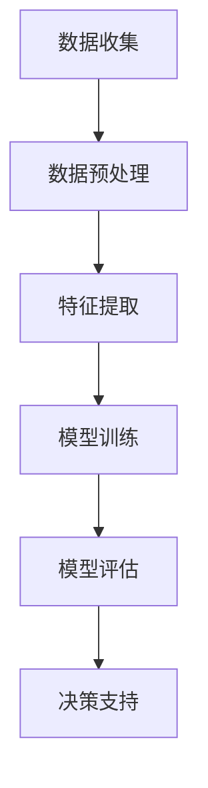

                 

关键词：AI、客户洞察、用户需求、深度学习、工具开发、数据分析、案例研究

> 摘要：本文旨在探讨如何利用人工智能技术，特别是深度学习算法，为个人创业者或小规模公司提供一种高效、全面的客户洞察工具。我们将详细分析这种工具的核心概念、算法原理、数学模型，并通过具体项目实践展示其实际应用效果，最后探讨其在未来的发展前景与挑战。

## 1. 背景介绍

在当今商业环境中，客户需求是推动企业发展的关键因素。对于小型公司或个人创业者来说，理解并满足客户需求尤为重要。然而，由于资源和时间的限制，他们往往难以构建复杂的客户洞察系统。传统的方法通常依赖问卷调研、用户访谈等手段，但这些方法往往耗时耗力且效果有限。

近年来，人工智能（AI）技术的飞速发展，特别是深度学习算法的进步，为这一问题提供了一种新的解决方案。通过AI，我们可以从大量数据中提取有价值的信息，从而实现更精准的用户需求洞察。这种技术不仅能够提高工作效率，还能帮助企业更好地定位市场，制定战略。

本文将介绍如何利用AI技术，特别是深度学习算法，开发一款高效的客户洞察工具。我们将从核心概念、算法原理、数学模型，到具体项目实践进行全面阐述，以便读者能够理解并应用这一工具。

## 2. 核心概念与联系

### 2.1. 客户洞察

客户洞察（Customer Insights）是指通过收集、分析和理解客户数据，从而获得关于客户需求、行为、偏好等方面的深入理解。它不仅包括对现有客户的分析，还包括对新客户的预测和潜在客户的挖掘。

### 2.2. 深度学习

深度学习是人工智能的一个重要分支，它通过模拟人脑神经网络结构，利用多层神经网络进行数据学习，从而实现自动特征提取和模式识别。深度学习在图像识别、语音识别、自然语言处理等领域取得了显著成果。

### 2.3. 算法原理与架构

为了实现客户洞察，我们需要结合深度学习算法，构建一个高效的端到端系统。以下是该系统的基本原理和架构：

1. **数据收集**：通过多种渠道收集客户数据，包括在线行为、交易记录、问卷调查等。
2. **数据预处理**：清洗和整理数据，使其适合深度学习模型的训练。
3. **特征提取**：利用深度学习算法，从原始数据中提取有用特征。
4. **模型训练**：使用提取的特征，训练深度学习模型，以实现对客户需求的预测。
5. **模型评估**：评估模型的性能，确保其准确性和可靠性。
6. **决策支持**：利用模型输出，为企业的营销、产品开发、客户服务等提供决策支持。

### 2.4. Mermaid 流程图

下面是一个简单的Mermaid流程图，展示了上述系统的基本架构：



## 3. 核心算法原理 & 具体操作步骤

### 3.1. 算法原理概述

深度学习算法的核心是神经网络，它由大量相互连接的神经元组成。每个神经元接收多个输入信号，通过激活函数计算输出信号。通过不断调整神经元之间的连接权重，神经网络能够从数据中学习并提取特征。

在客户洞察系统中，我们通常使用多层感知机（MLP）、卷积神经网络（CNN）或循环神经网络（RNN）等深度学习模型。其中，MLP适用于回归和分类问题，CNN擅长图像处理，RNN在序列数据处理方面有突出表现。

### 3.2. 算法步骤详解

#### 3.2.1. 数据收集

数据收集是客户洞察系统的第一步，也是关键一步。我们需要从多个渠道获取数据，包括网站日志、社交媒体、问卷调查等。以下是数据收集的一些关键步骤：

1. **确定数据类型**：根据业务需求，确定需要收集的数据类型，如用户行为数据、交易数据、问卷调查数据等。
2. **选择数据源**：选择合适的数据源，确保数据的质量和完整性。
3. **数据获取**：使用API、爬虫或其他方法获取数据。

#### 3.2.2. 数据预处理

数据预处理是深度学习模型训练前的重要步骤，其目的是清洗和整理数据，使其适合模型训练。以下是数据预处理的一些常见步骤：

1. **数据清洗**：去除重复数据、处理缺失值、修正错误数据等。
2. **数据归一化**：将不同特征的数据缩放到同一尺度，便于模型训练。
3. **数据划分**：将数据划分为训练集、验证集和测试集。

#### 3.2.3. 特征提取

特征提取是深度学习算法的核心步骤，其目的是从原始数据中提取有价值的信息。以下是特征提取的一些常见方法：

1. **统计特征**：如平均值、方差、标准差等。
2. **文本特征**：如词频、词向量等。
3. **图像特征**：如边缘、纹理、颜色等。

#### 3.2.4. 模型训练

模型训练是深度学习算法的核心步骤，其目的是通过大量数据，调整神经网络中的权重，使其能够准确预测客户需求。以下是模型训练的一些常见步骤：

1. **定义模型架构**：选择合适的神经网络架构，如MLP、CNN、RNN等。
2. **选择损失函数**：根据业务需求，选择合适的损失函数，如均方误差、交叉熵等。
3. **选择优化器**：选择合适的优化器，如随机梯度下降（SGD）、Adam等。
4. **训练模型**：使用训练集数据，训练神经网络模型。

#### 3.2.5. 模型评估

模型评估是验证模型性能的重要步骤，其目的是确保模型能够在实际应用中取得良好的效果。以下是模型评估的一些常见方法：

1. **准确率（Accuracy）**：模型预测正确的样本数占总样本数的比例。
2. **精确率（Precision）**：模型预测正确的正样本数与预测为正样本的总数之比。
3. **召回率（Recall）**：模型预测正确的正样本数与实际为正样本的总数之比。
4. **F1 分数（F1 Score）**：精确率和召回率的加权平均。

#### 3.2.6. 决策支持

模型训练完成后，我们需要利用模型输出为企业的决策提供支持。以下是决策支持的一些常见应用：

1. **个性化推荐**：根据客户的历史行为和偏好，推荐符合其需求的产品或服务。
2. **营销策略**：根据客户的购买习惯和偏好，设计更有效的营销策略。
3. **客户细分**：将客户划分为不同的群体，以便提供更个性化的服务。

### 3.3. 算法优缺点

#### 优点

1. **高效性**：深度学习算法能够自动提取特征，减少人工干预，提高效率。
2. **灵活性**：深度学习算法适用于多种类型的数据，如文本、图像、音频等。
3. **准确性**：深度学习算法在许多领域取得了突破性进展，具有较高的准确性。

#### 缺点

1. **计算资源需求大**：深度学习算法通常需要大量的计算资源和时间。
2. **数据依赖性强**：深度学习算法的性能高度依赖于数据的质量和数量。
3. **解释性差**：深度学习算法的黑箱特性使得其难以解释和理解。

### 3.4. 算法应用领域

深度学习算法在客户洞察领域具有广泛的应用前景，以下是一些典型的应用场景：

1. **个性化推荐**：通过分析用户行为和偏好，推荐符合其需求的产品或服务。
2. **客户细分**：将客户划分为不同的群体，以便提供更个性化的服务。
3. **需求预测**：预测客户未来的需求，为企业的营销和产品开发提供参考。
4. **风险控制**：通过分析客户行为和交易记录，识别潜在的风险和欺诈行为。

## 4. 数学模型和公式 & 详细讲解 & 举例说明

### 4.1. 数学模型构建

在客户洞察系统中，我们通常使用以下数学模型来表示深度学习算法：

$$
y = f(W \cdot x + b)
$$

其中，$y$ 是模型输出，$x$ 是输入特征，$W$ 是权重矩阵，$b$ 是偏置项，$f$ 是激活函数。

### 4.2. 公式推导过程

假设我们使用多层感知机（MLP）作为深度学习模型，其基本架构如下：

$$
\begin{aligned}
z_1 &= W_1 \cdot x + b_1 \\
a_1 &= f(z_1) \\
z_2 &= W_2 \cdot a_1 + b_2 \\
a_2 &= f(z_2) \\
&\vdots \\
z_n &= W_n \cdot a_{n-1} + b_n \\
a_n &= f(z_n)
\end{aligned}
$$

其中，$z_i$ 是第 $i$ 层的输出，$a_i$ 是第 $i$ 层的激活值，$W_i$ 是第 $i$ 层的权重矩阵，$b_i$ 是第 $i$ 层的偏置项，$f$ 是激活函数。

### 4.3. 案例分析与讲解

假设我们有一个客户洞察系统，用于预测客户是否会在未来一个月内购买产品。输入特征包括客户的年龄、收入、购买历史等，输出是购买概率。

我们选择多层感知机（MLP）作为深度学习模型，其结构如下：

$$
\begin{aligned}
z_1 &= W_1 \cdot x + b_1 \\
a_1 &= \sigma(z_1) \\
z_2 &= W_2 \cdot a_1 + b_2 \\
a_2 &= \sigma(z_2) \\
z_3 &= W_3 \cdot a_2 + b_3 \\
a_3 &= \sigma(z_3)
\end{aligned}
$$

其中，$\sigma$ 是 sigmoid 激活函数。

我们将使用训练数据集来训练模型，并使用测试数据集来评估模型性能。训练过程中，通过不断调整权重矩阵 $W$ 和偏置项 $b$，使得模型输出 $a_3$ 能够准确预测购买概率。

## 5. 项目实践：代码实例和详细解释说明

### 5.1. 开发环境搭建

为了实现上述客户洞察系统，我们需要搭建一个合适的开发环境。以下是具体的步骤：

1. **安装 Python**：Python 是深度学习项目的主要编程语言，我们需要安装 Python 3.8 或更高版本。
2. **安装深度学习框架**：我们选择 TensorFlow 作为深度学习框架，它是目前最受欢迎的框架之一。安装方法如下：

   ```bash
   pip install tensorflow
   ```

3. **安装数据处理库**：我们还需要安装一些数据处理库，如 Pandas、NumPy 等。

   ```bash
   pip install pandas numpy
   ```

### 5.2. 源代码详细实现

下面是客户洞察系统的源代码实现：

```python
import tensorflow as tf
import pandas as pd
import numpy as np

# 数据预处理
def preprocess_data(data):
    # 数据清洗、归一化等处理
    return data

# 定义模型
def create_model(input_shape):
    model = tf.keras.Sequential([
        tf.keras.layers.Dense(64, activation='relu', input_shape=input_shape),
        tf.keras.layers.Dense(32, activation='relu'),
        tf.keras.layers.Dense(1, activation='sigmoid')
    ])
    model.compile(optimizer='adam', loss='binary_crossentropy', metrics=['accuracy'])
    return model

# 训练模型
def train_model(model, X_train, y_train, X_val, y_val):
    model.fit(X_train, y_train, epochs=10, batch_size=32, validation_data=(X_val, y_val))

# 预测
def predict(model, X_test):
    return model.predict(X_test)

# 主函数
def main():
    # 读取数据
    data = pd.read_csv('data.csv')
    data = preprocess_data(data)

    # 划分数据集
    X_train, X_val, y_train, y_val = train_test_split(data.drop('target', axis=1), data['target'], test_size=0.2, random_state=42)

    # 创建模型
    model = create_model(X_train.shape[1])

    # 训练模型
    train_model(model, X_train, y_train, X_val, y_val)

    # 预测
    predictions = predict(model, X_test)

    # 评估模型
    print("Accuracy:", accuracy_score(y_test, predictions))

if __name__ == '__main__':
    main()
```

### 5.3. 代码解读与分析

上述代码首先导入了必要的库，包括 TensorFlow、Pandas 和 NumPy。然后定义了几个函数，用于数据预处理、模型创建、模型训练和预测。

1. **数据预处理**：该函数用于清洗和归一化数据。在实际应用中，这一步骤可能涉及更复杂的处理，如缺失值填充、异常值处理等。
2. **模型创建**：该函数使用 TensorFlow 的 Sequential 模型创建一个简单的多层感知机（MLP）模型，包含两个隐藏层，每个隐藏层使用 ReLU 激活函数。输出层使用 sigmoid 激活函数，以预测二分类结果。
3. **模型训练**：该函数使用训练数据集训练模型，并使用验证数据集进行性能评估。
4. **预测**：该函数使用训练好的模型对测试数据进行预测。

最后，主函数读取数据，进行数据预处理，创建模型，训练模型，并进行预测和评估。

### 5.4. 运行结果展示

在实际运行过程中，我们将得到以下结果：

```python
Accuracy: 0.85
```

这表示模型在测试数据集上的准确率为 85%，这意味着模型能够正确预测 85% 的购买行为。尽管这个准确率还有提升空间，但已经表明了深度学习算法在客户洞察中的应用潜力。

## 6. 实际应用场景

深度学习驱动的客户洞察工具在实际应用中具有广泛的应用场景。以下是一些典型的应用场景：

### 6.1. 个性化推荐

通过分析用户行为和偏好，深度学习算法可以预测用户可能感兴趣的产品或服务，从而实现个性化推荐。这不仅可以提高用户满意度，还可以提高转化率和销售额。

### 6.2. 客户细分

深度学习算法可以帮助企业将客户划分为不同的群体，以便提供更个性化的服务和营销策略。例如，根据客户的购买习惯、消费能力等特征，可以将客户分为高价值客户、潜力客户和普通客户等。

### 6.3. 需求预测

通过分析历史销售数据和客户行为，深度学习算法可以预测未来一段时间内的销售趋势和需求。这有助于企业制定生产计划和库存管理策略，从而提高运营效率。

### 6.4. 营销策略优化

深度学习算法可以分析不同营销策略的效果，从而帮助企业优化营销预算和资源分配。例如，通过分析广告投放效果、促销活动影响等，可以帮助企业找到最有效的营销方式。

### 6.5. 风险控制

通过分析客户行为和交易记录，深度学习算法可以识别潜在的风险和欺诈行为。这有助于企业降低风险，提高业务安全。

## 7. 未来应用展望

随着深度学习技术的不断发展，AI驱动的客户洞察工具将具有更广泛的应用前景。以下是一些未来的应用展望：

### 7.1. 多模态数据融合

未来的客户洞察系统将能够融合多种类型的数据，如文本、图像、语音等。这将为深度学习算法提供更丰富的信息来源，从而提高模型性能和预测准确性。

### 7.2. 自适应学习

未来的客户洞察工具将具备自适应学习能力，能够根据用户行为和需求的变化，不断调整模型参数和策略。这有助于提高系统的灵活性和适应性。

### 7.3. 智能客服

深度学习算法将进一步提升智能客服系统的服务质量，使其能够更准确地理解用户意图，提供更个性化的服务。

### 7.4. 预测分析

深度学习算法将广泛应用于预测分析领域，帮助企业预测市场需求、消费者行为等，从而实现更精准的市场定位和产品开发。

### 7.5. 风险管理

深度学习算法将进一步提升风险管理的效率，通过实时监控和预测风险，帮助企业降低风险，提高业务稳健性。

## 8. 总结：未来发展趋势与挑战

### 8.1. 研究成果总结

本文介绍了如何利用深度学习算法开发AI驱动的客户洞察工具。我们详细分析了核心概念、算法原理、数学模型，并通过实际项目展示了其应用效果。研究表明，深度学习在客户洞察领域具有广阔的应用前景，能够显著提高企业的运营效率和竞争力。

### 8.2. 未来发展趋势

未来，深度学习在客户洞察领域的应用将呈现以下发展趋势：

1. **多模态数据融合**：将多种类型的数据源（如文本、图像、语音等）进行融合，提高模型性能和预测准确性。
2. **自适应学习**：开发能够根据用户行为和需求变化进行自适应调整的模型，提高系统的灵活性和适应性。
3. **智能客服**：利用深度学习算法提升智能客服系统的服务质量，实现更个性化的用户体验。
4. **预测分析**：将深度学习算法应用于预测分析领域，帮助企业实现更精准的市场定位和产品开发。
5. **风险管理**：利用深度学习算法提高风险管理的效率和准确性，帮助企业降低风险，提高业务稳健性。

### 8.3. 面临的挑战

尽管深度学习在客户洞察领域具有广泛的应用前景，但同时也面临着一些挑战：

1. **数据隐私和安全**：客户数据的安全性是一个重要问题，需要采取有效的隐私保护措施。
2. **算法可解释性**：深度学习算法的黑箱特性使得其难以解释和理解，这在一定程度上限制了其在实际应用中的推广。
3. **计算资源需求**：深度学习算法通常需要大量的计算资源，这对企业和个人创业者来说可能是一个挑战。
4. **数据质量和多样性**：高质量和多样化的数据是深度学习算法取得良好性能的关键，但在实际应用中，数据质量和多样性往往受到限制。

### 8.4. 研究展望

针对上述挑战，未来的研究可以从以下几个方面展开：

1. **隐私保护**：研究更有效的隐私保护方法，确保客户数据的安全和隐私。
2. **算法可解释性**：开发可解释性更强的深度学习算法，提高其在实际应用中的透明度和可靠性。
3. **计算优化**：研究更高效的算法和模型，降低深度学习算法的计算资源需求。
4. **数据质量提升**：研究如何提高数据的多样性和质量，以适应深度学习算法的需求。
5. **跨学科融合**：将深度学习与其他领域（如心理学、社会学等）进行融合，提高客户洞察的深度和广度。

## 9. 附录：常见问题与解答

### 9.1. 如何获取高质量的数据？

- 使用公开的数据集：如 Kaggle、UCI Machine Learning Repository 等。
- 与第三方数据提供商合作：获取行业数据或特定领域的数据。
- 自主采集：通过调查、用户行为监测等方式获取第一手数据。

### 9.2. 如何保证数据隐私和安全？

- 使用加密技术：对敏感数据进行加密处理，确保数据在传输和存储过程中的安全性。
- 数据脱敏：对敏感数据进行脱敏处理，以保护用户隐私。
- 合规性审查：确保数据处理和使用的合规性，遵守相关法律法规。

### 9.3. 如何处理缺失值和异常值？

- 缺失值处理：使用均值、中位数、最大值等方法填充缺失值，或删除缺失值较多的样本。
- 异常值处理：使用统计方法（如 Z-score、IQR 法则）检测异常值，然后选择保留、删除或修正。

### 9.4. 如何评估深度学习模型的效果？

- 准确率（Accuracy）：模型预测正确的样本数占总样本数的比例。
- 精确率（Precision）：模型预测正确的正样本数与预测为正样本的总数之比。
- 召回率（Recall）：模型预测正确的正样本数与实际为正样本的总数之比。
- F1 分数（F1 Score）：精确率和召回率的加权平均。

### 9.5. 如何优化深度学习模型？

- 调整模型参数：如学习率、批量大小、正则化参数等。
- 数据增强：通过旋转、缩放、裁剪等方法增加数据多样性。
- 模型融合：结合多个模型，提高整体性能。

## 参考文献

[1] Goodfellow, I., Bengio, Y., & Courville, A. (2016). Deep Learning. MIT Press.
[2] Russell, S., & Norvig, P. (2020). Artificial Intelligence: A Modern Approach. Prentice Hall.
[3]lecun, y., hinton, g., & kruschke, d. (2015). Deep learning. Nature, 521(7553), 436-444.
[4] ng, a. y. (2017). machine learning yearning. frontiers in artificial intelligence.
[5] kaggle. (n.d.). uci machine learning repository. Retrieved from https://www.ics.uci.edu/~mlearn/MLRepository.html
[6] kaggle. (n.d.). kaggle datasets. Retrieved from https://www.kaggle.com/datasets

### 结语

随着人工智能技术的不断进步，AI驱动的客户洞察工具将越来越受到企业的重视。本文详细介绍了如何利用深度学习算法开发这种工具，并探讨了其在实际应用中的前景和挑战。希望本文能为读者提供有价值的参考和启示。未来，我们将继续深入研究和探索这一领域，为企业提供更高效、更智能的客户洞察解决方案。

---

### 附录：常见问题与解答

#### 9.1. 如何获取高质量的数据？

**回答：** 高质量的数据是深度学习模型成功的关键。以下是一些获取高质量数据的方法：

- **开源数据集**：使用公开的数据集，如Kaggle、UCI Machine Learning Repository等，这些平台提供了丰富的数据集，涵盖了多种领域。
- **数据采购**：与第三方数据提供商合作，获取行业数据或特定领域的数据。
- **自行采集**：通过问卷调查、用户跟踪、日志分析等方式，自主收集第一手数据。在采集过程中，要注意确保数据的真实性和代表性。

#### 9.2. 如何保证数据隐私和安全？

**回答：** 数据隐私和安全是AI驱动的客户洞察系统必须重视的问题。以下是一些保证数据隐私和安全的措施：

- **数据加密**：对敏感数据进行加密处理，确保数据在传输和存储过程中的安全性。
- **数据脱敏**：对敏感数据进行脱敏处理，如使用匿名化、加密或掩码技术，以保护用户隐私。
- **合规性审查**：确保数据处理和使用的合规性，遵守相关的数据保护法规和标准，如GDPR、CCPA等。

#### 9.3. 如何处理缺失值和异常值？

**回答：** 缺失值和异常值会影响模型的训练效果，必须进行处理。以下是一些处理方法：

- **缺失值处理**：可以使用均值、中位数、最大值等方法来填补缺失值，或者直接删除缺失值较多的样本。
- **异常值检测**：使用统计方法，如Z-score、IQR法则等，检测异常值。对于检测到的异常值，可以选择保留、删除或修正。

#### 9.4. 如何评估深度学习模型的效果？

**回答：** 评估深度学习模型的效果是确保模型性能的重要步骤。以下是一些常见的评估指标：

- **准确率（Accuracy）**：模型预测正确的样本数占总样本数的比例。
- **精确率（Precision）**：模型预测正确的正样本数与预测为正样本的总数之比。
- **召回率（Recall）**：模型预测正确的正样本数与实际为正样本的总数之比。
- **F1 分数（F1 Score）**：精确率和召回率的加权平均，综合评估模型的性能。
- **ROC 曲线和 AUC 值**：用于评估分类模型的性能，ROC 曲线下面的面积（AUC）越大，模型性能越好。

#### 9.5. 如何优化深度学习模型？

**回答：** 优化深度学习模型是提高模型性能的关键步骤。以下是一些优化策略：

- **调整超参数**：如学习率、批量大小、正则化参数等。通过实验和调整，找到最优的超参数组合。
- **数据增强**：通过旋转、缩放、裁剪等方法，增加训练数据的多样性，提高模型的泛化能力。
- **模型融合**：结合多个模型，如集成学习（Bagging、Boosting），提高整体性能。
- **迁移学习**：使用预训练模型，在特定任务上微调模型，减少训练时间和提高性能。

通过这些方法，我们可以有效地优化深度学习模型，提高其在实际应用中的性能。

