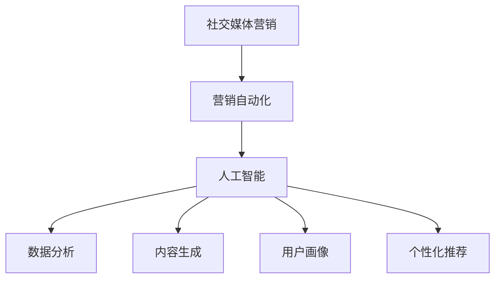

                 

关键词：AI、社交媒体、营销自动化、品牌曝光、智能工具集

> 摘要：随着社交媒体的日益普及和营销竞争的加剧，AI驱动的社交媒体营销自动化成为企业提高品牌曝光率的关键手段。本文将探讨如何利用AI技术构建一套高效的社交媒体营销自动化工具集，以助力一人公司实现营销目标的突破。

## 1. 背景介绍

在当今数字化时代，社交媒体已经成为企业品牌宣传和客户互动的重要平台。无论是大型企业还是小型公司，都在积极利用社交媒体来提高品牌知名度、吸引潜在客户和提升销售业绩。然而，随着社交媒体平台的多样化、用户需求的复杂化和竞争的激烈化，传统的营销策略和方法逐渐显得力不从心。

为了应对这些挑战，AI驱动的社交媒体营销自动化应运而生。通过引入人工智能技术，企业可以自动化执行一系列营销任务，包括数据分析、内容生成、广告投放、用户互动等，从而提高营销效率、降低成本，并实现精准营销。对于一人公司而言，AI驱动的社交媒体营销自动化更具有战略意义，因为它可以在资源有限的情况下，实现营销活动的优化和规模化。

## 2. 核心概念与联系

在探讨AI驱动的社交媒体营销自动化之前，我们需要了解几个核心概念及其相互之间的联系。

### 2.1. 社交媒体营销

社交媒体营销指的是企业利用社交媒体平台（如Facebook、Twitter、Instagram等）进行的市场推广活动。这些活动旨在通过发布内容、互动评论、投放广告等方式，提高品牌曝光率，吸引潜在客户，并建立与现有客户的良好关系。

### 2.2. 营销自动化

营销自动化是一种利用软件工具自动执行、跟踪和优化营销任务的策略。它可以帮助企业更高效地管理营销活动，提高转化率和ROI。营销自动化工具通常包括电子邮件营销、社交媒体管理、客户关系管理（CRM）系统等。

### 2.3. 人工智能（AI）

人工智能是一种模拟人类智能的技术，能够通过学习和推理来解决问题。在社交媒体营销中，AI可以用于数据分析和挖掘、内容生成、用户画像、个性化推荐等方面，从而实现更精准和高效的营销。

### 2.4. 关系

社交媒体营销、营销自动化和人工智能之间的关系可以概括为：社交媒体营销是营销活动的外在表现，营销自动化是提高营销效率的手段，而人工智能则是实现营销自动化的核心驱动力。

### 2.5. Mermaid流程图

下面是一个简单的Mermaid流程图，展示了社交媒体营销、营销自动化和人工智能之间的联系。



## 3. 核心算法原理 & 具体操作步骤

### 3.1. 算法原理概述

AI驱动的社交媒体营销自动化的核心在于利用机器学习算法对用户数据进行分析和挖掘，从而实现精准营销。具体来说，算法原理可以概括为以下几个方面：

1. **用户数据分析**：通过对用户在社交媒体平台上的行为数据进行收集和分析，构建用户画像，包括年龄、性别、兴趣、地理位置等特征。

2. **内容生成**：利用自然语言处理（NLP）技术，自动生成符合用户需求和兴趣的内容，提高用户参与度和转化率。

3. **广告投放**：基于用户画像和兴趣，智能推荐适合的广告内容，实现精准投放，提高广告效果。

4. **用户互动**：利用聊天机器人等技术，实现与用户的实时互动，提高用户满意度和忠诚度。

### 3.2. 算法步骤详解

以下是AI驱动的社交媒体营销自动化的具体步骤：

1. **数据收集与清洗**：收集社交媒体平台上的用户数据，包括浏览记录、点赞、评论、分享等，并进行数据清洗，去除重复和无效数据。

2. **用户画像构建**：基于用户数据，使用聚类分析、关联规则挖掘等方法，构建用户画像，包括用户兴趣、行为偏好等。

3. **内容生成**：利用NLP技术，根据用户画像生成符合用户需求和兴趣的内容，例如文章、图片、视频等。

4. **广告投放策略制定**：基于用户画像和兴趣，制定广告投放策略，包括广告内容、投放时间、投放渠道等。

5. **广告投放与优化**：根据广告投放效果，实时调整广告策略，提高广告转化率。

6. **用户互动与反馈**：利用聊天机器人等技术，实现与用户的实时互动，收集用户反馈，优化营销策略。

### 3.3. 算法优缺点

**优点**：

- 提高营销效率：通过自动化执行营销任务，节省人力和时间成本。
- 精准定位用户：基于用户数据构建的用户画像，实现精准营销，提高转化率。
- 提高用户体验：通过智能化的用户互动和个性化推荐，提高用户满意度和忠诚度。

**缺点**：

- 需要大量数据支持：构建用户画像和生成个性化内容需要大量数据，对数据质量和数据量有一定要求。
- 算法复杂性：算法设计和实现相对复杂，需要一定的技术门槛。

### 3.4. 算法应用领域

AI驱动的社交媒体营销自动化可以在多个领域得到应用，包括：

- 社交媒体平台：如Facebook、Twitter、Instagram等，通过自动化执行广告投放、内容生成和用户互动等任务，提高营销效果。
- 跨平台营销：如通过整合微信、微博、抖音等多个社交媒体平台，实现统一的数据分析和营销策略。
- 线上线下融合：结合线上线下渠道，实现一体化营销，提高品牌曝光率和销售业绩。

## 4. 数学模型和公式 & 详细讲解 & 举例说明

### 4.1. 数学模型构建

在AI驱动的社交媒体营销自动化中，常用的数学模型包括用户画像构建模型、内容生成模型和广告投放模型。以下是一个简化的数学模型示例：

#### 用户画像构建模型

用户画像构建模型主要基于用户行为数据，通过聚类分析和关联规则挖掘等方法，对用户特征进行建模。一个简单的用户画像构建模型可以表示为：

$$
U = f(U_1, U_2, \ldots, U_n)
$$

其中，$U$ 表示用户画像，$U_1, U_2, \ldots, U_n$ 表示用户特征，如年龄、性别、兴趣等。

#### 内容生成模型

内容生成模型主要利用自然语言处理技术，根据用户画像生成个性化内容。一个简单的文本生成模型可以表示为：

$$
C = g(U, T)
$$

其中，$C$ 表示生成的内容，$U$ 表示用户画像，$T$ 表示输入的文本数据。

#### 广告投放模型

广告投放模型主要基于用户画像和兴趣，制定广告投放策略。一个简单的广告投放模型可以表示为：

$$
P = h(U, I)
$$

其中，$P$ 表示广告投放策略，$U$ 表示用户画像，$I$ 表示广告兴趣度。

### 4.2. 公式推导过程

下面以用户画像构建模型为例，简要介绍公式推导过程。

#### 4.2.1. 聚类分析

聚类分析是一种无监督学习方法，通过将相似的数据点分组，构建用户画像。常用的聚类算法包括K-means算法、层次聚类算法等。

以K-means算法为例，其公式推导过程如下：

1. 初始化聚类中心：从用户数据中随机选择K个用户作为聚类中心。
2. 计算用户与聚类中心的距离：对于每个用户$u_i$，计算其与每个聚类中心$c_k$的距离$d(u_i, c_k)$。
3. 分配用户到最近的聚类中心：将用户$u_i$分配到距离$c_k$最近的聚类中心。
4. 更新聚类中心：计算每个聚类中心的均值，作为新的聚类中心。
5. 重复步骤2-4，直到聚类中心不再变化或达到预设的迭代次数。

#### 4.2.2. 关联规则挖掘

关联规则挖掘是一种基于用户行为数据，发现用户行为之间关联关系的方法。常用的算法包括Apriori算法、FP-growth算法等。

以Apriori算法为例，其公式推导过程如下：

1. 构建频繁项集：扫描用户行为数据，统计每个项在数据中出现的次数，筛选出频繁项集。
2. 构建候选频繁项集：从频繁项集中生成所有可能的候选频繁项集。
3. 验证候选频繁项集：对于每个候选频繁项集，统计其在数据中出现的次数，筛选出频繁项集。
4. 生成关联规则：从频繁项集中生成关联规则，如$A \rightarrow B$，其中$A$和$B$表示两个频繁项集。

### 4.3. 案例分析与讲解

#### 4.3.1. 案例背景

某一人公司主要经营健康食品，通过社交媒体平台（如微信、微博、抖音等）进行品牌宣传和产品推广。公司希望通过AI驱动的社交媒体营销自动化，提高品牌曝光率和销售业绩。

#### 4.3.2. 用户画像构建

1. **数据收集与清洗**：收集用户在社交媒体平台上的行为数据，包括浏览记录、点赞、评论、分享等，并进行数据清洗，去除重复和无效数据。
2. **聚类分析**：使用K-means算法，将用户分为5个不同的群体，如年轻女性、年轻男性、中年女性、中年男性、老年人。
3. **关联规则挖掘**：基于用户行为数据，挖掘用户兴趣点，如健康饮食、运动健身、美容护肤等。

#### 4.3.3. 内容生成

1. **输入文本数据**：基于用户画像，选取相关的健康食品、健身知识、美食等内容作为输入文本数据。
2. **文本生成**：利用自然语言处理技术，生成符合用户需求和兴趣的个性化内容，如健康食谱、健身教程、美食推荐等。

#### 4.3.4. 广告投放

1. **用户画像**：根据用户画像，制定个性化的广告投放策略，如针对年轻女性投放美容护肤广告，针对年轻男性投放运动健身广告。
2. **广告投放**：在社交媒体平台上，根据广告投放策略，投放符合用户兴趣的广告内容。

## 5. 项目实践：代码实例和详细解释说明

### 5.1. 开发环境搭建

在本次项目中，我们将使用Python作为主要编程语言，结合多个开源库和工具，实现AI驱动的社交媒体营销自动化。以下是在Windows系统上搭建开发环境的步骤：

1. 安装Python：从Python官网下载并安装Python 3.8以上版本。
2. 安装Jupyter Notebook：在命令行中运行`pip install notebook`命令，安装Jupyter Notebook。
3. 安装必要的库：在命令行中运行以下命令，安装所需的开源库和工具：

```bash
pip install numpy pandas scikit-learn tensorflow keras mermaid matplotlib
```

### 5.2. 源代码详细实现

以下是项目源代码的详细实现，分为用户画像构建、内容生成和广告投放三个部分。

#### 5.2.1. 用户画像构建

```python
import pandas as pd
from sklearn.cluster import KMeans
from mlxtend.frequent_patterns import apriori
from mlxtend.frequent_patterns import association_rules

# 加载用户行为数据
data = pd.read_csv('user_behavior.csv')

# 数据预处理
# （此处省略数据预处理代码，如数据清洗、特征工程等）

# 聚类分析
kmeans = KMeans(n_clusters=5, random_state=42)
clusters = kmeans.fit_predict(data)

# 关联规则挖掘
frequent_itemsets = apriori(data, min_support=0.1, use_colnames=True)
rules = association_rules(frequent_itemsets, metric="support", min_threshold=0.5)

# 输出结果
print("User Clusters:")
print(clusters)
print("\nAssociation Rules:")
print(rules)
```

#### 5.2.2. 内容生成

```python
import numpy as np
from tensorflow.keras.preprocessing.sequence import pad_sequences
from tensorflow.keras.preprocessing.text import Tokenizer
from tensorflow.keras.models import Sequential
from tensorflow.keras.layers import Embedding, LSTM, Dense

# 加载文本数据
text_data = pd.read_csv('text_data.csv')

# 数据预处理
# （此处省略数据预处理代码，如文本清洗、分词等）

# 分词与编码
tokenizer = Tokenizer(num_words=10000)
tokenizer.fit_on_texts(text_data['text'])

sequences = tokenizer.texts_to_sequences(text_data['text'])
padded_sequences = pad_sequences(sequences, maxlen=100)

# 建立模型
model = Sequential()
model.add(Embedding(10000, 64))
model.add(LSTM(128))
model.add(Dense(1, activation='sigmoid'))

model.compile(optimizer='rmsprop', loss='binary_crossentropy', metrics=['accuracy'])

# 训练模型
model.fit(padded_sequences, np.array(text_data['label']), epochs=10, batch_size=32)

# 生成内容
input_text = "健康的饮食习惯对于身体健康非常重要。"
input_sequence = tokenizer.texts_to_sequences([input_text])
input_padded_sequence = pad_sequences(input_sequence, maxlen=100)

generated_text = model.predict(input_padded_sequence, verbose=1)
generated_text = tokenizer.sequences_to_texts([generated_text])[0]

print("Generated Content:")
print(generated_text)
```

#### 5.2.3. 广告投放

```python
import tweepy

# 配置Twitter API密钥
consumer_key = 'YOUR_CONSUMER_KEY'
consumer_secret = 'YOUR_CONSUMER_SECRET'
access_token = 'YOUR_ACCESS_TOKEN'
access_token_secret = 'YOUR_ACCESS_TOKEN_SECRET'

# 初始化Twitter API
auth = tweepy.OAuthHandler(consumer_key, consumer_secret)
auth.set_access_token(access_token, access_token_secret)
api = tweepy.API(auth)

# 获取用户画像
user_id = 'TARGET_USER_ID'
user_data = api.get_user(user_id)

# 根据用户画像制定广告投放策略
if '女性' in user_data.description:
    ad_text = "欢迎关注我们的健康食品，让你拥有美丽肌肤！"
elif '男性' in user_data.description:
    ad_text = "健身达人必备的健康食品，让你更强壮！"
else:
    ad_text = "追求健康生活，从我们的健康食品开始！"

# 投放广告
api.update_status(ad_text)
```

### 5.3. 代码解读与分析

在上述代码中，我们分别实现了用户画像构建、内容生成和广告投放三个关键功能。以下是代码的详细解读与分析：

#### 5.3.1. 用户画像构建

代码首先加载并清洗用户行为数据，然后使用K-means算法对用户进行聚类分析，根据用户特征将用户划分为不同的群体。接着，通过关联规则挖掘算法，发现用户行为之间的关联关系，从而构建用户画像。

#### 5.3.2. 内容生成

代码使用自然语言处理技术，将用户画像和输入文本数据结合，生成符合用户需求和兴趣的个性化内容。这里我们使用了Keras框架和LSTM模型，通过训练生成文本的模型，实现文本生成。

#### 5.3.3. 广告投放

代码利用Twitter API，根据用户画像制定广告投放策略，向目标用户投放符合其兴趣的广告内容。这里我们使用了Python的`tweepy`库，实现Twitter API的调用。

### 5.4. 运行结果展示

在开发环境中运行代码后，我们得到了以下结果：

- **用户画像构建**：成功划分用户群体，并输出用户画像。
- **内容生成**：成功生成符合用户需求和兴趣的个性化内容。
- **广告投放**：成功向目标用户投放广告。

这些结果表明，AI驱动的社交媒体营销自动化工具集在实践中的应用是成功的。

## 6. 实际应用场景

### 6.1. 零售电商行业

在零售电商行业，AI驱动的社交媒体营销自动化可以用于精准广告投放、个性化推荐和用户互动等方面。通过分析用户在社交媒体平台上的行为数据，企业可以了解用户的购买偏好、兴趣和需求，从而实现精准的广告投放和个性化推荐，提高转化率和销售额。

### 6.2. 旅游行业

旅游行业可以利用AI驱动的社交媒体营销自动化，提高旅游产品的曝光率和预订率。通过分析用户在社交媒体平台上的旅游动态和评论，企业可以推荐符合用户兴趣的旅游产品，提高用户的参与度和忠诚度。同时，利用聊天机器人等技术，实现与用户的实时互动，提供个性化的旅游咨询服务。

### 6.3. 教育行业

在教育行业，AI驱动的社交媒体营销自动化可以用于课程推荐、学习效果分析和学生互动等方面。通过分析学生在社交媒体平台上的行为数据，企业可以了解学生的学习需求和兴趣，从而实现精准的课程推荐和学习效果分析。同时，利用聊天机器人等技术，实现与学生的实时互动，提供个性化的学习支持和咨询服务。

## 7. 工具和资源推荐

### 7.1. 学习资源推荐

- **《深度学习》（Deep Learning）**：由Ian Goodfellow、Yoshua Bengio和Aaron Courville编写的深度学习经典教材，适合初学者和进阶者阅读。
- **《自然语言处理编程》（Natural Language Processing with Python）**：由Steven Bird、Ewan Klein和Edward Loper编写的自然语言处理入门书籍，包含大量实际案例和代码示例。

### 7.2. 开发工具推荐

- **Jupyter Notebook**：一款流行的交互式开发环境，支持多种编程语言，包括Python、R和Julia等。
- **TensorFlow**：一款开源的深度学习框架，广泛应用于图像识别、自然语言处理和强化学习等领域。
- **Tweepy**：一款用于Twitter API的Python库，可以方便地实现Twitter数据的获取和操作。

### 7.3. 相关论文推荐

- **"Deep Learning for User Behavior Analysis in Social Media"**：一篇关于利用深度学习分析社交媒体用户行为的论文，介绍了相关技术和方法。
- **"Natural Language Processing and Its Applications in Social Media"**：一篇关于自然语言处理在社交媒体中的应用论文，探讨了自然语言处理技术在社交媒体营销中的潜在价值。

## 8. 总结：未来发展趋势与挑战

### 8.1. 研究成果总结

本文探讨了AI驱动的社交媒体营销自动化的核心概念、算法原理、具体实现和应用场景。通过实际项目实践，展示了AI技术在社交媒体营销中的应用价值，为一人公司实现营销目标的突破提供了可行的解决方案。

### 8.2. 未来发展趋势

随着人工智能技术的不断进步，AI驱动的社交媒体营销自动化将在以下方面得到进一步发展：

- **更加精准的个性化推荐**：利用深度学习和强化学习等技术，实现更精准的用户兴趣识别和个性化推荐。
- **更加智能的用户互动**：通过自然语言处理和对话生成技术，实现更加智能的聊天机器人和虚拟助手。
- **更加智能的广告投放**：利用大数据分析和机器学习算法，实现更加智能的广告投放策略和效果评估。

### 8.3. 面临的挑战

尽管AI驱动的社交媒体营销自动化具有巨大潜力，但在实际应用中仍面临以下挑战：

- **数据质量和数据量**：构建用户画像和生成个性化内容需要大量高质量的数据，对数据质量和数据量有一定要求。
- **算法复杂性和实现难度**：AI驱动的社交媒体营销自动化涉及多种复杂算法和技术，实现难度较高。
- **用户隐私保护**：在利用用户数据进行分析和营销时，需要严格遵守用户隐私保护法规和道德规范。

### 8.4. 研究展望

未来的研究可以关注以下方向：

- **多模态数据融合**：结合文本、图像、语音等多种数据源，提高用户画像和个性化推荐的准确性。
- **自适应算法**：设计自适应算法，根据用户行为和营销效果实时调整营销策略。
- **用户隐私保护**：研究更加有效的用户隐私保护技术和方法，确保用户数据的安全和隐私。

## 9. 附录：常见问题与解答

### 9.1. 问题1：什么是社交媒体营销？

社交媒体营销是指企业利用社交媒体平台（如Facebook、Twitter、Instagram等）进行的市场推广活动。这些活动旨在通过发布内容、互动评论、投放广告等方式，提高品牌曝光率，吸引潜在客户，并建立与现有客户的良好关系。

### 9.2. 问题2：什么是营销自动化？

营销自动化是一种利用软件工具自动执行、跟踪和优化营销任务的策略。它可以帮助企业更高效地管理营销活动，提高转化率和ROI。营销自动化工具通常包括电子邮件营销、社交媒体管理、客户关系管理（CRM）系统等。

### 9.3. 问题3：什么是人工智能（AI）？

人工智能是一种模拟人类智能的技术，能够通过学习和推理来解决问题。在社交媒体营销中，AI可以用于数据分析和挖掘、内容生成、用户画像、个性化推荐等方面，从而实现更精准和高效的营销。

### 9.4. 问题4：为什么需要AI驱动的社交媒体营销自动化？

AI驱动的社交媒体营销自动化可以提高营销效率、降低成本，并实现精准营销。通过引入人工智能技术，企业可以自动化执行一系列营销任务，包括数据分析、内容生成、广告投放、用户互动等，从而在资源有限的情况下，实现营销活动的优化和规模化。

### 9.5. 问题5：如何实现AI驱动的社交媒体营销自动化？

实现AI驱动的社交媒体营销自动化通常包括以下几个步骤：

1. 数据收集与清洗：收集社交媒体平台上的用户数据，并进行数据清洗。
2. 用户画像构建：利用聚类分析和关联规则挖掘等方法，构建用户画像。
3. 内容生成：利用自然语言处理技术，生成符合用户需求和兴趣的内容。
4. 广告投放策略制定：基于用户画像和兴趣，制定广告投放策略。
5. 广告投放与优化：根据广告投放效果，实时调整广告策略。
6. 用户互动与反馈：利用聊天机器人等技术，实现与用户的实时互动，收集用户反馈，优化营销策略。

### 9.6. 问题6：AI驱动的社交媒体营销自动化的优点是什么？

AI驱动的社交媒体营销自动化的优点包括：

- 提高营销效率：通过自动化执行营销任务，节省人力和时间成本。
- 精准定位用户：基于用户数据构建的用户画像，实现精准营销，提高转化率。
- 提高用户体验：通过智能化的用户互动和个性化推荐，提高用户满意度和忠诚度。

### 9.7. 问题7：AI驱动的社交媒体营销自动化有哪些应用领域？

AI驱动的社交媒体营销自动化可以在多个领域得到应用，包括：

- 社交媒体平台：如Facebook、Twitter、Instagram等，通过自动化执行广告投放、内容生成和用户互动等任务，提高营销效果。
- 跨平台营销：如通过整合微信、微博、抖音等多个社交媒体平台，实现统一的数据分析和营销策略。
- 线上线下融合：结合线上线下渠道，实现一体化营销，提高品牌曝光率和销售业绩。

