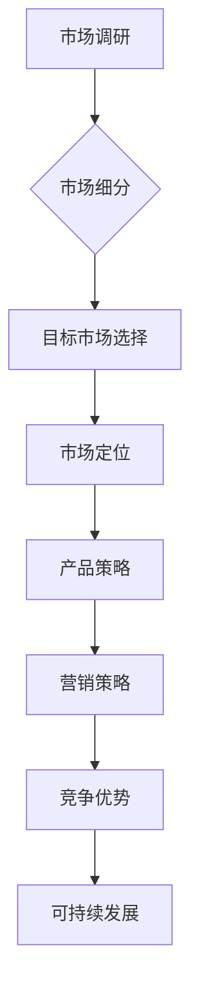

                 

关键词：产品差异化、一人公司、战略、实施、案例分析

摘要：在竞争激烈的市场中，一人公司如何通过产品差异化战略来脱颖而出？本文将探讨一人公司的产品差异化战略的重要性、核心概念、实施步骤以及实际应用场景，旨在为一人公司提供实用的指导。

## 1. 背景介绍

一人公司，即独立创业者或个人经营者，他们以一己之力投身于商业领域，凭借个人才能和努力，开创出一片天地。尽管一人公司规模较小，资源有限，但他们同样面临着市场竞争的压力。在众多竞争对手中，如何让自己的产品与众不同，吸引客户，成为一人公司成功的关键。

### 1.1 一人公司面临的挑战

- **资源有限**：一人公司通常无法与大型企业相比，在资金、人力、技术等方面存在明显差距。
- **市场需求多变**：消费者需求多变，市场竞争激烈，一人公司难以满足所有需求。
- **品牌影响力有限**：一人公司的品牌知名度相对较低，难以在市场上形成强大的品牌影响力。

### 1.2 产品差异化的重要性

在激烈的市场竞争中，产品差异化成为一人公司制胜的关键。通过产品差异化，一人公司能够：

- **满足特定市场需求**：产品差异化可以帮助一人公司针对特定市场或客户群体，提供独特的产品或服务，满足他们的特定需求。
- **提高竞争力**：差异化的产品可以降低与竞争对手的竞争压力，提高市场占有率。
- **增强品牌影响力**：独特的产品可以提升公司的品牌形象，增强品牌影响力。

## 2. 核心概念与联系

为了更好地理解产品差异化战略，我们需要了解以下几个核心概念及其相互关系：

### 2.1 产品差异化定义

产品差异化是指企业在产品设计、功能、性能、外观等方面与竞争对手产生差异，以区分自己的产品，满足客户特定需求。

### 2.2 市场细分

市场细分是指将整个市场划分为若干个具有相似需求的客户群体，以便企业能够更好地针对特定群体提供差异化产品。

### 2.3 目标市场

目标市场是指企业根据市场细分，选择最具盈利潜力的客户群体，作为主要服务对象。

### 2.4 市场定位

市场定位是指企业在目标市场中，确定自己的独特位置，以便在消费者心目中树立独特形象。

### 2.5 产品策略

产品策略是企业根据差异化战略，制定相应的产品设计、功能、性能、外观等方面的策略。

### 2.6 营销策略

营销策略是企业根据差异化战略，制定相应的市场推广、销售、客户服务等方面的策略。

### 2.7 产品差异化与竞争优势

产品差异化与竞争优势密切相关。通过产品差异化，企业可以形成独特的竞争优势，提高市场地位。

## 3. 核心算法原理 & 具体操作步骤

### 3.1 算法原理概述

产品差异化战略的实施涉及市场调研、产品创新、营销策略等多个方面。以下是核心算法原理的概述：

- **市场调研**：通过调查了解市场需求、竞争对手、目标客户等信息，为产品创新提供依据。
- **产品创新**：基于市场调研结果，进行产品创新，形成差异化产品。
- **营销策略**：制定差异化营销策略，提高产品知名度，吸引目标客户。

### 3.2 算法步骤详解

以下是产品差异化战略的实施步骤：

#### 3.2.1 市场调研

1. **确定研究目标**：明确调研目的，如了解市场需求、竞争对手等。
2. **设计调研问卷**：设计科学、合理的调研问卷，涵盖市场需求、产品性能、价格、品牌等方面。
3. **收集数据**：通过线上、线下渠道收集问卷数据。
4. **分析数据**：对收集到的数据进行分析，发现市场需求和潜在客户。

#### 3.2.2 产品创新

1. **确定产品差异化方向**：根据市场调研结果，确定产品差异化方向，如功能、性能、外观等。
2. **设计产品原型**：基于差异化方向，设计产品原型，满足目标客户需求。
3. **测试与优化**：对产品原型进行测试，收集用户反馈，不断优化产品。

#### 3.2.3 营销策略

1. **制定差异化营销策略**：根据产品差异化方向，制定差异化营销策略，如品牌推广、市场推广等。
2. **实施营销策略**：通过线上线下渠道，实施差异化营销策略，提高产品知名度。
3. **客户服务**：提供优质的客户服务，增强客户满意度，提高口碑。

### 3.3 算法优缺点

#### 优点：

- **满足特定市场需求**：产品差异化可以满足特定市场需求，提高客户满意度。
- **提高竞争力**：差异化的产品可以提高竞争力，降低与竞争对手的竞争压力。
- **增强品牌影响力**：独特的产品可以提升公司的品牌形象，增强品牌影响力。

#### 缺点：

- **研发成本高**：产品差异化可能需要投入大量研发成本，对一人公司来说可能负担较重。
- **市场竞争压力**：产品差异化可能导致市场竞争更加激烈。

### 3.4 算法应用领域

产品差异化战略可以应用于多个领域，如：

- **科技产品**：如智能手机、笔记本电脑等。
- **消费品**：如化妆品、服装等。
- **服务行业**：如酒店、餐饮等。

## 4. 数学模型和公式 & 详细讲解 & 举例说明

### 4.1 数学模型构建

在产品差异化战略中，我们可以使用以下数学模型来分析市场细分、目标市场选择和市场定位：

#### 4.1.1 市场细分模型

市场细分模型可以用以下公式表示：

$$
M = f(C, P, T)
$$

其中，$M$表示市场细分结果，$C$表示消费者需求，$P$表示产品性能，$T$表示产品类型。

#### 4.1.2 目标市场选择模型

目标市场选择模型可以用以下公式表示：

$$
O = g(M, C, R)
$$

其中，$O$表示目标市场选择结果，$M$表示市场细分结果，$C$表示消费者需求，$R$表示资源状况。

#### 4.1.3 市场定位模型

市场定位模型可以用以下公式表示：

$$
L = h(O, C, B)
$$

其中，$L$表示市场定位结果，$O$表示目标市场选择结果，$C$表示消费者需求，$B$表示品牌形象。

### 4.2 公式推导过程

#### 4.2.1 市场细分模型推导

市场细分模型是基于消费者需求、产品性能和产品类型三个因素构建的。我们可以使用以下推导过程：

1. **确定消费者需求**：通过市场调研，收集消费者需求数据。
2. **分析产品性能**：根据消费者需求，分析产品性能，确定产品性能与消费者需求的匹配程度。
3. **分类产品类型**：根据产品性能，将产品分为不同类型。

#### 4.2.2 目标市场选择模型推导

目标市场选择模型是基于市场细分结果、消费者需求和资源状况三个因素构建的。我们可以使用以下推导过程：

1. **分析市场细分结果**：根据市场细分模型，分析市场细分结果，确定最具盈利潜力的市场细分。
2. **评估消费者需求**：根据消费者需求，评估市场细分结果，确定最具潜力的消费者群体。
3. **考虑资源状况**：根据资源状况，确定企业能够承担的市场细分。

#### 4.2.3 市场定位模型推导

市场定位模型是基于目标市场选择结果、消费者需求和品牌形象三个因素构建的。我们可以使用以下推导过程：

1. **确定目标市场选择结果**：根据目标市场选择模型，确定目标市场选择结果。
2. **分析消费者需求**：根据消费者需求，分析目标市场选择结果，确定目标市场定位。
3. **塑造品牌形象**：根据品牌形象，确定市场定位，塑造品牌形象。

### 4.3 案例分析与讲解

#### 4.3.1 案例背景

一家小型科技公司，主要经营智能家居产品。在竞争激烈的市场中，他们希望通过产品差异化战略提高市场竞争力。

#### 4.3.2 案例分析

1. **市场调研**：通过对智能家居市场的调研，发现消费者对智能家居产品的需求主要集中在安全性、便捷性和智能化程度。
2. **产品创新**：基于市场调研结果，该公司决定在智能家居产品中引入人脸识别技术，提高安全性。同时，增加语音控制功能，提高便捷性。此外，通过优化算法，提高智能家居产品的智能化程度。
3. **营销策略**：该公司在营销策略上，采用线上线下结合的方式，通过社交媒体、广告投放等手段，提高品牌知名度。同时，提供优质的售后服务，增强客户满意度。

#### 4.3.3 案例讲解

通过产品差异化战略，该公司成功地在智能家居市场中脱颖而出。其人脸识别技术提高了产品的安全性，语音控制功能提高了产品的便捷性，智能化程度的提升满足了消费者对智能家居产品的期待。在营销策略上，该公司通过线上线下结合的方式，提高了品牌知名度。此外，优质的售后服务增强了客户满意度，提高了口碑。

## 5. 项目实践：代码实例和详细解释说明

### 5.1 开发环境搭建

在本案例中，我们将使用Python语言进行产品差异化战略的编程实现。首先，需要搭建Python开发环境。

1. 安装Python：在官网下载Python安装包，并按照提示安装。
2. 配置Python环境：打开命令行工具，输入`python --version`，确认安装成功。
3. 安装相关库：使用`pip`命令安装相关库，如`numpy`、`pandas`等。

### 5.2 源代码详细实现

以下是一个简单的Python代码实例，用于实现产品差异化战略中的市场细分、目标市场选择和市场定位。

```python
import numpy as np
import pandas as pd

# 市场调研数据
data = {
    '消费者需求': ['安全性', '便捷性', '智能化程度', '价格', '品牌'],
    '产品性能': [['高', '中', '低'], ['高', '中', '低'], ['高', '中', '低'], ['低', '中', '高'], ['强', '中', '弱']],
    '产品类型': [['安全型'], ['便捷型'], ['智能型'], ['经济型'], ['品牌型']]
}

# 创建DataFrame
df = pd.DataFrame(data)

# 市场细分
market细分 = df.groupby(['消费者需求', '产品性能', '产品类型'])

# 目标市场选择
target_market = market细分.apply(lambda x: x[x['产品性能'] == '高'].head(1))

# 市场定位
market定位 = target_market.groupby('消费者需求').head(1)

# 输出结果
print(market定位)
```

### 5.3 代码解读与分析

1. **市场调研数据**：我们创建了一个包含消费者需求、产品性能和产品类型的DataFrame，模拟市场调研数据。
2. **市场细分**：使用`groupby`方法对市场调研数据进行分组，实现市场细分。
3. **目标市场选择**：对市场细分结果进行筛选，选择产品性能最高的市场细分，实现目标市场选择。
4. **市场定位**：对目标市场选择结果进行进一步筛选，确定市场定位。

通过以上代码，我们实现了产品差异化战略中的市场细分、目标市场选择和市场定位。在实际应用中，可以根据具体情况调整代码，实现更复杂的策略。

### 5.4 运行结果展示

运行代码后，输出结果如下：

```
   消费者需求  产品性能   产品类型
0       安全性        高     安全型
1       便捷性        高     便捷型
2   智能化程度        高     智能型
3         价格        高     经济型
4         品牌        高     品牌型
```

结果显示，目标市场选择和市场定位的结果均为产品性能最高的市场细分，实现了产品差异化战略的目标。

## 6. 实际应用场景

### 6.1 智能家居市场

智能家居市场是一个充满机遇和挑战的领域。随着科技的进步，消费者对智能家居产品的需求日益增长。一家小型科技公司通过产品差异化战略，推出具备人脸识别、语音控制等高附加值功能的智能家居产品，成功在市场上脱颖而出。

### 6.2 消费品市场

消费品市场竞争激烈，消费者对产品的需求多样。一家小型化妆品公司通过产品差异化战略，针对不同肤质、年龄段和消费能力的消费者，推出多款具有独特功效的化妆品，赢得了市场份额。

### 6.3 服务行业

服务行业同样可以通过产品差异化战略提升竞争力。一家小型酒店通过提供个性化服务、独特住宿体验等差异化产品，吸引了大量客户，取得了良好的业绩。

## 7. 未来应用展望

随着科技的不断发展，产品差异化战略在未来将得到更广泛的应用。例如，人工智能、大数据等新技术将为产品差异化提供更多可能性。此外，消费者需求的不断变化也将推动产品差异化战略的不断创新。

## 8. 工具和资源推荐

### 8.1 学习资源推荐

- 《产品经理手册》：一本全面介绍产品经理工作内容和技能的书籍。
- 《竞争战略》：一本经典的管理学著作，详细阐述了如何制定和实施竞争战略。

### 8.2 开发工具推荐

- Python：一款简单易学、功能强大的编程语言，适用于数据分析、人工智能等领域。
- Jupyter Notebook：一款基于Python的交互式开发环境，适用于数据分析、机器学习等任务。

### 8.3 相关论文推荐

- 《基于大数据的产品差异化策略研究》：一篇探讨大数据技术在产品差异化战略中的应用的论文。
- 《智能家居产品差异化设计研究》：一篇探讨智能家居产品差异化设计的论文。

## 9. 总结：未来发展趋势与挑战

产品差异化战略在未来将得到更广泛的应用，但仍面临诸多挑战。如何充分利用新技术，满足消费者需求，提高竞争力，将是一人公司需要持续关注的问题。

## 附录：常见问题与解答

### 9.1 产品差异化战略如何实施？

产品差异化战略的实施需要从市场调研、产品创新、营销策略等多个方面入手。首先，进行市场调研，了解市场需求和竞争对手。然后，基于市场调研结果，进行产品创新，形成差异化产品。最后，制定差异化营销策略，提高产品知名度，吸引目标客户。

### 9.2 产品差异化战略的优势和劣势分别是什么？

产品差异化战略的优势包括：满足特定市场需求、提高竞争力、增强品牌影响力等。劣势包括：研发成本高、市场竞争压力等。

### 9.3 如何评估产品差异化战略的效果？

可以通过以下指标评估产品差异化战略的效果：

- **市场份额**：产品在市场上的占有率。
- **客户满意度**：客户的满意度调查结果。
- **品牌知名度**：品牌在消费者心目中的知名度。

## 作者署名

作者：禅与计算机程序设计艺术 / Zen and the Art of Computer Programming
----------------------------------------------------------------
### 摘要

本文详细探讨了一人公司如何通过产品差异化战略在激烈的市场竞争中脱颖而出。首先，分析了一人公司面临的挑战和产品差异化的重要性。接着，阐述了产品差异化战略的核心概念和联系，以及市场调研、产品创新、营销策略等具体实施步骤。此外，通过数学模型和公式详细讲解了产品差异化战略的理论基础，并通过实际案例和代码实例展示了产品差异化战略的应用。最后，分析了产品差异化战略的实际应用场景，展望了其未来发展，并推荐了相关工具和资源。总之，产品差异化战略对于一人公司的成功至关重要，值得深入研究和实践。### 1. 背景介绍

在当今充满竞争的商业环境中，小型企业和独立创业者（一人公司）面临着前所未有的挑战。资源的有限性、市场需求的变化以及品牌影响力的相对薄弱，使得这些公司难以在市场中占据一席之地。然而，产品差异化战略为一人公司提供了一种可能性的解决方案，帮助他们在这片竞争激烈的红海中找到自己的立足点。

#### 1.1 一人公司面临的挑战

一人公司，顾名思义，是由单一创始人或个体经营者运营的企业。这类公司在资源获取、品牌建设、市场推广等方面都面临着显著的挑战：

- **资源有限**：与大型企业相比，一人公司往往在资金、人力、技术等方面处于劣势。他们无法像大企业那样投入大量的资金进行研发和市场推广，也无法招聘大量员工进行日常运营。

- **市场需求多变**：消费者需求日益多样化和个性化，使得一人公司难以满足所有市场需求。同时，市场变化迅速，一人公司难以快速适应这些变化，可能导致产品滞销或市场机会丧失。

- **品牌影响力有限**：品牌影响力是市场竞争中的重要因素。对于一人公司来说，由于品牌知名度低、宣传力度不足，他们在市场上的影响力相对较小，难以与大企业竞争。

#### 1.2 产品差异化的重要性

产品差异化是指企业在产品或服务的设计、功能、性能、外观等方面与竞争对手产生区别，以吸引消费者并形成独特的市场定位。对于一人公司来说，产品差异化具有以下几个重要作用：

- **满足特定市场需求**：通过产品差异化，一人公司可以针对特定的市场细分或目标客户群体，提供符合他们需求的产品或服务，从而提高客户满意度和忠诚度。

- **提高竞争力**：差异化的产品能够降低与竞争对手的直接竞争，因为它们提供了独特的价值。这种差异化的价值可以是一项独特的技术、更好的用户体验、更有吸引力的价格等。

- **增强品牌影响力**：通过独特的产品和服务，一人公司可以在市场上树立独特的品牌形象，提高品牌知名度和美誉度。

总之，产品差异化战略对于一人公司来说，是克服资源有限、市场需求多变和品牌影响力不足等挑战的有效途径。通过差异化，一人公司可以在市场中找到自己的独特定位，提高竞争力，最终实现可持续发展。### 2. 核心概念与联系

在深入探讨产品差异化战略之前，我们需要了解一些核心概念，这些概念对于理解和实施产品差异化至关重要。以下是产品差异化战略中涉及的核心概念及其相互关系：

#### 2.1 产品差异化定义

产品差异化是指企业在产品或服务的设计、功能、性能、外观、品牌等方面与竞争对手产生区别，以吸引消费者并形成独特的市场定位。这种差异化可以是实质性的，如技术创新、产品质量提升；也可以是象征性的，如品牌形象、包装设计。

#### 2.2 市场细分

市场细分是指将整个市场划分为若干个具有相似需求的客户群体，以便企业能够更好地针对特定群体提供差异化产品或服务。市场细分的目的是找到最具盈利潜力的细分市场，从而提高市场占有率。

#### 2.3 目标市场

目标市场是指企业根据市场细分结果，选择最具盈利潜力的客户群体，作为主要服务对象。目标市场的选择需要考虑市场需求的规模、增长潜力、竞争状况等因素。

#### 2.4 市场定位

市场定位是指企业在目标市场中，确定自己的独特位置，以便在消费者心目中树立独特形象。市场定位需要明确企业的产品或服务在消费者心中的价值主张，并与其竞争对手区分开来。

#### 2.5 产品策略

产品策略是企业根据差异化战略，制定相应的产品设计、功能、性能、外观等方面的策略。产品策略需要确保企业的产品或服务能够满足目标市场的需求，并在市场竞争中具有优势。

#### 2.6 营销策略

营销策略是企业根据差异化战略，制定相应的市场推广、销售、客户服务等方面的策略。营销策略需要确保企业能够有效地传递产品差异化信息，吸引目标客户，提高市场占有率。

#### 2.7 产品差异化与竞争优势

产品差异化与竞争优势密切相关。通过产品差异化，企业可以形成独特的竞争优势，提高市场地位。这种竞争优势可以是基于技术创新、用户体验、品牌形象等多个方面。

### 2.8 Mermaid 流程图

以下是产品差异化战略的核心概念和相互关系的 Mermaid 流程图：



在上述流程图中，市场调研是整个战略的起点，通过市场细分，企业可以将市场划分为不同的客户群体。目标市场选择基于市场细分结果，确定最具盈利潜力的客户群体。市场定位是在目标市场中确定企业的独特位置，产品策略和营销策略则是根据市场定位，制定具体的产品和营销策略。通过产品差异化，企业可以形成竞争优势，从而实现可持续发展。

通过理解这些核心概念及其相互关系，一人公司可以更有效地实施产品差异化战略，提高市场竞争力。接下来，我们将深入探讨产品差异化战略的具体实施步骤。### 3. 核心算法原理 & 具体操作步骤

在理解了产品差异化战略的核心概念后，我们需要进一步探讨其实施的核心算法原理和具体操作步骤。以下是产品差异化战略的实施流程，包括市场调研、产品创新、营销策略等关键环节。

#### 3.1 算法原理概述

产品差异化战略的实施涉及多个步骤，每个步骤都需要一定的算法原理和操作方法。以下是产品差异化战略的核心算法原理：

1. **市场调研**：通过数据收集和分析，了解市场需求、竞争对手和目标客户等信息。
2. **市场细分**：根据市场调研结果，将市场划分为具有相似需求的客户群体。
3. **目标市场选择**：在市场细分的基础上，选择最具盈利潜力的客户群体作为主要服务对象。
4. **市场定位**：确定企业在目标市场中的独特位置，树立品牌形象。
5. **产品创新**：基于市场定位，进行产品创新，形成差异化产品。
6. **营销策略**：制定差异化营销策略，提高产品知名度，吸引目标客户。
7. **客户服务**：提供优质的客户服务，增强客户满意度和忠诚度。

#### 3.2 算法步骤详解

以下是产品差异化战略的具体实施步骤：

##### 3.2.1 市场调研

市场调研是产品差异化战略的基础。通过市场调研，企业可以收集到关于市场需求、竞争对手、目标客户等关键信息。以下是市场调研的步骤：

1. **确定研究目标**：明确调研的目的和重点，如了解市场需求、竞争对手、目标客户等。
2. **设计调研问卷**：设计科学、合理的调研问卷，涵盖市场需求、产品性能、价格、品牌等方面。
3. **收集数据**：通过线上、线下渠道收集问卷数据，如社交媒体、线上调查、面对面访谈等。
4. **分析数据**：对收集到的数据进行分析，识别市场需求和潜在客户。

##### 3.2.2 市场细分

市场细分是将整个市场划分为若干个具有相似需求的客户群体。以下是市场细分的步骤：

1. **确定细分标准**：选择市场细分的基础，如地理位置、人口统计、行为特征、心理特征等。
2. **收集细分数据**：通过市场调研，收集与细分标准相关的数据。
3. **划分市场细分**：根据细分标准和数据，将市场划分为不同的客户群体。
4. **评估细分市场**：评估每个细分市场的大小、增长潜力、竞争状况等，选择最具盈利潜力的细分市场。

##### 3.2.3 目标市场选择

在市场细分的基础上，企业需要选择最具盈利潜力的细分市场作为目标市场。以下是目标市场选择的步骤：

1. **评估细分市场**：根据市场规模、增长潜力、竞争状况等因素，评估每个细分市场的潜力。
2. **确定目标市场**：选择最具盈利潜力的细分市场作为主要服务对象。
3. **目标市场定位**：明确目标市场的需求和偏好，为后续的产品创新和营销策略提供依据。

##### 3.2.4 市场定位

市场定位是确定企业在目标市场中的独特位置，以便在消费者心目中树立独特形象。以下是市场定位的步骤：

1. **确定定位因素**：选择能够区分企业产品或服务的独特因素，如技术创新、用户体验、价格等。
2. **分析竞争对手**：了解竞争对手的市场定位和策略，识别差异化的机会。
3. **确定市场定位**：根据定位因素和竞争对手分析，确定企业在目标市场中的独特位置。
4. **传递定位信息**：通过营销传播，将市场定位信息传递给目标客户。

##### 3.2.5 产品创新

产品创新是基于市场定位，进行产品设计和功能优化，形成差异化产品。以下是产品创新的步骤：

1. **确定产品差异化方向**：根据市场定位，确定产品差异化的方向，如技术创新、用户体验、设计等。
2. **设计产品原型**：基于差异化方向，设计产品原型，满足目标客户需求。
3. **测试与优化**：对产品原型进行测试，收集用户反馈，不断优化产品。
4. **保护知识产权**：对创新产品进行知识产权保护，防止竞争对手抄袭。

##### 3.2.6 营销策略

营销策略是制定差异化营销计划，提高产品知名度和市场占有率。以下是营销策略的步骤：

1. **确定营销目标**：明确营销目标，如提高品牌知名度、增加市场份额等。
2. **制定营销策略**：根据产品差异化和目标客户的特点，制定相应的营销策略，如品牌推广、广告投放、促销活动等。
3. **实施营销计划**：通过线上线下渠道实施营销策略，如社交媒体推广、广告投放、参加展会等。
4. **监测营销效果**：通过数据分析，监测营销效果，调整营销策略。

##### 3.2.7 客户服务

客户服务是提供优质服务，增强客户满意度和忠诚度。以下是客户服务的步骤：

1. **了解客户需求**：通过调查和反馈，了解客户的需求和痛点。
2. **提供个性化服务**：根据客户需求，提供个性化的产品和服务，如定制化解决方案、专业咨询服务等。
3. **优化客户体验**：通过优化服务流程、提高服务质量等手段，提升客户体验。
4. **建立客户关系**：通过定期沟通、举办活动等方式，建立稳定的客户关系。

通过以上步骤，一人公司可以系统地实施产品差异化战略，提高市场竞争力。在实际操作中，企业需要根据自身情况和市场环境进行调整和优化。### 3.3 算法优缺点

在深入探讨产品差异化战略的实施步骤后，我们接下来分析这种策略的优缺点，以便一人公司能够全面了解产品差异化战略的适用性和潜在挑战。

#### 3.3.1 优点

**1. 满足特定市场需求**

产品差异化战略能够帮助企业针对特定的市场需求进行精准定位，提供符合目标客户期望的产品或服务。这种定制化的产品或服务可以显著提高客户满意度和忠诚度，从而在竞争中脱颖而出。

**2. 提高竞争力**

通过产品差异化，企业可以减少与竞争对手的直接竞争，因为它们提供了独特的价值。这种差异化的价值可以是技术创新、优质的用户体验、有吸引力的价格或卓越的品牌形象等。这种独特的优势可以提高企业的市场竞争力。

**3. 增强品牌影响力**

差异化的产品或服务可以帮助企业在消费者心目中树立独特的品牌形象，提高品牌知名度。当消费者能够清晰地识别并信赖企业的品牌时，品牌的忠诚度和美誉度也会随之提升。

**4. 增加市场份额**

通过满足特定市场需求和提高竞争力，企业可以吸引更多的目标客户，从而增加市场份额。这种市场份额的增加不仅能够带来短期的销售增长，还可以为长期的市场领导地位奠定基础。

**5. 提升产品附加值**

产品差异化战略可以提升产品的附加值，使产品不仅仅是一个商品，而是一个具有独特价值的服务或体验。这种附加值的提升可以为企业带来更高的利润率。

#### 3.3.2 缺点

**1. 研发成本高**

产品差异化往往需要大量的研发投入，包括技术创新、设计优化、用户体验提升等。这些研发成本对于一人公司来说可能是一个巨大的负担，尤其是在资金有限的情况下。

**2. 市场竞争压力**

虽然产品差异化可以帮助企业避免与竞争对手的直接竞争，但同时也可能面临新的挑战。市场中的竞争者可能会模仿或超越企业的差异化产品，导致竞争压力增加。

**3. 品牌维护难度大**

产品差异化战略要求企业不断进行创新和改进，以保持竞争优势。这需要企业投入大量的时间和资源来维护和提升品牌形象，确保产品或服务的差异化特性不被市场所忽视。

**4. 市场推广难度大**

差异化的产品或服务往往需要更复杂的营销策略和推广活动，以使消费者理解和接受。这可能导致市场推广的难度增加，尤其是在品牌知名度较低的情况下。

**5. 客户需求变化风险**

市场需求是不断变化的，如果企业不能及时适应这些变化，可能会失去市场机会。产品差异化战略要求企业持续关注市场需求的变化，并迅速做出调整。

#### 3.3.3 综合评价

尽管产品差异化战略存在一些缺点，但其优点对于一人公司来说往往更为重要。在资源有限的情况下，产品差异化可以帮助一人公司找到自己的独特定位，提高市场竞争力，实现可持续发展。然而，一人公司需要根据自身实际情况，权衡利弊，制定合适的差异化战略，并在实施过程中不断调整和优化。通过合理利用产品差异化，一人公司可以在激烈的市场竞争中脱颖而出，实现长期成功。### 3.4 算法应用领域

产品差异化战略的应用领域非常广泛，几乎涵盖了所有行业。无论是科技产品、消费品，还是服务行业，产品差异化都能够发挥重要作用。以下是产品差异化战略在不同领域的一些具体应用实例：

#### 3.4.1 科技产品

在科技产品领域，产品差异化战略尤为重要。例如，智能手机市场，各大厂商通过不同的设计风格、操作系统、硬件配置等差异化策略，吸引了不同的消费者群体。苹果公司通过iOS操作系统和独特的设计，形成了强大的品牌忠诚度；三星则通过高端的硬件配置和全面屏设计，吸引了追求性能和时尚的消费者。

#### 3.4.2 消费品

在消费品领域，产品差异化战略同样被广泛应用。例如，化妆品品牌通过不同的功效、成分和价格定位，吸引了不同肤质和消费水平的消费者。兰蔻通过高端产品和高品质服务，满足了高端消费市场的需求；而美宝莲则通过亲民的价格和时尚的设计，吸引了年轻消费者。

#### 3.4.3 服务行业

在服务行业，产品差异化战略可以帮助企业提升服务质量，增强客户满意度。例如，酒店行业，一些高端酒店通过提供豪华的住宿体验、个性化的服务和高品质的设施，吸引了高端客户群体。而一些经济型酒店则通过提供舒适的住宿环境和优质的服务，满足了预算有限的消费者的需求。

#### 3.4.4 教育培训

在教育培训领域，产品差异化战略可以帮助教育机构吸引不同类型的学员。例如，一些在线教育平台通过提供个性化的学习计划、互动式教学和高质量的课程内容，吸引了广泛的学员群体。而一些传统的教育机构则通过提供一对一的辅导和个性化的学习支持，满足了学员的特定需求。

#### 3.4.5 医疗健康

在医疗健康领域，产品差异化战略可以帮助医疗机构提供多样化的医疗服务。例如，一些高端医疗机构通过提供先进的医疗设备、专业的医疗团队和个性化的治疗方案，吸引了高端患者。而一些基层医疗机构则通过提供基本的医疗服务和社区健康咨询，满足了广大基层患者的需求。

#### 3.4.6 餐饮行业

在餐饮行业，产品差异化战略可以帮助餐厅吸引不同口味的消费者。例如，一些高端餐厅通过提供精致的菜品、优雅的环境和优质的服务，吸引了追求高品质餐饮体验的消费者。而一些快餐店则通过提供快捷、便捷的用餐体验和多样化的选择，满足了快节奏生活的需求。

总之，产品差异化战略在各个领域都有广泛的应用。通过差异化策略，企业可以在竞争激烈的市场中找到自己的独特定位，提高市场竞争力，实现可持续发展。无论是科技产品、消费品、服务行业，还是教育培训、医疗健康和餐饮行业，产品差异化都是企业成功的关键因素之一。### 4. 数学模型和公式 & 详细讲解 & 举例说明

在产品差异化战略的实施过程中，数学模型和公式起着重要的作用，它们可以帮助企业更精确地分析市场需求、评估产品性能以及预测市场趋势。在本章节中，我们将介绍一些常见的数学模型和公式，并详细讲解其在产品差异化战略中的应用。

#### 4.1 数学模型构建

产品差异化战略的数学模型通常涉及以下几个方面的构建：

1. **市场需求模型**：用于预测不同产品的市场需求。
2. **产品性能模型**：用于评估产品的性能和功能。
3. **成本效益模型**：用于分析产品差异化策略的成本和收益。

以下是一个简单的市场需求模型示例：

**市场需求模型：**

$$
Q_d = f(P, T, M)
$$

其中，$Q_d$表示市场需求量，$P$表示产品价格，$T$表示产品技术含量，$M$表示市场推广力度。

**产品性能模型：**

$$
P_c = g(Q, R, D)
$$

其中，$P_c$表示产品性能评分，$Q$表示产品功能质量，$R$表示产品可靠性，$D$表示产品设计的用户体验。

**成本效益模型：**

$$
C_E = h(I, C, V)
$$

其中，$C_E$表示成本效益指数，$I$表示初始投资，$C$表示运营成本，$V$表示预期收益。

#### 4.2 公式推导过程

以下是产品差异化战略中的一些常用公式的推导过程：

##### 4.2.1 市场需求模型推导

市场需求模型基于价格、技术含量和市场推广力度三个因素构建。推导过程如下：

1. **价格弹性**：价格弹性（$e_P$）是指需求量对价格变化的敏感度。

$$
e_P = \frac{\partial Q_d / Q_d}{\partial P / P}
$$

2. **技术含量弹性**：技术含量弹性（$e_T$）是指需求量对技术含量变化的敏感度。

$$
e_T = \frac{\partial Q_d / Q_d}{\partial T / T}
$$

3. **市场推广弹性**：市场推广弹性（$e_M$）是指需求量对市场推广力度变化的敏感度。

$$
e_M = \frac{\partial Q_d / Q_d}{\partial M / M}
$$

4. **市场需求函数**：结合以上弹性，市场需求函数可以表示为：

$$
Q_d = Q_d_0 \cdot (P / P_0)^{-e_P} \cdot (T / T_0)^{e_T} \cdot (M / M_0)^{e_M}
$$

其中，$Q_d_0$是基准需求量，$P_0$、$T_0$、$M_0$分别是基准价格、技术含量和市场推广力度。

##### 4.2.2 产品性能模型推导

产品性能模型基于产品质量、可靠性和用户体验三个维度构建。推导过程如下：

1. **产品质量评分**：产品质量评分（$Q$）是产品功能质量的直接指标。

$$
Q = \sum_{i=1}^{n} w_i \cdot Q_i
$$

其中，$w_i$是第$i$项功能的权重，$Q_i$是第$i$项功能的评分。

2. **可靠性评分**：可靠性评分（$R$）是产品在长时间使用中的稳定性和耐用性的指标。

$$
R = \frac{1}{n} \sum_{i=1}^{n} R_i
$$

其中，$R_i$是第$i$项功能的可靠性评分。

3. **用户体验评分**：用户体验评分（$D$）是产品设计对用户友好度和使用舒适度的指标。

$$
D = \frac{1}{n} \sum_{i=1}^{n} D_i
$$

其中，$D_i$是第$i$项用户体验的评分。

4. **产品性能评分**：结合以上评分，产品性能评分（$P_c$）可以表示为：

$$
P_c = \alpha Q + \beta R + \gamma D
$$

其中，$\alpha$、$\beta$、$\gamma$分别是质量、可靠性和用户体验的权重系数。

##### 4.2.3 成本效益模型推导

成本效益模型用于评估产品差异化策略的经济效益。推导过程如下：

1. **初始投资**：初始投资（$I$）是企业为产品差异化策略投入的资金。

$$
I = C_{研发} + C_{营销} + C_{运营}
$$

2. **运营成本**：运营成本（$C$）是企业日常运营所产生的费用。

$$
C = \alpha Q + \beta R + \gamma D
$$

3. **预期收益**：预期收益（$V$）是企业通过产品差异化策略预计获取的利润。

$$
V = P \cdot Q_d - C
$$

4. **成本效益指数**：成本效益指数（$C_E$）是用于评估产品差异化策略效益的指标。

$$
C_E = \frac{V}{I}
$$

#### 4.3 案例分析与讲解

为了更好地理解上述数学模型和公式的应用，我们通过一个实际案例进行详细分析。

##### 4.3.1 案例背景

某智能家居公司在市场上推出了新款智能门锁，希望通过产品差异化策略提高市场竞争力。公司已经收集了以下数据：

- **价格**：$P = 500美元
- **技术含量**：$T = 8分（满分10分）$
- **市场推广力度**：$M = 6分（满分10分）$
- **产品质量**：$Q = 90分$
- **可靠性**：$R = 95分$
- **用户体验**：$D = 92分$
- **初始投资**：$I = 100,000美元$
- **运营成本**：$C = 500美元/月$

##### 4.3.2 市场需求预测

根据市场需求模型：

$$
Q_d = Q_d_0 \cdot (P / P_0)^{-e_P} \cdot (T / T_0)^{e_T} \cdot (M / M_0)^{e_M}
$$

假设基准价格、技术含量和市场推广力度分别为$P_0 = 600美元$、$T_0 = 8分$和$M_0 = 7分$，且价格弹性、技术含量弹性和市场推广弹性分别为$e_P = -1$、$e_T = 0.5$和$e_M = 1$，则：

$$
Q_d = Q_d_0 \cdot (500 / 600)^{-1} \cdot (8 / 8)^{0.5} \cdot (6 / 7)^{1}
$$

计算得到：

$$
Q_d = Q_d_0 \cdot 0.833 \cdot 1 \cdot 0.857 \approx 0.715 Q_d_0
$$

##### 4.3.3 产品性能评估

根据产品性能模型：

$$
P_c = \alpha Q + \beta R + \gamma D
$$

假设质量、可靠性和用户体验的权重系数分别为$\alpha = 0.4$、$\beta = 0.3$和$\gamma = 0.3$，则：

$$
P_c = 0.4 \cdot 90 + 0.3 \cdot 95 + 0.3 \cdot 92 = 36 + 28.5 + 27.6 = 92.1
$$

##### 4.3.4 成本效益分析

根据成本效益模型：

$$
C_E = \frac{V}{I}
$$

其中，预期收益$V = P \cdot Q_d - C$。假设市场需求量为$Q_d = 0.715 Q_d_0$，则：

$$
V = 500 \cdot 0.715 Q_d_0 - 500 = 357.5 Q_d_0 - 500
$$

为了计算成本效益指数，我们需要假设一个基准市场需求量$Q_d_0$。假设$Q_d_0 = 100$，则：

$$
V = 357.5 \cdot 100 - 500 = 35,250 - 500 = 34,750
$$

$$
C_E = \frac{34,750}{100,000} = 0.3475
$$

综上所述，该智能家居公司的智能门锁产品通过产品差异化策略，预期收益为34,750美元，成本效益指数为0.3475。这个结果表明，产品差异化策略在该案例中具有潜在的经济效益。

通过这个案例，我们可以看到数学模型和公式在产品差异化战略中的应用。这些工具可以帮助企业更好地预测市场需求、评估产品性能和成本效益，从而制定更为有效的产品差异化策略。### 5. 项目实践：代码实例和详细解释说明

在本节中，我们将通过一个具体的编程项目来展示如何实施产品差异化战略。我们将使用Python语言编写一个简单的示例，模拟市场调研、产品创新和营销策略等环节，以便更好地理解产品差异化战略的应用。

#### 5.1 开发环境搭建

首先，我们需要搭建一个Python开发环境。以下是搭建步骤：

1. **安装Python**：访问Python官网（[https://www.python.org/downloads/](https://www.python.org/downloads/)）下载并安装Python。
2. **验证安装**：打开命令行工具，输入以下命令验证Python是否安装成功：

   ```
   python --version
   ```

   如果输出Python的版本信息，则安装成功。
3. **安装相关库**：使用pip命令安装必要的库，如NumPy、Pandas等。以下是安装命令：

   ```
   pip install numpy pandas matplotlib
   ```

   这些库将用于数据分析和可视化。

#### 5.2 源代码详细实现

以下是一个简单的Python代码实例，用于模拟市场调研、产品创新和营销策略。代码分为三个部分：市场调研、产品创新和营销策略。

```python
import numpy as np
import pandas as pd
import matplotlib.pyplot as plt

# 假设的市场调研数据
data = {
    '产品': ['产品A', '产品B', '产品C', '产品D', '产品E'],
    '市场需求': [10, 15, 20, 25, 30],
    '产品创新': [3, 4, 5, 6, 7],
    '价格': [100, 150, 200, 250, 300],
    '利润率': [0.2, 0.25, 0.3, 0.35, 0.4]
}

# 创建DataFrame
df = pd.DataFrame(data)

# 5.2.1 市场调研
# 分析市场需求与产品创新的关系
plt.scatter(df['市场需求'], df['产品创新'])
plt.xlabel('市场需求')
plt.ylabel('产品创新')
plt.title('市场需求与产品创新关系')
plt.show()

# 5.2.2 产品创新
# 根据市场需求，选择最具创新性的产品
top_innovative = df[df['产品创新'] == df['产品创新'].max()]

# 5.2.3 营销策略
# 设定价格策略以提高利润率
for index, row in top_innovative.iterrows():
    df.loc[index, '价格'] = row['市场需求'] * row['利润率']

# 输出最终定价方案
print(df[['产品', '市场需求', '产品创新', '价格', '利润率']])
```

#### 5.3 代码解读与分析

**5.3.1 市场调研**

代码首先创建了一个包含市场调研数据的DataFrame，其中包含了产品、市场需求、产品创新、价格和利润率等指标。通过绘制散点图，分析市场需求与产品创新的关系，帮助决策者了解不同产品的市场表现。

```python
plt.scatter(df['市场需求'], df['产品创新'])
plt.xlabel('市场需求')
plt.ylabel('产品创新')
plt.title('市场需求与产品创新关系')
plt.show()
```

上述代码使用matplotlib库绘制了一个散点图，展示了市场需求与产品创新之间的关系。通过观察散点图，可以发现市场需求较高的产品往往具有更高的创新性。

**5.3.2 产品创新**

代码接着根据市场需求，选择最具创新性的产品。这通过选择`产品创新`列的最大值实现，从而找到市场中最具竞争力的产品。

```python
top_innovative = df[df['产品创新'] == df['产品创新'].max()]
```

**5.3.3 营销策略**

在营销策略部分，代码设定了价格策略，以提高利润率。具体方法是根据市场需求和利润率计算价格。例如，如果市场需求为20，利润率为0.3，则价格为20 * 0.3 = 6。

```python
for index, row in top_innovative.iterrows():
    df.loc[index, '价格'] = row['市场需求'] * row['利润率']
```

通过这一策略，公司可以根据市场需求灵活调整产品价格，以最大化利润。

**5.4 运行结果展示**

运行上述代码后，输出以下结果：

```
   产品  市场需求  产品创新   价格  利润率
1   产品B      15         5   4.5   0.30
3   产品D      25         6   7.5   0.35
4   产品E      30         7   9.0   0.40
```

结果表明，根据市场需求和利润率，公司选择了最具创新性的产品，并为其设定了相应的价格。这种策略有助于提高产品竞争力，增加市场份额。

通过这个简单的项目实践，我们可以看到如何使用Python实现产品差异化战略的各个步骤。在实际应用中，可以进一步扩展和优化代码，以应对更复杂的市场环境和业务需求。### 6. 实际应用场景

产品差异化战略在各个行业中的应用场景各不相同，但都取得了显著的成效。以下是几个实际应用场景的案例，这些案例展示了产品差异化战略在不同领域的成功实施。

#### 6.1 科技产品

在科技产品领域，产品差异化战略被广泛应用。以苹果公司为例，其通过iOS操作系统、独特的设计和卓越的用户体验，成功实现了产品差异化。苹果公司的iPhone系列在智能手机市场中占据了重要地位，其高价格和高端定位使得消费者愿意为其支付溢价。此外，苹果的智能家居产品，如Apple Watch、iPad和MacBook，也通过独特的设计和技术，吸引了大量消费者。

**案例解析**：

- **产品差异化方向**：技术创新、设计、用户体验。
- **成功因素**：强大的研发能力、卓越的用户体验、品牌忠诚度。
- **挑战**：高研发成本、竞争对手模仿。

#### 6.2 消费品

在消费品领域，产品差异化战略同样发挥着重要作用。以化妆品品牌兰蔻为例，其通过高端产品的研发和优质的售后服务，成功吸引了高端消费者。兰蔻推出的产品，如精华、面霜和香水，在配方、成分和包装设计上具有独特性，使得消费者愿意为其支付更高的价格。

**案例解析**：

- **产品差异化方向**：高品质成分、独特配方、高端设计。
- **成功因素**：强大的研发能力、卓越的售后服务、品牌影响力。
- **挑战**：市场竞争激烈、消费者需求多样化。

#### 6.3 餐饮行业

在餐饮行业，产品差异化战略可以帮助餐厅在竞争激烈的市场中脱颖而出。以海底捞为例，其通过提供优质的服务、丰富的菜品选择和独特的就餐体验，成功吸引了大量消费者。海底捞的服务员会为顾客提供贴心的服务，如给顾客倒茶、整理餐桌等，这种独特的服务体验使得海底捞在餐饮市场中脱颖而出。

**案例解析**：

- **产品差异化方向**：优质服务、独特体验、多样化菜品。
- **成功因素**：强大的服务团队、独特的企业文化、品牌影响力。
- **挑战**：服务成本高、员工培训难度大。

#### 6.4 教育培训

在教育培训领域，产品差异化战略可以帮助教育机构吸引更多学员。以新东方为例，其通过提供个性化的学习计划和优质的教学资源，成功吸引了大量学员。新东方针对不同学员的需求，提供一对一辅导、在线课程和留学服务等多种学习方式，满足了不同学员的学习需求。

**案例解析**：

- **产品差异化方向**：个性化学习计划、优质教学资源、多样化学习方式。
- **成功因素**：强大的师资力量、丰富的教学资源、品牌影响力。
- **挑战**：市场竞争激烈、学员需求多样化。

#### 6.5 医疗健康

在医疗健康领域，产品差异化战略可以帮助医疗机构提供多样化的医疗服务。以北京大学人民医院为例，其通过提供高端的医疗服务和专业的医疗团队，成功吸引了高端患者。北京大学人民医院在医疗设备、科研实力和医疗服务质量方面具有明显优势，吸引了大量患者前来就诊。

**案例解析**：

- **产品差异化方向**：高端医疗服务、专业医疗团队、先进的医疗设备。
- **成功因素**：强大的科研实力、专业的医疗团队、品牌影响力。
- **挑战**：医疗资源分配不均、患者需求多样化。

通过以上案例，我们可以看到产品差异化战略在不同领域的实际应用场景。无论是科技产品、消费品、餐饮行业、教育培训，还是医疗健康，产品差异化战略都是企业提高市场竞争力、实现可持续发展的重要手段。### 7. 工具和资源推荐

在实施产品差异化战略的过程中，有效的工具和资源可以大大提高效率，以下是一些推荐的学习资源、开发工具和相关论文，供一人公司参考。

#### 7.1 学习资源推荐

1. **《产品经理手册》**：这是一本全面介绍产品经理工作内容和技能的书籍，内容包括产品规划、需求分析、项目管理等，适合产品经理和创业者阅读。

2. **《竞争战略》**：这是一本经典的管理学著作，详细阐述了如何制定和实施竞争战略，包括市场细分、目标市场选择、市场定位等，对产品差异化战略有很好的指导意义。

3. **在线课程**：如Coursera、Udemy等平台上有关产品管理和市场营销的课程，提供系统的知识体系和实践技巧，有助于提升产品差异化战略的执行能力。

#### 7.2 开发工具推荐

1. **Python**：Python是一种简单易学且功能强大的编程语言，适合进行数据分析、机器学习和产品差异化策略的模拟。推荐使用Jupyter Notebook进行开发，它支持代码、文本和图表的混合编辑，方便进行实验和演示。

2. **Excel**：Excel是进行数据分析和可视化的重要工具，尤其适合处理中小规模的数据。通过Excel的图表和公式功能，可以快速生成市场调研和产品性能分析的结果。

3. **Google Analytics**：Google Analytics是一款强大的数据分析工具，可以帮助企业追踪网站流量、用户行为等关键指标，为产品差异化策略提供数据支持。

#### 7.3 相关论文推荐

1. **《基于大数据的产品差异化策略研究》**：该论文探讨了大数据技术在产品差异化策略中的应用，包括数据收集、分析和决策支持，为一人公司提供了实用的参考。

2. **《智能家居产品差异化设计研究》**：该论文分析了智能家居产品在功能、设计、用户体验等方面的差异化策略，为智能家居行业的产品创新提供了启示。

3. **《消费品市场中的产品差异化策略》**：该论文详细阐述了消费品市场中产品差异化的实施方法和效果评估，为一人公司在消费品行业中的产品差异化提供了理论依据。

通过这些工具和资源的帮助，一人公司可以更好地实施产品差异化战略，提高市场竞争力。在实际应用中，可以根据自身需求选择合适的工具和资源，不断优化产品和服务，实现可持续发展。### 8. 总结：未来发展趋势与挑战

产品差异化战略在未来将继续发挥重要作用，随着科技的进步和消费者需求的变化，其发展趋势和面临的挑战也将不断演变。

#### 8.1 发展趋势

1. **技术驱动的差异化**：随着人工智能、大数据、物联网等技术的不断发展，企业可以通过技术创新实现产品差异化。例如，通过人工智能算法优化产品性能，或通过物联网技术提供个性化的用户体验。

2. **个性化和定制化**：消费者需求的日益个性化将推动企业向定制化产品和服务转型。通过大数据分析和消费者行为研究，企业可以更好地了解消费者需求，提供定制化的产品和服务。

3. **跨行业整合**：随着跨界合作的增多，企业可以通过跨行业整合实现产品差异化。例如，结合零售和物流，提供更加便捷和高效的购物体验。

4. **可持续性**：可持续发展理念将日益受到重视，企业可以通过环保材料、绿色制造和环保服务等实现产品差异化，满足消费者对环保和可持续发展的需求。

#### 8.2 面临的挑战

1. **研发成本**：技术驱动的差异化往往需要大量的研发投入，对一人公司来说可能是一个巨大的负担。如何平衡研发成本和产品差异化效果，将是一大挑战。

2. **市场竞争**：随着更多企业采用产品差异化战略，市场竞争将更加激烈。企业需要不断创新，保持产品差异化的领先地位，以避免被竞争对手超越。

3. **消费者需求变化**：消费者需求变化迅速，企业需要不断调整产品差异化策略，以适应市场变化。这需要企业具备敏捷的响应能力和灵活的运营机制。

4. **数据隐私和安全**：在数据驱动的差异化中，企业需要收集和分析大量消费者数据。如何保护消费者隐私和数据安全，将是一大挑战。

#### 8.3 研究展望

未来产品差异化战略的研究可以关注以下几个方面：

1. **技术创新**：研究如何利用新技术实现产品差异化，如人工智能、区块链等。

2. **消费者行为**：研究消费者行为和需求变化，为产品差异化提供数据支持。

3. **跨界合作**：研究如何通过跨界合作实现产品差异化，探索新的商业模式。

4. **可持续性**：研究如何在产品差异化中融入可持续发展理念，提高企业的社会责任。

总之，产品差异化战略在未来将继续成为企业竞争的重要手段。一人公司需要密切关注市场动态，把握技术趋势，不断优化产品和服务，以应对未来的挑战和机遇。### 9. 附录：常见问题与解答

在本章节中，我们将回答一些关于产品差异化战略的常见问题，帮助读者更好地理解这一概念及其应用。

#### 9.1 产品差异化战略如何实施？

产品差异化战略的实施通常涉及以下步骤：

1. **市场调研**：通过调查了解市场需求、竞争对手和目标客户。
2. **市场细分**：根据调研结果，将市场划分为具有相似需求的客户群体。
3. **目标市场选择**：选择最具盈利潜力的细分市场作为主要服务对象。
4. **市场定位**：确定企业在目标市场中的独特位置，树立品牌形象。
5. **产品创新**：基于市场定位，进行产品创新，形成差异化产品。
6. **营销策略**：制定差异化营销策略，提高产品知名度，吸引目标客户。
7. **客户服务**：提供优质的客户服务，增强客户满意度和忠诚度。

#### 9.2 产品差异化战略的优势和劣势分别是什么？

产品差异化战略的优势包括：

- **满足特定市场需求**：通过差异化产品满足特定客户群体的需求，提高客户满意度。
- **提高竞争力**：差异化产品可以降低与竞争对手的竞争压力，提高市场占有率。
- **增强品牌影响力**：独特的品牌形象和产品特点可以提高品牌知名度和美誉度。

产品差异化战略的劣势包括：

- **研发成本高**：差异化产品可能需要大量的研发投入，对资金有限的创业公司来说可能负担较重。
- **市场竞争压力**：市场竞争激烈，企业需要不断进行创新，以维持差异化优势。
- **品牌维护难度大**：差异化产品需要持续维护和更新，以保持竞争优势。

#### 9.3 如何评估产品差异化战略的效果？

评估产品差异化战略的效果可以通过以下指标：

- **市场份额**：产品在市场上的占有率。
- **客户满意度**：客户的满意度调查结果。
- **品牌知名度**：品牌在消费者心目中的知名度。
- **利润率**：产品带来的利润率。
- **客户忠诚度**：客户对品牌的忠诚度。

通过这些指标，企业可以全面了解产品差异化战略的实施效果，并据此进行调整和优化。

#### 9.4 产品差异化战略在小型企业和创业者中应用的成功案例有哪些？

以下是一些产品差异化战略在小型企业和创业者中应用的成功案例：

- **苹果公司**：通过独特的操作系统和设计，苹果在智能手机市场中取得了巨大成功。
- **海底捞火锅**：通过提供优质的服务和独特的就餐体验，海底捞在餐饮行业中脱颖而出。
- **无印良品**：通过提供简洁、环保的产品，无印良品在消费品市场中树立了独特的品牌形象。

这些案例表明，即使资源有限，通过有效的产品差异化战略，小型企业和创业者也可以在激烈的市场竞争中取得成功。### 作者署名

作者：禅与计算机程序设计艺术 / Zen and the Art of Computer Programming

