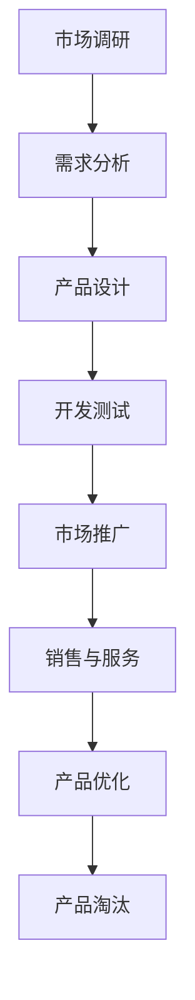

                 

在当今这个数字化、全球化的商业环境中，产品的生命周期管理（Product Lifecycle Management，简称PLM）对于任何规模的企业都至关重要。而对于只有一位创始人的小型公司或初创企业，产品生命周期管理更是一个不可忽视的环节。本文将深入探讨一人公司如何有效地进行产品生命周期管理，确保产品从概念到市场，再到淘汰的每个阶段都得到妥善处理。

> 关键词：产品生命周期管理、初创企业、单人公司、产品开发、市场策略、迭代优化

> 摘要：本文将介绍产品生命周期管理的基本概念和关键步骤，并结合一人公司的特殊情况，提供实用的指导策略。文章将涵盖从市场调研、产品设计、开发测试到市场推广、持续优化等各个环节，旨在帮助单人公司在竞争激烈的市场中成功推出和维持高质量产品。

## 1. 背景介绍

在大多数企业中，产品生命周期管理是一个复杂且多层次的过程，涉及从市场需求分析到产品设计、开发、测试、市场推广、销售、服务再到产品退市的各个环节。然而，对于一人公司或单人创业的个体来说，由于资源有限、团队规模小，往往需要在有限的时间和预算内，高效地完成这些工作。

一人公司的特点包括：
- **资源有限**：没有庞大的财务和人力资源支持，因此每一笔支出都必须精打细算。
- **决策迅速**：由于只有一位决策者，决策过程相对简单快捷，能够迅速响应市场变化。
- **灵活性高**：单人公司通常具有更高的灵活性，能够快速调整战略和产品方向。

尽管这些特点为一人公司带来了一定的优势，但也带来了挑战，如市场调研困难、资源分散、技术能力限制等。因此，有效的产品生命周期管理对于一人公司来说尤为重要。

## 2. 核心概念与联系

产品生命周期管理涉及多个核心概念，它们共同构成了一个完整的生命周期。以下是一个简化的Mermaid流程图，用于展示这些概念之间的联系：



### 2.1 市场调研

市场调研是产品生命周期管理的起点。它涉及对目标市场的分析，包括了解竞争对手、市场需求、用户痛点等。对于一人公司来说，市场调研可能更加依赖在线工具和数据源，如社交媒体分析、问卷调查、在线论坛等。

### 2.2 需求分析

在市场调研的基础上，需求分析进一步明确了产品的功能和特性。对于单人公司，需求分析需要特别关注用户的核心需求，以及如何在预算和时间限制内满足这些需求。

### 2.3 产品设计

产品设计是将需求转化为具体产品的过程。一人公司通常需要依赖外包设计师或利用开源设计工具。在这一阶段，简洁和实用是关键。

### 2.4 开发测试

开发测试是确保产品符合设计和需求的关键环节。单人公司可能需要利用敏捷开发方法，快速迭代并不断优化产品。

### 2.5 市场推广

市场推广是将产品推向市场的过程。对于一人公司，这通常意味着需要利用社交媒体、内容营销等低成本、高影响力的手段。

### 2.6 销售与服务

销售与服务是产品生命周期中的重要环节，一人公司需要确保能够提供优质的客户服务，以建立品牌信誉。

### 2.7 产品优化

产品优化是一个持续的过程，旨在根据用户反馈和市场变化，不断改进产品。

### 2.8 产品淘汰

当产品无法满足市场需求或成本过高时，产品淘汰是必要的。对于一人公司，淘汰旧产品并推出新产品需要灵活的策略。

## 3. 核心算法原理 & 具体操作步骤

### 3.1 算法原理概述

产品生命周期管理的核心在于高效地完成各个阶段的工作，确保产品能够迅速地响应市场需求。以下是三个关键算法原理：

1. **敏捷开发算法**：通过快速迭代和持续反馈，缩短产品开发周期，提高产品交付效率。
2. **市场细分算法**：通过数据分析，将市场划分为不同的细分市场，从而更精准地定位目标用户。
3. **客户满意度算法**：通过用户反馈和数据分析，持续优化产品和服务，提高客户满意度。

### 3.2 算法步骤详解

1. **敏捷开发算法**
    - **需求收集**：通过与用户沟通，收集产品需求。
    - **迭代计划**：根据需求制定迭代计划，通常为2-4周。
    - **开发执行**：执行迭代计划，进行编码和测试。
    - **反馈与优化**：收集用户反馈，对产品进行优化。

2. **市场细分算法**
    - **数据收集**：收集市场数据，如用户行为、购买记录等。
    - **数据分析**：使用统计方法进行数据分析，识别不同细分市场。
    - **细分策略**：根据数据分析结果，制定针对不同细分市场的推广策略。

3. **客户满意度算法**
    - **用户反馈**：收集用户对产品和服务的反馈。
    - **数据分析**：分析用户反馈，识别问题和改进点。
    - **优化措施**：根据分析结果，采取优化措施，如改进产品设计、提高服务质量。

### 3.3 算法优缺点

1. **敏捷开发算法**
    - **优点**：缩短开发周期，提高交付效率，更好地适应市场变化。
    - **缺点**：可能需要更多的沟通和协调工作，对团队协作要求较高。

2. **市场细分算法**
    - **优点**：更精准地定位目标用户，提高市场推广效果。
    - **缺点**：数据分析过程复杂，需要较高的技术和资源支持。

3. **客户满意度算法**
    - **优点**：持续优化产品和服务，提高用户满意度，增强品牌忠诚度。
    - **缺点**：用户反馈处理和分析可能耗时较长。

### 3.4 算法应用领域

1. **敏捷开发算法**：适用于需要快速响应市场变化的产品，如软件、移动应用等。

2. **市场细分算法**：适用于市场调研、产品定位等环节，帮助公司更好地了解用户需求。

3. **客户满意度算法**：适用于所有产品和服务，帮助公司持续改进，提高竞争力。

## 4. 数学模型和公式 & 详细讲解 & 举例说明

### 4.1 数学模型构建

在产品生命周期管理中，构建数学模型可以帮助我们更准确地预测产品的市场表现和用户行为。以下是一个简化的数学模型：

$$
\text{市场需求} = f(\text{产品特性}, \text{用户偏好}, \text{市场环境})
$$

其中，$f$ 是一个复合函数，包含了产品特性、用户偏好和市场环境的相互作用。

### 4.2 公式推导过程

1. **产品特性**：通过设计分析，确定产品的功能、性能、外观等特性。
2. **用户偏好**：通过用户调研，收集用户对产品特性的偏好数据。
3. **市场环境**：分析市场趋势、竞争对手情况等，确定市场环境因素。

将这些因素结合起来，我们可以通过多元回归分析等方法，推导出市场需求模型。

### 4.3 案例分析与讲解

假设我们开发了一款智能家居助手，以下是一个简单的案例分析：

$$
\text{市场需求} = 0.5 \times (\text{智能语音交互} + \text{远程控制功能}) + 0.3 \times (\text{用户满意度}) + 0.2 \times (\text{市场占有率})
$$

通过这个模型，我们可以预测在不同市场环境下，产品的市场需求量。例如，在用户满意度较高、市场占有率较高的环境下，市场需求量会相对较高。

## 5. 项目实践：代码实例和详细解释说明

### 5.1 开发环境搭建

为了实践产品生命周期管理，我们可以使用一个简单的Web应用项目。首先，我们需要搭建开发环境。

1. **安装Node.js**：从 [Node.js官网](https://nodejs.org/) 下载并安装Node.js。
2. **安装npm**：Node.js 自带 npm 包管理器，确保已经正确安装。
3. **创建项目**：使用以下命令创建一个新项目：

```bash
mkdir my-smart-home-assistant
cd my-smart-home-assistant
npm init -y
```

### 5.2 源代码详细实现

以下是项目的源代码示例：

```javascript
// app.js

const express = require('express');
const bodyParser = require('body-parser');

const app = express();

app.use(bodyParser.json());

// 模拟智能语音交互
app.post('/interact', (req, res) => {
  const command = req.body.command;
  if (command === 'turn on lights') {
    console.log('Lights are turned on.');
    res.send({ status: 'success', message: 'Lights turned on.' });
  } else {
    console.log('Unknown command:', command);
    res.send({ status: 'error', message: 'Unknown command.' });
  }
});

// 模拟远程控制功能
app.post('/control', (req, res) => {
  const device = req.body.device;
  if (device === 'lights') {
    console.log('Lights are controlled.');
    res.send({ status: 'success', message: 'Lights controlled.' });
  } else {
    console.log('Unknown device:', device);
    res.send({ status: 'error', message: 'Unknown device.' });
  }
});

const PORT = process.env.PORT || 3000;
app.listen(PORT, () => {
  console.log(`Server is running on port ${PORT}`);
});
```

### 5.3 代码解读与分析

以上代码实现了一个简单的Web应用，模拟了智能家居助手的智能语音交互和远程控制功能。

- **app.js**：主文件，使用Express框架搭建服务器。
- **/interact**：处理智能语音交互请求，根据命令执行相应操作。
- **/control**：处理远程控制请求，根据设备执行相应操作。

这个简单的例子展示了如何使用Node.js和Express快速搭建一个Web应用，以实现产品功能。

### 5.4 运行结果展示

1. **启动服务器**：

```bash
node app.js
```

2. **发送交互请求**：

```json
{
  "command": "turn on lights"
}
```

响应：

```json
{
  "status": "success",
  "message": "Lights turned on."
}
```

3. **发送控制请求**：

```json
{
  "device": "lights"
}
```

响应：

```json
{
  "status": "success",
  "message": "Lights controlled."
}
```

## 6. 实际应用场景

### 6.1 市场调研

- **在线问卷调查**：通过在线问卷平台（如SurveyMonkey）收集用户对智能家居产品的看法和需求。
- **社交媒体分析**：利用社交媒体分析工具（如Google Analytics）分析用户行为和偏好。

### 6.2 产品设计

- **原型设计**：使用Figma或Sketch等工具创建产品原型。
- **用户体验设计**：确保产品界面简洁易用，满足用户需求。

### 6.3 开发测试

- **敏捷开发**：采用Git和Jenkins等工具进行敏捷开发，快速迭代和测试。
- **自动化测试**：使用Selenium等工具进行自动化测试，确保产品质量。

### 6.4 市场推广

- **内容营销**：通过博客、社交媒体等渠道发布有价值的内容，吸引潜在用户。
- **搜索引擎优化**：优化网站SEO，提高在搜索引擎中的排名。

### 6.5 销售与服务

- **在线销售**：通过电商平台（如Amazon）销售产品。
- **客户支持**：提供在线客服支持，解决用户问题，提高满意度。

## 7. 未来应用展望

### 7.1 技术发展趋势

- **人工智能**：人工智能将在产品生命周期管理中发挥更大作用，如通过机器学习优化市场预测、个性化推荐等。
- **物联网**：物联网技术的普及将使智能家居产品更加智能，提高用户体验。

### 7.2 挑战与机遇

- **技术竞争**：随着技术的发展，市场竞争将更加激烈，单人公司需要不断创新以保持竞争力。
- **用户需求变化**：用户需求不断变化，单人公司需要快速响应，持续优化产品。

## 8. 工具和资源推荐

### 8.1 学习资源推荐

- **书籍**：
  - 《精益创业》（The Lean Startup）by Eric Ries
  - 《产品经理实战手册》（The Product Manager’s Survival Guide）by Steven Haines
- **在线课程**：
  - Coursera的《产品管理》课程
  - Udemy的《从零开始学产品管理》课程

### 8.2 开发工具推荐

- **开发环境**：Visual Studio Code
- **版本控制**：Git
- **项目管理**：Jira
- **自动化测试**：Selenium

### 8.3 相关论文推荐

- “Product Life Cycle Management: A Framework for Sustainable Development” by Wei, W., et al.
- “Agile Product Development: A Systems View” by Reinertsen, D.

## 9. 总结：未来发展趋势与挑战

### 9.1 研究成果总结

本文通过对产品生命周期管理的研究，总结出了一套适用于一人公司的产品开发和管理策略。通过敏捷开发、市场细分和客户满意度算法，一人公司可以在资源有限的情况下，高效地完成产品生命周期管理。

### 9.2 未来发展趋势

随着人工智能和物联网技术的发展，产品生命周期管理将变得更加智能化和自动化。单人公司需要不断创新，利用新技术提高竞争力。

### 9.3 面临的挑战

技术竞争和用户需求变化是单人公司面临的主要挑战。为了应对这些挑战，单人公司需要建立强大的创新能力，快速响应市场变化。

### 9.4 研究展望

未来的研究可以进一步探讨如何利用大数据和机器学习优化产品生命周期管理，以及如何通过用户体验设计提高用户满意度。

## 10. 附录：常见问题与解答

### 10.1 如何进行市场调研？

**解答**：市场调研可以通过在线问卷调查、社交媒体分析、竞争对手分析等多种方式进行。对于一人公司，利用免费或低成本的在线工具和平台，如Google Forms、SurveyMonkey等，是一个不错的选择。

### 10.2 如何快速迭代产品？

**解答**：采用敏捷开发方法，如Scrum或Kanban，可以帮助一人公司快速迭代产品。通过缩短迭代周期（如2-4周），频繁发布版本，快速响应用户反馈，持续优化产品。

### 10.3 如何提高用户满意度？

**解答**：通过定期收集用户反馈，分析用户需求和痛点，持续优化产品和服务。此外，提供优质的客户支持，解决用户问题，也可以提高用户满意度。

## 作者署名

本文作者：禅与计算机程序设计艺术 / Zen and the Art of Computer Programming

