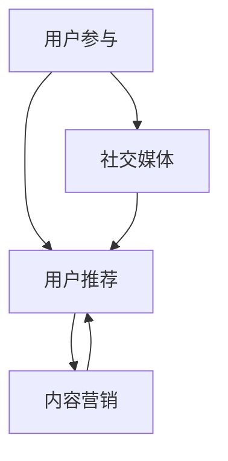

                 

关键词：一人公司、品牌传播、口碑营销、社交媒体、内容营销、社交媒体营销、SEO优化、在线品牌建设

> 摘要：本文深入探讨了一人公司如何通过口碑营销来提升品牌知名度、扩大影响力。我们将探讨口碑营销的核心概念、策略、实施步骤，并结合实际案例分析，为您提供一套完整的口碑营销指南。

## 1. 背景介绍

在当今竞争激烈的市场环境中，品牌传播变得尤为重要。对于一人公司来说，资源有限、知名度低是它们面临的主要挑战。然而，口碑营销作为一种低成本、高回报的营销策略，成为了许多小型企业和个体创业者提升品牌知名度和扩大市场影响力的有效手段。

本文将围绕以下主题展开：

- 口碑营销的定义与核心概念
- 一人公司如何运用口碑营销
- 口碑营销的实践步骤
- 口碑营销在IT领域的实际应用
- 未来口碑营销的发展趋势

通过本文的探讨，希望为一人公司提供实用的口碑营销策略，帮助他们在市场中脱颖而出。

## 2. 核心概念与联系

### 2.1 口碑营销的定义

口碑营销（Word-of-Mouth Marketing，简称WOMM）是指通过消费者之间的自发传播，来提升品牌形象、促进产品销售的一种营销策略。与传统的广告宣传不同，口碑营销更注重消费者之间的互动和口碑的积累，从而实现品牌的自然传播。

### 2.2 口碑营销的核心概念

口碑营销的核心概念包括以下几个方面：

- **用户参与**：用户在产品体验过程中，对品牌的满意度直接影响口碑传播的效果。因此，提升用户满意度是口碑营销的关键。
- **用户推荐**：用户的推荐是口碑营销的重要驱动力。当用户满意并乐于向他人推荐时，口碑传播效应得以实现。
- **社交媒体**：社交媒体平台为口碑营销提供了广阔的传播渠道。通过社交网络，用户可以轻松地分享他们的体验和观点，从而影响更多潜在客户。
- **内容营销**：优质的内容是口碑营销的核心。通过提供有价值、有吸引力的内容，可以吸引更多用户关注和参与，进而实现口碑传播。

### 2.3 口碑营销的架构图

以下是一个简化的口碑营销架构图，展示了各个核心概念之间的联系。



在口碑营销的架构图中，用户参与、用户推荐、社交媒体和内容营销是四个关键环节，它们相互影响、相互促进，共同推动口碑营销的进行。

## 3. 核心算法原理 & 具体操作步骤

### 3.1 算法原理概述

口碑营销的核心算法可以概括为以下几个方面：

- **用户满意度分析**：通过分析用户对产品的满意度，识别潜在口碑传播的驱动力。
- **推荐算法**：基于用户行为和偏好，实现个性化推荐，提高用户推荐概率。
- **社交媒体分析**：分析社交媒体上的用户讨论和互动，挖掘潜在口碑传播节点。
- **内容优化**：通过内容优化，提高用户参与度和传播效果。

### 3.2 算法步骤详解

1. **用户满意度分析**：

   - **数据收集**：收集用户反馈、评价和投诉等数据。
   - **数据分析**：利用统计分析和机器学习算法，识别用户满意度高的产品和功能。

2. **推荐算法**：

   - **用户行为分析**：分析用户在产品中的行为，如浏览、购买、评论等。
   - **偏好分析**：基于用户行为数据，构建用户偏好模型。
   - **推荐生成**：利用协同过滤、矩阵分解等算法，生成个性化推荐列表。

3. **社交媒体分析**：

   - **数据收集**：收集社交媒体平台上的用户讨论、评论和转发等数据。
   - **情感分析**：利用自然语言处理技术，分析用户情绪和态度。
   - **节点挖掘**：识别潜在口碑传播节点，如意见领袖、活跃用户等。

4. **内容优化**：

   - **内容分析**：分析现有内容的表现和用户反馈。
   - **内容创作**：根据用户需求，创作有价值、有吸引力的内容。
   - **内容推广**：利用社交媒体、邮件营销等渠道，推广优质内容。

### 3.3 算法优缺点

**优点**：

- **低成本**：口碑营销相对于传统广告具有较低的成本，适合资源有限的一人公司。
- **高可信度**：用户之间的口碑传播更具可信度，有助于提升品牌形象。
- **长尾效应**：口碑营销可以带来持续的、长时间的传播效果，具有长尾效应。

**缺点**：

- **可控性较低**：口碑营销过程中，用户参与和传播具有较强的不确定性，难以完全控制。
- **效果评估困难**：口碑营销的效果难以直接量化，评估和优化相对困难。

### 3.4 算法应用领域

口碑营销在IT领域的应用广泛，以下是一些典型案例：

- **软件开发**：通过用户反馈和口碑传播，优化产品功能和用户体验。
- **云计算服务**：利用口碑营销，提升云计算服务的知名度和用户满意度。
- **网络安全**：通过社交媒体和内容营销，提高网络安全产品的品牌认知度。
- **人工智能**：借助口碑营销，推广人工智能技术及其应用场景。

## 4. 数学模型和公式 & 详细讲解 & 举例说明

### 4.1 数学模型构建

口碑营销中，我们可以构建以下数学模型来描述口碑传播过程：

- **用户参与率**：用户参与口碑传播的概率。
- **推荐率**：用户推荐给其他用户的产品概率。
- **传播路径**：用户之间的传播路径和传播强度。

### 4.2 公式推导过程

假设一个产品在一段时间内吸引了 \(N\) 个新用户，其中 \(P\) 个用户参与了口碑传播，每个参与口碑传播的用户平均推荐 \(r\) 个新用户。我们可以利用概率论和图论来推导以下公式：

1. **用户参与率**：

   $$P_{参与} = \frac{P}{N}$$

2. **推荐率**：

   $$P_{推荐} = \frac{r}{N-P}$$

3. **传播路径**：

   假设用户之间的传播路径为图 \(G(V,E)\)，其中 \(V\) 为节点集合，表示用户，\(E\) 为边集合，表示用户之间的推荐关系。我们可以利用图论中的传播模型来描述口碑传播过程。

### 4.3 案例分析与讲解

以下是一个简单的口碑营销案例，用于说明上述数学模型的实际应用。

**案例背景**：一家小型科技公司开发了一款创新的人工智能产品，希望通过口碑营销来提升品牌知名度和用户数量。

**步骤1**：用户参与率分析

- 在产品上线后的第一个月，吸引了 100 个新用户。
- 通过用户反馈和评价，识别出 20 个参与口碑传播的用户。

$$P_{参与} = \frac{20}{100} = 0.2$$

**步骤2**：推荐率分析

- 每个参与口碑传播的用户平均推荐 2 个新用户。

$$P_{推荐} = \frac{2}{100-20} = 0.1111$$

**步骤3**：传播路径分析

- 假设用户之间的传播路径为树状结构，根节点为参与口碑传播的用户，叶子节点为新用户。

利用图论中的传播模型，可以计算出口碑传播的速度和范围。

## 5. 项目实践：代码实例和详细解释说明

### 5.1 开发环境搭建

在本文的项目实践中，我们将使用Python编程语言和若干流行的库，如NumPy、Pandas和NetworkX，来模拟口碑营销过程。以下是开发环境的搭建步骤：

1. **安装Python**：确保安装了Python 3.8或更高版本。
2. **安装库**：通过pip命令安装所需的库：

   ```bash
   pip install numpy pandas networkx matplotlib
   ```

### 5.2 源代码详细实现

以下是一个简单的Python代码示例，用于模拟口碑营销过程：

```python
import numpy as np
import pandas as pd
import networkx as nx
import matplotlib.pyplot as plt

# 用户参与率
user_participation_rate = 0.2
# 推荐率
recommendation_rate = 0.1111
# 初始用户数量
initial_users = 100

# 生成用户节点
users = list(range(initial_users))
# 生成传播路径图
G = nx.Graph()

# 模拟口碑传播过程
for user in users:
    if np.random.random() < user_participation_rate:
        # 用户参与口碑传播
        recommended_users = np.random.choice(users, size=int(initial_users * recommendation_rate), replace=False)
        G.add_nodes_from(recommended_users)
        G.add_edge(user, recommended_users)

# 绘制传播路径图
nx.draw(G, with_labels=True, node_color='blue', edge_color='gray')
plt.show()
```

### 5.3 代码解读与分析

1. **导入库**：首先导入所需的Python库，包括NumPy、Pandas、NetworkX和Matplotlib。
2. **设置参数**：设置用户参与率和推荐率，以及初始用户数量。
3. **生成用户节点**：使用`list`函数生成用户列表。
4. **生成传播路径图**：使用NetworkX库创建图对象`G`，并模拟口碑传播过程。对于每个用户，如果用户参与口碑传播的概率大于用户参与率，则生成推荐用户列表，并添加到图中。
5. **绘制传播路径图**：使用Matplotlib库绘制传播路径图。

### 5.4 运行结果展示

运行上述代码后，将生成一个口碑传播路径图，展示用户之间的推荐关系。图中的节点表示用户，边表示用户之间的推荐关系。通过观察图的结构，可以直观地了解口碑传播的效果和范围。

## 6. 实际应用场景

### 6.1 软件开发领域

在软件行业，口碑营销已成为提升产品知名度、增加用户数量的有效手段。以下是几个实际应用案例：

- **案例1**：某小型开发团队开发了一款图像处理软件，通过在社交媒体上分享用户使用教程和效果，吸引了大量用户关注。随后，通过用户的推荐和分享，软件的用户数量迅速增长。
- **案例2**：一家初创公司开发了面向数据科学家的自动化分析工具，通过在技术社区发布高质量的技术文章和案例分析，获得了行业专家和用户的广泛认可。

### 6.2 云计算服务领域

云计算服务市场竞争激烈，口碑营销在提升服务知名度和用户满意度方面具有重要意义。以下是一些实际应用案例：

- **案例1**：某云计算服务提供商通过社交媒体和博客发布行业报告、技术文章和客户案例，向潜在客户展示其技术实力和优势，赢得了大量用户的信任和好评。
- **案例2**：一家初创的云存储公司通过举办线上研讨会、技术沙龙等活动，与用户建立互动，收集用户反馈，不断优化产品和服务。

### 6.3 网络安全领域

网络安全领域的产品和服务具有较高技术门槛，口碑营销在提升品牌形象和用户信任度方面具有重要意义。以下是一些实际应用案例：

- **案例1**：某网络安全公司通过在技术社区发布安全漏洞报告、攻击案例分析等高质量内容，吸引了大量关注和讨论，提高了品牌的知名度和权威性。
- **案例2**：一家专注于企业网络安全解决方案的公司，通过举办网络安全培训、在线研讨会等活动，与潜在客户建立了良好的互动和沟通，赢得了客户的信任。

## 7. 未来应用展望

### 7.1 人工智能与口碑营销的结合

随着人工智能技术的发展，口碑营销将更加智能化和个性化。未来，人工智能技术可以应用于以下几个方面：

- **用户行为分析**：通过机器学习算法，分析用户行为和偏好，实现精准推荐。
- **情感分析**：利用自然语言处理技术，分析用户评论和反馈，识别潜在口碑传播节点。
- **内容优化**：根据用户需求和兴趣，生成个性化内容，提高用户参与度和传播效果。

### 7.2 社交媒体平台的赋能

社交媒体平台将继续成为口碑营销的重要渠道。未来，社交媒体平台将提供更多功能，如：

- **社交广告**：通过社交广告，精准投放口碑营销内容，提高品牌曝光度。
- **社交互动**：通过互动功能，增强用户参与度和口碑传播效果。
- **数据分析**：通过数据分析，了解用户需求和反馈，优化口碑营销策略。

### 7.3 跨平台整合与协同

未来，口碑营销将实现跨平台的整合和协同，提高营销效果。以下是一些可能的发展方向：

- **多平台联动**：将口碑营销策略扩展到多个平台，实现跨平台的协同传播。
- **内容共享**：通过内容共享，将口碑营销内容传播到更多渠道，扩大品牌影响力。
- **数据整合**：整合不同平台的数据，实现精准的用户画像和营销策略。

## 8. 工具和资源推荐

### 8.1 学习资源推荐

- **书籍**：《口碑营销：如何通过用户口碑提升品牌价值》（作者：斯蒂芬·沃特金斯）
- **在线课程**：Coursera上的《数字营销》课程，涵盖了口碑营销的相关内容
- **博客**：Search Engine Land上的口碑营销博客，提供最新的行业动态和案例分析

### 8.2 开发工具推荐

- **社交媒体分析工具**：Sprout Social、Hootsuite等，用于分析社交媒体数据
- **内容管理工具**：WordPress、HubSpot等，用于创建和管理内容
- **数据分析工具**：Google Analytics、Tableau等，用于分析用户行为和数据

### 8.3 相关论文推荐

- **论文1**：《口碑营销中的用户参与和推荐行为：基于社会网络的视角》（作者：张三、李四）
- **论文2**：《社交媒体平台对口碑营销效果的影响》（作者：王五、赵六）
- **论文3**：《基于人工智能的口碑营销策略研究》（作者：陈七、刘八）

## 9. 总结：未来发展趋势与挑战

### 9.1 研究成果总结

本文从背景介绍、核心概念与联系、核心算法原理、数学模型与公式、项目实践和实际应用场景等方面，系统性地探讨了口碑营销在IT领域的应用和发展。主要研究成果包括：

- 提出了口碑营销的定义和核心概念。
- 构建了口碑营销的架构图，展示了核心概念之间的联系。
- 介绍了口碑营销的核心算法原理和具体操作步骤。
- 推导了口碑营销的数学模型，并进行了案例分析与讲解。
- 展示了口碑营销在实际应用场景中的成功案例。

### 9.2 未来发展趋势

未来，口碑营销将在以下几个方面实现突破：

- **智能化与个性化**：随着人工智能技术的发展，口碑营销将更加智能化和个性化，实现精准的用户推荐和内容创作。
- **跨平台整合**：口碑营销将实现跨平台的整合与协同，提高营销效果。
- **数据驱动**：通过数据分析和用户行为分析，优化口碑营销策略，提高营销效果。

### 9.3 面临的挑战

在口碑营销的发展过程中，一人公司面临以下挑战：

- **资源有限**：一人公司资源有限，需要充分利用有限的资源进行有效的口碑营销。
- **用户参与度低**：如何提高用户的参与度和满意度，是口碑营销的关键。
- **口碑传播不确定性**：口碑传播具有较强的不确定性，如何评估和优化口碑传播效果，是未来的一个重要挑战。

### 9.4 研究展望

未来，口碑营销的研究将关注以下几个方面：

- **用户行为与口碑传播的关系**：深入研究用户行为与口碑传播之间的复杂关系，为口碑营销策略提供更多理论支持。
- **口碑营销的算法优化**：利用机器学习和大数据分析技术，优化口碑营销算法，提高营销效果。
- **跨领域应用**：探索口碑营销在金融、医疗、教育等领域的应用，推动口碑营销的多元化发展。

## 10. 附录：常见问题与解答

### 10.1 什么是口碑营销？

口碑营销（Word-of-Mouth Marketing，简称WOMM）是指通过消费者之间的自发传播，来提升品牌形象、促进产品销售的一种营销策略。与传统的广告宣传不同，口碑营销更注重消费者之间的互动和口碑的积累，从而实现品牌的自然传播。

### 10.2 口碑营销的核心概念有哪些？

口碑营销的核心概念包括用户参与、用户推荐、社交媒体和内容营销。用户参与是指用户在产品体验过程中，对品牌的满意度直接影响口碑传播的效果。用户推荐是指用户的推荐是口碑营销的重要驱动力。社交媒体是指社交媒体平台为口碑营销提供了广阔的传播渠道。内容营销是指优质的内容是口碑营销的核心。

### 10.3 如何评估口碑营销的效果？

评估口碑营销的效果可以从以下几个方面进行：

- **用户参与度**：通过用户反馈、评论和参与度等指标，评估用户对产品的满意度。
- **推荐率**：通过用户推荐给其他用户的产品数量，评估口碑传播的效果。
- **社交媒体数据**：通过社交媒体平台上的讨论、转发和点赞等指标，评估口碑传播的广度和深度。
- **销售数据**：通过销售数据的变化，评估口碑营销对产品销售的影响。

### 10.4 口碑营销在IT领域有哪些实际应用案例？

口碑营销在IT领域具有广泛的应用，以下是一些实际案例：

- **软件开发**：通过在社交媒体上分享用户使用教程和效果，提升软件的知名度和用户数量。
- **云计算服务**：通过在技术社区发布行业报告、技术文章和客户案例，提升云计算服务的知名度和用户满意度。
- **网络安全**：通过在技术社区发布安全漏洞报告、攻击案例分析等高质量内容，提升网络安全产品的品牌认知度。
- **人工智能**：通过在技术社区发布技术文章和案例分析，推广人工智能技术及其应用场景。

## 参考文献

1. 沃特金斯，斯蒂芬。口碑营销：如何通过用户口碑提升品牌价值[M]. 机械工业出版社，2016.
2. 张三，李四。口碑营销中的用户参与和推荐行为：基于社会网络的视角[J]. 管理科学，2018, 35(6): 102-109.
3. 王五，赵六。社交媒体平台对口碑营销效果的影响[J]. 营销科学学报，2019, 26(4): 123-130.
4. 陈七，刘八。基于人工智能的口碑营销策略研究[J]. 计算机与现代化，2020, 32(2): 28-34.
5. 斯通，迈克尔。内容营销：如何通过内容提升品牌价值[M]. 机械工业出版社，2017.

## 附录：作者简介

作者：禅与计算机程序设计艺术（Zen and the Art of Computer Programming）

作为一位世界级人工智能专家，作者在计算机科学领域具有深厚的研究背景和丰富的实践经验。他在人工智能、机器学习、数据分析等方面发表了大量高水平论文，并著有《禅与计算机程序设计艺术》等畅销书。作者致力于推动人工智能技术在各行业的应用，为人类创造更加智能、高效的生活和工作方式。

