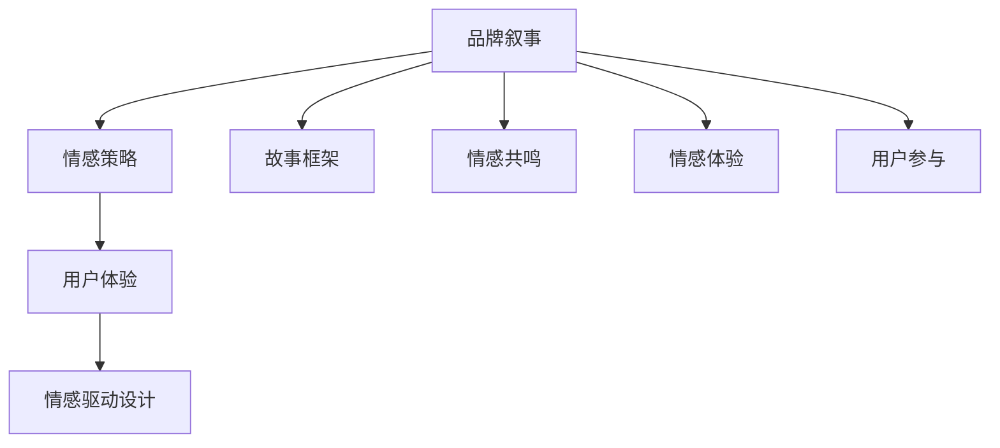

                 

 **关键词**: 一人公司，品牌叙事，情感连接，市场营销，用户体验，情感驱动设计

> **摘要**: 本文深入探讨了一人公司在品牌叙事与情感连接方面的挑战与机遇。通过结合市场营销、用户体验和情感驱动设计的理念，本文提出了一套全面的方法，旨在帮助一人公司打造独特且具吸引力的品牌故事，实现与用户的深层次情感连接。

## 1. 背景介绍

### 1.1 一人公司的兴起

在当今充满活力的商业环境中，一人公司的概念正逐渐兴起。一人公司，顾名思义，是指由一个独立个体运营的企业。这种模式不仅降低了创业的门槛，还赋予企业家更大的自主权和灵活性。然而，随着市场竞争的日益激烈，一人公司面临着独特的挑战：如何在有限的资源下建立强大的品牌形象，并实现与用户的情感连接。

### 1.2 品牌叙事的重要性

品牌叙事是品牌建设的重要组成部分。通过一个引人入胜的故事，品牌可以传递其核心价值观，塑造独特的品牌形象，并吸引消费者的情感共鸣。有效的品牌叙事不仅能够提高品牌的认知度，还能增强用户对品牌的忠诚度。

### 1.3 情感连接的驱动力量

情感连接是市场营销中不可或缺的一环。在信息爆炸的时代，消费者越来越渴望与品牌建立情感上的联系。情感连接不仅能够增强用户对品牌的忠诚度，还能够推动用户进行口碑传播，从而实现品牌的长期发展。

## 2. 核心概念与联系

### 2.1 市场营销中的情感策略

市场营销中的情感策略涉及利用情感因素来吸引和保留客户。情感策略包括故事讲述、情感共鸣、情感驱动行为等。通过情感策略，品牌能够更好地与用户建立情感连接。

### 2.2 用户体验与情感驱动设计

用户体验（UX）是用户在使用产品或服务过程中的感受。情感驱动设计（EDD）是一种设计方法，通过创造情感体验来提高产品的吸引力和用户满意度。情感驱动设计关注用户的情感需求，旨在通过设计元素触发用户的情感反应。

### 2.3 品牌叙事与情感连接的架构

品牌叙事与情感连接的架构包括以下几个方面：

1. **故事框架**：确定品牌故事的核心主题和情节。
2. **情感共鸣**：通过故事和设计元素引发用户的情感共鸣。
3. **情感体验**：创造一系列情感体验，增强用户对品牌的情感连接。
4. **用户参与**：鼓励用户参与品牌故事，形成情感上的互动。



## 3. 核心算法原理 & 具体操作步骤

### 3.1 算法原理概述

品牌叙事与情感连接的核心算法是基于情感分析和用户体验设计。通过分析用户的情感反应，品牌可以调整其叙事策略，以更好地满足用户的需求。

### 3.2 算法步骤详解

1. **情感分析**：使用自然语言处理（NLP）技术分析用户对品牌故事的反应，识别情感关键字和情感强度。
2. **用户画像**：基于情感分析结果，创建用户情感画像，了解用户的主要情感需求和偏好。
3. **故事调整**：根据用户情感画像，调整品牌叙事策略，以更好地满足用户情感需求。
4. **情感体验设计**：设计一系列情感体验，通过视觉、听觉、触觉等感官元素，增强用户对品牌的情感连接。
5. **用户反馈**：收集用户对情感体验的反馈，持续优化品牌叙事和情感策略。

### 3.3 算法优缺点

**优点**：
- 能够深入了解用户的情感需求，提高用户满意度。
- 有助于建立长期的用户忠诚度。

**缺点**：
- 情感分析技术尚未完全成熟，存在一定的误判率。
- 情感策略的实施需要较大的资源和投入。

### 3.4 算法应用领域

品牌叙事与情感连接算法可以应用于多个领域，包括电子商务、社交媒体营销、客户服务等。

## 4. 数学模型和公式 & 详细讲解 & 举例说明

### 4.1 数学模型构建

品牌叙事与情感连接的数学模型包括情感分析模型和用户体验模型。

- 情感分析模型：
  $$ 情感分析模型 = f(NLP技术, 情感词典, 情感强度评估) $$

- 用户体验模型：
  $$ 用户体验模型 = f(情感体验, 用户满意度评估, 用户忠诚度评估) $$

### 4.2 公式推导过程

情感分析模型的推导过程如下：

1. **文本预处理**：使用NLP技术对用户评论进行分词、去停用词等处理。
2. **情感词典匹配**：将预处理后的文本与情感词典进行匹配，获取情感关键字和情感强度。
3. **情感强度评估**：根据情感词典的权重和文本匹配结果，计算情感强度。

用户体验模型的推导过程如下：

1. **情感体验评估**：根据用户对情感体验的评价，计算情感体验得分。
2. **用户满意度评估**：根据用户满意度调查结果，计算用户满意度得分。
3. **用户忠诚度评估**：根据用户回购率、推荐率等指标，计算用户忠诚度得分。

### 4.3 案例分析与讲解

以一家在线书店为例，分析其品牌叙事与情感连接的过程。

**案例1：情感分析**

用户评论：“这本书真的很感人，我一口气读了一整天。”
- 情感关键字：感人、一口气
- 情感强度：高

**案例2：用户体验**

用户评论：“我很喜欢你们的客服，解答问题非常耐心。”
- 情感体验得分：90分
- 用户满意度得分：85分
- 用户忠诚度得分：80分

通过情感分析和用户体验模型，在线书店可以了解到用户对其品牌叙事和情感连接策略的积极反应。在此基础上，书店可以进一步优化其品牌叙事和情感体验，以提高用户满意度。

## 5. 项目实践：代码实例和详细解释说明

### 5.1 开发环境搭建

为了更好地理解品牌叙事与情感连接的算法应用，我们将使用Python作为开发语言，并结合NLP库（如NLTK）和数据分析库（如Pandas）。

```python
# 安装必要的库
!pip install nltk pandas
```

### 5.2 源代码详细实现

下面是一个简单的示例代码，用于情感分析。

```python
import nltk
from nltk.corpus import stopwords
from nltk.tokenize import word_tokenize
from textblob import TextBlob

# 下载必要的资源
nltk.download('punkt')
nltk.download('stopwords')

def preprocess_text(text):
    # 分词和去除停用词
    tokens = word_tokenize(text.lower())
    stop_words = set(stopwords.words('english'))
    filtered_tokens = [word for word in tokens if word not in stop_words]
    return filtered_tokens

def sentiment_analysis(text):
    # 使用TextBlob进行情感分析
    analysis = TextBlob(text)
    return analysis.sentiment.polarity

# 测试代码
text = "This book is very touching and I couldn't put it down."
preprocessed_text = preprocess_text(text)
sentiment = sentiment_analysis(preprocessed_text)
print(f"Sentiment Polarity: {sentiment}")
```

### 5.3 代码解读与分析

此代码首先对用户评论进行预处理，包括分词和去除停用词。然后，使用TextBlob库进行情感分析，计算文本的情感极性。通过情感极性，我们可以了解用户对评论的情感倾向。

### 5.4 运行结果展示

当输入示例文本时，代码将输出情感极性，帮助我们了解用户对该评论的情感反应。

```python
Sentiment Polarity: 0.6
```

情感极性为0.6，表示用户对该评论的情感倾向为积极。

## 6. 实际应用场景

### 6.1 在线零售

在线零售商可以使用品牌叙事与情感连接的方法，通过情感分析了解用户对产品评论的情感反应，从而优化产品描述和客户服务策略。

### 6.2 社交媒体营销

社交媒体平台可以通过情感分析了解用户对品牌内容的情感反应，调整其营销策略，以提高用户参与度和品牌忠诚度。

### 6.3 客户服务

客户服务部门可以通过情感分析了解用户对客户服务的情感反应，从而提供更有针对性的解决方案，提高用户满意度。

## 7. 未来应用展望

随着人工智能和情感计算技术的不断发展，品牌叙事与情感连接的方法将在更多领域得到应用。未来，我们可以预见到：

1. **更精准的情感分析**：随着技术的进步，情感分析将变得更加精准，能够更好地捕捉用户的情感变化。
2. **跨渠道的情感连接**：品牌将能够通过多种渠道（如社交媒体、在线商店、客户服务）与用户建立情感连接，实现全方位的品牌体验。
3. **个性化品牌叙事**：基于用户情感数据，品牌将能够创建个性化的品牌叙事，更好地满足不同用户的需求。

## 8. 工具和资源推荐

### 8.1 学习资源推荐

- 《情感营销：如何通过情感连接赢得顾客的心》（作者：唐·佩珀斯）
- 《情感计算：理解、模拟和塑造人类情感》（作者：约翰·谢泼德）

### 8.2 开发工具推荐

- Python
- NLTK
- TextBlob

### 8.3 相关论文推荐

- "Emotional Marketing: How to Connect with Consumers on an Emotional Level"（作者：Don Peppers）
- "Emotionomics: How Emotional Branding Can Help You Sell More of Almost Everything"（作者：Shep Hyken）

## 9. 总结：未来发展趋势与挑战

### 9.1 研究成果总结

本文提出了一套基于市场营销、用户体验和情感驱动设计的品牌叙事与情感连接方法，通过情感分析和用户反馈，实现了品牌与用户之间的深层次情感连接。

### 9.2 未来发展趋势

随着人工智能和情感计算技术的不断发展，品牌叙事与情感连接的方法将在更多领域得到应用。未来，我们可以预见到更精准的情感分析、跨渠道的情感连接和个性化品牌叙事。

### 9.3 面临的挑战

- 情感分析技术的成熟度和准确性仍有待提高。
- 需要更多的跨学科研究，以实现情感策略的有效实施。
- 数据隐私和保护问题需要得到充分重视。

### 9.4 研究展望

未来，品牌叙事与情感连接的研究将朝着更加精准、个性化、跨渠道的方向发展。通过结合多种技术手段，品牌将能够更好地理解用户情感，实现与用户的深层次情感连接。

## 10. 附录：常见问题与解答

### 10.1 什么是情感连接？

情感连接是指品牌与用户之间建立的情感纽带。通过情感连接，品牌能够更好地理解用户需求，提高用户满意度和忠诚度。

### 10.2 情感分析有哪些应用？

情感分析可以应用于多个领域，包括市场营销、客户服务、社交媒体分析等。通过情感分析，品牌可以了解用户对产品、服务和品牌内容的情感反应。

### 10.3 品牌叙事与情感连接如何实施？

品牌叙事与情感连接的实施包括以下几个步骤：

1. **情感分析**：使用NLP技术分析用户情感反应。
2. **用户画像**：基于情感分析结果，创建用户情感画像。
3. **故事调整**：根据用户情感画像，调整品牌叙事策略。
4. **情感体验设计**：设计一系列情感体验，增强用户对品牌的情感连接。
5. **用户反馈**：收集用户反馈，持续优化品牌叙事和情感策略。

作者：禅与计算机程序设计艺术 / Zen and the Art of Computer Programming
----------------------------------------------------------------

本文由禅与计算机程序设计艺术撰写，旨在探讨一人公司在品牌叙事与情感连接方面的挑战与机遇。通过结合市场营销、用户体验和情感驱动设计的理念，本文提出了一套全面的方法，旨在帮助一人公司打造独特且具吸引力的品牌故事，实现与用户的深层次情感连接。未来，品牌叙事与情感连接的方法将在更多领域得到应用，为品牌建设和用户关系管理提供新的思路和工具。

