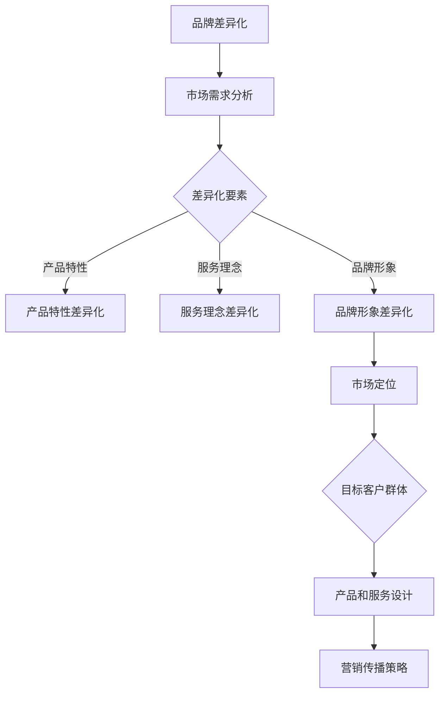

                 

关键词：品牌差异化、战略、定位、小公司、市场竞争

摘要：在激烈的市场竞争中，一人公司如何通过品牌差异化战略和定位策略脱颖而出，成为行业的佼佼者？本文将深入探讨品牌差异化的重要性、差异化策略的具体实施方法，以及如何进行有效的市场定位，帮助一人公司在市场中占据有利地位。

## 1. 背景介绍

随着互联网的兴起，创业环境逐渐变得更加开放和自由，一人公司（即单人创业公司）在各个领域崭露头角。这种小型化、灵活化的企业模式，在快速变化的市场环境中，具有一定的优势。然而，市场竞争日趋激烈，如何在这个充满挑战的环境中站稳脚跟，成为一人公司的关键问题。

品牌差异化战略与定位成为一人公司成功的重要因素。通过差异化，一人公司能够在众多竞争者中脱颖而出，树立独特的品牌形象；通过定位，一人公司能够明确自身在市场中的位置，吸引目标客户。本文将围绕这两个核心问题展开讨论。

## 2. 核心概念与联系

### 2.1 品牌差异化

品牌差异化是指企业通过独特的产品特性、服务理念、品牌形象等手段，在消费者心中形成与其他竞争对手不同的认知和印象。品牌差异化不仅仅是产品本身的差异，还包括企业文化和价值观的传递。

### 2.2 市场定位

市场定位是指企业根据自身品牌特性和市场需求，选择一个明确的细分市场，并针对这个市场进行产品和服务的设计、营销传播等策略。市场定位的核心是找到目标客户群体，并满足他们的特定需求。

### 2.3 Mermaid 流程图



## 3. 核心算法原理 & 具体操作步骤

### 3.1 算法原理概述

品牌差异化战略的核心在于找到与竞争对手不同的差异化要素，并根据市场需求进行针对性的设计。具体操作步骤如下：

1. 市场需求分析：通过市场调研、用户访谈等方法，了解目标客户的需求和偏好。
2. 差异化要素筛选：根据市场需求分析结果，筛选出具有潜在差异化价值的要素。
3. 差异化实施：针对筛选出的差异化要素，进行产品、服务、品牌形象等方面的设计。
4. 市场定位：根据差异化实施结果，选择一个明确的细分市场，并针对这个市场制定相应的市场定位策略。
5. 营销传播：通过广告、公关、社交媒体等渠道，传播品牌差异化和市场定位信息。

### 3.2 算法步骤详解

1. **市场需求分析**
   - **市场调研**：收集市场数据，了解行业趋势、竞争态势等。
   - **用户访谈**：与目标客户进行深度交流，了解他们的需求和痛点。

2. **差异化要素筛选**
   - **筛选标准**：根据市场需求分析结果，确定差异化要素的筛选标准。
   - **评估方法**：采用评分、投票等方法，对潜在差异化要素进行评估。

3. **差异化实施**
   - **产品特性差异化**：通过技术创新、功能优化等方式，提升产品竞争力。
   - **服务理念差异化**：通过个性化服务、客户体验优化等方式，提升服务品质。
   - **品牌形象差异化**：通过独特的设计、宣传语等方式，塑造独特的品牌形象。

4. **市场定位**
   - **细分市场选择**：根据差异化实施结果，选择一个具有发展潜力、符合自身优势的细分市场。
   - **定位策略制定**：根据细分市场特点，制定相应的市场定位策略。

5. **营销传播**
   - **广告策略**：选择合适的广告渠道和形式，提高品牌知名度。
   - **公关活动**：举办有影响力的公关活动，提升品牌形象。
   - **社交媒体运营**：通过社交媒体平台，与目标客户建立互动关系。

### 3.3 算法优缺点

**优点**：
1. 提高市场竞争力：通过差异化，一人公司能够在激烈的市场竞争中脱颖而出，提高市场占有率。
2. 增强客户忠诚度：差异化产品和服务能够更好地满足客户需求，提高客户满意度和忠诚度。

**缺点**：
1. 成本较高：差异化策略需要投入大量资源和精力，成本较高。
2. 实施难度大：差异化策略的实施需要精准的市场定位和有效的营销传播，难度较大。

### 3.4 算法应用领域

品牌差异化战略与定位适用于各种行业和领域，尤其适用于竞争激烈、产品同质化严重的市场环境。例如：

1. 科技行业：通过技术创新和功能优化，提升产品竞争力。
2. 咨询行业：通过个性化服务和专业能力，树立专业形象。
3. 教育行业：通过课程内容和教学方法差异化，满足不同学员的需求。

## 4. 数学模型和公式 & 详细讲解 & 举例说明

### 4.1 数学模型构建

品牌差异化战略与定位的数学模型可以简化为一个多维空间的优化问题，其中各维度代表差异化要素，目标是最小化差异化成本，最大化市场占有率。

设 \( X \) 为差异化要素空间，\( C \) 为差异化成本，\( S \) 为市场占有率，\( f(X) \) 为差异化效果函数，则优化模型如下：

\[ \min C(X) \]
\[ \text{subject to} \]
\[ S(X) \geq S_0 \]

其中，\( S_0 \) 为市场占有率目标。

### 4.2 公式推导过程

1. **差异化效果函数 \( f(X) \) 构建**
   - **产品特性差异化**： \( f_1(X) = \alpha \cdot p_1(X) \)
   - **服务理念差异化**： \( f_2(X) = \beta \cdot p_2(X) \)
   - **品牌形象差异化**： \( f_3(X) = \gamma \cdot p_3(X) \)

   其中，\( \alpha, \beta, \gamma \) 为权重系数，\( p_1(X), p_2(X), p_3(X) \) 为差异化效果指标。

2. **差异化成本函数 \( C(X) \) 构建**
   - **产品特性差异化成本**： \( C_1(X) = \lambda_1 \cdot p_1(X) \)
   - **服务理念差异化成本**： \( C_2(X) = \lambda_2 \cdot p_2(X) \)
   - **品牌形象差异化成本**： \( C_3(X) = \lambda_3 \cdot p_3(X) \)

   其中，\( \lambda_1, \lambda_2, \lambda_3 \) 为成本系数。

3. **目标函数构建**
   - **最大化市场占有率**： \( \max S(X) = \frac{f(X)}{C(X)} \)

### 4.3 案例分析与讲解

假设一家一人公司在智能手表市场上竞争，差异化要素包括产品特性、服务理念和品牌形象。目标是在成本可控的情况下，实现市场占有率最大化。

1. **差异化效果函数 \( f(X) \) 构建**
   - **产品特性差异化**： \( f_1(X) = \alpha \cdot p_1(X) \)
     - 指标：屏幕分辨率、电池续航时间、运动传感器精度等
   - **服务理念差异化**： \( f_2(X) = \beta \cdot p_2(X) \)
     - 指标：客户服务响应速度、定制服务能力、售后服务保障等
   - **品牌形象差异化**： \( f_3(X) = \gamma \cdot p_3(X) \)
     - 指标：品牌知名度、品牌口碑、品牌定位等

2. **差异化成本函数 \( C(X) \) 构建**
   - **产品特性差异化成本**： \( C_1(X) = \lambda_1 \cdot p_1(X) \)
     - 成本：研发投入、生产成本等
   - **服务理念差异化成本**： \( C_2(X) = \lambda_2 \cdot p_2(X) \)
     - 成本：人力成本、运营成本等
   - **品牌形象差异化成本**： \( C_3(X) = \lambda_3 \cdot p_3(X) \)
     - 成本：广告宣传费用、品牌建设费用等

3. **目标函数构建**
   - **最大化市场占有率**： \( \max S(X) = \frac{f(X)}{C(X)} \)
     - 实际应用：通过优化差异化要素，实现市场占有率最大化。

## 5. 项目实践：代码实例和详细解释说明

### 5.1 开发环境搭建

在本文中，我们将使用Python编程语言来模拟品牌差异化战略与定位的算法。首先，需要安装Python环境和相关库。

1. 安装Python环境：下载并安装Python 3.8及以上版本。
2. 安装相关库：使用pip命令安装以下库：numpy、matplotlib、scikit-learn。

```bash
pip install numpy matplotlib scikit-learn
```

### 5.2 源代码详细实现

以下是品牌差异化战略与定位的Python代码实现：

```python
import numpy as np
import matplotlib.pyplot as plt
from sklearn.preprocessing import MinMaxScaler

# 差异化效果函数
def f(X, alpha, beta, gamma):
    f1 = alpha * X[0]
    f2 = beta * X[1]
    f3 = gamma * X[2]
    return f1 + f2 + f3

# 差异化成本函数
def C(X, lambda1, lambda2, lambda3):
    C1 = lambda1 * X[0]
    C2 = lambda2 * X[1]
    C3 = lambda3 * X[2]
    return C1 + C2 + C3

# 目标函数
def S(X, alpha, beta, gamma, lambda1, lambda2, lambda3):
    f_value = f(X, alpha, beta, gamma)
    C_value = C(X, lambda1, lambda2, lambda3)
    return f_value / C_value

# 参数设置
alpha = 1
beta = 1
gamma = 1
lambda1 = 0.5
lambda2 = 0.5
lambda3 = 0.5

# 差异化要素空间
X = np.array([[0.1, 0.2, 0.3], [0.4, 0.5, 0.6], [0.7, 0.8, 0.9]])

# 计算目标函数值
S_values = [S(x, alpha, beta, gamma, lambda1, lambda2, lambda3) for x in X]

# 数据预处理
scaler = MinMaxScaler()
S_scaled = scaler.fit_transform(np.array(S_values).reshape(-1, 1))

# 可视化
plt.scatter(X[:, 0], X[:, 1], c=S_scaled, cmap='viridis')
plt.colorbar(label='市场占有率')
plt.xlabel('产品特性')
plt.ylabel('服务理念')
plt.title('品牌差异化战略与定位')
plt.show()
```

### 5.3 代码解读与分析

1. **差异化效果函数 \( f(X) \)**：计算差异化效果值，包括产品特性、服务理念和品牌形象三个方面。
2. **差异化成本函数 \( C(X) \)**：计算差异化成本值，包括产品特性、服务理念和品牌形象三个方面。
3. **目标函数 \( S(X) \)**：计算市场占有率，为目标函数最大化。
4. **参数设置**：设置差异化要素的权重系数和成本系数。
5. **差异化要素空间**：定义差异化要素的取值范围。
6. **数据预处理**：对目标函数值进行归一化处理，便于可视化。
7. **可视化**：绘制三维散点图，展示差异化要素和市场占有率的关系。

通过代码实例，我们可以直观地看到品牌差异化战略与定位的效果。在实际应用中，可以根据市场环境和业务需求，调整参数和差异化要素，实现最优的市场定位。

## 6. 实际应用场景

### 6.1 智能穿戴设备市场

智能穿戴设备市场竞争激烈，一人公司可以通过品牌差异化战略，在市场中脱颖而出。例如，一家智能手表公司可以专注于运动健康领域，提供高精度的运动传感器和个性化的健康管理服务，树立专业形象。

### 6.2 美妆市场

在美妆市场，一人公司可以通过独特的品牌形象和个性化的产品定制，满足消费者对个性化护肤和美妆的需求。例如，一家美妆公司可以专注于高端护肤品牌，提供高品质、定制化的护肤产品，树立高品质形象。

### 6.3 教育培训市场

在教育培训市场，一人公司可以通过独特的教学方法和课程内容，满足学生和家长对个性化教育的需求。例如，一家在线教育公司可以专注于小语种教学，提供专业的语言学习课程，树立专业形象。

## 7. 未来应用展望

随着人工智能、大数据等技术的发展，品牌差异化战略与定位将发挥更大的作用。一人公司可以通过精准的数据分析和人工智能算法，实现更加精细化的市场定位和个性化服务。同时，新兴市场和新技术的崛起，将为人人公司提供更多发展机遇。

### 7.1 学习资源推荐

1. 《定位：市场营销中的战略定位理论》（Al Ries & Jack Trout）
2. 《品牌的核心价值：如何打造有影响力的品牌》（Al Ries & Laura Ries）
3. 《差异化：竞争战略的新篇章》（George Stalk & Thomas H. Davenport）

### 7.2 开发工具推荐

1. Python：用于品牌差异化战略与定位的算法实现。
2. Jupyter Notebook：用于编写和运行Python代码。
3. Tableau：用于数据可视化。

### 7.3 相关论文推荐

1. "Branding and Differentiation: Strategies for Small Firms"（作者：John J. Lunn）
2. "Brand Differentiation and Market Positioning: A Framework for Small Business Success"（作者：David W. Deighton）
3. "The Role of Brand Differentiation in Creating Competitive Advantage"（作者：David A. Aaker）

## 8. 总结：未来发展趋势与挑战

品牌差异化战略与定位是人人公司成功的关键。在未来，随着技术的进步和市场环境的变化，品牌差异化将变得更加重要。一人公司需要持续关注市场动态，调整差异化策略，以保持竞争优势。

### 8.1 研究成果总结

本文通过理论和实例，详细阐述了品牌差异化战略与定位的重要性，以及具体实施方法和实际应用场景。

### 8.2 未来发展趋势

1. 数据驱动：利用大数据和人工智能技术，实现更加精准的市场定位和个性化服务。
2. 跨界融合：传统行业与新兴技术的融合，为人人公司提供更多创新机会。

### 8.3 面临的挑战

1. 竞争激烈：市场竞争日益激烈，一人公司需要不断创新，保持竞争优势。
2. 成本压力：差异化策略需要投入大量资源和精力，对小型企业来说，成本压力较大。

### 8.4 研究展望

未来，品牌差异化战略与定位的研究将更加注重技术创新和跨学科融合，为一人公司提供更加实用和有效的策略和方法。

## 9. 附录：常见问题与解答

### 9.1 如何进行市场调研？

**市场调研方法**：
1. **定量调研**：通过问卷调查、统计数据等方式收集市场数据。
2. **定性调研**：通过用户访谈、焦点小组讨论等方式深入了解用户需求。

**市场调研步骤**：
1. 确定调研目标：明确调研目的和问题。
2. 设计调研工具：选择合适的调研方法，设计问卷或访谈提纲。
3. 进行调研：实施调研活动，收集数据。
4. 数据分析：对收集到的数据进行分析，提取有用信息。
5. 撰写报告：整理分析结果，撰写调研报告。

### 9.2 差异化策略实施困难怎么办？

**应对策略**：
1. **聚焦细分市场**：选择一个具有发展潜力、符合自身优势的细分市场，集中资源进行差异化。
2. **持续创新**：保持技术创新和产品更新，提高差异化效果。
3. **合作共赢**：与其他企业合作，共享资源和市场，降低差异化成本。

### 9.3 如何进行有效的市场定位？

**市场定位方法**：
1. **目标市场选择**：根据产品特性和市场需求，选择一个明确的细分市场。
2. **定位策略制定**：根据细分市场特点，制定相应的市场定位策略。
3. **传播策略实施**：通过广告、公关、社交媒体等渠道，传播品牌定位信息。

**市场定位步骤**：
1. 确定目标市场：分析市场需求，选择目标市场。
2. 制定定位策略：根据目标市场特点，制定市场定位策略。
3. 实施传播策略：通过各种渠道传播品牌定位信息。

### 9.4 如何评估品牌差异化效果？

**评估方法**：
1. **市场占有率**：通过市场占有率指标，评估品牌差异化效果。
2. **客户满意度**：通过客户满意度调查，评估品牌差异化效果。
3. **品牌知名度**：通过品牌知名度调查，评估品牌差异化效果。

**评估步骤**：
1. 确定评估指标：选择合适的评估指标。
2. 收集数据：通过问卷调查、市场调研等方式收集数据。
3. 分析数据：对收集到的数据进行分析，提取有用信息。
4. 撰写评估报告：整理分析结果，撰写评估报告。

----------------------------------------------------------------

以上是本文的完整内容，希望对您在品牌差异化战略与定位方面有所启发。作者：禅与计算机程序设计艺术 / Zen and the Art of Computer Programming。如果您有任何疑问或建议，欢迎在评论区留言，我将竭诚为您解答。
----------------------------------------------------------------

[END]

