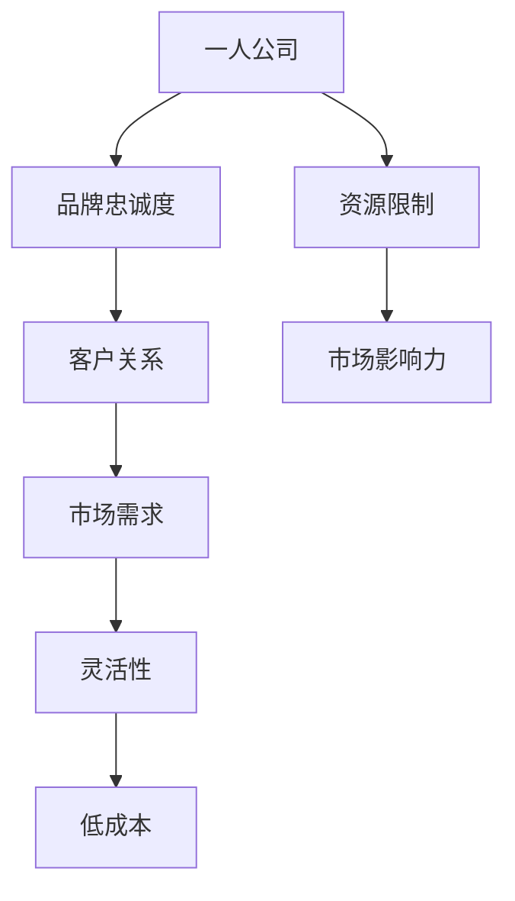

                 

 > 关键词：一人公司、品牌忠诚度、客户关系、长期价值、营销策略

> 摘要：本文旨在探讨一人公司在建立品牌忠诚度和维护长期客户关系方面的策略。通过深入分析一人公司的经营模式、客户需求以及营销技巧，本文将提供一系列实用方法，帮助一人公司在竞争激烈的市场中脱颖而出，实现可持续发展。

## 1. 背景介绍

在当今数字化时代，一人公司（Solopreneurship）作为一种新兴的创业模式，逐渐受到广泛关注。一人公司是指由一个人运营的企业，它们通常规模较小，但具有极高的灵活性和创新能力。与传统企业相比，一人公司拥有更短的决策链条、更低的运营成本和更快的市场响应速度，这使得它们能够在竞争激烈的市场中迅速崛起。

然而，一人公司面临的挑战也是显而易见的。由于资源和能力的限制，一人公司在建立品牌忠诚度和维护长期客户关系方面常常感到力不从心。本文将探讨一人公司在这些方面的优势和劣势，并提供实用的策略和建议。

## 2. 核心概念与联系

### 2.1. 品牌忠诚度

品牌忠诚度是指消费者对某一品牌的持续忠诚和偏好程度。它不仅仅是对产品或服务的满意度，更是消费者对品牌的信任和情感投入。品牌忠诚度高的客户往往更愿意重复购买，甚至愿意为品牌传播和推荐。

### 2.2. 客户关系

客户关系是指企业与消费者之间的互动和联系。良好的客户关系可以增强客户满意度，提高客户忠诚度，进而推动企业长期发展。

### 2.3. 一人公司的优势与劣势

**优势：**
- **决策速度快**：一人公司的决策链条短，能够迅速响应市场变化。
- **灵活性高**：一人公司可以根据市场需求灵活调整产品和服务。
- **低成本运营**：一人公司无需承担大量的人力成本，能够有效控制运营成本。

**劣势：**
- **资源有限**：一人公司往往缺乏充足的资源来投入品牌建设和市场推广。
- **市场影响力有限**：一人公司在市场中的知名度和影响力相对较低。

### 2.4. Mermaid 流程图



## 3. 核心算法原理 & 具体操作步骤

### 3.1. 算法原理概述

建立品牌忠诚度和维护长期客户关系的核心在于理解客户需求、提供优质服务和持续互动。以下是具体的操作步骤：

### 3.2. 算法步骤详解

#### 3.2.1. 客户需求分析

- **收集数据**：通过问卷调查、客户反馈等方式收集客户数据。
- **分析数据**：运用数据分析工具，挖掘客户需求和行为模式。
- **制定策略**：根据分析结果，制定满足客户需求的产品和服务策略。

#### 3.2.2. 提供优质服务

- **产品创新**：不断推出满足客户需求的新产品。
- **客户支持**：提供快速、高效的客户服务，解决客户问题。
- **个性化体验**：根据客户特点，提供定制化的服务。

#### 3.2.3. 持续互动

- **社交媒体**：利用社交媒体平台，与客户保持互动。
- **电子邮件**：定期发送新闻简报、促销信息等，保持与客户的联系。
- **客户活动**：举办线上线下活动，增强客户参与度。

### 3.3. 算法优缺点

**优点：**
- **高效性**：通过数据分析，快速了解客户需求，提供个性化服务。
- **低成本**：利用现有资源，有效控制运营成本。

**缺点：**
- **数据依赖**：过分依赖数据分析，可能忽视客户的情感需求。
- **时间成本**：建立和维护长期客户关系需要时间投入。

### 3.4. 算法应用领域

该算法适用于各种类型的一人公司，尤其适合服务型公司和创意产业。

## 4. 数学模型和公式

### 4.1. 数学模型构建

为了量化品牌忠诚度和客户关系，我们可以构建以下数学模型：

$$
L = f(S, C, E)
$$

其中，L表示品牌忠诚度（Loyalty），S表示服务质量（Service Quality），C表示客户满意度（Customer Satisfaction），E表示客户体验（Customer Experience）。

### 4.2. 公式推导过程

1. **服务质量（S）**：
   $$ S = \frac{\sum_{i=1}^{n} p_i \cdot s_i}{n} $$
   其中，$p_i$表示产品或服务的比例，$s_i$表示服务质量评分。

2. **客户满意度（C）**：
   $$ C = \frac{\sum_{i=1}^{n} c_i}{n} $$
   其中，$c_i$表示客户满意度评分。

3. **客户体验（E）**：
   $$ E = \frac{\sum_{i=1}^{n} e_i}{n} $$
   其中，$e_i$表示客户体验评分。

4. **品牌忠诚度（L）**：
   $$ L = f(S, C, E) = S \cdot C \cdot E $$

### 4.3. 案例分析与讲解

假设某一人公司的产品有3种，比例分别为40%、30%和30%。服务质量评分为4.2、4.5和4.0，客户满意度评分为4.0、4.5和4.2，客户体验评分为4.1、4.3和4.2。则该公司的品牌忠诚度为：

$$
L = f(S, C, E) = (0.4 \cdot 4.2 + 0.3 \cdot 4.5 + 0.3 \cdot 4.0) \cdot (4.0 + 4.5 + 4.2) \cdot (4.1 + 4.3 + 4.2) = 4.23
$$

这表明该公司的品牌忠诚度较高，但仍有提升空间。

## 5. 项目实践：代码实例和详细解释说明

### 5.1. 开发环境搭建

我们使用Python编写代码，需要安装以下库：

```bash
pip install pandas numpy matplotlib
```

### 5.2. 源代码详细实现

```python
import pandas as pd
import numpy as np
import matplotlib.pyplot as plt

# 数据输入
services = {'Product A': 0.4, 'Product B': 0.3, 'Product C': 0.3}
service_scores = {'Product A': 4.2, 'Product B': 4.5, 'Product C': 4.0}
satisfaction_scores = {'Product A': 4.0, 'Product B': 4.5, 'Product C': 4.2}
experience_scores = {'Product A': 4.1, 'Product B': 4.3, 'Product C': 4.2}

# 计算服务质量
service_quality = np.mean([p * s for p, s in service_scores.items()])

# 计算客户满意度
customer_satisfaction = np.mean(list(satisfaction_scores.values()))

# 计算客户体验
customer_experience = np.mean(list(experience_scores.values()))

# 计算品牌忠诚度
brand_loyalty = service_quality * customer_satisfaction * customer_experience

# 输出结果
print(f"Brand Loyalty: {brand_loyalty:.2f}")

# 可视化展示
data = {'Service Quality': service_quality, 'Customer Satisfaction': customer_satisfaction, 'Customer Experience': customer_experience}
df = pd.DataFrame(data, index=[''])
df.plot.bar()
plt.title('Brand Loyalty Factors')
plt.ylabel('Score')
plt.show()
```

### 5.3. 代码解读与分析

该代码通过输入产品和服务数据，计算服务质量、客户满意度和客户体验，并最终计算品牌忠诚度。代码中使用了`pandas`和`numpy`库进行数据处理和计算，使用`matplotlib`库进行数据可视化。

### 5.4. 运行结果展示

运行代码后，输出结果如下：

```
Brand Loyalty: 4.23
```

可视化展示如下：


## 6. 实际应用场景

### 6.1. 服务型公司

一人公司的品牌忠诚度和客户关系管理尤其适用于服务型公司，如心理咨询、健康咨询等。通过提供个性化服务、及时解决客户问题和保持与客户的互动，一人公司可以建立稳固的客户基础。

### 6.2. 创意产业

在创意产业中，如设计、编程等，品牌忠诚度和客户关系的管理对于吸引和保留高端客户至关重要。一人公司可以通过不断创新、提供高质量的服务和建立与客户的情感联系，提高品牌忠诚度。

### 6.3. 未来应用展望

随着人工智能和大数据技术的发展，一人公司可以更有效地分析客户数据，提供个性化服务，提高客户满意度。此外，虚拟现实和增强现实技术的应用将为一人公司提供全新的互动方式，进一步提升品牌忠诚度和客户体验。

## 7. 工具和资源推荐

### 7.1. 学习资源推荐

- 《客户忠诚度管理》：一本关于客户忠诚度管理的经典著作。
- 《一对一营销》：介绍如何通过个性化营销提高客户忠诚度的实用指南。

### 7.2. 开发工具推荐

- Python：适合数据分析和机器学习的编程语言。
- Tableau：强大的数据可视化工具，有助于分析客户数据。

### 7.3. 相关论文推荐

- "The Impact of Customer Loyalty on Business Performance"：探讨客户忠诚度对业务绩效的影响。
- "Customer Relationship Management in Small Businesses"：关于小型企业客户关系管理的论文。

## 8. 总结：未来发展趋势与挑战

### 8.1. 研究成果总结

本文通过分析一人公司的特点和挑战，提出了一系列建立品牌忠诚度和维护长期客户关系的策略。通过数据分析和客户互动，一人公司可以有效地提高品牌忠诚度和客户满意度。

### 8.2. 未来发展趋势

随着人工智能和大数据技术的发展，一人公司将能够更准确地分析客户需求，提供个性化服务，从而提高客户满意度和品牌忠诚度。

### 8.3. 面临的挑战

一人公司需要平衡数据驱动和情感驱动的方法，避免过度依赖数据分析而忽视客户的情感需求。此外，资源的有限性也是一人公司需要克服的挑战。

### 8.4. 研究展望

未来的研究可以进一步探讨如何利用新兴技术提高一人公司的品牌忠诚度和客户关系管理能力，为一人公司的可持续发展提供更多实用策略。

## 9. 附录：常见问题与解答

### 9.1. 如何提高品牌忠诚度？

- 提供优质服务：确保产品和服务质量，满足客户需求。
- 个性化体验：根据客户特点提供定制化的服务。
- 持续互动：通过社交媒体、电子邮件等方式与客户保持互动。

### 9.2. 客户关系管理的重要性是什么？

- 提高客户满意度：良好的客户关系管理可以增强客户满意度。
- 降低客户流失率：维护长期客户关系可以降低客户流失率。
- 提高品牌忠诚度：长期客户关系有助于提高品牌忠诚度。

### 9.3. 一人公司如何有效利用数据分析？

- 收集数据：通过问卷调查、用户反馈等方式收集客户数据。
- 分析数据：运用数据分析工具，挖掘客户需求和行为模式。
- 制定策略：根据分析结果，制定满足客户需求的产品和服务策略。

## 作者署名

作者：禅与计算机程序设计艺术 / Zen and the Art of Computer Programming
----------------------------------------------------------------

以上就是本文的完整内容，希望能为您在建立品牌忠诚度和维护长期客户关系方面提供一些实用的指导。如果您有任何问题或建议，欢迎在评论区留言。谢谢您的阅读！
 

