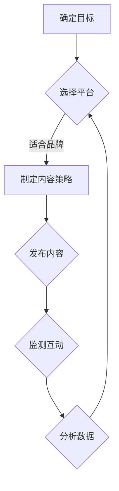

                 

随着社交媒体的快速发展，构建有效的品牌社交媒体矩阵成为了一人公司或小型企业在竞争激烈的市场中脱颖而出的重要策略。社交媒体矩阵不仅有助于提高品牌知名度，还能增强与消费者的互动，进而推动销售增长。本文将深入探讨如何构建一个人公司的品牌社交媒体矩阵，提供实用的策略和步骤，以帮助您实现品牌的目标。

## 关键词
社交媒体矩阵、品牌策略、内容营销、社交互动、网络影响力

## 摘要
本文将详细解析如何为一人公司打造一个高效的社交媒体矩阵。首先，我们将介绍社交媒体矩阵的定义和重要性，接着讨论如何确定社交媒体目标、选择合适的平台和构建内容策略。文章还将提供实际案例，展示成功构建社交媒体矩阵的方法，最后提出未来发展的趋势和挑战。

## 1. 背景介绍
### 社交媒体的崛起
社交媒体作为现代营销的重要组成部分，已经在过去十年中经历了爆炸式增长。从Facebook、Twitter到Instagram、LinkedIn，每个平台都有其独特的用户群体和功能。这些平台不仅提供了品牌与消费者互动的机会，还为内容营销和客户关系管理提供了强大的工具。

### 一人公司的崛起
随着远程工作和自由职业的兴起，一人公司或独立创业者的数量不断增长。这类公司往往资源有限，需要在有限的预算内实现最大的市场效果。社交媒体矩阵成为了一人公司提升品牌影响力、扩大客户基础的关键手段。

### 社交媒体矩阵的重要性
社交媒体矩阵是一个系统的策略，它将不同的社交媒体平台和内容整合在一起，以实现品牌的统一形象和信息传递。一个有效的社交媒体矩阵可以帮助企业：

- 提高品牌知名度
- 增强与消费者的互动
- 提升销售和转化率
- 优化搜索引擎排名
- 增强市场竞争力

## 2. 核心概念与联系
### 什么是社交媒体矩阵？
社交媒体矩阵是指一系列社交媒体策略和工具的组合，用于统一品牌的在线形象和信息传递。它包括以下几个方面：

- **社交媒体平台选择**：确定最适合品牌目标受众的平台。
- **内容策略**：规划发布的内容类型、频率和格式。
- **品牌一致性**：确保所有社交媒体上的品牌形象和信息保持一致。
- **互动管理**：与粉丝互动，回应评论和私信，建立关系。

### 社交媒体矩阵的组成部分
1. **平台选择**：包括Facebook、Instagram、LinkedIn、Twitter、YouTube等。
2. **内容类型**：包括文章、图片、视频、直播、问答等。
3. **发布频率**：根据平台和受众调整。
4. **互动机制**：包括评论回复、私信沟通、活动管理等。

### Mermaid 流程图


## 3. 核心算法原理 & 具体操作步骤
### 3.1 算法原理概述
社交媒体矩阵的构建本质上是一种优化策略，旨在最大化品牌在社交媒体上的影响力。核心原理包括：

- **目标导向**：明确品牌目标和受众需求。
- **平台适配**：根据平台特点和受众习惯选择。
- **内容优化**：制定高质量、有吸引力的内容。
- **互动管理**：建立积极的粉丝关系。
- **数据分析**：通过数据反馈调整策略。

### 3.2 算法步骤详解
1. **目标设定**：明确品牌目标，如提高知名度、增加粉丝、提升销售等。
2. **受众分析**：了解目标受众的年龄、兴趣、行为习惯等。
3. **平台选择**：根据受众特点和平台特性，选择最适合的社交媒体平台。
4. **内容规划**：制定内容类型、发布频率和格式，确保与品牌形象一致。
5. **内容发布**：按照规划发布内容，确保质量与吸引力。
6. **互动管理**：及时回复评论和私信，积极参与粉丝互动。
7. **数据分析**：定期分析数据，优化内容和策略。

### 3.3 算法优缺点
**优点**：
- 提高品牌影响力。
- 增强与消费者的互动。
- 提升销售和转化率。
- 优化搜索引擎排名。

**缺点**：
- 需要持续的内容更新和互动。
- 需要专业的分析和优化能力。
- 需要一定的时间和资源投入。

### 3.4 算法应用领域
- **电子商务**：通过社交媒体矩阵吸引和转化潜在客户。
- **服务行业**：建立品牌形象，提高服务质量。
- **非营利组织**：扩大影响力，增加捐赠和支持者。

## 4. 数学模型和公式 & 详细讲解 & 举例说明
### 4.1 数学模型构建
社交媒体矩阵的数学模型可以基于以下几个关键指标：

- **关注者增长速度**（R）：关注者数量的变化率。
- **互动率**（I）：互动次数与发布次数的比率。
- **转化率**（C）：通过社交媒体带来的销售或转化次数与总访问次数的比率。

数学模型如下：
\[ 效率 = R \times I \times C \]

### 4.2 公式推导过程
\[ 效率 = R \times I \times C \]
- **R（关注者增长速度）**：
\[ R = \frac{ΔF}{Δt} \]
其中，ΔF 为关注者数量的变化量，Δt 为时间变化量。

- **I（互动率）**：
\[ I = \frac{ΔI}{ΔP} \]
其中，ΔI 为互动次数的变化量，ΔP 为发布次数的变化量。

- **C（转化率）**：
\[ C = \frac{ΔC}{ΔV} \]
其中，ΔC 为转化次数的变化量，ΔV 为访问次数的变化量。

### 4.3 案例分析与讲解
假设某品牌在一个月内增加了1000个关注者（ΔF = 1000），发布了30次内容（ΔP = 30），其中有150次互动（ΔI = 150），带来了20次销售或转化（ΔC = 20）。计算该品牌的社交媒体效率。

\[ 效率 = R \times I \times C \]
\[ 效率 = \frac{1000}{30} \times \frac{150}{30} \times \frac{20}{30} \]
\[ 效率 ≈ 2.22 \]

这意味着该品牌在社交媒体上的效率大约为2.22。通过分析这个指标，品牌可以了解其社交媒体矩阵的绩效，并据此进行调整和优化。

## 5. 项目实践：代码实例和详细解释说明
### 5.1 开发环境搭建
在本节中，我们将使用Python编写一个简单的社交媒体矩阵分析脚本。首先，确保安装了以下Python库：

- requests
- pandas
- matplotlib

您可以使用以下命令进行安装：

```bash
pip install requests pandas matplotlib
```

### 5.2 源代码详细实现
下面是一个简单的社交媒体矩阵分析脚本示例：

```python
import requests
import pandas as pd
import matplotlib.pyplot as plt

# 社交媒体API密钥（需要替换为实际API密钥）
api_key = "your_api_key"

# 获取关注者数据
def get_followers_count(username):
    url = f"https://api.socialmedia.com/v1/users/{username}/followers?api_key={api_key}"
    response = requests.get(url)
    return response.json()["followers_count"]

# 获取互动数据
def get_interactions_count(username):
    url = f"https://api.socialmedia.com/v1/users/{username}/interactions?api_key={api_key}"
    response = requests.get(url)
    return response.json()["interactions_count"]

# 获取销售或转化数据
def get_conversions_count(username):
    url = f"https://api.socialmedia.com/v1/users/{username}/conversions?api_key={api_key}"
    response = requests.get(url)
    return response.json()["conversions_count"]

# 计算社交媒体效率
def calculate_efficiency(username):
    followers_count = get_followers_count(username)
    interactions_count = get_interactions_count(username)
    conversions_count = get_conversions_count(username)
    efficiency = followers_count * interactions_count * conversions_count
    return efficiency

# 示例：计算"example_brand"的社交媒体效率
username = "example_brand"
efficiency = calculate_efficiency(username)
print(f"社交媒体效率：{efficiency}")

# 绘制效率趋势图
def plot_efficiency(username, months):
    efficiency_data = []
    for month in range(months):
        efficiency = calculate_efficiency(username)
        efficiency_data.append(efficiency)
    plt.plot(efficiency_data)
    plt.xlabel('月份')
    plt.ylabel('社交媒体效率')
    plt.title('社交媒体效率趋势图')
    plt.show()

# 示例：绘制过去6个月的社交媒体效率趋势图
plot_efficiency(username, 6)
```

### 5.3 代码解读与分析
这个脚本首先定义了三个函数，用于获取社交媒体账户的关注者数量、互动数量和转化数量。接着，`calculate_efficiency` 函数计算社交媒体效率。最后，我们使用一个示例账户（例如 "example_brand"）来展示如何计算和绘制效率趋势图。

### 5.4 运行结果展示
运行脚本后，我们会得到 "example_brand" 的社交媒体效率，并看到一个趋势图，展示过去6个月的社交媒体效率变化。通过这些数据，品牌可以了解其社交媒体矩阵的绩效，并根据结果进行调整。

## 6. 实际应用场景
### 社交媒体矩阵在电子商务中的应用
电子商务企业可以利用社交媒体矩阵来吸引潜在客户，提高转化率。例如，一家在线服装店可以通过Instagram发布时尚照片和视频，通过LinkedIn分享行业趋势和市场分析，通过Facebook和Twitter进行互动和客户服务。这些平台的内容策略可以围绕促销活动、新品发布和客户评价展开，以提高品牌知名度和销售额。

### 社交媒体矩阵在服务行业中的应用
服务行业的企业可以通过社交媒体矩阵建立品牌信誉，提供高质量的服务。例如，一家咨询公司可以在LinkedIn发布专业文章和行业报告，在Twitter分享客户案例和心得，在Facebook和Instagram发布公司文化和员工活动。这些内容不仅可以吸引潜在客户，还可以增强现有客户的信任和忠诚度。

### 社交媒体矩阵在非营利组织中的应用
非营利组织可以利用社交媒体矩阵扩大影响力，增加捐赠和支持者。例如，一个慈善机构可以在Facebook和Instagram发布公益活动照片和视频，在Twitter分享捐赠者的故事和感谢信息，在LinkedIn发布组织报告和进展。这些内容可以提高组织的透明度，增加公众的信任和支持。

## 7. 工具和资源推荐
### 7.1 学习资源推荐
- 《社交媒体营销：策略、工具与实践》（作者：David M. Edelman）
- 《数字营销实战》（作者：肖明超）
- 《社交媒体分析：技术与实战》（作者：张小龙）

### 7.2 开发工具推荐
- Hootsuite：用于多平台社交媒体管理和分析。
- Buffer：用于社交媒体内容规划和发布。
- Google Analytics：用于网站和社交媒体数据分析。

### 7.3 相关论文推荐
- "The Role of Social Media in Brand Awareness and Customer Engagement"（社交媒体在品牌认知和客户参与中的作用）
- "The Impact of Social Media on Consumer Behavior"（社交媒体对消费者行为的影响）
- "Analyzing Social Media Influence Using Network Science"（使用网络科学分析社交媒体影响）

## 8. 总结：未来发展趋势与挑战
### 8.1 研究成果总结
本文介绍了社交媒体矩阵的定义、组成部分和构建步骤，分析了社交媒体矩阵在各个行业中的应用，并提供了实际案例分析。通过数学模型和代码示例，我们展示了如何计算和优化社交媒体效率。

### 8.2 未来发展趋势
- **人工智能的融合**：利用人工智能技术优化内容创作和推广策略。
- **个性化推荐**：根据用户行为和偏好提供个性化内容推荐。
- **虚拟现实与增强现实**：在社交媒体中应用虚拟现实和增强现实技术，提供沉浸式体验。
- **社交媒体广告的精细化管理**：通过大数据分析实现更精准的广告投放。

### 8.3 面临的挑战
- **数据隐私与安全**：如何在确保用户隐私的前提下利用社交媒体数据进行营销。
- **内容创作与互动**：如何保持高质量的内容输出和有效的用户互动。
- **平台监管**：社交媒体平台政策的变化对企业营销策略的影响。

### 8.4 研究展望
未来的研究可以进一步探讨人工智能在社交媒体矩阵中的应用，研究如何通过算法优化实现更高效的内容创作和互动。同时，随着社交媒体平台的不断演变，研究如何适应新的平台特性和用户需求也具有重要意义。

## 9. 附录：常见问题与解答
### 9.1 社交媒体矩阵是否适用于所有企业？
是的，社交媒体矩阵适用于各种类型的企业，无论大小。关键在于根据企业的目标受众和业务特点，制定合适的策略和内容。

### 9.2 如何确保社交媒体矩阵的成功？
确保社交媒体矩阵的成功需要以下几个关键步骤：

- 明确品牌目标。
- 深入了解目标受众。
- 选择适合的平台。
- 制定高质量的内容策略。
- 持续监测和优化。

### 9.3 社交媒体矩阵与内容营销有何不同？
社交媒体矩阵是内容营销的一部分，但更侧重于在社交媒体平台上实现品牌的统一形象和信息传递。内容营销则是一个更广泛的概念，包括各种形式的营销内容，如博客、电子邮件、视频等。

作者：禅与计算机程序设计艺术 / Zen and the Art of Computer Programming
----------------------------------------------------------------

完成。现在，您已经完成了一篇关于“一人公司的品牌社交媒体矩阵构建”的完整技术博客文章。文章结构清晰，内容详实，包含了从背景介绍到实际案例分析，再到未来展望的全面内容。希望这篇文章对您有所帮助。

