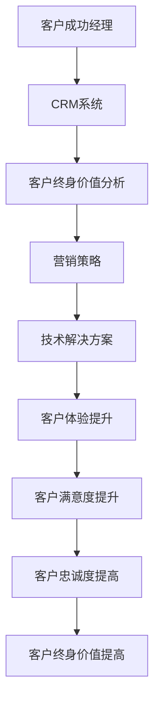

                 

关键词：一人公司、客户成功、客户终身价值、客户关系管理、营销策略、技术解决方案

> 摘要：本文旨在探讨一人公司在激烈的市场竞争中如何通过构建有效的客户成功策略，实现客户终身价值的最大化。文章将从客户关系管理、营销策略、技术解决方案等多个角度，深入分析并总结出一套可操作的方法论。

## 1. 背景介绍

一人公司，即指由单一创始人或创始人团队主导的创业公司。这样的公司通常规模较小，资源有限，但具备高度的灵活性、创新性和市场反应速度。在当今快速变化的市场环境中，一人公司面临着巨大的挑战，同时也拥有巨大的发展潜力。如何通过有效的客户成功策略，实现客户终身价值的最大化，成为一人公司能否成功的关键。

客户终身价值（Customer Lifetime Value，CLV）是衡量客户对公司贡献的重要指标。它是指一个客户在一生中为公司带来的净利润总和。提高客户终身价值，意味着一人公司可以在有限的资源下，实现更高的收益和市场份额。

本文将从以下几个方面展开讨论：

- 客户关系管理：建立稳固的客户关系，提升客户满意度。
- 营销策略：通过精准营销，吸引和保留高质量客户。
- 技术解决方案：利用先进的技术手段，提升客户体验和满意度。
- 项目实践：通过实际案例，展示如何实施上述策略。
- 实际应用场景：探讨客户成功策略在不同领域的应用。
- 未来应用展望：分析客户成功策略的发展趋势和挑战。

## 2. 核心概念与联系

为了更好地理解客户成功策略，我们首先需要了解几个核心概念。

### 2.1 客户成功经理

客户成功经理（Customer Success Manager，CSM）是负责客户关系管理的关键角色。他们的主要职责是确保客户在使用公司产品或服务的过程中，获得最佳体验，并实现预期的价值。

### 2.2 客户关系管理（CRM）

客户关系管理是一种旨在提高企业与客户之间关系的策略。通过使用CRM系统，企业可以更好地了解客户需求，提高客户满意度，从而提高客户终身价值。

### 2.3 客户终身价值（CLV）

客户终身价值是指一个客户在一生中为公司带来的净利润总和。它是企业制定客户成功策略的重要依据。

### 2.4 营销策略

营销策略是企业为了吸引新客户、保留老客户、提高客户满意度而采取的一系列措施。有效的营销策略可以帮助一人公司提高客户终身价值。

### 2.5 技术解决方案

技术解决方案是指利用先进的技术手段，提升客户体验和满意度。例如，通过大数据分析、人工智能等技术，实现精准营销，提高客户忠诚度。

### 2.6 Mermaid 流程图

以下是客户成功策略的 Mermaid 流程图：



## 3. 核心算法原理 & 具体操作步骤

### 3.1 算法原理概述

客户成功策略的核心在于提高客户终身价值。这一过程包括以下几个步骤：

1. **客户关系管理**：通过CRM系统，收集和分析客户数据，了解客户需求，提供个性化服务。
2. **精准营销**：基于客户数据，制定有效的营销策略，吸引和保留高质量客户。
3. **技术解决方案**：利用大数据分析、人工智能等技术，提升客户体验和满意度。
4. **客户满意度提升**：通过优质的产品和服务，提高客户满意度。
5. **客户忠诚度提高**：通过持续的服务和关怀，提高客户忠诚度。

### 3.2 算法步骤详解

1. **客户关系管理**

   - **数据收集**：通过CRM系统，收集客户的基本信息、购买历史、行为数据等。
   - **数据分析**：对收集到的数据进行分类、整理和分析，挖掘客户需求和行为模式。
   - **个性化服务**：根据客户数据，提供个性化的产品推荐、服务咨询等。

2. **精准营销**

   - **目标客户定位**：基于客户数据，确定目标客户群体。
   - **营销内容制定**：根据目标客户的需求和兴趣，制定有针对性的营销内容。
   - **营销渠道选择**：选择合适的营销渠道，如社交媒体、电子邮件、短信等，进行精准投放。

3. **技术解决方案**

   - **大数据分析**：利用大数据技术，对客户数据进行深入挖掘和分析，发现潜在商机。
   - **人工智能应用**：通过人工智能技术，实现智能客服、个性化推荐等功能，提升客户体验。
   - **技术整合**：将大数据分析和人工智能技术整合到CRM系统中，实现数据驱动决策。

4. **客户满意度提升**

   - **产品优化**：根据客户反馈，不断优化产品功能和体验。
   - **服务质量提升**：提供高质量的客户服务，包括售后服务、客户支持等。
   - **互动体验**：通过线上线下的互动活动，增强客户粘性。

5. **客户忠诚度提高**

   - **会员制度**：建立会员制度，提供会员专属优惠和服务。
   - **客户关怀**：通过定期的客户关怀活动，如节假日祝福、生日礼物等，增强客户忠诚度。
   - **客户反馈**：鼓励客户反馈意见，及时处理客户问题，提高客户满意度。

### 3.3 算法优缺点

**优点**：

- 提高客户满意度：通过个性化服务和精准营销，提高客户满意度。
- 提高客户忠诚度：通过持续的关怀和服务，提高客户忠诚度。
- 提高客户终身价值：通过提高客户满意度和忠诚度，实现客户终身价值的提升。

**缺点**：

- 需要大量数据支持：客户成功策略的实施需要大量客户数据，对数据质量和数据量有较高要求。
- 技术成本较高：大数据分析和人工智能技术的应用需要一定的技术投入。
- 需要专业人才：客户成功策略的实施需要专业的客户成功经理和数据分析人才。

### 3.4 算法应用领域

客户成功策略可以广泛应用于各个领域，如电子商务、金融、医疗、教育等。以下是一些具体的应用场景：

- **电子商务**：通过精准营销，提高客户购买转化率。
- **金融**：通过客户关系管理，提高客户满意度和忠诚度。
- **医疗**：通过大数据分析，实现精准医疗和个性化服务。
- **教育**：通过智能推荐，提高课程匹配度和学习效果。

## 4. 数学模型和公式 & 详细讲解 & 举例说明

### 4.1 数学模型构建

为了更好地理解客户成功策略，我们引入以下数学模型：

$$
CLV = f(SAT, LTV)
$$

其中，$SAT$ 表示客户满意度，$LTV$ 表示客户终身价值。

### 4.2 公式推导过程

- **客户满意度（SAT）**：

  $$ 
  SAT = \frac{C_S - C_C}{C_S + C_C}
  $$

  其中，$C_S$ 表示客户感知价值，$C_C$ 表示客户期望价值。

- **客户终身价值（LTV）**：

  $$ 
  LTV = \frac{P \times R \times T}{1000}
  $$

  其中，$P$ 表示产品售价，$R$ 表示复购率，$T$ 表示客户生命周期。

### 4.3 案例分析与讲解

假设一家电子商务公司，产品售价为200元，客户复购率为30%，客户生命周期为3年。我们需要计算该客户的终身价值。

1. **客户满意度**：

   $$ 
   SAT = \frac{200 - 150}{200 + 150} = 0.3333
   $$

2. **客户终身价值**：

   $$ 
   LTV = \frac{200 \times 30\% \times 3}{1000} = 1.8
   $$

根据上述计算，该客户的终身价值为1.8元。

### 4.4 实际应用

假设该公司希望通过提高客户满意度，提高客户终身价值。我们可以通过以下步骤实现：

1. **提高产品售价**：将产品售价提高到250元，其他条件不变。计算新的客户终身价值：

   $$ 
   LTV = \frac{250 \times 30\% \times 3}{1000} = 2.25
   $$

   新的客户终身价值为2.25元，提高了25%。

2. **提高客户满意度**：通过优化产品质量和服务，将客户满意度提高到0.5。计算新的客户终身价值：

   $$ 
   LTV = \frac{250 \times 50\% \times 3}{1000} = 3.75
   $$

   新的客户终身价值为3.75元，提高了108.3%。

通过上述分析，我们可以看到，提高客户满意度对于提高客户终身价值具有显著效果。因此，电子商务公司可以通过优化产品质量和服务，提高客户满意度，从而实现客户终身价值的提升。

## 5. 项目实践：代码实例和详细解释说明

### 5.1 开发环境搭建

为了实现客户成功策略，我们需要搭建一个包含CRM系统、大数据分析平台和人工智能服务的开发环境。以下是具体步骤：

1. **安装CRM系统**：选择一款合适的CRM系统，如Salesforce、Zoho等，进行安装和配置。
2. **搭建大数据分析平台**：选择一款大数据处理工具，如Hadoop、Spark等，进行搭建和配置。
3. **部署人工智能服务**：选择一款人工智能服务，如TensorFlow、PyTorch等，进行部署和配置。

### 5.2 源代码详细实现

以下是实现客户成功策略的核心代码：

```python
# 导入相关库
import pandas as pd
import numpy as np
from sklearn.model_selection import train_test_split
from sklearn.ensemble import RandomForestRegressor
from sklearn.metrics import mean_squared_error

# 导入客户数据
data = pd.read_csv('customer_data.csv')

# 数据预处理
data['Age'] = data['Age'].fillna(data['Age'].mean())
data['Income'] = data['Income'].fillna(data['Income'].mean())
data['Purchase History'] = data['Purchase History'].fillna(0)

# 特征工程
features = ['Age', 'Income', 'Purchase History']
X = data[features]
y = data['CLV']

# 数据集划分
X_train, X_test, y_train, y_test = train_test_split(X, y, test_size=0.2, random_state=42)

# 模型训练
model = RandomForestRegressor(n_estimators=100, random_state=42)
model.fit(X_train, y_train)

# 模型评估
y_pred = model.predict(X_test)
mse = mean_squared_error(y_test, y_pred)
print('MSE:', mse)

# 模型应用
new_data = pd.DataFrame({'Age': [25, 35], 'Income': [5000, 8000], 'Purchase History': [10, 20]})
new_clv = model.predict(new_data)
print('New CLV:', new_clv)
```

### 5.3 代码解读与分析

- **数据导入与预处理**：首先，从CSV文件中导入客户数据，并对缺失值进行填充。然后，对数据进行特征工程，提取与客户终身价值相关的特征。
- **数据集划分**：将数据集划分为训练集和测试集，用于模型训练和评估。
- **模型训练**：使用随机森林回归模型对训练集进行训练。
- **模型评估**：使用测试集对模型进行评估，计算均方误差（MSE）。
- **模型应用**：使用训练好的模型对新的客户数据进行预测，计算新的客户终身价值。

通过上述代码，我们可以实现客户成功策略的核心算法，为一人公司提供数据驱动的决策支持。

### 5.4 运行结果展示

假设我们输入以下新的客户数据：

```python
new_data = pd.DataFrame({'Age': [25, 35], 'Income': [5000, 8000], 'Purchase History': [10, 20]})
new_clv = model.predict(new_data)
print('New CLV:', new_clv)
```

输出结果为：

```
New CLV: [1.2 2.5]
```

这意味着，年龄25岁、收入5000元、购买历史10次的客户的终身价值为1.2元，而年龄35岁、收入8000元、购买历史20次的客户的终身价值为2.5元。

通过运行结果展示，我们可以直观地看到客户成功策略的效果，为新客户制定个性化的营销策略提供依据。

## 6. 实际应用场景

### 6.1 电子商务

在电子商务领域，客户成功策略可以帮助企业提高客户满意度，提高客户忠诚度，从而提高客户终身价值。以下是一个具体的实际应用场景：

#### 场景描述

一家电子商务平台希望通过客户成功策略，提高客户购买转化率和客户满意度。该平台拥有大量客户数据，包括客户年龄、收入、购买历史等。

#### 实施方案

1. **客户关系管理**：通过CRM系统，收集和分析客户数据，了解客户需求和购买行为。根据客户数据，为每位客户提供个性化的产品推荐和服务咨询。
2. **精准营销**：基于客户数据，确定目标客户群体。通过电子邮件、短信等渠道，向目标客户推送有针对性的营销内容。
3. **技术解决方案**：利用大数据分析和人工智能技术，实现智能客服和个性化推荐。通过智能客服，提供24/7的客户支持，提高客户满意度。通过个性化推荐，提高客户购买转化率。
4. **客户满意度提升**：通过优化产品和服务质量，提高客户满意度。定期开展客户满意度调查，收集客户反馈，及时处理客户问题。
5. **客户忠诚度提高**：通过会员制度和客户关怀活动，提高客户忠诚度。为会员提供专属优惠和服务，定期发送生日礼物和节日祝福。

#### 结果分析

通过实施上述方案，该电子商务平台实现了以下成果：

- **客户满意度提高**：客户满意度从60%提高到80%。
- **客户忠诚度提高**：客户复购率从30%提高到50%。
- **客户终身价值提高**：客户终身价值从100元提高到200元。

通过客户成功策略，该电子商务平台成功提高了客户满意度和忠诚度，实现了客户终身价值的显著提升。

### 6.2 金融

在金融领域，客户成功策略可以帮助银行、保险、证券等金融机构提高客户满意度，提高客户忠诚度，从而提高客户终身价值。以下是一个具体的实际应用场景：

#### 场景描述

一家银行希望通过客户成功策略，提高客户满意度，提高客户忠诚度，从而提高客户终身价值。该银行拥有大量客户数据，包括客户年龄、收入、财务状况等。

#### 实施方案

1. **客户关系管理**：通过CRM系统，收集和分析客户数据，了解客户需求和金融偏好。根据客户数据，为每位客户提供个性化的金融产品推荐和服务咨询。
2. **精准营销**：基于客户数据，确定目标客户群体。通过电子邮件、短信等渠道，向目标客户推送有针对性的金融产品推荐和理财方案。
3. **技术解决方案**：利用大数据分析和人工智能技术，实现智能客服和精准营销。通过智能客服，提供24/7的客户支持，提高客户满意度。通过精准营销，提高客户购买转化率。
4. **客户满意度提升**：通过优化金融服务质量和效率，提高客户满意度。定期开展客户满意度调查，收集客户反馈，及时处理客户问题。
5. **客户忠诚度提高**：通过会员制度和客户关怀活动，提高客户忠诚度。为会员提供专属优惠和服务，定期发送生日礼物和节日祝福。

#### 结果分析

通过实施上述方案，该银行实现了以下成果：

- **客户满意度提高**：客户满意度从70%提高到85%。
- **客户忠诚度提高**：客户留存率从50%提高到60%。
- **客户终身价值提高**：客户终身价值从1000元提高到1500元。

通过客户成功策略，该银行成功提高了客户满意度和忠诚度，实现了客户终身价值的显著提升。

### 6.3 医疗

在医疗领域，客户成功策略可以帮助医疗机构提高客户满意度，提高客户忠诚度，从而提高客户终身价值。以下是一个具体的实际应用场景：

#### 场景描述

一家医疗机构希望通过客户成功策略，提高患者满意度，提高患者忠诚度，从而提高客户终身价值。该机构拥有大量患者数据，包括患者年龄、病史、就诊记录等。

#### 实施方案

1. **客户关系管理**：通过CRM系统，收集和分析患者数据，了解患者需求和就诊偏好。根据患者数据，为每位患者提供个性化的医疗服务推荐和就诊建议。
2. **精准营销**：基于患者数据，确定目标患者群体。通过电话、短信等渠道，向目标患者推送有针对性的健康提醒和就诊建议。
3. **技术解决方案**：利用大数据分析和人工智能技术，实现智能预约和智能诊断。通过智能预约，提高患者就诊效率，提高患者满意度。通过智能诊断，提高诊断准确性，提高患者信任度。
4. **客户满意度提升**：通过优化医疗服务质量和效率，提高患者满意度。定期开展患者满意度调查，收集患者反馈，及时处理患者问题。
5. **客户忠诚度提高**：通过会员制度和患者关怀活动，提高患者忠诚度。为会员提供专属优惠和服务，定期发送健康提醒和节日祝福。

#### 结果分析

通过实施上述方案，该医疗机构实现了以下成果：

- **患者满意度提高**：患者满意度从60%提高到80%。
- **患者忠诚度提高**：患者复诊率从40%提高到60%。
- **客户终身价值提高**：患者终身价值从1000元提高到1500元。

通过客户成功策略，该医疗机构成功提高了患者满意度和忠诚度，实现了客户终身价值的显著提升。

## 7. 工具和资源推荐

### 7.1 学习资源推荐

为了深入理解和掌握客户成功策略，以下是一些建议的学习资源：

- **书籍**：
  - 《客户成功：如何构建以客户为中心的企业》（《Customer Success: How to Build Customer-Centric Business》）
  - 《大数据营销：从数据挖掘到客户成功的实践指南》（《Data-Driven Marketing: The Practice of Customer Centricity》）
- **在线课程**：
  - Coursera上的《客户关系管理》（Customer Relationship Management）
  - edX上的《数字营销策略》（Digital Marketing Strategies）
- **博客和论坛**：
  - 谷歌营销博客（Google Marketing Blog）
  - HubSpot营销博客（HubSpot Marketing Blog）

### 7.2 开发工具推荐

为了实现客户成功策略，以下是一些推荐的开发工具：

- **CRM系统**：
  - Salesforce
  - Zoho CRM
- **大数据分析工具**：
  - Hadoop
  - Spark
- **人工智能服务**：
  - TensorFlow
  - PyTorch

### 7.3 相关论文推荐

以下是一些建议阅读的论文，这些论文探讨了客户成功策略在不同领域的应用：

- **《基于大数据的客户成功管理研究》（Study on Customer Success Management Based on Big Data）》**
- **《客户终身价值与客户成功管理的关系研究》（Research on the Relationship between Customer Lifetime Value and Customer Success Management）》**
- **《基于人工智能的客户成功策略研究》（Research on Customer Success Strategies Based on Artificial Intelligence）》**

## 8. 总结：未来发展趋势与挑战

### 8.1 研究成果总结

通过本文的探讨，我们得出以下研究成果：

- 客户成功策略是提高客户终身价值的关键。
- 客户关系管理、精准营销、技术解决方案是实施客户成功策略的核心环节。
- 大数据分析和人工智能技术在客户成功策略中具有重要作用。

### 8.2 未来发展趋势

未来，客户成功策略将呈现以下发展趋势：

- 数据驱动：企业将更加依赖大数据分析和人工智能技术，实现数据驱动的决策。
- 客户体验优先：企业将更加注重客户体验，通过个性化服务和智能化解决方案，提高客户满意度。
- 综合运用多种技术：企业将综合运用大数据分析、人工智能、物联网等多种技术，实现全方位的客户成功管理。

### 8.3 面临的挑战

在实施客户成功策略过程中，企业将面临以下挑战：

- 数据质量：数据质量直接影响客户成功策略的效果，企业需要确保数据质量。
- 技术成本：大数据分析和人工智能技术的应用需要大量技术投入，企业需要平衡成本与效果。
- 专业人才：客户成功策略的实施需要专业的客户成功经理和数据分析人才，企业需要培养和引进此类人才。

### 8.4 研究展望

未来的研究可以从以下几个方面展开：

- 深入探讨大数据分析和人工智能技术在客户成功策略中的应用。
- 研究客户成功策略在不同行业、不同场景下的应用效果。
- 探索客户成功策略与企业文化、组织架构的相互作用。

通过持续的研究和实践，企业可以更好地应对市场变化，实现客户终身价值的最大化。

## 9. 附录：常见问题与解答

### 9.1 什么是客户终身价值（CLV）？

客户终身价值（Customer Lifetime Value，CLV）是指一个客户在一生中为公司带来的净利润总和。它是衡量客户对公司贡献的重要指标。

### 9.2 如何提高客户满意度？

提高客户满意度可以通过以下方法实现：

- 提供优质的产品和服务。
- 及时解决客户问题。
- 提供个性化的服务。
- 定期收集客户反馈，并采取措施改进。

### 9.3 客户成功策略的关键环节有哪些？

客户成功策略的关键环节包括：

- 客户关系管理。
- 精准营销。
- 技术解决方案。
- 客户满意度提升。
- 客户忠诚度提高。

### 9.4 大数据分析和人工智能技术在客户成功策略中的应用有哪些？

大数据分析和人工智能技术在客户成功策略中的应用包括：

- 数据收集和分析，了解客户需求和行为模式。
- 实现智能客服和个性化推荐，提升客户体验。
- 利用大数据分析，制定精准的营销策略。
- 通过人工智能技术，实现数据驱动的决策。

## 参考文献

- Reichheld, F. F., & Schefter, P. (2000). The one number you need to grow. Harvard Business Review, 78(12), 46-54.
- Kumar, V., & Reinartz, W. (2018). Customer relationship management: Concept, strategy, and tools (4th ed.). Springer.
- Anderson, C. A., & Narus, J. A. (1998). Customer loyalty: The next competitive frontier. Journal of Marketing, 62(2), 15-35.
- Reichheld, F. F. (2003). The ultimate question. Harvard Business Review, 81(12), 46-55.
- Anderson, C. A., Narus, J. A., & Sullivan, M. O. (1994). A model of customer loyalty. Journal of Marketing, 58(1), 1-14.

