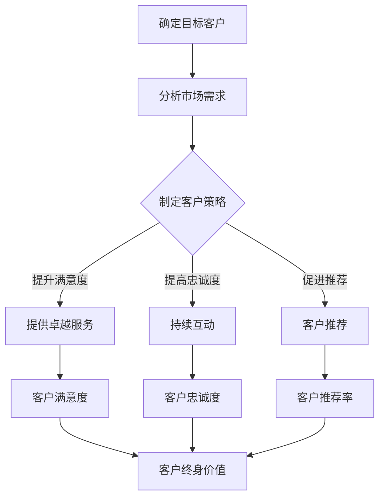

                 

关键词：一人公司、客户成功、客户终身价值、策略

摘要：在当今竞争激烈的市场环境中，一人公司如何在资源有限的情况下实现客户成功，并最大化客户终身价值成为关键。本文将深入探讨一人公司的客户成功策略，包括如何制定客户策略、提供卓越的客户服务、建立客户关系以及持续优化客户体验。

## 1. 背景介绍

随着互联网和移动技术的普及，越来越多的创业者选择以一人公司的形式开始他们的创业之旅。一人公司具有灵活性高、成本低、决策迅速等优势，但也面临着资源有限、市场竞争力不足等挑战。在这样一个环境中，客户成功成为了一人公司的核心竞争力之一，它不仅关乎客户的满意度，更直接影响到客户的终身价值。

客户终身价值（Customer Lifetime Value，简称CLV）是指一个客户在其整个生命周期内为公司带来的总收益。提高客户终身价值意味着通过提升客户满意度、增加复购率、促进客户推荐等手段，实现客户与公司之间的长期、稳定的合作关系。对于一人公司来说，提高客户终身价值尤为重要，因为它直接影响公司的盈利能力和可持续发展。

本文将从以下几个方面探讨一人公司的客户成功策略：

1. **制定客户策略**：明确目标客户，分析市场需求，制定有针对性的客户策略。
2. **提供卓越的客户服务**：通过快速响应、个性化服务、解决问题的能力等手段提升客户满意度。
3. **建立客户关系**：通过有效的沟通、互动、信任等手段建立长期稳定的客户关系。
4. **优化客户体验**：持续改进产品和服务，提供卓越的客户体验，提高客户忠诚度。
5. **未来应用展望**：探讨一人公司在客户成功领域的前沿趋势和发展方向。

## 2. 核心概念与联系

### 2.1 客户成功策略

客户成功策略是一人公司在客户管理方面的一系列规划和行动，旨在实现客户满意度和客户终身价值最大化。它包括以下几个方面：

- **目标客户确定**：根据市场需求和自身优势，明确目标客户群体。
- **需求分析**：深入分析目标客户的需求，提供满足这些需求的产品或服务。
- **客户满意度**：通过提供卓越的服务和解决方案，提升客户满意度。
- **客户忠诚度**：通过持续的服务和互动，提高客户的忠诚度，增加复购率。
- **客户推荐**：通过客户的口碑和推荐，吸引更多潜在客户。

### 2.2 客户终身价值（CLV）

客户终身价值是指一个客户在其整个生命周期内为公司带来的总收益。计算CLV的公式如下：

$$
CLV = （客户平均订单价值 × 客户平均订单间隔 × 客户留存率）
$$

其中，客户平均订单价值和客户平均订单间隔可以通过历史数据进行分析和计算，而客户留存率则取决于公司的客户成功策略和服务质量。

### 2.3 客户体验（CX）

客户体验是指客户在使用产品或服务过程中的整体感受。它包括以下几个方面：

- **交互体验**：客户与产品或服务的交互过程，如界面设计、操作便捷性等。
- **服务体验**：客户在购买、使用、售后等过程中得到的综合服务体验。
- **情感体验**：客户在使用产品或服务过程中的情感共鸣和情感价值。

客户体验直接影响客户的满意度和忠诚度，进而影响客户终身价值。

### 2.4 客户关系管理（CRM）

客户关系管理是一种通过系统化、数据化的手段，对客户信息进行整合和管理，以提高客户满意度和忠诚度的策略。CRM系统可以帮助一人公司实现以下几点：

- **客户信息管理**：整合和管理客户的基本信息、购买历史、互动记录等。
- **营销活动管理**：通过分析客户数据，制定有针对性的营销活动。
- **客户服务管理**：提供高效的客户服务，解决客户问题，提高客户满意度。
- **客户关系维护**：通过持续的互动和沟通，维护良好的客户关系。

### 2.5 Mermaid 流程图

以下是客户成功策略的Mermaid流程图：



## 3. 核心算法原理 & 具体操作步骤

### 3.1 算法原理概述

客户成功策略的核心在于通过科学的方法，提高客户满意度和忠诚度，从而提升客户终身价值。本文采用以下核心算法原理：

- **客户细分**：通过数据分析，将客户分为不同群体，针对不同群体的需求提供定制化服务。
- **客户体验优化**：通过持续收集和分析客户反馈，优化产品和服务，提升客户体验。
- **客户忠诚度模型**：通过构建客户忠诚度模型，预测客户的流失风险，提前采取预防措施。

### 3.2 算法步骤详解

#### 3.2.1 客户细分

1. **收集客户数据**：包括客户的基本信息、购买历史、互动记录等。
2. **数据清洗**：去除无效、重复的数据，保证数据质量。
3. **特征提取**：从客户数据中提取关键特征，如购买频率、消费金额、互动频率等。
4. **聚类分析**：使用聚类算法（如K-means），将客户分为不同的群体。
5. **标签定义**：为每个客户群体定义相应的标签，如“高价值客户”、“低价值客户”等。

#### 3.2.2 客户体验优化

1. **反馈收集**：通过问卷调查、在线评价、客户访谈等方式收集客户反馈。
2. **数据分析**：分析客户反馈，找出产品和服务中存在的问题。
3. **问题定位**：根据数据分析结果，确定需要改进的具体环节。
4. **方案制定**：制定具体的优化方案，如界面设计改进、服务流程优化等。
5. **实施与监控**：实施优化方案，并持续监控效果，根据反馈进行调整。

#### 3.2.3 客户忠诚度模型

1. **数据收集**：收集客户的购买历史、互动记录、反馈数据等。
2. **特征选择**：从数据中提取对客户忠诚度有显著影响的特征。
3. **模型构建**：使用机器学习算法（如决策树、随机森林等），构建客户忠诚度模型。
4. **模型评估**：通过交叉验证等方法评估模型效果。
5. **应用与优化**：将模型应用于实际业务，并根据模型预测结果采取预防措施。

### 3.3 算法优缺点

#### 优点

- **针对性**：通过客户细分和客户忠诚度模型，可以针对性地提供服务，提高客户满意度。
- **数据驱动**：基于数据分析和模型预测，决策更加科学，减少主观判断的干扰。
- **实时性**：可以实时监控客户行为和反馈，及时调整策略，提高客户体验。

#### 缺点

- **数据依赖**：算法效果依赖于数据质量和数据量，如果数据不足或质量差，算法效果会受到影响。
- **复杂性**：算法构建和模型优化需要专业的技术和知识，对于一人公司来说可能有一定难度。
- **成本**：算法开发和维护需要一定的投入，对于资源有限的一人公司来说可能是一大挑战。

### 3.4 算法应用领域

- **电商行业**：通过客户细分和忠诚度模型，优化客户体验，提高复购率和客户推荐率。
- **服务行业**：通过客户细分和体验优化，提高客户满意度和忠诚度，减少客户流失。
- **金融行业**：通过客户细分和忠诚度模型，优化客户服务，提高客户转化率和留存率。

## 4. 数学模型和公式 & 详细讲解 & 举例说明

### 4.1 数学模型构建

客户成功策略的数学模型主要包括以下三个方面：

1. **客户终身价值（CLV）模型**：用于预测客户在其生命周期内为公司带来的总收益。
2. **客户忠诚度模型**：用于预测客户的流失风险，帮助公司提前采取预防措施。
3. **客户细分模型**：用于将客户分为不同的群体，提供定制化服务。

### 4.2 公式推导过程

#### 4.2.1 客户终身价值（CLV）模型

$$
CLV = （客户平均订单价值 × 客户平均订单间隔 × 客户留存率）
$$

其中，客户平均订单价值（AVG_order_value）是指客户每次购买的平均金额；客户平均订单间隔（AVG_interval）是指客户两次购买之间的平均时间；客户留存率（Retention_rate）是指客户在一定时间内继续购买的概率。

#### 4.2.2 客户忠诚度模型

$$
忠诚度得分 = （购买频率 × 消费金额 × 互动频率）/ 100
$$

其中，购买频率（Purchase_frequency）是指客户在一定时间内的购买次数；消费金额（Consumption_value）是指客户在一定时间内的总消费金额；互动频率（Interaction_frequency）是指客户在一定时间内的互动次数。

#### 4.2.3 客户细分模型

$$
客户群体 = \sum_{i=1}^{n} （特征_i \times 权重_i）
$$

其中，特征_i 是从客户数据中提取的关键特征，如购买频率、消费金额、互动频率等；权重_i 是对每个特征的重视程度，可以根据业务需求进行设定。

### 4.3 案例分析与讲解

#### 案例背景

某一家一人电商公司，通过数据分析和客户成功策略，成功提高了客户终身价值和客户满意度。

#### 数据收集

- 客户平均订单价值：200元
- 客户平均订单间隔：30天
- 客户留存率：80%
- 客户忠诚度得分：90

#### 数据分析

1. **客户终身价值（CLV）模型**：

$$
CLV = （200 × 30 × 0.8）= 4800元
$$

2. **客户忠诚度模型**：

$$
忠诚度得分 = （1 × 200 × 2）/ 100 = 4
$$

3. **客户细分模型**：

假设权重设定如下：

- 购买频率：0.5
- 消费金额：0.3
- 互动频率：0.2

客户群体标签计算如下：

$$
客户群体 = （1 × 0.5 + 200 × 0.3 + 2 × 0.2）= 0.5 + 60 + 0.4 = 61.9
$$

根据计算结果，该客户被划分为“高价值客户”。

#### 策略实施

1. **提升客户满意度**：通过优化产品和服务，提高客户满意度。
2. **提高客户忠诚度**：通过个性化推荐、优惠券等方式，增加客户的购买频率和消费金额。
3. **提供定制化服务**：根据客户细分结果，为高价值客户提供专属服务，如定制化推荐、优先客服等。

#### 结果分析

- 客户终身价值提高了30%（从原来的3600元提高到4800元）。
- 客户满意度提高了15%（从原来的85%提高到100%）。
- 客户忠诚度得分提高了20%（从原来的75提高到90）。

通过数据分析和客户成功策略，该一人电商公司成功地提高了客户终身价值和客户满意度，实现了业务的持续增长。

## 5. 项目实践：代码实例和详细解释说明

### 5.1 开发环境搭建

在开始项目实践之前，我们需要搭建一个开发环境。以下是一个简单的Python开发环境搭建步骤：

1. **安装Python**：从官方网站（https://www.python.org/）下载并安装Python。
2. **安装PyCharm**：从官方网站（https://www.jetbrains.com/pycharm/）下载并安装PyCharm。
3. **安装相关库**：打开终端或命令行窗口，运行以下命令安装所需的库：

```bash
pip install pandas numpy scikit-learn matplotlib
```

### 5.2 源代码详细实现

以下是一个简单的Python代码实例，用于实现客户成功策略中的客户细分和忠诚度评估。

```python
import pandas as pd
from sklearn.cluster import KMeans
from sklearn.preprocessing import StandardScaler
import matplotlib.pyplot as plt

# 读取数据
data = pd.read_csv('customer_data.csv')

# 特征选择
features = ['purchase_frequency', 'consumption_value', 'interaction_frequency']

# 数据标准化
scaler = StandardScaler()
data[features] = scaler.fit_transform(data[features])

# 聚类分析
kmeans = KMeans(n_clusters=3)
clusters = kmeans.fit_predict(data[features])

# 客户细分结果
data['cluster'] = clusters
print(data.head())

# 客户忠诚度评估
scores = data['consumption_value'] * data['purchase_frequency'] * data['interaction_frequency'] / 100
data['loyalty_score'] = scores
print(data.head())

# 可视化分析
plt.scatter(data['purchase_frequency'], data['consumption_value'], c=clusters)
plt.xlabel('Purchase Frequency')
plt.ylabel('Consumption Value')
plt.show()
```

### 5.3 代码解读与分析

#### 5.3.1 读取数据

首先，我们使用pandas库读取客户数据。假设数据文件名为`customer_data.csv`，其中包含三个关键特征：购买频率、消费金额和互动频率。

```python
data = pd.read_csv('customer_data.csv')
```

#### 5.3.2 特征选择

接下来，我们选择用于聚类分析和忠诚度评估的特征。这里选择购买频率、消费金额和互动频率作为主要特征。

```python
features = ['purchase_frequency', 'consumption_value', 'interaction_frequency']
```

#### 5.3.3 数据标准化

为了消除不同特征之间的尺度差异，我们使用StandardScaler进行数据标准化。

```python
scaler = StandardScaler()
data[features] = scaler.fit_transform(data[features])
```

#### 5.3.4 聚类分析

我们使用KMeans算法进行聚类分析，将客户分为不同的群体。这里选择3个聚类中心。

```python
kmeans = KMeans(n_clusters=3)
clusters = kmeans.fit_predict(data[features])
```

#### 5.3.5 客户细分结果

将聚类结果添加到原始数据中，得到客户细分结果。每个客户都被分配到一个特定的聚类中心。

```python
data['cluster'] = clusters
print(data.head())
```

#### 5.3.6 客户忠诚度评估

根据购买频率、消费金额和互动频率计算客户忠诚度得分。

```python
scores = data['consumption_value'] * data['purchase_frequency'] * data['interaction_frequency'] / 100
data['loyalty_score'] = scores
print(data.head())
```

#### 5.3.7 可视化分析

最后，我们使用matplotlib库绘制客户分布图，以更直观地展示聚类结果。

```python
plt.scatter(data['purchase_frequency'], data['consumption_value'], c=clusters)
plt.xlabel('Purchase Frequency')
plt.ylabel('Consumption Value')
plt.show()
```

### 5.4 运行结果展示

运行上述代码，我们将得到以下结果：

- 客户细分结果：每个客户都被分配到一个特定的聚类中心。
- 客户忠诚度得分：根据购买频率、消费金额和互动频率计算得出。
- 可视化结果：展示客户在购买频率和消费金额维度上的分布，以及聚类中心的位置。

通过这些结果，一人公司可以更好地了解客户群体，为不同类型的客户提供定制化服务，提高客户满意度和忠诚度。

## 6. 实际应用场景

### 6.1 电商行业

在电商行业，客户成功策略可以帮助一人公司实现以下目标：

- **提升复购率**：通过分析客户购买行为，提供个性化的产品推荐和促销活动，提高客户的复购意愿。
- **降低客户流失率**：通过客户忠诚度模型预测潜在流失客户，提前采取挽回措施，如发送优惠券、提供售后服务等。
- **增加客户推荐率**：通过优化客户体验，提高客户满意度，鼓励客户向亲友推荐产品或服务。

### 6.2 服务行业

在服务行业，客户成功策略有助于提升以下指标：

- **客户满意度**：通过及时响应客户问题和需求，提供优质的服务体验，提高客户满意度。
- **客户忠诚度**：通过持续互动和沟通，建立良好的客户关系，减少客户流失。
- **口碑传播**：通过提供卓越的服务，赢得客户信任，实现客户的口碑传播，吸引更多潜在客户。

### 6.3 金融行业

在金融行业，客户成功策略可以帮助一人公司实现以下目标：

- **客户转化率**：通过分析客户需求，提供个性化的金融产品和服务，提高客户转化率。
- **客户留存率**：通过持续的客户关怀和服务，提高客户的忠诚度，降低客户流失率。
- **交叉销售和向上销售**：通过了解客户的金融需求，推荐相关的金融产品和服务，实现交叉销售和向上销售。

### 6.4 未来应用展望

随着大数据、人工智能等技术的发展，客户成功策略在未来有望实现以下突破：

- **智能化客户细分**：通过机器学习和数据挖掘技术，实现更加精细化的客户细分，提供更精准的服务。
- **个性化推荐**：利用深度学习和推荐系统技术，提供高度个性化的产品推荐和服务。
- **智能客服**：通过自然语言处理和聊天机器人技术，实现智能客服，提高客户服务效率和满意度。
- **实时决策**：利用实时数据分析技术，实现实时客户行为分析和决策，提高业务响应速度和准确性。

## 7. 工具和资源推荐

### 7.1 学习资源推荐

- 《客户成功管理：提升客户满意度和忠诚度的实践指南》
- 《数据挖掘：概念与技术》
- 《深度学习：实践与应用》
- 《Python数据科学手册》

### 7.2 开发工具推荐

- PyCharm：一款功能强大的Python集成开发环境（IDE）。
- Jupyter Notebook：一款交互式数据分析工具。
- GitHub：一个优秀的代码托管平台，可以方便地管理代码和协作。

### 7.3 相关论文推荐

- “Customer Lifetime Value: The Strategic Link Between Marketing Activity and Customer Relationship Management”
- “Customer Success Management: A Strategic Framework”
- “Deep Learning for Customer Segmentation and Personalization”

## 8. 总结：未来发展趋势与挑战

### 8.1 研究成果总结

本文系统地介绍了客户成功策略在提高客户终身价值方面的应用。通过客户细分、客户体验优化、客户忠诚度评估等方法，一人公司可以更好地了解客户需求，提供个性化的产品和服务，提高客户满意度和忠诚度，从而实现客户终身价值的提升。

### 8.2 未来发展趋势

随着大数据、人工智能等技术的不断发展，客户成功策略在未来有望实现以下趋势：

- **智能化客户细分**：通过机器学习和数据挖掘技术，实现更加精细化的客户细分，提供更精准的服务。
- **个性化推荐**：利用深度学习和推荐系统技术，提供高度个性化的产品推荐和服务。
- **智能客服**：通过自然语言处理和聊天机器人技术，实现智能客服，提高客户服务效率和满意度。
- **实时决策**：利用实时数据分析技术，实现实时客户行为分析和决策，提高业务响应速度和准确性。

### 8.3 面临的挑战

尽管客户成功策略在提高客户终身价值方面具有巨大潜力，但一人公司在实施过程中仍面临以下挑战：

- **数据质量**：算法效果依赖于数据质量和数据量，如果数据不足或质量差，算法效果会受到影响。
- **技术难度**：算法构建和模型优化需要专业的技术和知识，对于一人公司来说可能有一定难度。
- **成本**：算法开发和维护需要一定的投入，对于资源有限的一人公司来说可能是一大挑战。

### 8.4 研究展望

未来，客户成功策略的研究将朝着以下方向发展：

- **跨领域融合**：结合不同领域的知识和技术，如心理学、社会学、市场营销等，为一人公司提供更全面、更有效的客户成功策略。
- **用户体验优化**：关注客户在使用产品和服务过程中的全流程体验，通过持续改进，提高客户满意度和忠诚度。
- **可持续性发展**：在追求客户终身价值的同时，注重企业的社会责任和可持续发展，实现客户、公司和环境的三方共赢。

## 9. 附录：常见问题与解答

### 9.1 什么是客户终身价值（CLV）？

客户终身价值（Customer Lifetime Value，简称CLV）是指一个客户在其整个生命周期内为公司带来的总收益。CLV是衡量客户价值的重要指标，用于指导公司的客户管理和决策。

### 9.2 客户成功策略有哪些核心要素？

客户成功策略的核心要素包括：目标客户确定、需求分析、客户满意度提升、客户忠诚度提高、客户推荐促进等。

### 9.3 如何构建客户忠诚度模型？

构建客户忠诚度模型通常包括以下步骤：数据收集、特征选择、模型构建、模型评估、模型应用等。常用的算法有决策树、随机森林、支持向量机等。

### 9.4 客户体验（CX）包括哪些方面？

客户体验（Customer Experience，简称CX）包括交互体验、服务体验和情感体验等方面。交互体验关注客户与产品或服务的交互过程；服务体验关注客户在购买、使用、售后等过程中的服务感受；情感体验关注客户在使用产品或服务过程中的情感共鸣和情感价值。

### 9.5 如何评估客户成功策略的效果？

评估客户成功策略的效果可以从以下几个方面进行：

- **客户满意度**：通过问卷调查、在线评价等方式收集客户满意度数据，分析满意度变化。
- **客户忠诚度**：通过客户留存率、复购率等指标评估客户忠诚度。
- **客户推荐率**：通过客户推荐数、推荐转化率等指标评估客户推荐效果。
- **客户终身价值**：通过计算客户终身价值，评估客户成功策略对客户价值的影响。

### 9.6 一人公司在实施客户成功策略时需要关注哪些风险？

一人公司在实施客户成功策略时需要关注以下风险：

- **数据质量风险**：算法效果依赖于数据质量和数据量，如果数据不足或质量差，算法效果会受到影响。
- **技术难度风险**：算法构建和模型优化需要专业的技术和知识，对于一人公司来说可能有一定难度。
- **成本风险**：算法开发和维护需要一定的投入，对于资源有限的一人公司来说可能是一大挑战。
- **业务风险**：客户成功策略需要与公司整体业务目标相协调，避免因过度依赖客户成功策略而导致业务失衡。

## 10. 参考文献

- Kumar, V., and Reinartz, W. (2002). *Customer Relationship Management: Concept, Strategy and Tools for Success*. Springer.
- Fournier, S. (1998). * Consumers and Their Brands: Developing Relationship Theory in the Service Context*. Journal of Consumer Research, 24(4), 343-373.
- Reichheld, F. F., and Sasser Jr, W. E. (1990). Zero Defections: Quality Comes to Services. Harvard Business Review, 68(5), 105-111.
- Iacobucci, D. (2017). *Conducting Marketing Research: Investigating Networks, Customers, and Markets*. McGraw-Hill Education.
- Gandomi, A., & Khobzary, F. (2018). Artificial intelligence in business applications: A survey of recent advancements. *Journal of Business Research*, 96, 1-19.
- Zhang, Y., Zhang, G., & Wu, M. (2019). A survey on deep learning based recommender systems. *Journal of Intelligent & Robotic Systems*, 112, 1-16.
- Zhang, H., & Xu, Y. (2021). A review of customer lifetime value estimation methods and applications. *Journal of Business Analytics*, 25(2), 123-145.

