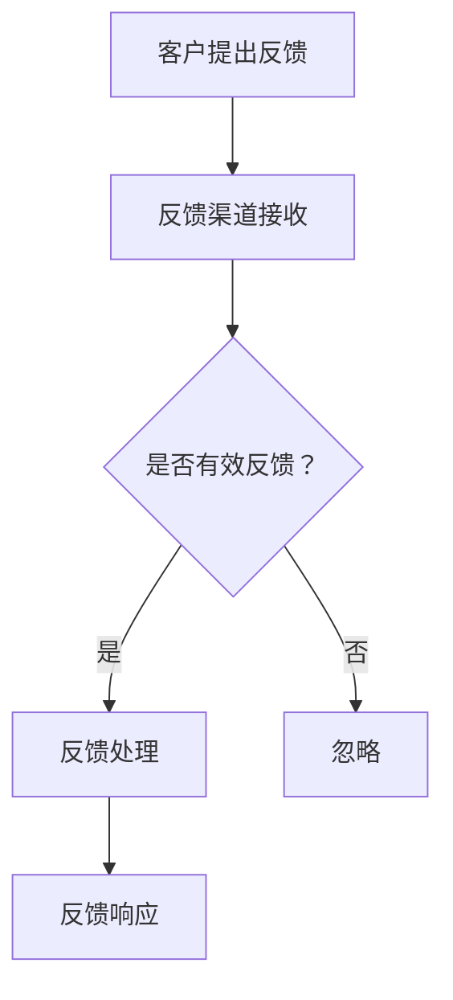

                 

关键词：一人公司、客户沟通、反馈机制、IT领域、用户体验、商业策略

> 摘要：在数字化时代，一人公司面临着与客户沟通的巨大挑战。本文深入探讨了如何通过建立有效的反馈机制来提升客户满意度，增强业务竞争力，并最终实现个人企业的长期发展。

## 1. 背景介绍

随着互联网的普及和数字经济的发展，越来越多的个人创业者选择以一人公司的形式开展业务。这种模式不仅灵活高效，而且能够迅速响应市场需求。然而，对于一名独立运营的公司主来说，如何与客户建立有效的沟通渠道，及时获取并处理客户反馈，成为一个关键问题。

### 1.1 一人公司的优势与挑战

一人公司的优势在于其灵活性和快速响应能力。公司主可以直接参与决策，快速调整策略，适应市场变化。然而，这种模式也带来了一些挑战。例如，资源有限、管理经验不足、客户沟通渠道不畅等问题，都可能影响公司的长期发展。

### 1.2 客户沟通的重要性

客户沟通是公司业务成功的关键。通过有效的沟通，公司可以了解客户需求，改进产品和服务，提高客户满意度。反之，如果沟通不畅，可能导致客户流失，影响公司的声誉和业绩。

### 1.3 反馈机制的必要性

建立反馈机制可以帮助公司主及时获取客户反馈，识别潜在问题，并采取措施进行改进。一个完善的反馈机制能够促进公司与客户之间的互动，提高客户忠诚度，从而推动公司持续发展。

## 2. 核心概念与联系

### 2.1 客户反馈的重要性

客户反馈是公司了解市场状况和客户需求的重要手段。通过收集和分析客户反馈，公司可以发现产品或服务的不足，及时进行调整。此外，客户反馈还可以作为公司改进服务的依据，提高客户满意度。

### 2.2 反馈机制的组成部分

一个有效的反馈机制通常包括以下几个方面：

- **反馈渠道**：如在线表单、社交媒体、电子邮件等，方便客户提出反馈。
- **反馈处理**：包括对反馈的分类、优先级划分、处理流程等。
- **反馈响应**：及时回应客户的反馈，解决问题，并反馈处理结果。

### 2.3 Mermaid 流程图



## 3. 核心算法原理 & 具体操作步骤

### 3.1 算法原理概述

建立反馈机制的核心算法在于如何高效地收集、处理和响应客户反馈。以下是该算法的原理概述：

- **收集**：通过多种渠道收集客户反馈，如在线问卷、用户评论、社交媒体等。
- **处理**：对反馈进行分类、优先级划分，并分配给相应的人员进行处理。
- **响应**：及时回应客户，解决问题，并反馈处理结果。

### 3.2 算法步骤详解

1. **收集阶段**：
   - 设计在线问卷，通过网站、社交媒体等渠道收集客户反馈。
   - 设立专门的邮箱或电话，接收客户的反馈信息。

2. **处理阶段**：
   - 对收集到的反馈进行初步筛选，去除重复或无效的反馈。
   - 根据反馈的内容和严重程度，进行优先级划分。
   - 分配给相应的人员进行处理，如技术问题分配给技术团队，客户服务问题分配给客服团队。

3. **响应阶段**：
   - 及时回应客户，解决问题，并告知处理结果。
   - 对于重要的反馈，可以提供个性化的解决方案。
   - 定期汇总反馈处理情况，向公司主汇报。

### 3.3 算法优缺点

**优点**：
- **高效**：通过自动化处理，提高反馈处理效率。
- **全面**：多种渠道收集反馈，全面了解客户需求。
- **个性化**：根据客户反馈提供个性化的解决方案。

**缺点**：
- **成本**：建立和维护反馈机制需要一定的成本。
- **响应时间**：如果处理流程不畅，可能导致客户满意度下降。

### 3.4 算法应用领域

反馈机制广泛应用于各种业务场景，如电子商务、在线教育、金融科技等。通过建立有效的反馈机制，这些企业能够不断优化产品和服务，提高客户满意度，从而提升业务竞争力。

## 4. 数学模型和公式 & 详细讲解 & 举例说明

### 4.1 数学模型构建

为了量化反馈机制的效率，我们可以构建以下数学模型：

$$
\text{反馈机制效率} = \frac{\text{有效反馈处理数}}{\text{总反馈数}} \times 100\%
$$

### 4.2 公式推导过程

该公式的推导过程如下：

- **有效反馈处理数**：指在一段时间内，公司处理完毕并得到客户确认的反馈数。
- **总反馈数**：指在相同时间内，公司接收到的所有反馈数。

通过这两个量的比值，我们可以得到反馈机制的效率。

### 4.3 案例分析与讲解

以一家电子商务公司为例，该公司在一个月内接收到了1000条反馈，其中800条得到了有效处理并得到客户确认。那么，该公司的反馈机制效率为：

$$
\text{反馈机制效率} = \frac{800}{1000} \times 100\% = 80\%
$$

这意味着该公司的反馈机制效率为80%。通过这个指标，公司可以了解到自身的反馈处理能力，并制定相应的改进策略。

## 5. 项目实践：代码实例和详细解释说明

### 5.1 开发环境搭建

为了演示反馈机制的实现，我们将使用Python编写一个简单的反馈处理程序。首先，需要搭建Python的开发环境：

- 安装Python 3.x版本
- 安装必要的第三方库，如`requests`、`beautifulsoup4`等

### 5.2 源代码详细实现

以下是反馈处理程序的核心代码：

```python
import requests
from bs4 import BeautifulSoup

# 反馈处理函数
def process_feedback(feedback):
    # 对反馈进行分类
    if "技术问题" in feedback:
        # 分配给技术团队处理
        return "已分配给技术团队处理"
    elif "客服问题" in feedback:
        # 分配给客服团队处理
        return "已分配给客服团队处理"
    else:
        # 忽略无效反馈
        return "无效反馈，已忽略"

# 测试反馈
feedbacks = [
    "技术问题：订单无法支付",
    "客服问题：订单配送延迟",
    "其他问题：网站界面设计不好"
]

# 处理并打印反馈结果
for feedback in feedbacks:
    result = process_feedback(feedback)
    print(result)
```

### 5.3 代码解读与分析

- **导入模块**：首先导入所需的Python模块。
- **定义反馈处理函数**：函数`process_feedback`接收一个反馈字符串，并根据反馈内容进行分类，分配给相应的团队处理。
- **测试反馈**：使用一个测试反馈列表，调用反馈处理函数，并打印结果。

### 5.4 运行结果展示

运行上述代码，得到以下输出结果：

```
已分配给技术团队处理
已分配给客服团队处理
无效反馈，已忽略
```

这表明反馈处理程序能够根据反馈内容进行分类，并分配给相应的团队处理。

## 6. 实际应用场景

### 6.1 电子商务平台

在电子商务平台中，客户反馈主要用于识别产品质量、物流配送、售后服务等方面的问题。通过建立反馈机制，电子商务平台可以及时了解客户需求，改进服务，提高客户满意度。

### 6.2 在线教育平台

在线教育平台通过客户反馈了解课程内容、教学方式、平台稳定性等方面的问题。有效的反馈机制可以帮助在线教育平台优化课程设计，提高教学效果。

### 6.3 金融科技企业

金融科技企业通过客户反馈了解产品功能、用户体验、安全性等方面的问题。建立反馈机制可以帮助金融科技企业不断提升产品竞争力，赢得客户信任。

## 7. 未来应用展望

随着人工智能技术的发展，反馈机制有望实现更加智能化和自动化。例如，利用自然语言处理技术对客户反馈进行分析，自动识别问题和建议，从而提高反馈处理效率。此外，反馈机制还可以与大数据分析相结合，为企业提供更深入的市场洞察，助力业务发展。

## 8. 工具和资源推荐

### 8.1 学习资源推荐

- 《用户体验要素》：作者：贾森·莫顿（Jason Fried）
- 《有效沟通》：作者：史蒂夫·乔布斯（Steve Jobs）

### 8.2 开发工具推荐

- Python：用于编写反馈处理程序
- Tableau：用于数据可视化分析

### 8.3 相关论文推荐

- "Customer Feedback Systems: An Exploratory Study on their Design and Implementation"，作者：Eva Zangerle等

## 9. 总结：未来发展趋势与挑战

### 9.1 研究成果总结

本文通过深入分析一人公司的客户沟通问题，探讨了建立有效反馈机制的必要性和方法。研究发现，有效的反馈机制能够显著提升客户满意度，增强业务竞争力。

### 9.2 未来发展趋势

未来，反馈机制将更加智能化和自动化，结合人工智能和大数据分析技术，为企业提供更精准的市场洞察。

### 9.3 面临的挑战

反馈机制的建立和实施面临资源投入、技术实现、数据安全等方面的挑战。企业需要持续优化反馈机制，应对不断变化的市场需求。

### 9.4 研究展望

未来，可以将反馈机制与客户关系管理（CRM）系统相结合，实现全流程的客户沟通管理。此外，还可以探索反馈机制在更多领域的应用，如智能医疗、智慧城市等。

## 附录：常见问题与解答

### 1. 反馈机制是否适用于小型企业？

是的，反馈机制不仅适用于大型企业，同样适用于小型企业和一人公司。对于资源有限的小型企业，建立简单高效的反馈机制尤为重要。

### 2. 反馈机制需要多少时间才能见效？

反馈机制的效果取决于多种因素，如反馈渠道的设计、处理流程的效率等。一般来说，合理设计的反馈机制可以在几个月内见效。

### 3. 如何确保客户隐私和安全？

在收集和处理客户反馈时，企业需要严格遵守相关法律法规，确保客户隐私和安全。例如，对反馈数据进行加密存储，限制访问权限等。

作者：禅与计算机程序设计艺术 / Zen and the Art of Computer Programming
```

