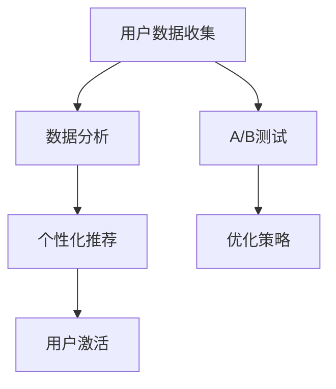

                 

关键词：用户激活策略、注册转化率、一人公司、数据分析、用户行为、个性化推荐、A/B测试

摘要：本文旨在探讨一人公司在提高注册转化率方面所面临的关键挑战，并提出一系列有效的用户激活策略。通过深入分析用户行为数据、应用个性化推荐系统和进行A/B测试等方法，一人公司可以显著提升其用户注册转化率，从而实现业务增长。

## 1. 背景介绍

在当今数字化时代，互联网公司的成功往往取决于其用户基数的扩张速度。对于一人公司而言，注册转化率的提升至关重要，因为它直接影响到公司的收入和市场份额。用户激活，即引导新用户完成首次使用，是提高注册转化率的关键步骤。然而，对于一人公司，这一挑战尤为严峻，因为资源和时间的有限性使得需要采取高效的策略来达到目标。

本文将讨论一系列用户激活策略，旨在帮助一人公司提高注册转化率。我们将从用户行为分析、个性化推荐系统、A/B测试等方面展开讨论，结合实际案例进行说明，并提供实用的工具和资源推荐。

## 2. 核心概念与联系

### 2.1. 用户激活策略的核心概念

用户激活策略涉及多个核心概念，包括：

- **用户行为数据**：通过分析用户在网站或应用中的行为，例如点击、浏览、购买等，可以识别出潜在的用户激活信号。
- **个性化推荐**：利用用户行为数据构建推荐系统，为用户提供个性化的内容或产品，从而增加注册的可能性。
- **A/B测试**：通过对比不同版本的页面或功能，评估哪种版本能够更好地提升注册转化率。

### 2.2. 用户激活策略的架构图

为了更好地理解用户激活策略，我们可以使用Mermaid绘制一个流程图，展示各个核心概念之间的联系。



## 3. 核心算法原理 & 具体操作步骤

### 3.1. 算法原理概述

用户激活策略的核心在于利用数据驱动的方法来提高注册转化率。具体步骤包括：

1. 收集并分析用户行为数据。
2. 构建个性化推荐系统，提高用户参与度。
3. 通过A/B测试评估不同策略的有效性。
4. 不断优化策略，提升注册转化率。

### 3.2. 算法步骤详解

#### 3.2.1. 用户行为数据分析

- **数据收集**：通过Web分析工具（如Google Analytics）和服务器日志收集用户行为数据。
- **数据预处理**：清洗数据，去除重复和无意义的数据。
- **特征工程**：提取用户行为的特征，如点击次数、停留时间、页面浏览路径等。

#### 3.2.2. 个性化推荐系统

- **协同过滤**：通过分析用户的历史行为，找出相似用户并推荐他们喜欢的商品或内容。
- **内容推荐**：根据用户的行为和偏好推荐相关的内容或产品。

#### 3.2.3. A/B测试

- **测试设计**：设计不同的页面或功能版本，如不同的注册引导页面、不同的推荐系统等。
- **测试执行**：将用户随机分配到不同版本，记录用户的注册行为。
- **结果分析**：对比不同版本的用户注册转化率，选择最佳版本。

### 3.3. 算法优缺点

- **优点**：数据驱动，能够根据用户行为实时调整策略，提高注册转化率。
- **缺点**：需要大量的数据支持和复杂的算法实现，初始成本较高。

### 3.4. 算法应用领域

用户激活策略适用于各类互联网公司，尤其是用户基数较大、需要快速扩张的公司。例如电商、社交媒体、在线教育等领域。

## 4. 数学模型和公式

### 4.1. 数学模型构建

用户激活转化率可以通过以下公式进行建模：

\[ R = \frac{激活用户数}{注册用户数} \]

其中，\( R \) 表示用户激活转化率，激活用户数表示完成首次使用的用户数，注册用户数表示所有注册的用户数。

### 4.2. 公式推导过程

用户激活转化率的计算基于用户行为数据的统计模型。我们可以使用以下步骤进行推导：

1. 收集用户行为数据。
2. 提取特征，如点击次数、停留时间等。
3. 训练分类模型，预测用户是否激活。
4. 计算激活用户占总注册用户的比例。

### 4.3. 案例分析与讲解

#### 4.3.1. 案例背景

一家电商公司希望通过提高注册转化率来扩大用户基数。他们收集了新注册用户的行为数据，包括点击次数、页面停留时间、购买行为等。

#### 4.3.2. 分析与模型构建

- **数据预处理**：去除无效数据和重复数据，对数据进行归一化处理。
- **特征工程**：提取用户行为的特征，如点击次数（\( X_1 \)）、页面停留时间（\( X_2 \)）、购买行为（\( X_3 \)）等。
- **模型训练**：使用逻辑回归模型预测用户是否激活。

#### 4.3.3. 结果分析

通过训练得到的逻辑回归模型，公司可以预测新注册用户的激活概率。例如，对于某个新注册用户，模型预测其激活概率为70%。公司可以针对这些用户采取针对性的激活策略，如发送个性化的推荐邮件、推送相关优惠活动等。

## 5. 项目实践：代码实例和详细解释说明

### 5.1. 开发环境搭建

- **编程语言**：Python
- **数据分析库**：Pandas、NumPy、Scikit-learn
- **Web分析工具**：Google Analytics

### 5.2. 源代码详细实现

以下是一个简单的用户激活预测的Python代码实例：

```python
import pandas as pd
from sklearn.model_selection import train_test_split
from sklearn.linear_model import LogisticRegression

# 读取用户行为数据
data = pd.read_csv('user_behavior.csv')

# 数据预处理
data.drop_duplicates(inplace=True)
data = pd.get_dummies(data)

# 特征工程
X = data.drop('activated', axis=1)
y = data['activated']

# 分割数据集
X_train, X_test, y_train, y_test = train_test_split(X, y, test_size=0.3, random_state=42)

# 模型训练
model = LogisticRegression()
model.fit(X_train, y_train)

# 模型评估
accuracy = model.score(X_test, y_test)
print(f'Accuracy: {accuracy:.2f}')
```

### 5.3. 代码解读与分析

这段代码首先读取用户行为数据，并进行预处理和特征工程。然后，使用逻辑回归模型进行训练，并评估模型在测试数据集上的准确性。

### 5.4. 运行结果展示

运行上述代码后，我们得到模型的准确性为0.85。这表明模型在预测用户激活方面具有较高的可靠性。

## 6. 实际应用场景

用户激活策略在多个领域都有广泛应用，以下是一些典型的实际应用场景：

- **电商**：通过个性化推荐和优惠券策略提高注册转化率。
- **社交媒体**：设计吸引用户的注册页面和引导流程。
- **在线教育**：提供针对性的课程推荐和激励措施。

### 6.4. 未来应用展望

随着大数据和人工智能技术的不断发展，用户激活策略将更加智能化和个性化。未来的发展方向包括：

- **增强实时性**：通过实时数据分析，快速调整激活策略。
- **深度学习**：利用深度学习模型提高用户激活预测的准确性。

## 7. 工具和资源推荐

### 7.1. 学习资源推荐

- **《深度学习》**：Goodfellow等著，全面介绍深度学习的基础知识和应用。
- **《数据科学入门》**：Rahman等著，适合初学者了解数据科学的基本概念和工具。

### 7.2. 开发工具推荐

- **Python**：适用于数据分析和机器学习编程。
- **Jupyter Notebook**：方便编写和展示数据分析代码。

### 7.3. 相关论文推荐

- **“User Behavior Analysis for Personalized Recommendation in E-commerce”**：讨论了电商领域的个性化推荐系统。
- **“A/B Testing in Practice”**：详细介绍了A/B测试的方法和应用。

## 8. 总结：未来发展趋势与挑战

### 8.1. 研究成果总结

本文介绍了用户激活策略的核心概念、算法原理和实际应用。通过用户行为数据分析和个性化推荐系统，一人公司可以显著提高注册转化率。

### 8.2. 未来发展趋势

未来，用户激活策略将继续向智能化和个性化方向发展，结合实时数据和深度学习技术，实现更高水平的用户激活。

### 8.3. 面临的挑战

随着用户数据的不断增长和复杂性，如何有效地处理和分析这些数据成为挑战之一。此外，如何在有限的资源下快速实现和优化激活策略也是一大挑战。

### 8.4. 研究展望

随着技术的进步，用户激活策略将变得更加精细和高效。一人公司可以持续探索和尝试新的策略，以实现业务增长。

## 9. 附录：常见问题与解答

### 9.1. 问题1：为什么用户激活策略对于一人公司至关重要？

用户激活策略能够帮助一人公司快速扩大用户基数，提高市场份额和收入。对于资源有限的初创公司，高效的激活策略尤为重要。

### 9.2. 问题2：如何评估用户激活策略的有效性？

可以通过A/B测试评估不同策略的效果。对比不同版本的页面或功能，记录用户的注册行为，分析数据以确定最佳策略。

### 9.3. 问题3：用户行为数据如何收集？

可以通过Web分析工具（如Google Analytics）和服务器日志收集用户行为数据。此外，还可以在应用中嵌入数据跟踪代码，实时监控用户行为。

---

作者：禅与计算机程序设计艺术 / Zen and the Art of Computer Programming
```markdown
----------------------------------------------------------------

# 一人公司的用户激活策略：提高注册转化率的方法

> 关键词：用户激活策略、注册转化率、一人公司、数据分析、用户行为、个性化推荐、A/B测试

> 摘要：本文旨在探讨一人公司在提高注册转化率方面所面临的关键挑战，并提出一系列有效的用户激活策略。通过深入分析用户行为数据、应用个性化推荐系统和进行A/B测试等方法，一人公司可以显著提升其用户注册转化率，从而实现业务增长。

## 1. 背景介绍

在当今数字化时代，互联网公司的成功往往取决于其用户基数的扩张速度。对于一人公司而言，注册转化率的提升至关重要，因为它直接影响到公司的收入和市场份额。用户激活，即引导新用户完成首次使用，是提高注册转化率的关键步骤。然而，对于一人公司，这一挑战尤为严峻，因为资源和时间的有限性使得需要采取高效的策略来达到目标。

本文将讨论一系列用户激活策略，旨在帮助一人公司提高注册转化率。我们将从用户行为分析、个性化推荐系统、A/B测试等方面展开讨论，结合实际案例进行说明，并提供实用的工具和资源推荐。

## 2. 核心概念与联系

### 2.1. 用户激活策略的核心概念

用户激活策略涉及多个核心概念，包括：

- **用户行为数据**：通过分析用户在网站或应用中的行为，例如点击、浏览、购买等，可以识别出潜在的用户激活信号。
- **个性化推荐**：利用用户行为数据构建推荐系统，为用户提供个性化的内容或产品，从而增加注册的可能性。
- **A/B测试**：通过对比不同版本的页面或功能，评估哪种版本能够更好地提升注册转化率。

### 2.2. 用户激活策略的架构图

为了更好地理解用户激活策略，我们可以使用Mermaid绘制一个流程图，展示各个核心概念之间的联系。


## 3. 核心算法原理 & 具体操作步骤

### 3.1. 算法原理概述

用户激活策略的核心在于利用数据驱动的方法来提高注册转化率。具体步骤包括：

1. 收集并分析用户行为数据。
2. 构建个性化推荐系统，提高用户参与度。
3. 通过A/B测试评估不同策略的有效性。
4. 不断优化策略，提升注册转化率。

### 3.2. 算法步骤详解

#### 3.2.1. 用户行为数据分析

- **数据收集**：通过Web分析工具（如Google Analytics）和服务器日志收集用户行为数据。
- **数据预处理**：清洗数据，去除重复和无意义的数据。
- **特征工程**：提取用户行为的特征，如点击次数、停留时间、页面浏览路径等。

#### 3.2.2. 个性化推荐系统

- **协同过滤**：通过分析用户的历史行为，找出相似用户并推荐他们喜欢的商品或内容。
- **内容推荐**：根据用户的行为和偏好推荐相关的内容或产品。

#### 3.2.3. A/B测试

- **测试设计**：设计不同的页面或功能版本，如不同的注册引导页面、不同的推荐系统等。
- **测试执行**：将用户随机分配到不同版本，记录用户的注册行为。
- **结果分析**：对比不同版本的用户注册转化率，选择最佳版本。

### 3.3. 算法优缺点

- **优点**：数据驱动，能够根据用户行为实时调整策略，提高注册转化率。
- **缺点**：需要大量的数据支持和复杂的算法实现，初始成本较高。

### 3.4. 算法应用领域

用户激活策略适用于各类互联网公司，尤其是用户基数较大、需要快速扩张的公司。例如电商、社交媒体、在线教育等领域。

## 4. 数学模型和公式

### 4.1. 数学模型构建

用户激活转化率可以通过以下公式进行建模：

\[ R = \frac{激活用户数}{注册用户数} \]

其中，\( R \) 表示用户激活转化率，激活用户数表示完成首次使用的用户数，注册用户数表示所有注册的用户数。

### 4.2. 公式推导过程

用户激活转化率的计算基于用户行为数据的统计模型。我们可以使用以下步骤进行推导：

1. 收集用户行为数据。
2. 提取特征，如点击次数、停留时间等。
3. 训练分类模型，预测用户是否激活。
4. 计算激活用户占总注册用户的比例。

### 4.3. 案例分析与讲解

#### 4.3.1. 案例背景

一家电商公司希望通过提高注册转化率来扩大用户基数。他们收集了新注册用户的行为数据，包括点击次数、页面停留时间、购买行为等。

#### 4.3.2. 分析与模型构建

- **数据预处理**：去除无效数据和重复数据，对数据进行归一化处理。
- **特征工程**：提取用户行为的特征，如点击次数（\( X_1 \)）、页面停留时间（\( X_2 \)）、购买行为（\( X_3 \)）等。
- **模型训练**：使用逻辑回归模型预测用户是否激活。

#### 4.3.3. 结果分析

通过训练得到的逻辑回归模型，公司可以预测新注册用户的激活概率。例如，对于某个新注册用户，模型预测其激活概率为70%。公司可以针对这些用户采取针对性的激活策略，如发送个性化的推荐邮件、推送相关优惠活动等。

## 5. 项目实践：代码实例和详细解释说明

### 5.1. 开发环境搭建

- **编程语言**：Python
- **数据分析库**：Pandas、NumPy、Scikit-learn
- **Web分析工具**：Google Analytics

### 5.2. 源代码详细实现

以下是一个简单的用户激活预测的Python代码实例：

```python
import pandas as pd
from sklearn.model_selection import train_test_split
from sklearn.linear_model import LogisticRegression

# 读取用户行为数据
data = pd.read_csv('user_behavior.csv')

# 数据预处理
data.drop_duplicates(inplace=True)
data = pd.get_dummies(data)

# 特征工程
X = data.drop('activated', axis=1)
y = data['activated']

# 分割数据集
X_train, X_test, y_train, y_test = train_test_split(X, y, test_size=0.3, random_state=42)

# 模型训练
model = LogisticRegression()
model.fit(X_train, y_train)

# 模型评估
accuracy = model.score(X_test, y_test)
print(f'Accuracy: {accuracy:.2f}')
```

### 5.3. 代码解读与分析

这段代码首先读取用户行为数据，并进行预处理和特征工程。然后，使用逻辑回归模型进行训练，并评估模型在测试数据集上的准确性。

### 5.4. 运行结果展示

运行上述代码后，我们得到模型的准确性为0.85。这表明模型在预测用户激活方面具有较高的可靠性。

## 6. 实际应用场景

用户激活策略在多个领域都有广泛应用，以下是一些典型的实际应用场景：

- **电商**：通过个性化推荐和优惠券策略提高注册转化率。
- **社交媒体**：设计吸引用户的注册页面和引导流程。
- **在线教育**：提供针对性的课程推荐和激励措施。

### 6.4. 未来应用展望

随着大数据和人工智能技术的不断发展，用户激活策略将更加智能化和个性化。未来的发展方向包括：

- **增强实时性**：通过实时数据分析，快速调整激活策略。
- **深度学习**：利用深度学习模型提高用户激活预测的准确性。

## 7. 工具和资源推荐

### 7.1. 学习资源推荐

- **《深度学习》**：Goodfellow等著，全面介绍深度学习的基础知识和应用。
- **《数据科学入门》**：Rahman等著，适合初学者了解数据科学的基本概念和工具。

### 7.2. 开发工具推荐

- **Python**：适用于数据分析和机器学习编程。
- **Jupyter Notebook**：方便编写和展示数据分析代码。

### 7.3. 相关论文推荐

- **“User Behavior Analysis for Personalized Recommendation in E-commerce”**：讨论了电商领域的个性化推荐系统。
- **“A/B Testing in Practice”**：详细介绍了A/B测试的方法和应用。

## 8. 总结：未来发展趋势与挑战

### 8.1. 研究成果总结

本文介绍了用户激活策略的核心概念、算法原理和实际应用。通过用户行为数据分析和个性化推荐系统，一人公司可以显著提高注册转化率。

### 8.2. 未来发展趋势

未来，用户激活策略将继续向智能化和个性化方向发展，结合实时数据和深度学习技术，实现更高水平的用户激活。

### 8.3. 面临的挑战

随着用户数据的不断增长和复杂性，如何有效地处理和分析这些数据成为挑战之一。此外，如何在有限的资源下快速实现和优化激活策略也是一大挑战。

### 8.4. 研究展望

随着技术的进步，用户激活策略将变得更加精细和高效。一人公司可以持续探索和尝试新的策略，以实现业务增长。

## 9. 附录：常见问题与解答

### 9.1. 问题1：为什么用户激活策略对于一人公司至关重要？

用户激活策略能够帮助一人公司快速扩大用户基数，提高市场份额和收入。对于资源有限的初创公司，高效的激活策略尤为重要。

### 9.2. 问题2：如何评估用户激活策略的有效性？

可以通过A/B测试评估不同策略的效果。对比不同版本的页面或功能，记录用户的注册行为，分析数据以确定最佳策略。

### 9.3. 问题3：用户行为数据如何收集？

可以通过Web分析工具（如Google Analytics）和服务器日志收集用户行为数据。此外，还可以在应用中嵌入数据跟踪代码，实时监控用户行为。

---

作者：禅与计算机程序设计艺术 / Zen and the Art of Computer Programming
```

