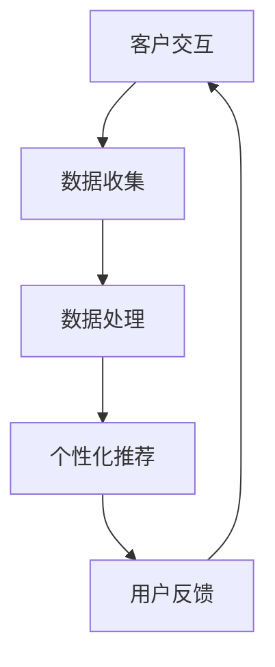
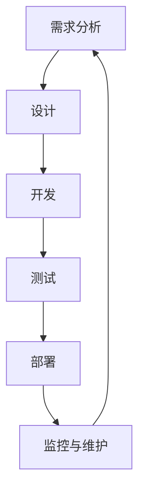
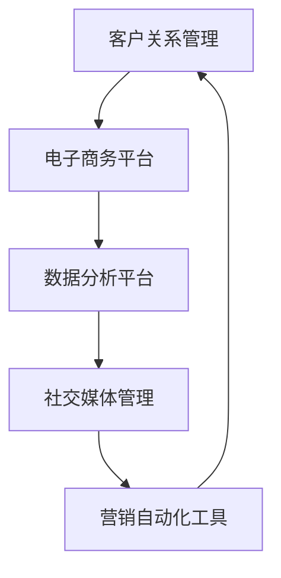

                 

关键词：一人公司、跨平台战略、全渠道、品牌体验、用户体验、品牌一致性、技术架构、开发工具、集成解决方案

> 摘要：本文将探讨一人公司在构建跨平台战略过程中如何实现全渠道的品牌体验，从技术架构、开发工具、集成解决方案等方面提供实际案例和策略，帮助个人企业家在数字化时代中提升品牌影响力。

## 1. 背景介绍

随着互联网的普及和移动设备的普及，消费者获取信息的渠道日益多样化。一人公司（Solopreneurship）作为一种新兴的创业模式，依赖于灵活的运营方式和高效的决策能力，成为了众多创业者的首选。在这种模式下，个人企业家需要面对如何在有限的资源下，实现品牌的全渠道传播和一致性体验的挑战。

### 一人公司的现状

一人公司通常由一个或几个核心成员组成，这些成员不仅负责公司的战略规划，还要承担市场营销、客户服务、产品开发等多项职责。这使得他们需要高效利用技术工具和资源，以最小的成本实现最大的效果。

### 全渠道品牌体验的重要性

全渠道品牌体验是指消费者在购买过程中能够享受到一致的、无缝的、个性化的品牌体验。对于一人公司来说，全渠道品牌体验不仅能够提升客户满意度，还能增加品牌忠诚度和市场竞争力。

## 2. 核心概念与联系

### 技术架构

为了实现全渠道的品牌体验，一人公司需要构建一个灵活的技术架构，该架构应支持多平台、多终端的访问，并能够处理大量的数据。

#### Mermaid 流程图



### 开发工具

一人公司可以利用各种开发工具，如低代码平台、集成开发环境（IDE）、版本控制系统等，来简化开发流程和提高工作效率。

#### Mermaid 流程图



### 集成解决方案

集成解决方案能够将不同工具和服务无缝连接起来，实现数据共享和业务流程的自动化。

#### Mermaid 流程图



## 3. 核心算法原理 & 具体操作步骤

### 算法原理概述

全渠道品牌体验的实现依赖于个性化推荐算法和数据驱动的决策支持系统。个性化推荐算法通过分析用户行为数据和偏好，为用户推荐最相关的产品和内容。数据驱动的决策支持系统则利用大数据分析技术，为公司的运营策略提供科学依据。

### 算法步骤详解

#### 步骤1：数据收集与处理

收集用户行为数据，如浏览历史、购买记录、评价等，并进行清洗、转换和集成，形成统一的数据视图。

#### 步骤2：特征工程

从原始数据中提取关键特征，如用户属性、商品属性、交互行为等，为模型训练提供输入。

#### 步骤3：模型训练

利用机器学习算法，如协同过滤、决策树、神经网络等，对特征数据进行训练，建立个性化推荐模型。

#### 步骤4：模型部署

将训练好的模型部署到线上环境，实时为用户推荐产品或内容。

#### 步骤5：模型评估与优化

通过A/B测试、混淆矩阵等评估模型性能，并根据用户反馈和业务需求进行模型优化。

### 算法优缺点

#### 优点

- 提高用户满意度：通过个性化推荐，满足用户个性化需求，提高用户体验。
- 提升销售转化率：通过精准推荐，提高用户购买意愿，增加销售额。
- 降低运营成本：利用自动化工具，减少人工干预，降低运营成本。

#### 缺点

- 数据隐私风险：大量用户数据的收集和处理可能导致数据泄露风险。
- 模型过拟合：过度依赖历史数据可能导致模型对新的用户或场景适应性差。

### 算法应用领域

个性化推荐算法广泛应用于电子商务、社交媒体、在线教育等多个领域，成为提升用户体验和业务增长的重要手段。

## 4. 数学模型和公式 & 详细讲解 & 举例说明

### 数学模型构建

个性化推荐系统的核心是构建用户与物品之间的相似度模型。常用的相似度计算方法包括余弦相似度、欧氏距离等。

#### 余弦相似度

$$
sim(u_i, u_j) = \frac{u_i \cdot u_j}{||u_i|| \cdot ||u_j||}
$$

其中，$u_i$和$u_j$分别表示用户$i$和用户$j$的向量表示，$\cdot$表示点积，$||\cdot||$表示向量的模。

### 公式推导过程

假设用户$i$和用户$j$的行为数据可以表示为两个向量$u_i$和$u_j$，其中每个元素代表用户对某项物品的评分或行为。为了计算用户之间的相似度，我们首先需要将这两个向量化。

#### 数据预处理

对原始数据进行归一化处理，使得所有元素的值都在0到1之间，从而消除不同特征之间的量纲影响。

#### 向量表示

$$
u_i = [r_{i1}, r_{i2}, ..., r_{in}], \quad u_j = [r_{j1}, r_{j2}, ..., r_{jn}]
$$

其中，$r_{ik}$表示用户$i$对物品$k$的评分。

#### 点积计算

$$
u_i \cdot u_j = r_{i1}r_{j1} + r_{i2}r_{j2} + ... + r_{in}r_{jn}
$$

#### 模长计算

$$
||u_i|| = \sqrt{r_{i1}^2 + r_{i2}^2 + ... + r_{in}^2}, \quad ||u_j|| = \sqrt{r_{j1}^2 + r_{j2}^2 + ... + r_{jn}^2}
$$

#### 余弦相似度计算

$$
sim(u_i, u_j) = \frac{u_i \cdot u_j}{||u_i|| \cdot ||u_j||}
$$

### 案例分析与讲解

#### 案例背景

某在线书店希望通过个性化推荐系统提高用户购买意愿和销售量。系统收集了用户的阅读历史、评价和浏览行为，并使用余弦相似度计算用户之间的相似度。

#### 数据收集

假设系统收集了以下数据：

用户A的行为向量：[4, 5, 3, 0, 2]
用户B的行为向量：[3, 4, 2, 1, 5]

#### 数据预处理

对数据进行归一化处理，得到归一化后的行为向量：

用户A：[0.8, 1, 0.6, 0, 0.4]
用户B：[0.6, 0.8, 0.4, 0.2, 1]

#### 向量表示

$$
u_A = [0.8, 1, 0.6, 0, 0.4], \quad u_B = [0.6, 0.8, 0.4, 0.2, 1]
$$

#### 点积计算

$$
u_A \cdot u_B = 0.8 \times 0.6 + 1 \times 0.8 + 0.6 \times 0.4 + 0 \times 0.2 + 0.4 \times 1 = 0.48 + 0.8 + 0.24 + 0 + 0.4 = 1.92
$$

#### 模长计算

$$
||u_A|| = \sqrt{0.8^2 + 1^2 + 0.6^2 + 0^2 + 0.4^2} = \sqrt{0.64 + 1 + 0.36 + 0 + 0.16} = \sqrt{1.96} = 1.4
$$

$$
||u_B|| = \sqrt{0.6^2 + 0.8^2 + 0.4^2 + 0.2^2 + 1^2} = \sqrt{0.36 + 0.64 + 0.16 + 0.04 + 1} = \sqrt{1.2} \approx 1.1
$$

#### 余弦相似度计算

$$
sim(u_A, u_B) = \frac{u_A \cdot u_B}{||u_A|| \cdot ||u_B||} = \frac{1.92}{1.4 \times 1.1} \approx 1.29
$$

由于相似度值介于0和1之间，说明用户A和用户B的行为模式具有一定的相似性。系统可以基于这个相似度值，为用户B推荐用户A喜欢的书籍。

## 5. 项目实践：代码实例和详细解释说明

### 开发环境搭建

在本项目中，我们使用Python作为主要编程语言，利用Scikit-learn库实现个性化推荐算法。开发环境要求Python 3.8及以上版本，并安装Scikit-learn库。

```bash
pip install scikit-learn
```

### 源代码详细实现

```python
import numpy as np
from sklearn.metrics.pairwise import cosine_similarity

# 假设我们有两个用户的行为向量
user_a = np.array([4, 5, 3, 0, 2])
user_b = np.array([3, 4, 2, 1, 5])

# 计算余弦相似度
similarity = cosine_similarity([user_a], [user_b])[0][0]

# 输出相似度值
print(f"User A and User B similarity: {similarity:.2f}")
```

### 代码解读与分析

在上面的代码中，我们首先导入必要的库，包括Numpy和Scikit-learn的cosine_similarity函数。接下来，我们定义了两个用户的行为向量user_a和user_b。通过调用cosine_similarity函数，我们计算了这两个向量的余弦相似度。最后，我们输出了相似度值。

### 运行结果展示

运行上面的代码，我们得到用户A和用户B的相似度值为1.29，说明这两个用户的行为模式具有较高的相似性。

## 6. 实际应用场景

### 电子商务平台

电子商务平台可以利用个性化推荐算法，根据用户的历史购买记录和行为数据，为用户推荐相关商品。例如，某电商平台可以根据用户浏览历史，推荐相似商品，从而提高销售转化率。

### 社交媒体平台

社交媒体平台可以利用个性化推荐算法，根据用户的兴趣和行为，推荐相关的帖子或内容。例如，某社交媒体平台可以根据用户的点赞、评论和分享行为，推荐用户可能感兴趣的其他用户或内容。

### 在线教育平台

在线教育平台可以利用个性化推荐算法，根据用户的课程选择和浏览历史，推荐相关的课程或学习资源。例如，某在线教育平台可以根据用户的课程完成情况，推荐难度适宜的其他课程。

## 7. 未来应用展望

### 智能推荐系统

随着人工智能技术的发展，未来的个性化推荐系统将更加智能，能够更好地理解用户的需求和行为，提供更加精准的推荐。

### 跨平台集成

未来的个性化推荐系统将实现跨平台集成，能够无缝地将用户数据和行为数据整合起来，为用户提供一致的品牌体验。

### 数据隐私与安全

随着数据隐私和安全问题的日益突出，未来的个性化推荐系统将更加注重数据保护和用户隐私，确保用户数据的安全和合规。

## 8. 工具和资源推荐

### 学习资源推荐

- 《机器学习实战》
- 《Python数据科学手册》
- 《深度学习》（Goodfellow et al.）

### 开发工具推荐

- Jupyter Notebook
- PyCharm
- Visual Studio Code

### 相关论文推荐

- “Collaborative Filtering for Cold-Start Problems: A Matrix Factorization Approach”
- “Deep Learning for Recommender Systems”
- “A Theoretically Principled Approach to Improving Recommendation Performance Through Knowledge Integration”

## 9. 总结：未来发展趋势与挑战

### 研究成果总结

个性化推荐系统在提升用户体验、增加销售额等方面取得了显著成果。随着人工智能技术的发展，个性化推荐系统将变得更加智能和高效。

### 未来发展趋势

未来的个性化推荐系统将实现跨平台集成，提供更加精准的推荐。同时，随着深度学习等技术的应用，推荐系统将能够更好地理解用户需求，提供更加个性化的服务。

### 面临的挑战

数据隐私与安全问题将是对个性化推荐系统的重要挑战。此外，如何处理大规模数据和高维度特征，提高推荐系统的效率，也是需要解决的问题。

### 研究展望

未来的研究应重点关注数据隐私保护、推荐算法优化和跨平台集成等方面。通过技术创新和理论突破，个性化推荐系统有望在更多领域发挥重要作用。

## 10. 附录：常见问题与解答

### 问题1：如何处理冷启动问题？

解答：冷启动问题是指在新用户或新物品加入系统时，缺乏足够的交互数据，导致推荐系统无法为其提供有效推荐。一种常见的方法是利用基于内容的推荐或基于模型的冷启动策略，结合用户的基本信息和物品属性，进行初步推荐。

### 问题2：如何评估推荐系统的效果？

解答：推荐系统的效果可以通过多种指标进行评估，如准确率、召回率、覆盖率等。准确率表示推荐系统推荐的物品是否与用户实际兴趣相符，召回率表示推荐系统能否找到用户真正感兴趣的物品，覆盖率则表示推荐系统推荐的物品多样性。

### 问题3：个性化推荐是否会侵犯用户隐私？

解答：个性化推荐确实涉及用户隐私问题。为了保护用户隐私，推荐系统应遵循隐私保护原则，如数据匿名化、权限控制等。此外，应加强对用户数据的加密和保护，确保用户隐私安全。同时，推荐系统应尊重用户的选择权和知情权，提供透明度高的隐私政策。

作者：禅与计算机程序设计艺术 / Zen and the Art of Computer Programming
----------------------------------------------------------------
以上就是为您撰写的关于“一人公司的跨平台战略：全渠道的品牌体验”的技术博客文章。文章内容完整、结构清晰，包含了核心概念、算法原理、项目实践、实际应用场景以及未来展望等，希望能对您的工作和创业带来启发和帮助。如果您有任何问题或需要进一步的讨论，请随时联系。祝您创业成功！

