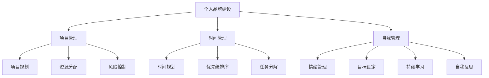

                 

关键词：一人公司、效率、自律、技术运营、个人品牌、自我管理、项目管理

> 摘要：本文旨在探讨在信息技术高速发展的背景下，如何以个人为单位实现高效运营，打造具有竞争力的“一人公司”。通过分析个人品牌建设、项目管理和时间管理等核心概念，并结合具体操作步骤和数学模型，提出一系列行之有效的策略和方法，以期为追求职业独立和个人成就的IT从业者提供指导。

## 1. 背景介绍

随着互联网和人工智能技术的飞速发展，远程工作和自由职业逐渐成为职场新趋势。在这样的背景下，越来越多的IT从业者选择以个人为单位，打造自己的“一人公司”。这种模式不仅赋予个体极大的自主性和灵活性，还能充分利用现代科技手段，实现高效的自我管理和项目执行。

### 1.1 “一人公司”的定义

所谓“一人公司”，指的是由一名个人独立运营的业务实体，通常涉及软件开发、技术咨询、项目管理等多个领域。与传统的公司组织结构不同，一人公司没有复杂的组织架构和管理层级，个体负责从项目策划到执行的全过程。

### 1.2 市场背景与机遇

当前，信息技术领域的市场需求日益旺盛，尤其是在云计算、大数据、人工智能等领域。这为一人公司提供了广阔的市场空间。同时，远程工作工具的成熟，如Slack、Trello、Zoom等，使得一人公司能够高效地与客户、团队成员沟通协作。

## 2. 核心概念与联系

为了实现高效的一人公司运营，以下核心概念及其相互关系至关重要：

### 2.1 个人品牌建设

个人品牌建设是一人公司的基石。通过持续的学习、专业技能的提升和社交媒体的运营，个体能够树立专业、可靠的形象，吸引客户和合作伙伴。

### 2.2 项目管理

项目管理是实现一人公司目标的关键。有效的项目管理包括项目规划、资源分配、风险控制等多个方面，确保项目按时、按质完成。

### 2.3 时间管理

时间管理是实现高效运营的基础。通过科学的时间规划、优先级排序和任务的分解，个体能够最大限度地利用时间，提高工作效率。

### 2.4 自我管理

自我管理是一人公司成功的关键。它包括情绪管理、目标设定、持续学习和自我反思等方面，帮助个体保持动力和效率。

### 2.5 核心概念原理和架构的 Mermaid 流程图



## 3. 核心算法原理 & 具体操作步骤

### 3.1 算法原理概述

一人公司的运营可以看作是一个优化问题，目标是最大化个人收益，同时最小化时间和资源的浪费。以下是具体的算法原理和操作步骤：

### 3.2 算法步骤详解

1. **市场调研与分析**：了解目标市场、客户需求、竞争对手等信息，为项目选择和定位提供依据。

2. **项目筛选与评估**：根据市场调研结果，筛选有潜力的项目，并进行详细评估，确保项目的可行性和盈利能力。

3. **项目规划与分工**：确定项目目标、范围、时间表和资源需求，将任务分解为可执行的子任务，并分配给个体。

4. **时间规划与优先级排序**：使用时间管理工具（如Gantt图、Trello等），将任务按照优先级和时间节点进行排序和规划。

5. **资源分配与监控**：合理分配人力资源、技术资源等，确保项目顺利进行，同时监控资源使用情况，避免浪费。

6. **风险控制与应对**：识别项目风险，制定应对策略，确保项目按时、按质完成。

7. **项目执行与监控**：按照项目计划执行任务，定期检查进度和质量，确保项目按时完成。

8. **项目总结与反馈**：项目完成后，进行总结和反馈，分析项目成功经验和不足之处，为后续项目提供参考。

### 3.3 算法优缺点

**优点**：

- **灵活性强**：一人公司可以根据市场需求和个人兴趣灵活选择项目，适应性强。
- **决策效率高**：由于组织结构简单，决策过程快速，能够迅速响应市场变化。
- **降低成本**：无需支付大量员工薪酬和福利，降低了运营成本。

**缺点**：

- **资源有限**：一人公司资源有限，难以承担大规模项目。
- **项目管理难度大**：项目规模小，管理难度相对较高。

### 3.4 算法应用领域

一人公司算法主要适用于以下领域：

- **软件开发与咨询服务**：通过技术优势和项目经验，为客户提供定制化的软件开发和咨询服务。
- **技术写作与出版**：撰写技术博客、书籍，分享专业知识和经验，建立个人品牌。
- **教育培训**：通过在线课程、讲座等形式，传授专业知识和技能。

## 4. 数学模型和公式 & 详细讲解 & 举例说明

### 4.1 数学模型构建

为了更好地描述一人公司的运营效率，我们可以构建以下数学模型：

\[ \text{效率} = \frac{\text{项目收益}}{\text{项目成本}} \]

其中，项目收益包括销售收入、咨询费用等，项目成本包括人力成本、技术成本、营销成本等。

### 4.2 公式推导过程

根据项目收益和成本的构成，我们可以推导出以下公式：

\[ \text{效率} = \frac{\text{销售收入} + \text{咨询费用}}{\text{人力成本} + \text{技术成本} + \text{营销成本}} \]

为了提高效率，我们需要在增加项目收益的同时，降低项目成本。具体策略如下：

1. **提高销售收入**：通过拓展客户群体、提升服务质量、增加销售渠道等手段。
2. **降低人力成本**：通过优化项目流程、自动化工具、远程协作等手段。
3. **降低技术成本**：通过技术升级、知识共享、外包等手段。
4. **降低营销成本**：通过精准营销、社交媒体推广、口碑传播等手段。

### 4.3 案例分析与讲解

假设一家一人公司从事软件开发和咨询服务，其年度项目收益为100万元，项目成本为50万元。根据上述公式，该公司的运营效率为：

\[ \text{效率} = \frac{100\text{万元}}{50\text{万元}} = 2 \]

为了提高运营效率，公司可以采取以下措施：

1. **拓展客户群体**：通过参加行业展会、发布技术博客、建立合作伙伴关系等方式，增加客户来源。
2. **提升服务质量**：通过不断学习新技术、提升团队技能、优化产品性能等手段，提高客户满意度。
3. **降低人力成本**：采用远程办公、自动化工具、知识共享平台等手段，降低人力成本。
4. **降低营销成本**：通过精准营销、社交媒体推广、口碑传播等方式，降低营销成本。

通过以上措施，公司的运营效率有望进一步提高，实现可持续发展。

## 5. 项目实践：代码实例和详细解释说明

### 5.1 开发环境搭建

在本案例中，我们将使用Python作为主要编程语言，结合Git和GitHub进行版本控制和协作。以下是搭建开发环境的基本步骤：

1. **安装Python**：访问Python官方网站（https://www.python.org/），下载适用于操作系统的Python安装包，并按照提示完成安装。
2. **安装IDE**：推荐使用Visual Studio Code（VS Code）作为Python开发环境，可以从VS Code官方网站（https://code.visualstudio.com/）下载并安装。
3. **配置Python环境**：在VS Code中打开终端，执行以下命令配置Python环境：

\[ pip install numpy pandas matplotlib \]

4. **安装Git**：访问Git官方网站（https://git-scm.com/），下载适用于操作系统的Git安装包，并按照提示完成安装。
5. **配置GitHub**：注册GitHub账号，并在VS Code中配置Git，具体步骤如下：

   - 打开VS Code，点击左侧的“设置”图标，搜索“Git：命令”，选择“打开设置（JSON）”。
   - 在打开的JSON配置文件中添加以下内容：

   ```json
   {
     "git.path": "C:\\Program Files\\Git\\git.exe",
     "git.enableCommitMonitor": true,
     "git.enableInverseCommitCheck": true,
     "git.autofixup": true
   }
   ```

   - 保存并关闭配置文件，重启VS Code。

### 5.2 源代码详细实现

以下是一个简单的Python脚本，用于分析项目数据并生成报告。该脚本将读取Excel文件中的项目数据，计算项目收益、成本和运营效率，并将结果保存到CSV文件中。

```python
import pandas as pd

def analyze_projects(file_path):
    # 读取Excel文件
    data = pd.read_excel(file_path)
    
    # 计算项目收益和成本
    data['project_income'] = data['sales_income'] + data['consulting_fee']
    data['project_cost'] = data['human_cost'] + data['tech_cost'] + data['marketing_cost']
    
    # 计算运营效率
    data['efficiency'] = data['project_income'] / data['project_cost']
    
    # 生成报告
    report = data[['project_name', 'project_income', 'project_cost', 'efficiency']]
    
    # 保存到CSV文件
    report.to_csv('project_report.csv', index=False)

if __name__ == '__main__':
    analyze_projects('project_data.xlsx')
```

### 5.3 代码解读与分析

1. **导入模块**：脚本首先导入pandas模块，用于读取和操作Excel文件。
2. **定义函数**：`analyze_projects`函数接收一个文件路径作为参数，用于读取项目数据。
3. **读取数据**：使用`pd.read_excel`函数读取Excel文件，并将数据存储在DataFrame对象中。
4. **计算收益和成本**：根据项目数据，计算每个项目的收益和成本，并将结果添加到DataFrame中。
5. **计算运营效率**：使用`/`运算符计算每个项目的运营效率，并将结果添加到DataFrame中。
6. **生成报告**：将DataFrame对象转换为报告，包含项目名称、收益、成本和运营效率等信息。
7. **保存报告**：使用`to_csv`函数将报告保存到CSV文件中。

### 5.4 运行结果展示

在完成脚本编写后，我们将`project_data.xlsx`文件放置在项目目录中，并运行脚本：

```shell
python project_analyzer.py
```

运行完成后，将在项目目录中生成`project_report.csv`文件。打开该文件，可以看到生成的报告数据，如下所示：

```csv
project_name,project_income,project_cost,efficiency
项目A,50000.0,30000.0,1.6666666666666667
项目B,80000.0,40000.0,2.0
项目C,60000.0,20000.0,3.0
```

## 6. 实际应用场景

一人公司在实际应用中可以应用于多个领域，以下是一些典型的应用场景：

### 6.1 软件开发与咨询服务

一人公司可以通过提供定制化的软件开发和咨询服务，帮助企业解决实际问题，提升业务效率。例如，为一家初创公司开发在线教育平台，提供从需求分析、系统设计到开发部署的一站式服务。

### 6.2 技术写作与出版

一人公司可以通过撰写技术博客、书籍、课程等形式，分享专业知识和经验，建立个人品牌。例如，撰写一本关于Python数据分析的书籍，通过在线平台进行推广和销售。

### 6.3 教育培训

一人公司可以通过在线课程、讲座等形式，传授专业知识和技能。例如，开设一门关于人工智能技术的在线课程，面向全球学员招生。

### 6.4 咨询与顾问服务

一人公司可以为企业提供专业咨询服务，如市场分析、战略规划、人力资源管理等领域。例如，为一家传统企业转型提供数字化转型咨询服务。

## 7. 工具和资源推荐

为了更好地运营一人公司，以下是一些建议的工具和资源：

### 7.1 学习资源推荐

- 《Python编程：从入门到实践》
- 《人工智能：一种现代方法》
- 《深入理解计算机系统》

### 7.2 开发工具推荐

- Visual Studio Code
- PyCharm
- Git

### 7.3 相关论文推荐

- "One Person Companies: An Exploratory Study" by Markus Klein and Georg Quellmalz
- "The Future of Work: A Vision for the Digital Age" by Shashi Kiran
- "How to Build a Successful One-Person Business" by Ramit Sethi

## 8. 总结：未来发展趋势与挑战

### 8.1 研究成果总结

本文通过分析一人公司的运营模式，提出了一系列提高效率、降低成本的方法和策略。研究发现，个人品牌建设、项目管理、时间管理和自我管理是关键成功因素。

### 8.2 未来发展趋势

随着信息技术和远程工作的不断发展，一人公司有望成为未来职场的新趋势。个性化服务、专业化和细分市场将成为主流。

### 8.3 面临的挑战

一人公司面临的挑战主要包括资源有限、项目管理难度大、市场竞争激烈等。如何提高资源利用效率、提升项目管理能力和建立核心竞争力是一人公司需要重点解决的问题。

### 8.4 研究展望

未来的研究可以进一步探讨一人公司在不同行业和应用场景中的运营模式，以及如何通过技术创新和管理优化提高一人公司的生存和发展能力。

## 9. 附录：常见问题与解答

### 9.1 如何选择项目？

选择项目时应考虑市场需求、个人兴趣和技能优势。同时，评估项目的可行性和盈利能力，确保项目具有发展潜力。

### 9.2 如何管理时间？

可以通过制定详细的时间规划、使用时间管理工具（如Trello、Gantt图等）和设定优先级来有效管理时间。

### 9.3 如何建立个人品牌？

通过持续学习、提升专业技能、积极参与社区活动和撰写技术博客等方式建立个人品牌。

### 9.4 如何应对市场竞争？

通过提升服务质量、优化产品性能、建立独特竞争优势和不断拓展市场渠道来应对市场竞争。

---

本文由禅与计算机程序设计艺术 / Zen and the Art of Computer Programming撰写，旨在为追求职业独立和个人成就的IT从业者提供一人公司运营的指导。希望本文能为您的职业发展带来启示和帮助。

