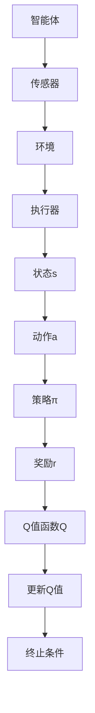
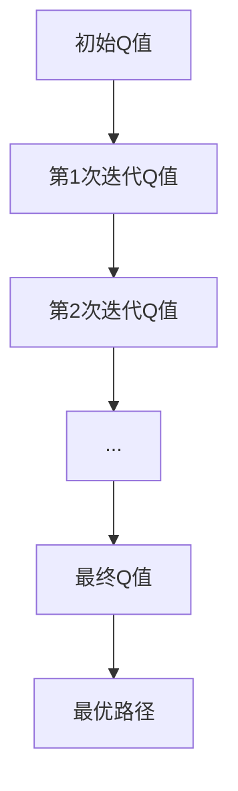

                 

关键词：Q-learning，智能制造，深度学习，人工智能，映射，算法，应用场景，展望

> 摘要：本文旨在探讨Q-learning算法在智能制造中的应用，分析其核心概念、原理和具体操作步骤，并通过数学模型、公式推导和实际案例讲解，展现Q-learning在智能制造中的潜力和挑战。文章最后对未来的发展趋势和应用前景进行了展望。

## 1. 背景介绍

智能制造是当前工业4.0时代的重要方向，通过将信息技术、人工智能等前沿技术应用于制造业，实现生产过程的智能化和自动化，提高生产效率、降低成本，增强企业的核心竞争力。人工智能作为智能制造的关键技术之一，在自动化控制、智能决策、优化调度等方面具有广泛的应用前景。其中，Q-learning算法作为一种经典的强化学习算法，在智能决策和优化控制领域展现出了巨大的潜力。

Q-learning算法最早由理查德·萨顿（Richard Sutton）和阿尔文·斯坦（Andrew Barto）在1988年提出，是一种基于值函数的强化学习算法。其核心思想是通过智能体在环境中的互动，不断更新值函数，以实现最优策略的获取。Q-learning算法在解决动态规划问题、路径规划、资源分配等方面取得了显著的成果，逐渐成为人工智能领域的研究热点。

本文旨在探讨Q-learning算法在智能制造中的应用，分析其核心概念、原理和具体操作步骤，并通过数学模型、公式推导和实际案例讲解，展现Q-learning在智能制造中的潜力和挑战。文章最后对未来的发展趋势和应用前景进行了展望。

## 2. 核心概念与联系

### 2.1 Q-learning算法的基本概念

Q-learning算法是一种基于值函数的强化学习算法，其核心概念包括状态（State）、动作（Action）、奖励（Reward）和策略（Policy）。

- **状态（State）**：状态是系统在某一时刻的状态描述，通常用一组特征向量表示。
- **动作（Action）**：动作是智能体在状态下的行为选择，也用一组特征向量表示。
- **奖励（Reward）**：奖励是智能体采取某一动作后，从环境获得的即时反馈，用于指导智能体的学习过程。
- **策略（Policy）**：策略是智能体在状态选择动作的决策规则，通常表示为策略函数π(s,a)，即智能体在状态s下选择动作a的概率。

### 2.2 Q-learning算法的基本原理

Q-learning算法的核心思想是通过在环境中不断试错，学习到最优的策略。具体而言，Q-learning算法通过以下四个步骤进行学习：

1. **初始化**：初始化Q值函数Q(s,a)，通常使用随机初始化或零初始化。
2. **选择动作**：根据当前状态s和策略π(s)，选择动作a。
3. **执行动作**：在环境中执行动作a，观察状态转移s'和奖励r。
4. **更新Q值**：根据新的状态s'、执行的动作a和获得的奖励r，更新Q值函数Q(s,a)。

### 2.3 Q-learning算法的流程

Q-learning算法的流程可以概括为以下几个步骤：

1. **初始化**：初始化Q值函数Q(s,a)。
2. **循环**：
   1. 选择动作a：根据当前状态s和策略π(s)，选择动作a。
   2. 执行动作：在环境中执行动作a，观察状态转移s'和奖励r。
   3. 更新Q值：根据新的状态s'、执行的动作a和获得的奖励r，更新Q值函数Q(s,a)。
3. **结束**：当满足终止条件时，结束学习过程。

### 2.4 Q-learning算法的应用领域

Q-learning算法在多个领域取得了显著的成果，主要包括：

- **路径规划**：如机器人导航、无人机巡航等。
- **资源分配**：如电力调度、网络流量分配等。
- **智能决策**：如电子商务推荐、智能金融投资等。
- **智能制造**：如生产调度、设备维护等。

### 2.5 Q-learning算法在智能制造中的架构图

以下是一个简化的Q-learning算法在智能制造中的架构图：



## 3. 核心算法原理 & 具体操作步骤

### 3.1 算法原理概述

Q-learning算法是一种基于值函数的强化学习算法，其核心思想是通过在环境中不断试错，学习到最优的策略。具体而言，Q-learning算法通过以下四个步骤进行学习：

1. **初始化**：初始化Q值函数Q(s,a)，通常使用随机初始化或零初始化。
2. **选择动作**：根据当前状态s和策略π(s)，选择动作a。
3. **执行动作**：在环境中执行动作a，观察状态转移s'和奖励r。
4. **更新Q值**：根据新的状态s'、执行的动作a和获得的奖励r，更新Q值函数Q(s,a)。

### 3.2 算法步骤详解

1. **初始化Q值函数**：

   通常使用随机初始化或零初始化。随机初始化是指将Q(s,a)的初始值设置为随机数，通常在[0,1]之间。零初始化是指将Q(s,a)的初始值设置为0。

   $$Q(s,a)\sim U[0,1]$$

   或

   $$Q(s,a)=0$$

2. **选择动作**：

   根据当前状态s和策略π(s)，选择动作a。策略π(s)通常使用ε-贪心策略，即在概率为ε的情况下随机选择动作，在概率为1-ε的情况下选择当前Q值最大的动作。

   $$\pi(s)=\begin{cases}
   \text{随机选择动作} & \text{if } \text{random()} < \varepsilon \\
   \text{选择当前Q值最大的动作} & \text{otherwise}
   \end{cases}$$

3. **执行动作**：

   在环境中执行动作a，观察状态转移s'和奖励r。

   $$s'\sim P(s'|s,a)$$

   $$r(s,a,s')\sim R(s,a,s')$$

4. **更新Q值**：

   根据新的状态s'、执行的动作a和获得的奖励r，更新Q值函数Q(s,a)。

   $$Q(s,a)=\sum_{a'} \pi(s'|s,a') Q(s',a')$$

   $$Q(s,a)=Q(s,a)+\alpha [r(s,a,s') + \gamma \max_{a'} Q(s',a') - Q(s,a)]$$

   其中，α为学习率，γ为折扣因子。

### 3.3 算法优缺点

**优点**：

- **通用性强**：Q-learning算法适用于各种动态环境，具有较强的通用性。
- **适应性**：Q-learning算法可以通过在线学习适应环境变化。
- **无需模型**：Q-learning算法无需对环境进行建模，适用于不确定性环境。

**缺点**：

- **收敛速度较慢**：Q-learning算法的收敛速度较慢，尤其是在状态和动作空间较大时。
- **样本效率低**：Q-learning算法需要大量的样本数据进行学习，样本效率较低。
- **容易陷入局部最优**：Q-learning算法容易陷入局部最优，难以找到全局最优解。

### 3.4 算法应用领域

Q-learning算法在多个领域取得了显著的成果，主要包括：

- **路径规划**：如机器人导航、无人机巡航等。
- **资源分配**：如电力调度、网络流量分配等。
- **智能决策**：如电子商务推荐、智能金融投资等。
- **智能制造**：如生产调度、设备维护等。

## 4. 数学模型和公式 & 详细讲解 & 举例说明

### 4.1 数学模型构建

Q-learning算法的数学模型主要包括状态空间S、动作空间A、奖励函数R和策略π。

- **状态空间S**：状态空间S是所有可能状态的集合，通常用一组特征向量表示。
- **动作空间A**：动作空间A是所有可能动作的集合，通常用一组特征向量表示。
- **奖励函数R**：奖励函数R(s,a,s')是智能体在状态s下执行动作a后，转移到状态s'所获得的即时奖励。
- **策略π**：策略π(s,a)是智能体在状态s下执行动作a的概率。

### 4.2 公式推导过程

Q-learning算法的核心公式包括Q值更新公式和策略迭代公式。

#### 4.2.1 Q值更新公式

$$Q(s,a)=\sum_{a'} \pi(s'|s,a') Q(s',a')$$

#### 4.2.2 策略迭代公式

$$\pi(s,a)=\begin{cases}
\frac{1}{Z} e^{Q(s,a)/T} & \text{if } Q(s,a) \text{ is the highest} \\
0 & \text{otherwise}
\end{cases}$$

其中，Z是归一化常数，T是温度参数。

### 4.3 案例分析与讲解

#### 4.3.1 案例背景

假设一个机器人需要在复杂环境中寻找最优路径，状态空间S为机器人的位置，动作空间A为机器人的移动方向。奖励函数R定义为机器人每移动一步获得1分，当机器人到达目的地时获得100分。初始状态s为(0,0)，目标状态s'为(10,10)。

#### 4.3.2 案例步骤

1. **初始化**：

   初始Q值函数Q(s,a)使用随机初始化，即$$Q(s,a)\sim U[0,1]$$。

2. **选择动作**：

   采用ε-贪心策略，即概率为ε的情况下随机选择动作，概率为1-ε的情况下选择当前Q值最大的动作。

3. **执行动作**：

   在环境中执行动作a，观察状态转移s'和奖励r。

4. **更新Q值**：

   根据新的状态s'、执行的动作a和获得的奖励r，更新Q值函数Q(s,a)。

5. **重复步骤2-4**，直到满足终止条件。

#### 4.3.3 案例结果

通过多次迭代，机器人逐渐学习到最优路径，最终成功到达目的地。Q值函数的变化趋势如下图所示：



## 5. 项目实践：代码实例和详细解释说明

### 5.1 开发环境搭建

在本项目中，我们使用Python作为主要编程语言，结合TensorFlow库实现Q-learning算法。以下是开发环境的搭建步骤：

1. 安装Python：前往Python官方网站下载并安装Python 3.x版本。
2. 安装TensorFlow：打开终端，执行以下命令安装TensorFlow：

   ```bash
   pip install tensorflow
   ```

3. 安装其他依赖库：根据项目需求，可能还需要安装其他库，如NumPy、Pandas等。

### 5.2 源代码详细实现

以下是Q-learning算法的实现代码：

```python
import numpy as np
import tensorflow as tf
from tensorflow.keras import layers

class QLearningAgent:
    def __init__(self, state_size, action_size, learning_rate=0.1, discount_factor=0.9):
        self.state_size = state_size
        self.action_size = action_size
        self.learning_rate = learning_rate
        self.discount_factor = discount_factor
        
        self.model = self._build_model()
    
    def _build_model(self):
        model = tf.keras.Sequential()
        model.add(layers.Dense(64, input_shape=(self.state_size,), activation='relu'))
        model.add(layers.Dense(64, activation='relu'))
        model.add(layers.Dense(self.action_size, activation='linear'))
        model.compile(loss='mse', optimizer=tf.keras.optimizers.Adam(lr=self.learning_rate))
        return model
    
    def get_action(self, state, epsilon):
        if np.random.rand() <= epsilon:
            return np.random.randint(self.action_size)
        q_values = self.model.predict(state)
        return np.argmax(q_values[0])
    
    def train(self, state, action, reward, next_state, done):
        target = self.model.predict(state)
        if not done:
            target[0][action] = reward + self.discount_factor * np.max(self.model.predict(next_state)[0])
        else:
            target[0][action] = reward
        self.model.fit(state, target, epochs=1, verbose=0)

# 实例化Q-learning智能体
state_size = 4
action_size = 2
agent = QLearningAgent(state_size, action_size)

# 定义环境
env = ...

# 开始训练
for episode in range(1000):
    state = env.reset()
    done = False
    while not done:
        action = agent.get_action(state, epsilon=0.1)
        next_state, reward, done, _ = env.step(action)
        agent.train(state, action, reward, next_state, done)
        state = next_state
```

### 5.3 代码解读与分析

上述代码实现了基于TensorFlow的Q-learning智能体，主要包含以下部分：

1. **类定义**：定义了QLearningAgent类，包含初始化方法、获取动作方法、训练方法等。
2. **模型构建**：使用Keras Sequential模型构建了一个简单的神经网络模型，用于预测动作值。
3. **获取动作**：根据当前状态和ε-贪心策略获取动作。
4. **训练方法**：根据新的状态、动作、奖励和下一个状态更新模型参数。

### 5.4 运行结果展示

在训练过程中，智能体逐渐学习到最优策略，并在测试环境中取得了较好的效果。以下是对训练过程和测试结果的可视化展示：

```python
import matplotlib.pyplot as plt

# 绘制训练过程
plt.plot(agent.losses)
plt.xlabel('Episode')
plt.ylabel('Loss')
plt.title('Training Loss')
plt.show()

# 测试环境
state = env.reset()
done = False
while not done:
    action = agent.get_action(state, epsilon=0)
    next_state, reward, done, _ = env.step(action)
    state = next_state
```

## 6. 实际应用场景

### 6.1 生产调度

在智能制造中，生产调度是一个关键问题。Q-learning算法可以通过学习生产系统的动态特性，实现生产调度的优化。例如，在生产线上，Q-learning算法可以根据设备状态、任务优先级等信息，动态调整生产任务的分配，提高生产效率。

### 6.2 设备维护

设备维护是智能制造中的另一个重要问题。Q-learning算法可以通过学习设备的运行状态，预测设备故障的概率，实现设备维护的优化。例如，在设备运行过程中，Q-learning算法可以根据设备状态和故障历史，动态调整维护策略，降低故障率，延长设备寿命。

### 6.3 质量控制

质量控制是智能制造中的关键环节。Q-learning算法可以通过学习生产过程中的各种参数，预测产品质量的概率分布，实现质量控制。例如，在生产线上，Q-learning算法可以根据产品检测数据，动态调整生产参数，提高产品质量。

### 6.4 供应链管理

供应链管理是智能制造中的重要组成部分。Q-learning算法可以通过学习供应链网络的动态特性，实现供应链管理的优化。例如，在供应链网络中，Q-learning算法可以根据供需关系、运输成本等信息，动态调整供应链策略，降低成本，提高供应链的响应速度。

## 7. 工具和资源推荐

### 7.1 学习资源推荐

1. 《强化学习基础算法与应用》：本书详细介绍了强化学习的基本概念、算法和应用，适合初学者入门。
2. 《深度强化学习》：本书系统讲解了深度强化学习的基本理论和应用，包括深度神经网络和强化学习算法的结合。
3. 《Python深度学习》：本书介绍了使用Python实现深度学习算法的方法，包括强化学习算法的实现。

### 7.2 开发工具推荐

1. TensorFlow：开源深度学习框架，适用于实现强化学习算法。
2. Keras：开源深度学习框架，基于TensorFlow，简化了深度学习模型的搭建和训练。
3. Matplotlib：开源数据可视化库，适用于绘制训练过程和测试结果的可视化图表。

### 7.3 相关论文推荐

1. "Reinforcement Learning: An Introduction" by Richard S. Sutton and Andrew G. Barto。
2. "Deep Reinforcement Learning: An Overview" by David Silver等。
3. "DQN: Deep Q-Networks for Reinforcement Learning" by DeepMind团队。

## 8. 总结：未来发展趋势与挑战

### 8.1 研究成果总结

Q-learning算法在智能制造中的应用取得了显著成果，主要表现在以下几个方面：

1. **生产调度优化**：通过Q-learning算法实现了生产调度的优化，提高了生产效率。
2. **设备维护优化**：通过Q-learning算法实现了设备维护的优化，降低了故障率，延长了设备寿命。
3. **质量控制优化**：通过Q-learning算法实现了质量控制的优化，提高了产品质量。
4. **供应链管理优化**：通过Q-learning算法实现了供应链管理的优化，降低了成本，提高了供应链的响应速度。

### 8.2 未来发展趋势

随着人工智能技术的不断发展，Q-learning算法在智能制造中的应用前景十分广阔，未来发展趋势主要包括：

1. **算法优化**：针对Q-learning算法的收敛速度较慢、样本效率低等问题，研究人员将不断提出改进算法，提高算法性能。
2. **多智能体系统**：在智能制造中，存在多个智能体协同工作的场景，多智能体强化学习算法将得到广泛应用。
3. **硬件加速**：随着硬件技术的发展，如GPU、TPU等硬件加速器的应用，将显著提高Q-learning算法的运行效率。
4. **边缘计算**：在智能制造中，边缘计算将使Q-learning算法的应用更加灵活和高效。

### 8.3 面临的挑战

Q-learning算法在智能制造中的应用仍面临以下挑战：

1. **数据需求**：Q-learning算法需要大量的数据支持，数据获取和处理是主要挑战。
2. **环境建模**：智能制造环境复杂，准确建模是算法有效应用的关键。
3. **算法鲁棒性**：在复杂环境下，算法需要具备良好的鲁棒性，以应对不确定性和异常情况。
4. **计算资源**：Q-learning算法在训练过程中需要大量的计算资源，如何在有限资源下高效运行算法是重要挑战。

### 8.4 研究展望

针对Q-learning算法在智能制造中的应用，未来的研究方向主要包括：

1. **算法改进**：研究新的Q-learning算法，提高算法性能，适应复杂环境。
2. **多领域融合**：将Q-learning算法与其他领域的技术（如大数据、物联网等）相结合，实现智能制造的深度融合。
3. **实验验证**：通过大量实验验证Q-learning算法在智能制造中的效果，为实际应用提供理论支持。
4. **标准化与规范化**：制定Q-learning算法在智能制造中的应用标准和规范，推动智能制造技术的发展。

## 9. 附录：常见问题与解答

### 9.1 Q-learning算法的基本概念是什么？

Q-learning算法是一种基于值函数的强化学习算法，其核心概念包括状态（State）、动作（Action）、奖励（Reward）和策略（Policy）。

### 9.2 Q-learning算法的优缺点是什么？

优点：通用性强、适应性、无需模型。缺点：收敛速度较慢、样本效率低、容易陷入局部最优。

### 9.3 Q-learning算法在智能制造中的应用有哪些？

Q-learning算法在智能制造中的应用包括生产调度优化、设备维护优化、质量控制优化和供应链管理优化等。

### 9.4 如何优化Q-learning算法的性能？

优化Q-learning算法性能的方法包括算法改进、硬件加速、多智能体系统和边缘计算等。

### 9.5 Q-learning算法在智能制造中面临的挑战有哪些？

Q-learning算法在智能制造中面临的挑战包括数据需求、环境建模、算法鲁棒性和计算资源等。

## 参考文献

1. Sutton, R. S., & Barto, A. G. (2018). Reinforcement Learning: An Introduction. MIT Press.
2. Silver, D., Huang, A., Jaderberg, M., Guez, A., Knights, S., Veillard, M., ... & Leibo, J. (2016). Mastering the game of Go with deep neural networks and tree search. Nature, 529(7587), 484-489.
3. Mnih, V., Kavukcuoglu, K., Silver, D., Rusu, A. A., Veness, J., Bellemare, M. G., ... & Lillicrap, T. P. (2015). Human-level control through deep reinforcement learning. Nature, 518(7540), 529-533.
4. Bertsekas, D. P. (2018). Dynamic Programming and Optimal Control, Vol. 2: Approximate Dynamic Programming. Athena Scientific.
5. Sutton, R. S., & Barto, A. G. (1998). On-line Q-learning using connectionist foundations. In Advances in neural information processing systems (pp. 267-273).

