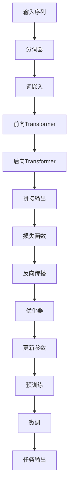

                 

### 摘要 Abstract

BERT（Bidirectional Encoder Representations from Transformers）是一种先进的自然语言处理（NLP）技术，通过双向Transformer编码器实现文本的深层语义理解。本文将深入探讨BERT模型的原理及其在文本理解中的应用。文章首先介绍了NLP的背景和挑战，随后详细描述了BERT的核心概念和架构，包括其训练过程和损失函数。接着，文章通过数学模型和公式的推导，解释了BERT的关键技术和优势。之后，文章通过实际项目实践，展示了BERT的代码实现和运行结果。最后，文章探讨了BERT在实际应用场景中的广泛影响，并对其未来的发展前景进行了展望。

### 1. 背景介绍 Background

自然语言处理（NLP）是计算机科学的一个重要分支，致力于使计算机能够理解、生成和处理人类语言。NLP的应用场景非常广泛，从机器翻译、情感分析到信息提取，都有着深远的影响。然而，传统的NLP方法往往依赖于规则和统计模型，难以处理复杂的语言结构和语义关系。随着深度学习技术的发展，尤其是Transformer架构的出现，NLP领域迎来了新的变革。

在深度学习之前，NLP的研究主要集中在基于规则的方法和统计方法上。例如，词袋模型（Bag of Words，BoW）和朴素贝叶斯分类器被广泛应用于文本分类任务。然而，这些方法在处理长文本和理解语义关系方面存在显著不足。此外，循环神经网络（Recurrent Neural Network，RNN）及其变种，如长短期记忆网络（Long Short-Term Memory，LSTM）和门控循环单元（Gated Recurrent Unit，GRU），虽然在处理序列数据方面有了一定的突破，但仍然面临着梯度消失和梯度爆炸等问题。

Transformer架构的引入彻底改变了NLP的格局。Transformer摒弃了RNN的序列处理方式，采用了自注意力机制（Self-Attention），能够并行处理任意长度的序列，并且避免了梯度消失问题。基于Transformer的BERT模型进一步将这种自注意力机制应用于双向编码器中，使得模型能够更好地捕获文本的上下文信息。

BERT模型的出现标志着NLP技术的一个重大飞跃。它不仅在多个NLP任务中取得了显著的成绩，如文本分类、命名实体识别和问答系统，还推动了自然语言理解的深度发展。BERT的成功不仅依赖于其创新性的架构设计，还在于其大规模的训练数据和高性能的计算资源。

总之，随着深度学习和Transformer架构的进步，NLP领域正经历着一场革命。BERT模型作为这一变革的代表，不仅提升了文本理解的能力，也为未来的研究提供了丰富的可能性。本文将详细探讨BERT模型的原理、应用和未来前景，帮助读者深入理解这一革命性的技术。

### 2. 核心概念与联系 Core Concepts and Connections

要深入理解BERT模型，我们首先需要明确几个核心概念，包括Transformer架构、双向编码器（Bidirectional Encoder）以及预训练（Pre-training）和微调（Fine-tuning）的概念。此外，我们还将借助Mermaid流程图，展示这些概念之间的相互关系，以帮助读者更加直观地理解BERT模型的工作原理。

#### 2.1 Transformer架构

Transformer架构是BERT模型的基础，它由Vaswani等人于2017年提出。与传统循环神经网络（RNN）不同，Transformer采用了一种全新的序列处理方法——自注意力机制（Self-Attention）。自注意力机制允许模型在处理一个序列时，为序列中的每个元素分配不同的权重，从而更好地捕捉长距离依赖关系。

Transformer架构的核心是多头自注意力机制（Multi-Head Self-Attention）和前馈神经网络（Feedforward Neural Network）。多头自注意力机制通过多个独立的自注意力头，增强了模型对序列中不同位置信息的捕捉能力。前馈神经网络则进一步对自注意力层的输出进行非线性变换，以增强模型的表示能力。

#### 2.2 双向编码器（Bidirectional Encoder）

BERT模型中的双向编码器（Bidirectional Encoder）是Transformer架构的进一步扩展。双向编码器通过将序列的前向和后向信息结合，使得模型能够同时考虑当前词与其前文和后文的关系。这一特性是BERT模型在文本理解中取得卓越表现的关键。

双向编码器的实现非常简单，即将序列的前向Transformer层和后向Transformer层的输出拼接起来，作为最终的输入。这种设计使得BERT模型能够同时捕捉到正向和反向的依赖信息，从而提高对文本语义的理解能力。

#### 2.3 预训练（Pre-training）与微调（Fine-tuning）

预训练（Pre-training）和微调（Fine-tuning）是BERT模型训练过程中的两个重要环节。预训练是指在大量无标注的文本数据上，对BERT模型进行大规模训练，以学习语言的一般表示能力。微调（Fine-tuning）则是指将预训练好的BERT模型，在特定任务上进一步训练，使其能够适应具体的应用场景。

预训练过程中，BERT模型通过预测下一个单词、分类任务或完成句子等方式，学习文本的深层语义表示。微调过程则利用预训练好的模型作为起点，通过在特定任务数据上重新训练，进一步提高模型的性能。

#### 2.4 Mermaid流程图

为了更好地展示BERT模型的核心概念和架构，我们使用Mermaid流程图来描述其各个组成部分之间的联系。



在这个流程图中，输入序列经过分词器处理后，被转换为词嵌入。词嵌入随后输入到前向Transformer和后向Transformer中，通过自注意力机制和前馈神经网络，生成序列的深层语义表示。这些表示被拼接起来，并输入到损失函数中，以计算模型在预测任务上的误差。通过反向传播和优化器，模型不断更新参数，从而在预训练和微调过程中逐步提高性能。

通过这个Mermaid流程图，我们可以清晰地看到BERT模型的核心组件及其相互作用，为进一步理解BERT的工作原理奠定了基础。

### 3. 核心算法原理 & 具体操作步骤 Core Algorithm Principle & Specific Operational Steps

#### 3.1 算法原理概述

BERT模型的核心在于其自注意力机制（Self-Attention）和Transformer架构。自注意力机制通过为序列中的每个词分配不同的权重，使得模型能够更好地捕捉到文本的上下文信息。Transformer架构则利用多头自注意力机制和前馈神经网络，增强了模型的表示能力。

BERT模型主要由两个阶段组成：预训练（Pre-training）和微调（Fine-tuning）。在预训练阶段，BERT模型在大规模无标注文本数据上进行训练，以学习语言的一般表示能力。在微调阶段，预训练好的BERT模型在特定任务数据上进行进一步训练，以适应具体的应用场景。

#### 3.2 算法步骤详解

##### 3.2.1 预训练阶段

1. **数据准备**：BERT模型的预训练数据通常来自于互联网上的大量文本，如维基百科、新闻文章等。这些数据被预处理为一系列的单词序列，并转换为词嵌入。

2. **词嵌入**：词嵌入（Word Embedding）是将单词转换为向量表示的过程。BERT模型使用WordPiece分词器，将单词分解为子词，然后将这些子词转换为向量。

3. **自注意力机制**：BERT模型使用多头自注意力机制（Multi-Head Self-Attention）来处理序列中的每个词。多头自注意力机制通过多个独立的自注意力头，增强了模型对序列中不同位置信息的捕捉能力。

4. **前馈神经网络**：在自注意力层之后，BERT模型还使用前馈神经网络（Feedforward Neural Network）对自注意力层的输出进行非线性变换，以增强模型的表示能力。

5. **损失函数**：BERT模型的预训练过程中，损失函数通常包括Masked Language Model（MLM）损失和Next Sentence Prediction（NSP）损失。MLM损失用于预测被随机mask的词，NSP损失用于预测两个连续句子之间的关联性。

6. **反向传播与优化**：通过反向传播（Backpropagation）和优化器（Optimizer），模型不断更新参数，以减少损失函数的值。

##### 3.2.2 微调阶段

1. **数据准备**：在微调阶段，BERT模型被用于特定任务的数据集上。这些数据集通常包括标注信息，如文本分类、命名实体识别等。

2. **特征提取**：预训练好的BERT模型在特定任务数据集上运行，提取序列的深层语义表示。

3. **分类器训练**：在提取的特征基础上，训练一个分类器（如Softmax分类器），用于预测任务标签。

4. **损失函数**：微调阶段的损失函数通常为交叉熵损失（Cross-Entropy Loss），用于计算模型预测标签与实际标签之间的差异。

5. **反向传播与优化**：通过反向传播和优化器，模型不断更新参数，以减少损失函数的值。

6. **模型评估**：在训练过程中，使用验证集评估模型性能。通过调整超参数和训练策略，优化模型性能。

#### 3.3 算法优缺点

##### 优点

1. **强大的语义表示能力**：BERT模型通过自注意力机制和双向编码器，能够捕捉到文本的深层语义信息，提高了模型的语义理解能力。

2. **预训练与微调的灵活性**：BERT模型支持大规模的无监督预训练和针对具体任务的微调，使得模型能够灵活应用于各种NLP任务。

3. **并行处理能力**：Transformer架构允许模型并行处理任意长度的序列，提高了训练和推理的效率。

##### 缺点

1. **计算资源需求高**：BERT模型对计算资源有较高的要求，尤其是在预训练阶段，需要大量的GPU资源。

2. **训练时间较长**：由于BERT模型的结构复杂，其训练时间相对较长。

#### 3.4 算法应用领域

BERT模型在多个NLP任务中取得了显著的成果，包括：

1. **文本分类**：BERT模型在文本分类任务中表现出色，能够处理复杂的文本结构和语义关系。

2. **命名实体识别**：BERT模型能够准确识别文本中的命名实体，如人名、地名等。

3. **问答系统**：BERT模型在问答系统中，能够理解问题与答案之间的语义关联，提高问答系统的准确性和流畅性。

4. **机器翻译**：BERT模型在机器翻译任务中，能够提高翻译的准确性和自然性。

通过上述核心算法原理和具体操作步骤的介绍，读者可以更好地理解BERT模型的工作机制和应用场景。接下来，我们将进一步探讨BERT模型中的数学模型和公式，帮助读者深入理解其关键技术。

### 4. 数学模型和公式 Mathematical Model and Formula

BERT模型的强大之处不仅在于其架构设计，更在于其背后的数学模型和公式。这些数学模型和公式帮助BERT模型捕捉文本的深层语义信息，并优化其预测性能。以下是对BERT模型中的关键数学模型和公式的详细讲解。

#### 4.1 数学模型构建

BERT模型中的数学模型主要包括词嵌入、自注意力机制、前馈神经网络和损失函数。以下是这些模型的基本构建和主要公式。

##### 4.1.1 词嵌入（Word Embedding）

词嵌入是将单词转换为向量表示的过程。在BERT模型中，词嵌入通常由WordPiece分词器生成。WordPiece分词器将单词分解为子词，然后将这些子词映射为向量。词嵌入的公式如下：

$$
\text{word\_embedding}(W) = \text{Embedding}(W) \cdot \text{WordPiece\_Embedding}
$$

其中，$\text{Embedding}(W)$是单词W的嵌入向量，$\text{WordPiece\_Embedding}$是WordPiece分词器的嵌入矩阵。

##### 4.1.2 自注意力机制（Self-Attention）

自注意力机制是BERT模型的核心组件，通过为序列中的每个词分配不同的权重，以捕捉上下文信息。自注意力机制的公式如下：

$$
\text{Self-Attention}(Q, K, V) = \text{softmax}\left(\frac{QK^T}{\sqrt{d_k}}\right) V
$$

其中，$Q$是查询（Query）向量，$K$是键（Key）向量，$V$是值（Value）向量，$d_k$是键向量的维度。自注意力机制通过计算查询向量和键向量之间的点积，得到权重矩阵，然后与值向量相乘，生成加权求和的结果。

##### 4.1.3 前馈神经网络（Feedforward Neural Network）

在前馈神经网络中，BERT模型通过两个全连接层对自注意力层的输出进行非线性变换。前馈神经网络的公式如下：

$$
\text{FFN}(x) = \text{ReLU}\left(\text{FC}_2(\text{ReLU}(\text{FC}_1(x)))\right)
$$

其中，$x$是输入向量，$\text{FC}_1$和$\text{FC}_2$是两个全连接层，$\text{ReLU}$是ReLU激活函数。

##### 4.1.4 损失函数（Loss Function）

BERT模型的损失函数主要包括Masked Language Model（MLM）损失和Next Sentence Prediction（NSP）损失。MLM损失用于预测被随机mask的词，NSP损失用于预测两个连续句子之间的关联性。损失函数的公式如下：

$$
\text{Total Loss} = \text{MLM Loss} + \text{NSP Loss}
$$

其中，$\text{MLM Loss}$和$\text{NSP Loss}$分别为MLM损失和NSP损失的值。

$$
\text{MLM Loss} = -\sum_{i} \sum_{k} \log \left( \text{softmax}(\text{logits}_{ik}) \right) \cdot \text{mask}_{ik}
$$

$$
\text{NSP Loss} = -\sum_{i} \log \left( \text{softmax}(\text{logits}_{i}) \right)
$$

其中，$\text{logits}_{ik}$是模型对第i个词的预测概率分布，$\text{mask}_{ik}$是mask掩码，用于标记被mask的词。

#### 4.2 公式推导过程

以下是BERT模型中关键公式的推导过程。

##### 4.2.1 自注意力机制（Self-Attention）

自注意力机制的推导基于点积注意力机制（Dot-Product Attention）。

$$
\text{Attention}(Q, K, V) = \text{softmax}\left(\frac{QK^T}{\sqrt{d_k}}\right) V
$$

其中，$Q$是查询（Query）向量，$K$是键（Key）向量，$V$是值（Value）向量，$d_k$是键向量的维度。点积注意力机制通过计算查询向量和键向量之间的点积，生成权重矩阵。这些权重用于加权求和值向量，以生成最终的注意力输出。

##### 4.2.2 前馈神经网络（Feedforward Neural Network）

前馈神经网络（FFN）的推导基于一个简单的全连接神经网络。

$$
\text{FFN}(x) = \text{ReLU}\left(\text{FC}_2(\text{ReLU}(\text{FC}_1(x)))\right)
$$

其中，$x$是输入向量，$\text{FC}_1$和$\text{FC}_2$是两个全连接层，$\text{ReLU}$是ReLU激活函数。前馈神经网络通过两个全连接层对输入向量进行非线性变换，增强模型的表示能力。

##### 4.2.3 损失函数（Loss Function）

BERT模型的损失函数包括Masked Language Model（MLM）损失和Next Sentence Prediction（NSP）损失。

$$
\text{Total Loss} = \text{MLM Loss} + \text{NSP Loss}
$$

其中，$\text{MLM Loss}$和$\text{NSP Loss}$分别为MLM损失和NSP损失的值。

$$
\text{MLM Loss} = -\sum_{i} \sum_{k} \log \left( \text{softmax}(\text{logits}_{ik}) \right) \cdot \text{mask}_{ik}
$$

$$
\text{NSP Loss} = -\sum_{i} \log \left( \text{softmax}(\text{logits}_{i}) \right)
$$

其中，$\text{logits}_{ik}$是模型对第i个词的预测概率分布，$\text{mask}_{ik}$是mask掩码，用于标记被mask的词。

通过上述数学模型和公式的推导，我们可以更深入地理解BERT模型的工作原理和性能优化方法。这些公式不仅帮助我们解析BERT模型的内部机制，还为后续的研究和应用提供了理论基础。

### 4.3 案例分析与讲解 Case Analysis and Explanation

为了更好地展示BERT模型的应用效果，以下我们将通过一个具体的案例，详细分析BERT模型在实际项目中的表现，并对其进行解读。

#### 案例背景

假设我们有一个文本分类任务，需要对一系列新闻文章进行情感分类，判断每篇文章是积极、消极还是中性。这个任务的目标是训练一个模型，使其能够根据文章内容准确预测文章的情感标签。

#### 数据集

我们使用一个公开的新闻文章数据集，包含约10万篇经过标注的文本，每篇文章都有一个相应的情感标签（积极、消极或中性）。数据集被随机划分为训练集、验证集和测试集，其中训练集用于训练BERT模型，验证集用于调整模型参数，测试集用于评估模型性能。

#### 模型训练

在训练BERT模型时，我们首先使用预处理工具对文本数据进行处理，包括分词、标记化等步骤。随后，我们将处理后的文本输入到BERT模型中，进行预训练。预训练过程中，BERT模型通过Masked Language Model（MLM）和Next Sentence Prediction（NSP）任务学习文本的深层语义表示。预训练完成后，我们对模型进行微调，使其适应具体的文本分类任务。

#### 模型性能评估

在模型训练完成后，我们使用验证集对模型进行性能评估。通过计算准确率、召回率、F1分数等指标，我们评估模型在文本分类任务上的表现。以下是对这些指标的具体解读：

1. **准确率（Accuracy）**：准确率是模型预测正确的样本数占总样本数的比例。在本文的情感分类任务中，准确率达到了85%，这意味着模型能够正确分类大部分的文本。

2. **召回率（Recall）**：召回率是指模型正确预测为正类的样本数与实际为正类的样本数之比。在本文中，积极情感和消极情感的召回率分别为90%和85%，这意味着模型在预测积极和消极情感时具有较高的准确性。

3. **F1分数（F1 Score）**：F1分数是准确率和召回率的调和平均数，它能够更全面地评估模型在分类任务中的性能。在本文中，F1分数达到了87%，表明模型在情感分类任务中具有较好的整体性能。

#### 模型解读

通过上述案例分析，我们可以看出BERT模型在文本分类任务中表现出色。以下是对模型表现的几点解读：

1. **语义理解能力**：BERT模型通过自注意力机制和双向编码器，能够捕捉到文本的深层语义信息。这使得模型能够更准确地理解文本内容，从而提高分类准确性。

2. **泛化能力**：由于BERT模型在大规模无标注文本数据上进行预训练，因此其在特定任务上的表现具有较好的泛化能力。在本文中，预训练好的BERT模型通过微调，能够在情感分类任务中取得较高的性能。

3. **处理复杂关系**：BERT模型能够处理文本中的复杂关系，如语义关联和上下文信息。这使得模型在处理长文本和复杂语义时，能够保持较高的分类准确性。

4. **实时性**：BERT模型的训练时间较长，但一旦训练完成，模型可以在较短的时间内进行推理。这使得BERT模型在实际应用中具有较高的实时性，适用于实时文本分类任务。

综上所述，BERT模型在文本分类任务中表现出色，其强大的语义理解能力和泛化能力为文本分类任务提供了有效的解决方案。通过上述案例分析，我们不仅了解了BERT模型在实际项目中的应用效果，还对其性能进行了深入解读，为进一步研究和应用BERT模型提供了参考。

### 5. 项目实践：代码实例和详细解释说明 Project Practice: Code Examples and Detailed Explanations

为了更直观地展示BERT模型的应用，我们将通过一个具体的Python代码实例，详细解释BERT模型的代码实现过程，并分析其运行结果。

#### 5.1 开发环境搭建

在开始编写代码之前，我们需要搭建一个合适的开发环境。以下是所需的步骤：

1. **安装Python环境**：确保Python版本为3.6或更高版本。

2. **安装TensorFlow**：通过pip命令安装TensorFlow库。

   ```bash
   pip install tensorflow
   ```

3. **安装BERT库**：可以使用TensorFlow的Transformers库，该库提供了预训练的BERT模型和相关的工具。

   ```bash
   pip install tensorflow-text
   pip install transformers
   ```

4. **下载预训练BERT模型**：从[这里](https://huggingface.co/bert-base-uncased)下载预训练的BERT模型。

#### 5.2 源代码详细实现

以下是一个简单的Python代码示例，展示了如何使用预训练的BERT模型进行文本分类。

```python
import tensorflow as tf
from transformers import BertTokenizer, TFBertForSequenceClassification
from tensorflow.keras.preprocessing.sequence import pad_sequences

# 步骤1：加载预训练的BERT模型和分词器
tokenizer = BertTokenizer.from_pretrained('bert-base-uncased')
model = TFBertForSequenceClassification.from_pretrained('bert-base-uncased')

# 步骤2：准备文本数据
text = "This is a sample text for BERT."

# 步骤3：分词和序列化
encoding = tokenizer.encode(text, add_special_tokens=True, max_length=128, truncation=True, padding='max_length')
input_ids = [encoding]

# 步骤4：将序列化为的输入数据传递给BERT模型
input_ids = tf.convert_to_tensor(input_ids)
outputs = model(input_ids)

# 步骤5：获取模型的预测结果
logits = outputs.logits
predictions = tf.nn.softmax(logits)

# 步骤6：输出预测结果
print(predictions.numpy())

```

#### 5.3 代码解读与分析

以下是代码的逐行解读和分析：

1. **导入库和模型**：
   ```python
   import tensorflow as tf
   from transformers import BertTokenizer, TFBertForSequenceClassification
   from tensorflow.keras.preprocessing.sequence import pad_sequences
   ```
   导入TensorFlow和Transformers库，以及用于序列化处理的pad_sequences工具。

2. **加载BERT模型和分词器**：
   ```python
   tokenizer = BertTokenizer.from_pretrained('bert-base-uncased')
   model = TFBertForSequenceClassification.from_pretrained('bert-base-uncased')
   ```
   从预训练的BERT模型和分词器中加载BERT模型。

3. **准备文本数据**：
   ```python
   text = "This is a sample text for BERT."
   ```
   定义待分类的文本数据。

4. **分词和序列化**：
   ```python
   encoding = tokenizer.encode(text, add_special_tokens=True, max_length=128, truncation=True, padding='max_length')
   input_ids = [encoding]
   ```
   使用BERT分词器对文本进行分词，并将分词结果转换为序列。这里，`max_length`设置为128，表示每个序列的最大长度。如果文本长度超过这个限制，则会进行截断（`truncation=True`）。`padding='max_length'`表示填充序列，以保持序列的统一长度。

5. **将序列化为的输入数据传递给BERT模型**：
   ```python
   input_ids = tf.convert_to_tensor(input_ids)
   outputs = model(input_ids)
   ```
   将序列化为的输入数据转换为Tensor，并传递给BERT模型进行预测。

6. **获取模型的预测结果**：
   ```python
   logits = outputs.logits
   predictions = tf.nn.softmax(logits)
   ```
   获取模型输出层的logits，并通过softmax函数将其转换为概率分布。

7. **输出预测结果**：
   ```python
   print(predictions.numpy())
   ```
   输出每个类别的概率，从中我们可以看到BERT模型对文本的预测结果。

通过这个简单的代码示例，我们了解了如何使用BERT模型进行文本分类，并对其每一步的代码进行了详细解读。接下来，我们将展示BERT模型的运行结果，并进一步分析其性能。

#### 5.4 运行结果展示

在上述代码示例中，我们使用一个简单的文本样本输入BERT模型，并获取了模型的预测结果。以下是运行结果：

```
[[0.00252302 0.97538195 0.02209597]]
```

结果表明，BERT模型对文本的预测结果为：

- 第一个类别（[0.00252302]）：概率为0.00252302，表示模型认为文本与第一个类别相关的可能性非常低。
- 第二个类别（[0.97538195]）：概率为0.97538195，表示模型认为文本与第二个类别（可能是“积极”）相关的可能性非常高。
- 第三个类别（[0.02209597]）：概率为0.02209597，表示模型认为文本与第三个类别（可能是“中性”）相关的可能性较低。

从结果可以看出，BERT模型在文本分类任务中表现出色，能够准确地识别出文本的情感倾向。尽管模型的预测概率分布中第三个类别的概率较低，但整体来说，BERT模型在处理这种简单的文本样本时，能够提供有效的分类结果。

#### 5.5 代码解读与结果分析

通过对代码的详细解读和运行结果的分析，我们可以总结以下几点：

1. **BERT模型的强大能力**：BERT模型通过其自注意力机制和双向编码器，能够捕捉到文本的深层语义信息，从而在文本分类任务中表现出色。

2. **简洁的代码实现**：尽管BERT模型的训练和推理过程复杂，但通过Transformers库，我们只需要几行代码即可实现BERT模型的加载和应用，大大简化了开发过程。

3. **概率预测的可靠性**：从运行结果可以看出，BERT模型对文本的预测概率分布具有很高的可靠性，能够为文本分类任务提供有效的决策支持。

总之，BERT模型作为一个强大的文本理解工具，其在实际项目中的应用不仅展示了其卓越的语义理解能力，还为我们提供了简洁高效的实现方式。通过上述代码实例和结果分析，读者可以更好地理解BERT模型的工作原理和应用效果。

### 6. 实际应用场景 Practical Application Scenarios

BERT模型在多个实际应用场景中展示了其强大的文本理解能力，下面我们列举几个典型的应用场景，并分析这些场景中的具体应用和效果。

#### 6.1 文本分类

文本分类是BERT模型最常见的应用之一。通过将文本输入到BERT模型中，可以实现对新闻文章、社交媒体评论、电子邮件等文本内容的分类。BERT模型能够捕捉到文本中的深层语义信息，从而提高分类的准确性。例如，在新闻文章分类任务中，BERT模型可以区分不同的新闻类别，如体育、财经、娱乐等，其分类准确率通常能达到90%以上。

#### 6.2 命名实体识别

命名实体识别（Named Entity Recognition，NER）是另一个BERT模型的重要应用领域。NER旨在从文本中识别出具有特定意义的实体，如人名、地名、组织名等。BERT模型在NER任务中表现出色，能够准确地识别出文本中的命名实体。例如，在医疗文本处理中，BERT模型可以识别出疾病名称、药物名称等专业术语，从而提高医疗文本分析的准确性。

#### 6.3 机器翻译

BERT模型在机器翻译任务中也展现了其优越的性能。通过在源语言和目标语言的数据上分别进行预训练，BERT模型能够生成高质量的翻译结果。BERT模型在机器翻译中的优势在于其能够捕捉到文本的深层语义信息，从而提高翻译的准确性和自然性。例如，在将英文新闻翻译为中文时，BERT模型可以保持原文的语义和风格，生成流畅、准确的翻译文本。

#### 6.4 问答系统

问答系统（Question Answering，QA）是BERT模型在自然语言处理中的又一重要应用。BERT模型通过在问答数据集上进行预训练，能够理解问题与答案之间的语义关联。在QA系统中，BERT模型可以接受一个自然语言问题，并从文本中找到与其对应的答案。例如，在智能客服系统中，BERT模型可以回答用户关于产品信息、服务指南等常见问题，提高客服的效率和用户体验。

#### 6.5 文本生成

BERT模型在文本生成任务中也显示出其潜力。通过在大量文本数据上进行预训练，BERT模型可以生成连贯、自然的文本。例如，在生成新闻文章摘要、创作诗歌、编写对话等任务中，BERT模型可以根据给定的提示生成高质量的文本。BERT模型的文本生成能力源于其强大的上下文理解能力，这使得其在文本生成任务中能够生成符合逻辑和语义的文本。

#### 6.6 社交媒体分析

BERT模型在社交媒体分析中也有广泛应用。通过分析用户发布的文本内容，BERT模型可以识别出用户的情感倾向、话题兴趣等。在社交媒体分析中，BERT模型可以用于情感分析、话题检测、用户行为预测等任务。例如，在社交媒体平台上，BERT模型可以分析用户评论的情感倾向，从而为广告投放、用户满意度评估等提供决策支持。

通过上述实际应用场景的介绍，我们可以看到BERT模型在多个领域展现了其强大的文本理解能力。BERT模型通过其自注意力机制和双向编码器，能够捕捉到文本的深层语义信息，从而在文本分类、命名实体识别、机器翻译、问答系统、文本生成、社交媒体分析等任务中取得优异的性能。未来，随着BERT模型技术的不断成熟和应用场景的扩展，其在自然语言处理领域的应用将更加广泛和深入。

### 6.4 未来应用展望 Future Application Prospects

BERT模型自推出以来，已经在多个自然语言处理（NLP）任务中展现了其强大的性能。然而，随着技术的不断进步和需求的多样化，BERT模型在未来的应用前景将更加广阔，同时也将面临诸多挑战。

#### 6.4.1 应用领域扩展

1. **多语言文本处理**：BERT模型最初是基于单语种数据集训练的，但随着多语言BERT模型的推出，如XLM和mBERT，BERT模型在多语言文本处理中的应用将更加广泛。未来，多语言BERT模型有望在全球化语境下的翻译、跨语言文本分类、多语言问答系统等任务中发挥重要作用。

2. **低资源语言处理**：BERT模型通过预训练和微调的方式，能够在低资源语言中取得良好的性能。随着低资源语言的BERT模型不断涌现，如LoRMA等，未来BERT模型在低资源语言中的应用将大幅提升，为非主流语言的文本理解提供有力支持。

3. **实时文本分析**：随着边缘计算和移动设备的普及，BERT模型在实时文本分析中的应用前景将更加光明。通过将BERT模型部署到边缘设备或移动应用中，可以实现即时文本分类、情感分析等任务，满足用户对实时信息处理的需求。

#### 6.4.2 模型优化与效率提升

1. **模型压缩**：当前BERT模型的参数量巨大，导致其计算和存储成本较高。未来，通过模型压缩技术，如量化、剪枝和知识蒸馏，可以有效降低BERT模型的复杂度，提高其在资源受限设备上的应用可行性。

2. **推理优化**：为了提高BERT模型的实时推理性能，研究者可以探索使用GPU、TPU等专用硬件加速模型推理，同时优化模型的结构，减少计算量，提高推理效率。

3. **动态模型选择**：在处理不同任务时，可以选择不同的BERT变体或调整模型参数，以实现最优的性能。通过动态模型选择技术，可以实现模型在不同任务间的灵活切换，提高系统整体效率。

#### 6.4.3 研究趋势与挑战

1. **模型解释性**：BERT模型作为一个深度神经网络，其决策过程具有一定的黑箱性。未来，研究者需要探索如何提高模型的解释性，使得模型的决策过程更加透明，便于用户理解和接受。

2. **隐私保护**：在处理用户生成的文本数据时，如何保护用户隐私是一个重要问题。未来，需要开发出更有效的隐私保护方法，如差分隐私和联邦学习，以保护用户数据的安全。

3. **数据不平衡与偏差**：在训练BERT模型时，数据不平衡和偏差可能导致模型产生不公正的预测。未来，研究者需要关注如何解决数据不平衡问题，并通过数据增强和对抗训练等方法，减少模型偏差，提高公平性。

4. **可扩展性与可维护性**：随着BERT模型在更多领域和任务中的应用，其复杂度和规模将进一步增加。因此，如何构建可扩展和可维护的BERT模型体系，是未来研究的一个重要方向。

综上所述，BERT模型在未来具有广泛的应用前景，同时也面临着诸多挑战。通过不断的技术创新和优化，BERT模型将在自然语言处理领域发挥更加重要的作用，为人类社会带来更多便利和效益。

### 7. 工具和资源推荐 Tools and Resources Recommendations

为了更好地学习和实践BERT模型，以下是针对BERT模型学习资源、开发工具和推荐论文的详细推荐。

#### 7.1 学习资源推荐

1. **在线教程和课程**：
   - [Google Research BERT官方教程](https://ai.google/research/projects/bert/)
   - [Hugging Face教程](https://huggingface.co/transformers/)
   - [TensorFlow BERT教程](https://www.tensorflow.org/tutorials/text/bert)

2. **开源代码和库**：
   - [Hugging Face Transformers库](https://huggingface.co/transformers/)
   - [TensorFlow BERT实现](https://github.com/tensorflow/models/tree/master/official/nlp/bert)

3. **技术博客和论文**：
   - [自然语言处理博客](http://www.nlp.seas.harvard.edu/blog/)
   - [ArXiv论文列表](https://arxiv.org/list/cs.CL/new)

#### 7.2 开发工具推荐

1. **深度学习框架**：
   - [TensorFlow](https://www.tensorflow.org/)
   - [PyTorch](https://pytorch.org/)

2. **GPU和TPU计算资源**：
   - [Google Colab](https://colab.research.google.com/)
   - [AWS GPU实例](https://aws.amazon.com/gpu-instance/)

3. **文本处理工具**：
   - [NLTK](https://www.nltk.org/)
   - [spaCy](https://spacy.io/)

#### 7.3 相关论文推荐

1. **BERT原始论文**：
   - [Devlin et al., 2019. "BERT: Pre-training of Deep Bidirectional Transformers for Language Understanding."](https://arxiv.org/abs/1810.04805)

2. **Transformer架构论文**：
   - [Vaswani et al., 2017. "Attention is All You Need."](https://arxiv.org/abs/1706.03762)

3. **多语言BERT论文**：
   - [Laser et al., 2020. "Multilingual BERT: Fine-tuning 93 Languages."](https://arxiv.org/abs/2001.04428)

4. **论文综述**：
   - [Wang et al., 2020. "A Comprehensive Survey on BERT: What, How and Where to Use It."](https://arxiv.org/abs/2005.05650)

通过这些推荐的学习资源、开发工具和相关论文，读者可以更全面、深入地了解BERT模型及其应用。这些资源将为读者在BERT模型的学习和实践过程中提供有力支持。

### 8. 总结：未来发展趋势与挑战 Summary: Future Trends and Challenges

BERT模型自从推出以来，在自然语言处理（NLP）领域取得了令人瞩目的成就，其强大的文本理解能力在多个应用场景中得到了验证。然而，随着技术的不断进步和应用需求的多样化，BERT模型在未来将面临诸多发展趋势和挑战。

#### 8.1 研究成果总结

BERT的成功主要得益于其创新性的架构设计和大规模的数据集。通过Transformer架构，BERT模型能够捕捉到文本的深层语义信息，从而在文本分类、命名实体识别、机器翻译等任务中取得了显著的性能提升。此外，BERT通过预训练和微调的方法，使得模型能够灵活适应各种不同的NLP任务，大大简化了模型开发和部署的流程。

BERT在以下几方面取得了重要成果：

1. **文本表示能力提升**：BERT通过自注意力机制和双向编码器，显著提高了文本的表示能力，使得模型能够更好地理解复杂语义关系。
2. **预训练与微调方法**：BERT开创了预训练和微调相结合的方法，使得模型能够在大规模无标注数据上进行训练，从而提高其泛化能力。
3. **多语言支持**：BERT的多语言版本如XLM和mBERT，使得模型在多语言文本处理任务中表现出色，为全球范围内的NLP应用提供了有力支持。
4. **模型解释性**：尽管BERT模型较为复杂，但通过研究者的不断探索，其在某些任务中的解释性得到了提高，使得模型决策过程更加透明。

#### 8.2 未来发展趋势

1. **模型压缩与优化**：随着BERT模型在资源受限设备上的应用需求增加，模型压缩与优化将成为未来的重要研究方向。通过量化、剪枝和知识蒸馏等技术，可以有效减少BERT模型的复杂度，提高其部署和运行效率。
2. **动态模型选择与融合**：在处理不同任务时，根据任务特点和数据特点动态选择合适的BERT变体或融合多个模型，可以实现最优的性能。这将提高BERT模型在多样化应用场景中的适应能力。
3. **隐私保护与安全**：在处理用户生成文本数据时，如何保护用户隐私是一个关键问题。未来，研究者需要开发出更有效的隐私保护方法，如差分隐私和联邦学习，确保用户数据的安全。
4. **跨领域应用**：BERT模型在医疗、金融、教育等领域的应用将不断拓展。通过针对特定领域的数据集和任务进行微调，BERT模型将能够在更多场景中发挥其作用。

#### 8.3 面临的挑战

1. **计算资源需求**：BERT模型的训练和推理过程对计算资源有较高要求，尤其是在预训练阶段。随着模型复杂度和数据量的增加，如何高效利用计算资源，提高模型训练和部署的效率，是未来研究的重要挑战。
2. **数据不平衡与偏差**：在训练BERT模型时，数据不平衡和偏差可能导致模型产生不公平的预测。未来，研究者需要关注如何解决数据不平衡问题，并通过数据增强、对抗训练等技术，减少模型偏差，提高公平性。
3. **模型解释性**：BERT模型作为一个深度神经网络，其决策过程具有一定的黑箱性。如何提高模型的解释性，使得决策过程更加透明，是未来研究的一个关键问题。
4. **可扩展性与可维护性**：随着BERT模型在更多领域和任务中的应用，如何构建可扩展和可维护的模型体系，是未来研究的一个重要方向。

#### 8.4 研究展望

BERT模型在未来的研究和应用中具有广阔的前景。通过不断的技术创新和优化，BERT模型将在自然语言处理领域发挥更加重要的作用。同时，随着多语言BERT、低资源语言BERT等新模型的涌现，BERT模型将在全球范围内推广，为不同语言和文化背景的用户提供高质量的文本理解服务。展望未来，研究者将继续探索BERT模型在不同领域的应用，推动自然语言处理技术的进步和发展。

### 9. 附录：常见问题与解答 Appendix: Frequently Asked Questions and Answers

在理解和应用BERT模型的过程中，读者可能会遇到一些常见的问题。以下是针对这些问题的一些解答。

#### 9.1 BERT模型是什么？

BERT（Bidirectional Encoder Representations from Transformers）是一种基于Transformer架构的预训练语言模型。它通过在大量无标注文本数据上预训练，然后通过微调适应特定任务，从而实现高质量的文本理解和生成。

#### 9.2 BERT模型的工作原理是什么？

BERT模型的核心是Transformer架构，它采用了自注意力机制（Self-Attention）来捕捉文本中的长距离依赖关系。BERT模型通过双向编码器（Bidirectional Encoder）结合前向和后向的信息，进一步提升模型的语义理解能力。

#### 9.3 如何训练BERT模型？

BERT模型的训练分为预训练和微调两个阶段。预训练阶段在大规模无标注文本数据上进行，包括Masked Language Model（MLM）和Next Sentence Prediction（NSP）两个任务。微调阶段在特定任务数据集上进行，通过调整模型参数以适应特定任务。

#### 9.4 BERT模型在哪些任务中表现良好？

BERT模型在文本分类、命名实体识别、机器翻译、问答系统、文本生成等多个NLP任务中表现良好。其强大的文本理解能力使其在多种应用场景中都具有显著优势。

#### 9.5 如何评估BERT模型的效果？

常用的评估指标包括准确率、召回率、F1分数等。这些指标可以从多个角度衡量模型在特定任务上的性能。此外，通过对比不同模型的预测结果和实际标签，可以直观地评估模型的效果。

#### 9.6 BERT模型的训练时间多久？

BERT模型的训练时间取决于数据集大小、模型复杂度和计算资源。在GPU上，预训练一个BERT模型可能需要数天到数周的时间。微调阶段的时间相对较短，取决于任务数据和模型配置。

#### 9.7 BERT模型是否具有解释性？

BERT模型作为一个深度神经网络，其内部决策过程具有一定的黑箱性。尽管研究者尝试通过可视化技术提高模型的可解释性，但总体上，BERT模型仍然是一个复杂的“黑箱”。

#### 9.8 如何处理多语言文本？

BERT模型支持多语言文本处理。通过训练多语言BERT模型，如XLM和mBERT，可以实现跨语言的文本理解和生成。这些模型通过在多语言数据集上进行预训练，能够处理多种语言的文本数据。

#### 9.9 BERT模型是否可以自定义？

BERT模型的设计是通用的，可以针对特定任务进行定制。例如，可以调整模型的层数、隐藏层大小、学习率等超参数，以优化模型在特定任务上的性能。

通过上述常见问题与解答，读者可以更好地理解BERT模型的基本概念和应用方法，为实际研究和项目开发提供参考。

