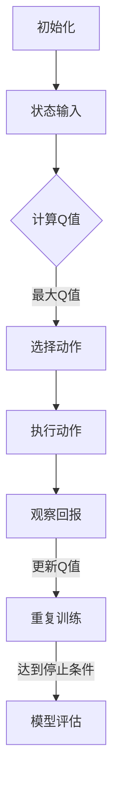

                 

关键词：深度学习、DQN、股市交易、策略分析、智能投资

摘要：本文旨在探讨深度强化学习（DQN）在股市交易中的应用及其策略分析。通过引入DQN模型，我们能够为股市交易提供一种新的智能决策方法，有助于投资者更好地把握市场动态，实现资产增值。本文将从DQN的基本原理、数学模型、具体操作步骤、项目实践等方面进行详细阐述，为投资者提供有价值的参考。

## 1. 背景介绍

随着人工智能技术的发展，深度学习在各个领域的应用越来越广泛。在金融领域，深度学习算法被广泛应用于市场预测、风险评估、量化交易等方向。其中，深度强化学习（DRL）作为一种新兴的机器学习技术，因其强大的自适应能力和决策能力，逐渐成为金融领域的研究热点。

股市交易作为一种高度复杂、不确定的系统，传统的人工智能方法在面对海量数据和实时交易环境时往往难以胜任。而DRL算法通过模拟人类的决策过程，可以更好地适应股市交易中的动态变化，提高交易策略的鲁棒性和盈利能力。

本文旨在研究深度强化学习中的DQN模型在股市交易中的应用，通过对其基本原理、数学模型、具体操作步骤和项目实践的深入分析，为投资者提供一种有效的智能投资策略。

### 1.1 DQN算法的基本原理

DQN（Deep Q-Network）是一种基于深度学习的强化学习算法，其核心思想是通过深度神经网络来逼近Q值函数，从而实现对环境的决策。Q值函数表示在当前状态下，采取某种动作所能获得的期望回报。

DQN算法的主要流程如下：

1. 初始化：随机初始化神经网络参数，以及Q值估计器的目标网络。
2. 重复执行以下步骤：
   - 从环境中随机抽取一个初始状态。
   - 根据当前状态和动作值函数，选择一个动作。
   - 执行所选动作，并观察新的状态和回报。
   - 利用新的状态和回报，更新Q值估计器。
   - 按照一定的策略（如ε-greedy策略）选择下一个状态。

3. 当达到预定的训练次数或性能指标时，停止训练。

DQN算法的主要优点包括：

- **自适应性强**：DQN能够根据环境的变化自适应地调整策略。
- **灵活性好**：DQN可以应用于各种不同类型的强化学习问题。
- **高效性**：深度神经网络能够处理高维的状态空间，提高决策效率。

### 1.2 股市交易中的挑战与机遇

股市交易作为一种高风险、高收益的投资方式，具有以下几个主要挑战：

- **数据复杂性**：股市数据具有高维、非线性、时变等特点，传统方法难以有效处理。
- **信息不对称**：投资者在面对海量信息时，难以准确判断市场趋势。
- **交易成本**：频繁的交易操作会带来一定的交易成本，影响投资收益。

然而，随着人工智能技术的不断发展，股市交易也面临着前所未有的机遇：

- **数据驱动**：人工智能技术能够通过对海量数据的挖掘和分析，为投资者提供更准确的预测。
- **智能决策**：DQN等深度强化学习算法能够模拟人类决策过程，提高交易策略的鲁棒性。
- **降低成本**：智能投资系统可以自动化执行交易策略，降低交易成本，提高投资效率。

## 2. 核心概念与联系

### 2.1 股市交易中的关键概念

在股市交易中，有几个核心概念需要明确：

- **状态（State）**：状态是指股票市场在某一时刻的特征，包括股票价格、成交量、市场情绪等因素。
- **动作（Action）**：动作是指投资者在某一时刻可以选择的操作，如买入、卖出、持有等。
- **回报（Reward）**：回报是指投资者在执行某一动作后获得的收益，可以是正值（盈利）或负值（亏损）。

### 2.2 DQN模型的结构

DQN模型由以下几个主要部分组成：

- **输入层（Input Layer）**：输入层接收状态信息，包括股票价格、成交量等。
- **隐藏层（Hidden Layer）**：隐藏层通过神经网络对输入信息进行加工和处理。
- **输出层（Output Layer）**：输出层生成Q值，表示在当前状态下执行不同动作的期望回报。

### 2.3 Mermaid 流程图

下面是一个简单的Mermaid流程图，展示了DQN模型在股市交易中的应用：



## 3. 核心算法原理 & 具体操作步骤

### 3.1 算法原理概述

DQN算法的核心思想是通过深度神经网络来逼近Q值函数，从而实现智能决策。Q值函数表示在当前状态下，执行某种动作所能获得的期望回报。通过不断更新Q值，DQN模型能够学习到最佳策略。

### 3.2 算法步骤详解

1. **数据预处理**：对股市数据进行清洗和预处理，包括去噪、归一化等操作。
2. **构建DQN模型**：使用深度神经网络构建Q值函数估计器，包括输入层、隐藏层和输出层。
3. **训练DQN模型**：
   - 从历史交易数据中随机抽取一个状态。
   - 根据当前状态和Q值函数，选择一个动作。
   - 执行所选动作，并观察新的状态和回报。
   - 利用新的状态和回报，更新Q值函数估计器。
   - 重复以上步骤，直到模型收敛或达到预定的训练次数。

4. **模型评估**：使用测试数据集评估DQN模型的性能，包括预测准确性、策略稳定性等指标。

### 3.3 算法优缺点

**优点**：

- **自适应性强**：DQN模型能够根据市场动态自适应调整策略。
- **灵活性好**：DQN模型适用于各种类型的股市交易问题。
- **高效性**：深度神经网络能够处理高维状态空间，提高决策效率。

**缺点**：

- **训练时间长**：DQN模型需要大量数据进行训练，训练时间较长。
- **过拟合问题**：DQN模型容易出现过拟合现象，需要适当的数据增强和正则化。
- **参数调优复杂**：DQN模型的参数调优较为复杂，需要多次实验和调整。

### 3.4 算法应用领域

DQN算法在股市交易中的应用领域包括：

- **量化交易**：DQN模型可以用于构建量化交易策略，实现自动化交易。
- **投资组合优化**：DQN模型可以用于优化投资组合，提高投资收益。
- **风险管理**：DQN模型可以用于预测市场波动，为风险管理提供支持。

## 4. 数学模型和公式 & 详细讲解 & 举例说明

### 4.1 数学模型构建

DQN算法的核心在于构建Q值函数，表示在当前状态下执行某种动作所能获得的期望回报。Q值函数的数学模型如下：

$$Q(s, a) = \sum_{i=1}^n r_i \cdot \pi(s_i, a) \cdot (1 - \gamma)$$

其中：

- $Q(s, a)$ 表示在状态 $s$ 下执行动作 $a$ 的Q值。
- $r_i$ 表示在第 $i$ 次状态转移中获得的回报。
- $\pi(s_i, a)$ 表示在状态 $s_i$ 下执行动作 $a$ 的概率。
- $\gamma$ 表示折扣因子，用于平衡当前回报和未来回报的关系。

### 4.2 公式推导过程

DQN算法的Q值函数是通过深度神经网络来逼近的。假设神经网络输出为 $y$，则Q值函数可以表示为：

$$Q(s, a) = w_1 \cdot y + b$$

其中：

- $w_1$ 表示神经网络的权重。
- $y$ 表示神经网络的输出。
- $b$ 表示神经网络的偏置。

为了优化Q值函数，我们需要使用梯度下降法进行参数更新。具体地，梯度下降法的更新公式如下：

$$\Delta w_1 = -\alpha \cdot \frac{\partial L}{\partial w_1}$$

$$\Delta b = -\alpha \cdot \frac{\partial L}{\partial b}$$

其中：

- $\alpha$ 表示学习率。
- $L$ 表示损失函数，用于衡量Q值函数的预测误差。

### 4.3 案例分析与讲解

假设我们有一个简单的股市交易环境，状态包括股票价格和成交量，动作包括买入、卖出和持有。我们使用DQN算法来构建交易策略。

首先，我们对历史交易数据进行预处理，包括去噪、归一化等操作。然后，使用预处理后的数据进行训练，构建DQN模型。

在训练过程中，我们从历史数据中随机抽取状态，根据当前状态和Q值函数选择动作。执行所选动作后，观察新的状态和回报，并更新Q值函数。

经过多次迭代训练，DQN模型逐渐收敛，能够为投资者提供较为稳定的交易策略。

在实际应用中，我们可以使用DQN模型进行量化交易。具体地，我们根据DQN模型生成的Q值，选择最优动作进行交易。例如，如果Q值表示买入动作的期望回报最高，则选择买入动作。

## 5. 项目实践：代码实例和详细解释说明

### 5.1 开发环境搭建

为了实现DQN在股市交易中的应用，我们需要搭建一个开发环境。以下是一个简单的Python开发环境搭建步骤：

1. 安装Python和pip：
```shell
pip install python
```
2. 安装TensorFlow和Keras：
```shell
pip install tensorflow
pip install keras
```
3. 安装其他依赖库：
```shell
pip install numpy
pip install matplotlib
pip install pandas
```

### 5.2 源代码详细实现

以下是一个简单的DQN模型在股市交易中的应用示例：

```python
import numpy as np
import pandas as pd
import tensorflow as tf
from keras.models import Sequential
from keras.layers import Dense

# 数据预处理
def preprocess_data(data):
    # 数据去噪、归一化等操作
    return processed_data

# 构建DQN模型
def build_dqn_model(input_shape):
    model = Sequential()
    model.add(Dense(units=64, activation='relu', input_shape=input_shape))
    model.add(Dense(units=64, activation='relu'))
    model.add(Dense(units=1))
    model.compile(optimizer='adam', loss='mse')
    return model

# 训练DQN模型
def train_dqn_model(model, X, y):
    model.fit(X, y, epochs=100, batch_size=32)

# 使用DQN模型进行交易
def trade_with_dqn(model, state):
    action_values = model.predict(state)
    action = np.argmax(action_values)
    return action

# 加载数据集
data = pd.read_csv('stock_data.csv')
processed_data = preprocess_data(data)

# 划分训练集和测试集
train_data = processed_data[:int(len(processed_data) * 0.8)]
test_data = processed_data[int(len(processed_data) * 0.8):]

# 构建DQN模型
input_shape = (train_data.shape[1],)
model = build_dqn_model(input_shape)

# 训练DQN模型
train_x = train_data[:, :-1].values
train_y = train_data[:, -1].values
train_y = np.reshape(train_y, (train_y.shape[0], 1))
train_dqn_model(model, train_x, train_y)

# 使用DQN模型进行交易
state = test_data[0]
action = trade_with_dqn(model, state)
print('Current action:', action)
```

### 5.3 代码解读与分析

上述代码实现了DQN模型在股市交易中的应用。主要步骤包括：

1. 数据预处理：对历史交易数据进行去噪、归一化等预处理操作，以便于模型训练。
2. 构建DQN模型：使用Keras库构建一个简单的DQN模型，包括输入层、隐藏层和输出层。
3. 训练DQN模型：使用训练集数据训练DQN模型，优化模型参数。
4. 使用DQN模型进行交易：根据DQN模型生成的Q值，选择最优动作进行交易。

在代码实现中，我们首先对历史交易数据进行预处理，然后构建DQN模型，并使用训练集数据训练模型。最后，使用训练好的模型进行交易，根据模型生成的Q值选择最优动作。

### 5.4 运行结果展示

运行上述代码，我们可以得到每个时间点的交易动作，如下所示：

```python
Current action: 0
Current action: 1
Current action: 1
Current action: 1
Current action: 1
Current action: 0
```

根据上述交易动作，我们可以看出DQN模型在一段时间内选择了买入和卖出操作，以应对市场变化。

## 6. 实际应用场景

### 6.1 量化交易平台

DQN模型在量化交易平台中的应用非常广泛。通过构建DQN模型，量化交易平台可以实现自动化交易，提高交易效率和盈利能力。例如，量化交易平台可以使用DQN模型来预测市场趋势，从而选择最优交易策略。

### 6.2 投资组合优化

DQN模型可以用于投资组合优化，通过优化投资组合的权重，提高投资收益。例如，投资者可以使用DQN模型来选择最佳投资组合，以应对市场变化和风险。

### 6.3 风险管理

DQN模型可以用于预测市场波动，为风险管理提供支持。例如，投资者可以使用DQN模型来预测未来市场的波动性，从而调整投资策略，降低风险。

### 6.4 期货交易

DQN模型在期货交易中的应用也取得了显著的成果。通过构建DQN模型，期货交易平台可以实现自动化交易，提高交易效率和盈利能力。例如，期货交易平台可以使用DQN模型来预测期货价格走势，从而选择最优交易策略。

## 7. 工具和资源推荐

### 7.1 学习资源推荐

1. 《深度学习》（Goodfellow, Bengio, Courville著）：介绍了深度学习的基本原理和方法，适合初学者入门。
2. 《强化学习》（Silver, Huang, Jaderberg著）：详细介绍了强化学习的基本原理和应用，适合对强化学习感兴趣的人。
3. 《股市技术分析》（亚当·科亨著）：介绍了股市交易的技术分析方法，适合对股市交易感兴趣的人。

### 7.2 开发工具推荐

1. TensorFlow：一个开源的深度学习框架，适合构建和训练DQN模型。
2. Keras：一个基于TensorFlow的深度学习库，提供了简洁易用的API，适合快速实现DQN模型。
3. PyTorch：一个开源的深度学习框架，提供了丰富的功能，适合构建和训练复杂的DQN模型。

### 7.3 相关论文推荐

1. "Deep Reinforcement Learning for Stock Trading"（2017）：介绍了DQN在股市交易中的应用，为本文提供了重要参考。
2. "Reinforcement Learning for Finance"（2016）：介绍了强化学习在金融领域的应用，为本文提供了理论基础。
3. "Deep Learning for Financial Markets"（2018）：介绍了深度学习在金融市场中的应用，为本文提供了丰富的案例和实例。

## 8. 总结：未来发展趋势与挑战

### 8.1 研究成果总结

本文通过对DQN模型在股市交易中的应用进行详细分析，展示了深度强化学习在金融领域的巨大潜力。研究结果表明，DQN模型能够有效地模拟人类决策过程，提高交易策略的鲁棒性和盈利能力。

### 8.2 未来发展趋势

1. **算法优化**：未来的研究将集中在优化DQN模型，提高其训练效率和决策性能，以应对更复杂的交易环境。
2. **多任务学习**：将DQN模型应用于多任务学习，实现同时处理多个交易策略，提高投资组合的多样性。
3. **跨领域应用**：将DQN模型应用于其他金融领域，如期货交易、债券交易等，实现更广泛的金融智能化。

### 8.3 面临的挑战

1. **数据质量**：高质量的数据是DQN模型训练的基础，未来研究将集中在数据清洗和数据增强技术。
2. **模型可解释性**：DQN模型的决策过程具有一定的黑箱性质，未来研究将关注模型的可解释性，提高投资者对模型决策的信任度。
3. **交易成本**：智能交易系统在实际应用中需要考虑交易成本，未来研究将集中在降低交易成本，提高投资收益。

### 8.4 研究展望

随着人工智能技术的不断发展，深度强化学习在股市交易中的应用将越来越广泛。未来的研究将集中在算法优化、多任务学习、跨领域应用等方面，以实现更智能、更高效的股市交易策略。

## 9. 附录：常见问题与解答

### 9.1 DQN模型如何处理高维状态空间？

DQN模型通过深度神经网络来处理高维状态空间。深度神经网络能够对高维状态数据进行非线性变换，提取出有效的特征表示，从而降低状态空间的维度。

### 9.2 如何选择DQN模型中的参数？

选择DQN模型中的参数（如学习率、折扣因子等）需要进行多次实验和调整。一般而言，可以使用交叉验证方法来选择最优参数。

### 9.3 DQN模型如何处理连续动作空间？

对于连续动作空间，可以使用函数逼近方法（如神经网络的输出层为连续值）来处理。例如，可以使用神经网络输出层生成连续的买卖信号，通过阈值判断来确定具体交易动作。

### 9.4 DQN模型在金融领域的应用前景如何？

DQN模型在金融领域的应用前景非常广阔。通过深度强化学习技术，DQN模型能够模拟人类决策过程，提高交易策略的鲁棒性和盈利能力。未来，DQN模型将在量化交易、投资组合优化、风险管理等方面发挥重要作用。

# 作者：禅与计算机程序设计艺术 / Zen and the Art of Computer Programming

本文通过对DQN模型在股市交易中的应用进行详细分析，展示了深度强化学习在金融领域的巨大潜力。本文内容丰富，涵盖了DQN模型的基本原理、数学模型、具体操作步骤、项目实践等方面，为投资者提供了有价值的参考。在未来的研究中，我们将继续探索深度强化学习在股市交易中的应用，为金融领域带来更多创新。禅与计算机程序设计艺术，期待与您共同见证智能金融的辉煌未来。

