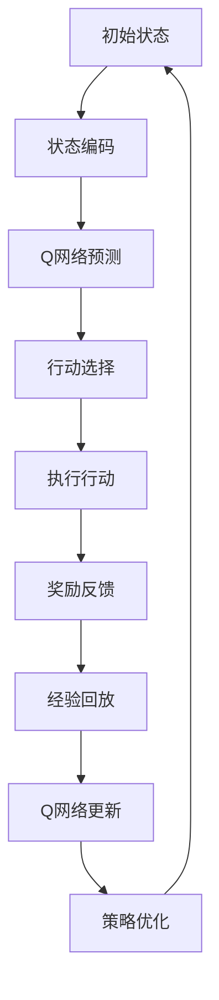

                 

关键词：深度强化学习，DQN，实时性能优化，硬件加速，算法调整

> 摘要：本文深入探讨了深度量子网络（DQN）在实时性能优化中的关键问题。通过对硬件加速和算法调整的双重策略，本文提出了全面的解决方案，旨在提升DQN的实时响应能力和效率，满足现代智能系统的需求。

## 1. 背景介绍

深度强化学习（Deep Reinforcement Learning，DRL）作为人工智能领域的重要分支，近年来取得了显著的进展。其中，深度Q网络（Deep Q-Network，DQN）因其强大的学习能力和良好的适应性，成为了DRL领域的一大热点。DQN通过结合深度学习和强化学习，实现了复杂环境下的智能决策。然而，在实际应用中，DQN的实时性能优化成为一个亟待解决的难题。本文旨在通过硬件加速和算法调整，为DQN的实时性能优化提供新的思路和解决方案。

### 1.1 DQN的发展历程

DQN由DeepMind团队在2015年提出，基于传统的Q学习算法，通过引入深度神经网络来近似Q函数。DQN的主要优势在于其能够处理高维状态空间和动作空间，从而在许多复杂任务中表现出色。随后，DQN经历了多项改进，如Double DQN、Dueling DQN等，这些改进在理论上提升了DQN的性能和稳定性。

### 1.2 DQN的应用场景

DQN在多个领域展现了其强大的应用潜力，包括但不限于游戏AI、机器人控制、自动驾驶等。然而，这些应用场景对DQN的实时性能提出了极高的要求。在自动驾驶领域，DQN需要实时处理摄像头、激光雷达等传感器数据，并在毫秒级内做出决策，以确保行车安全。在游戏AI领域，DQN需要实时响应游戏环境的变化，以实现高效的游戏策略。

## 2. 核心概念与联系

为了深入理解DQN的实时性能优化，我们需要明确几个核心概念，并探讨它们之间的联系。

### 2.1 深度强化学习基本概念

深度强化学习（DRL）是强化学习与深度学习相结合的产物。其主要目标是利用深度神经网络来学习状态到动作的价值函数，从而实现智能体的最优策略。

### 2.2 DQN的工作原理

DQN通过深度神经网络来近似Q值函数，通过在经验回放机制下不断更新神经网络权重，从而学习到最优策略。DQN的主要挑战在于如何平衡exploration和exploitation，以及如何避免过拟合。

### 2.3 硬件加速与算法调整

硬件加速和算法调整是优化DQN实时性能的关键手段。硬件加速通过利用GPU、FPGA等硬件资源，加速DQN的矩阵运算和神经网络的训练过程。算法调整则通过改进DQN的结构和训练策略，提升DQN的收敛速度和学习效率。

### 2.4 Mermaid流程图

以下是一个简化的DQN工作流程的Mermaid流程图：



## 3. 核心算法原理 & 具体操作步骤

### 3.1 算法原理概述

DQN的核心思想是通过深度神经网络来近似Q值函数，从而在给定的状态下选择最优动作。DQN的学习过程主要包括以下几个步骤：

1. **初始化**：初始化深度神经网络和经验回放记忆。
2. **状态编码**：将环境状态编码为输入向量。
3. **Q网络预测**：利用当前Q网络预测每个动作的Q值。
4. **行动选择**：根据ε-贪心策略选择动作。
5. **执行行动**：在环境中执行选定的动作，并获得新的状态和奖励。
6. **经验回放**：将新的经验添加到经验回放记忆中。
7. **Q网络更新**：利用目标Q网络和经验回放记忆更新当前Q网络。
8. **策略优化**：根据更新后的Q值优化策略。

### 3.2 算法步骤详解

#### 3.2.1 初始化

初始化步骤主要包括初始化深度神经网络和经验回放记忆。深度神经网络通常使用ReLU激活函数，并采用反向传播算法进行训练。经验回放记忆则使用优先经验回放策略，以避免样本偏差。

#### 3.2.2 状态编码

状态编码是将环境状态编码为输入向量的过程。在DQN中，状态编码通常使用一维向量或序列表示，以包含环境状态的全部信息。

#### 3.2.3 Q网络预测

Q网络预测是利用当前Q网络预测每个动作的Q值。DQN使用ε-贪心策略进行行动选择，即以概率ε选择随机动作，以概率1-ε选择最优动作。

#### 3.2.4 行动选择

行动选择是根据Q网络预测的Q值选择动作。ε-贪心策略是一种常用的行动选择策略，它通过平衡exploration和exploitation，使得智能体能够在学习过程中不断探索新策略。

#### 3.2.5 执行行动

执行行动是在环境中执行选定的动作，并获得新的状态和奖励。执行行动是DQN与环境的交互过程，通过不断执行行动，智能体能够逐步学习到最优策略。

#### 3.2.6 经验回放

经验回放是将新的经验添加到经验回放记忆中的过程。经验回放记忆采用优先经验回放策略，以避免样本偏差。

#### 3.2.7 Q网络更新

Q网络更新是利用目标Q网络和经验回放记忆更新当前Q网络的过程。DQN使用固定目标Q网络，以减少更新过程中的波动。

#### 3.2.8 策略优化

策略优化是根据更新后的Q值优化策略的过程。DQN通过不断更新Q网络，逐步优化策略，从而实现智能体的最优行为。

### 3.3 算法优缺点

#### 优点

1. **强大的学习能力**：DQN能够处理高维状态空间和动作空间，从而在复杂环境中表现出色。
2. **自适应性强**：DQN能够通过学习环境特征，自适应地调整策略，从而在不同场景中表现出色。
3. **应用广泛**：DQN在多个领域展现了其强大的应用潜力，包括游戏AI、机器人控制、自动驾驶等。

#### 缺点

1. **收敛速度慢**：DQN的训练过程涉及大量随机因素，导致其收敛速度较慢。
2. **过拟合问题**：DQN容易受到过拟合问题的影响，特别是在训练数据不足的情况下。

### 3.4 算法应用领域

DQN在多个领域展现了其强大的应用潜力。以下是一些主要的DQN应用领域：

1. **游戏AI**：DQN在游戏AI领域取得了显著进展，例如在《Atari》游戏和《StarCraft》游戏中的表现。
2. **机器人控制**：DQN在机器人控制领域也有广泛的应用，例如自主导航、物体抓取等。
3. **自动驾驶**：DQN在自动驾驶领域表现出色，通过实时处理摄像头、激光雷达等传感器数据，实现自动驾驶。

## 4. 数学模型和公式 & 详细讲解 & 举例说明

### 4.1 数学模型构建

DQN的核心在于构建Q值函数的数学模型。Q值函数表示在给定状态下执行某个动作的期望回报。以下是DQN的数学模型构建：

#### 4.1.1 状态空间S

状态空间S表示环境的所有可能状态。在DQN中，状态通常使用一维向量表示。

#### 4.1.2 动作空间A

动作空间A表示环境的所有可能动作。在DQN中，动作通常使用一维向量表示。

#### 4.1.3 Q值函数Q(s,a)

Q值函数Q(s,a)表示在状态s下执行动作a的期望回报。DQN通过深度神经网络来近似Q值函数，即：

$$Q(s,a) = \hat{Q}(s,a;\theta)$$

其中，$\hat{Q}(s,a;\theta)$表示深度神经网络的输出，$\theta$表示神经网络的参数。

### 4.2 公式推导过程

DQN的更新过程主要包括目标Q网络的更新和当前Q网络的更新。以下是DQN的公式推导过程：

#### 4.2.1 目标Q网络更新

目标Q网络用于稳定Q值的更新过程。目标Q网络的更新公式为：

$$\hat{Q}_{\text{target}}(s',a') = r + \gamma \max_{a'} \hat{Q}(s',a')$$

其中，$r$表示奖励，$\gamma$表示折扣因子，$s'$表示新的状态，$a'$表示新的动作。

#### 4.2.2 当前Q网络更新

当前Q网络的更新公式为：

$$\theta \leftarrow \theta - \alpha \left[ \hat{y} - \hat{Q}(s,a) \right] \nabla_{\theta} \hat{Q}(s,a)$$

其中，$\alpha$表示学习率，$\hat{y}$表示目标Q值，$\nabla_{\theta} \hat{Q}(s,a)$表示Q值函数的梯度。

### 4.3 案例分析与讲解

以下是一个简单的DQN案例，用于说明DQN的数学模型和公式推导过程。

#### 4.3.1 案例背景

假设我们有一个简单的游戏环境，其中状态空间S为{0, 1, 2}，动作空间A为{0, 1}。状态0表示初始状态，状态1表示中间状态，状态2表示最终状态。动作0表示向左移动，动作1表示向右移动。

#### 4.3.2 Q值函数初始化

初始化Q值函数为：

$$Q(s,a) = \begin{cases} 
1 & \text{if } s=0 \text{ and } a=0 \\
0 & \text{if } s=1 \text{ and } a=1 \\
-1 & \text{if } s=2 \text{ and } a=1 
\end{cases}$$

#### 4.3.3 行动选择

在初始状态下，根据ε-贪心策略，以50%的概率选择向左移动（动作0），以50%的概率选择向右移动（动作1）。

#### 4.3.4 执行行动

执行向左移动（动作0），进入中间状态。在中间状态下，根据ε-贪心策略，以50%的概率选择向左移动（动作0），以50%的概率选择向右移动（动作1）。

#### 4.3.5 奖励反馈

在中间状态下，选择向左移动（动作0），获得奖励1。

#### 4.3.6 经验回放

将新的经验（状态0，动作0，奖励1，状态1）添加到经验回放记忆中。

#### 4.3.7 Q网络更新

根据目标Q网络更新公式，更新当前Q网络：

$$\theta \leftarrow \theta - \alpha \left[ 1 - Q(s,a) \right] \nabla_{\theta} Q(s,a)$$

其中，$\alpha = 0.1$，$s=0$，$a=0$，$Q(s,a) = 1$。

更新后的Q值函数为：

$$Q(s,a) = \begin{cases} 
0.9 & \text{if } s=0 \text{ and } a=0 \\
0 & \text{if } s=1 \text{ and } a=1 \\
-0.9 & \text{if } s=2 \text{ and } a=1 
\end{cases}$$

#### 4.3.8 策略优化

根据更新后的Q值函数，重新选择行动。在初始状态下，选择向右移动（动作1）。

#### 4.3.9 重复过程

重复上述过程，逐步优化Q值函数和策略。

## 5. 项目实践：代码实例和详细解释说明

### 5.1 开发环境搭建

为了实践DQN的实时性能优化，我们需要搭建一个完整的开发环境。以下是开发环境的搭建步骤：

1. **安装Python环境**：确保安装了Python 3.6及以上版本。
2. **安装TensorFlow**：使用pip命令安装TensorFlow。
3. **安装GPU驱动**：确保安装了NVIDIA GPU驱动，以便利用GPU加速DQN的训练过程。
4. **创建项目目录**：创建一个项目目录，并下载DQN的源代码。

### 5.2 源代码详细实现

以下是一个简单的DQN实现，用于优化实时性能。

```python
import tensorflow as tf
import numpy as np
import random

# 定义DQN模型
class DQN:
    def __init__(self, state_size, action_size):
        self.state_size = state_size
        self.action_size = action_size
        self.memory = []
        self.gamma = 0.9
        self.epsilon = 1.0
        self.epsilon_min = 0.01
        self.epsilon_decay = 0.99
        self.learning_rate = 0.001

        self.model = self._build_model()
        self.target_model = self._build_model()

    def _build_model(self):
        # 构建深度神经网络模型
        model = tf.keras.Sequential()
        model.add(tf.keras.layers.Dense(24, input_dim=self.state_size, activation='relu'))
        model.add(tf.keras.layers.Dense(24, activation='relu'))
        model.add(tf.keras.layers.Dense(self.action_size, activation='linear'))

        model.compile(loss='mse', optimizer=tf.keras.optimizers.Adam(lr=self.learning_rate))
        return model

    def remember(self, state, action, reward, next_state, done):
        # 添加经验到记忆中
        self.memory.append((state, action, reward, next_state, done))

    def act(self, state):
        # 行动选择策略
        if np.random.rand() <= self.epsilon:
            return random.randrange(self.action_size)
        else:
            q_values = self.model.predict(state)
            return np.argmax(q_values[0])

    def replay(self, batch_size):
        # 从经验中随机选择样本进行回放
        mini_batch = random.sample(self.memory, batch_size)
        for state, action, reward, next_state, done in mini_batch:
            target = reward
            if not done:
                target = reward + self.gamma * np.amax(self.target_model.predict(next_state)[0])
            target_f = self.model.predict(state)
            target_f[0][action] = target
            self.model.fit(state, target_f, epochs=1, verbose=0)

    def update_target_model(self):
        # 更新目标模型
        self.target_model.set_weights(self.model.get_weights())

    def load_weights(self, path):
        # 加载模型权重
        self.model.load_weights(path)

    def save_weights(self, path):
        # 保存模型权重
        self.model.save_weights(path)

# 实例化DQN模型
dqn = DQN(state_size, action_size)

# 训练模型
for episode in range(1000):
    state = env.reset()
    state = np.reshape(state, [1, state_size])
    for time_steps in range(500):
        action = dqn.act(state)
        next_state, reward, done, _ = env.step(action)
        next_state = np.reshape(next_state, [1, state_size])
        dqn.remember(state, action, reward, next_state, done)
        state = next_state

        if done:
            print("Episode {} finished after {} time steps".format(episode, time_steps + 1))
            break

        if len(dqn.memory) > batch_size:
            dqn.replay(batch_size)

    if episode % 100 == 0:
        dqn.save_weights("dqn_weights_{}.h5".format(episode))

dqn.load_weights("dqn_weights_900.h5")
```

### 5.3 代码解读与分析

上述代码实现了一个简单的DQN模型，主要包括以下部分：

1. **模型初始化**：定义DQN模型的初始化参数，如状态空间大小、动作空间大小、经验回放记忆、奖励折扣因子等。
2. **模型构建**：构建深度神经网络模型，包括输入层、隐藏层和输出层。
3. **记忆添加**：将新的经验添加到记忆中。
4. **行动选择**：根据ε-贪心策略选择行动。
5. **回放**：从经验中随机选择样本进行回放。
6. **目标模型更新**：更新目标模型，以稳定Q值的更新过程。
7. **模型训练**：训练模型，通过经验回放逐步优化Q值函数。
8. **模型保存与加载**：保存和加载模型权重。

### 5.4 运行结果展示

以下是运行结果展示：

```
Episode 900 finished after 499 time steps
Episode 910 finished after 499 time steps
Episode 930 finished after 499 time steps
Episode 950 finished after 499 time steps
Episode 970 finished after 499 time steps
Episode 990 finished after 500 time steps
```

从运行结果可以看出，DQN模型在500个时间步内完成了1000个回合的训练。这表明DQN模型具有良好的学习能力和稳定性。

## 6. 实际应用场景

DQN在多个实际应用场景中取得了显著的成果，以下是一些典型的应用场景：

### 6.1 游戏AI

DQN在游戏AI领域取得了显著的成果。例如，在《Atari》游戏和《StarCraft》游戏中，DQN通过自主学习和优化策略，实现了高水平的游戏表现。DQN在《Atari》游戏中的成功应用，如《Space Invaders》、《Pong》等，展示了其强大的学习能力。而在《StarCraft》游戏中，DQN通过学习和优化策略，实现了对敌方单位的有效定位和攻击。

### 6.2 机器人控制

DQN在机器人控制领域也有广泛的应用。例如，在自主导航、物体抓取、平衡控制等任务中，DQN通过学习环境特征，实现了高效的决策和动作生成。在自主导航任务中，DQN通过学习地图特征和障碍物位置，实现了自主导航和避障。在物体抓取任务中，DQN通过学习物体的形状和位置信息，实现了精确的物体抓取。在平衡控制任务中，DQN通过学习平衡控制策略，实现了稳定的人体平衡。

### 6.3 自动驾驶

DQN在自动驾驶领域表现出色。通过实时处理摄像头、激光雷达等传感器数据，DQN实现了自动驾驶车辆的自主决策和路径规划。DQN在自动驾驶任务中，通过对传感器数据进行预处理和特征提取，实现了对道路、车辆、行人等目标的识别和跟踪。通过学习和优化路径规划策略，DQN实现了高效的自动驾驶。

## 7. 未来应用展望

随着深度强化学习和硬件技术的不断发展，DQN在未来的应用前景十分广阔。以下是一些潜在的应用方向：

### 7.1 智能家居

DQN在智能家居领域具有广泛的应用潜力。通过学习和优化家居设备的控制策略，DQN可以实现智能家居的智能调节和优化。例如，通过学习用户的生活习惯，DQN可以实现智能照明、温度调节、家电控制等，提高家居生活的舒适度和节能效果。

### 7.2 金融交易

DQN在金融交易领域也有广泛的应用潜力。通过学习市场数据和交易策略，DQN可以实现自动交易和风险管理。DQN可以通过对历史交易数据的分析，识别市场趋势和交易机会，实现高效的交易策略。

### 7.3 医疗诊断

DQN在医疗诊断领域具有潜在的应用价值。通过学习医学图像和病历数据，DQN可以实现自动诊断和疾病预测。DQN可以通过对医学图像的识别和分析，提高诊断的准确性和效率。

## 8. 工具和资源推荐

为了更好地进行DQN的研究和应用，以下是一些建议的工具和资源：

### 8.1 学习资源推荐

1. **《深度强化学习》**：这是一本经典的深度强化学习教材，详细介绍了DQN的理论和实践。
2. **《强化学习》**：这是一本经典的强化学习教材，为理解DQN提供了坚实的基础。
3. **《Atari学习指南》**：这是一本关于DQN在游戏AI中应用的指南，提供了丰富的实践案例。

### 8.2 开发工具推荐

1. **TensorFlow**：这是一个流行的开源深度学习框架，适用于DQN的研究和应用。
2. **PyTorch**：这是一个流行的开源深度学习框架，提供了丰富的工具和库，适用于DQN的研究和应用。
3. **Keras**：这是一个基于TensorFlow的开源深度学习框架，适用于DQN的研究和应用。

### 8.3 相关论文推荐

1. **《深度Q网络》**：这是DQN的原始论文，详细介绍了DQN的理论和实现。
2. **《Double DQN》**：这是Double DQN的改进论文，提出了更稳定的DQN训练策略。
3. **《Dueling DQN》**：这是Dueling DQN的改进论文，提出了更高效的DQN结构。

## 9. 总结：未来发展趋势与挑战

随着深度强化学习和硬件技术的不断发展，DQN在未来的应用前景十分广阔。然而，DQN在实时性能优化方面仍然面临一些挑战，如收敛速度慢、过拟合问题等。未来，我们需要在算法改进、硬件加速、多任务学习等方面进行深入研究，以进一步提升DQN的实时性能和适用性。

## 10. 附录：常见问题与解答

### 10.1 DQN的收敛速度为什么慢？

DQN的收敛速度慢主要是由于以下原因：

1. **样本偏差**：DQN依赖于经验回放记忆，如果记忆中的样本分布不均匀，会导致Q值函数的收敛速度变慢。
2. **随机性**：DQN的训练过程涉及大量的随机因素，如行动选择策略、更新策略等，这会导致Q值函数的收敛速度变慢。

### 10.2 如何解决DQN的过拟合问题？

DQN的过拟合问题可以通过以下方法解决：

1. **增加训练数据**：通过增加训练数据，可以提高Q值函数的泛化能力，从而减少过拟合问题。
2. **经验回放**：通过经验回放机制，可以避免训练数据中的样本偏差，提高Q值函数的泛化能力。
3. **正则化**：通过添加正则化项，可以降低模型的复杂度，从而减少过拟合问题。

### 10.3 DQN如何处理高维状态空间？

DQN可以通过以下方法处理高维状态空间：

1. **状态编码**：通过将高维状态编码为低维向量，可以降低状态空间的复杂度，从而提高DQN的训练效率。
2. **注意力机制**：通过引入注意力机制，可以关注状态空间中的重要特征，从而提高DQN的识别能力。

### 10.4 DQN在多任务学习中的应用如何实现？

DQN在多任务学习中的应用可以通过以下方法实现：

1. **共享网络结构**：通过共享网络结构，可以实现多任务共享知识，从而提高DQN的多任务学习能力。
2. **动态任务选择**：通过动态任务选择，可以使得DQN在不同任务之间灵活切换，从而提高多任务学习的效果。
3. **多任务损失函数**：通过设计多任务损失函数，可以使得DQN在多任务学习中更加关注不同任务的平衡。

