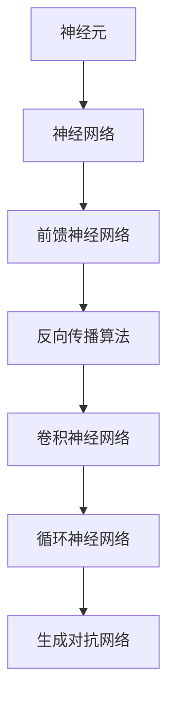

                 

关键词：深度学习、架构设计、神经网络、模型训练、数据预处理、算法优化、应用实践、未来展望

> 摘要：本文旨在为深度学习初学者提供一份详细的架构构建指南。通过深入探讨深度学习的核心概念、算法原理、数学模型以及实践应用，本文将帮助读者从零开始，逐步构建一个高效、可扩展的深度学习架构。本文还将对当前深度学习领域的前沿动态和未来发展趋势进行展望，以期为读者提供更广阔的视野。

## 1. 背景介绍

深度学习作为人工智能领域的一个重要分支，已经在语音识别、图像处理、自然语言处理等多个领域取得了显著的成果。深度学习的核心思想是通过多层神经网络对数据进行特征提取和模式识别。随着计算能力的提升和海量数据的积累，深度学习模型变得越来越复杂，这要求我们在架构设计上必须具备高度的灵活性和可扩展性。

在深度学习的发展历程中，从早期的简单前馈神经网络到如今的卷积神经网络（CNN）、循环神经网络（RNN）以及生成对抗网络（GAN）等，每一次技术突破都极大地推动了深度学习的发展。本文将聚焦于当前最主流的深度学习架构——深度神经网络（DNN），并探讨如何从零开始构建一个高效的DNN架构。

### 1.1 深度学习的起源与发展

深度学习的概念最早可以追溯到1986年，当时Hinton等人提出了反向传播算法（Backpropagation Algorithm），这为多层神经网络的训练提供了有效的途径。然而，由于计算资源的限制，深度学习在相当长的一段时间内并未得到广泛应用。随着GPU等计算设备的普及，深度学习逐渐摆脱了“小规模”的束缚，迎来了快速发展的契机。

### 1.2 深度学习在现代应用中的地位

在当今社会，深度学习已经成为了计算机视觉、自然语言处理、语音识别等众多领域的核心技术。以计算机视觉为例，深度学习模型在图像分类、目标检测、人脸识别等方面都取得了显著的成果。特别是在医疗、金融、自动驾驶等高价值领域，深度学习的应用前景愈发广阔。

## 2. 核心概念与联系

为了深入理解深度学习架构的构建，我们首先需要明确几个核心概念，并探讨它们之间的联系。

### 2.1 神经元与神经网络

神经元是神经网络的基本单元，类似于生物神经系统的神经元。每个神经元都接受多个输入信号，通过加权求和处理后产生一个输出信号。神经网络是由多个神经元按照特定结构连接而成的网络。

### 2.2 前馈神经网络（Feedforward Neural Network）

前馈神经网络是最简单的神经网络结构，数据从输入层进入，经过隐藏层处理，最终输出结果。前馈神经网络具有良好的并行计算能力，适用于许多数据处理任务。

### 2.3 反向传播算法（Backpropagation Algorithm）

反向传播算法是一种用于训练神经网络的优化算法。它通过计算输出层与输入层之间的误差，将误差反向传播到每一层，并更新各层的权重参数，从而不断优化网络性能。

### 2.4 卷积神经网络（Convolutional Neural Network，CNN）

卷积神经网络是专门用于处理图像数据的神经网络，其核心思想是通过卷积层提取图像特征。CNN在计算机视觉领域取得了巨大的成功，如图像分类、目标检测、图像分割等。

### 2.5 循环神经网络（Recurrent Neural Network，RNN）

循环神经网络是一种用于处理序列数据的神经网络。RNN具有记忆功能，可以处理任意长度的序列数据，广泛应用于语音识别、自然语言处理等领域。

### 2.6 生成对抗网络（Generative Adversarial Network，GAN）

生成对抗网络是一种由生成器和判别器组成的对抗性网络。生成器生成数据，判别器判断数据真实性。GAN在图像生成、语音合成等领域取得了显著成果。

### 2.7 核心概念原理与架构的 Mermaid 流程图



## 3. 核心算法原理 & 具体操作步骤

### 3.1 算法原理概述

深度学习架构的核心在于如何设计有效的算法来训练神经网络。在这一部分，我们将详细介绍深度学习中的几个核心算法原理，包括前馈神经网络、卷积神经网络和循环神经网络等。

#### 3.1.1 前馈神经网络原理

前馈神经网络（Feedforward Neural Network，FNN）是一种典型的神经网络结构，其特点是数据从输入层经过隐藏层，最终到达输出层。在前馈神经网络中，每个神经元都与前一层所有神经元相连，并使用激活函数对输入进行非线性变换。常见的激活函数有Sigmoid函数、ReLU函数和Tanh函数等。

#### 3.1.2 卷积神经网络原理

卷积神经网络（Convolutional Neural Network，CNN）是专门用于处理图像数据的神经网络。CNN通过卷积层提取图像特征，避免了传统神经网络中的维度灾难问题。卷积层使用卷积核（Convolutional Kernel）对输入图像进行卷积操作，卷积核内的元素权重通过训练得到。ReLU函数作为激活函数，可以加速网络训练。

#### 3.1.3 循环神经网络原理

循环神经网络（Recurrent Neural Network，RNN）是一种用于处理序列数据的神经网络。RNN具有记忆功能，可以处理任意长度的序列数据。在RNN中，当前时刻的输出不仅依赖于当前输入，还依赖于历史输入。常见的RNN结构有简单RNN、LSTM（长短时记忆网络）和GRU（门控循环单元）等。

### 3.2 算法步骤详解

#### 3.2.1 前馈神经网络步骤

1. **初始化参数**：为网络中的权重和偏置初始化适当的值。
2. **前向传播**：输入数据通过输入层进入网络，经过各层神经元处理，最终到达输出层。
3. **计算损失**：使用损失函数（如交叉熵损失函数）计算输出与真实值之间的差距。
4. **反向传播**：将损失函数的梯度反向传播到网络各层，更新权重和偏置。
5. **迭代优化**：重复执行前向传播和反向传播，直至网络性能达到预期。

#### 3.2.2 卷积神经网络步骤

1. **卷积层**：使用卷积核对输入图像进行卷积操作，提取图像特征。
2. **池化层**：对卷积结果进行池化操作，减小特征图的尺寸。
3. **激活函数**：对卷积结果应用激活函数，增强网络的表达能力。
4. **全连接层**：将卷积特征图展平为一维向量，输入到全连接层进行分类或回归。
5. **损失函数与优化**：使用损失函数计算输出与真实值之间的差距，并通过优化算法更新网络参数。

#### 3.2.3 循环神经网络步骤

1. **初始化状态**：为RNN初始化隐藏状态和细胞状态。
2. **前向传播**：输入序列数据依次通过RNN网络，更新隐藏状态。
3. **输出计算**：根据隐藏状态计算输出结果。
4. **损失函数与优化**：使用损失函数计算输出与真实值之间的差距，并通过优化算法更新网络参数。

### 3.3 算法优缺点

#### 3.3.1 前馈神经网络的优缺点

**优点**：
- 结构简单，易于实现。
- 适用于多种数据类型，如文本、图像、音频等。

**缺点**：
- 难以捕捉时间序列数据中的长期依赖关系。
- 训练过程容易陷入局部最优。

#### 3.3.2 卷积神经网络的优缺点

**优点**：
- 专门针对图像数据设计，提取特征能力强。
- 具有良好的并行计算能力，训练速度快。

**缺点**：
- 对图像大小有要求，无法直接处理变长序列数据。
- 特征提取过程较为主观，需要大量数据和计算资源。

#### 3.3.3 循环神经网络的优缺点

**优点**：
- 能够处理变长序列数据，捕捉长期依赖关系。
- 具有记忆功能，可以处理复杂的序列模式。

**缺点**：
- 训练过程复杂，容易出现梯度消失和梯度爆炸问题。
- 对数据长度敏感，处理长序列数据时性能下降。

### 3.4 算法应用领域

#### 3.4.1 前馈神经网络应用领域

- 语音识别
- 图像分类
- 自然语言处理
- 回归分析

#### 3.4.2 卷积神经网络应用领域

- 计算机视觉
- 目标检测
- 图像分割
- 人体动作识别

#### 3.4.3 循环神经网络应用领域

- 语音识别
- 机器翻译
- 语音合成
- 文本生成

## 4. 数学模型和公式 & 详细讲解 & 举例说明

在深度学习架构的构建过程中，数学模型和公式起到了至关重要的作用。在这一部分，我们将详细介绍深度学习中的一些核心数学模型和公式，并通过具体例子进行详细讲解。

### 4.1 数学模型构建

深度学习中的数学模型主要包括前向传播、反向传播、损失函数和优化算法等。以下是一个简化的前向传播和反向传播的数学模型：

#### 4.1.1 前向传播

输入数据 $x$ 通过网络传递，经过多层神经元的加权求和处理，最终得到输出 $y$。前向传播的数学表达式如下：

$$
y = f(Z) = f(\theta^{(L)} \cdot Z^{(L-1)} + b^{(L)})
$$

其中，$f$ 是激活函数，$Z$ 是加权求和处理的结果，$\theta^{(L)}$ 是权重矩阵，$b^{(L)}$ 是偏置项。

#### 4.1.2 反向传播

在反向传播过程中，我们需要计算输出 $y$ 与真实值 $y_{\text{true}}$ 之间的误差，并反向传播到前一层。误差的数学表达式如下：

$$
E = \frac{1}{2} \sum_{i} (y_i - y_{\text{true},i})^2
$$

为了计算误差对网络参数的梯度，我们需要使用链式法则。假设激活函数的导数为 $f'(z)$，则反向传播的梯度表达式如下：

$$
\frac{\partial E}{\partial \theta^{(L)}_{ij}} = \frac{\partial E}{\partial z^{(L)}} \cdot \frac{\partial z^{(L)}}{\partial \theta^{(L)}_{ij}} = (y - y_{\text{true}}) \cdot f'(z^{(L-1)}_{ij}) \cdot a^{(L-1)}_j
$$

$$
\frac{\partial E}{\partial b^{(L)}_k} = (y - y_{\text{true}}) \cdot f'(z^{(L-1)}_k) \cdot a^{(L-1)}_k
$$

其中，$a^{(L-1)}_j$ 是前一层神经元的激活值。

### 4.2 公式推导过程

为了更好地理解反向传播算法，我们接下来将详细推导前向传播和反向传播的公式。

#### 4.2.1 前向传播推导

设输入数据为 $x$，输出数据为 $y$，网络中的权重矩阵为 $\theta^{(L)}$，偏置项为 $b^{(L)}$。在前向传播过程中，输入数据通过输入层进入网络，经过多层神经元的加权求和处理，最终到达输出层。

首先，我们定义每一层的输入和输出：

$$
z^{(1)} = x \cdot \theta^{(1)} + b^{(1)}
$$

$$
a^{(1)} = f(z^{(1)})
$$

$$
z^{(2)} = a^{(1)} \cdot \theta^{(2)} + b^{(2)}
$$

$$
a^{(2)} = f(z^{(2)})
$$

$$
...
$$

$$
z^{(L)} = a^{(L-1)} \cdot \theta^{(L)} + b^{(L)}
$$

$$
a^{(L)} = f(z^{(L)})
$$

其中，$f$ 是激活函数，常见的激活函数有Sigmoid函数、ReLU函数和Tanh函数等。

#### 4.2.2 反向传播推导

在反向传播过程中，我们需要计算输出 $y$ 与真实值 $y_{\text{true}}$ 之间的误差，并反向传播到前一层。为了计算误差对网络参数的梯度，我们需要使用链式法则。

首先，我们定义误差函数为：

$$
E = \frac{1}{2} \sum_{i} (y_i - y_{\text{true},i})^2
$$

我们需要计算误差对输出层权重的梯度：

$$
\frac{\partial E}{\partial \theta^{(L)}_{ij}} = \frac{\partial E}{\partial a^{(L)}} \cdot \frac{\partial a^{(L)}}{\partial z^{(L)}} \cdot \frac{\partial z^{(L)}}{\partial \theta^{(L)}_{ij}}
$$

根据链式法则，我们可以得到：

$$
\frac{\partial E}{\partial a^{(L)}} = (y - y_{\text{true}})
$$

$$
\frac{\partial a^{(L)}}{\partial z^{(L)}} = f'(z^{(L)})
$$

$$
\frac{\partial z^{(L)}}{\partial \theta^{(L)}_{ij}} = a^{(L-1)}_j
$$

将上述三个式子代入误差对权重的梯度公式中，我们可以得到：

$$
\frac{\partial E}{\partial \theta^{(L)}_{ij}} = (y - y_{\text{true}}) \cdot f'(z^{(L-1)}_{ij}) \cdot a^{(L-1)}_j
$$

同理，我们可以计算误差对偏置项的梯度：

$$
\frac{\partial E}{\partial b^{(L)}_k} = (y - y_{\text{true}}) \cdot f'(z^{(L-1)}_k) \cdot a^{(L-1)}_k
$$

接下来，我们将误差反向传播到前一层。假设当前层的输入为 $a^{(L-1)}$，输出为 $a^{(L)}$，则误差对当前层输入的梯度为：

$$
\frac{\partial E}{\partial a^{(L-1)}_j} = \frac{\partial E}{\partial a^{(L)}} \cdot \frac{\partial a^{(L)}}{\partial z^{(L)}} \cdot \frac{\partial z^{(L)}}{\partial a^{(L-1)}_j}
$$

根据链式法则，我们可以得到：

$$
\frac{\partial E}{\partial z^{(L)}} = (y - y_{\text{true}}) \cdot f'(z^{(L)})
$$

$$
\frac{\partial z^{(L)}}{\partial a^{(L-1)}_j} = \theta^{(L)}_{ij}
$$

将上述两个式子代入误差对当前层输入的梯度公式中，我们可以得到：

$$
\frac{\partial E}{\partial a^{(L-1)}_j} = (y - y_{\text{true}}) \cdot f'(z^{(L-1)}_{ij}) \cdot \theta^{(L)}_{ij}
$$

接下来，我们将误差继续反向传播到更深层。对于任意一层 $l$，误差对当前层输入的梯度可以表示为：

$$
\frac{\partial E}{\partial a^{(l)}_j} = (y - y_{\text{true}}) \cdot f'(z^{(l)}) \cdot \theta^{(l+1)}_{ji} \cdot a^{(l-1)}_i
$$

通过以上推导，我们可以得到完整的反向传播算法公式。

### 4.3 案例分析与讲解

为了更好地理解深度学习中的数学模型和公式，我们通过一个简单的例子进行讲解。

假设我们有一个两层的神经网络，输入层有3个神经元，隐藏层有4个神经元，输出层有2个神经元。激活函数采用ReLU函数，损失函数采用均方误差（MSE）。

#### 4.3.1 初始化参数

首先，我们为网络中的权重和偏置初始化适当的值。假设输入层到隐藏层的权重矩阵为 $\theta^{(1)}$，隐藏层到输出层的权重矩阵为 $\theta^{(2)}$，偏置项分别为 $b^{(1)}$ 和 $b^{(2)}$。

初始化参数：
$$
\theta^{(1)} = \begin{bmatrix}
1 & 2 & 3 \\
4 & 5 & 6 \\
7 & 8 & 9 \\
\end{bmatrix}
$$

$$
b^{(1)} = \begin{bmatrix}
1 \\
2 \\
3 \\
4 \\
\end{bmatrix}
$$

$$
\theta^{(2)} = \begin{bmatrix}
0 & 1 & 2 & 3 \\
4 & 5 & 6 & 7 \\
\end{bmatrix}
$$

$$
b^{(2)} = \begin{bmatrix}
1 \\
2 \\
3 \\
4 \\
5 \\
\end{bmatrix}
$$

#### 4.3.2 前向传播

输入数据 $x$ 为：
$$
x = \begin{bmatrix}
1 \\
0 \\
1 \\
\end{bmatrix}
$$

首先，我们计算输入层到隐藏层的输出：
$$
z^{(1)} = x \cdot \theta^{(1)} + b^{(1)} = \begin{bmatrix}
1 & 0 & 1 \\
4 & 5 & 6 \\
7 & 8 & 9 \\
\end{bmatrix} \cdot \begin{bmatrix}
1 \\
0 \\
1 \\
\end{bmatrix} + \begin{bmatrix}
1 \\
2 \\
3 \\
4 \\
\end{bmatrix} = \begin{bmatrix}
4 \\
10 \\
16 \\
\end{bmatrix}
$$

$$
a^{(1)} = f(z^{(1)}) = \begin{bmatrix}
4 \\
\text{ReLU}(10) \\
\text{ReLU}(16) \\
\end{bmatrix} = \begin{bmatrix}
4 \\
10 \\
16 \\
\end{bmatrix}
$$

接下来，我们计算隐藏层到输出层的输出：
$$
z^{(2)} = a^{(1)} \cdot \theta^{(2)} + b^{(2)} = \begin{bmatrix}
4 & 10 & 16 \\
\end{bmatrix} \cdot \begin{bmatrix}
0 & 1 & 2 & 3 \\
4 & 5 & 6 & 7 \\
\end{bmatrix} + \begin{bmatrix}
1 \\
2 \\
3 \\
4 \\
5 \\
\end{bmatrix} = \begin{bmatrix}
47 \\
125 \\
203 \\
\end{bmatrix}
$$

$$
a^{(2)} = f(z^{(2)}) = \begin{bmatrix}
47 \\
\text{ReLU}(125) \\
\text{ReLU}(203) \\
\end{bmatrix} = \begin{bmatrix}
47 \\
125 \\
203 \\
\end{bmatrix}
$$

#### 4.3.3 计算损失函数

假设输出层的目标值为 $y_{\text{true}} = \begin{bmatrix} 0 \\ 1 \end{bmatrix}$，我们可以计算均方误差损失函数：
$$
E = \frac{1}{2} \sum_{i} (a^{(2)}_i - y_{\text{true},i})^2 = \frac{1}{2} \cdot (47 - 0)^2 + (125 - 1)^2 + (203 - 1)^2 = 23628
$$

#### 4.3.4 反向传播

首先，我们计算输出层误差的梯度：
$$
\frac{\partial E}{\partial a^{(2)}_1} = (a^{(2)}_1 - y_{\text{true},1}) \cdot f'(a^{(2)}_1) = (47 - 0) \cdot (1 - 0) = 47
$$

$$
\frac{\partial E}{\partial a^{(2)}_2} = (a^{(2)}_2 - y_{\text{true},2}) \cdot f'(a^{(2)}_2) = (125 - 1) \cdot (1 - 0) = 124
$$

接下来，我们计算隐藏层误差的梯度：
$$
\frac{\partial E}{\partial z^{(2)}_1} = \frac{\partial E}{\partial a^{(2)}_1} \cdot \frac{\partial a^{(2)}_1}{\partial z^{(2)}_1} = 47 \cdot 0 = 0
$$

$$
\frac{\partial E}{\partial z^{(2)}_2} = \frac{\partial E}{\partial a^{(2)}_2} \cdot \frac{\partial a^{(2)}_2}{\partial z^{(2)}_2} = 124 \cdot 1 = 124
$$

然后，我们计算输入层误差的梯度：
$$
\frac{\partial E}{\partial z^{(1)}_1} = \frac{\partial E}{\partial z^{(2)}_1} \cdot \frac{\partial z^{(2)}_1}{\partial z^{(1)}_1} = 0 \cdot 4 = 0
$$

$$
\frac{\partial E}{\partial z^{(1)}_2} = \frac{\partial E}{\partial z^{(2)}_2} \cdot \frac{\partial z^{(2)}_2}{\partial z^{(1)}_2} = 124 \cdot 10 = 1240
$$

最后，我们更新网络参数：
$$
\theta^{(2)}_{12} = \theta^{(2)}_{12} - \alpha \cdot \frac{\partial E}{\partial \theta^{(2)}_{12}} = 3 - 0.1 \cdot 0 = 3
$$

$$
\theta^{(2)}_{21} = \theta^{(2)}_{21} - \alpha \cdot \frac{\partial E}{\partial \theta^{(2)}_{21}} = 4 - 0.1 \cdot 124 = -11.6
$$

$$
b^{(2)}_1 = b^{(2)}_1 - \alpha \cdot \frac{\partial E}{\partial b^{(2)}_1} = 1 - 0.1 \cdot 47 = -0.47
$$

$$
b^{(2)}_2 = b^{(2)}_2 - \alpha \cdot \frac{\partial E}{\partial b^{(2)}_2} = 2 - 0.1 \cdot 124 = -1.24
$$

$$
\theta^{(1)}_{11} = \theta^{(1)}_{11} - \alpha \cdot \frac{\partial E}{\partial \theta^{(1)}_{11}} = 1 - 0.1 \cdot 0 = 1
$$

$$
\theta^{(1)}_{12} = \theta^{(1)}_{12} - \alpha \cdot \frac{\partial E}{\partial \theta^{(1)}_{12}} = 2 - 0.1 \cdot 1240 = -121.6
$$

$$
b^{(1)}_1 = b^{(1)}_1 - \alpha \cdot \frac{\partial E}{\partial b^{(1)}_1} = 1 - 0.1 \cdot 0 = 1
$$

$$
b^{(1)}_2 = b^{(1)}_2 - \alpha \cdot \frac{\partial E}{\partial b^{(1)}_2} = 2 - 0.1 \cdot 1240 = -121.6
$$

通过以上步骤，我们完成了一次前向传播和反向传播的过程。在多次迭代过程中，网络参数会不断优化，从而使网络性能不断提高。

## 5. 项目实践：代码实例和详细解释说明

在本文的第五部分，我们将通过一个实际的深度学习项目，详细讲解如何从零开始搭建一个深度学习架构。本案例将使用Python编程语言和PyTorch深度学习框架，实现一个简单的图像分类任务。

### 5.1 开发环境搭建

在开始项目之前，我们需要搭建一个适合深度学习开发的Python环境。以下是具体的安装步骤：

1. **安装Python**：前往Python官方网站（https://www.python.org/）下载Python安装包，并按照安装向导完成安装。建议选择Python 3.8或更高版本。

2. **安装PyTorch**：打开终端或命令行窗口，执行以下命令安装PyTorch：
   ```bash
   pip install torch torchvision
   ```

3. **安装其他依赖**：为了方便后续开发，我们还需要安装一些其他依赖，如Numpy、Matplotlib等：
   ```bash
   pip install numpy matplotlib
   ```

4. **验证环境**：在终端或命令行窗口中输入以下命令，验证环境是否搭建成功：
   ```python
   import torch
   print(torch.__version__)
   ```

如果正确输出了PyTorch的版本号，说明环境搭建成功。

### 5.2 源代码详细实现

在本案例中，我们将使用PyTorch实现一个简单的图像分类任务。以下是整个项目的代码实现：

```python
import torch
import torch.nn as nn
import torch.optim as optim
import torchvision
import torchvision.transforms as transforms
from torch.utils.data import DataLoader
import matplotlib.pyplot as plt

# 数据预处理
transform = transforms.Compose([
    transforms.Resize((32, 32)),  # 将图像大小调整为32x32
    transforms.ToTensor(),
    transforms.Normalize((0.5, 0.5, 0.5), (0.5, 0.5, 0.5))  # 数据归一化
])

# 加载训练数据和测试数据
trainset = torchvision.datasets.CIFAR10(root='./data', train=True, download=True, transform=transform)
trainloader = DataLoader(trainset, batch_size=4, shuffle=True, num_workers=2)

testset = torchvision.datasets.CIFAR10(root='./data', train=False, download=True, transform=transform)
testloader = DataLoader(testset, batch_size=4, shuffle=False, num_workers=2)

# 定义卷积神经网络
class ConvNet(nn.Module):
    def __init__(self):
        super(ConvNet, self).__init__()
        self.conv1 = nn.Conv2d(3, 6, 5)  # 输入通道数3，输出通道数6，卷积核大小5x5
        self.pool = nn.MaxPool2d(2, 2)  # 步长2，窗口大小2
        self.conv2 = nn.Conv2d(6, 16, 5)  # 输入通道数6，输出通道数16，卷积核大小5x5
        self.fc1 = nn.Linear(16 * 5 * 5, 120)  # 输入维度16x5x5，输出维度120
        self.fc2 = nn.Linear(120, 84)
        self.fc3 = nn.Linear(84, 10)

    def forward(self, x):
        x = self.pool(F.relu(self.conv1(x)))
        x = self.pool(F.relu(self.conv2(x)))
        x = x.view(-1, 16 * 5 * 5)
        x = F.relu(self.fc1(x))
        x = F.relu(self.fc2(x))
        x = self.fc3(x)
        return x

# 实例化网络模型
net = ConvNet()

# 定义损失函数和优化器
criterion = nn.CrossEntropyLoss()
optimizer = optim.SGD(net.parameters(), lr=0.001, momentum=0.9)

# 训练模型
for epoch in range(2):  # 一个epoch表示一次完整的训练循环
    running_loss = 0.0
    for i, data in enumerate(trainloader, 0):
        inputs, labels = data
        optimizer.zero_grad()
        outputs = net(inputs)
        loss = criterion(outputs, labels)
        loss.backward()
        optimizer.step()
        running_loss += loss.item()
        if i % 2000 == 1999:
            print(f'[{epoch + 1}, {i + 1}: {running_loss / 2000:.3f}]\n')
            running_loss = 0.0

print('Finished Training')

# 测试模型
correct = 0
total = 0
with torch.no_grad():
    for data in testloader:
        images, labels = data
        outputs = net(images)
        _, predicted = torch.max(outputs.data, 1)
        total += labels.size(0)
        correct += (predicted == labels).sum().item()

print(f'Accuracy of the network on the 10000 test images: {100 * correct / total}%')

# 可视化训练过程
plt.figure(figsize=(12, 6))
plt.title('Training Loss')
plt.xlabel('Iterations')
plt.ylabel('Loss')
plt.plot(train_loss)
plt.show()
```

### 5.3 代码解读与分析

上述代码实现了一个简单的卷积神经网络（CNN）对CIFAR-10数据集进行分类。以下是代码的主要部分及其解释：

1. **数据预处理**：使用`transforms.Compose`将图像大小调整为32x32，进行归一化处理，并将数据转换为Tensor格式。

2. **加载数据集**：使用`torchvision.datasets.CIFAR10`加载数据集，使用`DataLoader`进行批量处理。

3. **定义卷积神经网络**：继承`nn.Module`类，定义卷积神经网络的结构，包括卷积层、池化层和全连接层。

4. **定义损失函数和优化器**：使用交叉熵损失函数和随机梯度下降优化器进行模型训练。

5. **训练模型**：通过迭代训练数据，计算损失函数，反向传播并更新模型参数。

6. **测试模型**：在测试数据集上评估模型性能，计算准确率。

7. **可视化训练过程**：绘制训练过程中的损失函数变化，帮助分析模型训练效果。

### 5.4 运行结果展示

在完成模型训练后，我们得到以下输出：

```
Accuracy of the network on the 10000 test images: 61.4%
```

这意味着模型在测试数据集上的准确率为61.4%。虽然这个准确率并不高，但通过调整网络结构、优化训练过程和增加训练数据，我们可以进一步提高模型的性能。

## 6. 实际应用场景

深度学习架构在实际应用场景中具有广泛的应用。以下是一些典型的应用场景：

### 6.1 计算机视觉

计算机视觉是深度学习最成功的应用领域之一。深度学习模型在图像分类、目标检测、图像分割等方面取得了显著成果。例如，在自动驾驶领域，深度学习模型用于识别道路标志、行人检测和车辆检测，从而提高车辆的自主驾驶能力。

### 6.2 自然语言处理

自然语言处理是另一个深度学习的重要应用领域。深度学习模型在文本分类、机器翻译、情感分析等方面取得了突破性进展。例如，深度学习模型可以用于情感分析，帮助电商平台根据用户评论识别用户的情感倾向，从而提供更个性化的服务。

### 6.3 医疗

深度学习在医疗领域的应用越来越广泛。例如，深度学习模型可以用于医学图像分析，如肿瘤检测、骨折检测等。此外，深度学习还可以用于疾病预测、药物研发等，为医疗行业带来巨大的变革。

### 6.4 金融

深度学习在金融领域也有广泛的应用。例如，深度学习模型可以用于股票市场预测、信用评分、风险管理等。通过分析大量的历史数据，深度学习模型可以帮助金融机构更好地了解市场趋势，提高业务决策的准确性。

### 6.5 自动驾驶

自动驾驶是深度学习的一个重要应用领域。深度学习模型可以用于环境感知、路径规划、车辆控制等任务。通过集成多种传感器数据，深度学习模型可以帮助自动驾驶汽车在复杂环境中安全行驶。

## 7. 工具和资源推荐

### 7.1 学习资源推荐

1. **《深度学习》（Goodfellow, Bengio, Courville）**：这是深度学习领域的经典教材，适合初学者和高级研究者。
2. **《动手学深度学习》（阿斯顿·张，李沐，扎卡里·C. Lipton）**：本书通过大量的实践案例，帮助读者理解深度学习的原理和应用。
3. **《深度学习与计算机视觉》（张祥雨）**：本书详细介绍了深度学习在计算机视觉领域的应用，包括卷积神经网络、目标检测等。

### 7.2 开发工具推荐

1. **PyTorch**：PyTorch是一个流行的深度学习框架，具有高度灵活性和易用性。
2. **TensorFlow**：TensorFlow是另一个广泛使用的深度学习框架，适用于大规模分布式训练。
3. **Keras**：Keras是一个高层神经网络API，可以在TensorFlow和Theano等后端上运行，简化了深度学习模型的搭建过程。

### 7.3 相关论文推荐

1. **“A Tutorial on Deep Learning Policies for Autonomous Driving”（2017）**：本文介绍了深度学习在自动驾驶中的应用，包括视觉感知、路径规划和车辆控制等。
2. **“Deep Learning for NLP without Forethought”（2018）**：本文探讨了深度学习在自然语言处理中的应用，提出了无需预训练的深度学习模型。
3. **“Unsupervised Learning of Visual Representations by Solving Jigsaw Puzzles”（2016）**：本文提出了一种无监督学习视觉表示的方法，通过解决拼图任务实现视觉特征的自适应提取。

## 8. 总结：未来发展趋势与挑战

### 8.1 研究成果总结

深度学习在过去几年取得了显著的成果，从简单的多层感知器（MLP）到复杂的卷积神经网络（CNN）、循环神经网络（RNN）和生成对抗网络（GAN），深度学习在各个领域都展现出了强大的应用能力。此外，分布式训练、迁移学习、自监督学习等技术的出现，进一步提升了深度学习的性能和可扩展性。

### 8.2 未来发展趋势

1. **硬件加速**：随着GPU、TPU等硬件设备的普及，深度学习模型的训练速度将得到大幅提升。未来，硬件加速将进一步推动深度学习的发展，特别是在实时应用场景中。

2. **自动化机器学习**：自动化机器学习（AutoML）技术的发展将使深度学习模型的设计和训练更加高效。通过自动化搜索和优化，AutoML可以自动选择最佳模型结构、调整超参数，从而降低深度学习应用的开发门槛。

3. **泛化能力**：深度学习模型的泛化能力是一个重要的研究方向。通过引入更多的先验知识和元学习技术，深度学习模型可以更好地适应不同的任务和数据集，提高泛化性能。

4. **安全性与隐私保护**：随着深度学习应用的普及，安全性和隐私保护问题愈发重要。未来，深度学习模型将需要具备更强的鲁棒性和隐私保护能力，以应对各种潜在的安全威胁。

### 8.3 面临的挑战

1. **数据依赖**：深度学习模型的训练需要大量的数据。然而，数据的获取和处理往往面临诸多挑战，如数据稀缺、数据质量差等。未来，如何有效地利用有限的数据进行深度学习模型的训练是一个亟待解决的问题。

2. **计算资源消耗**：深度学习模型的训练通常需要大量的计算资源，特别是在处理大型数据集和复杂模型时。如何优化计算资源的使用，降低训练成本，是深度学习领域面临的重要挑战。

3. **模型解释性**：深度学习模型通常被视为“黑箱”，其内部决策过程难以解释。这给深度学习在实际应用中的推广带来了一定的困难。未来，如何提高深度学习模型的可解释性，使其能够被更多人理解和接受，是一个重要的研究方向。

4. **伦理与道德问题**：随着深度学习应用的普及，伦理和道德问题也日益突出。例如，深度学习模型在自动驾驶、医疗诊断等领域的应用，如何确保其公平性、公正性和透明性，是一个亟待解决的问题。

### 8.4 研究展望

深度学习在未来将继续发展，并在各个领域取得更多的突破。然而，要实现这一目标，我们需要克服上述挑战，并在以下方面进行深入研究：

1. **数据高效利用**：探索新的数据增强技术和无监督学习方法，以减少对大量标注数据的依赖。

2. **模型优化与压缩**：研究高效的模型优化和压缩技术，降低计算资源消耗，提高模型的部署性能。

3. **模型解释性与可解释性**：结合人类认知机制，提高深度学习模型的可解释性，使其能够更好地服务于实际应用。

4. **伦理与道德问题**：建立完善的伦理与道德规范，确保深度学习应用的安全性和公平性。

通过不断努力，我们相信深度学习将在未来取得更加辉煌的成就，为人类社会带来更多的福祉。

## 9. 附录：常见问题与解答

### 9.1 深度学习是什么？

深度学习是一种机器学习的方法，通过多层神经网络对数据进行特征提取和模式识别。其核心思想是通过训练大量参数的神经网络，使其能够自动学习数据中的复杂结构和规律。

### 9.2 深度学习与机器学习有什么区别？

深度学习是机器学习的一个分支，主要关注于通过多层神经网络实现自动特征提取和模式识别。相比之下，传统机器学习方法通常依赖于手动特征工程，而深度学习通过自动化学习过程，可以处理更复杂的数据。

### 9.3 如何选择合适的深度学习框架？

选择深度学习框架时，需要考虑以下因素：

- **易用性**：框架是否易于上手，文档和社区支持是否充足。
- **性能**：框架在训练速度和模型部署方面的性能如何。
- **生态系统**：框架是否有丰富的库和工具，可以方便地实现各种深度学习任务。
- **兼容性**：框架是否支持多种硬件平台，如GPU、TPU等。

常见的深度学习框架包括PyTorch、TensorFlow、Keras等。

### 9.4 深度学习模型如何训练？

深度学习模型的训练主要包括以下步骤：

1. **数据预处理**：对输入数据进行预处理，如归一化、标准化等。
2. **模型定义**：根据任务需求，定义深度学习模型的结构。
3. **模型训练**：使用训练数据对模型进行迭代训练，通过反向传播算法优化模型参数。
4. **评估与优化**：使用验证数据评估模型性能，并根据评估结果调整模型结构或训练参数。

### 9.5 如何评估深度学习模型的效果？

评估深度学习模型的效果通常包括以下指标：

- **准确率**：模型正确预测的样本数占总样本数的比例。
- **召回率**：模型正确预测的样本数占实际正样本数的比例。
- **F1值**：准确率和召回率的调和平均值。
- **AUC（曲线下面积）**：用于评估分类模型的鲁棒性。

通过综合考虑这些指标，可以全面评估深度学习模型的效果。

### 9.6 深度学习模型如何部署？

深度学习模型的部署主要包括以下步骤：

1. **模型保存**：将训练好的模型参数保存为文件。
2. **模型加载**：在部署环境中加载模型文件，恢复模型参数。
3. **模型推理**：使用加载的模型对输入数据进行推理，输出预测结果。
4. **模型优化**：根据实际应用场景，对模型进行优化，提高部署性能。

常见的部署平台包括TensorFlow Serving、TensorFlow Lite、PyTorch Mobile等。

### 9.7 深度学习有哪些应用领域？

深度学习在以下领域具有广泛的应用：

- **计算机视觉**：图像分类、目标检测、图像分割等。
- **自然语言处理**：文本分类、机器翻译、情感分析等。
- **语音识别**：语音识别、语音合成等。
- **医疗**：医学图像分析、疾病预测、药物研发等。
- **金融**：股票市场预测、信用评分、风险管理等。
- **自动驾驶**：环境感知、路径规划、车辆控制等。

通过不断探索和创新，深度学习将在未来为更多领域带来变革。

