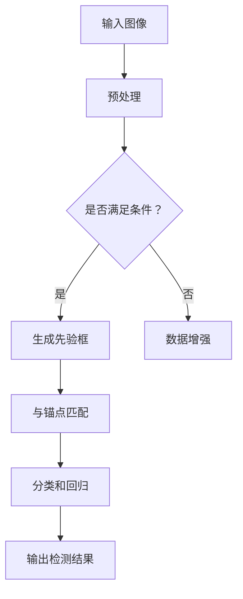

                 

关键词：深度学习，对象检测，计算机视觉，神经网络，映射，技术发展

> 摘要：本文旨在探讨基于深度学习的对象检测技术，通过介绍其背景、核心概念、算法原理及实际应用，阐述其在计算机视觉领域的广泛应用和未来发展趋势。

## 1. 背景介绍

### 1.1 深度学习与计算机视觉

深度学习作为人工智能领域的重要分支，已经在图像识别、自然语言处理等领域取得了显著成就。计算机视觉作为人工智能的重要应用领域之一，旨在让计算机理解和解释图像及视频内容。对象检测是计算机视觉的一个关键任务，旨在识别图像中的特定对象，并定位其在图像中的位置。随着深度学习技术的发展，基于深度学习的对象检测技术逐渐成为研究热点。

### 1.2 对象检测的重要性

对象检测技术在许多实际应用中具有重要意义。例如，在自动驾驶领域，需要检测道路上的车辆、行人、交通标志等；在智能监控领域，需要检测异常行为、入侵者等；在医学图像分析领域，需要检测病变区域等。有效、准确的对象检测技术对于提高这些领域的自动化水平和智能化程度具有重要意义。

## 2. 核心概念与联系

### 2.1 深度学习基础概念

深度学习是一种基于人工神经网络的机器学习技术，通过模拟人脑神经网络的结构和功能，对大量数据进行分析和处理。深度学习模型通常由多个隐藏层组成，从而具有强大的非线性表示能力。

### 2.2 对象检测相关概念

对象检测涉及以下关键概念：

- **边界框（Bounding Box）**：用于表示对象在图像中的位置和大小。
- **先验框（Prior Box）**：用于初始化对象检测的候选区域。
- **锚点（Anchor）**：用于表示先验框的具体位置和尺寸。
- **分类（Classification）**：用于判断检测到的对象属于哪个类别。
- **回归（Regression）**：用于修正锚点的位置和大小，以更好地匹配实际对象。

### 2.3 Mermaid 流程图



## 3. 核心算法原理 & 具体操作步骤

### 3.1 算法原理概述

基于深度学习的对象检测算法主要分为以下两类：

- **单阶段检测器（One-stage Detector）**：直接从输入图像中检测对象，如SSD（Single Shot MultiBox Detector）。
- **多阶段检测器（Two-stage Detector）**：先通过候选区域生成，再对候选区域进行精确检测，如Faster R-CNN（Region-based Convolutional Neural Network）。

### 3.2 算法步骤详解

以Faster R-CNN为例，其基本步骤如下：

1. **特征提取**：使用卷积神经网络提取图像特征。
2. **候选区域生成**：使用区域提议网络（Region Proposal Network，RPN）生成候选区域。
3. **候选区域分类和回归**：对候选区域进行分类和回归，修正锚点位置和大小。
4. **非极大值抑制（Non-maximum Suppression，NMS）**：去除重叠的边界框。
5. **输出检测结果**：输出检测到的对象类别及其位置。

### 3.3 算法优缺点

#### 3.3.1 优缺点

- **单阶段检测器**：检测速度快，但准确度相对较低。
- **多阶段检测器**：准确度高，但检测速度相对较慢。

#### 3.3.2 应用领域

- **单阶段检测器**：适用于实时性要求较高的场景，如视频监控、实时图像处理等。
- **多阶段检测器**：适用于对检测准确度要求较高的场景，如自动驾驶、医学图像分析等。

## 4. 数学模型和公式 & 详细讲解 & 举例说明

### 4.1 数学模型构建

深度学习中的对象检测算法通常涉及以下数学模型：

- **卷积神经网络（Convolutional Neural Network，CNN）**：用于提取图像特征。
- **区域提议网络（Region Proposal Network，RPN）**：用于生成候选区域。
- **分类器（Classifier）**：用于判断对象类别。
- **回归器（Regressor）**：用于修正锚点位置和大小。

### 4.2 公式推导过程

#### 4.2.1 卷积神经网络

假设输入图像为$X \in \mathbb{R}^{H \times W \times C}$，卷积核为$K \in \mathbb{R}^{K_H \times K_W \times C}$，卷积后的特征图为$F \in \mathbb{R}^{H' \times W' \times C'}$，则有：

$$
F_{ijcl} = \sum_{h=1}^{K_H} \sum_{w=1}^{K_W} \sum_{c=1}^{C} K_{hwc} X_{(i+h-C/2) \times (j+w-C/2) \times c}
$$

其中，$(i, j)$为卷积操作的位置，$c$为输入通道，$l$为输出通道。

#### 4.2.2 区域提议网络

假设特征图为$F \in \mathbb{R}^{H' \times W' \times C'}$，先验框为$A \in \mathbb{R}^{N \times 4}$，则有：

$$
\text{RPN}(\text{ROI}, A) = (\text{cls}, \text{reg})
$$

其中，$\text{ROI}$为特征图中的区域，$\text{cls}$为分类结果，$\text{reg}$为回归结果。

#### 4.2.3 分类器和回归器

假设分类器和回归器分别为$C \in \mathbb{R}^{N \times C}$和$R \in \mathbb{R}^{N \times 4}$，则有：

$$
\text{cls}(x) = \text{softmax}(C x)
$$

$$
\text{reg}(x, a) = a + R x
$$

其中，$x$为输入特征，$a$为锚点，$C$为类别数。

### 4.3 案例分析与讲解

以Faster R-CNN为例，其数学模型如下：

1. **特征提取**：

$$
F = \text{CNN}(X)
$$

2. **区域提议网络**：

$$
(\text{cls}, \text{reg}) = \text{RPN}(F, A)
$$

3. **候选区域分类和回归**：

$$
(\text{cls}', \text{reg}') = (\text{cls}(\text{ROI}), \text{reg}(\text{ROI}, A))
$$

4. **非极大值抑制**：

$$
\text{dets} = \text{NMS}(\text{cls}', \text{reg}')
$$

5. **输出检测结果**：

$$
\text{dets} = (\text{cls}_{\text{dets}}, \text{reg}_{\text{dets}}, \text{img}_{\text{dets}})
$$

其中，$\text{ROI}$为候选区域，$\text{img}_{\text{dets}}$为对应图像。

## 5. 项目实践：代码实例和详细解释说明

### 5.1 开发环境搭建

在开始项目实践之前，我们需要搭建相应的开发环境。以下是一个基于Python和TensorFlow的示例：

```python
# 安装必要的库
!pip install tensorflow
!pip install opencv-python
```

### 5.2 源代码详细实现

以下是一个简单的对象检测项目实例：

```python
import tensorflow as tf
import numpy as np
import cv2

# 加载预训练模型
model = tf.keras.models.load_model('faster_rcnn_model.h5')

# 加载测试图像
img = cv2.imread('test_image.jpg')

# 将图像输入到模型中
input_img = tf.convert_to_tensor(np.expand_dims(img, 0), dtype=tf.float32)

# 执行对象检测
detections = model.predict(input_img)

# 解析检测结果
dets = detections[0]

# 应用非极大值抑制
dets = non_max_suppression(dets, 0.5)

# 绘制检测结果
for det in dets:
    bbox = det[:4]
    cls = det[4]
    cv2.rectangle(img, (int(bbox[0]), int(bbox[1])), (int(bbox[2]), int(bbox[3])), (0, 255, 0), 2)
    cv2.putText(img, f'{cls}: {detection_scores:.2f}', (int(bbox[0]), int(bbox[1])), cv2.FONT_HERSHEY_SIMPLEX, 0.5, (255, 0, 0), 2)

# 显示检测结果
cv2.imshow('Detection Results', img)
cv2.waitKey(0)
cv2.destroyAllWindows()
```

### 5.3 代码解读与分析

上述代码主要实现了以下步骤：

1. **加载预训练模型**：使用TensorFlow加载已经训练好的Faster R-CNN模型。
2. **加载测试图像**：使用OpenCV读取测试图像。
3. **将图像输入到模型中**：将图像转换为TensorFlow张量，并输入到模型中。
4. **执行对象检测**：使用模型进行预测，得到检测结果。
5. **解析检测结果**：将检测结果转换为边界框和类别信息。
6. **绘制检测结果**：使用OpenCV绘制检测结果，并在图像上显示检测到的对象及其概率。
7. **显示检测结果**：显示检测结果。

## 6. 实际应用场景

### 6.1 自动驾驶

自动驾驶系统中，对象检测技术至关重要。通过检测道路上的车辆、行人、交通标志等，自动驾驶系统能够更好地理解和交互周围环境，提高行驶安全性。

### 6.2 智能监控

智能监控系统中，对象检测技术可以用于实时监控并识别异常行为和入侵者，从而提供更加智能和高效的监控解决方案。

### 6.3 医学图像分析

医学图像分析中，对象检测技术可以用于检测病变区域、器官等，辅助医生进行诊断和治疗。

## 7. 未来应用展望

随着深度学习技术的不断发展，对象检测技术在计算机视觉领域的应用前景十分广阔。以下是一些未来应用展望：

- **更高效的检测算法**：研究更高效、更准确的检测算法，以满足实时性要求。
- **多模态检测**：结合不同模态的数据（如图像、声音等），提高检测准确度。
- **无监督学习和半监督学习**：研究无监督学习和半监督学习算法，减少对大量标注数据的依赖。

## 8. 总结：未来发展趋势与挑战

### 8.1 研究成果总结

近年来，基于深度学习的对象检测技术取得了显著进展。多阶段检测器和单阶段检测器在准确度和实时性方面均有所提高，为实际应用提供了更多选择。

### 8.2 未来发展趋势

- **算法优化**：研究更高效的算法结构和优化方法，提高检测速度和准确度。
- **跨领域应用**：探索对象检测技术在更多领域的应用，如医疗、金融、安防等。
- **数据集扩展**：构建更多、更丰富的数据集，提高模型泛化能力。

### 8.3 面临的挑战

- **计算资源**：训练深度学习模型需要大量计算资源，如何优化计算效率是一个重要挑战。
- **标注数据**：标注高质量、大量的数据集是一个耗时、耗力的过程，如何减少对标注数据的依赖是另一个挑战。

### 8.4 研究展望

未来，随着深度学习技术的不断发展，对象检测技术将进一步提高准确度和实时性，并在更多领域得到广泛应用。同时，无监督学习和半监督学习等新方法的研究也将为对象检测技术带来新的突破。

## 9. 附录：常见问题与解答

### 9.1 如何训练深度学习模型？

- **数据准备**：收集并清洗大量标注数据。
- **模型选择**：选择合适的模型架构，如Faster R-CNN、SSD等。
- **训练配置**：设置合适的训练参数，如学习率、迭代次数等。
- **训练过程**：使用TensorFlow等深度学习框架进行模型训练。

### 9.2 对象检测算法如何提高准确度？

- **数据增强**：使用数据增强方法扩充数据集，提高模型泛化能力。
- **多尺度检测**：使用不同尺度的检测框，提高对小对象的检测能力。
- **特征融合**：结合多层次的卷积特征，提高模型表示能力。

## 作者署名

作者：禅与计算机程序设计艺术 / Zen and the Art of Computer Programming
----------------------------------------------------------------

以上是文章的完整正文部分，接下来我们将按照markdown格式进行排版，并确保文章的格式和结构符合要求。

