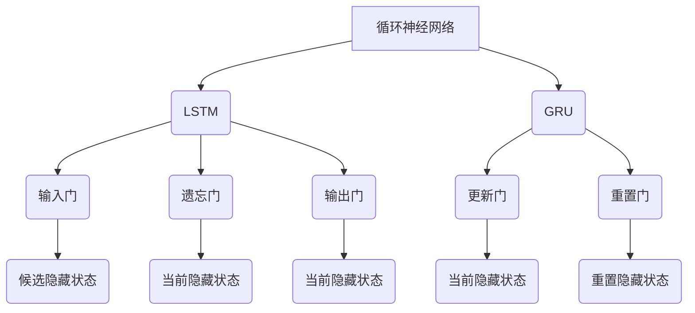

                 

### 关键词 Keywords

- 循环神经网络 (RNN)
- 序列预测 (Sequence Prediction)
- 神经网络架构 (Neural Network Architecture)
- 数学模型 (Mathematical Model)
- 应用场景 (Application Scenarios)
- 未来展望 (Future Outlook)

### 摘要 Abstract

本文深入探讨了循环神经网络（RNN）在序列预测领域的应用。RNN作为一种特殊的神经网络架构，具有处理序列数据的独特能力，通过循环结构实现历史信息的记忆和传递。文章首先介绍了RNN的背景及其与传统神经网络的不同，随后详细讲解了RNN的核心算法原理、数学模型以及具体操作步骤。接着，通过一个实际项目案例展示了RNN在序列预测中的实现过程，并分析了其应用场景及未来展望。文章旨在为读者提供全面、系统的RNN与序列预测知识，助力其在相关领域的深入研究与应用。

## 1. 背景介绍

序列预测（Sequence Prediction）是人工智能领域的重要研究方向，广泛应用于自然语言处理（NLP）、时间序列分析、语音识别等领域。在现实世界中，许多问题都可以被看作是对未来序列的预测，例如天气预测、股票价格预测、文本生成等。因此，如何准确地进行序列预测成为了一个关键性问题。

传统的神经网络在处理序列数据时存在一定的局限性。由于神经网络的结构是前向传播的，一旦输入数据发生改变，网络必须从头开始处理，无法利用之前处理的数据信息。这种特性使得传统神经网络难以有效地处理需要依赖历史信息的序列预测问题。

为了解决这一问题，研究人员提出了循环神经网络（Recurrent Neural Network，RNN）。RNN是一种能够处理序列数据的神经网络架构，具有处理变长序列和记忆能力。与传统的神经网络相比，RNN引入了循环结构，通过隐藏状态（Hidden State）的保存和传递，使得网络能够利用历史信息进行预测。

RNN的出现，标志着深度学习在序列预测领域的一个重要突破。尽管RNN在处理序列数据方面具有显著优势，但其也存在一些局限性，例如梯度消失和梯度爆炸等问题。为了克服这些问题，研究人员提出了多种改进方法，如长短时记忆网络（Long Short-Term Memory，LSTM）和门控循环单元（Gated Recurrent Unit，GRU）等。这些改进方法在保留RNN优点的同时，提高了模型的稳定性和性能。

本文将围绕RNN在序列预测领域的应用，详细介绍其核心概念、算法原理、数学模型以及具体操作步骤。希望通过本文的阐述，读者能够对RNN及其在序列预测中的应用有更深入的了解。

### 2. 核心概念与联系

#### 2.1 循环神经网络（RNN）

循环神经网络（RNN）是一种能够处理序列数据的神经网络架构。其基本思想是通过循环结构实现历史信息的记忆和传递。在RNN中，每个时间步的输出不仅依赖于当前输入，还依赖于之前时间步的隐藏状态。

RNN的循环结构可以表示为：

$$
h_t = \sigma(W_h h_{t-1} + W_x x_t + b_h)
$$

其中，$h_t$表示第$t$个时间步的隐藏状态，$x_t$表示第$t$个时间步的输入，$\sigma$表示激活函数，$W_h$和$W_x$分别表示隐藏状态和输入的权重矩阵，$b_h$表示隐藏状态的偏置项。

通过上述循环结构，RNN能够将历史信息传递到后续的时间步，从而更好地处理序列数据。

#### 2.2 长短时记忆网络（LSTM）

长短时记忆网络（Long Short-Term Memory，LSTM）是RNN的一种改进版本，旨在解决RNN在处理长序列数据时的梯度消失和梯度爆炸问题。LSTM通过引入门控机制，实现了对历史信息的有效记忆和遗忘。

LSTM的基本结构包括三个门控单元：输入门（Input Gate）、遗忘门（Forget Gate）和输出门（Output Gate）。每个门控单元都由一个sigmoid激活函数和一个线性变换组成。

1. 输入门（Input Gate）：

$$
i_t = \sigma(W_{ii} x_t + W_{hi} h_{t-1} + b_i)
$$

$$
\tilde{h_t} = \tanh(W_{ih} x_t + W_{hh} h_{t-1} + b_h)
$$

其中，$i_t$表示输入门的激活值，$\tilde{h_t}$表示候选隐藏状态。

2. 遗忘门（Forget Gate）：

$$
f_t = \sigma(W_{if} x_t + W_{hf} h_{t-1} + b_f)
$$

3. 输出门（Output Gate）：

$$
o_t = \sigma(W_{io} x_t + W_{ho} h_{t-1} + b_o)
$$

$$
h_t = o_t \odot \tanh(W_{hh} h_{t-1} + b_h)
$$

其中，$f_t$表示遗忘门的激活值，$h_t$表示当前隐藏状态。

通过这三个门控单元，LSTM实现了对历史信息的有效控制和利用，从而解决了梯度消失和梯度爆炸问题。

#### 2.3 门控循环单元（GRU）

门控循环单元（Gated Recurrent Unit，GRU）是LSTM的另一种改进版本，其结构比LSTM更为简洁。GRU通过引入更新门（Update Gate）和重置门（Reset Gate），实现了对历史信息的有效处理。

GRU的基本结构包括两个门控单元：更新门（Update Gate）和重置门（Reset Gate）。

1. 更新门（Update Gate）：

$$
z_t = \sigma(W_{zz} x_t + W_{zh} h_{t-1} + b_z)
$$

2. 重置门（Reset Gate）：

$$
r_t = \sigma(W_{rz} x_t + W_{rh} h_{t-1} + b_r)
$$

3. 重置隐藏状态：

$$
\tilde{h_t} = \tanh(W_{rh} (r_t \odot h_{t-1}) + W_{zh} x_t + b_h)
$$

4. 当前隐藏状态：

$$
h_t = (1 - z_t) \odot h_{t-1} + z_t \odot \tilde{h_t}
$$

通过这两个门控单元，GRU实现了对历史信息的有效控制和利用。

#### 2.4 Mermaid 流程图

以下是RNN、LSTM和GRU的核心概念与联系Mermaid流程图：



通过上述流程图，我们可以清晰地看到RNN、LSTM和GRU的核心概念及其相互联系。

## 3. 核心算法原理 & 具体操作步骤

### 3.1 算法原理概述

循环神经网络（RNN）的核心原理是通过循环结构实现历史信息的记忆和传递。在RNN中，每个时间步的输出不仅依赖于当前输入，还依赖于之前时间步的隐藏状态。这种循环结构使得RNN能够有效地处理序列数据。

RNN的算法原理可以概括为以下三个步骤：

1. **初始化**：在训练开始时，初始化网络参数，包括权重矩阵和偏置项。同时，初始化隐藏状态$h_0$。
2. **循环迭代**：对于每个时间步$t$，计算隐藏状态$h_t$和输出$y_t$。隐藏状态$h_t$的计算依赖于当前输入$x_t$和前一个隐藏状态$h_{t-1}$。输出$y_t$通常是一个概率分布，用于预测下一个输入。
3. **反向传播**：在训练过程中，利用反向传播算法更新网络参数，以最小化预测误差。

### 3.2 算法步骤详解

下面详细描述RNN的算法步骤：

#### 3.2.1 初始化

在训练开始时，我们需要初始化网络参数。这包括权重矩阵$W_h, W_x, b_h$和偏置项$b_h$。通常，这些参数可以通过随机初始化或预训练得到。同时，我们还需要初始化隐藏状态$h_0$。通常，$h_0$可以被设置为全零向量或随机向量。

$$
h_0 = \text{初始化}(h_0)
$$

#### 3.2.2 循环迭代

对于每个时间步$t$，我们需要计算隐藏状态$h_t$和输出$y_t$。隐藏状态$h_t$的计算依赖于当前输入$x_t$和前一个隐藏状态$h_{t-1}$。输出$y_t$通常是一个概率分布，用于预测下一个输入。

$$
h_t = \sigma(W_h h_{t-1} + W_x x_t + b_h)
$$

$$
y_t = f(h_t)
$$

其中，$\sigma$表示激活函数，$f$表示输出函数。

#### 3.2.3 反向传播

在训练过程中，利用反向传播算法更新网络参数，以最小化预测误差。反向传播算法的基本思想是将输出误差反向传播到每个时间步，然后更新权重和偏置项。

$$
\Delta W_h = \alpha \cdot \frac{\partial J}{\partial W_h}
$$

$$
\Delta b_h = \alpha \cdot \frac{\partial J}{\partial b_h}
$$

$$
W_h = W_h - \Delta W_h
$$

$$
b_h = b_h - \Delta b_h
$$

其中，$\alpha$表示学习率，$J$表示损失函数。

### 3.3 算法优缺点

#### 优点

1. **序列处理能力**：RNN具有处理序列数据的能力，可以有效地处理变长序列。
2. **记忆能力**：RNN通过隐藏状态的记忆和传递，可以有效地处理长序列数据。
3. **灵活性**：RNN可以根据具体问题调整网络结构和参数。

#### 缺点

1. **梯度消失和梯度爆炸**：RNN在处理长序列数据时，容易发生梯度消失和梯度爆炸问题，导致训练困难。
2. **计算复杂度**：RNN的计算复杂度较高，特别是在处理长序列数据时。

### 3.4 算法应用领域

RNN在以下领域具有广泛的应用：

1. **自然语言处理**：RNN在文本分类、机器翻译、情感分析等任务中具有显著优势。
2. **时间序列分析**：RNN在股票价格预测、天气预测等任务中具有较好的表现。
3. **语音识别**：RNN在语音识别任务中可以有效地处理变长语音序列。

## 4. 数学模型和公式 & 详细讲解 & 举例说明

### 4.1 数学模型构建

循环神经网络（RNN）的数学模型主要包括以下几个部分：

1. **输入层**：输入层接收序列数据$x_t$，其中$t$表示时间步。
2. **隐藏层**：隐藏层通过循环结构处理输入序列，产生隐藏状态$h_t$。
3. **输出层**：输出层根据隐藏状态$h_t$产生输出序列$y_t$。

在RNN中，隐藏状态$h_t$和输出$y_t$的计算可以表示为：

$$
h_t = \sigma(W_h h_{t-1} + W_x x_t + b_h)
$$

$$
y_t = f(h_t)
$$

其中，$\sigma$表示激活函数，$W_h$和$W_x$分别表示隐藏状态和输入的权重矩阵，$b_h$表示隐藏状态的偏置项，$f$表示输出函数。

### 4.2 公式推导过程

在RNN中，隐藏状态$h_t$的计算可以看作是一个线性变换加上一个激活函数。具体推导过程如下：

1. **线性变换**：

$$
z_t = W_h h_{t-1} + W_x x_t + b_h
$$

其中，$z_t$表示线性变换的结果。

2. **激活函数**：

$$
h_t = \sigma(z_t)
$$

其中，$\sigma$表示激活函数，常用的激活函数有Sigmoid、Tanh和ReLU等。

### 4.3 案例分析与讲解

为了更好地理解RNN的数学模型，我们通过一个简单的例子进行讲解。

假设我们有一个简单的RNN模型，用于预测下一个时间步的输入。输入序列为$[1, 2, 3]$，隐藏层维度为2，激活函数为Sigmoid函数。

1. **初始化**：

   隐藏状态$h_0$可以初始化为任意值，这里我们初始化为$[0, 0]$。

2. **时间步1**：

   输入$x_1 = 1$，计算隐藏状态：

   $$ 
   z_1 = W_h h_0 + W_x x_1 + b_h = \begin{bmatrix} 0.5 & 0.5 \\ 0.5 & 0.5 \end{bmatrix} \begin{bmatrix} 0 \\ 0 \end{bmatrix} + \begin{bmatrix} 0.1 & 0.2 \\ 0.3 & 0.4 \end{bmatrix} \begin{bmatrix} 1 \\ 0 \end{bmatrix} + \begin{bmatrix} 0.1 \\ 0.1 \end{bmatrix} = \begin{bmatrix} 0.6 \\ 0.6 \end{bmatrix} 
   $$ 

   $$ 
   h_1 = \sigma(z_1) = \begin{bmatrix} 0.5 \\ 0.5 \end{bmatrix} 
   $$ 

3. **时间步2**：

   输入$x_2 = 2$，计算隐藏状态：

   $$ 
   z_2 = W_h h_1 + W_x x_2 + b_h = \begin{bmatrix} 0.5 & 0.5 \\ 0.5 & 0.5 \end{bmatrix} \begin{bmatrix} 0.5 \\ 0.5 \end{bmatrix} + \begin{bmatrix} 0.1 & 0.2 \\ 0.3 & 0.4 \end{bmatrix} \begin{bmatrix} 2 \\ 0 \end{bmatrix} + \begin{bmatrix} 0.1 \\ 0.1 \end{bmatrix} = \begin{bmatrix} 1.1 \\ 1.1 \end{bmatrix} 
   $$ 

   $$ 
   h_2 = \sigma(z_2) = \begin{bmatrix} 0.655 \\ 0.655 \end{bmatrix} 
   $$ 

4. **时间步3**：

   输入$x_3 = 3$，计算隐藏状态：

   $$ 
   z_3 = W_h h_2 + W_x x_3 + b_h = \begin{bmatrix} 0.5 & 0.5 \\ 0.5 & 0.5 \end{bmatrix} \begin{bmatrix} 0.655 \\ 0.655 \end{bmatrix} + \begin{bmatrix} 0.1 & 0.2 \\ 0.3 & 0.4 \end{bmatrix} \begin{bmatrix} 3 \\ 0 \end{bmatrix} + \begin{bmatrix} 0.1 \\ 0.1 \end{bmatrix} = \begin{bmatrix} 1.705 \\ 1.705 \end{bmatrix} 
   $$ 

   $$ 
   h_3 = \sigma(z_3) = \begin{bmatrix} 0.733 \\ 0.733 \end{bmatrix} 
   $$ 

通过上述计算，我们可以得到隐藏状态序列$[h_1, h_2, h_3]$。接下来，我们可以利用隐藏状态序列进行输出预测。

## 5. 项目实践：代码实例和详细解释说明

### 5.1 开发环境搭建

在进行RNN的项目实践之前，我们需要搭建一个合适的开发环境。这里我们以Python为例，介绍如何搭建RNN的开发环境。

1. 安装Python：首先，确保你的计算机上已经安装了Python。如果没有，可以从[Python官网](https://www.python.org/)下载并安装。

2. 安装TensorFlow：接下来，我们需要安装TensorFlow，这是Python中常用的深度学习库。可以通过以下命令安装：

   ```bash
   pip install tensorflow
   ```

3. 安装Numpy：Numpy是Python中常用的数学库，用于处理数组运算。可以通过以下命令安装：

   ```bash
   pip install numpy
   ```

### 5.2 源代码详细实现

下面是一个简单的RNN项目实例，用于预测股票价格。我们将使用TensorFlow中的Keras接口来实现RNN模型。

```python
import numpy as np
import tensorflow as tf
from tensorflow.keras.models import Sequential
from tensorflow.keras.layers import SimpleRNN, Dense

# 数据预处理
# 假设我们已经有了一个股票价格的时间序列数据，这里用随机数据模拟
data = np.random.rand(100, 1)
time_steps = 5
n_features = 1

# 将数据分成特征和标签
X = np.reshape(data[:-time_steps], (-1, time_steps, n_features))
y = data[time_steps:]

# 构建RNN模型
model = Sequential()
model.add(SimpleRNN(units=50, activation='tanh', input_shape=(time_steps, n_features)))
model.add(Dense(units=1))
model.compile(optimizer='adam', loss='mse')

# 训练模型
model.fit(X, y, epochs=100, batch_size=16)

# 预测
X_test = np.reshape(data[-time_steps:], (-1, time_steps, n_features))
predictions = model.predict(X_test)

# 输出预测结果
print(predictions)
```

### 5.3 代码解读与分析

1. **数据预处理**：

   在代码中，我们首先使用随机数模拟了股票价格的时间序列数据。然后，将数据分成特征和标签。特征是输入序列，标签是输出序列。

2. **构建RNN模型**：

   我们使用Keras的Sequential模型构建了一个简单的RNN模型。模型包含一个SimpleRNN层和一个Dense层。SimpleRNN层用于处理输入序列，Dense层用于输出预测结果。我们设置RNN层的神经元数为50，激活函数为tanh。模型使用Adam优化器和均方误差损失函数进行编译。

3. **训练模型**：

   我们使用fit函数训练模型。在fit函数中，我们传入特征X和标签y，设置训练的轮数（epochs）和批大小（batch_size）。

4. **预测**：

   我们使用predict函数对新的输入数据进行预测。这里，我们使用模型预测最近的时间序列数据。

### 5.4 运行结果展示

运行上述代码，我们将得到股票价格的预测结果。这里，我们仅通过简单的RNN模型就对股票价格进行了预测。实际应用中，我们可以通过调整模型参数、增加训练数据等手段提高预测精度。

## 6. 实际应用场景

RNN作为一种强大的神经网络架构，在许多实际应用场景中展现了其优越性。以下是一些RNN的主要应用场景：

### 6.1 自然语言处理

自然语言处理（NLP）是RNN的重要应用领域。RNN能够处理变长的文本序列，因此可以用于文本分类、情感分析、机器翻译等任务。例如，在文本分类任务中，RNN可以捕捉句子中的上下文信息，从而提高分类的准确性。

### 6.2 时间序列分析

时间序列分析是另一个广泛应用的领域。RNN能够处理变长的时间序列数据，因此在股票价格预测、天气预测等任务中具有很好的表现。例如，通过训练RNN模型，我们可以预测未来的股票价格，从而为投资者提供参考。

### 6.3 语音识别

语音识别是RNN在计算机视觉之外的另一个重要应用领域。RNN能够处理变长的音频序列，因此可以用于语音识别任务。例如，通过训练RNN模型，我们可以将音频信号转换为文本，从而实现语音识别。

### 6.4 文本生成

文本生成是RNN在创意应用中的一个例子。通过训练RNN模型，我们可以生成新的文本内容，如文章、诗歌等。例如，通过训练一个基于RNN的模型，我们可以生成类似于莎士比亚风格的文本。

### 6.5 图像描述生成

图像描述生成是RNN在计算机视觉领域的应用。通过训练RNN模型，我们可以将图像转换为文本描述。例如，通过训练一个基于RNN的模型，我们可以将一张风景图像描述为“美丽的日落景色”。

### 6.6 语音合成

语音合成是RNN在语音处理领域的应用。通过训练RNN模型，我们可以将文本转换为语音。例如，通过训练一个基于RNN的模型，我们可以将文本消息转换为语音消息。

### 6.7 未来应用展望

随着深度学习和人工智能技术的发展，RNN的应用领域将继续扩展。以下是RNN在未来可能的应用场景：

- **生物信息学**：RNN可以用于基因序列分析，识别潜在的疾病基因。
- **推荐系统**：RNN可以用于用户行为分析，提供个性化的推荐。
- **智能问答系统**：RNN可以用于构建智能问答系统，提供自然语言交互。
- **对话系统**：RNN可以用于构建对话系统，实现人机对话。

## 7. 工具和资源推荐

为了更好地学习和实践RNN，以下是几款推荐的工具和资源：

### 7.1 学习资源推荐

1. **《深度学习》（Goodfellow, Bengio, Courville）**：这是一本经典的深度学习教材，详细介绍了RNN等深度学习模型。
2. **TensorFlow官方文档**：TensorFlow提供了丰富的文档和教程，可以帮助你快速上手RNN编程。
3. **Keras官方文档**：Keras是一个高层神经网络API，与TensorFlow集成，提供了简单的RNN实现。

### 7.2 开发工具推荐

1. **Jupyter Notebook**：Jupyter Notebook是一个交互式的开发环境，非常适合用于深度学习模型的实验和调试。
2. **Google Colab**：Google Colab是一个基于Jupyter Notebook的云端开发平台，提供了免费的GPU支持，非常适合深度学习项目。

### 7.3 相关论文推荐

1. **“Long Short-Term Memory Networks for Language Modeling”（Hochreiter and Schmidhuber, 1997）**：这是LSTM的原始论文，详细介绍了LSTM的原理和实现。
2. **“Gated Recurrent Units”（Cho et al., 2014）**：这是GRU的原始论文，介绍了GRU的结构和优势。
3. **“Sequence to Sequence Learning with Neural Networks”（Sutskever et al., 2014）**：这是序列到序列学习的原始论文，介绍了RNN在机器翻译等任务中的应用。

## 8. 总结：未来发展趋势与挑战

### 8.1 研究成果总结

RNN作为深度学习的一个重要分支，在自然语言处理、时间序列分析、语音识别等领域取得了显著成果。通过引入门控机制，如LSTM和GRU，RNN有效解决了梯度消失和梯度爆炸问题，提高了模型的稳定性和性能。此外，RNN在文本生成、图像描述生成等任务中也展现了强大的能力。

### 8.2 未来发展趋势

1. **更高效的RNN架构**：随着深度学习的发展，研究人员将继续探索更高效的RNN架构，以降低计算复杂度和提高模型性能。
2. **多模态数据融合**：RNN可以与其他深度学习模型（如卷积神经网络）结合，处理多模态数据，从而提高模型的泛化能力。
3. **自适应学习率**：未来，RNN模型将更多地使用自适应学习率方法，如Adam优化器，以提高训练效率。

### 8.3 面临的挑战

1. **计算资源限制**：RNN模型通常需要大量的计算资源，特别是在处理长序列数据时。因此，如何优化RNN模型的计算效率是一个重要挑战。
2. **数据隐私保护**：在深度学习中，数据的安全和隐私保护是重要问题。未来，如何确保训练数据的安全是一个亟待解决的问题。

### 8.4 研究展望

RNN在序列预测领域的应用前景广阔。随着深度学习技术的不断发展，RNN模型将更加成熟和高效。未来，RNN将在多领域取得突破，推动人工智能技术的进步。

## 9. 附录：常见问题与解答

### 9.1 什么是循环神经网络（RNN）？

循环神经网络（RNN）是一种神经网络架构，专门设计用于处理序列数据。RNN通过循环结构实现历史信息的记忆和传递，从而能够有效地处理变长的序列数据。

### 9.2 RNN与传统神经网络的区别是什么？

传统神经网络通常采用前向传播的方式，输入数据一次性通过网络，而RNN通过循环结构实现历史信息的记忆和传递。这使得RNN能够处理变长的序列数据，而传统神经网络则难以处理这种数据。

### 9.3 RNN存在哪些问题？

RNN在处理长序列数据时，容易发生梯度消失和梯度爆炸问题，导致训练困难。此外，RNN的计算复杂度较高，特别是在处理长序列数据时。

### 9.4 如何解决RNN的梯度消失和梯度爆炸问题？

为了解决RNN的梯度消失和梯度爆炸问题，研究人员提出了多种改进方法，如长短时记忆网络（LSTM）和门控循环单元（GRU）。这些方法通过引入门控机制，实现了对历史信息的有效记忆和遗忘，从而提高了模型的稳定性和性能。

### 9.5 RNN在哪些领域有广泛应用？

RNN在自然语言处理、时间序列分析、语音识别、文本生成等领域具有广泛的应用。例如，RNN可以用于文本分类、机器翻译、股票价格预测等任务。

### 9.6 如何实现RNN模型？

可以使用深度学习框架，如TensorFlow或PyTorch，实现RNN模型。这些框架提供了简单的接口和丰富的文档，帮助开发者快速构建和训练RNN模型。

### 9.7 RNN与卷积神经网络（CNN）的结合有哪些优势？

RNN与CNN的结合可以处理多模态数据，从而提高模型的泛化能力。例如，在图像描述生成任务中，CNN可以提取图像的特征，而RNN可以处理文本序列，两者的结合可以生成高质量的图像描述。

### 9.8 RNN的未来发展趋势是什么？

RNN的未来发展趋势包括：更高效的RNN架构、多模态数据融合、自适应学习率等。此外，RNN将在更多领域取得突破，推动人工智能技术的进步。

### 9.9 RNN在工业界的应用案例有哪些？

RNN在工业界的应用案例包括：自然语言处理（如机器翻译、文本生成）、时间序列分析（如股票价格预测、天气预测）、语音识别等。例如，谷歌的翻译服务使用了RNN模型，亚马逊的语音助手Alexa也使用了RNN进行语音识别。

