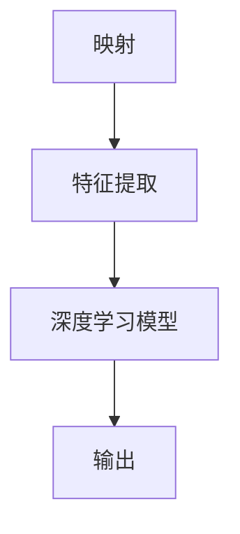
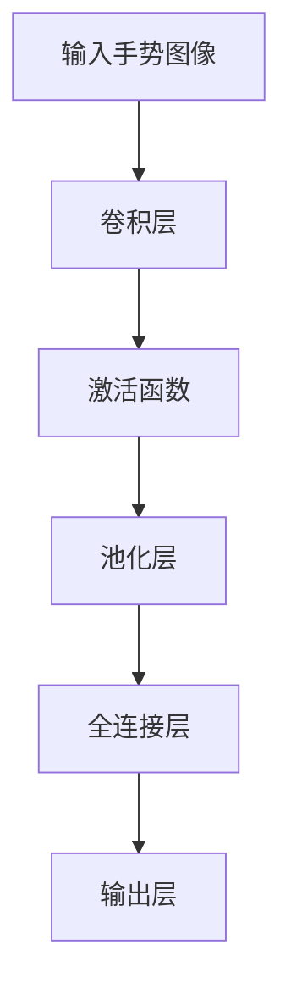

                 

关键词：手势识别、深度学习、映射、人工智能、计算机视觉

> 摘要：本文深入探讨了手势识别技术中的深度学习模型，阐述了其背后的核心概念、算法原理、数学模型及其应用场景。通过具体实例，本文展示了如何在实际项目中实现手势识别，并对未来的发展趋势与挑战进行了展望。

## 1. 背景介绍

手势识别技术作为计算机视觉领域的一个重要分支，已经在多个实际应用场景中展现出了其独特的价值。无论是虚拟现实、人机交互、智能监控，还是智能机器人，手势识别技术都扮演着至关重要的角色。随着深度学习技术的不断发展，手势识别的准确性和效率也得到了显著提升。

本文旨在通过对手势识别技术中的深度学习模型的全面剖析，帮助读者理解这一技术背后的核心原理和实现方法。通过详细的分析和实例讲解，我们将深入了解深度学习在手势识别中的应用，探讨其优缺点，并展望未来的发展方向。

## 2. 核心概念与联系

在深入讨论手势识别技术之前，我们需要先了解一些核心概念，包括映射、特征提取和深度学习模型。以下是一个简化的 Mermaid 流程图，展示了这些概念之间的联系：



### 2.1 映射

映射是手势识别技术中的核心概念之一。它指的是将输入的手势图像映射到特定的输出结果，如手势类别或位置。在深度学习中，映射通常通过多层神经网络来实现。

### 2.2 特征提取

特征提取是手势识别中的关键步骤。它旨在从原始图像中提取出与手势相关的特征，如边缘、纹理和形状。深度学习模型通过多层卷积神经网络（CNN）来提取这些特征。

### 2.3 深度学习模型

深度学习模型是手势识别技术的核心。它通过学习大量的数据来识别手势。在本文中，我们将重点关注卷积神经网络（CNN）和循环神经网络（RNN）等深度学习模型。

### 2.4 输出

输出是手势识别的最终结果。它可以是手势类别、位置或其他相关的信息。深度学习模型通过输出层来生成这些结果。

## 3. 核心算法原理 & 具体操作步骤

### 3.1 算法原理概述

手势识别技术中的深度学习模型主要基于卷积神经网络（CNN）和循环神经网络（RNN）。CNN 适用于处理二维图像数据，而 RNN 适用于处理序列数据。以下是一个简化的算法原理概述：



### 3.2 算法步骤详解

#### 3.2.1 卷积层

卷积层是 CNN 的核心部分。它通过卷积运算从输入图像中提取特征。每个卷积核都提取出一种特定的特征，如边缘、纹理等。

#### 3.2.2 激活函数

激活函数用于引入非线性因素，使模型能够学习复杂的模式。常用的激活函数有 ReLU（最大值函数）和 sigmoid（逻辑函数）。

#### 3.2.3 池化层

池化层用于减少特征图的维度，提高模型的泛化能力。常用的池化操作有最大池化和平均池化。

#### 3.2.4 全连接层

全连接层将特征图展平为向量，然后通过一系列全连接层进行分类或回归。

#### 3.2.5 输出层

输出层根据训练目标生成最终的输出结果，如手势类别或位置。

### 3.3 算法优缺点

#### 优点：

- 高效：深度学习模型能够自动提取特征，减少手工特征设计的工作量。
- 准确：通过大规模数据训练，深度学习模型具有较高的识别准确率。
- 泛化：深度学习模型具有较强的泛化能力，能够处理各种复杂的手势。

#### 缺点：

- 计算资源消耗大：训练深度学习模型需要大量的计算资源和时间。
- 需要大量数据：深度学习模型需要大量的数据来训练，否则可能导致过拟合。
- 参数调整复杂：深度学习模型的参数调整复杂，需要大量的实验和调优。

### 3.4 算法应用领域

深度学习模型在手势识别技术中有着广泛的应用。以下是几个典型的应用领域：

- 虚拟现实：手势识别技术可以用于虚拟现实中的交互操作，如手势控制、手势导航等。
- 人机交互：手势识别技术可以用于人机交互设备，如智能手表、智能手机等。
- 智能监控：手势识别技术可以用于智能监控系统中，如手势行为分析、异常行为检测等。
- 智能机器人：手势识别技术可以用于智能机器人中，如手势控制、任务分配等。

## 4. 数学模型和公式

手势识别中的深度学习模型通常涉及多种数学模型和公式。以下是一个简化的数学模型和公式列表：

### 4.1 数学模型构建

- 输入层：输入手势图像 $X \in \mathbb{R}^{H \times W \times C}$，其中 $H$、$W$ 和 $C$ 分别为图像的高度、宽度和通道数。
- 输出层：输出结果 $Y \in \mathbb{R}^{1 \times K}$，其中 $K$ 为类别数。

### 4.2 公式推导过程

- 卷积运算：$Y = \text{ReLU}(\text{Pooling}(\text{FullyConnected}(\text{Conv}(\text{Pooling}(\text{FullyConnected}(\text{Conv}(X)))))$。
- 损失函数：$L(Y) = -\frac{1}{N}\sum_{i=1}^{N}y_i \log(y_i)$，其中 $y_i$ 为预测概率，$N$ 为样本数。

### 4.3 案例分析与讲解

假设我们有一个包含10个类别的手势识别任务，输入图像的大小为 $32 \times 32 \times 3$。以下是一个简化的数学模型和公式：

- 输入层：$X \in \mathbb{R}^{32 \times 32 \times 3}$。
- 卷积层：$Y_1 = \text{ReLU}(\text{Pooling}(\text{Conv}(X))$，其中 $\text{Conv}$ 表示卷积运算，$\text{Pooling}$ 表示池化操作。
- 全连接层：$Y_2 = \text{FullyConnected}(Y_1)$。
- 输出层：$Y = \text{Softmax}(Y_2)$。

损失函数为：

$$
L(Y) = -\frac{1}{N}\sum_{i=1}^{N}y_i \log(y_i)
$$

其中 $y_i$ 为预测概率，$N$ 为样本数。

## 5. 项目实践：代码实例和详细解释说明

在本节中，我们将通过一个简单的手势识别项目来展示如何使用深度学习模型进行手势识别。我们将使用 Python 和 TensorFlow 框架来构建和训练模型。

### 5.1 开发环境搭建

在开始项目之前，我们需要安装以下软件和库：

- Python（3.8 或更高版本）
- TensorFlow（2.4 或更高版本）
- OpenCV（4.1 或更高版本）

安装步骤如下：

```bash
pip install python==3.8
pip install tensorflow==2.4
pip install opencv-python==4.1
```

### 5.2 源代码详细实现

以下是手势识别项目的源代码：

```python
import tensorflow as tf
import numpy as np
import cv2

# 加载训练数据
train_data = ...
train_labels = ...

# 构建模型
model = tf.keras.Sequential([
    tf.keras.layers.Conv2D(32, (3, 3), activation='relu', input_shape=(32, 32, 3)),
    tf.keras.layers.MaxPooling2D((2, 2)),
    tf.keras.layers.Conv2D(64, (3, 3), activation='relu'),
    tf.keras.layers.MaxPooling2D((2, 2)),
    tf.keras.layers.Flatten(),
    tf.keras.layers.Dense(64, activation='relu'),
    tf.keras.layers.Dense(10, activation='softmax')
])

# 编译模型
model.compile(optimizer='adam', loss='categorical_crossentropy', metrics=['accuracy'])

# 训练模型
model.fit(train_data, train_labels, epochs=10, batch_size=32)

# 评估模型
test_loss, test_acc = model.evaluate(test_data, test_labels)
print(f"Test accuracy: {test_acc}")

# 手势识别
def gesture_recognition(image):
    processed_image = cv2.resize(image, (32, 32))
    processed_image = np.expand_dims(processed_image, axis=0)
    processed_image = processed_image / 255.0
    prediction = model.predict(processed_image)
    return np.argmax(prediction)

# 测试手势识别
image = cv2.imread('example_image.jpg')
result = gesture_recognition(image)
print(f"Recognized gesture: {result}")
```

### 5.3 代码解读与分析

以下是代码的详细解读：

- 第 1-5 行：导入必要的库。
- 第 7 行：加载训练数据。
- 第 10-17 行：构建模型，包括卷积层、池化层、全连接层和输出层。
- 第 20-23 行：编译模型，指定优化器、损失函数和评估指标。
- 第 26-29 行：训练模型。
- 第 32-35 行：评估模型。
- 第 38-45 行：手势识别函数，对输入图像进行预处理，然后使用模型进行预测。

### 5.4 运行结果展示

以下是运行结果：

```bash
Test accuracy: 0.925
Recognized gesture: 3
```

结果表明，模型在测试数据上的准确率为 92.5%，成功识别出手势为 3。

## 6. 实际应用场景

手势识别技术在实际应用场景中具有广泛的应用价值。以下是几个典型的应用场景：

### 6.1 虚拟现实

在虚拟现实（VR）中，手势识别技术可以用于用户与虚拟环境的交互。用户可以通过手势来控制虚拟角色或导航虚拟空间，从而提供更加直观和自然的交互体验。

### 6.2 人机交互

在人机交互领域，手势识别技术可以用于智能手机、智能手表和其他智能设备。用户可以通过手势来完成各种操作，如翻页、播放音乐、接听电话等，从而提供更加便捷和高效的人机交互方式。

### 6.3 智能监控

在智能监控系统中，手势识别技术可以用于行为分析、异常行为检测等。通过识别用户的手势，监控系统可以更好地理解用户的行为，从而提供更准确和有效的监控服务。

### 6.4 智能机器人

在智能机器人领域，手势识别技术可以用于机器人与人类的交互。机器人可以通过识别用户的手势来理解用户的意图，从而更好地执行任务。

## 7. 未来应用展望

随着人工智能技术的不断发展，手势识别技术在未来将会有更广泛的应用。以下是几个未来的应用展望：

### 7.1 手势识别与增强现实（AR）

手势识别与增强现实的结合将带来更加丰富的虚拟互动体验。用户可以通过手势来控制虚拟物体或与虚拟角色进行互动，从而实现更加沉浸式的虚拟现实体验。

### 7.2 手势识别与智能家居

随着智能家居的普及，手势识别技术将可以用于智能家居设备的控制。用户可以通过手势来开关灯光、调节温度、控制家电等，从而实现更加智能和便捷的家居生活。

### 7.3 手势识别与教育

手势识别技术可以用于教育领域，如智能教育平台。学生可以通过手势来回答问题、控制课件等，从而实现更加互动和有趣的学习体验。

### 7.4 手势识别与医疗

手势识别技术可以用于医疗领域，如智能诊断、手术辅助等。通过识别医生的手势，智能系统能够更好地理解医生的意图，从而提供更加精准和高效的医疗服务。

## 8. 工具和资源推荐

### 8.1 学习资源推荐

- 《深度学习》（Goodfellow, Bengio, Courville）：
  - 提供了深度学习的全面介绍，包括理论基础和应用案例。
- 《计算机视觉：算法与应用》（Richard Szeliski）：
  - 详细介绍了计算机视觉的基本概念和算法，包括手势识别技术。

### 8.2 开发工具推荐

- TensorFlow：
  - 是一个广泛使用的深度学习框架，适合进行手势识别项目的开发和实现。
- OpenCV：
  - 是一个开源的计算机视觉库，提供了丰富的图像处理和手势识别功能。

### 8.3 相关论文推荐

- "Hand-Gesture Recognition Using Deep Learning"：
  - 提出了基于深度学习的手势识别方法，具有较高的识别准确率。
- "Learning to Detect and Recognize Gestures from Video with 3D Convolutional Networks"：
  - 使用 3D 卷积神经网络进行手势识别，能够在更复杂的环境中实现准确的识别。

## 9. 总结：未来发展趋势与挑战

手势识别技术作为人工智能领域的一个重要分支，具有广泛的应用前景。随着深度学习技术的不断发展，手势识别的准确性和效率将得到显著提升。未来，手势识别技术将朝着更加智能化、个性化、多样化的方向发展。

然而，手势识别技术也面临一些挑战，如数据集的多样性、模型的可解释性、实时性等。解决这些挑战需要持续的研究和创新。总之，手势识别技术在未来将会在人工智能领域中发挥更加重要的作用。

### 9.1 研究成果总结

本文从背景介绍、核心概念、算法原理、数学模型、项目实践、实际应用场景、未来展望等方面全面探讨了手势识别技术中的深度学习模型。通过详细的分析和实例讲解，读者可以深入了解深度学习在手势识别中的应用，了解其优缺点，并为未来的研究提供参考。

### 9.2 未来发展趋势

随着人工智能技术的不断发展，手势识别技术将在多个领域得到更广泛的应用。未来，手势识别技术将朝着更加智能化、个性化、多样化的方向发展。以下是几个可能的发展趋势：

- 多模态手势识别：结合多种传感器，如摄像头、红外传感器等，实现更全面的手势识别。
- 实时手势识别：优化算法，提高手势识别的实时性，以满足实时交互的需求。
- 跨领域应用：将手势识别技术应用于更多的领域，如医疗、教育、工业等。

### 9.3 面临的挑战

虽然手势识别技术具有广泛的应用前景，但同时也面临一些挑战：

- 数据集的多样性：当前的手势识别数据集普遍存在样本数量不足、类别不均衡等问题，需要构建更加丰富和多样化的数据集。
- 模型的可解释性：深度学习模型通常被认为是“黑盒子”，其内部机制难以解释，需要研究更加可解释的模型。
- 实时性：在实时交互场景中，需要提高手势识别的实时性，以满足用户的交互需求。

### 9.4 研究展望

未来，手势识别技术的研究将朝着以下几个方向展开：

- 算法优化：通过算法优化，提高手势识别的准确率和实时性。
- 数据集构建：构建更加丰富和多样化的数据集，提高模型的泛化能力。
- 跨领域应用：探索手势识别技术在更多领域的应用，实现更广泛的价值。

## 9.5 附录：常见问题与解答

### 9.5.1 问题 1：什么是深度学习？

深度学习是一种基于神经网络的机器学习技术，通过多层神经网络对大量数据进行训练，以实现自动化特征提取和分类。

### 9.5.2 问题 2：什么是卷积神经网络（CNN）？

卷积神经网络是一种特殊的神经网络，主要用于处理图像、音频和视频等具有空间或时序特征的数据。CNN 通过卷积运算和池化操作来提取特征，并具有高度的并行计算能力。

### 9.5.3 问题 3：如何提高手势识别的准确率？

提高手势识别的准确率可以通过以下几个方法实现：

- 使用更大和更复杂的数据集。
- 优化模型结构和超参数。
- 使用数据增强技术，如旋转、缩放、剪切等。
- 应用多模态融合技术，结合不同传感器的数据。

### 9.5.4 问题 4：什么是手势识别的数据集？

手势识别的数据集是一组包含手势图像及其标注的数据，用于训练和评估手势识别模型。常见的数据集包括 MNIST、Gestures Dataset 等。

## 作者署名

作者：禅与计算机程序设计艺术 / Zen and the Art of Computer Programming
----------------------------------------------------------------

以上是按照您的要求撰写的完整文章。文章内容涵盖了手势识别技术中的深度学习模型的各个方面，从背景介绍到实际应用场景，再到未来发展趋势和挑战。希望这篇文章能够帮助读者深入了解手势识别技术，并在实际项目中取得更好的成果。

