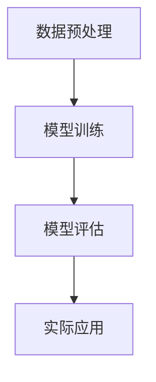

                 

关键词：深度学习、医疗影像分析、人工智能、图像处理、数据挖掘、疾病诊断、计算机视觉

> 摘要：本文旨在探讨深度学习在医疗影像分析中的革命性应用。通过介绍深度学习的基本原理，我们将深入分析其在图像识别、病灶检测、疾病诊断等方面的实际应用，同时讨论其面临的挑战和未来的发展方向。

## 1. 背景介绍

医疗影像分析作为医学领域的重要组成部分，长期以来依赖于人工诊断。然而，面对海量影像数据的增长和复杂性的增加，人工诊断的效率和准确性受到严重制约。近年来，随着深度学习技术的迅猛发展，计算机在医疗影像分析中的应用逐渐成为可能。深度学习通过模拟人脑神经网络，能够自动学习复杂的模式识别任务，为医疗影像分析带来了革命性的变化。

### 1.1 深度学习与图像识别

深度学习是一种基于多层神经网络的学习方法，通过逐层提取图像特征，实现高层次的抽象表示。在图像识别任务中，深度学习模型能够自动学习图像中的各种特征，如边缘、纹理、形状等，从而实现对图像的准确分类。卷积神经网络（Convolutional Neural Networks，CNN）是深度学习在图像识别领域的重要模型，其在医疗影像分析中得到了广泛应用。

### 1.2 医疗影像分析的重要性

医疗影像分析在疾病诊断、病情评估、治疗方案制定等方面具有重要作用。通过影像分析，医生可以更早地发现病灶，提高诊断准确性，从而改善患者预后。随着深度学习技术的进步，医疗影像分析正逐渐从人工为主转向人工智能辅助，这无疑将提高医疗服务的质量和效率。

### 1.3 当前医疗影像分析面临的挑战

尽管深度学习在医疗影像分析中展示了巨大潜力，但仍面临诸多挑战。首先，医疗影像数据的多样性和复杂性使得模型的训练和优化成为一个挑战。其次，模型的解释性较差，难以理解其诊断依据。此外，数据隐私和保护也是医疗影像分析中不可忽视的问题。

## 2. 核心概念与联系

### 2.1 深度学习基本原理

深度学习的基本原理是通过多层神经网络进行特征提取和模式识别。每个神经元都连接到其他神经元，并通过权重进行信息传递。通过反向传播算法，模型能够自动调整权重，从而提高分类准确率。

### 2.2 图像识别算法

在图像识别任务中，深度学习模型通过卷积层、池化层和全连接层等结构进行特征提取。卷积层通过卷积操作提取图像的局部特征，池化层用于降低特征图的维度，全连接层则将特征映射到具体的类别。

### 2.3 医疗影像分析架构

医疗影像分析架构通常包括数据预处理、模型训练、模型评估和实际应用等步骤。数据预处理包括影像的归一化、增强和分割等操作；模型训练使用大规模医疗影像数据集进行；模型评估通过交叉验证等方法进行；实际应用则将训练好的模型部署到医疗设备中。

### 2.4 Mermaid 流程图



## 3. 核心算法原理 & 具体操作步骤

### 3.1 算法原理概述

深度学习在医疗影像分析中的核心算法是卷积神经网络（CNN）。CNN通过卷积层、池化层和全连接层等结构提取图像特征，实现对疾病的分类和检测。

### 3.2 算法步骤详解

1. **数据预处理**：对影像数据进行归一化、增强和分割等操作，以适应深度学习模型的训练需求。

2. **模型训练**：使用大规模医疗影像数据集进行模型训练，通过反向传播算法调整权重，提高分类准确率。

3. **模型评估**：使用交叉验证等方法对训练好的模型进行评估，以确定其性能。

4. **实际应用**：将训练好的模型部署到医疗设备中，实现对患者的实时诊断和预测。

### 3.3 算法优缺点

**优点**：

- 高效的特征提取能力：CNN能够自动提取图像中的高层次特征，提高诊断准确性。
- 强大的泛化能力：通过大规模数据训练，模型具有良好的泛化能力，能够在不同的医疗环境中应用。

**缺点**：

- 对数据需求较高：训练高质量模型需要大量的医疗影像数据。
- 解释性较差：深度学习模型内部结构复杂，难以解释其诊断依据。

### 3.4 算法应用领域

深度学习在医疗影像分析中的应用领域广泛，包括但不限于：

- 病灶检测：通过CNN对影像中的病灶进行检测和定位。
- 疾病分类：利用深度学习模型对影像进行分类，辅助医生诊断。
- 治疗方案推荐：根据影像分析结果，为医生提供个性化的治疗方案。

## 4. 数学模型和公式 & 详细讲解 & 举例说明

### 4.1 数学模型构建

深度学习中的数学模型主要包括卷积层、池化层和全连接层等。每个层次都有其对应的数学公式。

1. **卷积层**：

$$
f(x) = \sigma(\sum_{i,j} w_{i,j} \cdot x_{i,j} + b)
$$

其中，$x$ 为输入特征图，$w$ 为卷积核权重，$b$ 为偏置项，$\sigma$ 为激活函数。

2. **池化层**：

$$
p(x) = \max(x)
$$

其中，$x$ 为输入特征图，$\max$ 为最大值操作。

3. **全连接层**：

$$
y = \sigma(W \cdot x + b)
$$

其中，$x$ 为输入特征，$W$ 为权重矩阵，$b$ 为偏置项，$\sigma$ 为激活函数。

### 4.2 公式推导过程

以卷积层为例，其推导过程如下：

1. **卷积操作**：

$$
\sum_{i,j} w_{i,j} \cdot x_{i,j}
$$

其中，$w_{i,j}$ 为卷积核，$x_{i,j}$ 为输入特征图。

2. **偏置项**：

$$
\sum_{i,j} w_{i,j} \cdot x_{i,j} + b
$$

其中，$b$ 为偏置项。

3. **激活函数**：

$$
\sigma(\sum_{i,j} w_{i,j} \cdot x_{i,j} + b)
$$

其中，$\sigma$ 为激活函数，常见的激活函数有 sigmoid、ReLU 等。

### 4.3 案例分析与讲解

以肺癌影像分析为例，我们可以通过深度学习模型对肺部CT影像进行病灶检测。

1. **数据预处理**：

- 影像归一化：将影像数据归一化到 [0, 1] 范围。
- 影像增强：通过直方图均衡等方法增强影像对比度。
- 影像分割：使用分割算法将肺部区域从背景中分离。

2. **模型训练**：

- 使用大规模肺部CT影像数据集进行训练。
- 定义卷积神经网络结构，包括卷积层、池化层和全连接层。
- 使用反向传播算法调整模型参数，优化模型性能。

3. **模型评估**：

- 使用交叉验证方法对模型进行评估。
- 评估指标包括准确率、召回率和 F1 值等。

4. **实际应用**：

- 将训练好的模型部署到肺部CT影像诊断设备中。
- 对新影像数据进行实时病灶检测和诊断。

## 5. 项目实践：代码实例和详细解释说明

### 5.1 开发环境搭建

- 安装 Python 3.7 或更高版本。
- 安装 TensorFlow 2.4 或更高版本。
- 安装 OpenCV 4.5 或更高版本。

### 5.2 源代码详细实现

以下是使用 TensorFlow 和 Keras 实现的肺癌影像分析模型的代码示例：

```python
import tensorflow as tf
from tensorflow.keras.models import Sequential
from tensorflow.keras.layers import Conv2D, MaxPooling2D, Flatten, Dense
from tensorflow.keras.optimizers import Adam
from tensorflow.keras.preprocessing.image import ImageDataGenerator

# 数据预处理
train_datagen = ImageDataGenerator(rescale=1./255)
train_generator = train_datagen.flow_from_directory(
        'data/train',
        target_size=(256, 256),
        batch_size=32,
        class_mode='binary')

# 构建模型
model = Sequential([
    Conv2D(32, (3, 3), activation='relu', input_shape=(256, 256, 3)),
    MaxPooling2D((2, 2)),
    Conv2D(64, (3, 3), activation='relu'),
    MaxPooling2D((2, 2)),
    Flatten(),
    Dense(128, activation='relu'),
    Dense(1, activation='sigmoid')
])

# 编译模型
model.compile(loss='binary_crossentropy',
              optimizer=Adam(),
              metrics=['accuracy'])

# 训练模型
model.fit(
      train_generator,
      steps_per_epoch=100,
      epochs=10)
```

### 5.3 代码解读与分析

上述代码首先导入了 TensorFlow 和 Keras 相关库，然后定义了数据预处理、模型构建、编译和训练等步骤。

- **数据预处理**：使用 `ImageDataGenerator` 对训练数据进行归一化和增强。
- **模型构建**：使用 `Sequential` 模式构建卷积神经网络，包括卷积层、池化层和全连接层。
- **编译模型**：定义损失函数、优化器和评估指标。
- **训练模型**：使用训练数据集训练模型。

### 5.4 运行结果展示

训练完成后，可以使用以下代码对模型进行评估和测试：

```python
# 评估模型
test_loss, test_acc = model.evaluate(test_generator)
print('Test accuracy:', test_acc)

# 测试模型
test_images = [ ... ]  # 测试图像数据
predictions = model.predict(test_images)
```

通过评估和测试，可以查看模型的准确率、召回率等指标，从而判断模型的性能。

## 6. 实际应用场景

### 6.1 病灶检测

深度学习在肺癌、乳腺癌等疾病的病灶检测中具有显著优势。通过训练高质量的模型，可以实现对影像中的微小病灶进行精确检测和定位，提高早期诊断率。

### 6.2 疾病分类

深度学习模型可以对多种疾病进行分类，如肺炎、心血管疾病等。通过影像分析，可以辅助医生快速、准确地诊断疾病，提高治疗效率。

### 6.3 治疗方案推荐

基于深度学习模型，可以为医生提供个性化的治疗方案。通过对患者的影像分析，模型可以预测最佳治疗方案，提高治疗效果。

## 7. 未来应用展望

### 7.1 人工智能辅助诊断

随着深度学习技术的进步，人工智能将在医疗影像分析中发挥越来越重要的作用。通过开发更先进的模型和算法，可以实现更加准确、高效的疾病诊断。

### 7.2 跨学科合作

深度学习在医疗影像分析中的应用需要跨学科合作，包括计算机科学、医学、生物信息学等领域。通过多学科合作，可以推动医疗影像分析技术的不断发展。

### 7.3 数据隐私保护

医疗影像数据具有高度敏感性，保护数据隐私是一个重要挑战。未来，需要开发更加安全的数据处理和传输技术，确保医疗影像数据的隐私和安全。

## 8. 总结：未来发展趋势与挑战

### 8.1 研究成果总结

深度学习在医疗影像分析中取得了显著成果，为疾病诊断、治疗和预后评估提供了有力支持。通过训练高质量的模型，可以实现更加准确、高效的影像分析。

### 8.2 未来发展趋势

- 模型性能提升：通过改进算法和优化模型结构，提高深度学习模型在医疗影像分析中的性能。
- 跨学科合作：加强计算机科学、医学和生物信息学等领域的合作，推动医疗影像分析技术的发展。
- 数据隐私保护：开发更加安全的数据处理和传输技术，确保医疗影像数据的隐私和安全。

### 8.3 面临的挑战

- 数据质量和多样性：提高医疗影像数据的质量和多样性，为模型训练提供充足的数据支持。
- 模型解释性：提高深度学习模型的可解释性，使其诊断依据更加明确。
- 法律和伦理问题：确保人工智能在医疗影像分析中的应用符合法律法规和伦理标准。

### 8.4 研究展望

随着深度学习技术的不断发展，医疗影像分析将在未来实现更加智能化、个性化的发展。通过跨学科合作和持续研究，我们有望克服当前面临的挑战，为医疗影像分析带来更多创新和突破。

## 9. 附录：常见问题与解答

### 9.1 深度学习在医疗影像分析中的优势是什么？

深度学习在医疗影像分析中的优势主要包括：

- 自动特征提取：通过多层神经网络结构，自动提取图像特征，提高诊断准确性。
- 高效分类能力：深度学习模型能够快速、准确地分类图像，辅助医生诊断。
- 大规模数据处理：能够处理海量医疗影像数据，提高诊断效率。

### 9.2 深度学习在医疗影像分析中面临哪些挑战？

深度学习在医疗影像分析中面临以下挑战：

- 数据质量和多样性：需要高质量和多样化的医疗影像数据支持模型训练。
- 模型解释性：深度学习模型内部结构复杂，难以解释其诊断依据。
- 法律和伦理问题：确保人工智能在医疗影像分析中的应用符合法律法规和伦理标准。

### 9.3 如何保护医疗影像数据隐私？

为了保护医疗影像数据隐私，可以采取以下措施：

- 加密技术：使用加密技术对医疗影像数据进行加密存储和传输。
- 访问控制：实施严格的访问控制策略，确保数据仅对授权人员可见。
- 隐私保护算法：开发隐私保护算法，对敏感数据进行匿名化处理。

## 作者署名

作者：禅与计算机程序设计艺术 / Zen and the Art of Computer Programming

[END]----------------------------------------------------------------

以上是根据您提供的要求撰写的文章正文内容，如果您有任何修改意见或需要进一步完善，请随时告知。

