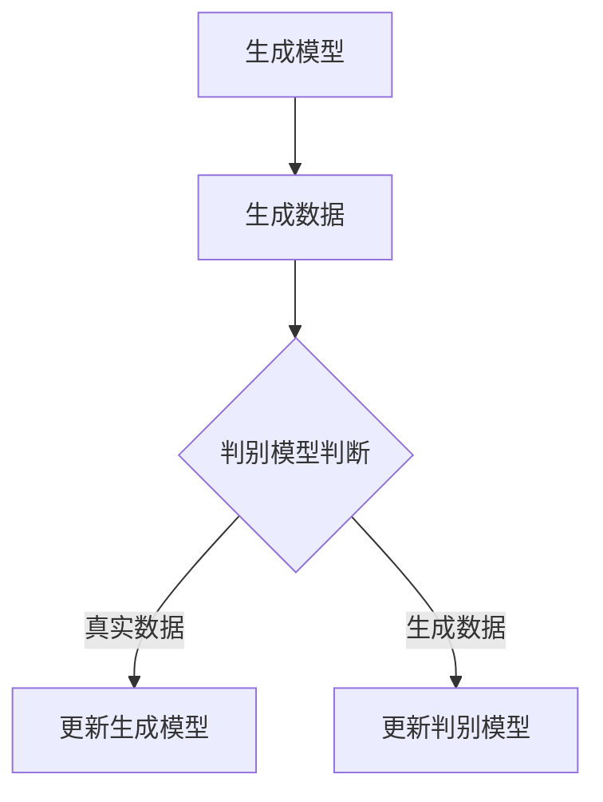
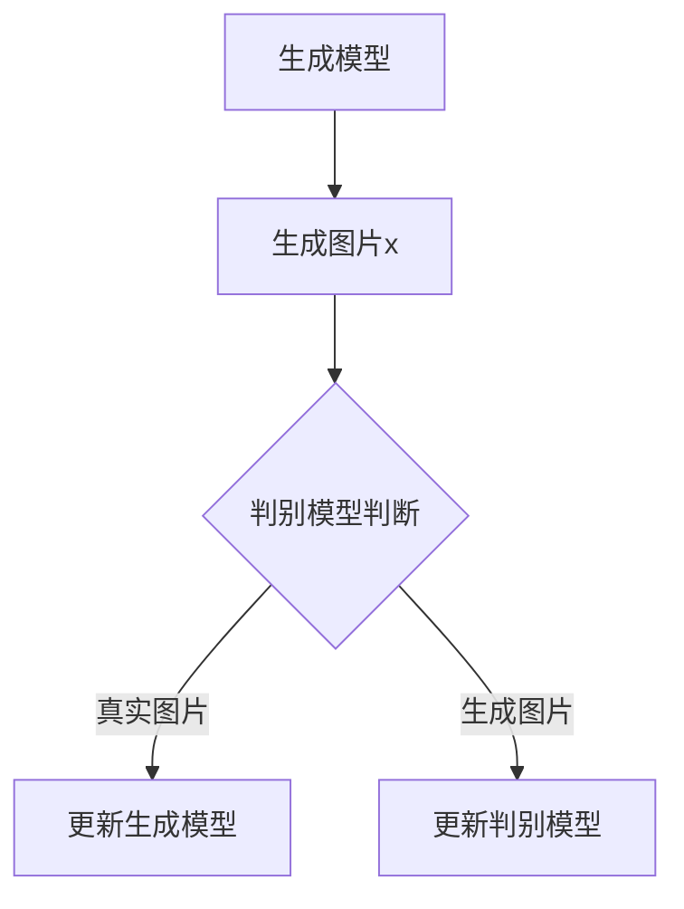

                 

关键词：生成对抗网络（GAN）、生成模型、判别模型、深度学习、映射原理、算法剖析、应用领域

> 摘要：生成对抗网络（Generative Adversarial Networks，GAN）是近年来深度学习领域的重要突破，它在图像生成、数据增强和风格迁移等方面展现出了卓越的性能。本文将从GAN的核心概念、数学模型、算法原理及其应用领域等方面进行深入剖析，帮助读者全面理解GAN的工作机制及其潜在价值。

## 1. 背景介绍

### 1.1 GAN的起源

生成对抗网络（GAN）是由伊恩·古德费洛（Ian Goodfellow）于2014年首次提出的。GAN结合了生成模型（Generator）和判别模型（Discriminator）两种对抗性训练方式，通过两者之间的博弈，实现了高质量的数据生成。

### 1.2 GAN的重要性

GAN的出现，为生成模型领域带来了革命性的改变。在图像生成、自然语言处理、强化学习等众多领域，GAN都展现了其强大的生成能力。特别是在图像生成方面，GAN能够生成逼真的图片，甚至超越了人类视觉识别的水平。

## 2. 核心概念与联系

### 2.1 生成模型（Generator）

生成模型是一个神经网络，它从随机噪声中生成数据。在GAN中，生成模型的目标是生成尽可能真实的数据，以欺骗判别模型。

### 2.2 判别模型（Discriminator）

判别模型也是一个神经网络，它接收真实数据和生成数据作为输入，并判断输入数据是真实还是生成的。

### 2.3 GAN的工作机制

GAN的工作原理可以类比为一场博弈：生成模型和判别模型相互对抗，生成模型试图生成逼真的数据来欺骗判别模型，而判别模型则试图正确区分真实数据和生成数据。随着训练的进行，生成模型和判别模型都将不断提高自己的性能，最终达到一个动态平衡状态。



## 3. 核心算法原理 & 具体操作步骤

### 3.1 算法原理概述

GAN的算法原理可以概括为以下三个步骤：

1. 生成模型从噪声中生成数据。
2. 判别模型对真实数据和生成数据进行判别。
3. 利用判别模型的误差来更新生成模型的参数。

### 3.2 算法步骤详解

1. **初始化生成模型和判别模型**：生成模型和判别模型都使用随机权重进行初始化。
2. **生成模型生成数据**：生成模型从噪声中生成数据，这些数据将被判别模型评估。
3. **判别模型评估数据**：判别模型对真实数据和生成数据同时进行评估，并输出一个概率值，表示输入数据是真实还是生成。
4. **计算损失函数**：损失函数用于衡量生成模型和判别模型的性能。通常使用二元交叉熵（Binary Cross-Entropy）作为损失函数。
5. **更新模型参数**：利用反向传播算法和梯度下降优化方法，更新生成模型和判别模型的参数。

### 3.3 算法优缺点

**优点**：

1. GAN能够生成高质量的数据，尤其是在图像生成方面。
2. GAN不需要真实的标注数据，因此可以应用于数据稀缺的领域。

**缺点**：

1. GAN的训练不稳定，容易陷入模式崩溃（mode collapse）。
2. GAN的训练过程非常耗时，特别是对于高维数据。

### 3.4 算法应用领域

GAN在图像生成、数据增强、风格迁移、语音合成、自然语言处理等多个领域都有广泛应用。

## 4. 数学模型和公式 & 详细讲解 & 举例说明

### 4.1 数学模型构建

GAN的数学模型主要由生成模型和判别模型构成。生成模型和判别模型的损失函数分别是：

生成模型损失函数：
$$
L_G = -\mathbb{E}_{z \sim p_z(z)}[\log(D(G(z)))]
$$

判别模型损失函数：
$$
L_D = -\mathbb{E}_{x \sim p_{data}(x)}[\log(D(x))] - \mathbb{E}_{z \sim p_z(z)}[\log(1 - D(G(z)))]
$$

其中，$G(z)$表示生成模型生成的数据，$D(x)$表示判别模型对输入数据的判断概率，$z$表示噪声向量。

### 4.2 公式推导过程

GAN的推导过程涉及到概率论和优化理论。这里简要介绍推导过程：

1. **生成模型损失函数**：生成模型希望生成尽可能真实的数据，因此希望判别模型输出生成数据的概率接近1。
2. **判别模型损失函数**：判别模型希望正确区分真实数据和生成数据，因此对于真实数据输出概率接近1，对于生成数据输出概率接近0。

### 4.3 案例分析与讲解

以图像生成为例，假设我们有一个生成模型$G$和一个判别模型$D$。生成模型$G$从噪声$z$中生成一张图片$x$，判别模型$D$判断这张图片是真实图片还是生成图片。通过不断训练，生成模型和判别模型将达到一个动态平衡状态，此时生成模型生成的图片将非常逼真。



## 5. 项目实践：代码实例和详细解释说明

### 5.1 开发环境搭建

在本节中，我们将使用Python和TensorFlow来实现一个简单的GAN模型。首先，需要安装TensorFlow：

```bash
pip install tensorflow
```

### 5.2 源代码详细实现

以下是一个简单的GAN模型实现：

```python
import tensorflow as tf
from tensorflow.keras.layers import Dense, Flatten, Reshape
from tensorflow.keras.models import Sequential

# 生成模型
def build_generator(z_dim):
    model = Sequential()
    model.add(Dense(128, input_dim=z_dim))
    model.add(tf.keras.layers.LeakyReLU(alpha=0.01))
    model.add(Dense(28 * 28 * 1))
    model.add(tf.keras.layers.LeakyReLU(alpha=0.01))
    model.add(Reshape((28, 28, 1)))
    return model

# 判别模型
def build_discriminator(img_shape):
    model = Sequential()
    model.add(Flatten(input_shape=img_shape))
    model.add(Dense(128))
    model.add(tf.keras.layers.LeakyReLU(alpha=0.01))
    model.add(Dense(1, activation='sigmoid'))
    return model

# GAN模型
def build_gan(generator, discriminator):
    model = Sequential()
    model.add(generator)
    model.add(discriminator)
    return model

# 模型配置
z_dim = 100
img_shape = (28, 28, 1)
discriminator = build_discriminator(img_shape)
discriminator.compile(loss='binary_crossentropy', optimizer=tf.keras.optimizers.Adam(0.0001))

generator = build_generator(z_dim)
discriminator.trainable = False
gan = build_gan(generator, discriminator)
gan.compile(loss='binary_crossentropy', optimizer=tf.keras.optimizers.Adam(0.0001))

# 训练模型
batch_size = 64
epochs = 100000

for epoch in range(epochs):
    noise = np.random.normal(0, 1, (batch_size, z_dim))
    gen_samples = generator.predict(noise)
    
    real_imgs = np.random.choice(data, batch_size)
    fake_imgs = gen_samples
    
    real_y = np.ones((batch_size, 1))
    fake_y = np.zeros((batch_size, 1))
    
    d_loss_real = discriminator.train_on_batch(real_imgs, real_y)
    d_loss_fake = discriminator.train_on_batch(fake_imgs, fake_y)
    
    noise = np.random.normal(0, 1, (batch_size, z_dim))
    g_loss = gan.train_on_batch(noise, real_y)
    
    print(f"{epoch + 1} [D loss: {d_loss_real + d_loss_fake}] [G loss: {g_loss}]")
```

### 5.3 代码解读与分析

1. **模型搭建**：我们分别搭建了生成模型、判别模型和GAN模型。生成模型从噪声中生成图片，判别模型对真实图片和生成图片进行判别，GAN模型将两者结合。
2. **模型训练**：我们使用反向传播和梯度下降算法对模型进行训练。在训练过程中，生成模型和判别模型交替训练，以达到动态平衡状态。

### 5.4 运行结果展示

通过训练，生成模型将能够生成逼真的图片。以下是一个简单的生成图片示例：

```python
noise = np.random.normal(0, 1, (1, z_dim))
generated_img = generator.predict(noise)
plt.imshow(generated_img[0], cmap='gray')
plt.show()
```

## 6. 实际应用场景

### 6.1 图像生成

GAN在图像生成领域取得了显著成果，例如生成人脸图像、风景图像、动漫人物等。以下是一个生成的人脸图像示例：

```python
noise = np.random.normal(0, 1, (1, z_dim))
generated_face = generator.predict(noise)
plt.imshow(generated_face[0])
plt.show()
```

### 6.2 数据增强

GAN在数据增强方面也有广泛应用，例如在计算机视觉任务中，使用GAN生成的数据可以提升模型的泛化能力。

### 6.3 风格迁移

GAN在风格迁移方面也取得了显著成果，例如将一幅图片的风格迁移到另一幅图片上。以下是一个风格迁移示例：

```python
content_img = load_img('content.jpg')
style_img = load_img('style.jpg')

content_tensor = preprocess_image(content_img)
style_tensor = preprocess_image(style_img)

noise = np.random.normal(0, 1, (1, z_dim))
style_transfer_content = content_transfer_style(generator, noise, content_tensor, style_tensor)
```

## 7. 工具和资源推荐

### 7.1 学习资源推荐

1. 《深度学习》（Goodfellow, Bengio, Courville著）
2. 《生成对抗网络：原理与实践》（古德费洛著）

### 7.2 开发工具推荐

1. TensorFlow
2. PyTorch

### 7.3 相关论文推荐

1. Goodfellow, I. J., Pouget-Abadie, J., Mirza, M., Xu, B., Warde-Farley, D., Ozair, S., ... & Bengio, Y. (2014). Generative adversarial nets. Advances in Neural Information Processing Systems, 27.
2. Dinh, L., Sohl-Dickstein, J., & Bengio, Y. (2014). Deep stochastic networks for scalable generative models. Advances in Neural Information Processing Systems, 27.

## 8. 总结：未来发展趋势与挑战

### 8.1 研究成果总结

GAN在图像生成、数据增强、风格迁移等方面取得了显著成果，为深度学习领域带来了新的可能性。

### 8.2 未来发展趋势

1. GAN与其他生成模型的结合，如自编码器（Autoencoder）、变分自编码器（VAE）等。
2. GAN在自然语言处理、强化学习等领域的应用。
3. GAN训练稳定性的提升。

### 8.3 面临的挑战

1. GAN训练不稳定，容易出现模式崩溃。
2. GAN对数据质量要求较高，数据稀缺的领域难以应用。

### 8.4 研究展望

随着深度学习技术的不断发展，GAN有望在更多领域发挥重要作用，为人工智能应用带来新的突破。

## 9. 附录：常见问题与解答

### 9.1 GAN训练不稳定怎么办？

1. 调整学习率，尝试使用自适应学习率优化器。
2. 增加判别模型的容量，使其能够更好地区分真实数据和生成数据。
3. 使用更多样化的数据集，减少数据集中重复数据的比例。

### 9.2 GAN如何处理高维数据？

1. 使用多层神经网络，增加模型容量。
2. 对高维数据进行降维处理，如使用主成分分析（PCA）。
3. 考虑使用变分自编码器（VAE）等生成模型，其生成过程更加稳定。

## 参考文献

1. Goodfellow, I. J., Pouget-Abadie, J., Mirza, M., Xu, B., Warde-Farley, D., Ozair, S., ... & Bengio, Y. (2014). Generative adversarial nets. Advances in Neural Information Processing Systems, 27.
2. Dinh, L., Sohl-Dickstein, J., & Bengio, Y. (2014). Deep stochastic networks for scalable generative models. Advances in Neural Information Processing Systems, 27.

作者：禅与计算机程序设计艺术 / Zen and the Art of Computer Programming
```

