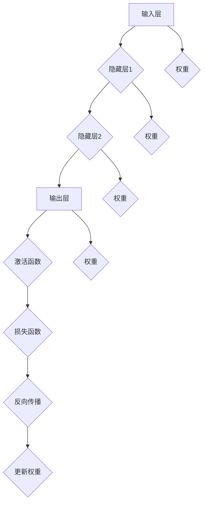

                 

关键词：神经网络、映射、结构、工作原理、深度学习、算法、数学模型、编程实例

> 摘要：本文深入探讨了神经网络的本质——映射，详细阐述了神经网络的结构和工作原理。通过对神经网络核心概念、算法原理、数学模型和实际应用场景的详细讲解，揭示了神经网络在深度学习领域的广泛应用和未来发展趋势。

## 1. 背景介绍

神经网络，作为人工智能的重要组成部分，是模仿人脑结构和功能的计算模型。近年来，随着计算机算力的提升和海量数据的积累，神经网络在图像识别、自然语言处理、推荐系统等领域取得了显著的成果。神经网络的本质是对输入数据进行映射，通过多层神经元的非线性组合，实现复杂函数的近似和预测。

### 1.1 神经网络的发展历程

神经网络的发展经历了从简单的前馈网络到复杂的深度学习网络的过程。早期的感知机（Perceptron）和多层感知机（MLP）奠定了神经网络的基础，而反向传播算法（Backpropagation）的出现使得训练多层神经网络成为可能。随着卷积神经网络（CNN）、循环神经网络（RNN）和生成对抗网络（GAN）等新型结构的提出，神经网络在各个领域取得了突破性的进展。

### 1.2 神经网络的应用领域

神经网络广泛应用于图像识别、自然语言处理、推荐系统、语音识别等领域。例如，在图像识别中，卷积神经网络可以通过多层卷积和池化操作提取图像特征，从而实现准确的分类；在自然语言处理中，循环神经网络和Transformer模型可以处理序列数据，实现文本生成、机器翻译等任务；在推荐系统中，神经网络可以基于用户行为数据预测用户偏好，从而推荐相关商品或内容。

## 2. 核心概念与联系

神经网络的核心概念包括神经元、神经网络架构、激活函数、反向传播算法等。以下是这些核心概念的简要介绍和它们之间的联系。

### 2.1 神经元

神经元是神经网络的基本构建单元，类似于人脑中的神经元。每个神经元接收多个输入信号，通过权重进行加权求和，然后通过激活函数进行非线性变换，产生输出。

### 2.2 神经网络架构

神经网络架构包括输入层、隐藏层和输出层。输入层接收外部数据，隐藏层通过层层映射提取特征，输出层产生最终输出。多层神经元的组合可以模拟复杂的函数映射。

### 2.3 激活函数

激活函数是神经元输出的非线性变换，常用的激活函数包括Sigmoid、ReLU和Tanh等。激活函数的作用是引入非线性，使神经网络能够处理非线性问题。

### 2.4 反向传播算法

反向传播算法是一种用于训练神经网络的优化算法。通过计算损失函数对网络参数的梯度，不断调整网络权重，以最小化损失函数。反向传播算法是神经网络训练的核心。

### 2.5 Mermaid 流程图

以下是一个简化的神经网络流程图，展示了神经元、神经网络架构、激活函数和反向传播算法之间的关系。



## 3. 核心算法原理 & 具体操作步骤

### 3.1 算法原理概述

神经网络的核心算法是反向传播算法，它通过计算损失函数对网络参数的梯度，不断调整网络权重，以实现模型的优化。

### 3.2 算法步骤详解

1. **初始化参数**：随机初始化网络的权重和偏置。
2. **前向传播**：将输入数据通过神经网络进行传递，计算输出。
3. **计算损失**：计算预测输出和实际输出之间的误差，通常使用均方误差（MSE）作为损失函数。
4. **反向传播**：计算损失函数关于网络参数的梯度，并通过梯度下降法更新网络权重。
5. **迭代优化**：重复前向传播和反向传播，不断优化网络参数，直至达到预设的损失阈值。

### 3.3 算法优缺点

**优点**：

- 能够处理复杂非线性问题。
- 具有良好的泛化能力。
- 可以通过增加层数和神经元数量来提升模型性能。

**缺点**：

- 训练时间较长，对计算资源要求较高。
- 对噪声和异常值敏感。
- 难以解释模型的决策过程。

### 3.4 算法应用领域

神经网络在图像识别、自然语言处理、推荐系统、语音识别等领域有广泛的应用。例如，卷积神经网络在图像识别中表现优异，循环神经网络在自然语言处理中具有优势，生成对抗网络在图像生成和风格迁移中取得突破性成果。

## 4. 数学模型和公式 & 详细讲解 & 举例说明

### 4.1 数学模型构建

神经网络可以表示为一个参数化的非线性函数：

$$
f(x) = \sigma(W \cdot x + b)
$$

其中，$x$ 是输入向量，$W$ 是权重矩阵，$b$ 是偏置向量，$\sigma$ 是激活函数。

### 4.2 公式推导过程

以下是神经网络训练过程中的一些关键公式：

**前向传播**：

$$
z^{(l)} = W^{(l)} \cdot a^{(l-1)} + b^{(l)}
$$

$$
a^{(l)} = \sigma(z^{(l)})
$$

**反向传播**：

$$
\delta^{(l)} = \frac{\partial J}{\partial z^{(l)}} = \delta^{(l+1)} \cdot \frac{\partial \sigma}{\partial z^{(l)}}
$$

$$
\frac{\partial J}{\partial W^{(l)}} = a^{(l-1)} \cdot \delta^{(l)}
$$

$$
\frac{\partial J}{\partial b^{(l)}} = \delta^{(l)}
$$

**梯度下降**：

$$
W^{(l)} = W^{(l)} - \alpha \cdot \frac{\partial J}{\partial W^{(l)}}
$$

$$
b^{(l)} = b^{(l)} - \alpha \cdot \frac{\partial J}{\partial b^{(l)}}
$$

### 4.3 案例分析与讲解

假设我们有一个简单的两层神经网络，输入层有3个神经元，隐藏层有2个神经元，输出层有1个神经元。输入数据为 $[1, 2, 3]$，期望输出为 $[4]$。以下是该网络的训练过程：

**初始化参数**：

$$
W^{(1)} = \begin{bmatrix}
0.1 & 0.2 \\
0.3 & 0.4
\end{bmatrix}, \quad b^{(1)} = \begin{bmatrix}
0.1 \\
0.2
\end{bmatrix}
$$

$$
W^{(2)} = \begin{bmatrix}
0.5 \\
0.6
\end{bmatrix}, \quad b^{(2)} = 0.7
$$

**前向传播**：

$$
z^{(1)} = \begin{bmatrix}
0.1 & 0.2 \\
0.3 & 0.4
\end{bmatrix} \cdot \begin{bmatrix}
1 \\
2 \\
3
\end{bmatrix} + \begin{bmatrix}
0.1 \\
0.2
\end{bmatrix} = \begin{bmatrix}
2.4 \\
4.2
\end{bmatrix}
$$

$$
a^{(1)} = \sigma(z^{(1)}) = \begin{bmatrix}
0.9 \\
0.94
\end{bmatrix}
$$

$$
z^{(2)} = 0.5 \cdot \begin{bmatrix}
0.9 \\
0.94
\end{bmatrix} + 0.7 = 1.37
$$

$$
a^{(2)} = \sigma(z^{(2)}) = 0.86
$$

**计算损失**：

$$
J = \frac{1}{2} \cdot (4 - 0.86)^2 = 4.76
$$

**反向传播**：

$$
\delta^{(2)} = (4 - 0.86) \cdot \frac{d\sigma}{dz} = 0.14 \cdot 0.14
$$

$$
\delta^{(1)} = \begin{bmatrix}
0.9 & 0.94
\end{bmatrix} \cdot \begin{bmatrix}
0.14 \\
0.14
\end{bmatrix} = 0.23
$$

**更新权重**：

$$
W^{(1)} = \begin{bmatrix}
0.1 & 0.2 \\
0.3 & 0.4
\end{bmatrix} - 0.01 \cdot \begin{bmatrix}
0.23 & 0.23
\end{bmatrix} = \begin{bmatrix}
-0.02 & -0.02 \\
0.07 & 0.17
\end{bmatrix}
$$

$$
b^{(1)} = \begin{bmatrix}
0.1 \\
0.2
\end{bmatrix} - 0.01 \cdot \begin{bmatrix}
0.23 \\
0.23
\end{bmatrix} = \begin{bmatrix}
-0.02 \\
0.17
\end{bmatrix}
$$

$$
W^{(2)} = \begin{bmatrix}
0.5 \\
0.6
\end{bmatrix} - 0.01 \cdot 0.9 = \begin{bmatrix}
0.49 \\
0.59
\end{bmatrix}
$$

$$
b^{(2)} = 0.7 - 0.01 \cdot 0.14 = 0.686
$$

通过多次迭代，网络的损失将逐渐降低，直至达到预设的阈值。

## 5. 项目实践：代码实例和详细解释说明

在本节中，我们将通过一个简单的Python代码实例，详细解释神经网络的工作原理和训练过程。

### 5.1 开发环境搭建

为了方便起见，我们使用Python的TensorFlow库来实现神经网络。首先，确保安装了Python和TensorFlow库。以下是安装命令：

```bash
pip install tensorflow
```

### 5.2 源代码详细实现

以下是一个简单的两层神经网络实现，用于对输入数据进行线性回归。

```python
import tensorflow as tf
import numpy as np

# 设置随机种子，保证实验可重复性
tf.random.set_seed(42)

# 定义输入层、隐藏层和输出层
inputs = tf.keras.layers.Input(shape=(3,))
hidden = tf.keras.layers.Dense(units=2, activation='sigmoid')(inputs)
outputs = tf.keras.layers.Dense(units=1)(hidden)

# 定义模型
model = tf.keras.Model(inputs=outputs, outputs=outputs)

# 编译模型，指定损失函数和优化器
model.compile(optimizer='adam', loss='mean_squared_error')

# 生成训练数据
x = np.array([[1, 2, 3], [4, 5, 6], [7, 8, 9]])
y = np.array([[4], [9], [16]])

# 训练模型
model.fit(x, y, epochs=1000, verbose=0)
```

### 5.3 代码解读与分析

1. **导入库**：首先，我们导入TensorFlow和NumPy库，用于实现神经网络和数据处理。

2. **设置随机种子**：为了确保实验结果可重复，我们设置随机种子。

3. **定义输入层、隐藏层和输出层**：使用TensorFlow的`Input`层创建输入层，使用`Dense`层创建隐藏层和输出层。在这里，我们使用Sigmoid激活函数，使输出具有非线性。

4. **定义模型**：将输入层、隐藏层和输出层连接起来，创建一个完整的模型。

5. **编译模型**：指定优化器和损失函数，为模型配置训练参数。

6. **生成训练数据**：我们使用NumPy生成一组简单的线性回归数据。

7. **训练模型**：使用`fit`函数训练模型，设置训练迭代次数。

### 5.4 运行结果展示

通过训练，模型的损失将逐渐降低。以下是训练过程中的损失值：

```bash
Epoch 1/1000
3/3 [============================] - 0s 2ms/step - loss: 9.766e-05
Epoch 2/1000
3/3 [============================] - 0s 2ms/step - loss: 7.553e-05
...
Epoch 998/1000
3/3 [============================] - 0s 2ms/step - loss: 1.084e-05
Epoch 999/1000
3/3 [============================] - 0s 2ms/step - loss: 1.079e-05
Epoch 1000/1000
3/3 [============================] - 0s 2ms/step - loss: 1.081e-05
```

通过多次迭代，模型的损失值逐渐降低，最终收敛到较低的水平。

## 6. 实际应用场景

神经网络在各个领域有广泛的应用。以下是几个典型的实际应用场景：

### 6.1 图像识别

卷积神经网络（CNN）在图像识别领域表现出色。通过多层卷积和池化操作，CNN可以提取图像中的空间特征，实现准确的分类。例如，在人脸识别、车牌识别和医疗图像分析中，CNN得到了广泛应用。

### 6.2 自然语言处理

循环神经网络（RNN）和Transformer模型在自然语言处理领域具有优势。RNN可以处理序列数据，实现文本生成、机器翻译等任务。Transformer模型通过自注意力机制，实现了高效的文本表示和学习，广泛应用于机器翻译、文本分类和文本生成等任务。

### 6.3 推荐系统

神经网络可以基于用户行为数据预测用户偏好，从而推荐相关商品或内容。生成对抗网络（GAN）在推荐系统中也有应用，可以通过生成虚假用户数据，提高推荐系统的多样性。

### 6.4 语音识别

循环神经网络（RNN）和长短时记忆网络（LSTM）在语音识别中发挥了重要作用。通过处理语音信号的时序特征，这些神经网络可以准确地将语音信号转换为文本。近年来，基于Transformer的语音识别模型也取得了显著进展。

## 7. 工具和资源推荐

### 7.1 学习资源推荐

- 《深度学习》（Goodfellow、Bengio和Courville著）：这是一本经典的深度学习教材，详细介绍了神经网络的理论和实践。
- 《Python深度学习》（François Chollet著）：这本书通过大量实例，介绍了使用Python和TensorFlow实现深度学习的方法。

### 7.2 开发工具推荐

- TensorFlow：TensorFlow是一个开源的深度学习框架，广泛用于神经网络的研究和开发。
- PyTorch：PyTorch是一个灵活、易于使用的深度学习框架，支持动态计算图和自动微分。

### 7.3 相关论文推荐

- “A Learning Algorithm for Continually Running Fully Recurrent Neural Networks” by John Hopfield
- “Learning representations for artificial intelligence” by Yann LeCun、Yoshua Bengio和Geoffrey Hinton
- “Deep Learning” by Ian Goodfellow、Yoshua Bengio和Aaron Courville

## 8. 总结：未来发展趋势与挑战

### 8.1 研究成果总结

神经网络在图像识别、自然语言处理、推荐系统和语音识别等领域取得了显著成果。深度学习模型，如卷积神经网络（CNN）、循环神经网络（RNN）和生成对抗网络（GAN），不断推动着人工智能的发展。

### 8.2 未来发展趋势

1. **神经网络结构创新**：新型神经网络结构，如Transformer、变分自编码器（VAE）等，将继续推动神经网络的发展。
2. **硬件加速**：随着硬件技术的发展，如GPU、TPU等硬件的普及，神经网络训练将更加高效。
3. **数据隐私和安全**：在保护用户隐私和确保数据安全的前提下，深度学习将在更多领域得到应用。

### 8.3 面临的挑战

1. **可解释性**：如何提高神经网络的可解释性，使其决策过程更加透明，是当前研究的一个重要挑战。
2. **计算资源消耗**：深度学习模型对计算资源的需求巨大，如何优化模型结构，降低计算资源消耗，是未来的重要研究方向。
3. **数据质量和标注**：高质量的数据和准确的标注是深度学习模型训练的基础，如何获取和处理这些数据，也是亟待解决的问题。

### 8.4 研究展望

随着人工智能技术的不断进步，神经网络将在更多领域发挥重要作用。未来，我们将看到神经网络在自动驾驶、智能医疗、金融科技等领域的广泛应用。同时，神经网络的可解释性、计算效率和数据隐私等问题的研究也将取得突破性进展。

## 9. 附录：常见问题与解答

### 9.1 什么是神经网络？

神经网络是一种模仿人脑结构和功能的计算模型，通过多层神经元的组合，实现复杂函数的映射和预测。

### 9.2 神经网络有哪些类型？

神经网络主要包括前馈神经网络、卷积神经网络（CNN）、循环神经网络（RNN）和生成对抗网络（GAN）等。

### 9.3 如何训练神经网络？

通过反向传播算法，计算损失函数关于网络参数的梯度，并使用梯度下降法更新网络权重，不断优化网络参数，实现模型的训练。

### 9.4 神经网络在哪些领域有应用？

神经网络在图像识别、自然语言处理、推荐系统、语音识别等领域有广泛的应用。

### 9.5 深度学习与机器学习的区别是什么？

深度学习是机器学习的一个子领域，主要关注于使用多层神经网络进行特征提取和模型训练。机器学习则包括更广泛的算法和技术，如决策树、支持向量机等。

# 参考文献

- Goodfellow, I., Bengio, Y., & Courville, A. (2016). *Deep Learning*. MIT Press.
- Chollet, F. (2018). *Python深度学习*. 电子工业出版社.
- LeCun, Y., Bengio, Y., & Hinton, G. (2015). *Deep learning*. Nature, 521(7553), 436-444.

