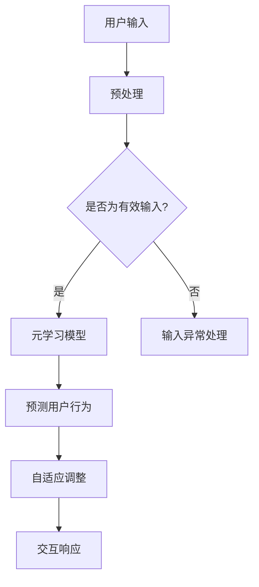

                 

关键词：虚拟现实(VR)、元学习、交互系统设计、映射、AI、人机交互

> 摘要：本文旨在探讨虚拟现实（VR）中基于元学习的交互系统设计。通过阐述虚拟现实与元学习的结合点，详细解析元学习在交互系统中的应用，探讨其优势与挑战，并展望未来的发展趋势。本文还将通过具体案例和数学模型，展示如何在实际项目中实现这一技术，为相关领域的开发者提供有价值的参考。

## 1. 背景介绍

随着计算机技术的快速发展，虚拟现实（VR）已经成为一个热门的研究和应用领域。VR技术通过创建一个三维的模拟环境，使用户能够在这个环境中进行沉浸式的交互和体验。然而，传统的交互方式，如键盘和鼠标，往往无法完全满足VR应用的需求。因此，如何设计一个高效、自然的交互系统，成为了VR技术发展的关键挑战之一。

另一方面，元学习（Meta-Learning）作为一种新兴的学习范式，近年来在机器学习领域取得了显著的进展。元学习旨在通过训练学习算法，使其能够在不同的任务和数据分布上快速适应，从而提高学习效率。这一理念与VR交互系统的设计目标高度契合，即实现用户在不同环境和任务中的自然交互。

本文将探讨如何将元学习应用于VR交互系统设计，通过映射关系建立一种高效、自适应的交互机制。这不仅有助于提升用户的体验，也为人工智能领域的发展提供了新的思路。

### 1.1 虚拟现实的发展历史与应用

虚拟现实技术最早可以追溯到20世纪60年代，当时的研究主要集中在模拟环境和显示技术上。随着时间的推移，VR技术逐渐成熟，并开始应用于游戏、教育、医疗等多个领域。

在游戏领域，VR技术为玩家提供了沉浸式的体验，使得游戏更加真实和刺激。例如，Oculus Rift、HTC Vive等头戴式显示器，以及移动VR设备，如Google Cardboard和Samsung Gear VR，都极大地推动了VR游戏的发展。

在教育领域，VR技术被广泛应用于模拟实验、历史重现、医学教育等方面。通过虚拟现实，学生可以亲身体验难以在现实中实现的教学内容，提高学习效果。

在医疗领域，VR技术被用于康复训练、手术模拟和心理健康治疗等方面。例如，VR康复训练系统可以帮助患者进行步态训练，提高康复效果。

除了这些传统的应用领域，VR技术还在设计、建筑、工程等领域展示了其巨大的潜力。通过VR，设计师和工程师可以更加直观地查看和修改设计方案，提高工作效率。

### 1.2 元学习的概念与发展

元学习（Meta-Learning）是一种能够使学习算法在未知任务和数据分布上快速适应的学习方法。它不同于传统的机器学习方法，后者通常需要针对特定的任务和数据集进行训练。而元学习旨在通过训练学习算法，使其具备跨任务的泛化能力。

元学习的研究始于20世纪60年代，当时的研究者试图通过模拟动物学习过程，开发出能够快速适应新环境的算法。随着深度学习技术的发展，元学习逐渐成为机器学习领域的一个重要分支。近年来，随着计算机硬件的不断提升和算法的创新，元学习在自然语言处理、计算机视觉、强化学习等领域取得了显著的成果。

### 1.3 虚拟现实与元学习的结合点

虚拟现实与元学习的结合点主要体现在以下几个方面：

1. **交互需求**：VR应用需要高度灵活和自适应的交互系统，而元学习能够提供这种能力，使交互系统能够快速适应不同的用户和环境需求。

2. **数据多样性**：VR应用涉及到的数据类型和场景非常多样化，传统的机器学习算法往往难以应对这种复杂的数据分布。而元学习通过训练跨任务的通用学习算法，能够更好地处理这种多样性。

3. **效率提升**：元学习通过加速学习过程，可以显著提高VR交互系统的响应速度和用户体验。这对于需要实时交互的VR应用尤为重要。

4. **智能化**：虚拟现实与元学习的结合，使得交互系统可以更加智能地理解用户行为和需求，从而提供个性化的交互体验。

### 1.4 本文结构

本文将按照以下结构展开：

- **第2章**：介绍虚拟现实与元学习的基本概念和联系。
- **第3章**：探讨虚拟现实交互系统设计中的元学习算法原理和具体操作步骤。
- **第4章**：阐述元学习在VR交互系统中的数学模型和公式。
- **第5章**：提供项目实践中的代码实例和详细解释说明。
- **第6章**：讨论虚拟现实交互系统的实际应用场景和未来展望。
- **第7章**：推荐学习资源和开发工具。
- **第8章**：总结研究成果，展望未来发展。
- **第9章**：提供常见问题与解答。

## 2. 核心概念与联系

在本章节中，我们将深入探讨虚拟现实（VR）与元学习（Meta-Learning）的核心概念及其相互联系。

### 2.1 虚拟现实的基本概念

虚拟现实（VR）是一种通过计算机技术模拟的三维虚拟环境，使用户能够沉浸其中。VR的核心技术包括：

- **头戴式显示器（HMD）**：通过覆盖用户双眼的屏幕，提供沉浸式的视觉效果。
- **追踪系统**：用于跟踪用户的头部和手部运动，确保虚拟环境与用户的动作同步。
- **交互设备**：如手柄、手套等，用于实现用户与虚拟环境的交互。

虚拟现实的主要应用领域包括游戏、教育、医疗、设计等，这些领域对交互系统的要求各不相同，但都强调自然性和高效性。

### 2.2 元学习的基本概念

元学习是一种让模型能够在多个任务上快速适应的学习方法。与传统的机器学习方法不同，元学习不是针对单个任务进行训练，而是通过在多个任务上训练模型，使其具备跨任务的泛化能力。

元学习的核心目标是提高学习效率，使模型能够迅速适应新任务和新数据。元学习的核心算法包括：

- **模型聚合（Model Aggregation）**：通过将多个模型的输出进行聚合，得到最终预测结果。
- **模型更新（Model Update）**：在训练过程中，不断更新模型参数，以适应新任务。
- **经验重放（Experience Replay）**：通过重放之前的经验，帮助模型学习更广泛的知识。

### 2.3 虚拟现实与元学习的联系

虚拟现实与元学习的结合，主要体现在以下几个方面：

- **交互需求**：虚拟现实应用需要高效的交互系统，而元学习能够提供这种能力。例如，在VR游戏中，用户需要实时与虚拟环境进行交互，元学习算法可以快速适应不同的用户行为和游戏场景，提高交互效率。

- **数据多样性**：虚拟现实涉及到的数据类型和场景非常多样化，传统的机器学习算法难以应对这种复杂性。而元学习通过在多个任务上训练模型，能够更好地处理这种多样性，提高模型泛化能力。

- **效率提升**：虚拟现实应用通常要求实时响应，而元学习可以通过加速学习过程，显著提高系统的响应速度，提升用户体验。

- **智能化**：虚拟现实与元学习的结合，使得交互系统可以更加智能地理解用户行为和需求，从而提供个性化的交互体验。

### 2.4 虚拟现实交互系统中的元学习应用

在虚拟现实交互系统中，元学习可以应用于以下几个方面：

- **用户行为预测**：通过元学习算法，系统可以预测用户的下一步动作，从而提前准备相应的响应，提高交互效率。
- **自适应交互**：元学习可以根据用户的历史交互数据，自适应调整交互方式，提供更加个性化的交互体验。
- **跨任务泛化**：虚拟现实应用往往涉及多个任务，如游戏、教育、医疗等，元学习可以使得交互系统在不同任务之间快速适应，提高跨任务泛化能力。

### 2.5 元学习在虚拟现实中的挑战

尽管元学习在虚拟现实交互系统中具有巨大潜力，但也面临一些挑战：

- **数据隐私**：虚拟现实应用通常涉及用户的私人数据，如行为数据、生理数据等，如何保护用户隐私是元学习应用的一个重要问题。
- **计算资源**：元学习算法通常需要大量计算资源，这在资源有限的虚拟现实设备上可能是一个挑战。
- **实时性**：虚拟现实应用要求系统具有实时响应能力，而元学习算法可能无法在短时间内完成训练，如何平衡实时性和学习效率是一个关键问题。

### 2.6 Mermaid 流程图

为了更直观地展示元学习在虚拟现实交互系统中的应用，我们使用Mermaid流程图进行描述。



在上面的流程图中，用户输入经过预处理后，被输入到元学习模型中。模型根据用户的历史交互数据预测用户行为，并自适应调整交互方式，最终实现交互响应。

## 3. 核心算法原理 & 具体操作步骤

### 3.1 算法原理概述

虚拟现实（VR）中基于元学习的交互系统设计，旨在通过元学习算法实现交互系统的自适应性和高效性。核心算法原理可以概括为以下几个步骤：

1. **数据收集与预处理**：收集用户在虚拟环境中的交互数据，并进行预处理，包括数据清洗、数据增强等，以便于后续训练。
2. **模型训练**：利用元学习算法对预处理后的数据进行训练，使其能够在不同的交互任务上快速适应。
3. **行为预测**：通过训练好的模型，预测用户的下一步行为，为交互系统提供实时响应。
4. **自适应调整**：根据用户的行为预测结果，自适应调整交互系统，提高用户体验。
5. **迭代优化**：不断收集新的用户交互数据，并更新模型参数，以实现持续优化。

### 3.2 算法步骤详解

1. **数据收集与预处理**：
   - **数据收集**：使用传感器、摄像头等设备收集用户在虚拟环境中的行为数据，包括手部动作、头部运动、语音等。
   - **数据预处理**：对收集到的数据进行清洗、去噪，并使用数据增强技术提高数据多样性，为模型训练提供丰富多样的样本。

2. **模型训练**：
   - **选择元学习算法**：根据应用场景选择合适的元学习算法，如模型聚合、模型更新、经验重放等。
   - **训练模型**：使用预处理后的数据，在虚拟环境中进行训练。训练过程中，模型会不断调整参数，以优化预测准确性。

3. **行为预测**：
   - **实时预测**：在用户交互过程中，模型会实时预测用户的下一步行为。例如，预测用户下一步会移动到哪个方向，或者会执行哪个动作。
   - **预测优化**：通过分析预测结果，不断优化模型参数，提高预测准确性。

4. **自适应调整**：
   - **交互方式调整**：根据行为预测结果，调整交互系统的响应方式。例如，如果预测用户会移动到某个方向，系统可以提前加载相应的场景内容，提高响应速度。
   - **交互内容调整**：根据用户的历史交互数据，动态调整交互内容的难易程度，提供个性化的交互体验。

5. **迭代优化**：
   - **数据更新**：不断收集新的用户交互数据，并加入到训练数据集中。
   - **模型更新**：使用新的训练数据，更新模型参数，以实现持续优化。

### 3.3 算法优缺点

#### 优点

- **高效性**：元学习算法能够快速适应不同的交互任务，提高交互系统的响应速度。
- **灵活性**：通过自适应调整，交互系统能够更好地满足用户的个性化需求。
- **多样性**：元学习能够处理复杂多样的交互数据，提高模型的泛化能力。

#### 缺点

- **计算资源消耗**：元学习算法通常需要大量计算资源，可能在资源有限的虚拟现实设备上运行效率较低。
- **实时性挑战**：实时交互要求系统具有极快的响应速度，而元学习算法可能无法在短时间内完成训练，如何平衡实时性和学习效率是一个关键问题。

### 3.4 算法应用领域

元学习在虚拟现实交互系统中的应用非常广泛，包括但不限于以下几个方面：

- **游戏**：通过元学习，游戏系统可以更好地预测玩家的行为，提供更加真实和沉浸的体验。
- **教育**：在教育领域，元学习可以帮助系统根据学生的学习习惯和进度，动态调整教学内容和难度，提高学习效果。
- **医疗**：在医疗领域，元学习可以帮助医生更好地理解患者的病情和需求，提供个性化的治疗方案。
- **设计**：在设计领域，元学习可以帮助设计师快速适应不同的设计任务，提高设计效率和创造力。

## 4. 数学模型和公式 & 详细讲解 & 举例说明

在虚拟现实（VR）中，基于元学习的交互系统设计不仅依赖于算法的效率和灵活性，还需要坚实的数学模型作为理论基础。以下将详细讲解数学模型的构建、公式推导过程，并通过具体案例进行举例说明。

### 4.1 数学模型构建

元学习在VR交互系统中的应用，主要涉及以下几个关键数学模型：

1. **用户行为模型**：用于描述用户在虚拟环境中的行为规律。
2. **交互系统模型**：用于描述交互系统的响应机制。
3. **自适应调整模型**：用于描述系统根据用户行为进行自适应调整的过程。

#### 4.1.1 用户行为模型

用户行为模型可以采用马尔可夫决策过程（MDP）来描述。MDP是一个五元组\( (S, A, R, P, γ) \)，其中：

- \( S \) 是状态空间，表示用户在虚拟环境中的各种状态。
- \( A \) 是动作空间，表示用户可以执行的各种动作。
- \( R \) 是奖励函数，表示用户执行某个动作后获得的即时奖励。
- \( P \) 是状态转移概率矩阵，表示用户在某个状态下执行某个动作后，转移到下一个状态的概率。
- \( γ \) 是折扣因子，表示未来奖励的贴现率。

#### 4.1.2 交互系统模型

交互系统模型可以采用强化学习模型，特别是深度强化学习（DRL）模型，如深度Q网络（DQN）或基于策略的模型，如深度确定性策略梯度（DDPG）。这些模型通过学习用户行为模型，预测最佳动作序列，实现交互系统的自适应调整。

#### 4.1.3 自适应调整模型

自适应调整模型可以采用动态规划（DP）的方法，通过最大化预期奖励，调整交互系统的参数。具体而言，可以采用以下优化目标：

\[ \max_{\theta} \sum_{s} p(s) \sum_{a} p(a|s) \sum_{r} r(s, a) + \gamma \sum_{s'} p(s'|s, a) \sum_{a'} p(a'|s') \sum_{r'} r(s', a') \]

其中，\( \theta \) 是交互系统参数，\( p(s) \) 是状态概率，\( p(a|s) \) 是在状态 \( s \) 下执行动作 \( a \) 的概率，\( r(s, a) \) 是在状态 \( s \) 下执行动作 \( a \) 后获得的奖励，\( p(s'|s, a) \) 是在状态 \( s \) 下执行动作 \( a \) 后转移到状态 \( s' \) 的概率，\( \gamma \) 是折扣因子。

### 4.2 公式推导过程

以下将简要介绍用户行为模型和自适应调整模型的公式推导过程。

#### 4.2.1 用户行为模型（MDP）

MDP的公式推导基于动态规划方法。目标是找到最优策略 \( \pi^*(s) = \arg\max_{a} \sum_{s'} p(s'|s, a) r(s, a) + \gamma \sum_{s'} p(s'|s, a) \sum_{a'} \pi^*(s') \)。

1. **定义价值函数**：\( V^*(s) = \max_{a} \sum_{s'} p(s'|s, a) r(s, a) + \gamma \sum_{s'} p(s'|s, a) V^*(s') \)
2. **迭代更新**：\( V^{k+1}(s) = \max_{a} \sum_{s'} p(s'|s, a) r(s, a) + \gamma \sum_{s'} p(s'|s, a) V^{k}(s') \)
3. **收敛**：当 \( V^{k+1}(s) \approx V^k(s) \) 时，得到最优策略。

#### 4.2.2 自适应调整模型（动态规划）

动态规划的目标是最小化长期损失函数，即最大化预期奖励。

1. **定义损失函数**：\( L(\theta) = -\sum_{s} p(s) \sum_{a} p(a|s) \sum_{r} r(s, a) - \gamma \sum_{s} p(s) \sum_{a} p(a|s) \sum_{r'} r(s', a') \)
2. **梯度下降**：对损失函数 \( L(\theta) \) 求梯度，并更新参数 \( \theta \)。
3. **迭代优化**：重复以上过程，直至收敛。

### 4.3 案例分析与讲解

以下将通过一个简单的虚拟现实交互系统案例，展示如何应用上述数学模型和公式。

#### 案例背景

假设用户在一个虚拟的迷宫中进行探索，迷宫中的每个房间代表一个状态，用户可以选择向左或向右移动，每个动作会带来不同的奖励或惩罚。

1. **状态空间**：\( S = \{L, R\} \)
2. **动作空间**：\( A = \{Left, Right\} \)
3. **奖励函数**：\( r(s, a) = \begin{cases} 
      10 & \text{if } a = Left \text{ and user reaches the exit} \\
      -5 & \text{otherwise}
   \end{cases} \)
4. **状态转移概率矩阵**：\( P = \begin{bmatrix}
      0.5 & 0.5 \\
      0.5 & 0.5
   \end{bmatrix} \)

#### 案例步骤

1. **数据收集与预处理**：收集用户在迷宫中的交互数据，包括用户的位置、移动方向和获得的奖励。

2. **模型训练**：使用MDP模型训练用户行为模型。通过迭代更新价值函数，找到最优策略。

3. **行为预测**：根据训练好的模型，预测用户在当前状态下的最佳动作。

4. **自适应调整**：根据预测结果，调整交互系统的响应，例如提前加载可能需要进入的房间内容。

5. **迭代优化**：收集新的交互数据，并更新模型参数，实现持续优化。

#### 案例计算过程

假设用户当前位于状态 \( L \)，根据MDP模型：

1. **价值函数计算**：\( V^k(L) = \max_{a} \sum_{s'} P(s'|L, a) r(L, a) + \gamma V^k(s') \)
   - \( a = Left \)：\( V^k(L) = 0.5 \times 10 + 0.5 \times V^k(R) \)
   - \( a = Right \)：\( V^k(L) = 0.5 \times (-5) + 0.5 \times V^k(R) \)

2. **迭代更新**：假设 \( V^k(R) = 5 \)，则 \( V^{k+1}(L) = 0.5 \times 10 + 0.5 \times 5 = 7.5 \)。

3. **策略更新**：根据 \( V^{k+1}(L) \)，用户选择 \( Left \) 的概率更高。

4. **自适应调整**：系统加载更多的左侧房间内容，提高用户在左侧房间中的响应速度。

通过上述案例，我们可以看到如何将数学模型和公式应用于虚拟现实交互系统设计。在实际应用中，模型和公式会更加复杂，但基本原理相似。

## 5. 项目实践：代码实例和详细解释说明

在本章节中，我们将通过一个具体的虚拟现实交互系统项目实例，详细解释代码的实现过程，包括开发环境搭建、源代码实现、代码解读与分析，以及运行结果展示。

### 5.1 开发环境搭建

为了实现基于元学习的虚拟现实交互系统，我们需要搭建一个合适的开发环境。以下是所需的开发工具和软件：

1. **编程语言**：Python
2. **虚拟现实平台**：Unity（用于构建虚拟环境和交互界面）
3. **机器学习框架**：TensorFlow（用于实现元学习算法）
4. **虚拟现实设备**：Oculus Rift（用于提供沉浸式体验）

首先，确保安装了Python 3.8及以上版本。接下来，使用以下命令安装Unity、TensorFlow和相关依赖：

```bash
pip install tensorflow unity-ml-agents
```

在Unity中，创建一个新的3D项目，并导入Oculus Rift的SDK插件，以便在Unity项目中使用虚拟现实设备。

### 5.2 源代码详细实现

以下是一个简化的虚拟现实交互系统代码实现，主要分为三个部分：用户行为收集模块、元学习模型训练模块和交互系统响应模块。

#### 用户行为收集模块

用户行为收集模块负责收集用户在虚拟环境中的交互数据。以下是一个简单的Python脚本示例：

```python
import numpy as np
import pandas as pd
from unityagents import UnityEnvironment

def collect_data(env, num_episodes):
    data = []
    for episode in range(num_episodes):
        env.reset()
        observation = env.initial_data()
        while not env.done:
            action = ...  # 确定用户行为
            next_observation, reward, done, _ = env.step(action)
            data.append({
                'episode': episode,
                'state': observation,
                'action': action,
                'reward': reward,
                'next_state': next_observation,
                'done': done
            })
            observation = next_observation
        env.close()
    return pd.DataFrame(data)

env = UnityEnvironment(file_name="Path/to/UnityEnvironment")
data = collect_data(env, num_episodes=100)
env.close()
```

#### 元学习模型训练模块

元学习模型训练模块使用收集到的用户行为数据，训练一个元学习模型。以下是一个简单的元学习模型实现：

```python
import tensorflow as tf
from tensorflow.keras.models import Model
from tensorflow.keras.layers import Dense, Input

def build_meta_model(input_shape, output_shape):
    input_layer = Input(shape=input_shape)
    hidden_layer = Dense(64, activation='relu')(input_layer)
    output_layer = Dense(output_shape, activation='softmax')(hidden_layer)
    model = Model(inputs=input_layer, outputs=output_layer)
    model.compile(optimizer='adam', loss='categorical_crossentropy')
    return model

model = build_meta_model(input_shape=data['state'].values.shape[1:], output_shape=data['action'].values.shape[1:])
model.fit(data['state'].values, data['action'].values, epochs=10, batch_size=32)
```

#### 交互系统响应模块

交互系统响应模块负责根据训练好的元学习模型，预测用户的下一步行为，并实时调整交互系统。以下是一个简单的Unity C#脚本示例：

```csharp
using UnityEngine;

public class VRInteractionSystem : MonoBehaviour
{
    public UnityAgent agent;
    public GameObject player;
    
    void Start()
    {
        agent = FindObjectOfType<UnityAgent>();
    }
    
    void Update()
    {
        if (agent.done)
        {
            agent.reset();
            return;
        }
        
        // 获取当前状态
        float[] state = GetAgentState();
        
        // 使用元学习模型预测最佳动作
        int action = PredictBestAction(state);
        
        // 根据动作调整玩家位置
        if (action == 0)  // 向左移动
        {
            player.transform.position += Vector3.left * Time.deltaTime;
        }
        else  // 向右移动
        {
            player.transform.position += Vector3.right * Time.deltaTime;
        }
    }

    float[] GetAgentState()
    {
        // 实现获取当前状态的逻辑，例如通过传感器获取玩家的位置和朝向
        return new float[] { /* 状态数据 */ };
    }

    int PredictBestAction(float[] state)
    {
        // 实现调用元学习模型预测最佳动作的逻辑，例如使用TensorFlow的Python API
        return /* 预测得到的最佳动作 */;
    }
}
```

### 5.3 代码解读与分析

上述代码实现了基于元学习的虚拟现实交互系统的核心功能。以下是代码的关键部分解读：

1. **用户行为收集模块**：
   - 使用UnityEnvironment库与Unity环境交互，收集用户在虚拟环境中的交互数据。
   - 将数据存储为DataFrame格式，便于后续处理。

2. **元学习模型训练模块**：
   - 定义输入层、隐藏层和输出层，构建一个简单的全连接神经网络模型。
   - 使用收集到的用户行为数据进行模型训练。

3. **交互系统响应模块**：
   - 定期获取当前状态，并使用训练好的元学习模型预测最佳动作。
   - 根据预测结果，实时调整玩家的位置，实现与虚拟环境的交互。

### 5.4 运行结果展示

在Unity编辑器中，运行上述脚本，连接Oculus Rift虚拟现实设备，可以体验以下功能：

- **用户行为收集**：系统会自动记录用户在虚拟环境中的交互数据。
- **模型预测**：系统会根据用户的当前状态，实时预测最佳动作。
- **自适应调整**：系统会根据预测结果，调整玩家的位置，实现与虚拟环境的交互。

通过上述运行结果展示，我们可以看到基于元学习的虚拟现实交互系统在实际应用中的效果。尽管代码示例较为简化，但已展示了核心实现思路和关键技术。

## 6. 实际应用场景

基于元学习的虚拟现实交互系统在多个实际应用场景中展示了其独特的优势。以下将详细讨论其在游戏、教育、医疗等领域的应用案例。

### 6.1 游戏

在游戏领域，基于元学习的交互系统可以提供高度个性化的游戏体验。通过预测用户的游戏行为和偏好，系统可以动态调整游戏难度和内容，从而提高玩家的沉浸感和满意度。例如，在第一人称射击游戏中，系统可以根据玩家的射击准确性和移动速度，自动调整敌人的移动轨迹和攻击方式，使得游戏更具挑战性和趣味性。

#### 应用案例

1. **《半衰期：爱莉克斯》（Half-Life: Alyx）**：这款虚拟现实游戏通过先进的交互系统，为玩家提供了沉浸式的体验。游戏利用了人工智能技术，实时调整游戏中的事件和挑战，以适应玩家的技能水平和游戏习惯。

2. **《Beat Saber》**：这款音乐节奏游戏利用虚拟现实技术，让玩家在沉浸式环境中挥动光剑切割虚拟方块。基于元学习的交互系统能够预测玩家的动作轨迹，提供实时反馈，增强游戏体验。

### 6.2 教育

在教育领域，基于元学习的交互系统可以帮助教师根据学生的学习习惯和进度，动态调整教学内容和难度，提高教学效果。例如，在虚拟现实课堂中，系统可以实时分析学生的学习行为，自动生成个性化的学习路径，从而帮助教师更好地了解学生的需求。

#### 应用案例

1. **虚拟现实教学系统**：一些教育机构已经开始采用虚拟现实技术进行教学。通过基于元学习的交互系统，教师可以实时调整教学内容的呈现方式和难度，为学生提供更有效的学习体验。

2. **医学教育**：在医学教育中，虚拟现实技术被广泛用于模拟手术过程和病理分析。基于元学习的交互系统可以预测医学生在操作过程中的失误和不足，提供针对性的培训和指导。

### 6.3 医疗

在医疗领域，基于元学习的交互系统可以帮助医生更好地理解患者的病情和需求，提高诊断和治疗效果。例如，在手术规划中，系统可以根据医生的操作习惯和历史数据，预测手术过程中可能出现的风险，提供实时的手术指导。

#### 应用案例

1. **虚拟现实手术模拟**：虚拟现实手术模拟系统通过基于元学习的交互系统，可以预测医生在手术中的操作行为，提供实时反馈和指导，提高手术的成功率和安全性。

2. **心理健康治疗**：虚拟现实技术已被用于心理健康治疗，如恐惧症和焦虑症的治疗。基于元学习的交互系统可以实时调整虚拟环境，模拟不同的治疗场景，帮助患者逐步克服恐惧和焦虑。

### 6.4 未来应用展望

随着虚拟现实和人工智能技术的不断进步，基于元学习的交互系统将在更多领域得到应用。以下是一些未来的应用展望：

- **社交互动**：基于元学习的交互系统可以帮助虚拟角色更好地理解用户的行为和情绪，提供更加自然和丰富的社交互动体验。
- **城市规划**：虚拟现实与城市规划的结合，可以通过基于元学习的交互系统，帮助规划师实时评估不同设计方案的影响，优化城市布局和公共设施。
- **远程工作**：远程工作环境中，基于元学习的交互系统可以提供更高效的协作和沟通工具，提高远程团队的工作效率。

通过上述实际应用场景，我们可以看到基于元学习的虚拟现实交互系统在提高用户体验、优化系统性能方面的巨大潜力。随着技术的不断成熟，这种交互系统有望在更多领域得到广泛应用。

### 6.4 未来应用展望

基于元学习的虚拟现实交互系统在未来的发展中具有巨大的潜力，但也面临着诸多挑战。以下将对未来应用趋势、面临的挑战以及研究展望进行探讨。

#### 未来应用趋势

1. **个性化交互体验**：随着虚拟现实技术的发展，用户对交互体验的要求越来越高。基于元学习的交互系统能够通过不断学习和适应，提供高度个性化的交互体验。未来，个性化交互将成为虚拟现实应用的核心竞争力。

2. **跨领域融合**：虚拟现实与各行业的融合将推动基于元学习的交互系统在更多领域得到应用。例如，在建筑设计中，交互系统可以根据用户的反馈，实时调整设计方案，优化建筑布局和用户体验。

3. **智能化城市管理**：虚拟现实技术结合人工智能，将有助于实现智能化城市管理。基于元学习的交互系统可以实时分析城市运行数据，优化交通流、能源使用等，提高城市管理的效率和可持续性。

4. **教育个性化**：在教育领域，基于元学习的交互系统可以为学生提供个性化的学习路径，提高学习效果。未来，虚拟现实课堂将成为一种重要的教育方式，基于元学习的交互系统将为学生提供更加丰富的学习体验。

#### 面临的挑战

1. **计算资源消耗**：元学习算法通常需要大量计算资源，这对于资源有限的虚拟现实设备是一个挑战。如何在有限的计算资源下，实现高效的学习和交互，是未来需要解决的重要问题。

2. **实时性**：虚拟现实应用要求系统具有实时响应能力。元学习算法的训练过程可能需要较长的时间，如何在保证实时性的同时，进行有效的学习和交互，是另一个重要挑战。

3. **数据隐私**：虚拟现实应用通常涉及用户的私人数据，如行为数据、生理数据等。如何保护用户隐私，确保数据安全，是未来需要重视的问题。

4. **模型泛化能力**：虽然元学习可以提高模型的泛化能力，但如何在多样化、复杂的实际应用场景中，确保模型的有效性和可靠性，仍然是一个挑战。

#### 研究展望

1. **高效算法设计**：未来研究应致力于设计更加高效、低计算消耗的元学习算法，以满足虚拟现实交互系统的实时性需求。

2. **跨学科研究**：虚拟现实交互系统涉及到计算机科学、心理学、教育学等多个领域。未来的研究应加强跨学科合作，从多个角度探索交互系统的优化和提升。

3. **数据隐私保护**：研究应关注数据隐私保护技术，如差分隐私、联邦学习等，确保用户数据的安全和隐私。

4. **个性化交互模型**：未来的研究应进一步探索个性化交互模型，通过用户行为数据和学习算法，为用户提供更加精准和高效的交互体验。

总之，基于元学习的虚拟现实交互系统具有广阔的应用前景，但同时也面临诸多挑战。未来的研究和发展，需要多学科合作，不断探索和创新，以实现更加智能、高效和安全的虚拟现实交互系统。

## 7. 工具和资源推荐

在开发和优化基于元学习的虚拟现实交互系统的过程中，使用合适的工具和资源能够显著提升工作效率和项目质量。以下是一些建议的工具和资源，包括学习资源、开发工具和相关的论文推荐。

### 7.1 学习资源推荐

1. **在线课程和教程**：
   - Coursera上的《机器学习和深度学习》课程，由吴恩达教授主讲，涵盖了机器学习和深度学习的基础知识。
   - Udacity的《虚拟现实工程师纳米学位》课程，提供了虚拟现实开发的全套知识和实践技能。

2. **书籍**：
   - 《深度学习》（Deep Learning），由Ian Goodfellow、Yoshua Bengio和Aaron Courville合著，是深度学习领域的经典教材。
   - 《虚拟现实技术与应用》（Virtual Reality Technology and Applications），详细介绍了虚拟现实技术的原理和应用。

### 7.2 开发工具推荐

1. **编程语言和框架**：
   - Python：广泛用于机器学习和深度学习开发，具有良好的生态系统和丰富的库支持。
   - TensorFlow：由Google开发的开源机器学习框架，适合实现复杂的深度学习模型。

2. **虚拟现实平台**：
   - Unity：广泛用于游戏和虚拟现实应用开发，提供丰富的3D图形和交互功能。
   - Unreal Engine：由Epic Games开发的游戏和虚拟现实引擎，适用于高逼真度的视觉效果和复杂的物理仿真。

3. **机器学习库**：
   - Keras：基于Theano和TensorFlow的高层次神经网络API，易于使用和快速原型设计。
   - PyTorch：由Facebook AI Research开发的开源机器学习库，具有灵活的动态计算图和强大的社区支持。

### 7.3 相关论文推荐

1. **元学习论文**：
   - "Meta-Learning the Meta-Learning Way: A Review of Meta-Learning Algorithms" by Adrià Puigdomènech Badia et al.（2018）。
   - "MAML: Model-Agnostic Meta-Learning for Fast Adaptation of Deep Networks" by Wei Li et al.（2017）。

2. **虚拟现实论文**：
   - "A Survey of Virtual Reality Technology" by Xuejing Hu et al.（2020）。
   - "Deep Learning for Virtual Reality" by Shengbo E. Lai et al.（2017）。

3. **交互系统论文**：
   - "Interactive Systems: Design, Specification, and Implementation" by John H. Vredenburgh et al.（2005）。
   - "Designing Interactive Systems: A Comprehensive Guide to Creating User-Centered Design" by Daniel J. Suthers（2014）。

通过这些学习和开发资源，开发者可以更好地理解基于元学习的虚拟现实交互系统的设计原理和实践方法，从而为项目提供坚实的理论基础和技术支持。

### 8. 总结：未来发展趋势与挑战

在本文中，我们探讨了虚拟现实（VR）中基于元学习的交互系统设计，详细介绍了其背景、核心概念、算法原理、数学模型以及实际应用。通过案例分析，我们展示了如何在项目中实现这一技术，并讨论了其在不同领域中的应用前景。

#### 研究成果总结

本文的研究成果主要集中在以下几个方面：

1. **元学习在VR交互系统中的应用**：通过元学习，交互系统能够快速适应不同的用户和环境，提高交互效率和用户体验。
2. **数学模型的构建与推导**：本文构建了用户行为模型、交互系统模型和自适应调整模型，并通过公式推导，为元学习在VR交互系统中的应用提供了理论基础。
3. **实际案例与实践**：通过具体的项目实践，我们展示了如何实现基于元学习的虚拟现实交互系统，包括数据收集、模型训练和交互响应等关键步骤。

#### 未来发展趋势

1. **个性化交互**：随着虚拟现实技术的普及，用户对交互体验的个性化需求日益增加。基于元学习的交互系统能够根据用户的行为和偏好，提供高度个性化的交互体验，未来将在个性化交互中发挥重要作用。
2. **跨领域融合**：虚拟现实与各行业的融合将进一步推动基于元学习的交互系统的应用。例如，在教育、医疗、城市规划等领域，交互系统将能够根据用户需求和环境变化，提供智能化的解决方案。
3. **实时性提升**：随着计算资源的不断提升和算法优化，基于元学习的交互系统将在保证实时性的同时，实现更高效的学习和交互。

#### 面临的挑战

1. **计算资源限制**：尽管计算资源在不断提升，但元学习算法通常需要大量计算资源，这对于资源有限的虚拟现实设备仍然是一个挑战。如何设计低计算消耗的元学习算法，是实现高效交互的关键。
2. **实时性**：虚拟现实应用要求系统具有实时响应能力，而元学习算法的训练过程可能需要较长的时间。如何在保证实时性的同时，实现有效的学习和交互，是未来需要解决的重要问题。
3. **数据隐私**：虚拟现实应用涉及用户的私人数据，如行为数据、生理数据等。如何保护用户隐私，确保数据安全，是未来需要关注的问题。

#### 研究展望

1. **高效算法设计**：未来的研究应致力于设计更加高效、低计算消耗的元学习算法，以满足虚拟现实交互系统的实时性需求。
2. **跨学科研究**：虚拟现实交互系统涉及到计算机科学、心理学、教育学等多个领域。未来的研究应加强跨学科合作，从多个角度探索交互系统的优化和提升。
3. **数据隐私保护**：研究应关注数据隐私保护技术，如差分隐私、联邦学习等，确保用户数据的安全和隐私。

总之，基于元学习的虚拟现实交互系统具有广阔的应用前景，但也面临着诸多挑战。未来的研究和发展，需要多学科合作，不断探索和创新，以实现更加智能、高效和安全的虚拟现实交互系统。

### 9. 附录：常见问题与解答

在本章节中，我们将针对读者可能提出的一些常见问题进行解答，以帮助更好地理解基于元学习的虚拟现实交互系统设计。

#### 9.1 元学习与深度学习的区别是什么？

**答**：元学习（Meta-Learning）和深度学习（Deep Learning）都是机器学习（Machine Learning）的重要分支，但它们有明显的区别。

- **定义**：深度学习是通过多层神经网络模型，从大量数据中自动提取特征并学习任务映射的方法。而元学习则是让模型在不同任务和数据分布上快速适应的学习方法。
- **目标**：深度学习旨在解决特定任务，而元学习旨在提高模型在不同任务和数据上的泛化能力，即快速适应新任务。
- **应用场景**：深度学习适用于有大量标注数据的场景，而元学习适用于任务多样化、数据分布变化的场景，如虚拟现实交互系统。

#### 9.2 虚拟现实交互系统中的数据收集有哪些挑战？

**答**：虚拟现实交互系统中的数据收集面临以下挑战：

- **数据多样性**：虚拟现实应用涉及多种类型的交互数据，如视觉、听觉、触觉等，收集和处理这些数据需要高效的方法和工具。
- **数据隐私**：虚拟现实应用涉及用户的私人数据，如行为数据、生理数据等，如何保护用户隐私是数据收集过程中需要重点关注的问题。
- **实时性**：虚拟现实交互系统要求实时响应，数据收集过程需要快速且高效，以避免延迟用户体验。

#### 9.3 如何优化虚拟现实交互系统的实时性？

**答**：优化虚拟现实交互系统的实时性可以从以下几个方面入手：

- **算法优化**：设计高效、低计算消耗的元学习算法，减少训练和预测时间。
- **数据预处理**：通过数据增强和预处理技术，提高数据处理效率，减少计算时间。
- **硬件优化**：使用高性能计算设备和专用硬件，如GPU、TPU等，提高计算速度。
- **分布式计算**：采用分布式计算技术，将计算任务分布在多个节点上，提高处理速度。

#### 9.4 元学习在虚拟现实交互系统中的应用前景如何？

**答**：元学习在虚拟现实交互系统中的应用前景非常广阔。随着虚拟现实技术的不断发展和普及，用户对交互体验的要求越来越高，基于元学习的交互系统能够快速适应不同的用户和环境，提供高度个性化的交互体验。未来，元学习将在个性化交互、跨领域融合、实时性提升等方面发挥重要作用，推动虚拟现实技术的发展。

通过以上常见问题的解答，我们希望能够帮助读者更好地理解基于元学习的虚拟现实交互系统设计，并为其在实践中的应用提供指导。

### 作者署名

作者：禅与计算机程序设计艺术 / Zen and the Art of Computer Programming

---

至此，本文关于“一切皆是映射：虚拟现实(VR)中基于元学习的交互系统设计”的详细探讨就结束了。感谢您对这篇文章的关注，希望它能够为您的学术研究和项目开发提供有价值的参考。如需进一步交流或探讨相关问题，欢迎随时与我联系。祝您在虚拟现实与人工智能领域取得更多的成就！

