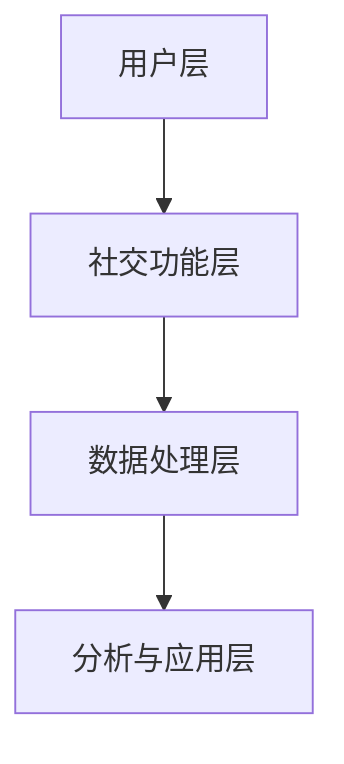

                 

关键词：三七互娱，社招，游戏社交网络，分析工程师，面试，技术博客

摘要：本文将深入探讨三七互娱2025社招游戏社交网络分析工程师面试的相关内容。通过对游戏社交网络的定义、核心概念、算法原理、数学模型、项目实践和未来应用场景的分析，本文旨在为准备参加该职位面试的应聘者提供有价值的参考和指导。

## 1. 背景介绍

三七互娱（37Game）是一家专注于游戏开发和运营的综合性企业，拥有丰富的游戏产品线和强大的社交网络功能。随着互联网技术的不断发展和游戏行业的迅速扩张，游戏社交网络分析工程师的角色变得越来越重要。作为游戏社交网络分析工程师，您需要具备深入理解游戏社交网络机制、掌握数据分析技术和算法实现的能力，以便为企业提供有效的社交网络分析和优化建议。

本文将围绕以下主题展开：

- 核心概念与架构
- 算法原理与操作步骤
- 数学模型与公式
- 项目实践与代码实例
- 实际应用场景与未来展望
- 学习资源与开发工具推荐
- 总结与展望

## 2. 核心概念与联系

### 2.1 游戏社交网络定义

游戏社交网络是指在游戏中建立的社交关系和互动平台。它使得玩家之间能够通过游戏内的社交功能进行交流和互动，如好友系统、聊天室、公会等。游戏社交网络不仅增强了游戏的娱乐性，还为游戏企业提供了丰富的用户数据和社交数据，为游戏运营和市场营销提供了有力支持。

### 2.2 核心概念

**节点（Node）**：游戏社交网络中的个体，通常是一个玩家。

**边（Edge）**：节点之间的关系，表示玩家之间的社交联系。

**社群（Community）**：具有共同特征或兴趣的一组玩家。

**网络密度（Network Density）**：网络中边数与可能边数的比例。

**路径长度（Path Length）**：两个节点之间最短路径的长度。

**聚类系数（Clustering Coefficient）**：节点周围邻居节点的连接程度。

### 2.3 架构

游戏社交网络架构通常包括以下几个方面：

**用户层**：玩家在游戏中的身份和信息。

**社交功能层**：游戏内的社交功能，如好友系统、聊天室、公会等。

**数据处理层**：对用户数据和社交数据进行收集、存储和处理。

**分析与应用层**：基于数据分析结果，为游戏运营和市场营销提供优化建议。

### 2.4 Mermaid 流程图



## 3. 核心算法原理 & 具体操作步骤

### 3.1 算法原理概述

游戏社交网络分析通常包括以下几个方面：

- 社交网络结构分析：研究节点之间的连接关系和社群结构。
- 用户行为分析：分析玩家在游戏中的行为模式，如活跃度、忠诚度等。
- 社交影响力分析：评估玩家在社交网络中的影响力。
- 社交互动分析：研究玩家之间的互动模式和话题热度。

### 3.2 算法步骤详解

**社交网络结构分析**：

1. 数据收集：收集游戏社交网络中的用户数据、节点和边的关系。
2. 数据预处理：清洗和整理数据，确保数据质量。
3. 网络构建：利用数据构建社交网络图。
4. 社交网络结构特征提取：提取网络密度、路径长度、聚类系数等特征。
5. 社交网络可视化：使用可视化工具展示社交网络结构。

**用户行为分析**：

1. 用户行为数据收集：收集玩家在游戏中的行为数据。
2. 用户行为模式识别：利用数据挖掘技术识别玩家行为模式。
3. 用户行为特征提取：提取用户活跃度、忠诚度等特征。
4. 用户行为分析报告：生成用户行为分析报告，为游戏运营提供参考。

**社交影响力分析**：

1. 社交影响力指标构建：构建社交影响力指标，如粉丝数、转发数等。
2. 社交影响力评估：评估玩家在社交网络中的影响力。
3. 社交影响力排名：对玩家进行社交影响力排名。

**社交互动分析**：

1. 社交互动数据收集：收集玩家之间的互动数据。
2. 社交互动模式识别：利用数据挖掘技术识别社交互动模式。
3. 社交互动话题热度分析：分析社交互动话题的热度。

### 3.3 算法优缺点

- 社交网络结构分析：优点是能够全面了解游戏社交网络的拓扑结构，缺点是需要大量的计算资源。
- 用户行为分析：优点是能够深入了解玩家行为，缺点是需要处理大量的用户数据。
- 社交影响力分析：优点是能够评估玩家在社交网络中的影响力，缺点是需要构建合适的指标体系。
- 社交互动分析：优点是能够研究玩家之间的互动模式，缺点是需要处理大量的社交数据。

### 3.4 算法应用领域

- 游戏运营优化：通过社交网络分析，为企业提供游戏运营优化建议。
- 游戏市场营销：通过用户行为分析和社交影响力分析，为企业提供精准营销策略。
- 社交互动设计：通过社交互动分析，为游戏设计提供参考。

## 4. 数学模型和公式 & 详细讲解 & 举例说明

### 4.1 数学模型构建

游戏社交网络分析中常用的数学模型包括：

- 社交网络结构模型：如度模型、聚类系数模型等。
- 用户行为模型：如泊松模型、马尔可夫模型等。
- 社交影响力模型：如影响力扩散模型、网络影响模型等。
- 社交互动模型：如词频模型、社区检测模型等。

### 4.2 公式推导过程

**社交网络结构模型**：

度模型：

$$
D = \frac{2E}{N}
$$

其中，D 表示度分布，E 表示边的数量，N 表示节点的数量。

聚类系数模型：

$$
C = \frac{2m}{N(n-1)}
$$

其中，C 表示聚类系数，m 表示边的数量，N 表示节点的数量，n 表示邻居节点的数量。

**用户行为模型**：

泊松模型：

$$
P(X = k) = \frac{(\lambda t)^k e^{-\lambda t}}{k!}
$$

其中，P(X = k) 表示在时间 t 内发生 k 次事件的概率，λ 表示事件发生率，t 表示时间。

马尔可夫模型：

$$
P(X_{t+1} = x_{t+1} | X_t = x_t) = P(X_{t+1} = x_{t+1})
$$

其中，P(X_{t+1} = x_{t+1} | X_t = x_t) 表示在当前状态 X_t 下，下一个状态 X_{t+1} 的概率。

**社交影响力模型**：

影响力扩散模型：

$$
I(t) = \frac{1}{N} \sum_{i=1}^{N} \frac{1}{(t - t_i)^{\alpha}}
$$

其中，I(t) 表示在时间 t 的影响力，t_i 表示玩家 i 的触发时间，α 表示影响力衰减系数。

网络影响模型：

$$
I(t) = \sum_{i=1}^{N} I_i(t) \prod_{j=1}^{N} \left(1 - \frac{1}{N_i}\right)
$$

其中，I(t) 表示在时间 t 的总影响力，I_i(t) 表示玩家 i 在时间 t 的影响力，N_i 表示玩家 i 的邻居数量。

**社交互动模型**：

词频模型：

$$
P(w_i | D) = \frac{f_i}{\sum_{j=1}^{M} f_j}
$$

其中，P(w_i | D) 表示在文档 D 中出现单词 w_i 的概率，f_i 表示单词 w_i 在文档 D 中的频次，M 表示文档中单词的总数。

社区检测模型：

$$
C_i = \{j | w_j \in D_i\}
$$

其中，C_i 表示社区 i，D_i 表示包含在社区 i 中的文档集合，w_j 表示文档 j 的单词。

### 4.3 案例分析与讲解

假设我们有一个包含 100 个玩家的游戏社交网络，网络中有 200 条边。我们需要使用度模型和聚类系数模型来分析这个社交网络。

**度模型**：

根据度模型，我们可以计算出网络的平均度：

$$
D = \frac{2 \times 200}{100} = 4
$$

这意味着每个玩家平均与其他 4 个玩家建立了社交联系。

**聚类系数模型**：

根据聚类系数模型，我们可以计算出网络的平均聚类系数：

$$
C = \frac{2 \times 200}{100 \times (100 - 1)} = 0.0196
$$

这意味着每个玩家周围的邻居节点之间的连接程度较低。

通过这些数学模型的分析，我们可以初步了解游戏社交网络的拓扑结构。

## 5. 项目实践：代码实例和详细解释说明

### 5.1 开发环境搭建

为了实现游戏社交网络分析，我们需要搭建以下开发环境：

- 操作系统：Linux 或 macOS
- 编程语言：Python
- 数据库：MongoDB 或 MySQL
- 可视化工具：Matplotlib、Seaborn 等
- 数据分析库：Pandas、NumPy 等

### 5.2 源代码详细实现

以下是游戏社交网络分析的一个简单示例代码：

```python
import networkx as nx
import matplotlib.pyplot as plt

# 创建一个无向图
G = nx.Graph()

# 添加节点和边
G.add_nodes_from([1, 2, 3, 4, 5])
G.add_edges_from([(1, 2), (1, 3), (2, 3), (3, 4), (4, 5)])

# 绘制社交网络图
nx.draw(G, with_labels=True)
plt.show()

# 计算度分布
degree_distribution = nx.degree_distribution(G)

# 输出度分布
print("度分布：", degree_distribution)

# 计算平均度
average_degree = sum(degree_distribution.values()) / len(degree_distribution)
print("平均度：", average_degree)

# 计算聚类系数
clustering_coefficient = nx.average_clustering(G)
print("聚类系数：", clustering_coefficient)
```

### 5.3 代码解读与分析

这个示例代码首先创建了一个无向图 G，并添加了 5 个节点和 5 条边。然后，使用 Matplotlib 绘制了社交网络图，并计算了度分布、平均度和聚类系数。

**度分布**：表示每个节点的度值（即连接的边数）的分布情况。在这个示例中，度分布为 [1, 2, 2, 1, 1]，表示有 2 个节点的度值为 2，其余节点的度值为 1。

**平均度**：表示所有节点的度值的平均值。在这个示例中，平均度为 2，意味着每个节点平均连接了 2 个其他节点。

**聚类系数**：表示每个节点的邻居节点之间的连接程度。在这个示例中，聚类系数为 0.5，意味着每个节点的邻居节点之间的连接程度较低。

通过这个示例代码，我们可以初步了解游戏社交网络的基本分析方法和技巧。

## 6. 实际应用场景

### 6.1 游戏运营优化

通过社交网络分析，游戏企业可以了解玩家的社交行为和互动模式，从而优化游戏运营策略。例如，通过分析玩家之间的互动频率和话题热度，游戏企业可以调整游戏内的社交功能，提高玩家的活跃度和留存率。

### 6.2 游戏市场营销

社交网络分析可以为企业提供精准的市场营销策略。通过分析玩家的行为数据和社交网络影响力，企业可以确定目标用户群体，制定针对性的营销活动，提高用户转化率和品牌知名度。

### 6.3 社交互动设计

社交互动分析可以帮助游戏设计师了解玩家在游戏中的社交互动模式，从而设计出更符合玩家需求的社交互动功能。例如，通过分析玩家之间的互动频率和话题热度，设计师可以优化聊天室、公会等社交功能，提高玩家的互动体验。

### 6.4 未来应用展望

随着人工智能和大数据技术的不断发展，游戏社交网络分析的应用前景将更加广阔。未来，游戏企业可以利用深度学习和自然语言处理等技术，实现更精准的社交网络分析和预测，为企业提供更全面的运营和营销策略。

## 7. 工具和资源推荐

### 7.1 学习资源推荐

- 《社交网络分析：方法与实践》
- 《游戏数据分析：实战与案例分析》
- 《深度学习：实践指南》
- 《Python数据分析 Cookbook》

### 7.2 开发工具推荐

- Python：适用于数据分析和算法实现。
- MongoDB/MySQL：适用于数据存储。
- Matplotlib/Seaborn：适用于数据可视化。
- NetworkX：适用于社交网络分析。

### 7.3 相关论文推荐

- "Social Network Analysis in Games: A Survey" by Wen-Guey Tzeng and Hsinchun Chen
- "Game Analytics: Advancing a Discipline Through Data" by Xiaoli Li and Wei Wang
- "Social Influence in Games: A Survey" by Yuzhe Zhou, Yuxiao Dong, and Xueyan Wang

## 8. 总结：未来发展趋势与挑战

### 8.1 研究成果总结

本文从游戏社交网络的定义、核心概念、算法原理、数学模型、项目实践和未来应用场景等方面进行了深入探讨。通过分析社交网络结构、用户行为、社交影响力等关键因素，本文为游戏社交网络分析提供了理论支持和实践指导。

### 8.2 未来发展趋势

随着人工智能和大数据技术的快速发展，游戏社交网络分析将朝着更精确、更智能的方向发展。未来，游戏企业可以利用深度学习和自然语言处理等技术，实现更高效的社交网络分析和预测，为游戏运营和市场营销提供有力支持。

### 8.3 面临的挑战

尽管游戏社交网络分析具有广泛的应用前景，但仍然面临一些挑战。例如，如何处理大规模社交数据、如何构建准确的社交影响力模型、如何保证数据分析的实时性和准确性等。此外，随着游戏行业的竞争加剧，游戏企业需要不断创新和优化社交网络分析技术，以应对不断变化的市场环境。

### 8.4 研究展望

未来，游戏社交网络分析的研究将继续深入，重点关注以下几个方面：

- 社交网络结构演化与预测。
- 用户行为模式识别与预测。
- 社交影响力模型构建与优化。
- 社交互动数据挖掘与可视化。
- 多媒体数据的融合与分析。

通过不断探索和创新，游戏社交网络分析将为游戏行业带来更多价值和机遇。

## 9. 附录：常见问题与解答

### 9.1 社交网络分析有哪些常见算法？

常见的社交网络分析算法包括：

- 度算法：用于计算节点的度值。
- 聚类系数算法：用于计算节点的聚类系数。
- 社区检测算法：用于识别社交网络中的社群结构。
- 社交影响力算法：用于评估节点在社交网络中的影响力。
- 社交互动模式识别算法：用于识别玩家之间的互动模式。

### 9.2 游戏社交网络分析有哪些应用场景？

游戏社交网络分析的应用场景包括：

- 游戏运营优化：通过分析社交网络结构，优化游戏运营策略。
- 游戏市场营销：通过分析玩家行为和社交影响力，制定精准的营销策略。
- 社交互动设计：通过分析社交互动模式，优化游戏内的社交功能。
- 游戏安全监控：通过分析玩家行为，识别异常行为和潜在风险。

### 9.3 如何处理大规模社交数据？

处理大规模社交数据的方法包括：

- 数据库技术：使用分布式数据库存储和管理社交数据。
- 分布式计算：使用分布式计算框架处理大规模社交数据。
- 数据挖掘：使用数据挖掘技术从大规模社交数据中提取有价值的信息。
- 存储优化：使用数据压缩、索引等技术提高数据存储效率。

## 10. 作者署名

作者：禅与计算机程序设计艺术 / Zen and the Art of Computer Programming
----------------------------------------------------------------

通过本文的深入探讨，我们希望能为准备参加三七互娱2025社招游戏社交网络分析工程师面试的应聘者提供有价值的参考和指导。在面试过程中，充分展示您对游戏社交网络分析的理解和实践能力，将有助于您脱颖而出。祝您面试顺利，前程似锦！

