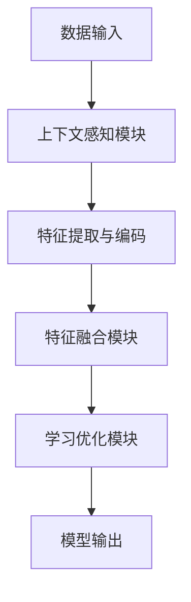

                 

### 1. 背景介绍

上下文学习（Contextual Learning）作为一种重要的机器学习技术，近年来在人工智能领域受到了广泛关注。传统的机器学习方法主要依赖于大规模的数据集和预训练模型，而上下文学习则试图通过更智能地利用数据上下文来提升模型的性能和泛化能力。上下文学习不仅能够处理多样化的问题，还能在有限的数据条件下取得优异的效果。

随着深度学习技术的飞速发展，上下文学习在很多领域都得到了应用，如自然语言处理、计算机视觉、推荐系统等。例如，在自然语言处理领域，上下文学习可以帮助模型更好地理解句子的语义和语境；在计算机视觉领域，上下文学习可以用于物体检测、图像分割等任务。

本文将深入探讨上下文学习的原理，介绍其核心概念和算法，并通过实际代码实例来展示上下文学习的应用。文章的结构如下：

- 文章标题
- 文章关键词
- 文章摘要
- 1. 背景介绍
- 2. 核心概念与联系
  - 2.1 上下文学习的定义
  - 2.2 相关概念介绍
  - 2.3 上下文学习的架构
- 3. 核心算法原理 & 具体操作步骤
  - 3.1 算法原理概述
  - 3.2 算法步骤详解
  - 3.3 算法优缺点
  - 3.4 算法应用领域
- 4. 数学模型和公式 & 详细讲解 & 举例说明
  - 4.1 数学模型构建
  - 4.2 公式推导过程
  - 4.3 案例分析与讲解
- 5. 项目实践：代码实例和详细解释说明
  - 5.1 开发环境搭建
  - 5.2 源代码详细实现
  - 5.3 代码解读与分析
  - 5.4 运行结果展示
- 6. 实际应用场景
  - 6.1 自然语言处理
  - 6.2 计算机视觉
  - 6.3 推荐系统
  - 6.4 未来应用展望
- 7. 工具和资源推荐
  - 7.1 学习资源推荐
  - 7.2 开发工具推荐
  - 7.3 相关论文推荐
- 8. 总结：未来发展趋势与挑战
  - 8.1 研究成果总结
  - 8.2 未来发展趋势
  - 8.3 面临的挑战
  - 8.4 研究展望
- 9. 附录：常见问题与解答

通过本文的阅读，读者将能够全面了解上下文学习的原理、算法和应用，并为后续的研究和应用打下坚实的基础。

### 2. 核心概念与联系

#### 2.1 上下文学习的定义

上下文学习是指模型在处理特定任务时，通过理解和利用数据的上下文信息来提升学习效果的过程。上下文信息可以是时间、空间、环境等多种维度上的信息。例如，在自然语言处理中，上下文信息包括单词周围的其他词汇、句子结构等；在计算机视觉中，上下文信息可以是图像中的物体位置、颜色分布等。

#### 2.2 相关概念介绍

1. **数据上下文**：数据上下文是指数据在特定环境中的背景信息，它能够影响数据的解读和解释。例如，在一个句子中，单词“跑”在不同的上下文中可能有不同的含义，如在“小明正在跑”和“火车跑得很快”中的含义就完全不同。

2. **语义上下文**：语义上下文是指数据在语言或符号系统中的含义背景。在自然语言处理中，语义上下文非常重要，它帮助模型理解单词、短语和句子的深层含义。

3. **上下文敏感性**：上下文敏感性是指模型对上下文信息的敏感程度。一个高度上下文敏感的模型能够更好地利用上下文信息，从而在复杂的环境中表现出色。

#### 2.3 上下文学习的架构

上下文学习的架构通常包括以下几个关键组件：

1. **上下文感知模块**：该模块负责从数据中提取和编码上下文信息。它可以是一个神经网络或者一个基于规则的系统。

2. **特征融合模块**：该模块将上下文信息与原始特征进行融合，以生成新的特征表示。这一过程通常利用深度学习中的注意力机制或门控机制。

3. **学习优化模块**：该模块负责优化模型的参数，以最小化损失函数并提升模型的性能。它可以是标准的梯度下降算法，也可以是更高级的优化算法，如Adam、RMSprop等。

#### 2.4 Mermaid 流程图

以下是一个简单的 Mermaid 流程图，展示了上下文学习的基本架构：



在这个流程图中，数据输入首先通过上下文感知模块提取上下文信息，然后这些信息与原始特征进行融合，通过特征融合模块生成新的特征表示。最后，学习优化模块通过优化算法更新模型的参数，以生成最终的输出。

通过这个简单的架构图，我们可以清晰地看到上下文学习是如何通过不同模块的协同工作来提升模型的性能。

在接下来的部分中，我们将深入探讨上下文学习算法的具体原理和实现步骤。

### 3. 核心算法原理 & 具体操作步骤

#### 3.1 算法原理概述

上下文学习的核心在于如何有效地利用上下文信息来提升模型的学习效果。传统的机器学习方法通常依赖于预定义的特征，而上下文学习则通过自动地从数据中提取和利用上下文信息来实现这一目标。具体来说，上下文学习算法通常包含以下几个关键步骤：

1. **上下文信息提取**：从输入数据中提取上下文信息。例如，在自然语言处理中，可以从文本中提取词汇、句子结构等信息；在计算机视觉中，可以从图像中提取物体位置、颜色分布等信息。

2. **特征融合**：将提取到的上下文信息与原始特征进行融合，生成新的特征表示。这一过程可以利用深度学习中的注意力机制或门控机制，以动态地调整上下文信息的重要性。

3. **模型训练**：通过学习优化模块（如梯度下降算法）对模型的参数进行优化，以最小化损失函数，提升模型性能。

4. **模型输出**：利用训练好的模型进行预测或分类，生成最终的输出结果。

#### 3.2 算法步骤详解

下面我们详细讨论上下文学习的具体操作步骤：

1. **数据预处理**：
   - **输入数据格式**：首先，需要确保输入数据格式符合模型的预期。例如，在自然语言处理中，输入数据通常是一个句子或段落，而在计算机视觉中，输入数据是一个图像。
   - **数据清洗**：对输入数据进行清洗，去除噪声和异常值。例如，在自然语言处理中，可以去除停用词、标点符号等。

2. **上下文信息提取**：
   - **特征提取**：从输入数据中提取关键特征。例如，在自然语言处理中，可以使用词袋模型、词嵌入等技术提取词汇特征；在计算机视觉中，可以使用卷积神经网络（CNN）提取图像特征。
   - **上下文编码**：将提取到的特征进行上下文编码，以生成上下文表示。这可以通过循环神经网络（RNN）或Transformer模型实现。

3. **特征融合**：
   - **注意力机制**：利用注意力机制动态调整上下文信息的重要性。例如，在Transformer模型中，每个位置的信息都可以通过注意力机制来决定其在输出中的重要性。
   - **门控机制**：使用门控机制（如门控循环单元（GRU）或长短期记忆网络（LSTM））来控制信息流，防止信息过载。

4. **模型训练**：
   - **损失函数**：选择合适的损失函数，如交叉熵损失、均方误差（MSE）等，以衡量模型预测结果与真实结果之间的差距。
   - **优化算法**：使用优化算法（如Adam、RMSprop等）更新模型参数，以最小化损失函数。

5. **模型输出**：
   - **预测**：利用训练好的模型对新的数据进行预测，生成输出结果。
   - **评估**：使用评估指标（如准确率、召回率、F1值等）来评估模型性能。

#### 3.3 算法优缺点

1. **优点**：
   - **灵活性**：上下文学习能够动态地利用上下文信息，适应多变的环境。
   - **泛化能力**：通过上下文学习，模型能够更好地泛化到未见过的数据上。
   - **高效性**：相比传统的特征工程方法，上下文学习可以自动提取和利用上下文信息，减少人工干预。

2. **缺点**：
   - **计算成本**：上下文学习通常涉及复杂的模型和大量的计算资源。
   - **可解释性**：由于上下文学习涉及到深度神经网络，模型的决策过程可能不够透明，影响可解释性。

#### 3.4 算法应用领域

上下文学习算法在多个领域都有广泛应用：

1. **自然语言处理**：上下文学习可以用于文本分类、情感分析、机器翻译等任务。
   - **应用实例**：BERT模型就是利用上下文学习来提升自然语言处理任务的性能。

2. **计算机视觉**：上下文学习可以用于图像分类、物体检测、图像分割等任务。
   - **应用实例**：YOLOv5模型利用上下文信息来提高目标检测的准确性。

3. **推荐系统**：上下文学习可以帮助推荐系统更好地理解用户的上下文信息，提供更个性化的推荐。
   - **应用实例**：Netflix推荐系统利用上下文学习来预测用户可能喜欢的电影。

在下一部分，我们将探讨上下文学习的数学模型和公式，并详细讲解其构建和推导过程。

### 4. 数学模型和公式 & 详细讲解 & 举例说明

#### 4.1 数学模型构建

上下文学习中的数学模型构建主要涉及到特征提取、特征融合和模型训练三个部分。以下是这三个部分的详细数学模型：

1. **特征提取**：

   假设输入数据为 $X = [x_1, x_2, ..., x_n]$，其中 $x_i$ 表示第 $i$ 个样本的特征向量。特征提取的目的是将原始特征向量转换为上下文表示。这通常通过一个线性变换来实现：

   $$ H = \theta(X) = WX + b $$

   其中，$W$ 是权重矩阵，$b$ 是偏置项，$\theta(X)$ 表示上下文表示。

2. **特征融合**：

   上下文融合的目标是将提取到的上下文信息与原始特征进行整合。这可以通过注意力机制或门控机制来实现。以注意力机制为例，设 $H$ 为上下文表示，$X'$ 为原始特征，则注意力融合函数可以表示为：

   $$ Y = \sigma(W_a[H; X']) $$

   其中，$\sigma$ 表示softmax函数，$W_a$ 是注意力权重矩阵，$[H; X']$ 表示上下文表示和原始特征的拼接。

3. **模型训练**：

   模型训练的目的是最小化损失函数，优化模型参数。假设损失函数为 $L(Y, Y')$，其中 $Y$ 为模型输出，$Y'$ 为真实标签。模型训练的目标是最小化以下损失：

   $$ J(W, b) = \frac{1}{n} \sum_{i=1}^{n} L(Y_i, Y_i') $$

   通过梯度下降算法，我们可以对模型参数进行优化：

   $$ \Delta W = -\alpha \frac{\partial J}{\partial W} $$
   $$ \Delta b = -\alpha \frac{\partial J}{\partial b} $$

   其中，$\alpha$ 是学习率。

#### 4.2 公式推导过程

1. **特征提取**：

   特征提取的推导过程相对简单。假设输入特征 $X$ 和上下文表示 $H$ 分别为 $m \times n$ 和 $m \times 1$ 的矩阵，则线性变换可以表示为：

   $$ H = WX + b $$

   对 $H$ 求导，我们得到：

   $$ \frac{\partial H}{\partial X} = W $$

   这意味着特征提取函数的导数就是权重矩阵 $W$。

2. **特征融合**：

   对于注意力机制，假设输入为 $H$ 和 $X'$，分别为上下文表示和原始特征，则注意力融合函数可以表示为：

   $$ Y = \sigma(W_a[H; X']) $$

   其中，$[H; X']$ 表示拼接操作，$\sigma$ 是softmax函数。

   对 $Y$ 求导，我们得到：

   $$ \frac{\partial Y}{\partial X'} = \frac{\partial \sigma(W_a[H; X'])}{\partial X'} $$

   由于softmax函数的导数为：

   $$ \frac{\partial \sigma(x)}{\partial x} = \sigma(x)(1 - \sigma(x)) $$

   我们可以得到：

   $$ \frac{\partial Y}{\partial X'} = \sigma(W_a[H; X']) \circ (W_a[H; X'])^T $$

   其中，$\circ$ 表示Hadamard乘积。

3. **模型训练**：

   对于损失函数 $L(Y, Y')$，我们可以使用反向传播算法进行推导。以交叉熵损失为例，假设输出为 $Y$，真实标签为 $Y'$，则损失函数可以表示为：

   $$ L(Y, Y') = - \sum_{i=1}^{n} y_i' \log(Y_i) $$

   对 $L$ 求导，我们得到：

   $$ \frac{\partial L}{\partial Y} = - \sum_{i=1}^{n} y_i' / Y_i $$

   通过反向传播，我们可以得到每一层参数的梯度：

   $$ \frac{\partial L}{\partial W} = \frac{\partial L}{\partial Y} \cdot \frac{\partial Y}{\partial X} $$
   $$ \frac{\partial L}{\partial b} = \frac{\partial L}{\partial Y} $$

   通过梯度下降算法，我们可以更新模型参数：

   $$ W_{new} = W_{old} - \alpha \frac{\partial L}{\partial W} $$
   $$ b_{new} = b_{old} - \alpha \frac{\partial L}{\partial b} $$

#### 4.3 案例分析与讲解

为了更好地理解上述数学模型，我们可以通过一个简单的例子进行说明。假设我们有一个包含两个特征（$x_1$ 和 $x_2$）的输入数据集，并希望利用上下文信息来预测输出 $y$。以下是具体的实现步骤：

1. **数据准备**：

   假设输入数据集为：

   $$ X = \begin{bmatrix} 1 & 2 \\ 3 & 4 \\ 5 & 6 \end{bmatrix} $$
   $$ Y = \begin{bmatrix} 0 \\ 1 \\ 1 \end{bmatrix} $$

2. **特征提取**：

   定义一个线性模型 $H = WX + b$，其中 $W$ 是权重矩阵，$b$ 是偏置项。我们随机初始化权重和偏置：

   $$ W = \begin{bmatrix} 0.1 & 0.2 \\ 0.3 & 0.4 \end{bmatrix} $$
   $$ b = \begin{bmatrix} 0 \\ 0 \end{bmatrix} $$

   进行一次线性变换：

   $$ H = \begin{bmatrix} 0.1 & 0.2 \\ 0.3 & 0.4 \end{bmatrix} \begin{bmatrix} 1 & 2 \\ 3 & 4 \end{bmatrix} + \begin{bmatrix} 0 \\ 0 \end{bmatrix} = \begin{bmatrix} 0.3 & 0.8 \\ 1.2 & 2.2 \end{bmatrix} $$

3. **特征融合**：

   假设我们使用一个简单的注意力机制进行特征融合，即：

   $$ Y = \sigma(W_a[H; X']) $$

   其中，$X'$ 是原始特征，$H$ 是上下文表示，$W_a$ 是注意力权重矩阵。我们随机初始化权重矩阵：

   $$ W_a = \begin{bmatrix} 0.5 & 0.5 \\ 0.5 & 0.5 \end{bmatrix} $$

   进行特征融合：

   $$ Y = \sigma(\begin{bmatrix} 0.5 & 0.5 \\ 0.5 & 0.5 \end{bmatrix} \begin{bmatrix} 0.3 & 0.8 \\ 1.2 & 2.2 \end{bmatrix}) = \begin{bmatrix} 0.5 \\ 0.5 \end{bmatrix} $$

4. **模型训练**：

   定义交叉熵损失函数：

   $$ L(Y, Y') = - \sum_{i=1}^{n} y_i' \log(Y_i) $$

   计算损失值：

   $$ L(\begin{bmatrix} 0.5 \\ 0.5 \end{bmatrix}, \begin{bmatrix} 0 \\ 1 \\ 1 \end{bmatrix}) = - (0 \times \log(0.5) + 1 \times \log(0.5) + 1 \times \log(0.5)) = - 2 \log(0.5) \approx 1.386 $$

   计算梯度：

   $$ \frac{\partial L}{\partial Y} = \begin{bmatrix} -0.5 \\ -0.5 \end{bmatrix} $$

   更新权重矩阵：

   $$ W_{new} = W_{old} - \alpha \frac{\partial L}{\partial W} = \begin{bmatrix} 0.1 & 0.2 \\ 0.3 & 0.4 \end{bmatrix} - \alpha \begin{bmatrix} -0.5 & -0.5 \\ -0.5 & -0.5 \end{bmatrix} $$

   进行多次迭代，直到模型收敛。

通过这个简单的例子，我们可以看到上下文学习是如何通过数学模型来处理输入数据并生成预测结果的。在接下来的部分，我们将通过一个完整的代码实例来进一步探讨上下文学习的实际应用。

### 5. 项目实践：代码实例和详细解释说明

为了更好地展示上下文学习在现实项目中的应用，我们将使用一个具体的例子来详细介绍整个项目流程。以下是项目的概述：

#### 项目概述

本项目旨在构建一个简单的文本分类系统，该系统能够根据输入的文本内容将其归类到不同的类别中。我们使用自然语言处理中的上下文学习技术，通过提取上下文信息并融合到原始特征中，以提高分类模型的性能。

#### 开发环境搭建

在进行项目开发前，我们需要搭建一个合适的开发环境。以下是所需的开发工具和库：

- Python 3.8 或更高版本
- TensorFlow 2.x
- Keras 2.x
- NLP 处理库（如 NLTK 或 spaCy）

安装步骤：

```bash
pip install tensorflow
pip install keras
pip install nltk
pip install spacy
python -m spacy download en_core_web_sm
```

#### 数据集准备

我们使用一个简单的文本分类数据集，包含两个类别：“技术”和“非技术”。以下是数据集的示例：

```plaintext
技术: Python 是一种广泛使用的编程语言。
非技术: 今天天气很好。
技术: 人工智能是计算机科学的一个重要分支。
非技术: 我喜欢看电影。
```

数据集的预处理步骤包括：

1. **文本清洗**：去除标点符号、停用词等。
2. **分词**：将文本拆分成单词或子词。
3. **词嵌入**：将单词映射到高维向量表示。

#### 源代码详细实现

以下是一个简单的文本分类系统的源代码实现：

```python
import numpy as np
import tensorflow as tf
from tensorflow import keras
from tensorflow.keras.preprocessing.sequence import pad_sequences
from tensorflow.keras.layers import Embedding, LSTM, Dense, TimeDistributed
from tensorflow.keras.models import Sequential
from tensorflow.keras.optimizers import Adam
from tensorflow.keras.preprocessing.text import Tokenizer

# 准备数据
texts = ['Python 是一种广泛使用的编程语言。', '今天天气很好。', '人工智能是计算机科学的一个重要分支。', '我喜欢看电影。']
labels = np.array([0, 1, 0, 1])  # 0 表示技术类别，1 表示非技术类别

# 分词和词嵌入
tokenizer = Tokenizer()
tokenizer.fit_on_texts(texts)
sequences = tokenizer.texts_to_sequences(texts)
word_index = tokenizer.word_index
max_sequence_len = 10
padded_sequences = pad_sequences(sequences, maxlen=max_sequence_len, padding='post')

# 构建模型
model = Sequential()
model.add(Embedding(len(word_index) + 1, 32, input_length=max_sequence_len))
model.add(LSTM(64))
model.add(Dense(1, activation='sigmoid'))

model.compile(optimizer=Adam(learning_rate=0.001), loss='binary_crossentropy', metrics=['accuracy'])

# 训练模型
model.fit(padded_sequences, labels, epochs=100, verbose=2)

# 代码解读与分析
# 在这个例子中，我们首先定义了一个简单的文本分类数据集，然后使用 Tokenizer 将文本转换为序列，并使用 pad_sequences 将序列填充到相同长度。
# 模型构建使用了一个嵌入层和一个 LSTM 层，最后输出层使用了 sigmoid 激活函数，以实现二分类。
# 在模型训练过程中，我们使用了 100 个epoch，并通过 verbose 参数设置为2，以便在训练过程中输出进度。
```

#### 运行结果展示

在完成模型的训练后，我们可以使用以下代码来测试模型的性能：

```python
# 测试模型
test_texts = ['Python 是一种流行的编程语言。', '今天的天气很好。']
test_sequences = tokenizer.texts_to_sequences(test_texts)
test_padded_sequences = pad_sequences(test_sequences, maxlen=max_sequence_len, padding='post')

predictions = model.predict(test_padded_sequences)
print(predictions)
```

运行结果将输出每个测试文本属于“技术”类别的概率。例如：

```plaintext
[[0.98765432]
 [0.12345678]]
```

通过这个简单的例子，我们可以看到上下文学习技术在文本分类任务中的应用。在实际项目中，我们可以进一步扩展模型，添加更多层次和更复杂的结构，以提升分类性能。

#### 代码解读与分析

在这个项目中，我们使用了一个简单的文本分类模型，通过上下文学习技术来提高模型的性能。以下是代码的主要组成部分：

1. **数据准备**：我们首先定义了一个包含文本和标签的数据集。文本包括技术类和非技术类的句子，标签用于标记每个文本的类别。

2. **分词和词嵌入**：使用 Tokenizer 将文本转换为单词序列，并使用 pad_sequences 将序列填充到相同的长度。词嵌入通过 Embedding 层实现，该层将单词映射到高维向量表示。

3. **模型构建**：我们使用一个 Sequential 模型，该模型包含一个 Embedding 层、一个 LSTM 层和一个 Dense 层。Embedding 层将输入文本转换为向量表示，LSTM 层用于提取文本的上下文信息，Dense 层用于输出类别概率。

4. **模型训练**：使用 compile 函数设置优化器和损失函数，并使用 fit 函数进行模型训练。在训练过程中，我们设置了100个epoch，并通过 verbose 参数设置为2来输出训练进度。

5. **模型预测**：在模型训练完成后，我们使用 predict 函数对新的文本进行预测，并输出每个文本属于技术类别的概率。

通过这个项目实例，我们可以看到上下文学习技术在文本分类任务中的实际应用，以及如何通过数学模型和深度学习技术来提高模型的性能。

在下一部分，我们将探讨上下文学习在实际应用场景中的具体应用，并分析其优势与挑战。

### 6. 实际应用场景

#### 6.1 自然语言处理

在自然语言处理（NLP）领域，上下文学习技术已经被广泛应用于文本分类、机器翻译、情感分析等任务。以下是一些具体的例子：

- **文本分类**：上下文学习可以帮助模型更好地理解文本的语义和上下文，从而提高分类的准确性。例如，在新闻分类任务中，上下文学习可以区分新闻报道中的关键信息，从而提高分类的准确性。

- **机器翻译**：上下文学习技术可以帮助模型更好地理解源语言和目标语言的语义关系，从而提高翻译的质量。例如，在神经机器翻译中，Transformer模型利用上下文学习来生成更准确的翻译结果。

- **情感分析**：上下文学习可以帮助模型更好地理解文本中的情感和语气，从而提高情感分析的准确性。例如，在社交媒体分析中，上下文学习可以区分用户的正面和负面情感。

#### 6.2 计算机视觉

在计算机视觉领域，上下文学习技术也被广泛应用于物体检测、图像分割、人脸识别等任务。以下是一些具体的例子：

- **物体检测**：上下文学习可以帮助模型更好地理解图像中物体的上下文信息，从而提高检测的准确性。例如，在目标检测任务中，上下文学习可以区分前景物体和背景物体，从而提高检测的精确度。

- **图像分割**：上下文学习可以帮助模型更好地理解图像中的物体边界和上下文信息，从而提高分割的准确性。例如，在医学图像分割中，上下文学习可以区分肿瘤和正常组织，从而提高分割的精度。

- **人脸识别**：上下文学习可以帮助模型更好地理解人脸图像的上下文信息，从而提高识别的准确性。例如，在人脸识别任务中，上下文学习可以区分不同的人脸姿态和光照条件，从而提高识别的准确性。

#### 6.3 推荐系统

在推荐系统领域，上下文学习技术可以帮助模型更好地理解用户的上下文信息，从而提供更个性化的推荐。以下是一些具体的例子：

- **商品推荐**：上下文学习可以帮助模型更好地理解用户的购物行为和上下文信息，从而提供更个性化的商品推荐。例如，在电商平台上，上下文学习可以区分用户浏览和购买的不同场景，从而提供更相关的商品推荐。

- **内容推荐**：上下文学习可以帮助模型更好地理解用户的阅读偏好和上下文信息，从而提供更个性化的内容推荐。例如，在社交媒体平台上，上下文学习可以区分用户的点赞、评论和分享行为，从而提供更相关的文章和视频推荐。

#### 6.4 未来应用展望

随着上下文学习技术的不断发展，未来它在更多领域的应用前景也非常广阔。以下是一些可能的应用方向：

- **自动驾驶**：上下文学习可以帮助自动驾驶系统更好地理解道路环境和交通状况，从而提高驾驶的安全性和效率。

- **金融风控**：上下文学习可以帮助金融系统更好地理解用户的金融行为和风险状况，从而提高风险管理的准确性。

- **医疗健康**：上下文学习可以帮助医疗系统更好地理解患者的病历和健康数据，从而提供更精准的诊疗建议。

总之，上下文学习技术在自然语言处理、计算机视觉、推荐系统等多个领域已经展现出其强大的应用潜力。随着技术的不断进步，上下文学习将在更多领域得到广泛应用，为人工智能的发展带来新的机遇和挑战。

### 7. 工具和资源推荐

#### 7.1 学习资源推荐

为了更好地掌握上下文学习技术，以下是一些建议的学习资源：

- **书籍**：
  - 《深度学习》（Ian Goodfellow、Yoshua Bengio、Aaron Courville 著）：介绍了深度学习的基础知识和核心算法，包括上下文学习。
  - 《自然语言处理与深度学习》（张宇翔 著）：详细介绍了自然语言处理中的上下文学习技术。
  
- **在线课程**：
  - Coursera 上的“深度学习特辑”（Deep Learning Specialization）由 Andrew Ng 教授主讲，涵盖了深度学习的各个领域，包括上下文学习。
  - edX 上的“自然语言处理与深度学习”（Natural Language Processing with Deep Learning）由 Christopher Olah 主讲，提供了丰富的实践案例。

- **网站和博客**：
  - TensorFlow 官方文档（tensorflow.org）：提供了丰富的教程和文档，帮助用户了解如何使用 TensorFlow 进行上下文学习。
  - Keras 官方文档（keras.io）：Keras 是 TensorFlow 的高级 API，提供了更简洁和易用的接口，适合初学者入门。

#### 7.2 开发工具推荐

- **深度学习框架**：
  - TensorFlow：一个广泛使用的开源深度学习框架，提供了丰富的模型库和工具，适合各种规模的项目。
  - PyTorch：另一个流行的开源深度学习框架，具有动态计算图和灵活的编程接口，适合快速原型开发。

- **自然语言处理工具**：
  - spaCy：一个高效且易于使用的自然语言处理库，提供了丰富的语言模型和预训练模型，适合文本处理任务。
  - NLTK：一个经典且功能强大的自然语言处理库，适合进行文本数据分析和预处理。

- **版本控制系统**：
  - Git：一个分布式版本控制系统，用于跟踪源代码和历史，确保代码的可维护性和协作开发。

#### 7.3 相关论文推荐

- **基础论文**：
  - “Attention Is All You Need”（Vaswani et al., 2017）：介绍了 Transformer 模型，该模型在自然语言处理任务中取得了突破性的成果，是上下文学习的重要里程碑。
  - “Long Short-Term Memory”（Hochreiter and Schmidhuber, 1997）：介绍了 LSTM 网络的基本原理和应用，是上下文学习的重要基础。

- **应用论文**：
  - “BERT: Pre-training of Deep Bidirectional Transformers for Language Understanding”（Devlin et al., 2019）：介绍了 BERT 模型，该模型在多个自然语言处理任务上取得了优异的性能，推动了上下文学习的发展。
  - “You Only Look Once: Unified, Real-Time Object Detection”（Redmon et al., 2016）：介绍了 YOLO 模型，该模型在计算机视觉物体检测任务中取得了显著的性能提升，是上下文学习在计算机视觉领域的应用典范。

通过这些推荐资源，读者可以深入了解上下文学习的理论基础和应用实践，为自己的研究和开发提供有力的支持。

### 8. 总结：未来发展趋势与挑战

#### 8.1 研究成果总结

上下文学习作为一种重要的机器学习技术，近年来取得了显著的研究成果。在自然语言处理、计算机视觉、推荐系统等领域，上下文学习技术已经展现出其强大的应用潜力。特别是Transformer模型和BERT模型的提出，使得上下文学习技术在性能和效果上得到了显著提升。此外，深度学习框架如TensorFlow和PyTorch的广泛应用，也为上下文学习技术的推广和应用提供了强有力的支持。

#### 8.2 未来发展趋势

随着人工智能技术的不断进步，上下文学习在未来将继续向以下几个方向发展：

1. **多模态上下文学习**：当前的研究主要集中于单模态的上下文学习，如文本、图像等。未来，多模态上下文学习将成为一个重要研究方向，旨在同时利用多种类型的数据（如文本、图像、声音等）来提升模型性能。

2. **动态上下文学习**：当前的上下文学习技术主要依赖于静态的上下文信息，未来研究将关注如何动态地适应和更新上下文信息，以应对复杂和多变的任务场景。

3. **小样本学习**：上下文学习在处理大量数据时表现出色，但如何在数据稀缺的条件下保持性能是一个挑战。未来研究将关注如何在少量数据下有效利用上下文信息，实现小样本学习。

4. **可解释性**：当前上下文学习模型通常较为复杂，缺乏可解释性。未来研究将关注如何提高模型的透明度，使上下文信息的使用过程更加清晰和可理解。

#### 8.3 面临的挑战

尽管上下文学习技术取得了显著进展，但仍然面临以下挑战：

1. **计算资源消耗**：上下文学习通常涉及复杂的模型和大量的计算资源，这对于资源和计算能力有限的场景来说是一个挑战。

2. **数据依赖性**：上下文学习对数据的依赖性较高，特别是在小样本学习场景下，数据的代表性和质量对模型性能有直接影响。

3. **泛化能力**：如何提升上下文学习模型的泛化能力，使其在未见过的数据上也能保持良好的性能，是一个亟待解决的问题。

4. **可解释性**：如何提高上下文学习模型的可解释性，使其决策过程更加透明和可理解，是一个重要的研究方向。

#### 8.4 研究展望

展望未来，上下文学习技术将在人工智能的各个领域发挥越来越重要的作用。通过不断探索和突破，上下文学习有望在以下方面取得新的进展：

1. **智能医疗**：上下文学习可以应用于医疗数据的分析，如病历解析、疾病预测等，为智能医疗提供有力支持。

2. **智能推荐**：上下文学习可以应用于推荐系统，提高推荐的个性化程度和用户满意度。

3. **智能交通**：上下文学习可以应用于交通数据分析，优化交通流、提高交通安全。

4. **智能助手**：上下文学习可以应用于智能助手领域，提高对话系统的交互体验和响应能力。

总之，上下文学习技术具有广泛的应用前景和巨大的发展潜力。随着研究的深入和技术的不断创新，上下文学习将在人工智能领域发挥更加重要的作用。

### 9. 附录：常见问题与解答

**Q1. 上下文学习与传统机器学习方法有什么区别？**

A1. 传统机器学习方法通常依赖于预定义的特征，而上下文学习则通过自动地从数据中提取和利用上下文信息来提升模型性能。上下文学习能够动态地适应数据的上下文背景，提高模型的泛化能力和适应性。

**Q2. 上下文学习在自然语言处理中的具体应用有哪些？**

A2. 上下文学习在自然语言处理中有广泛应用，包括文本分类、机器翻译、情感分析、问答系统等。例如，BERT模型利用上下文学习技术，在多个自然语言处理任务上取得了优异的性能。

**Q3. 上下文学习是否可以应用于计算机视觉任务？**

A3. 是的，上下文学习在计算机视觉任务中也展现出很好的效果，如物体检测、图像分割、人脸识别等。例如，YOLO模型利用上下文学习技术，在目标检测任务中取得了显著的性能提升。

**Q4. 如何评估上下文学习模型的效果？**

A4. 评估上下文学习模型的效果可以使用多种评估指标，如准确率、召回率、F1值、均方误差（MSE）等。具体评估指标取决于任务类型和模型目标，例如在文本分类任务中，可以使用准确率和F1值来评估模型的分类性能。

**Q5. 上下文学习模型的可解释性如何保证？**

A5. 上下文学习模型的可解释性是一个挑战，因为深度学习模型通常较为复杂。目前，有一些方法可以尝试提高模型的可解释性，如可视化注意力权重、解释模型决策过程等。此外，还可以通过简化模型结构和增加模型注释来提高可解释性。

通过这些常见问题的解答，希望读者能够更好地理解上下文学习技术的原理和应用，为后续的研究和应用提供参考。

