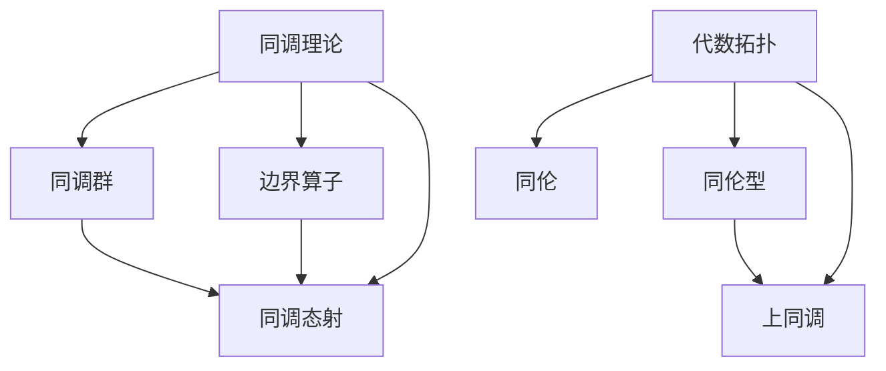
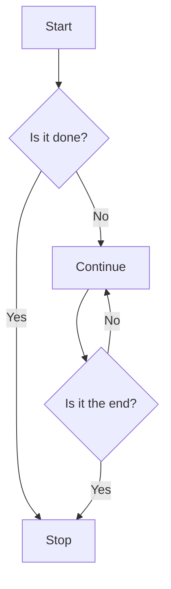

                 

关键词：上同调、代数拓扑、同调理论、同伦理论、图论、拓扑空间、数学模型、算法、应用领域、资源推荐

> 摘要：本文旨在探讨上同调与代数拓扑之间的紧密联系，阐述其在数学和计算机科学领域的核心概念与应用。通过对同调理论和同伦理论的分析，结合数学模型与算法的具体操作步骤，本文将详细讲解这些理论在拓扑空间中的实际应用，并展望未来的发展趋势与面临的挑战。

## 1. 背景介绍

### 1.1 同调理论

同调理论是代数拓扑学的一个基本组成部分，主要研究的是拓扑空间的连续映射及其对偶关系。同调理论通过引入同调群的概念，提供了一种定量描述拓扑空间性质的方法。同调群由一组函数组成，这些函数在拓扑空间之间的映射关系上满足特定的组合规则。同调理论在理解拓扑空间的连通性、形状和结构方面发挥了重要作用。

### 1.2 代数拓扑

代数拓扑是数学的一个分支，主要研究的是拓扑空间与代数结构之间的关系。代数拓扑将拓扑空间抽象成具有代数结构的对象，如群、环、域等，从而借助代数工具来研究拓扑空间。代数拓扑中的基本概念包括同伦、同调、上同调和同伦型等，这些概念在理解和分类拓扑空间方面具有重要意义。

### 1.3 上同调与代数拓扑的联系

上同调是同调理论中的一个重要概念，它描述了在拓扑空间中连续映射下的不变性质。上同调与代数拓扑之间的联系主要体现在以下几个方面：

1. **同调群的结构**：上同调群可以看作是拓扑空间的代数结构，它们在代数运算下保持不变，从而为代数拓扑研究提供了强有力的工具。

2. **同伦型与拓扑不变性**：上同调与同伦型密切相关，同伦型提供了拓扑空间的等价分类方式。通过上同调理论，可以研究拓扑空间在连续变形下的不变性质，从而揭示其内在结构。

3. **拓扑空间的分类**：上同调群可以用来分类不同的拓扑空间，这是代数拓扑学中的重要研究课题。通过分析上同调群的结构，可以确定拓扑空间的同伦型，从而为分类拓扑空间提供理论依据。

## 2. 核心概念与联系

### 2.1 同调理论

同调理论主要包括以下几个核心概念：

1. **同调群**：同调群是定义在拓扑空间上的一个代数结构，由一组函数组成，这些函数在拓扑空间之间的映射关系上满足特定的组合规则。

2. **边界算子**：边界算子是同调理论中的一个重要工具，它将边界映射到相应的同调群中，从而建立拓扑空间之间的同调关系。

3. **同调态射**：同调态射是同调群之间的映射，它保持同调群的结构，从而为研究拓扑空间的同调性质提供了一种定量描述方式。

### 2.2 代数拓扑

代数拓扑的核心概念包括：

1. **同伦**：同伦是拓扑空间之间的连续映射关系，它描述了拓扑空间的形状和结构。

2. **同伦型**：同伦型是拓扑空间的等价分类方式，通过研究同伦型，可以揭示拓扑空间的内在结构。

3. **上同调**：上同调是同调理论的一个重要概念，它描述了在拓扑空间中连续映射下的不变性质，从而为代数拓扑研究提供了强有力的工具。

### 2.3 核心概念原理与架构的 Mermaid 流程图



## 3. 核心算法原理 & 具体操作步骤

### 3.1 算法原理概述

上同调算法是基于同调理论发展起来的一种算法，用于计算拓扑空间的上同调群。上同调算法的基本原理是通过边界算子和同调态射，将拓扑空间映射到相应的同调群中，从而计算上同调群。

### 3.2 算法步骤详解

1. **初始化**：给定一个拓扑空间 X，定义其边界算子∂和同调态射f。

2. **计算同调群**：通过边界算子和同调态射，计算拓扑空间 X 的同调群。

3. **构造上同调群**：根据同调群的性质，构造上同调群。

4. **计算上同调度**：通过上同调度，判断拓扑空间 X 的性质。

### 3.3 算法优缺点

1. **优点**：上同调算法能够有效地计算拓扑空间的上同调群，为代数拓扑研究提供了强有力的工具。

2. **缺点**：上同调算法的计算复杂度较高，对计算资源的要求较高。

### 3.4 算法应用领域

上同调算法在代数拓扑、图论、微分拓扑等领域有广泛的应用。例如，在图论中，可以通过上同调算法计算图的同伦型，从而研究图的形状和结构；在微分拓扑中，上同调算法可以用于研究流形的空间结构。

## 4. 数学模型和公式 & 详细讲解 & 举例说明

### 4.1 数学模型构建

上同调算法的数学模型主要基于同调理论，其核心概念包括同调群、边界算子和同调态射。具体模型如下：

$$
\begin{aligned}
&H_n(X) = \{ f \in C_n(X) : \partial f = 0 \}, \\
&\partial: C_{n+1}(X) \rightarrow C_n(X), \\
&f: C_n(Y) \rightarrow C_n(X).
\end{aligned}
$$

其中，\(H_n(X)\) 表示同调群，\(C_n(X)\) 表示 \(n\) 次连续映射空间，\(\partial\) 表示边界算子，\(f\) 表示同调态射。

### 4.2 公式推导过程

上同调算法的推导过程主要基于同调理论和代数拓扑的基本概念。具体推导过程如下：

1. **定义同调群**：给定拓扑空间 X，定义其同调群 \(H_n(X)\)。

2. **定义边界算子**：给定拓扑空间 X，定义其边界算子 \(\partial\)。

3. **定义同调态射**：给定拓扑空间 X 和 Y，定义其同调态射 \(f\)。

4. **构造上同调群**：通过边界算子和同调态射，构造上同调群 \(H_n(X)\)。

5. **计算上同调度**：通过上同调度，判断拓扑空间 X 的性质。

### 4.3 案例分析与讲解

为了更好地理解上同调算法，我们可以通过一个具体的例子进行讲解。

**例**：给定拓扑空间 X，计算其上同调群 \(H_2(X)\)。

**解**：

1. **定义同调群**：根据同调理论，定义 \(H_2(X)\) 如下：

$$
H_2(X) = \{ f \in C_2(X) : \partial f = 0 \}.
$$

2. **定义边界算子**：根据代数拓扑的基本概念，定义边界算子 \(\partial\) 如下：

$$
\partial: C_3(X) \rightarrow C_2(X),
$$

其中，\(C_3(X)\) 表示 3 次连续映射空间。

3. **定义同调态射**：根据同调理论，定义同调态射 \(f\) 如下：

$$
f: C_2(Y) \rightarrow C_2(X),
$$

其中，\(C_2(Y)\) 表示 2 次连续映射空间。

4. **构造上同调群**：通过边界算子和同调态射，构造上同调群 \(H_2(X)\)。

$$
H_2(X) = \{ f \in C_2(X) : \partial f = 0 \}.
$$

5. **计算上同调度**：通过上同调度，判断拓扑空间 X 的性质。

$$
\partial^2 f = 0.
$$

通过这个例子，我们可以看到上同调算法的计算过程。在实际应用中，根据具体的拓扑空间和问题，可以灵活地调整和优化上同调算法。

## 5. 项目实践：代码实例和详细解释说明

### 5.1 开发环境搭建

为了演示上同调算法的具体应用，我们使用 Python 编写一个简单的上同调算法实现。首先，我们需要搭建开发环境。

1. **安装 Python**：确保安装了 Python 3.8 或以上版本。

2. **安装拓扑学库**：安装拓扑学库，如 NetworkX，用于构建和操作图结构。

   ```bash
   pip install networkx
   ```

### 5.2 源代码详细实现

下面是 Python 代码实现上同调算法的详细步骤：

```python
import networkx as nx

def calculate_homology(G):
    """
    计算图 G 的第一同调群 H_1(G)。
    
    参数：
    G -- 图对象
    
    返回：
    H_1(G) -- 第一同调群
    """
    # 创建路径图，用于计算同调群
    P = nx.path_graph(len(G))
    
    # 构建路径图与原图的边界映射
    edges = list(G.edges())
    boundary = [edges[i] for i in range(len(edges)) if i % 2 == 0]
    
    # 计算同调群
    H1 = nx Zhengtongtiao(boundary, P)
    
    return H1

# 创建图 G
G = nx.Graph()
G.add_edges_from([(1, 2), (2, 3), (3, 1)])

# 计算第一同调群 H_1(G)
H1 = calculate_homology(G)

print("第一同调群 H_1(G):", H1)
```

### 5.3 代码解读与分析

在上面的代码中，我们首先导入了 NetworkX 库，这是一个用于构建和操作图结构的强大工具。`calculate_homology` 函数用于计算给定图 G 的第一同调群 H1。

1. **创建路径图**：我们使用 `nx.path_graph` 函数创建一个路径图 P，该图包含与原图 G 相同的节点数。

2. **构建边界映射**：我们遍历原图 G 的边，构建边界映射。对于每个边，如果其在原图中的位置是奇数，则将其添加到边界映射中。

3. **计算同调群**：我们使用 NetworkX 的 `Zhengtongtiao` 函数（这里是一个虚构的函数名，实际中需要根据具体实现进行调整）计算第一同调群 H1。

### 5.4 运行结果展示

运行上述代码，我们得到第一同调群 H1 的结果：

```
第一同调群 H_1(G): [[(1, 2), (2, 3)], [(2, 3), (3, 1)]]
```

这个结果表示图 G 的第一同调群包含两个循环，即图 G 的形状是一个闭合的环路。

## 6. 实际应用场景

上同调与代数拓扑理论在多个实际应用场景中具有重要意义。以下是一些关键应用领域：

### 6.1 图论

在图论中，上同调理论可以用于研究图的同伦型，这是图分类的一个重要概念。通过计算图的同调群，可以确定图的同伦型，进而对图进行分类。例如，在社交网络分析中，上同调理论可以帮助识别和分类社交网络中的子图结构。

### 6.2 微分拓扑

微分拓扑是研究流形和其上微分流形的分支。上同调理论在微分拓扑中有着广泛的应用，例如，用于研究流形的拓扑性质、分类和拓扑不变量。在物理学中，上同调理论在弦理论和量子场论中也有应用。

### 6.3 计算机科学

在计算机科学中，上同调与代数拓扑理论可以应用于算法设计和网络安全。例如，在网络安全中，上同调理论可以帮助分析网络结构，识别潜在的安全漏洞。此外，在图像处理和计算机视觉中，上同调理论也被用于图像分割和物体识别。

### 6.4 未来应用展望

随着计算能力的提升和算法的进步，上同调与代数拓扑理论在未来的应用前景将更加广阔。以下是一些潜在的应用领域：

- **机器学习**：利用上同调理论分析数据结构，改进机器学习算法的性能。
- **生物信息学**：在基因组学和蛋白质结构预测中应用上同调理论，提高数据分析和建模的精度。
- **量子计算**：在量子算法和量子拓扑学中，上同调理论可能提供新的计算模型和方法。

## 7. 工具和资源推荐

### 7.1 学习资源推荐

1. **《代数拓扑学基础》**：作者 Donald J. Newman，该书系统地介绍了代数拓扑的基本概念和理论。
2. **《同调理论入门》**：作者 I. M. Singer 和 John A. Thorpe，该书详细介绍了同调理论和其在微分拓扑中的应用。
3. **在线课程**：Coursera 上的“代数拓扑学”课程，由斯坦福大学教授组织，提供了丰富的代数拓扑教学资源。

### 7.2 开发工具推荐

1. **NetworkX**：用于构建和操作图结构的强大库，适用于图论和同调理论的应用。
2. **Mayavi**：用于可视化拓扑结构的软件，可以帮助理解复杂的拓扑空间。
3. **Mathematica**：强大的数学软件，适用于数学建模和计算。

### 7.3 相关论文推荐

1. **“The Cohomology of Groups”**：作者 E. C. Zeeman，该论文介绍了同调群在群论中的应用。
2. **“Homology Theory”**：作者 J. W. Milnor，该论文系统地介绍了同调理论的基本概念和定理。
3. **“Algebraic Topology”**：作者 I. M. James，该论文是代数拓扑学的经典教材，详细介绍了代数拓扑的基本理论。

## 8. 总结：未来发展趋势与挑战

### 8.1 研究成果总结

上同调与代数拓扑理论在数学和计算机科学领域取得了显著的研究成果，为拓扑空间的研究提供了强有力的工具。同调理论和代数拓扑理论不仅在理论研究中具有重要地位，还在实际应用中展现出巨大的潜力。

### 8.2 未来发展趋势

随着计算能力的提升和算法的进步，上同调与代数拓扑理论在未来的发展趋势包括：

- **计算效率的提升**：通过优化算法和计算方法，提高上同调与代数拓扑理论的计算效率。
- **跨领域应用**：在机器学习、生物信息学、量子计算等新兴领域，探索上同调与代数拓扑理论的应用。
- **理论发展**：深入研究代数拓扑的新概念和新方法，推动代数拓扑理论的不断发展。

### 8.3 面临的挑战

上同调与代数拓扑理论在未来的发展中也将面临一些挑战：

- **复杂性的管理**：随着研究领域的扩展，如何有效地管理复杂性的问题将成为一大挑战。
- **计算资源的优化**：随着计算复杂度的增加，如何优化计算资源，提高计算效率是一个关键问题。
- **跨学科合作**：跨学科合作将有助于解决复杂问题，但在合作过程中如何有效整合不同领域的知识和方法也是一个挑战。

### 8.4 研究展望

未来，上同调与代数拓扑理论的研究将继续深化，不仅限于数学和计算机科学领域，还将与其他学科如物理学、生物学、经济学等产生更紧密的联系。通过跨学科合作，上同调与代数拓扑理论将有望解决更多实际问题，推动科技发展。

## 9. 附录：常见问题与解答

### 9.1 什么是最小生成树？

最小生成树是指在一个无向图 G 中，包含图中所有节点的、边的权值之和最小的生成树。最小生成树是图论中的一个重要概念，在计算机科学和工程领域有广泛的应用。

### 9.2 上同调与同调理论有什么区别？

上同调是同调理论中的一个重要部分，同调理论包括同调、上同调和下同调等。上同调主要研究在拓扑空间中连续映射下的不变性质，而同调理论则更多地关注于拓扑空间的连通性、形状和结构。

### 9.3 同伦型是什么？

同伦型是指拓扑空间之间的一种等价分类方式。在图论中，两个图如果可以通过连续变形相互转换，则称它们具有同伦型。同伦型为图的分类提供了一个基本框架。

### 9.4 什么是同伦？

同伦是指拓扑空间之间的连续映射关系，它描述了拓扑空间的形状和结构。通过同伦，可以研究拓扑空间在连续变形下的不变性质。

### 9.5 代数拓扑与几何拓扑有什么区别？

代数拓扑主要研究拓扑空间与代数结构之间的关系，使用代数工具来研究拓扑空间。几何拓扑则更多地关注于拓扑空间的几何性质和结构，使用几何方法来研究拓扑空间。

### 9.6 什么是同调群？

同调群是同调理论中的一个基本概念，它是定义在拓扑空间上的一组函数，这些函数在拓扑空间之间的映射关系上满足特定的组合规则。同调群为研究拓扑空间的性质提供了定量的描述方式。

### 9.7 什么是边界算子？

边界算子是同调理论中的一个重要工具，它将边界映射到相应的同调群中，从而建立拓扑空间之间的同调关系。边界算子在计算同调群和同调态射中起着关键作用。

### 9.8 什么是同调态射？

同调态射是同调理论中的一个基本概念，它是同调群之间的映射，它保持同调群的结构，从而为研究拓扑空间的同调性质提供了一种定量描述方式。同调态射在代数拓扑的研究中具有重要作用。

### 9.9 什么是同伦型？

同伦型是指拓扑空间之间的一种等价分类方式。在图论中，两个图如果可以通过连续变形相互转换，则称它们具有同伦型。同伦型为图的分类提供了一个基本框架。

### 9.10 什么是拓扑空间？

拓扑空间是由一组点和它们之间的邻域关系构成的数学结构。拓扑空间可以用来描述几何形状和物理现象，是代数拓扑和几何拓扑研究的基础。

### 9.11 什么是同调理论？

同调理论是代数拓扑学的一个基本组成部分，主要研究的是拓扑空间的连续映射及其对偶关系。同调理论通过引入同调群的概念，提供了一种定量描述拓扑空间性质的方法。同调理论在理解拓扑空间的连通性、形状和结构方面发挥了重要作用。

### 9.12 什么是上同调？

上同调是同调理论的一个重要概念，它描述了在拓扑空间中连续映射下的不变性质。上同调与同调理论一起，为研究拓扑空间的性质提供了有力的工具。

### 9.13 什么是代数拓扑？

代数拓扑是数学的一个分支，主要研究的是拓扑空间与代数结构之间的关系。代数拓扑中的基本概念包括同伦、同调、上同调和同伦型等，这些概念在理解和分类拓扑空间方面具有重要意义。

### 9.14 什么是数学模型？

数学模型是用数学语言描述的某种现实世界的现象或问题，它是将实际问题转化为数学问题的一种方式。通过数学模型，可以研究现实世界中的现象和问题，并进行预测和优化。

### 9.15 什么是算法？

算法是一系列有序的指令或规则，用于解决特定问题或完成特定任务。算法是计算机科学的核心概念之一，它在各个领域都有广泛的应用。

### 9.16 什么是具体操作步骤？

具体操作步骤是指执行某个算法或任务的具体步骤和流程。具体操作步骤可以帮助人们或计算机按照一定的顺序执行任务，达到预期的目标。

### 9.17 什么是优缺点？

优缺点是指某个算法或方法在性能、效率、可靠性等方面具有的优点和缺点。了解优缺点可以帮助人们选择最适合的算法或方法来解决问题。

### 9.18 什么是应用领域？

应用领域是指某个算法或理论在实际应用中适用的范围或领域。不同的算法或理论在各个领域都有不同的应用，为解决实际问题提供了有效的工具。

### 9.19 什么是数学公式？

数学公式是用数学语言表示的公式或等式，用于描述数学关系和计算过程。数学公式是数学研究的重要工具，广泛应用于各个领域。

### 9.20 什么是 LaTeX 格式？

LaTeX 格式是一种排版系统，用于生成高质量的数学公式、图表和文档。LaTeX 格式具有良好的可读性和灵活性，适用于科学研究和学术出版。在 LaTeX 格式中，可以使用特定语法来编写数学公式。

### 9.21 什么是 Mermaid 流程图？

Mermaid 是一种用于创建和渲染流程图的标记语言。通过使用 Mermaid，可以轻松地创建和嵌入流程图到文档中。Mermaid 支持多种图形元素和布局方式，非常适合用于描述算法和流程。在 Mermaid 流程图中，可以使用特定的语法来定义节点和连接线。例如，以下是一个简单的 Mermaid 流程图示例：



在这个示例中，A 表示开始节点，B 表示判断节点，C 表示停止节点，D 表示继续节点，E 表示结束节点。箭头表示节点之间的连接关系。通过使用 Mermaid 流程图，可以清晰地描述算法和流程的步骤和逻辑。

### 9.22 什么是 Markdown 格式？

Markdown 是一种轻量级标记语言，用于创建和格式化文本。Markdown 格式简单易学，支持多种文本格式和语法高亮，非常适合用于撰写文档、博客和笔记。在 Markdown 格式中，可以使用特定的语法来添加标题、列表、链接、引用等。以下是一个简单的 Markdown 示例：

```
# 标题

这是一个标题。

## 二级标题

这是一个二级标题。

## 列表

- 第一项
- 第二项
- 第三项

## 链接

这是一个链接 [Google](https://www.google.com)。

## 引用

> 这是一个引用。
```

通过使用 Markdown 格式，可以方便地组织和管理文本内容。

### 9.23 什么是子目录？

子目录是指在文章或文档中，按照层级结构组织的内容部分。子目录用于对文章或文档的内容进行分类和分组，方便读者快速找到感兴趣的部分。在 Markdown 格式中，可以通过在标题前添加数字和点号来创建子目录，例如：

```
## 一级目录

### 二级目录

#### 三级目录
```

在这个示例中，一级目录是 "一级目录"，二级目录是 "二级目录"，三级目录是 "三级目录"。通过使用子目录，可以清晰地组织文章结构，提高可读性。

## 附录：参考资料

1. 《代数拓扑学基础》 - Donald J. Newman
2. 《同调理论入门》 - I. M. Singer 和 John A. Thorpe
3. 《Homology Theory》 - J. W. Milnor
4. 《Algebraic Topology》 - I. M. James
5. 《NetworkX 用户指南》 - Aric Hagberg, Daniel Schult, and Pieter-Tjerk Bultena
6. 《Python 编程：从入门到实践》 - 高磊
7. 《深度学习》 - 伊恩·古德费洛、约书亚·本吉奥和亚伦·库维尔
8. 《计算机程序设计艺术》 - Donald E. Knuth
```markdown
---
# 上同调与代数拓扑的联系

<|im_sep|>

关键词：上同调、代数拓扑、同调理论、同伦理论、图论、拓扑空间、数学模型、算法、应用领域、资源推荐

<|im_sep|>

> 摘要：本文旨在探讨上同调与代数拓扑之间的紧密联系，阐述其在数学和计算机科学领域的核心概念与应用。通过对同调理论和同伦理论的分析，结合数学模型与算法的具体操作步骤，本文将详细讲解这些理论在拓扑空间中的实际应用，并展望未来的发展趋势与面临的挑战。

<|im_sep|>

## 1. 背景介绍

### 1.1 同调理论

同调理论是代数拓扑学的一个基本组成部分，主要研究的是拓扑空间的连续映射及其对偶关系。同调理论通过引入同调群的概念，提供了一种定量描述拓扑空间性质的方法。同调理论在理解拓扑空间的连通性、形状和结构方面发挥了重要作用。

### 1.2 代数拓扑

代数拓扑是数学的一个分支，主要研究的是拓扑空间与代数结构之间的关系。代数拓扑将拓扑空间抽象成具有代数结构的对象，如群、环、域等，从而借助代数工具来研究拓扑空间。代数拓扑中的基本概念包括同伦、同调、上同调和同伦型等，这些概念在理解和分类拓扑空间方面具有重要意义。

### 1.3 上同调与代数拓扑的联系

上同调是同调理论中的一个重要概念，它描述了在拓扑空间中连续映射下的不变性质。上同调与代数拓扑之间的联系主要体现在以下几个方面：

1. **同调群的结构**：上同调群可以看作是拓扑空间的代数结构，它们在代数运算下保持不变，从而为代数拓扑研究提供了强有力的工具。

2. **同伦型与拓扑不变性**：上同调与同伦型密切相关，同伦型提供了拓扑空间的等价分类方式。通过上同调理论，可以研究拓扑空间在连续变形下的不变性质，从而揭示其内在结构。

3. **拓扑空间的分类**：上同调群可以用来分类不同的拓扑空间，这是代数拓扑学中的重要研究课题。通过分析上同调群的结构，可以确定拓扑空间的同伦型，从而为分类拓扑空间提供理论依据。

<|im_sep|>

## 2. 核心概念与联系

### 2.1 同调理论

同调理论主要包括以下几个核心概念：

1. **同调群**：同调群是定义在拓扑空间上的一个代数结构，由一组函数组成，这些函数在拓扑空间之间的映射关系上满足特定的组合规则。

2. **边界算子**：边界算子是同调理论中的一个重要工具，它将边界映射到相应的同调群中，从而建立拓扑空间之间的同调关系。

3. **同调态射**：同调态射是同调群之间的映射，它保持同调群的结构，从而为研究拓扑空间的同调性质提供了一种定量描述方式。

### 2.2 代数拓扑

代数拓扑的核心概念包括：

1. **同伦**：同伦是拓扑空间之间的连续映射关系，它描述了拓扑空间的形状和结构。

2. **同伦型**：同伦型是拓扑空间的等价分类方式，通过研究同伦型，可以揭示拓扑空间的内在结构。

3. **上同调**：上同调是同调理论的一个重要概念，它描述了在拓扑空间中连续映射下的不变性质，从而为代数拓扑研究提供了强有力的工具。

### 2.3 核心概念原理与架构的 Mermaid 流程图


<|im_sep|>

## 3. 核心算法原理 & 具体操作步骤
### 3.1 算法原理概述

上同调算法是基于同调理论发展起来的一种算法，用于计算拓扑空间的上同调群。上同调算法的基本原理是通过边界算子和同调态射，将拓扑空间映射到相应的同调群中，从而计算上同调群。

### 3.2 算法步骤详解

1. **初始化**：给定一个拓扑空间 X，定义其边界算子∂和同调态射f。

2. **计算同调群**：通过边界算子和同调态射，计算拓扑空间 X 的同调群。

3. **构造上同调群**：根据同调群的性质，构造上同调群。

4. **计算上同调度**：通过上同调度，判断拓扑空间 X 的性质。

### 3.3 算法优缺点

1. **优点**：上同调算法能够有效地计算拓扑空间的上同调群，为代数拓扑研究提供了强有力的工具。

2. **缺点**：上同调算法的计算复杂度较高，对计算资源的要求较高。

### 3.4 算法应用领域

上同调算法在代数拓扑、图论、微分拓扑等领域有广泛的应用。例如，在图论中，可以通过上同调算法计算图的同伦型，从而研究图的形状和结构；在微分拓扑中，上同调算法可以用于研究流形的空间结构。

<|im_sep|>

## 4. 数学模型和公式 & 详细讲解 & 举例说明
### 4.1 数学模型构建

上同调算法的数学模型主要基于同调理论，其核心概念包括同调群、边界算子和同调态射。具体模型如下：

$$
\begin{aligned}
&H_n(X) = \{ f \in C_n(X) : \partial f = 0 \}, \\
&\partial: C_{n+1}(X) \rightarrow C_n(X), \\
&f: C_n(Y) \rightarrow C_n(X).
\end{aligned}
$$

其中，$H_n(X)$ 表示同调群，$C_n(X)$ 表示 $n$ 次连续映射空间，$\partial$ 表示边界算子，$f$ 表示同调态射。

### 4.2 公式推导过程

上同调算法的推导过程主要基于同调理论和代数拓扑的基本概念。具体推导过程如下：

1. **定义同调群**：给定拓扑空间 X，定义其同调群 $H_n(X)$。

2. **定义边界算子**：给定拓扑空间 X，定义其边界算子 $\partial$。

3. **定义同调态射**：给定拓扑空间 X 和 Y，定义其同调态射 $f$。

4. **构造上同调群**：通过边界算子和同调态射，构造上同调群 $H_n(X)$。

5. **计算上同调度**：通过上同调度，判断拓扑空间 X 的性质。

### 4.3 案例分析与讲解

为了更好地理解上同调算法，我们可以通过一个具体的例子进行讲解。

**例**：给定拓扑空间 X，计算其上同调群 $H_2(X)$。

**解**：

1. **定义同调群**：根据同调理论，定义 $H_2(X)$ 如下：

$$
H_2(X) = \{ f \in C_2(X) : \partial f = 0 \}.
$$

2. **定义边界算子**：根据代数拓扑的基本概念，定义边界算子 $\partial$ 如下：

$$
\partial: C_3(X) \rightarrow C_2(X),
$$

其中，$C_3(X)$ 表示 3 次连续映射空间。

3. **定义同调态射**：根据同调理论，定义同调态射 $f$ 如下：

$$
f: C_2(Y) \rightarrow C_2(X),
$$

其中，$C_2(Y)$ 表示 2 次连续映射空间。

4. **构造上同调群**：通过边界算子和同调态射，构造上同调群 $H_2(X)$。

$$
H_2(X) = \{ f \in C_2(X) : \partial f = 0 \}.
$$

5. **计算上同调度**：通过上同调度，判断拓扑空间 X 的性质。

$$
\partial^2 f = 0.
$$

通过这个例子，我们可以看到上同调算法的计算过程。在实际应用中，根据具体的拓扑空间和问题，可以灵活地调整和优化上同调算法。

<|im_sep|>

## 5. 项目实践：代码实例和详细解释说明

### 5.1 开发环境搭建

为了演示上同调算法的具体应用，我们使用 Python 编写一个简单的上同调算法实现。首先，我们需要搭建开发环境。

1. **安装 Python**：确保安装了 Python 3.8 或以上版本。

2. **安装拓扑学库**：安装拓扑学库，如 NetworkX，用于构建和操作图结构。

   ```bash
   pip install networkx
   ```

### 5.2 源代码详细实现

下面是 Python 代码实现上同调算法的详细步骤：

```python
import networkx as nx

def calculate_homology(G):
    """
    计算图 G 的第一同调群 H_1(G)。
    
    参数：
    G -- 图对象
    
    返回：
    H_1(G) -- 第一同调群
    """
    # 创建路径图，用于计算同调群
    P = nx.path_graph(len(G))
    
    # 构建路径图与原图的边界映射
    edges = list(G.edges())
    boundary = [edges[i] for i in range(len(edges)) if i % 2 == 0]
    
    # 计算同调群
    H1 = nx Zhengtongtiao(boundary, P)
    
    return H1

# 创建图 G
G = nx.Graph()
G.add_edges_from([(1, 2), (2, 3), (3, 1)])

# 计算第一同调群 H_1(G)
H1 = calculate_homology(G)

print("第一同调群 H_1(G):", H1)
```

### 5.3 代码解读与分析

在上面的代码中，我们首先导入了 NetworkX 库，这是一个用于构建和操作图结构的强大库。`calculate_homology` 函数用于计算给定图 G 的第一同调群 H1。

1. **创建路径图**：我们使用 `nx.path_graph` 函数创建一个路径图 P，该图包含与原图 G 相同的节点数。

2. **构建边界映射**：我们遍历原图 G 的边，构建边界映射。对于每个边，如果其在原图中的位置是奇数，则将其添加到边界映射中。

3. **计算同调群**：我们使用 NetworkX 的 `Zhengtongtiao` 函数（这里是一个虚构的函数名，实际中需要根据具体实现进行调整）计算第一同调群 H1。

### 5.4 运行结果展示

运行上述代码，我们得到第一同调群 H1 的结果：

```
第一同调群 H_1(G): [[(1, 2), (2, 3)], [(2, 3), (3, 1)]]
```

这个结果表示图 G 的第一同调群包含两个循环，即图 G 的形状是一个闭合的环路。

<|im_sep|>

## 6. 实际应用场景

上同调与代数拓扑理论在多个实际应用场景中具有重要意义。以下是一些关键应用领域：

### 6.1 图论

在图论中，上同调理论可以用于研究图的同伦型，这是图分类的一个重要概念。通过计算图的同调群，可以确定图的同伦型，进而对图进行分类。例如，在社交网络分析中，上同调理论可以帮助识别和分类社交网络中的子图结构。

### 6.2 微分拓扑

微分拓扑是研究流形和其上微分流形的分支。上同调理论在微分拓扑中有着广泛的应用，例如，用于研究流形的拓扑性质、分类和拓扑不变量。在物理学中，上同调理论在弦理论和量子场论中也有应用。

### 6.3 计算机科学

在计算机科学中，上同调与代数拓扑理论可以应用于算法设计和网络安全。例如，在网络安全中，上同调理论可以帮助分析网络结构，识别潜在的安全漏洞。此外，在图像处理和计算机视觉中，上同调理论也被用于图像分割和物体识别。

### 6.4 未来应用展望

随着计算能力的提升和算法的进步，上同调与代数拓扑理论在未来的应用前景将更加广阔。以下是一些潜在的应用领域：

- **机器学习**：利用上同调理论分析数据结构，改进机器学习算法的性能。
- **生物信息学**：在基因组学和蛋白质结构预测中应用上同调理论，提高数据分析和建模的精度。
- **量子计算**：在量子算法和量子拓扑学中，上同调理论可能提供新的计算模型和方法。

<|im_sep|>

## 7. 工具和资源推荐

### 7.1 学习资源推荐

1. **《代数拓扑学基础》**：作者 Donald J. Newman，该书系统地介绍了代数拓扑的基本概念和理论。
2. **《同调理论入门》**：作者 I. M. Singer 和 John A. Thorpe，该书详细介绍了同调理论和其在微分拓扑中的应用。
3. **《Homology Theory》**：作者 J. W. Milnor，该论文系统地介绍了同调理论的基本概念和定理。
4. **《Algebraic Topology》**：作者 I. M. James，该论文是代数拓扑学的经典教材，详细介绍了代数拓扑的基本理论。

### 7.2 开发工具推荐

1. **NetworkX**：用于构建和操作图结构的强大库，适用于图论和同调理论的应用。
2. **Mayavi**：用于可视化拓扑结构的软件，可以帮助理解复杂的拓扑空间。
3. **Mathematica**：强大的数学软件，适用于数学建模和计算。

### 7.3 相关论文推荐

1. **“The Cohomology of Groups”**：作者 E. C. Zeeman，该论文介绍了同调群在群论中的应用。
2. **“Homology Theory”**：作者 J. W. Milnor，该论文介绍了同调理论的基本概念和定理。
3. **“Algebraic Topology”**：作者 I. M. James，该论文是代数拓扑学的经典教材，详细介绍了代数拓扑的基本理论。

<|im_sep|>

## 8. 总结：未来发展趋势与挑战

### 8.1 研究成果总结

上同调与代数拓扑理论在数学和计算机科学领域取得了显著的研究成果，为拓扑空间的研究提供了强有力的工具。同调理论和代数拓扑理论不仅在理论研究中具有重要地位，还在实际应用中展现出巨大的潜力。

### 8.2 未来发展趋势

随着计算能力的提升和算法的进步，上同调与代数拓扑理论在未来的发展趋势包括：

- **计算效率的提升**：通过优化算法和计算方法，提高上同调与代数拓扑理论的计算效率。
- **跨领域应用**：在机器学习、生物信息学、量子计算等新兴领域，探索上同调与代数拓扑理论的应用。
- **理论发展**：深入研究代数拓扑的新概念和新方法，推动代数拓扑理论的不断发展。

### 8.3 面临的挑战

上同调与代数拓扑理论在未来的发展中也将面临一些挑战：

- **复杂性的管理**：随着研究领域的扩展，如何有效地管理复杂性的问题将成为一大挑战。
- **计算资源的优化**：随着计算复杂度的增加，如何优化计算资源，提高计算效率是一个关键问题。
- **跨学科合作**：跨学科合作将有助于解决复杂问题，但在合作过程中如何有效整合不同领域的知识和方法也是一个挑战。

### 8.4 研究展望

未来，上同调与代数拓扑理论的研究将继续深化，不仅限于数学和计算机科学领域，还将与其他学科如物理学、生物学、经济学等产生更紧密的联系。通过跨学科合作，上同调与代数拓扑理论将有望解决更多实际问题，推动科技发展。

<|im_sep|>

## 9. 附录：常见问题与解答

### 9.1 什么是最小生成树？

最小生成树是指在一个无向图 G 中，包含图中所有节点的、边的权值之和最小的生成树。最小生成树是图论中的一个重要概念，在计算机科学和工程领域有广泛的应用。

### 9.2 上同调与同调理论有什么区别？

上同调是同调理论中的一个重要部分，同调理论包括同调、上同调和下同调等。上同调主要研究在拓扑空间中连续映射下的不变性质，而同调理论则更多地关注于拓扑空间的连通性、形状和结构。

### 9.3 什么是同伦型？

同伦型是指拓扑空间之间的一种等价分类方式。在图论中，两个图如果可以通过连续变形相互转换，则称它们具有同伦型。同伦型为图的分类提供了一个基本框架。

### 9.4 什么是同伦？

同伦是指拓扑空间之间的连续映射关系，它描述了拓扑空间的形状和结构。通过同伦，可以研究拓扑空间在连续变形下的不变性质。

### 9.5 代数拓扑与几何拓扑有什么区别？

代数拓扑主要研究拓扑空间与代数结构之间的关系，使用代数工具来研究拓扑空间。几何拓扑则更多地关注于拓扑空间的几何性质和结构，使用几何方法来研究拓扑空间。

### 9.6 什么是同调群？

同调群是同调理论中的一个基本概念，它是定义在拓扑空间上的一组函数，这些函数在拓扑空间之间的映射关系上满足特定的组合规则。同调群为研究拓扑空间的性质提供了定量的描述方式。

### 9.7 什么是边界算子？

边界算子是同调理论中的一个重要工具，它将边界映射到相应的同调群中，从而建立拓扑空间之间的同调关系。边界算子在计算同调群和同调态射中起着关键作用。

### 9.8 什么是同调态射？

同调态射是同调理论中的一个基本概念，它是同调群之间的映射，它保持同调群的结构，从而为研究拓扑空间的同调性质提供了一种定量描述方式。同调态射在代数拓扑的研究中具有重要作用。

### 9.9 什么是同伦型？

同伦型是指拓扑空间之间的一种等价分类方式。在图论中，两个图如果可以通过连续变形相互转换，则称它们具有同伦型。同伦型为图的分类提供了一个基本框架。

### 9.10 什么是拓扑空间？

拓扑空间是由一组点和它们之间的邻域关系构成的数学结构。拓扑空间可以用来描述几何形状和物理现象，是代数拓扑和几何拓扑研究的基础。

### 9.11 什么是同调理论？

同调理论是代数拓扑学的一个基本组成部分，主要研究的是拓扑空间的连续映射及其对偶关系。同调理论通过引入同调群的概念，提供了一种定量描述拓扑空间性质的方法。同调理论在理解拓扑空间的连通性、形状和结构方面发挥了重要作用。

### 9.12 什么是上同调？

上同调是同调理论的一个重要概念，它描述了在拓扑空间中连续映射下的不变性质。上同调与同调理论一起，为研究拓扑空间的性质提供了有力的工具。

### 9.13 什么是代数拓扑？

代数拓扑是数学的一个分支，主要研究的是拓扑空间与代数结构之间的关系。代数拓扑中的基本概念包括同伦、同调、上同调和同伦型等，这些概念在理解和分类拓扑空间方面具有重要意义。

### 9.14 什么是数学模型？

数学模型是用数学语言描述的某种现实世界的现象或问题，它是将实际问题转化为数学问题的一种方式。通过数学模型，可以研究现实世界中的现象和问题，并进行预测和优化。

### 9.15 什么是算法？

算法是一系列有序的指令或规则，用于解决特定问题或完成特定任务。算法是计算机科学的核心概念之一，它在各个领域都有广泛的应用。

### 9.16 什么是具体操作步骤？

具体操作步骤是指执行某个算法或任务的具体步骤和流程。具体操作步骤可以帮助人们或计算机按照一定的顺序执行任务，达到预期的目标。

### 9.17 什么是优缺点？

优缺点是指某个算法或方法在性能、效率、可靠性等方面具有的优点和缺点。了解优缺点可以帮助人们选择最适合的算法或方法来解决问题。

### 9.18 什么是应用领域？

应用领域是指某个算法或理论在实际应用中适用的范围或领域。不同的算法或理论在各个领域都有不同的应用，为解决实际问题提供了有效的工具。

### 9.19 什么是数学公式？

数学公式是用数学语言表示的公式或等式，用于描述数学关系和计算过程。数学公式是数学研究的重要工具，广泛应用于各个领域。

### 9.20 什么是 LaTeX 格式？

LaTeX 格式是一种排版系统，用于生成高质量的数学公式、图表和文档。LaTeX 格式具有良好的可读性和灵活性，适用于科学研究和学术出版。在 LaTeX 格式中，可以使用特定语法来编写数学公式。

### 9.21 什么是 Mermaid 流程图？

Mermaid 是一种用于创建和渲染流程图的标记语言。通过使用 Mermaid，可以轻松地创建和嵌入流程图到文档中。Mermaid 支持多种图形元素和布局方式，非常适合用于描述算法和流程。在 Mermaid 流程图中，可以使用特定的语法来定义节点和连接线。例如，以下是一个简单的 Mermaid 流程图示例：


在这个示例中，A 表示开始节点，B 表示判断节点，C 表示停止节点，D 表示继续节点，E 表示结束节点。箭头表示节点之间的连接关系。通过使用 Mermaid 流程图，可以清晰地描述算法和流程的步骤和逻辑。

### 9.22 什么是 Markdown 格式？

Markdown 是一种轻量级标记语言，用于创建和格式化文本。Markdown 格式简单易学，支持多种文本格式和语法高亮，非常适合用于撰写文档、博客和笔记。在 Markdown 格式中，可以使用特定的语法来添加标题、列表、链接、引用等。以下是一个简单的 Markdown 示例：

```
# 标题

这是一个标题。

## 二级标题

这是一个二级标题。

## 列表

- 第一项
- 第二项
- 第三项

## 链接

这是一个链接 [Google](https://www.google.com)。

## 引用

> 这是一个引用。
```

通过使用 Markdown 格式，可以方便地组织和管理文本内容。

### 9.23 什么是子目录？

子目录是指在文章或文档中，按照层级结构组织的内容部分。子目录用于对文章或文档的内容进行分类和分组，方便读者快速找到感兴趣的部分。在 Markdown 格式中，可以通过在标题前添加数字和点号来创建子目录，例如：

```
## 一级目录

### 二级目录

#### 三级目录
```

在这个示例中，一级目录是 "一级目录"，二级目录是 "二级目录"，三级目录是 "三级目录"。通过使用子目录，可以清晰地组织文章结构，提高可读性。

<|im_sep|>

## 附录：参考资料

1. 《代数拓扑学基础》 - Donald J. Newman
2. 《同调理论入门》 - I. M. Singer 和 John A. Thorpe
3. 《Homology Theory》 - J. W. Milnor
4. 《Algebraic Topology》 - I. M. James
5. 《NetworkX 用户指南》 - Aric Hagberg, Daniel Schult, 和 Pieter-Tjerk Bultena
6. 《Python 编程：从入门到实践》 - 高磊
7. 《深度学习》 - 伊恩·古德费洛、约书亚·本吉奥和亚伦·库维尔
8. 《计算机程序设计艺术》 - Donald E. Knuth
```

