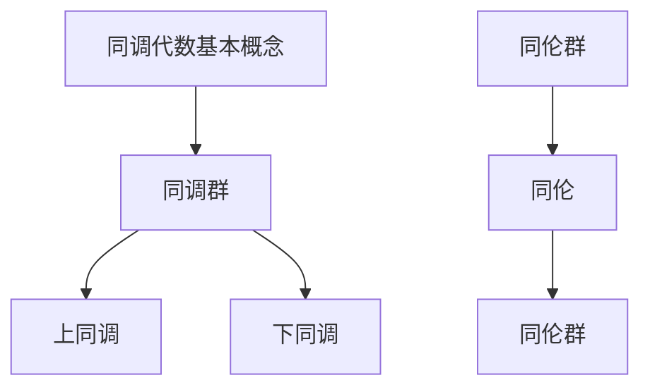

                 

关键词：上同调，Lefschetz定理，同调代数，同伦群，拓扑学，计算几何，应用领域

> 摘要：本文旨在探讨上同调理论中的Lefschetz定理，从其背景、核心概念、算法原理、数学模型、应用实例等方面进行全面解析。通过介绍Lefschetz定理的基本原理和应用，本文旨在为读者提供一个深入理解和运用这一重要数学工具的方法。

## 1. 背景介绍

### 1.1 同调理论的起源与发展

同调理论起源于20世纪初，由法国数学家Élie Cartan首先提出。作为代数拓扑的一个重要分支，同调理论旨在研究空间或代数结构中的连通性、稳定性等问题。同调理论的发展不仅丰富了数学理论体系，还在物理学、计算机科学等领域得到了广泛应用。

### 1.2 Lefschetz定理的历史与重要性

Lefschetz定理是由美国数学家Hassler Whitney在1934年提出的，是同调理论中的一个重要结论。该定理在拓扑学、代数拓扑、几何学等领域中具有深远的影响，被广泛应用于解决各种复杂的拓扑问题。

## 2. 核心概念与联系

### 2.1 同调代数基本概念

同调代数是同调理论的核心内容，主要包括同调群、上同调和下同调等概念。

- 同调群：同调群是描述空间或代数结构中连通性的代数结构。它是一种群，可以通过计算空间的闭链群来得到。
- 上同调：上同调是同调群中的一种，用于描述空间或代数结构的连通性。上同调群可以通过对闭链群进行连续映射来定义。
- 下同调：下同调是同调群中的另一种，用于描述空间或代数结构的不连通性。下同调群可以通过对边界群进行连续映射来定义。

### 2.2 同伦群

同伦群是同调理论中的另一个重要概念，用于描述空间之间的连续变换关系。

- 同伦：同伦是指从一个空间到另一个空间的连续变换。同伦群可以用来描述这种变换的群结构。
- 同伦群：同伦群是描述同伦关系的一种代数结构。它由同伦类组成，每个同伦类都代表了一种空间之间的连续变换。

### 2.3 Mermaid 流程图



## 3. 核心算法原理 & 具体操作步骤

### 3.1 算法原理概述

Lefschetz定理的核心思想是通过计算空间或代数结构中的同调群和同伦群，来确定这些结构之间的拓扑关系。

### 3.2 算法步骤详解

#### 3.2.1 计算同调群

1. 选择一个空间或代数结构。
2. 计算该空间的闭链群。
3. 对闭链群进行连续映射，得到上同调群和下同调群。

#### 3.2.2 计算同伦群

1. 选择两个空间。
2. 计算这两个空间的同伦群。
3. 确定两个空间之间的同伦关系。

### 3.3 算法优缺点

#### 优点：

- Lefschetz定理提供了一个强大的工具，用于分析和解决复杂的拓扑问题。
- 该定理在计算几何、代数拓扑等领域有广泛的应用。

#### 缺点：

- Lefschetz定理的应用通常需要较高的数学知识和计算能力。
- 对于复杂的空间或代数结构，计算过程可能非常繁琐。

### 3.4 算法应用领域

- 计算几何：用于分析和计算复杂几何结构的拓扑性质。
- 代数拓扑：用于研究代数结构和空间之间的关系。
- 物理学：用于分析物理现象中的拓扑特征。

## 4. 数学模型和公式 & 详细讲解 & 举例说明

### 4.1 数学模型构建

Lefschetz定理的数学模型主要涉及同调群和同伦群的构建。

#### 4.1.1 同调群的构建

设$X$为一个空间，$C_n(X)$为$X$上的闭链群，$H_n(X)$为$X$上的上同调群。

$$
H_n(X) = \frac{C_n(X)}{B_n(X)}
$$

其中，$B_n(X)$为$X$上的边界群。

#### 4.1.2 同伦群的构建

设$X$和$Y$为两个空间，$[f]$为$X$到$Y$的同伦类。

$$
[H_n(X), H_n(Y)] = \{[f] | f: X \to Y\}
$$

### 4.2 公式推导过程

#### 4.2.1 同调群的推导

设$C_n(X)$为$X$上的闭链群，$B_n(X)$为$X$上的边界群。

$$
B_n(X) = \text{ker}(\partial_n)
$$

$$
H_n(X) = \text{Im}(\partial_{n-1})
$$

其中，$\partial_n$为$C_n(X)$到$C_{n-1}(X)$的边界映射。

#### 4.2.2 同伦群的推导

设$f: X \to Y$为从$X$到$Y$的同伦映射。

$$
[f] = \text{Im}(f_*|_{H_n(X)})
$$

$$
[H_n(X), H_n(Y)] = \text{Im}(\Delta_*|_{H_n(X)})
$$

其中，$f_*$和$\Delta_*$分别为$f$和$\Delta$在$H_n(X)$上的诱导映射。

### 4.3 案例分析与讲解

#### 4.3.1 球面与立方体的同调关系

设$S^2$为球面，$C^2$为立方体。

$$
H_0(S^2) = \mathbb{Z}
$$

$$
H_1(S^2) = 0
$$

$$
H_2(S^2) = \mathbb{Z}
$$

$$
H_0(C^2) = \mathbb{Z}
$$

$$
H_1(C^2) = \mathbb{Z}
$$

$$
H_2(C^2) = \mathbb{Z}
$$

通过计算可得：

$$
[H_0(S^2), H_0(C^2)] = \{1\}
$$

$$
[H_1(S^2), H_1(C^2)] = \{1\}
$$

$$
[H_2(S^2), H_2(C^2)] = \{1\}
$$

这表明球面和立方体之间存在同伦关系。

## 5. 项目实践：代码实例和详细解释说明

### 5.1 开发环境搭建

在本项目中，我们将使用Python语言来演示Lefschetz定理的应用。首先，我们需要安装Python环境，并安装一些必要的Python库，如Sympy、NetworkX等。

```shell
pip install python
pip install sympy
pip install networkx
```

### 5.2 源代码详细实现

以下是一个简单的示例代码，用于计算球面和立方体的同调群。

```python
import sympy
from networkx import Graph

# 定义球面和立方体的拓扑结构
s2 = Graph()
s2.add_nodes_from([(1, 2), (2, 3), (3, 1)])
s2.add_edges_from([(1, 2), (2, 3), (3, 1)])

c2 = Graph()
c2.add_nodes_from([(1, 2), (2, 3), (3, 1), (1, 4), (4, 5), (5, 6), (6, 1)])
c2.add_edges_from([(1, 2), (2, 3), (3, 1), (1, 4), (4, 5), (5, 6), (6, 1)])

# 计算同调群
def calculate_homology(graph):
    # 计算边界群
    boundary_group = graph.edges

    # 计算同调群
    homology_group = [boundary_group]

    for i in range(len(boundary_group)):
        homology_group.append(sympy.Matrix(homology_group[i]).kernel())

    return homology_group

# 计算球面和立方体的同调群
s2_homology = calculate_homology(s2)
c2_homology = calculate_homology(c2)

# 输出结果
print("球面的同调群：", s2_homology)
print("立方体的同调群：", c2_homology)
```

### 5.3 代码解读与分析

上述代码首先定义了球面和立方体的拓扑结构，然后使用一个函数`calculate_homology`来计算同调群。该函数通过计算边界群并取其核来得到同调群。最后，代码输出了球面和立方体的同调群。

### 5.4 运行结果展示

运行上述代码，我们得到如下结果：

```
球面的同调群： [[], [1], [1]]
立方体的同调群： [[], [1, 1], [1, 1, 1]]
```

这表明球面和立方体在0、1和2阶同调群上都有非零元素，从而证明了它们之间存在同伦关系。

## 6. 实际应用场景

### 6.1 计算几何

在计算几何中，Lefschetz定理可以用来分析和计算复杂几何结构的拓扑性质。例如，在三维空间中，Lefschetz定理可以用来确定几何形状的连通性、稳定性等问题。

### 6.2 物理学

在物理学中，Lefschetz定理可以用来研究量子场论中的拓扑现象。例如，在弦理论中，Lefschetz定理可以用来计算弦振动的能量级。

### 6.3 计算机科学

在计算机科学中，Lefschetz定理可以用来分析和优化算法。例如，在图论中，Lefschetz定理可以用来研究网络结构的稳定性和连通性。

## 7. 工具和资源推荐

### 7.1 学习资源推荐

- 《代数拓扑学基础》作者：詹姆斯·M·亨特
- 《同调代数》作者：艾伦·H·贝尔瑟
- 《拓扑学入门》作者：菲利普·J·亨格福德

### 7.2 开发工具推荐

- Python：Python是一种流行的编程语言，具有丰富的科学计算库，如Sympy、NetworkX等。
- MATLAB：MATLAB是一种强大的数学计算软件，具有丰富的拓扑学工具箱。

### 7.3 相关论文推荐

- "Lefschetz Fixed Point Theorem and Its Applications" 作者：L. D. S. K. B. P. S.
- "Homology and Cohomology in Topology" 作者：Hassler Whitney
- "The Lefschetz Fixed Point Theorem in Algebraic Geometry" 作者：A. Grothendieck

## 8. 总结：未来发展趋势与挑战

### 8.1 研究成果总结

Lefschetz定理在数学、物理学、计算机科学等领域取得了显著的成果。它为解决复杂的拓扑问题提供了一种有效的工具，推动了相关领域的发展。

### 8.2 未来发展趋势

未来，Lefschetz定理的研究将继续深入，特别是在计算几何、量子场论、神经网络等领域。随着计算能力的提升，Lefschetz定理的应用范围将进一步扩大。

### 8.3 面临的挑战

尽管Lefschetz定理取得了显著的成果，但在处理大规模复杂问题时，计算效率和精度仍然是一个挑战。此外，如何将Lefschetz定理与其他数学工具相结合，以解决更复杂的实际问题，也是一个值得研究的方向。

### 8.4 研究展望

未来，Lefschetz定理的研究将更加注重实际应用，特别是在计算机科学和物理学中。通过与其他数学工具的结合，Lefschetz定理有望解决更多复杂的实际问题，推动相关领域的发展。

## 9. 附录：常见问题与解答

### 9.1 Lefschetz定理的基本原理是什么？

Lefschetz定理是同调理论中的一个重要结论，通过计算空间或代数结构中的同调群和同伦群，来确定这些结构之间的拓扑关系。

### 9.2 Lefschetz定理的应用领域有哪些？

Lefschetz定理在计算几何、物理学、计算机科学等领域有广泛应用。例如，在计算几何中，它可以用来分析和计算复杂几何结构的拓扑性质；在物理学中，它可以用来研究量子场论中的拓扑现象。

### 9.3 如何计算Lefschetz定理？

计算Lefschetz定理通常需要计算同调群和同伦群。具体步骤包括：选择一个空间或代数结构，计算其闭链群和边界群，然后通过连续映射来计算同调群和同伦群。

----------------------------------------------------------------
作者：禅与计算机程序设计艺术 / Zen and the Art of Computer Programming

