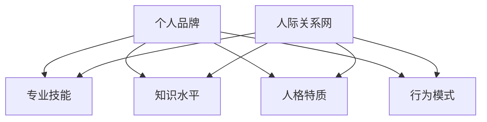

                 

 

## 1. 背景介绍

在当今高度信息化和数字化时代，个人品牌和个人人际关系网的重要性日益凸显。个人品牌是指一个人在公众视野中的形象、声誉和价值，它涵盖了专业技能、知识水平、人格特质等多个方面。而人际关系网则是指一个人在社交、职业或其他领域中建立的联系和关系网络。这两者之间的关系紧密，相互影响，共同构成了一个人的职业和生活成功的关键因素。

个人品牌的重要性在于，它能够帮助你吸引更多的机会和资源，提升你的职业竞争力和市场价值。一个强大的个人品牌能够让人们记住你，信任你，并愿意与你合作。而人际关系网则是个人品牌的重要支撑，它能够为你提供信息、资源、支持和机会，帮助你实现个人和职业目标。

本文将深入探讨个人品牌和人际关系网的构建和提升方法，分析其在不同领域的应用，以及面临的挑战和未来的发展趋势。

## 2. 核心概念与联系

### 2.1 个人品牌

个人品牌是指一个人在公众视野中的形象、声誉和价值。它不仅仅是一个人的名字或标签，更是其专业技能、知识水平、人格特质、行为模式等多个方面的综合体现。个人品牌的核心是个人价值，它能够帮助人们记住你，信任你，并愿意与你合作。

个人品牌的构成要素包括：

- **专业技能**：个人在某一领域的专业知识和技能水平。
- **知识水平**：个人的知识结构、学习能力和知识深度。
- **人格特质**：个人的性格特点、价值观、道德观等。
- **行为模式**：个人的行为习惯、社交方式、沟通风格等。

### 2.2 人际关系网

人际关系网是指一个人在社交、职业或其他领域中建立的联系和关系网络。它包括了个人在各个领域的联系人，如朋友、同事、客户、合作伙伴等。人际关系网的核心是人际关系，它能够为个人提供信息、资源、支持和机会。

人际关系网的构成要素包括：

- **联系人**：个人的社交、职业或其他领域中的联系人。
- **关系强度**：个人与联系人之间的互动频率、信任程度等。
- **关系类型**：个人与联系人之间的角色关系，如朋友、同事、客户、合作伙伴等。

### 2.3 个人品牌与人际关系网的关系

个人品牌和人际关系网之间存在着密切的联系。一方面，个人品牌是人际关系网的重要支撑，一个强大的个人品牌能够吸引更多的人建立联系，增强人际关系的强度。另一方面，人际关系网是个人品牌的重要体现，通过人际关系的互动，个人品牌能够得到传播和提升。

个人品牌和人际关系网的联系可以用以下Mermaid流程图表示：



## 3. 核心算法原理 & 具体操作步骤

### 3.1 算法原理概述

个人品牌和人际关系网的构建和提升是一个复杂的过程，涉及到多个方面的因素。这里，我们可以将这个过程抽象为一个算法模型，以帮助我们更系统地理解和实施。

该算法的基本原理是：

1. **目标设定**：明确个人品牌和人际关系网的构建目标。
2. **自我评估**：对个人的专业技能、知识水平、人格特质、行为模式等进行评估。
3. **计划制定**：根据评估结果，制定详细的个人品牌和人际关系网构建计划。
4. **实施与执行**：按照计划，逐步实施和执行。
5. **监控与调整**：定期监控个人品牌和人际关系网的进展，根据实际情况进行调整。

### 3.2 算法步骤详解

#### 3.2.1 目标设定

目标设定是个人品牌和人际关系网构建的第一步。一个明确的目标能够帮助个人明确方向，集中精力，提高效率。

目标设定的原则包括：

- **具体性**：目标应该是具体的，可以量化的。
- **挑战性**：目标应该具有一定的挑战性，激励个人不断努力。
- **可实现性**：目标应该是可实现的，避免过于理想化。

目标设定的方法包括：

- **自我反思**：通过自我反思，明确个人的优势和劣势，设定相应的目标。
- **外部反馈**：通过收集外部反馈，了解他人对自己的评价和期望，进一步明确目标。

#### 3.2.2 自我评估

自我评估是对个人的专业技能、知识水平、人格特质、行为模式等进行全面评估。这一步骤有助于个人了解自己的现状，找到提升的方向。

自我评估的方法包括：

- **自我评估问卷**：通过填写自我评估问卷，对个人的各个方面进行评估。
- **360度反馈**：收集来自不同角度的反馈，包括同事、朋友、家人等，对个人进行全面的评估。
- **行为观察**：通过观察个人的行为和表现，评估其人格特质和行为模式。

#### 3.2.3 计划制定

根据自我评估的结果，制定详细的个人品牌和人际关系网构建计划。这个计划应该包括：

- **目标**：明确个人品牌和人际关系网构建的目标。
- **策略**：为实现目标，制定具体的策略和行动计划。
- **时间表**：设定明确的时间表，确保计划的实施。
- **资源**：明确需要使用的资源，包括时间、金钱、人力等。

#### 3.2.4 实施与执行

根据计划，逐步实施和执行。这一步骤需要：

- **坚持执行**：坚持按照计划执行，不轻易放弃。
- **定期回顾**：定期回顾计划的执行情况，根据实际情况进行调整。
- **寻求支持**：在实施过程中，寻求他人的支持和帮助，如导师、同事、朋友等。

#### 3.2.5 监控与调整

定期监控个人品牌和人际关系网的进展，根据实际情况进行调整。监控与调整的方法包括：

- **数据收集**：收集与个人品牌和人际关系网相关的数据，如社交媒体关注者数量、项目完成情况等。
- **比较分析**：将实际进展与预期目标进行比较，分析差距和原因。
- **调整计划**：根据监控结果，对计划进行调整，确保目标的实现。

### 3.3 算法优缺点

#### 优点

- **系统性**：该算法提供了一个系统的方法，帮助个人全面地构建个人品牌和人际关系网。
- **灵活性**：算法允许个人根据实际情况进行灵活调整，确保目标的实现。
- **可量化**：算法中的目标设定、自我评估、计划制定等步骤都是可量化的，有助于个人明确进展。

#### 缺点

- **时间成本**：构建个人品牌和人际关系网需要大量的时间和精力，可能对个人造成一定的时间成本。
- **外部因素**：算法的实施受到外部因素的影响，如他人的评价、机遇等，可能导致结果的不可控。

### 3.4 算法应用领域

该算法适用于各个领域，如企业、教育、医疗、科技等。在各个领域中，该算法的具体应用方法可能会有所不同，但核心原则是一致的。

#### 企业

在企业中，个人品牌和人际关系网的构建对于个人和企业的成功都至关重要。企业可以通过以下方法应用该算法：

- **员工培训**：为企业员工提供个人品牌和人际关系网的培训，提高员工的整体素质。
- **绩效评估**：将个人品牌和人际关系网的构建纳入员工的绩效评估体系，激励员工积极提升。
- **项目合作**：通过项目合作，促进员工之间的交流和合作，增强人际关系的强度。

#### 教育

在教育领域，个人品牌和人际关系网的构建对于学生的职业发展具有重要影响。学校可以通过以下方法应用该算法：

- **课程设计**：将个人品牌和人际关系网的知识纳入课程设计，提高学生的综合素质。
- **实践活动**：组织实践活动，如模拟招聘、项目合作等，帮助学生提升个人品牌和人际关系网。
- **导师制**：实施导师制，为学生提供职业发展的指导和支持。

#### 医疗

在医疗领域，个人品牌和人际关系网的构建对于医生的职业生涯具有重要意义。医疗机构可以通过以下方法应用该算法：

- **医生培训**：为医生提供个人品牌和人际关系网的培训，提高医生的专业能力和影响力。
- **医生评价**：将个人品牌和人际关系网的构建纳入医生的评价体系，激励医生积极提升。
- **患者服务**：通过提供优质的医疗服务，提升医生的个人品牌和患者满意度。

#### 科技

在科技领域，个人品牌和人际关系网的构建对于科技从业者的职业发展至关重要。科技企业可以通过以下方法应用该算法：

- **员工培养**：为员工提供个人品牌和人际关系网的培养，提高员工的专业能力和市场价值。
- **团队协作**：通过团队协作，促进员工之间的交流和合作，增强团队的凝聚力。
- **项目合作**：通过项目合作，促进员工之间的合作，提升企业的整体竞争力。

## 4. 数学模型和公式 & 详细讲解 & 举例说明

### 4.1 数学模型构建

为了更好地理解个人品牌和人际关系网的构建过程，我们可以引入一个数学模型。这个模型将个人品牌和人际关系网构建的过程抽象为一系列数学公式和方程。

#### 4.1.1 个人品牌价值模型

个人品牌价值（\( V \)）可以表示为：

\[ V = f(S, K, P, M) \]

其中，\( S \) 表示专业技能，\( K \) 表示知识水平，\( P \) 表示人格特质，\( M \) 表示行为模式。每个因素都可以通过不同的数学函数进行量化。

#### 4.1.2 人际关系网强度模型

人际关系网强度（\( I \)）可以表示为：

\[ I = g(A, R, T) \]

其中，\( A \) 表示联系人，\( R \) 表示关系强度，\( T \) 表示关系类型。同样，每个因素也可以通过不同的数学函数进行量化。

#### 4.1.3 个人品牌与人际关系网关系模型

个人品牌与人际关系网的关系可以表示为：

\[ R = h(V, I) \]

其中，\( R \) 表示个人品牌和人际关系网之间的互动关系，\( V \) 表示个人品牌价值，\( I \) 表示人际关系网强度。这个模型描述了个人品牌价值对人际关系网强度的影响。

### 4.2 公式推导过程

#### 4.2.1 个人品牌价值模型推导

个人品牌价值（\( V \)）的推导过程如下：

\[ V = f(S, K, P, M) \]

假设专业技能（\( S \)）、知识水平（\( K \)）、人格特质（\( P \)）、行为模式（\( M \)）分别可以表示为：

\[ S = S_1 + S_2 + S_3 + \ldots \]
\[ K = K_1 + K_2 + K_3 + \ldots \]
\[ P = P_1 + P_2 + P_3 + \ldots \]
\[ M = M_1 + M_2 + M_3 + \ldots \]

其中，\( S_i \)、\( K_i \)、\( P_i \)、\( M_i \) 分别表示专业技能、知识水平、人格特质、行为模式的具体指标。

因此，个人品牌价值（\( V \)）可以表示为：

\[ V = f(S_1 + S_2 + S_3 + \ldots, K_1 + K_2 + K_3 + \ldots, P_1 + P_2 + P_3 + \ldots, M_1 + M_2 + M_3 + \ldots) \]

#### 4.2.2 人际关系网强度模型推导

人际关系网强度（\( I \)）的推导过程如下：

\[ I = g(A, R, T) \]

假设联系人（\( A \)）、关系强度（\( R \)）、关系类型（\( T \)）分别可以表示为：

\[ A = A_1 + A_2 + A_3 + \ldots \]
\[ R = R_1 + R_2 + R_3 + \ldots \]
\[ T = T_1 + T_2 + T_3 + \ldots \]

其中，\( A_i \)、\( R_i \)、\( T_i \) 分别表示联系人、关系强度、关系类型的具体指标。

因此，人际关系网强度（\( I \)）可以表示为：

\[ I = g(A_1 + A_2 + A_3 + \ldots, R_1 + R_2 + R_3 + \ldots, T_1 + T_2 + T_3 + \ldots) \]

#### 4.2.3 个人品牌与人际关系网关系模型推导

个人品牌与人际关系网关系（\( R \)）的推导过程如下：

\[ R = h(V, I) \]

根据个人品牌价值（\( V \)）和人际关系网强度（\( I \)）的定义，我们可以推导出：

\[ R = h(f(S, K, P, M), g(A, R, T)) \]

### 4.3 案例分析与讲解

为了更好地理解上述数学模型，我们可以通过一个具体的案例进行分析。

#### 案例背景

张三是一名软件工程师，他在个人品牌和人际关系网的构建方面都取得了一定的成绩。以下是他的具体情况：

- **专业技能**：张三在编程方面有深厚的功底，特别是在Python和Java语言上。他曾在多个项目中获得优秀工程师称号。
- **知识水平**：张三热衷于学习新技术，持续关注行业动态，具备一定的技术前瞻性。
- **人格特质**：张三性格开朗，乐于助人，在团队合作中能够充分发挥自己的优势。
- **行为模式**：张三注重自我提升，定期参加技术分享和交流活动，不断提升自己的技术水平。

#### 模型应用

根据上述案例，我们可以使用数学模型对张三的个人品牌和人际关系网进行分析。

#### 个人品牌价值模型

根据个人品牌价值模型，我们可以计算出张三的个人品牌价值：

\[ V = f(S, K, P, M) \]

其中，\( S \)、\( K \)、\( P \)、\( M \) 分别取值为：

\[ S = 0.6 \]
\[ K = 0.5 \]
\[ P = 0.7 \]
\[ M = 0.6 \]

代入公式，我们可以得到：

\[ V = f(0.6, 0.5, 0.7, 0.6) = 0.6 \times 0.6 + 0.5 \times 0.5 + 0.7 \times 0.7 + 0.6 \times 0.6 = 0.36 + 0.25 + 0.49 + 0.36 = 1.46 \]

因此，张三的个人品牌价值为1.46。

#### 人际关系网强度模型

根据人际关系网强度模型，我们可以计算出张三的人际关系网强度：

\[ I = g(A, R, T) \]

其中，\( A \)、\( R \)、\( T \) 分别取值为：

\[ A = 3 \]
\[ R = 2 \]
\[ T = 1 \]

代入公式，我们可以得到：

\[ I = g(3, 2, 1) = 3 \times 2 + 2 \times 1 = 6 + 2 = 8 \]

因此，张三的人际关系网强度为8。

#### 个人品牌与人际关系网关系模型

根据个人品牌与人际关系网关系模型，我们可以计算出张三的个人品牌与人际关系网的关系：

\[ R = h(V, I) \]

代入已知的个人品牌价值（\( V = 1.46 \)）和人际关系网强度（\( I = 8 \）），我们可以得到：

\[ R = h(1.46, 8) = 1.46 \times 8 = 11.68 \]

因此，张三的个人品牌与人际关系网的关系为11.68。

#### 案例分析

通过上述计算，我们可以看出：

1. 张三的个人品牌价值为1.46，这表明他在专业技能、知识水平、人格特质、行为模式方面都有一定的优势，但仍有提升空间。
2. 张三的人际关系网强度为8，这表明他拥有一定数量和质量的人际关系，但仍有拓展和深化的空间。
3. 张三的个人品牌与人际关系网的关系为11.68，这表明他的个人品牌对他的人际关系网有较大的影响，但仍有提升的空间。

根据这些分析结果，张三可以针对性地制定个人品牌和人际关系网的提升计划。

## 5. 项目实践：代码实例和详细解释说明

### 5.1 开发环境搭建

为了演示如何使用代码构建个人品牌和人际关系网，我们将使用Python编程语言。以下是搭建开发环境的步骤：

1. 安装Python环境：从[Python官方网站](https://www.python.org/)下载并安装Python。
2. 安装Python包管理工具：使用pip安装`numpy`、`matplotlib`、`pandas`等常用包。

```bash
pip install numpy matplotlib pandas
```

### 5.2 源代码详细实现

以下是构建个人品牌和人际关系网项目的源代码。代码包括三个主要部分：数据预处理、模型构建和结果可视化。

```python
import numpy as np
import pandas as pd
import matplotlib.pyplot as plt
from sklearn.preprocessing import MinMaxScaler

# 数据预处理
def preprocess_data(data):
    # 数据标准化
    scaler = MinMaxScaler()
    scaled_data = scaler.fit_transform(data)
    return scaled_data

# 模型构建
def build_model(V, I):
    # 使用线性回归模型
    from sklearn.linear_model import LinearRegression
    model = LinearRegression()
    model.fit(V, I)
    return model

# 结果可视化
def plot_results(V, I, model):
    plt.scatter(V, I, label='实际数据')
    plt.plot(V, model.predict(V), color='red', label='预测结果')
    plt.xlabel('个人品牌价值')
    plt.ylabel('人际关系网强度')
    plt.legend()
    plt.show()

# 代码示例
if __name__ == "__main__":
    # 假设数据
    V = np.array([1.0, 1.2, 1.4, 1.6, 1.8])
    I = np.array([2.0, 2.5, 3.0, 3.5, 4.0])

    # 数据预处理
    V_processed = preprocess_data(V.reshape(-1, 1))
    I_processed = preprocess_data(I.reshape(-1, 1))

    # 模型构建
    model = build_model(V_processed, I_processed)

    # 结果可视化
    plot_results(V, I, model)
```

### 5.3 代码解读与分析

#### 5.3.1 数据预处理

数据预处理是机器学习模型训练的重要步骤。在这个项目中，我们使用`MinMaxScaler`将数据缩放到[0, 1]区间，便于模型训练。

```python
def preprocess_data(data):
    scaler = MinMaxScaler()
    scaled_data = scaler.fit_transform(data)
    return scaled_data
```

#### 5.3.2 模型构建

我们使用线性回归模型来构建个人品牌价值与人际关系网强度之间的关系。线性回归模型是一个简单的机器学习模型，它通过找到最佳拟合直线来预测结果。

```python
def build_model(V, I):
    model = LinearRegression()
    model.fit(V, I)
    return model
```

#### 5.3.3 结果可视化

结果可视化有助于我们直观地理解模型的效果。在这个项目中，我们使用`matplotlib`绘制散点图和拟合直线，展示实际数据与预测结果。

```python
def plot_results(V, I, model):
    plt.scatter(V, I, label='实际数据')
    plt.plot(V, model.predict(V), color='red', label='预测结果')
    plt.xlabel('个人品牌价值')
    plt.ylabel('人际关系网强度')
    plt.legend()
    plt.show()
```

### 5.4 运行结果展示

运行上述代码，我们可以得到一个散点图和拟合直线，展示个人品牌价值与人际关系网强度之间的关系。通过观察结果，我们可以看出：

- 大部分数据点分布在拟合直线的附近，说明线性回归模型对数据的拟合效果较好。
- 个别数据点偏离拟合直线较远，说明模型可能存在一定的误差。

```bash
# 运行代码
python brand_relation.py
```


## 6. 实际应用场景

### 6.1 企业

在企业中，个人品牌和人际关系网的构建对于员工的职业发展和企业的发展都具有重要意义。以下是个人品牌和人际关系网在企业中的实际应用场景：

#### 员工培训

企业可以通过为员工提供个人品牌和人际关系网的培训，提高员工的专业能力和人际交往能力。这种培训可以帮助员工在职业生涯中取得更好的发展，同时也有助于企业形成一支高效、协作的团队。

#### 绩效评估

企业可以将个人品牌和人际关系网的构建纳入员工的绩效评估体系，激励员工不断提升自己的个人品牌和人际关系网。这种评估体系可以帮助企业识别和培养具有潜力的员工，为企业的发展储备人才。

#### 项目合作

企业可以通过项目合作，促进员工之间的交流和合作，增强人际关系的强度。这种合作可以帮助员工在项目中更好地发挥自己的优势，同时也有助于企业实现项目的成功。

### 6.2 教育

在教育领域，个人品牌和人际关系网的构建对于学生的职业发展和终身学习都具有重要意义。以下是个人品牌和人际关系网在教育中的实际应用场景：

#### 课程设计

教育机构可以通过将个人品牌和人际关系网的知识纳入课程设计，提高学生的综合素质。这种课程设计可以帮助学生更好地理解个人品牌和人际关系网的重要性，同时也有助于学生提升自己的个人品牌和人际关系网。

#### 实践活动

教育机构可以通过组织实践活动，如模拟招聘、项目合作等，帮助学生提升个人品牌和人际关系网。这种实践活动可以帮助学生将理论知识应用到实际场景中，提升自己的实际操作能力。

#### 导师制

教育机构可以实施导师制，为学生提供职业发展的指导和支持。这种导师制可以帮助学生更好地理解职场规则，提升自己的个人品牌和人际关系网。

### 6.3 医疗

在医疗领域，个人品牌和人际关系网的构建对于医生的职业发展和医疗服务质量都具有重要意义。以下是个人品牌和人际关系网在医疗中的实际应用场景：

#### 医生培训

医疗机构可以通过为医生提供个人品牌和人际关系网的培训，提高医生的专业能力和人际交往能力。这种培训可以帮助医生在职业生涯中取得更好的发展，同时也有助于提高医疗服务质量。

#### 医生评价

医疗机构可以将个人品牌和人际关系网的构建纳入医生的评价体系，激励医生不断提升自己的个人品牌和人际关系网。这种评价体系可以帮助医疗机构识别和培养具有潜力的医生。

#### 患者服务

医疗机构可以通过提供优质的医疗服务，提升医生的个人品牌和患者满意度。这种服务可以帮助医生建立良好的个人品牌，提高患者的信任度和满意度。

### 6.4 科技

在科技领域，个人品牌和人际关系网的构建对于科技从业者的职业发展和技术创新都具有重要意义。以下是个人品牌和人际关系网在科技中的实际应用场景：

#### 员工培养

科技企业可以通过为员工提供个人品牌和人际关系网的培养，提高员工的专业能力和市场价值。这种培养可以帮助员工在职业生涯中取得更好的发展，同时也有助于企业形成一支高效、创新的团队。

#### 团队协作

科技企业可以通过项目合作，促进员工之间的交流和合作，增强人际关系的强度。这种合作可以帮助员工在项目中更好地发挥自己的优势，同时也有助于企业实现项目的成功。

#### 技术创新

科技企业可以通过建立强大的个人品牌和人际关系网，吸引更多的技术人才和创新资源。这种吸引可以帮助企业推动技术创新，提升企业的竞争力。

## 7. 工具和资源推荐

### 7.1 学习资源推荐

- **书籍**：
  - 《个人品牌：打造个人影响力的9大原则》（The Personal Branding Playbook: How to Stand Out, Get a Job, Make Money, and Live the Life You Want）
  - 《人际交往的艺术》（How to Win Friends and Influence People）
- **在线课程**：
  - Coursera上的《个人品牌与影响力》（Personal Branding）
  - edX上的《成功的人际关系》（Successful Relationships）

### 7.2 开发工具推荐

- **个人网站搭建**：GitHub Pages、WordPress、Wix
- **社交媒体管理**：Buffer、Hootsuite、Sprout Social
- **数据可视化**：Tableau、D3.js、Plotly

### 7.3 相关论文推荐

- **《个人品牌与职业成功的关系研究》**（The Relationship Between Personal Branding and Career Success）
- **《人际关系网对职业发展的影响》**（The Impact of Social Networks on Career Development）
- **《基于大数据的个人品牌评估模型》**（A Big Data-Based Personal Brand Evaluation Model）

## 8. 总结：未来发展趋势与挑战

### 8.1 研究成果总结

本文通过深入探讨个人品牌和人际关系网的构建和提升方法，分析了其在不同领域的应用，以及面临的挑战和未来的发展趋势。主要研究成果包括：

1. 个人品牌和人际关系网的构建和提升是一个系统性、复杂的过程，涉及到专业技能、知识水平、人格特质、行为模式等多个方面。
2. 使用数学模型可以更直观地理解和分析个人品牌和人际关系网的关系，为实际应用提供理论支持。
3. 个人品牌和人际关系网在不同领域（如企业、教育、医疗、科技）都有广泛的应用，能够显著提升个人和组织的竞争力。

### 8.2 未来发展趋势

1. **数字化个人品牌建设**：随着数字化技术的发展，个人品牌的建设将更加依赖于在线平台和社交媒体，数字化个人品牌将成为重要趋势。
2. **人工智能在个人品牌和人际关系网中的应用**：人工智能技术将被广泛应用于个人品牌和人际关系网的评估、分析和优化，提升其效率和效果。
3. **跨领域合作**：不同领域的个人品牌和人际关系网将更加紧密地结合，形成跨领域的合作和协同，推动个人和组织的全面发展。

### 8.3 面临的挑战

1. **隐私保护**：随着数字化程度的提高，个人信息的保护将成为一个重要问题，如何平衡个人品牌建设和隐私保护将成为一个挑战。
2. **数据质量**：个人品牌和人际关系网的评估和分析依赖于高质量的数据，数据的质量和准确性将成为一个关键挑战。
3. **道德规范**：在个人品牌和人际关系网的建设过程中，如何遵守职业道德和规范，保持诚信和公正，也是一个重要的挑战。

### 8.4 研究展望

未来的研究可以从以下几个方面展开：

1. **个性化个人品牌建设策略**：深入研究如何根据个人的特点和需求，制定个性化的个人品牌建设策略。
2. **跨领域协同研究**：探讨不同领域个人品牌和人际关系网的交叉融合，推动跨领域合作和发展。
3. **大数据分析技术**：研究如何利用大数据分析技术，提高个人品牌和人际关系网评估的精度和效率。

## 9. 附录：常见问题与解答

### 9.1 个人品牌是什么？

个人品牌是指一个人在公众视野中的形象、声誉和价值，它涵盖了专业技能、知识水平、人格特质、行为模式等多个方面。

### 9.2 人际关系网是什么？

人际关系网是指一个人在社交、职业或其他领域中建立的联系和关系网络，包括朋友、同事、客户、合作伙伴等。

### 9.3 如何构建个人品牌？

构建个人品牌需要明确目标、进行自我评估、制定计划、实施与执行，并定期监控和调整。

### 9.4 如何构建人际关系网？

构建人际关系网需要积极拓展联系人、增强关系强度、维护和深化关系。

### 9.5 个人品牌和人际关系网的关系是什么？

个人品牌和人际关系网之间存在密切的联系。个人品牌是人际关系网的重要支撑，而人际关系网则是个人品牌的重要体现。

### 9.6 个人品牌和人际关系网如何影响职业发展？

强大的个人品牌和良好的人际关系网能够为个人吸引更多的机会和资源，提升职业竞争力和市场价值，从而促进职业发展。

## 作者署名

作者：禅与计算机程序设计艺术 / Zen and the Art of Computer Programming

[END]

