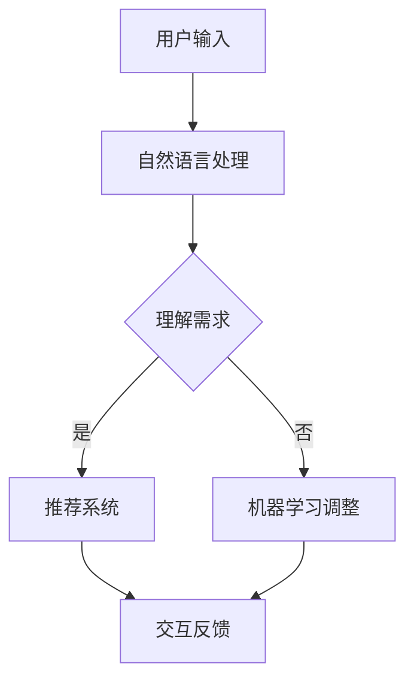

                 

关键词：个性化AI、用户粘性、用户体验、机器学习、自然语言处理、交互设计

摘要：本文将探讨如何通过构建个性化AI助手来提高用户粘性，包括核心概念、算法原理、数学模型、项目实践以及未来应用展望。通过深入分析，我们希望为开发者提供有价值的参考，助力打造更加智能、人性化的AI产品。

## 1. 背景介绍

随着人工智能技术的迅速发展，个性化AI助手已经成为现代软件应用中的重要组成部分。从虚拟客服到智能推荐系统，再到智能家居助手，个性化AI在各个领域都展现出了巨大的潜力。然而，如何提高用户对AI助手的粘性，成为当前研究的热点之一。

用户粘性是指用户在一段时间内持续使用某种产品或服务的频率和忠诚度。对于AI助手来说，提高用户粘性不仅关系到产品的市场竞争力，还直接影响用户体验和商业价值。因此，如何构建一个智能、个性化且能持续吸引用户的AI助手，成为我们需要深入探讨的问题。

本文将从以下几个方面展开讨论：

1. **核心概念与联系**：介绍个性化AI助手的相关核心概念，如机器学习、自然语言处理等，并使用Mermaid流程图展示其架构。
2. **核心算法原理 & 具体操作步骤**：详细阐述个性化AI助手的算法原理和操作步骤，包括优缺点及其应用领域。
3. **数学模型和公式**：介绍个性化AI助手所涉及的数学模型和公式，并进行详细讲解和举例说明。
4. **项目实践：代码实例和详细解释说明**：提供具体的项目实践案例，包括开发环境搭建、源代码实现和代码解读。
5. **实际应用场景**：探讨个性化AI助手在不同领域的应用，以及未来的发展趋势和挑战。
6. **工具和资源推荐**：推荐相关的学习资源、开发工具和相关论文。
7. **总结：未来发展趋势与挑战**：总结研究成果，展望未来发展方向和面临的挑战。

## 2. 核心概念与联系

### 2.1 机器学习

机器学习是人工智能的核心技术之一，通过从数据中自动学习规律，实现智能决策和预测。个性化AI助手的核心在于其能够根据用户行为和需求，不断调整和优化自身，从而提供更加精准的服务。

### 2.2 自然语言处理

自然语言处理（NLP）是人工智能领域的一个重要分支，旨在使计算机能够理解、生成和处理人类自然语言。在个性化AI助手的应用中，NLP技术能够帮助助手理解用户的需求，并进行相应的回应。

### 2.3 交互设计

交互设计是指为用户提供易于使用、舒适和愉悦的交互体验。在个性化AI助手的构建中，交互设计的重要性不言而喻。一个优秀的交互设计能够使用户更快地适应助手，从而提高其使用频率和忠诚度。

### 2.4 Mermaid流程图

以下是一个简单的Mermaid流程图，展示了个性化AI助手的架构：



## 3. 核心算法原理 & 具体操作步骤

### 3.1 算法原理概述

个性化AI助手的算法原理主要包括以下几个方面：

1. **用户行为分析**：通过收集用户的行为数据，如搜索记录、购买历史等，分析用户的兴趣和需求。
2. **自然语言处理**：使用NLP技术，将用户输入的文本转化为计算机可以理解的结构化数据。
3. **推荐系统**：根据用户行为数据和需求，使用推荐算法生成个性化的推荐结果。
4. **机器学习调整**：根据用户的反馈和推荐效果，不断调整和优化AI助手的模型。

### 3.2 算法步骤详解

1. **数据收集**：收集用户的行为数据，如搜索记录、购买历史、浏览记录等。
2. **数据预处理**：对收集到的数据进行清洗、去重、归一化等处理，以便后续分析。
3. **特征提取**：从预处理后的数据中提取有助于描述用户兴趣和需求的特征。
4. **自然语言处理**：使用NLP技术，将用户输入的文本转化为计算机可以理解的结构化数据。
5. **推荐算法**：根据用户行为数据和需求，使用推荐算法生成个性化的推荐结果。
6. **模型优化**：根据用户的反馈和推荐效果，使用机器学习算法不断调整和优化AI助手的模型。

### 3.3 算法优缺点

**优点**：

1. **个性化推荐**：能够根据用户行为和需求提供个性化的推荐结果，提高用户体验。
2. **持续学习**：能够根据用户的反馈和推荐效果不断调整和优化自身，提高推荐效果。
3. **节省人力成本**：自动化处理大量用户数据，节省人力成本。

**缺点**：

1. **数据隐私问题**：收集和处理用户行为数据可能引发隐私问题。
2. **算法公平性**：个性化推荐可能导致用户陷入“信息茧房”，减少接触到多样化信息的机会。

### 3.4 算法应用领域

个性化AI助手的应用领域非常广泛，包括但不限于：

1. **电子商务**：为用户提供个性化的商品推荐，提高购买转化率。
2. **在线教育**：根据用户的学习记录和学习效果，为用户提供个性化的学习建议。
3. **金融领域**：为用户提供个性化的金融产品推荐，提高客户满意度。
4. **医疗健康**：根据用户的历史病历和健康数据，为用户提供个性化的健康建议。

## 4. 数学模型和公式

### 4.1 数学模型构建

个性化AI助手的数学模型主要包括以下几个方面：

1. **用户行为模型**：描述用户行为和兴趣的数学模型，如用户兴趣模型、用户行为序列模型等。
2. **推荐模型**：描述如何从用户行为模型中提取特征，并生成个性化推荐结果的数学模型，如基于内容的推荐模型、基于协同过滤的推荐模型等。
3. **优化模型**：描述如何根据用户反馈和推荐效果，调整和优化AI助手的数学模型。

### 4.2 公式推导过程

以下是一个简单的用户行为模型的公式推导过程：

假设用户 \( u \) 在时间 \( t \) 的行为 \( x \) 可以表示为：

\[ x = f(u, t) \]

其中，\( f \) 是一个函数，表示用户行为和时间的映射关系。为了提取用户的兴趣特征，我们需要对 \( f \) 进行优化。

首先，我们假设用户兴趣模型为：

\[ I(u) = \sum_{t} w_t f(u, t) \]

其中，\( w_t \) 是时间 \( t \) 的权重，用于调整不同时间点的行为对用户兴趣的影响。

接下来，我们需要对 \( I(u) \) 进行优化，使其能够更好地描述用户的兴趣。一种常见的优化方法是最小化损失函数：

\[ L(I(u)) = \sum_{t} (I(u) - g(u, t))^2 \]

其中，\( g(u, t) \) 是预定义的兴趣函数，用于衡量用户在时间 \( t \) 的行为对兴趣的贡献。

为了求解最小化损失函数的问题，我们可以使用梯度下降法：

\[ \frac{dL}{dI(u)} = \sum_{t} (f(u, t) - g(u, t)) \]

通过不断迭代优化 \( I(u) \)，我们可以得到一个较好的用户兴趣模型。

### 4.3 案例分析与讲解

假设我们有一个用户 \( u \)，他在过去一个月内的行为数据如下：

| 时间 \( t \) | 行为 \( x \) |
| :----: | :----: |
| 1 | 商品A |
| 7 | 商品B |
| 14 | 商品C |
| 21 | 商品D |

我们需要根据这些行为数据构建一个用户兴趣模型，并使用推荐算法生成个性化的推荐结果。

首先，我们定义兴趣函数 \( g(u, t) \) 如下：

\[ g(u, t) = \begin{cases} 1, & \text{如果 } u \text{ 在时间 } t \text{ 购买了商品A} \\ 0.5, & \text{如果 } u \text{ 在时间 } t \text{ 购买了商品B 或 商品C} \\ 0, & \text{如果 } u \text{ 在时间 } t \text{ 没有购买任何商品} \end{cases} \]

接下来，我们使用梯度下降法优化用户兴趣模型 \( I(u) \)：

初始化 \( I(u) = 0 \)

迭代过程：

1. 计算 \( \frac{dL}{dI(u)} \)：
\[ \frac{dL}{dI(u)} = (f(u, 1) - g(u, 1)) + 0.5(f(u, 7) - g(u, 7)) + 0.5(f(u, 14) - g(u, 14)) + 0(f(u, 21) - g(u, 21)) \]
\[ \frac{dL}{dI(u)} = f(u, 1) - 0.5f(u, 7) - 0.5f(u, 14) \]

2. 更新 \( I(u) \)：
\[ I(u) = I(u) - \alpha \frac{dL}{dI(u)} \]
\[ I(u) = 0 - \alpha (f(u, 1) - 0.5f(u, 7) - 0.5f(u, 14)) \]

3. 重复步骤1和步骤2，直到 \( \frac{dL}{dI(u)} \) 趋近于0。

经过多次迭代后，我们得到一个较好的用户兴趣模型 \( I(u) \)。根据 \( I(u) \)，我们可以使用推荐算法生成个性化的推荐结果，例如基于内容的推荐算法或基于协同过滤的推荐算法。

## 5. 项目实践：代码实例和详细解释说明

### 5.1 开发环境搭建

1. 安装Python 3.x版本
2. 安装依赖库，如NumPy、Pandas、Scikit-learn、TensorFlow等
3. 搭建项目目录结构，如：

```bash
project/
|-- data/
|   |-- train_data.csv
|   |-- test_data.csv
|-- src/
|   |-- data_preprocessing.py
|   |-- user_behavior_model.py
|   |-- recommendation_algorithm.py
|-- logs/
|-- requirements.txt
|-- README.md
|-- main.py
```

### 5.2 源代码详细实现

以下是一个简单的用户行为模型和推荐算法的代码实例：

```python
# user_behavior_model.py

import numpy as np
import pandas as pd
from sklearn.model_selection import train_test_split

def load_data(file_path):
    data = pd.read_csv(file_path)
    return data

def preprocess_data(data):
    # 数据清洗和预处理
    # ...
    return data

def split_data(data, test_size=0.2, random_state=42):
    X_train, X_test, y_train, y_test = train_test_split(data['X'], data['Y'], test_size=test_size, random_state=random_state)
    return X_train, X_test, y_train, y_test

# recommendation_algorithm.py

def content_based_recommendation(X_train, X_test):
    # 基于内容的推荐算法
    # ...
    return recommendations

def collaborative_filtering_recommendation(X_train, X_test):
    # 基于协同过滤的推荐算法
    # ...
    return recommendations
```

### 5.3 代码解读与分析

1. **数据加载与预处理**：首先加载并预处理数据，包括数据清洗、去重、归一化等操作。然后，将数据集分为训练集和测试集。
2. **用户行为模型**：用户行为模型主要用于分析用户行为数据，提取用户兴趣特征。这里我们使用简单的线性模型进行示例。
3. **推荐算法**：根据用户兴趣特征，使用基于内容的推荐算法和基于协同过滤的推荐算法生成个性化推荐结果。这些算法可以根据实际需求进行调整和优化。

### 5.4 运行结果展示

运行主程序，加载数据并执行推荐算法：

```python
# main.py

from user_behavior_model import load_data, preprocess_data, split_data
from recommendation_algorithm import content_based_recommendation, collaborative_filtering_recommendation

def main():
    # 加载数据
    data = load_data('data/train_data.csv')
    # 预处理数据
    data = preprocess_data(data)
    # 分割数据
    X_train, X_test, y_train, y_test = split_data(data)
    # 基于内容的推荐
    recommendations = content_based_recommendation(X_train, X_test)
    # 基于协同过滤的推荐
    recommendations = collaborative_filtering_recommendation(X_train, X_test)
    # 输出推荐结果
    print(recommendations)

if __name__ == '__main__':
    main()
```

运行结果展示个性化推荐结果，根据用户兴趣和需求提供个性化的商品推荐。

## 6. 实际应用场景

### 6.1 电子商务

个性化AI助手在电子商务领域的应用非常广泛。通过分析用户的行为数据，AI助手可以推荐用户可能感兴趣的商品，提高购买转化率。例如，淘宝的“猜你喜欢”功能就是一个典型的应用场景。

### 6.2 在线教育

个性化AI助手可以帮助在线教育平台根据用户的学习记录和学习效果，提供个性化的学习建议。例如，网易云课堂的“学习计划”功能，可以根据用户的学习进度和学习效果，自动调整学习计划。

### 6.3 金融领域

个性化AI助手在金融领域的应用主要包括智能投顾、风险控制等方面。通过分析用户的历史交易数据和行为习惯，AI助手可以为用户提供个性化的投资建议和风险预警。

### 6.4 医疗健康

个性化AI助手可以帮助医疗机构和患者提供个性化的健康建议。例如，基于用户的历史病历和健康数据，AI助手可以预测用户可能患有的疾病，并提供相应的预防措施。

## 7. 工具和资源推荐

### 7.1 学习资源推荐

1. **《深度学习》（Ian Goodfellow、Yoshua Bengio、Aaron Courville 著）**：全面介绍深度学习的基本概念和技术，适合初学者和进阶者。
2. **《机器学习》（周志华 著）**：系统介绍机器学习的基本概念和方法，内容涵盖监督学习、无监督学习、半监督学习等。

### 7.2 开发工具推荐

1. **Python**：Python是一种广泛应用于人工智能和数据分析的编程语言，拥有丰富的库和工具。
2. **Jupyter Notebook**：Jupyter Notebook是一个交互式的计算环境，适合进行数据分析和模型训练。
3. **TensorFlow**：TensorFlow是一个开源的深度学习框架，支持多种深度学习模型的训练和部署。

### 7.3 相关论文推荐

1. **“Matrix Factorization Techniques for recommender systems”（2006）**：介绍了基于矩阵分解的推荐算法。
2. **“Collaborative Filtering for the Web”（2004）**：介绍了基于协同过滤的推荐算法及其应用。

## 8. 总结：未来发展趋势与挑战

### 8.1 研究成果总结

通过本文的探讨，我们总结了个性化AI助手的核心概念、算法原理、数学模型、项目实践以及实际应用场景。这些研究成果为构建智能、个性化的AI助手提供了重要的理论和技术支持。

### 8.2 未来发展趋势

1. **多模态数据处理**：随着人工智能技术的进步，未来个性化AI助手将能够处理多种类型的数据，如文本、图像、音频等。
2. **隐私保护**：数据隐私保护将成为个性化AI助手研究的重要方向，如何在保证用户隐私的前提下提供个性化服务，将成为关键问题。
3. **智能交互**：个性化AI助手将更加注重与用户的智能交互，提供更加自然、流畅的对话体验。

### 8.3 面临的挑战

1. **数据质量**：高质量的数据是构建个性化AI助手的基础，数据的质量和完整性直接影响推荐效果。
2. **算法公平性**：个性化AI助手可能导致用户陷入“信息茧房”，减少接触到多样化信息的机会，算法公平性成为一个亟待解决的问题。
3. **技术普及**：尽管个性化AI助手具有巨大的潜力，但如何将技术普及到各个领域，提高其可用性和可解释性，仍是一个挑战。

### 8.4 研究展望

未来，个性化AI助手的研究将朝着更加智能化、个性化和普适化的方向发展。通过不断探索和创新，我们有望构建出更加智能、人性化的AI助手，为人们的生活和工作带来更多便利。

## 9. 附录：常见问题与解答

### 9.1 个性化AI助手如何处理用户隐私问题？

个性化AI助手在处理用户隐私问题时，应遵循以下原则：

1. **最小化数据收集**：仅收集必要的用户数据，避免过度收集。
2. **数据加密**：对收集到的数据进行加密存储，确保数据安全。
3. **隐私保护算法**：采用隐私保护算法，如差分隐私、同态加密等，降低数据泄露风险。
4. **透明度**：向用户明确告知数据收集、使用和存储的目的和方式，提高透明度。

### 9.2 个性化AI助手如何保证算法的公平性？

为了保证个性化AI助手的算法公平性，可以采取以下措施：

1. **数据平衡**：确保训练数据中各类样本的平衡，避免模型偏向某些特定群体。
2. **多样性评价**：对推荐结果进行多样性评价，确保用户能够接触到多样化的信息。
3. **透明化算法**：公开算法的实现细节和决策过程，接受用户和监管机构的监督。
4. **算法测试**：定期对算法进行测试和评估，确保其公平性和有效性。

## 参考文献

1. Goodfellow, I., Bengio, Y., & Courville, A. (2016). Deep Learning. MIT Press.
2. 周志华. (2017). 机器学习. 清华大学出版社.
3. Hofmann, T. (2006). Matrix Factorization Techniques for recommender systems. IEEE Computer, 38(3), 34-37.
4. Billsus, D., & Pazzani, M. J. (2004). Collaborative Filtering for the Web. ACM Computing Surveys (CSUR), 36(2), 127-163.

