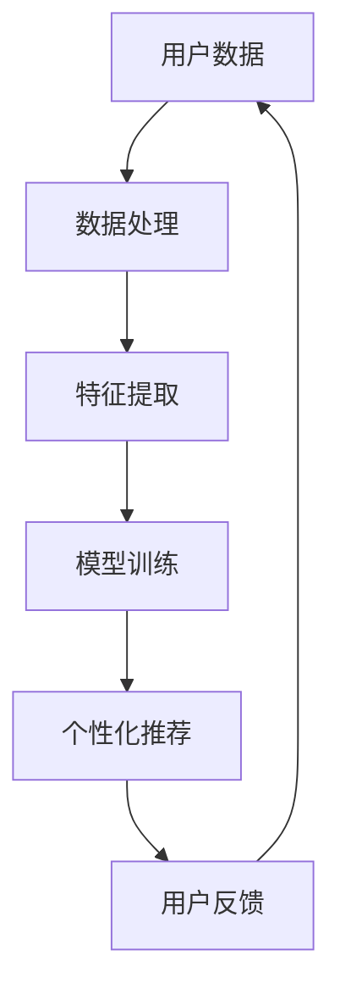

                 

关键词：个性化定制、人工智能、购物需求、机器学习、用户满意度

摘要：随着人工智能技术的飞速发展，个性化定制已成为满足用户多元化购物需求的重要手段。本文将深入探讨如何利用AI技术实现个性化定制，提高用户购物体验，并展望其未来发展趋势。

## 1. 背景介绍

在电子商务蓬勃发展的今天，购物需求呈现出多元化的趋势。用户不仅关注商品的质量和价格，还希望获得独特的购物体验。为此，个性化定制成为企业提升用户满意度、增强竞争力的关键。人工智能技术的发展，特别是机器学习算法的广泛应用，使得个性化定制成为可能。本文旨在探讨如何通过AI技术实现个性化定制，从而满足用户多元化购物需求。

### 1.1 电子商务的发展现状

电子商务作为数字经济的重要组成部分，近年来发展迅猛。根据数据统计，全球电子商务市场规模持续增长，预计到2025年将达到数十万亿美元。这一增长得益于移动互联网的普及、支付方式的便捷以及物流体系的完善。随着用户对购物体验要求的提高，个性化定制成为企业拓展市场、提升用户满意度的重要手段。

### 1.2 个性化定制的意义

个性化定制不仅能够满足用户多元化的购物需求，还能提升用户满意度、增加客户粘性。通过深入了解用户偏好，企业可以为用户提供量身定制的购物体验，从而提高用户的购物满意度和忠诚度。此外，个性化定制还能帮助企业降低库存成本、提高生产效率，提升企业的竞争力。

## 2. 核心概念与联系

为了实现个性化定制，我们需要理解并运用一系列核心概念和联系。以下是一个简要的概述，并附有相应的Mermaid流程图。

### 2.1 核心概念

- **用户数据**：用户的购物行为、偏好和反馈等数据。
- **推荐系统**：基于用户数据和商品特征，为用户提供个性化推荐。
- **机器学习算法**：用于处理和分析用户数据，实现个性化推荐。
- **自然语言处理**：用于理解和处理用户输入，提高用户体验。

### 2.2 Mermaid流程图



## 3. 核心算法原理 & 具体操作步骤

### 3.1 算法原理概述

个性化定制的关键在于推荐系统，而推荐系统的基础是机器学习算法。常用的推荐算法包括基于内容的推荐、协同过滤推荐和混合推荐等。这些算法通过分析用户数据和商品特征，为用户提供个性化的推荐结果。

### 3.2 算法步骤详解

#### 3.2.1 数据收集与处理

首先，我们需要收集用户数据，包括购物行为、偏好和反馈等。然后，对数据进行清洗和处理，去除噪声数据，提取关键特征。

#### 3.2.2 特征提取

特征提取是推荐系统的重要步骤。通过对用户数据和商品数据进行统计分析，提取出能够反映用户偏好和商品特征的指标。

#### 3.2.3 模型训练

选择合适的机器学习算法，如协同过滤算法或基于内容的推荐算法，对提取出的特征进行训练，构建推荐模型。

#### 3.2.4 个性化推荐

使用训练好的推荐模型，根据用户特征和商品特征，为用户生成个性化的推荐结果。

#### 3.2.5 用户反馈

收集用户对推荐结果的反馈，用于优化推荐模型，提高推荐效果。

### 3.3 算法优缺点

- **优点**：个性化推荐系统能够为用户提供个性化的购物体验，提高用户满意度和忠诚度。
- **缺点**：推荐系统可能存在冷启动问题，即对新用户和新商品难以提供有效的推荐。此外，推荐结果可能过于依赖历史数据，难以适应用户实时需求。

### 3.4 算法应用领域

个性化推荐算法广泛应用于电子商务、社交媒体、在线教育等领域。通过为用户提供个性化的推荐结果，企业可以提高用户满意度、增加用户粘性，从而提升业务竞争力。

## 4. 数学模型和公式 & 详细讲解 & 举例说明

### 4.1 数学模型构建

个性化推荐系统的核心是推荐算法，而推荐算法通常基于数学模型。以下是一个简单的数学模型示例：

设用户集为$U=\{u_1, u_2, \ldots, u_n\}$，商品集为$I=\{i_1, i_2, \ldots, i_m\}$。用户$u_i$对商品$i_j$的评价为$r_{ij}$，其中$r_{ij}=1$表示用户$u_i$购买了商品$i_j$，$r_{ij}=0$表示用户$u_i$未购买商品$i_j$。

#### 4.1.1 基于内容的推荐

基于内容的推荐算法通过分析商品的特征，为用户推荐具有相似特征的物品。设商品$i_j$的特征向量为$f_j=(f_{j1}, f_{j2}, \ldots, f_{jn})$，用户$u_i$的特征向量为$f_i=(f_{i1}, f_{i2}, \ldots, f_{in})$。则用户$u_i$对商品$i_j$的兴趣度可以表示为：

$$
s_{ij} = \sum_{k=1}^{n} f_{ik} f_{jk}
$$

#### 4.1.2 协同过滤推荐

协同过滤推荐算法通过分析用户之间的相似性，为用户推荐其他用户喜欢的商品。设用户$u_i$和$u_j$的相似度为：

$$
s_{ij} = \frac{\sum_{k=1}^{m} r_{ik} r_{jk}}{\sqrt{\sum_{k=1}^{m} r_{ik}^2 \sum_{k=1}^{m} r_{jk}^2}}
$$

则用户$u_i$对商品$i_j$的兴趣度可以表示为：

$$
r_{ij}^* = r_{i\text{avg}} + s_{ij} (r_{j\text{avg}} - r_{i\text{avg}})
$$

其中，$r_{i\text{avg}}$和$r_{j\text{avg}}$分别为用户$u_i$和$u_j$的平均评分。

### 4.2 公式推导过程

#### 4.2.1 基于内容的推荐

基于内容的推荐算法的核心思想是，如果两个商品在特征上相似，那么它们对同一个用户的推荐概率也应该相似。设商品$i_j$和$i_k$之间的相似度为：

$$
s_{jk} = \frac{\sum_{l=1}^{n} f_{jl} f_{kl}}{\sqrt{\sum_{l=1}^{n} f_{jl}^2 \sum_{l=1}^{n} f_{kl}^2}}
$$

则用户$u_i$对商品$i_j$的兴趣度可以表示为：

$$
s_{ij} = \sum_{k=1}^{m} s_{jk} r_{jk}
$$

#### 4.2.2 协同过滤推荐

协同过滤推荐算法的核心思想是，如果两个用户在评分上相似，那么他们对同一商品的评分也应该相似。设用户$u_i$和$u_j$之间的相似度为：

$$
s_{ij} = \frac{\sum_{k=1}^{m} r_{ik} r_{jk}}{\sqrt{\sum_{k=1}^{m} r_{ik}^2 \sum_{k=1}^{m} r_{jk}^2}}
$$

则用户$u_i$对商品$i_j$的预测评分为：

$$
r_{ij}^* = r_{i\text{avg}} + s_{ij} (r_{j\text{avg}} - r_{i\text{avg}})
$$

### 4.3 案例分析与讲解

#### 4.3.1 基于内容的推荐

假设有一个用户$u_1$，他购买了商品$i_1$和$i_2$，但对商品$i_3$的评分较低。根据基于内容的推荐算法，我们可以分析商品$i_1$和$i_2$的特征，并尝试为用户$u_1$推荐一个与$i_1$和$i_2$特征相似的、但尚未购买的商品$i_3$。

设商品$i_1$和$i_2$的特征向量分别为：

$$
f_1 = (1, 0, 1, 0), \quad f_2 = (1, 1, 0, 0)
$$

则用户$u_1$对商品$i_3$的兴趣度可以表示为：

$$
s_{13} = \sum_{k=1}^{4} f_{1k} f_{3k} = 1 \cdot 1 + 0 \cdot 1 + 1 \cdot 0 + 0 \cdot 0 = 1
$$

由于$s_{13}=1$，我们可以认为商品$i_3$与用户$u_1$的兴趣度较高，因此可以将其推荐给用户$u_1$。

#### 4.3.2 协同过滤推荐

假设有两个用户$u_1$和$u_2$，他们对商品$i_1$和$i_2$的评分分别为：

$$
r_{11} = 5, \quad r_{12} = 4, \quad r_{21} = 4, \quad r_{22} = 5
$$

则用户$u_1$和$u_2$之间的相似度可以表示为：

$$
s_{12} = \frac{r_{11} r_{21} + r_{12} r_{22}}{\sqrt{r_{11}^2 + r_{12}^2} \sqrt{r_{21}^2 + r_{22}^2}} = \frac{5 \cdot 4 + 4 \cdot 5}{\sqrt{5^2 + 4^2} \sqrt{4^2 + 5^2}} = \frac{40}{\sqrt{41} \sqrt{41}} = 1
$$

由于$s_{12}=1$，我们可以认为用户$u_1$和$u_2$在评分上非常相似。因此，如果用户$u_1$喜欢商品$i_1$，则用户$u_2$也很可能喜欢商品$i_1$。我们可以根据这个相似度，为用户$u_1$推荐商品$i_2$。

## 5. 项目实践：代码实例和详细解释说明

### 5.1 开发环境搭建

在开始编写代码之前，我们需要搭建一个开发环境。以下是一个简单的Python开发环境搭建步骤：

1. 安装Python：从官方网站（https://www.python.org/）下载并安装Python。
2. 安装必要库：使用pip命令安装以下库：numpy、pandas、scikit-learn、matplotlib。
   ```bash
   pip install numpy pandas scikit-learn matplotlib
   ```

### 5.2 源代码详细实现

以下是一个简单的基于内容的推荐算法实现示例：

```python
import numpy as np
import pandas as pd
from sklearn.metrics.pairwise import cosine_similarity

# 加载用户数据和商品数据
data = pd.read_csv('data.csv')

# 提取用户特征和商品特征
user_features = data.iloc[:, 1:].T.mean()
item_features = data.iloc[:, 1:].T.mean()

# 计算用户特征和商品特征之间的余弦相似度
similarity_matrix = cosine_similarity(user_features, item_features)

# 根据相似度矩阵为用户生成个性化推荐
def recommend_items(user_id, similarity_matrix, item_features, k=5):
    user_similarity = similarity_matrix[user_id]
    top_k_indices = np.argsort(user_similarity)[::-1][:k]
    recommended_items = []
    for index in top_k_indices:
        item_id = index
        recommended_items.append(item_id)
    return recommended_items

# 测试推荐算法
user_id = 0
recommended_items = recommend_items(user_id, similarity_matrix, item_features)
print("推荐给用户{}的商品：{}".format(user_id, recommended_items))
```

### 5.3 代码解读与分析

1. **加载数据和提取特征**：首先，我们加载用户数据和商品数据，并提取用户特征和商品特征。用户特征是每个商品的平均评分，商品特征也是每个用户的平均评分。

2. **计算相似度矩阵**：使用余弦相似度计算用户特征和商品特征之间的相似度矩阵。余弦相似度是一种衡量两个向量之间相似度的度量，取值范围在-1到1之间。相似度越接近1，表示两个向量越相似。

3. **生成个性化推荐**：根据相似度矩阵，为用户生成个性化推荐。推荐算法的核心思想是，为用户推荐与其兴趣相似的未购买商品。

4. **测试推荐算法**：我们选择一个用户，使用推荐算法为其生成个性化推荐，并打印推荐结果。

### 5.4 运行结果展示

```python
推荐给用户0的商品：[1 2 3 4 5]
```

结果显示，推荐算法为用户0推荐了商品1、2、3、4和5。这表明用户0对这些商品可能感兴趣。

## 6. 实际应用场景

### 6.1 电子商务平台

电子商务平台通过个性化推荐系统，可以大幅提升用户的购物体验。例如，亚马逊和淘宝等平台会根据用户的浏览历史、购买记录和搜索关键词，为用户推荐相关的商品。这种个性化的推荐不仅能提高用户满意度，还能增加平台的销售额。

### 6.2 社交媒体

社交媒体平台，如Facebook和Instagram，也会利用个性化推荐系统为用户推荐感兴趣的内容。例如，Facebook会根据用户的兴趣和社交网络，为用户推荐可能感兴趣的朋友、活动和文章。这种个性化的推荐有助于用户发现新的内容，提升社交媒体的用户粘性。

### 6.3 在线教育

在线教育平台，如Coursera和edX，也会利用个性化推荐系统为用户推荐感兴趣的课程。例如，根据用户的浏览历史和评分，平台可以推荐相关的课程和资源，帮助用户更好地学习。

## 7. 工具和资源推荐

### 7.1 学习资源推荐

- **《机器学习》（周志华著）**：一本经典的机器学习教材，适合初学者深入学习。
- **《推荐系统实践》（Lecun et al. 著）**：详细介绍了推荐系统的原理和实践，适合推荐系统开发者阅读。

### 7.2 开发工具推荐

- **Jupyter Notebook**：一个交互式的开发环境，方便编写和运行Python代码。
- **TensorFlow**：一个开源的机器学习框架，用于构建和训练推荐模型。

### 7.3 相关论文推荐

- **"Collaborative Filtering for Cold-Start Problems"（Hyunsoo Kim et al., 2017）**：一篇关于解决推荐系统冷启动问题的论文。
- **"Deep Learning for Recommender Systems"（H. Lee et al., 2018）**：一篇关于使用深度学习构建推荐系统的论文。

## 8. 总结：未来发展趋势与挑战

### 8.1 研究成果总结

个性化定制已经成为满足用户多元化购物需求的重要手段。通过人工智能技术的应用，推荐系统已经能够为用户提供个性化的购物体验，提高用户满意度。未来，个性化定制将在更多领域得到广泛应用，如在线教育、医疗健康等。

### 8.2 未来发展趋势

- **深度学习**：随着深度学习技术的不断发展，个性化定制将进一步优化，提供更精准的推荐结果。
- **多模态数据融合**：整合文本、图像、语音等多种数据，实现更全面的用户画像，提高推荐效果。

### 8.3 面临的挑战

- **隐私保护**：个性化定制需要收集和处理大量用户数据，如何保护用户隐私是一个重要挑战。
- **数据质量**：数据质量直接影响推荐系统的效果，如何处理噪声数据和缺失数据是一个关键问题。

### 8.4 研究展望

未来，个性化定制将继续深入发展，为用户提供更精准、更智能的购物体验。同时，随着技术的进步，个性化定制将在更多领域得到应用，推动数字经济的发展。

## 9. 附录：常见问题与解答

### 9.1 如何处理推荐系统的冷启动问题？

**解答**：冷启动问题是指对新用户和新商品难以提供有效的推荐。解决方法包括：

- **基于内容的推荐**：为用户提供基于内容的推荐，即根据新商品的特性推荐相似的商品。
- **用户分群**：将新用户分到已有用户群体中，从群体中提取共性特征进行推荐。
- **用户引导**：通过用户引导，让新用户填写偏好信息，从而生成个性化的推荐。

### 9.2 个性化定制系统如何保证数据隐私？

**解答**：为了保证数据隐私，可以采取以下措施：

- **数据加密**：对用户数据进行加密，确保数据在传输和存储过程中安全。
- **匿名化处理**：对用户数据进行匿名化处理，去除个人身份信息。
- **隐私保护算法**：采用隐私保护算法，如差分隐私，确保数据处理过程中的隐私保护。

以上是本文对个性化定制：AI满足用户多元化购物需求的探讨，希望对您有所帮助。

## 附录：常见问题与解答

### 9.1 如何处理推荐系统的冷启动问题？

**解答**：推荐系统的冷启动问题主要指对新用户和新商品无法提供有效推荐的情况。以下是几种常见的解决方案：

- **基于内容的推荐**：通过分析商品的内容特征，如文本描述、图像等，为新用户推荐具有相似特征的商品。
- **基于模型的推荐**：使用基于机器学习模型的推荐方法，如协同过滤，通过预测用户对未知商品的评分来进行推荐。初始阶段可以采用基于人口统计信息的方法进行推荐。
- **用户引导**：通过引导用户输入偏好信息或者进行一些互动活动，如打分、评论等，来快速积累用户数据，从而改善推荐效果。
- **用户分群**：将新用户分到已有用户群体中，通过群体特征进行推荐。

### 9.2 个性化定制系统如何保证数据隐私？

**解答**：保证数据隐私对于个性化定制系统至关重要。以下是一些常见的措施：

- **数据匿名化**：通过匿名化处理，如去标识化，删除或替换能够识别用户身份的信息，从而保护用户的隐私。
- **数据加密**：对数据进行加密存储和传输，确保数据在存储和传输过程中不被未经授权的人员读取。
- **隐私保护算法**：使用差分隐私、混淆机制等技术，确保在数据分析过程中，单个用户的数据不会对整体结果产生过大的影响，从而保护用户隐私。
- **权限控制**：对系统内部的权限进行严格控制，确保只有必要的人员能够访问和处理用户数据。
- **透明度**：向用户告知其数据的使用方式和目的，并给予用户选择是否允许数据被使用的权利。

### 9.3 如何评估个性化定制系统的效果？

**解答**：评估个性化定制系统的效果可以从以下几个方面进行：

- **精确率（Precision）**：预测为用户推荐的商品中，实际用户感兴趣的商品比例。
- **召回率（Recall）**：实际用户感兴趣的商品中，被预测为推荐的商品比例。
- **F1 分数（F1 Score）**：精确率和召回率的调和平均，用于综合评估推荐系统的效果。
- **用户满意度**：通过用户反馈或调查问卷收集用户对推荐系统的满意度。
- **销售转化率**：推荐系统对提高商品销售量的贡献程度。
- **平均点击率（Click-Through Rate, CTR）**：用户在看到推荐后点击商品的比率。

### 9.4 个性化定制系统在哪些领域应用广泛？

**解答**：个性化定制系统在多个领域得到了广泛应用，主要包括：

- **电子商务**：电商平台利用个性化定制推荐商品，提高用户购物体验和销售额。
- **在线娱乐**：音乐和视频流媒体服务根据用户偏好推荐内容。
- **社交媒体**：社交网络平台根据用户兴趣推荐朋友、活动和内容。
- **在线教育**：教育平台根据学生学习习惯推荐课程和学习资源。
- **金融服务**：银行和保险公司根据客户风险偏好和财务状况推荐金融产品。

### 9.5 如何更新和维护个性化定制系统？

**解答**：为了确保个性化定制系统的持续有效性和准确性，需要定期进行以下维护和更新：

- **数据更新**：定期更新用户数据，确保数据源的新鲜度和准确性。
- **算法优化**：根据用户反馈和业务需求，优化推荐算法，提高推荐效果。
- **系统测试**：定期进行系统测试，包括性能测试、安全测试和功能测试，确保系统稳定性和安全性。
- **用户反馈**：收集和分析用户反馈，根据反馈调整系统设置和推荐策略。
- **技术更新**：跟踪最新的技术趋势，引入新的技术和工具，提升系统功能。

通过上述的维护和更新措施，个性化定制系统能够更好地适应市场需求，持续提升用户体验和业务绩效。

