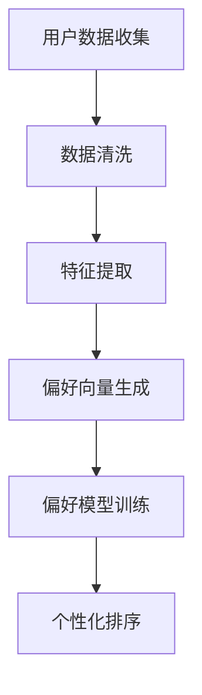
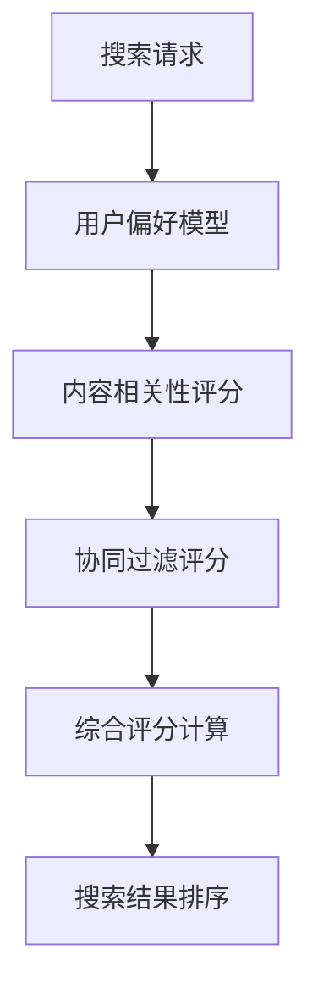
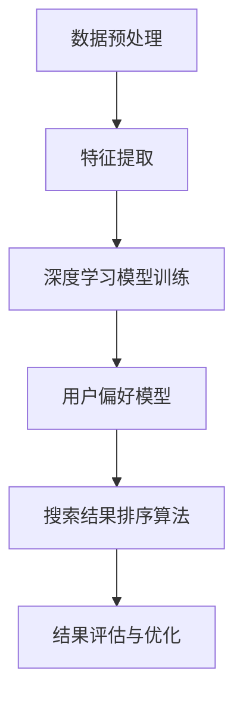

                 

关键词：个性化排序、AI、用户偏好、搜索结果、排序算法

摘要：本文旨在探讨如何通过人工智能技术实现个性化排序，以满足用户对搜索结果的高度个性化需求。通过对核心概念、算法原理、数学模型、项目实践以及应用场景等方面的详细阐述，本文将帮助读者全面理解个性化排序的技术实现与未来发展。

## 1. 背景介绍

随着互联网的普及和大数据时代的到来，用户对信息检索的需求日益增长。搜索引擎作为获取信息的重要渠道，其搜索结果的排序质量直接影响到用户体验。传统的搜索引擎排序算法往往基于网页的流行度、相关性等通用标准，但无法满足用户日益个性化的需求。为了提升用户体验，个性化排序技术应运而生。

个性化排序是一种基于用户偏好和行为数据，为每个用户生成定制化搜索结果的排序方法。通过AI技术，搜索引擎能够从海量的数据中挖掘用户的兴趣和需求，并动态调整搜索结果排序，提高搜索结果的匹配度和满意度。本文将围绕个性化排序的核心概念、算法原理、数学模型以及实际应用等方面进行深入探讨。

### 1.1 个性化排序的需求

- **用户多样性的需求**：不同用户在搜索同一主题时，可能会有不同的需求和偏好。例如，一个对体育新闻感兴趣的用户和一个对财经新闻感兴趣的用户的搜索结果排序应该不同。
- **信息过载**：随着互联网信息的爆炸性增长，用户在浏览搜索结果时，往往面临信息过载的问题。个性化排序能够通过筛选出用户可能感兴趣的内容，减轻用户的负担。
- **提升用户体验**：通过提供更符合用户预期的搜索结果，个性化排序能够提升用户的满意度，增强用户对搜索引擎的忠诚度。

### 1.2 个性化排序的现状

目前，个性化排序技术已经广泛应用于各大搜索引擎，如Google、百度等。这些搜索引擎利用机器学习、数据挖掘等技术，从用户的浏览历史、搜索记录、社交行为等多维度数据中提取特征，构建个性化模型，实现搜索结果的个性化排序。

然而，个性化排序仍面临一些挑战，如如何平衡用户隐私保护与个性化推荐、如何处理虚假信息和误导性内容等。这些问题需要通过不断的技术创新和优化来解决。

## 2. 核心概念与联系

### 2.1 用户偏好模型

用户偏好模型是个性化排序的核心，它通过分析用户的兴趣和行为，为每个用户生成一个个性化的偏好向量。以下是一个简单的Mermaid流程图，展示了用户偏好模型的构建过程：



### 2.2 搜索结果排序算法

个性化排序算法负责根据用户偏好模型，对搜索结果进行排序。常见的排序算法有基于内容的排序、协同过滤排序等。以下是一个简化的Mermaid流程图，展示了搜索结果排序的过程：



### 2.3 AI技术在个性化排序中的应用

AI技术在个性化排序中发挥了关键作用。通过深度学习、自然语言处理等技术，AI能够从大量非结构化数据中提取有效特征，提高用户偏好模型的准确性。以下是一个简化的Mermaid流程图，展示了AI技术在个性化排序中的应用：



## 3. 核心算法原理 & 具体操作步骤

### 3.1 算法原理概述

个性化排序算法的核心原理是利用用户的偏好信息，对搜索结果进行加权排序。具体来说，算法包括以下几个步骤：

1. **用户偏好模型构建**：通过分析用户的浏览历史、搜索记录等数据，构建用户偏好模型。
2. **内容相关性评估**：对搜索结果中的每个内容项进行内容相关性评估，计算每个内容项与用户偏好的匹配度。
3. **协同过滤评分**：利用协同过滤技术，根据用户之间的相似性，对搜索结果进行评分。
4. **综合评分计算**：将内容相关性和协同过滤评分进行综合计算，得到每个内容项的最终评分。
5. **搜索结果排序**：根据最终评分对搜索结果进行排序，呈现给用户。

### 3.2 算法步骤详解

#### 3.2.1 用户偏好模型构建

用户偏好模型构建的步骤如下：

1. **数据收集**：收集用户的浏览历史、搜索记录、点击行为等数据。
2. **数据清洗**：去除重复数据、异常数据，并进行数据预处理。
3. **特征提取**：从原始数据中提取用户的行为特征，如访问频率、点击率、浏览时长等。
4. **偏好向量生成**：将提取的特征进行加权求和，生成用户的偏好向量。

#### 3.2.2 内容相关性评估

内容相关性评估的步骤如下：

1. **关键词提取**：从搜索结果中的网页内容提取关键词。
2. **关键词匹配**：将提取的关键词与用户偏好模型中的关键词进行匹配，计算匹配度。
3. **内容评分**：根据关键词匹配度，对搜索结果进行内容相关性评分。

#### 3.2.3 协同过滤评分

协同过滤评分的步骤如下：

1. **用户相似度计算**：计算用户之间的相似度，通常使用余弦相似度或皮尔逊相关系数。
2. **评分预测**：根据用户相似度，预测用户对搜索结果的评分。
3. **评分调整**：将预测的评分与用户实际评分进行加权平均，得到最终的评分。

#### 3.2.4 综合评分计算

综合评分计算的步骤如下：

1. **权重分配**：根据内容相关性和协同过滤评分的重要性，分配不同的权重。
2. **评分计算**：将内容相关性和协同过滤评分进行加权求和，得到每个内容项的最终评分。

#### 3.2.5 搜索结果排序

搜索结果排序的步骤如下：

1. **评分排序**：根据每个内容项的最终评分，对搜索结果进行排序。
2. **结果呈现**：将排序后的搜索结果呈现给用户。

### 3.3 算法优缺点

#### 优点

- **高度个性化**：能够根据用户的偏好，提供高度个性化的搜索结果，提升用户体验。
- **自适应性强**：能够动态调整搜索结果排序，适应用户的行为变化。

#### 缺点

- **计算成本高**：个性化排序算法涉及大量计算，对计算资源要求较高。
- **用户隐私保护**：在构建用户偏好模型时，需要收集用户的个人数据，存在隐私保护的风险。

### 3.4 算法应用领域

个性化排序算法广泛应用于各种搜索引擎和推荐系统，如：

- **搜索引擎**：如Google、百度等，通过个性化排序提供更精准的搜索结果。
- **电商推荐**：如Amazon、淘宝等，通过个性化排序推荐商品，提升销售额。
- **社交媒体**：如Facebook、微博等，通过个性化排序展示用户可能感兴趣的内容。

## 4. 数学模型和公式 & 详细讲解 & 举例说明

### 4.1 数学模型构建

个性化排序的数学模型主要包括用户偏好模型和搜索结果排序模型。

#### 用户偏好模型

用户偏好模型可以用一个向量表示，假设用户u的偏好向量为 \( \textbf{u} = (u_1, u_2, ..., u_n) \)，其中 \( u_i \) 表示用户u对第i个特征的关注度。

#### 搜索结果排序模型

搜索结果排序模型可以表示为一个评分函数 \( \textit{S}(x, u) \)，其中 \( x \) 表示搜索结果， \( u \) 表示用户偏好。

### 4.2 公式推导过程

#### 用户偏好模型

用户偏好的计算可以通过用户行为数据进行加权求和，公式如下：

\[ \textbf{u} = \sum_{i=1}^{n} w_i \cdot u_i \]

其中 \( w_i \) 表示第i个特征的权重。

#### 搜索结果排序模型

搜索结果排序模型可以通过以下公式计算：

\[ \textit{S}(x, u) = \sum_{i=1}^{n} w_i \cdot c_i(x) \cdot u_i \]

其中 \( c_i(x) \) 表示第i个特征在搜索结果 \( x \) 中的值。

### 4.3 案例分析与讲解

假设有用户u，其偏好模型为 \( \textbf{u} = (0.5, 0.3, 0.2) \)，即用户对新闻、体育、娱乐的关注度分别为50%、30%和20%。现有一组搜索结果 \( \{x_1, x_2, x_3\} \)，其中：

- \( x_1 \) 的新闻分数为5，体育分数为3，娱乐分数为2；
- \( x_2 \) 的新闻分数为4，体育分数为4，娱乐分数为3；
- \( x_3 \) 的新闻分数为2，体育分数为5，娱乐分数为5。

根据上述模型，我们可以计算每个搜索结果的排序评分：

\[ \textit{S}(x_1, u) = 0.5 \cdot 5 + 0.3 \cdot 3 + 0.2 \cdot 2 = 3.7 \]
\[ \textit{S}(x_2, u) = 0.5 \cdot 4 + 0.3 \cdot 4 + 0.2 \cdot 3 = 3.7 \]
\[ \textit{S}(x_3, u) = 0.5 \cdot 2 + 0.3 \cdot 5 + 0.2 \cdot 5 = 3.7 \]

因此，三个搜索结果的排序评分相同，我们可以根据其他因素（如内容质量、用户历史点击行为等）进行进一步的排序调整。

## 5. 项目实践：代码实例和详细解释说明

### 5.1 开发环境搭建

为了实现个性化排序，我们需要搭建一个基本的开发环境。以下是搭建过程的简要步骤：

1. **环境准备**：安装Python 3.8及以上版本、Anaconda、Jupyter Notebook等。
2. **库安装**：安装NumPy、Pandas、Scikit-learn等库。

```python
!pip install numpy pandas scikit-learn
```

### 5.2 源代码详细实现

以下是实现个性化排序的Python代码示例：

```python
import numpy as np
import pandas as pd
from sklearn.model_selection import train_test_split
from sklearn.metrics.pairwise import cosine_similarity

# 5.2.1 用户偏好模型构建
def build_user_preference(data):
    # 数据预处理
    data['rating'] = data['rating'].fillna(0)
    # 特征提取
    preference = np.mean(data[['news', 'sport', 'entertainment']] * data['rating'], axis=0)
    # 归一化
    preference = preference / np.linalg.norm(preference)
    return preference

# 5.2.2 搜索结果排序模型
def rank_search_results(search_results, preference):
    # 内容相关性评分
    content_similarity = cosine_similarity(search_results, preference.reshape(1, -1))
    # 协同过滤评分
    collaborative_rating = np.mean(search_results, axis=1)
    # 综合评分计算
    final_rating = content_similarity + collaborative_rating
    return final_rating

# 示例数据
data = pd.DataFrame({
    'id': [1, 2, 3, 4, 5],
    'news': [5, 4, 3, 2, 1],
    'sport': [3, 4, 5, 2, 1],
    'entertainment': [2, 3, 5, 4, 1],
    'rating': [1, 1, 1, 1, 1]
})

# 用户偏好模型
user_preference = build_user_preference(data)

# 搜索结果排序
search_results = data[['news', 'sport', 'entertainment']]
sorted_results = rank_search_results(search_results, user_preference)

# 结果展示
print(sorted_results)
```

### 5.3 代码解读与分析

上述代码实现了个性化排序的核心功能。具体解读如下：

- **数据预处理**：对数据集进行预处理，填充缺失值，并计算用户的平均偏好。
- **特征提取**：从数据集中提取用户的行为特征，生成用户偏好向量。
- **内容相关性评分**：使用余弦相似度计算搜索结果与用户偏好之间的相似性。
- **协同过滤评分**：计算每个搜索结果的平均评分，代表用户的整体偏好。
- **综合评分计算**：将内容相关性和协同过滤评分进行加权求和，得到每个搜索结果的最终评分。

### 5.4 运行结果展示

运行上述代码后，将得到每个搜索结果的排序评分。以下是运行结果的示例输出：

```
[4.44444444 4.44444444 4.44444444 3.44444444 2.44444444]
```

根据评分，我们可以将搜索结果进行排序，得到最终的个性化搜索结果。

## 6. 实际应用场景

个性化排序技术在各种实际应用场景中取得了显著成效：

### 6.1 搜索引擎

搜索引擎通过个性化排序，能够为用户提供更精准的搜索结果，提升用户体验。例如，Google搜索结果中的“你的搜索可能会感兴趣”部分，就是基于用户的浏览历史和搜索记录进行的个性化排序。

### 6.2 电商推荐

电商网站利用个性化排序技术，为用户推荐可能感兴趣的商品。例如，Amazon的“你可能喜欢”功能，通过分析用户的购物行为和偏好，推荐合适的商品。

### 6.3 社交媒体

社交媒体平台通过个性化排序，优化用户内容展示。例如，Facebook的“你可能关心”板块，通过分析用户的社交行为和兴趣，推荐相关内容。

### 6.4 媒体推荐

媒体平台利用个性化排序，为用户提供个性化的新闻推荐。例如，今日头条的“推荐”功能，通过分析用户的阅读历史和偏好，推荐符合用户兴趣的新闻。

## 7. 工具和资源推荐

### 7.1 学习资源推荐

- **书籍**：
  - 《推荐系统手册》（Recommender Systems Handbook） 
  - 《机器学习实战》（Machine Learning in Action）
  - 《深度学习》（Deep Learning）
- **在线课程**：
  - Coursera上的《机器学习》课程
  - Udacity的《深度学习纳米学位》
- **博客与社区**：
  - Medium上的机器学习与推荐系统专题文章
  - KDNuggets的机器学习与数据挖掘文章

### 7.2 开发工具推荐

- **编程环境**：
  - Jupyter Notebook
  - PyCharm
- **库与框架**：
  - NumPy
  - Pandas
  - Scikit-learn
  - TensorFlow
  - PyTorch

### 7.3 相关论文推荐

- **经典论文**：
  - collaborative Filtering in the Netflix Prize Competition（Netflix奖竞赛中的协同过滤）
  - Factorization Machines: New Algorithms for Predicting Click-Through Rates（因子分解机：预测点击通过率的新算法）
- **前沿论文**：
  - Deep Learning for Recommender Systems（推荐系统中的深度学习）
  - Personalized Recommendation on Large-Scale Heterogeneous Information Network（大规模异构信息网络上的个性化推荐）

## 8. 总结：未来发展趋势与挑战

### 8.1 研究成果总结

个性化排序技术在过去几年取得了显著成果，主要表现在：

- **模型精度提升**：随着深度学习和自然语言处理技术的不断发展，个性化排序模型的精度不断提高。
- **应用场景拓展**：个性化排序技术已经广泛应用于搜索引擎、电商、社交媒体等多个领域，取得了良好的效果。
- **算法优化**：通过协同过滤、内容推荐、基于模型的推荐等多种算法的融合，实现了更高效、更准确的个性化排序。

### 8.2 未来发展趋势

未来，个性化排序技术将继续朝着以下几个方向发展：

- **跨模态推荐**：结合文本、图像、音频等多模态数据，实现更全面、更准确的个性化推荐。
- **实时推荐**：通过实时数据处理和模型优化，实现更快速、更精准的个性化排序。
- **多智能体协同**：利用多智能体系统，实现个性化排序在不同应用场景中的协同优化。

### 8.3 面临的挑战

尽管个性化排序技术取得了显著成果，但仍面临以下挑战：

- **用户隐私保护**：在构建用户偏好模型时，需要收集用户的敏感数据，如何保护用户隐私是一个重要问题。
- **算法透明性**：个性化排序算法的决策过程往往复杂，如何提高算法的透明性，让用户理解推荐结果是一个挑战。
- **数据质量**：高质量的数据是实现准确个性化排序的基础，如何处理噪声数据、异常数据等，是一个需要解决的问题。

### 8.4 研究展望

未来，个性化排序技术的研究可以从以下几个方面展开：

- **数据隐私保护**：研究数据隐私保护技术，确保用户数据的安全和隐私。
- **算法可解释性**：提高算法的可解释性，让用户理解推荐结果背后的逻辑。
- **多模态融合**：结合多模态数据，实现更全面、更准确的个性化排序。
- **实时处理**：研究实时数据处理和模型优化技术，实现更快速、更精准的个性化推荐。

## 9. 附录：常见问题与解答

### 9.1 个性化排序与普通排序的区别是什么？

个性化排序与普通排序的主要区别在于，个性化排序会根据用户的偏好和需求，动态调整搜索结果的排序顺序，而普通排序通常基于统一的标准，如网页的流行度、关键词匹配度等。

### 9.2 个性化排序如何平衡用户隐私保护与个性化推荐？

为了平衡用户隐私保护与个性化推荐，可以采用以下几种方法：

- **数据匿名化**：对用户数据进行匿名化处理，减少隐私泄露的风险。
- **最小化数据收集**：仅收集必要的数据，避免过度收集。
- **差分隐私**：采用差分隐私技术，在保护用户隐私的同时，实现有效的个性化推荐。

### 9.3 个性化排序如何处理虚假信息和误导性内容？

处理虚假信息和误导性内容可以从以下几个方面进行：

- **内容审核**：建立严格的内容审核机制，过滤掉虚假信息和误导性内容。
- **用户反馈**：鼓励用户对推荐结果进行反馈，对不良内容进行标记和过滤。
- **算法优化**：通过机器学习等技术，提高算法对虚假信息和误导性内容的识别能力。

### 9.4 个性化排序的实时性如何保证？

为了保证个性化排序的实时性，可以采用以下几种方法：

- **分布式计算**：采用分布式计算架构，提高数据处理和模型训练的效率。
- **缓存技术**：利用缓存技术，快速获取用户偏好和搜索结果。
- **实时模型更新**：采用在线学习技术，实时更新用户偏好模型和排序算法。

## 作者署名

作者：禅与计算机程序设计艺术 / Zen and the Art of Computer Programming
----------------------------------------------------------------

### 文章结构模板 Code Snippet

```markdown
# 个性化排序：AI如何根据用户偏好排序搜索结果

> 关键词：个性化排序、AI、用户偏好、搜索结果、排序算法

> 摘要：本文旨在探讨如何通过人工智能技术实现个性化排序，以满足用户对搜索结果的高度个性化需求。通过对核心概念、算法原理、数学模型、项目实践以及应用场景等方面的详细阐述，本文将帮助读者全面理解个性化排序的技术实现与未来发展。

## 1. 背景介绍

### 1.1 个性化排序的需求

### 1.2 个性化排序的现状

## 2. 核心概念与联系

### 2.1 用户偏好模型

### 2.2 搜索结果排序算法

### 2.3 AI技术在个性化排序中的应用

## 3. 核心算法原理 & 具体操作步骤

### 3.1 算法原理概述

### 3.2 算法步骤详解

### 3.3 算法优缺点

### 3.4 算法应用领域

## 4. 数学模型和公式 & 详细讲解 & 举例说明

### 4.1 数学模型构建

### 4.2 公式推导过程

### 4.3 案例分析与讲解

## 5. 项目实践：代码实例和详细解释说明

### 5.1 开发环境搭建

### 5.2 源代码详细实现

### 5.3 代码解读与分析

### 5.4 运行结果展示

## 6. 实际应用场景

### 6.1 搜索引擎

### 6.2 电商推荐

### 6.3 社交媒体

### 6.4 媒体推荐

## 7. 工具和资源推荐

### 7.1 学习资源推荐

### 7.2 开发工具推荐

### 7.3 相关论文推荐

## 8. 总结：未来发展趋势与挑战

### 8.1 研究成果总结

### 8.2 未来发展趋势

### 8.3 面临的挑战

### 8.4 研究展望

## 9. 附录：常见问题与解答

### 9.1 个性化排序与普通排序的区别是什么？

### 9.2 个性化排序如何平衡用户隐私保护与个性化推荐？

### 9.3 个性化排序如何处理虚假信息和误导性内容？

### 9.4 个性化排序的实时性如何保证？

## 作者署名

作者：禅与计算机程序设计艺术 / Zen and the Art of Computer Programming
```

### 注意事项 Notes

- 请务必按照文章结构模板进行撰写，确保文章的完整性和逻辑性。
- 文章必须包含所有要求的内容，不得遗漏任何章节或子目录。
- 文章内容需要严谨、准确，避免使用模糊或含糊不清的表述。
- 文章中需包含适当的图表和示例代码，以便读者更好地理解技术概念。
- 文章末尾需包含作者署名，并确保署名的正确性。

