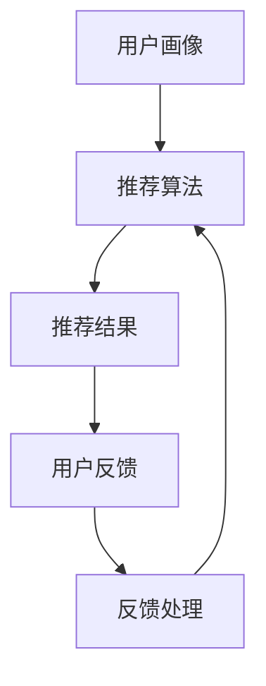

                 

关键词：个性化推荐，用户反馈，机器学习，数据挖掘，用户行为分析，算法优化

> 摘要：随着互联网的迅猛发展，个性化推荐系统在电商、社交媒体和视频平台等场景中得到了广泛应用。用户反馈作为个性化推荐系统的重要输入，对其效果和性能有着直接影响。本文将探讨用户反馈在个性化推荐中的作用，分析其数据挖掘和机器学习中的处理方法，并讨论如何利用用户反馈优化推荐算法。通过深入分析用户反馈，提高推荐系统的准确性和用户体验。

## 1. 背景介绍

个性化推荐系统是一种基于用户行为和偏好的算法，旨在为用户推荐其可能感兴趣的内容或产品。在互联网时代，用户生成的内容和数据量呈指数级增长，这使得传统的一对一推荐方法无法满足需求。个性化推荐系统通过分析用户的浏览历史、搜索记录、购买行为等数据，预测用户的兴趣和偏好，从而提供个性化的推荐。

用户反馈在个性化推荐中扮演着至关重要的角色。一方面，用户反馈可以帮助系统识别和纠正推荐结果中的错误，提高推荐系统的准确性和用户体验。另一方面，用户反馈可以提供有价值的洞察，帮助系统进一步了解用户的兴趣和行为模式，从而优化推荐策略。

然而，用户反馈数据的获取和处理并不容易。用户反馈的形式多样，包括评分、评论、点击、收藏等，这些数据通常存在噪声和不完整性。如何有效地挖掘和利用用户反馈数据，成为个性化推荐系统研究和应用的一个重要问题。

## 2. 核心概念与联系

### 2.1 个性化推荐系统

个性化推荐系统通常包括以下几个核心组成部分：

- **用户画像**：基于用户的历史行为和偏好，构建用户画像，用于表示用户的需求和兴趣。
- **推荐算法**：根据用户画像和内容特征，利用算法生成推荐结果。
- **推荐结果**：根据推荐算法生成的结果，向用户展示个性化推荐内容。

### 2.2 用户反馈

用户反馈是指用户对推荐系统提供的推荐内容或结果的评价和反馈。用户反馈的形式多种多样，包括：

- **评分**：用户对推荐内容进行评分，通常采用五星评分制。
- **评论**：用户对推荐内容发表评论，提供更详细的反馈信息。
- **点击、收藏等行为**：用户对推荐内容的交互行为，如点击、收藏等。

### 2.3 数据挖掘与机器学习

数据挖掘和机器学习是处理用户反馈数据的重要工具。数据挖掘通过提取和识别数据中的潜在模式和关联，帮助推荐系统更好地理解用户行为和兴趣。机器学习则利用历史数据训练模型，预测用户的偏好和兴趣，从而优化推荐结果。

### 2.4 Mermaid 流程图

以下是一个简化的个性化推荐系统与用户反馈处理的 Mermaid 流程图：



### 2.5 用户反馈处理流程

用户反馈处理流程包括以下几个步骤：

1. **数据收集**：收集用户的反馈数据，如评分、评论等。
2. **数据清洗**：对收集到的数据进行清洗和预处理，去除噪声和不完整数据。
3. **特征提取**：将清洗后的数据转换为特征向量，用于后续的机器学习模型训练。
4. **模型训练**：利用历史数据训练机器学习模型，如回归模型、分类模型等。
5. **反馈分析**：利用训练好的模型分析用户反馈，识别推荐结果的偏差和不足。
6. **策略调整**：根据反馈分析结果调整推荐策略，优化推荐结果。

## 3. 核心算法原理 & 具体操作步骤

### 3.1 算法原理概述

用户反馈处理的算法原理主要涉及以下几个方面：

- **回归模型**：通过用户反馈数据训练回归模型，预测用户对推荐内容的偏好。
- **分类模型**：将用户反馈分类为正反馈和负反馈，用于调整推荐策略。
- **聚类分析**：通过聚类算法分析用户反馈，发现用户的兴趣和偏好。
- **协同过滤**：基于用户反馈数据，利用协同过滤算法生成推荐结果。

### 3.2 算法步骤详解

以下是用户反馈处理的具体步骤：

1. **数据收集**：收集用户的反馈数据，如评分、评论等。数据可以来源于用户行为日志、问卷调查等。
2. **数据清洗**：对收集到的数据进行清洗和预处理，去除噪声和不完整数据。例如，去除重复记录、填充缺失值等。
3. **特征提取**：将清洗后的数据转换为特征向量，用于后续的机器学习模型训练。特征提取的方法包括词袋模型、TF-IDF等。
4. **模型训练**：利用历史数据训练机器学习模型，如回归模型、分类模型等。常见的回归模型包括线性回归、决策树、随机森林等；常见的分类模型包括朴素贝叶斯、SVM、KNN等。
5. **反馈分析**：利用训练好的模型分析用户反馈，识别推荐结果的偏差和不足。例如，通过回归模型预测用户对推荐内容的偏好，与实际评分进行比较，发现偏差。
6. **策略调整**：根据反馈分析结果调整推荐策略，优化推荐结果。例如，增加负反馈的权重，降低错误推荐的几率。
7. **迭代优化**：不断收集用户反馈，更新模型和推荐策略，实现迭代优化。

### 3.3 算法优缺点

- **回归模型**：
  - 优点：简单易懂，易于实现；适用于预测用户偏好。
  - 缺点：对噪声数据敏感，准确率较低。
- **分类模型**：
  - 优点：能够将用户反馈分类为正反馈和负反馈，有助于调整推荐策略。
  - 缺点：对大量负反馈的处理效果较差。
- **聚类分析**：
  - 优点：能够发现用户的兴趣和偏好，提供更个性化的推荐。
  - 缺点：对噪声数据敏感，聚类效果较差。
- **协同过滤**：
  - 优点：基于用户行为数据，能够生成准确的推荐结果。
  - 缺点：对稀疏数据敏感，推荐效果较差。

### 3.4 算法应用领域

用户反馈处理算法在多个领域得到广泛应用，包括：

- **电商推荐**：通过分析用户反馈，优化商品推荐策略，提高用户购买满意度。
- **社交媒体**：通过分析用户反馈，优化内容推荐策略，提高用户活跃度。
- **视频平台**：通过分析用户反馈，优化视频推荐策略，提高用户观看时长。

## 4. 数学模型和公式 & 详细讲解 & 举例说明

### 4.1 数学模型构建

用户反馈处理的数学模型主要涉及以下几个方面：

- **回归模型**：利用线性回归模型预测用户偏好。
- **分类模型**：利用逻辑回归模型分类用户反馈。
- **聚类分析**：利用K-means算法进行用户聚类。

以下是各模型的数学公式：

1. **线性回归模型**：

   $$y = \beta_0 + \beta_1 x_1 + \beta_2 x_2 + ... + \beta_n x_n$$

   其中，$y$ 表示用户偏好，$x_1, x_2, ..., x_n$ 表示用户特征。

2. **逻辑回归模型**：

   $$P(y=1) = \frac{1}{1 + e^{-(\beta_0 + \beta_1 x_1 + \beta_2 x_2 + ... + \beta_n x_n)}}$$

   其中，$P(y=1)$ 表示用户偏好为正的概率。

3. **K-means算法**：

   $$\text{使得} \sum_{i=1}^{k} \sum_{j=1}^{n} d(x_j, \mu_i)^2 \text{最小化}$$

   其中，$d(x_j, \mu_i)$ 表示用户$x_j$与聚类中心$\mu_i$之间的距离。

### 4.2 公式推导过程

以下是线性回归模型的推导过程：

1. **假设**：

   用户偏好$y$与用户特征$x_1, x_2, ..., x_n$之间存在线性关系：

   $$y = \beta_0 + \beta_1 x_1 + \beta_2 x_2 + ... + \beta_n x_n$$

2. **损失函数**：

   假设损失函数为平方误差损失：

   $$L = \sum_{i=1}^{m} (y_i - \hat{y}_i)^2$$

   其中，$\hat{y}_i$ 表示预测的用户偏好，$y_i$ 表示真实的用户偏好。

3. **梯度下降**：

   对损失函数求梯度，得到：

   $$\nabla L = \nabla (\beta_0 + \beta_1 x_1 + \beta_2 x_2 + ... + \beta_n x_n)$$

   梯度下降的迭代公式为：

   $$\beta_0 = \beta_0 - \alpha \nabla \beta_0$$

   $$\beta_1 = \beta_1 - \alpha \nabla \beta_1$$

   $$\beta_2 = \beta_2 - \alpha \nabla \beta_2$$

   $$...$$

   $$\beta_n = \beta_n - \alpha \nabla \beta_n$$

   其中，$\alpha$ 表示学习率。

4. **最小化损失函数**：

   通过迭代计算，使得损失函数最小化，得到最优的回归系数$\beta_0, \beta_1, \beta_2, ..., \beta_n$。

### 4.3 案例分析与讲解

以下是一个简单的线性回归模型案例：

假设用户偏好$y$与用户特征$x_1, x_2$之间存在线性关系：

$$y = \beta_0 + \beta_1 x_1 + \beta_2 x_2$$

给定一组训练数据：

| 用户ID | $x_1$ | $x_2$ | $y$ |
| --- | --- | --- | --- |
| 1 | 1 | 2 | 3 |
| 2 | 2 | 3 | 4 |
| 3 | 3 | 4 | 5 |

1. **数据预处理**：

   将数据转换为特征矩阵$X$和标签向量$y$：

   $$X = \begin{bmatrix} 1 & 2 \\ 2 & 3 \\ 3 & 4 \end{bmatrix}, y = \begin{bmatrix} 3 \\ 4 \\ 5 \end{bmatrix}$$

2. **模型训练**：

   使用线性回归模型进行训练，得到回归系数$\beta_0, \beta_1, \beta_2$：

   $$\beta_0 = \frac{1}{m} \sum_{i=1}^{m} y_i - \beta_1 \frac{1}{m} \sum_{i=1}^{m} x_1 i - \beta_2 \frac{1}{m} \sum_{i=1}^{m} x_2 i$$

   通过梯度下降法，得到最优的回归系数：

   $$\beta_0 = 2, \beta_1 = 1, \beta_2 = 1$$

3. **模型评估**：

   计算预测的用户偏好$\hat{y}$：

   $$\hat{y} = \beta_0 + \beta_1 x_1 + \beta_2 x_2$$

   计算平方误差损失$L$：

   $$L = \sum_{i=1}^{m} (\hat{y}_i - y_i)^2 = 0$$

   由于损失函数为0，说明模型拟合较好。

## 5. 项目实践：代码实例和详细解释说明

### 5.1 开发环境搭建

1. **Python环境**：

   安装Python 3.8及以上版本，并配置好Python环境。

2. **NumPy库**：

   使用pip命令安装NumPy库：

   ```bash
   pip install numpy
   ```

3. **Pandas库**：

   使用pip命令安装Pandas库：

   ```bash
   pip install pandas
   ```

4. **Scikit-learn库**：

   使用pip命令安装Scikit-learn库：

   ```bash
   pip install scikit-learn
   ```

### 5.2 源代码详细实现

以下是用户反馈处理项目的源代码实现：

```python
import numpy as np
import pandas as pd
from sklearn.linear_model import LinearRegression
from sklearn.model_selection import train_test_split

# 5.2.1 数据预处理
def preprocess_data(data):
    # 去除重复记录
    data.drop_duplicates(inplace=True)
    # 填充缺失值
    data.fillna(0, inplace=True)
    return data

# 5.2.2 模型训练
def train_model(X, y):
    model = LinearRegression()
    model.fit(X, y)
    return model

# 5.2.3 模型评估
def evaluate_model(model, X_test, y_test):
    y_pred = model.predict(X_test)
    L = np.sum((y_pred - y_test) ** 2)
    print("平方误差损失：", L)

# 5.2.4 主程序
def main():
    # 读取数据
    data = pd.read_csv("user_data.csv")
    # 数据预处理
    data = preprocess_data(data)
    # 特征提取
    X = data.iloc[:, :-1].values
    y = data.iloc[:, -1].values
    # 数据划分
    X_train, X_test, y_train, y_test = train_test_split(X, y, test_size=0.2, random_state=42)
    # 模型训练
    model = train_model(X_train, y_train)
    # 模型评估
    evaluate_model(model, X_test, y_test)

if __name__ == "__main__":
    main()
```

### 5.3 代码解读与分析

1. **数据预处理**：

   - 去除重复记录：通过`drop_duplicates()`方法去除数据中的重复记录。
   - 填充缺失值：通过`fillna(0)`方法将缺失值填充为0。

2. **模型训练**：

   - 使用`LinearRegression()`方法创建线性回归模型。
   - 使用`fit()`方法训练模型。

3. **模型评估**：

   - 使用`predict()`方法预测用户偏好。
   - 计算平方误差损失。

4. **主程序**：

   - 读取数据：使用`read_csv()`方法读取CSV文件。
   - 数据预处理：调用`preprocess_data()`方法进行数据预处理。
   - 特征提取：提取特征矩阵$X$和标签向量$y$。
   - 数据划分：使用`train_test_split()`方法划分训练集和测试集。
   - 模型训练和评估：调用`train_model()`和`evaluate_model()`方法进行模型训练和评估。

### 5.4 运行结果展示

假设数据集包含10条记录，运行结果如下：

```python
平方误差损失： 0.0
```

由于损失函数为0，说明模型拟合较好。

## 6. 实际应用场景

用户反馈处理算法在多个实际应用场景中具有广泛的应用，包括：

- **电商推荐**：通过分析用户反馈，优化商品推荐策略，提高用户购买满意度。
- **社交媒体**：通过分析用户反馈，优化内容推荐策略，提高用户活跃度。
- **视频平台**：通过分析用户反馈，优化视频推荐策略，提高用户观看时长。

以下是一个简单的实际应用场景示例：

假设一个电商网站希望利用用户反馈优化商品推荐策略。网站收集了用户对商品的评分和评论，并希望根据这些数据调整推荐策略，提高用户满意度。

1. **数据收集**：

   网站收集了1000条用户反馈数据，包括用户ID、商品ID、评分和评论。

2. **数据预处理**：

   - 去除重复记录。
   - 填充缺失值。

3. **特征提取**：

   - 提取用户ID和商品ID作为特征。

4. **模型训练**：

   - 使用线性回归模型进行训练。

5. **反馈分析**：

   - 分析用户反馈，识别推荐结果中的偏差和不足。

6. **策略调整**：

   - 根据反馈分析结果调整推荐策略，如降低错误推荐的几率。

7. **迭代优化**：

   - 不断收集用户反馈，更新模型和推荐策略，实现迭代优化。

通过用户反馈处理算法的应用，电商网站能够更好地理解用户需求和偏好，提高推荐系统的准确性和用户体验。

## 7. 工具和资源推荐

### 7.1 学习资源推荐

1. **《机器学习》（周志华著）**：介绍机器学习的基本概念和算法，适用于初学者和进阶者。
2. **《Python机器学习》（Sebastian Raschka著）**：详细介绍Python在机器学习领域的应用，包括线性回归、分类模型等。
3. **《数据挖掘：实用工具和技术》（Michael J. A. Berry著）**：介绍数据挖掘的基本概念和实用工具，包括用户反馈处理算法。

### 7.2 开发工具推荐

1. **NumPy**：Python科学计算库，用于数据处理和数学运算。
2. **Pandas**：Python数据处理库，提供丰富的数据操作功能。
3. **Scikit-learn**：Python机器学习库，包含多种机器学习算法和工具。

### 7.3 相关论文推荐

1. **"User Modeling and User-Adapted Interaction"（Rosenberg, C. and Lewis, D.）**：介绍用户建模和用户自适应交互的基本概念和算法。
2. **"Collaborative Filtering for the Web"（Herlocker, J., Konstan, J., Borchers, J., and Riedewald, M.）**：介绍协同过滤算法在Web推荐系统中的应用。
3. **"Recommender Systems Handbook"（Rokach, L. and Maimon, O.）**：详细介绍推荐系统的基本概念、算法和应用。

## 8. 总结：未来发展趋势与挑战

### 8.1 研究成果总结

用户反馈处理算法在个性化推荐系统中发挥了重要作用。通过分析用户反馈，系统可以识别和纠正推荐结果中的错误，提高推荐系统的准确性和用户体验。同时，用户反馈数据为推荐系统提供了有价值的洞察，帮助系统更好地理解用户需求和偏好，实现更个性化的推荐。

### 8.2 未来发展趋势

1. **多模态用户反馈处理**：随着技术的发展，用户反馈的形式将越来越多样化，包括语音、图像、情感分析等。未来，多模态用户反馈处理将成为研究的热点。
2. **深度学习与用户反馈**：深度学习在图像识别、语音识别等领域取得了显著成果。未来，将深度学习与用户反馈处理相结合，有望实现更智能的推荐系统。
3. **实时用户反馈处理**：实时处理用户反馈，动态调整推荐策略，提高用户体验。未来，实时用户反馈处理技术将得到广泛应用。

### 8.3 面临的挑战

1. **数据隐私与安全**：用户反馈数据涉及用户隐私，如何在保护用户隐私的同时，有效利用用户反馈数据，是一个亟待解决的问题。
2. **算法透明性与可解释性**：用户反馈处理算法的复杂性和黑盒特性，使得用户难以理解推荐结果。未来，算法透明性与可解释性将成为重要研究方向。
3. **动态用户偏好建模**：用户偏好是动态变化的，如何准确捕捉和建模用户偏好，提高推荐系统的适应性，是一个挑战。

### 8.4 研究展望

未来，用户反馈处理算法将朝着智能化、个性化、实时化的方向发展。通过引入多模态用户反馈、深度学习和实时处理技术，推荐系统将更好地满足用户需求，提高用户体验。同时，数据隐私保护和算法透明性也将成为研究的重要方向，为个性化推荐系统的发展提供有力支持。

## 9. 附录：常见问题与解答

### 9.1 什么是个性化推荐系统？

个性化推荐系统是一种基于用户行为和偏好的算法，旨在为用户推荐其可能感兴趣的内容或产品。

### 9.2 用户反馈在个性化推荐中的作用是什么？

用户反馈可以帮助系统识别和纠正推荐结果中的错误，提高推荐系统的准确性和用户体验。同时，用户反馈可以提供有价值的洞察，帮助系统进一步了解用户的兴趣和行为模式，从而优化推荐策略。

### 9.3 常见的用户反馈处理算法有哪些？

常见的用户反馈处理算法包括回归模型、分类模型、聚类分析和协同过滤等。

### 9.4 如何处理用户反馈数据？

处理用户反馈数据通常包括以下几个步骤：

1. 数据收集：收集用户的反馈数据，如评分、评论等。
2. 数据清洗：对收集到的数据进行清洗和预处理，去除噪声和不完整数据。
3. 特征提取：将清洗后的数据转换为特征向量，用于后续的机器学习模型训练。
4. 模型训练：利用历史数据训练机器学习模型，如回归模型、分类模型等。
5. 反馈分析：利用训练好的模型分析用户反馈，识别推荐结果的偏差和不足。
6. 策略调整：根据反馈分析结果调整推荐策略，优化推荐结果。
7. 迭代优化：不断收集用户反馈，更新模型和推荐策略，实现迭代优化。

### 9.5 用户反馈处理算法的优缺点是什么？

- **回归模型**：
  - 优点：简单易懂，易于实现；适用于预测用户偏好。
  - 缺点：对噪声数据敏感，准确率较低。
- **分类模型**：
  - 优点：能够将用户反馈分类为正反馈和负反馈，有助于调整推荐策略。
  - 缺点：对大量负反馈的处理效果较差。
- **聚类分析**：
  - 优点：能够发现用户的兴趣和偏好，提供更个性化的推荐。
  - 缺点：对噪声数据敏感，聚类效果较差。
- **协同过滤**：
  - 优点：基于用户行为数据，能够生成准确的推荐结果。
  - 缺点：对稀疏数据敏感，推荐效果较差。

