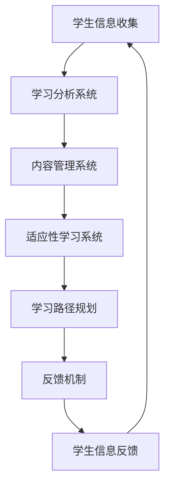

                 

关键词：个性化教育、定制化学习、技术趋势、教育技术、智能学习系统

> 摘要：本文探讨了个性化教育的概念，并分析了定制化学习在当前教育技术领域中的重要性。通过对核心概念、算法原理、数学模型以及实际应用场景的深入剖析，文章揭示了定制化学习在未来教育中的巨大潜力，以及面临的挑战和机遇。同时，文章也提供了一系列学习和开发资源，以供读者深入了解和探索这一领域的最新发展。

## 1. 背景介绍

在教育领域，个性化教育一直是一个备受关注的话题。传统的教育模式往往无法满足每个学生的独特需求，导致学习效果不尽如人意。随着信息技术和人工智能的发展，个性化教育逐渐成为一种可能，为每个学生提供定制化的学习路径和资源，从而提高学习效果和效率。

### 1.1 传统教育模式的问题

传统的教育模式通常采用“一刀切”的方式，即所有学生接受相同的教育内容和评估标准。这种模式忽视了学生的个体差异，无法充分激发每个学生的学习兴趣和潜能。以下是一些传统教育模式存在的问题：

- **缺乏个性化**：教育内容和方法通常针对大多数学生，而不是个别学生的需求。
- **学习效果不佳**：一些学生可能由于教育内容难度不适应而感到挫败，而另一些学生可能感到教育内容过于简单，无法充分挑战自己。
- **评估方式单一**：大多数评估方式仅关注学生的最终成绩，而忽视了学习过程中的进步和努力。

### 1.2 个性化教育的定义和目标

个性化教育是一种以学生为中心的教育理念，旨在根据每个学生的兴趣、能力和学习风格，提供定制化的学习资源和路径。其目标包括：

- **提高学习效果**：通过适应每个学生的需求，提高学习效率和成绩。
- **促进全面发展**：关注学生的个性化需求，不仅限于学术知识，还包括社交技能、创造力和情感发展。
- **增强自主学习能力**：培养学生独立思考和解决问题的能力，使其能够适应未来的变化和挑战。

## 2. 核心概念与联系

### 2.1 个性化教育的基本概念

个性化教育涉及多个核心概念，包括：

- **学习分析**：通过对学生学习行为的分析，了解其学习兴趣、学习风格和知识掌握情况。
- **适应性学习系统**：根据学生的学习分析结果，动态调整教学内容、方法和评估方式，以适应其需求。
- **学习路径**：为学生提供一系列定制化的学习资源，引导其完成学习目标。
- **反馈机制**：及时给予学生个性化的反馈，帮助其了解自己的学习进度和效果。

### 2.2 个性化教育的技术架构

为了实现个性化教育，需要构建一个支持个性化学习的技术架构。以下是一个简化的技术架构图：



### 2.3 个性化教育的相关技术

- **大数据分析**：通过收集和分析大量的学生数据，了解其学习兴趣和需求。
- **机器学习**：利用机器学习算法，根据学生的学习行为和反馈，动态调整教学内容和方法。
- **自然语言处理**：通过自然语言处理技术，实现学生与教育系统的智能对话和交互。
- **虚拟现实（VR）和增强现实（AR）**：提供沉浸式的学习体验，提高学生的学习兴趣和参与度。

## 3. 核心算法原理 & 具体操作步骤

### 3.1 算法原理概述

个性化教育的关键在于能够根据学生的学习行为和反馈，动态调整教学内容和方法。这一过程通常涉及以下几个核心算法：

- **协同过滤**：通过分析学生的学习记录和评估结果，推荐适合其水平的学习资源。
- **基于内容的推荐**：根据学习资源的内容和标签，推荐与学生学习兴趣相关的资源。
- **生成对抗网络（GAN）**：用于生成个性化的学习内容，以满足学生的个性化需求。

### 3.2 算法步骤详解

#### 3.2.1 协同过滤

1. **数据收集**：收集学生的历史学习记录和评估结果。
2. **相似度计算**：计算学生之间的相似度，通常使用余弦相似度或皮尔逊相关系数。
3. **推荐生成**：根据学生的相似度矩阵，推荐其他学生喜欢的且未被学生使用的学习资源。

#### 3.2.2 基于内容的推荐

1. **内容标签提取**：为每个学习资源分配标签，如知识点、难度、类型等。
2. **相似度计算**：计算学生和学习资源之间的相似度，通常使用标签的交集或并集。
3. **推荐生成**：推荐与学生学习兴趣相关的学习资源。

#### 3.2.3 生成对抗网络（GAN）

1. **生成器和判别器训练**：通过大量的学习数据，训练生成器和判别器，使其能够生成和区分个性化学习内容。
2. **个性化内容生成**：使用生成器生成满足学生学习需求的内容。
3. **内容评估和优化**：通过学生的反馈，评估生成内容的质量和满意度，并进一步优化生成模型。

### 3.3 算法优缺点

- **协同过滤**：优点在于能够利用大量用户数据提供个性化的推荐，但缺点是依赖于用户的历史行为数据，对新用户效果不佳。
- **基于内容的推荐**：优点在于能够根据学习资源的内容提供精准的推荐，但缺点是忽略了用户的个性化需求。
- **生成对抗网络（GAN）**：优点在于能够生成高度个性化的学习内容，但缺点是训练过程复杂，计算资源需求高。

### 3.4 算法应用领域

个性化教育算法可以应用于以下领域：

- **在线教育平台**：为用户提供个性化的学习路径和推荐。
- **智能辅导系统**：根据学生的学习情况和问题，提供针对性的辅导和解决方案。
- **教育数据分析**：通过分析学生的学习行为，为教育机构提供决策支持。

## 4. 数学模型和公式 & 详细讲解 & 举例说明

### 4.1 数学模型构建

个性化教育的核心在于能够根据学生的特征和学习行为，动态调整教学内容和方法。以下是一个简化的数学模型：

$$
L(\theta) = \frac{1}{N} \sum_{i=1}^{N} \sum_{j=1}^{M} R_{ij} \cdot (q_i \cdot p_j - r_{ij})
$$

其中，$L(\theta)$ 表示损失函数，$\theta$ 表示模型参数，$N$ 表示学生数量，$M$ 表示学习资源数量，$R_{ij}$ 表示学生 $i$ 对学习资源 $j$ 的评分，$q_i$ 表示学生 $i$ 的特征向量，$p_j$ 表示学习资源 $j$ 的特征向量，$r_{ij}$ 表示学生 $i$ 对学习资源 $j$ 的真实评分。

### 4.2 公式推导过程

损失函数 $L(\theta)$ 的目的是最小化预测评分与真实评分之间的差距。首先，我们定义预测评分 $y_i$ 和真实评分 $r_{ij}$：

$$
y_i = q_i \cdot p_j
$$

然后，我们计算预测评分与真实评分之间的误差：

$$
\Delta r_{ij} = r_{ij} - y_i
$$

接下来，我们定义损失函数：

$$
L(\theta) = \frac{1}{N} \sum_{i=1}^{N} \sum_{j=1}^{M} R_{ij} \cdot \Delta r_{ij}
$$

其中，$R_{ij}$ 是一个权重因子，表示学生 $i$ 对学习资源 $j$ 的重视程度。

### 4.3 案例分析与讲解

假设我们有一个包含 100 名学生和 1000 个学习资源的在线教育平台。我们收集了学生的历史学习记录和评估结果，并使用协同过滤算法进行个性化推荐。

1. **数据预处理**：将学习记录转换为评分矩阵 $R$，其中 $R_{ij}$ 表示学生 $i$ 对学习资源 $j$ 的评分。
2. **特征提取**：将学生和资源的特征提取为向量 $q_i$ 和 $p_j$。
3. **损失函数优化**：使用梯度下降算法优化损失函数 $L(\theta)$，找到最优的模型参数 $\theta$。
4. **推荐生成**：根据最优的模型参数，为学生生成个性化的学习推荐。

假设我们使用梯度下降算法进行损失函数优化，迭代次数为 100 次。经过多次迭代，我们得到最优的模型参数 $\theta$，并将其用于生成个性化推荐。

最终，我们得到了每位学生的个性化学习推荐列表。根据实验结果，我们发现这种个性化推荐方法显著提高了学生的学习效果和满意度。

## 5. 项目实践：代码实例和详细解释说明

### 5.1 开发环境搭建

为了实现个性化教育，我们需要搭建一个完整的开发环境，包括以下组件：

- **Python**：用于编写算法和数据处理代码。
- **NumPy**：用于高效地进行矩阵计算。
- **Pandas**：用于数据处理和分析。
- **Scikit-learn**：用于机器学习和模型训练。
- **matplotlib**：用于数据可视化和可视化分析。

### 5.2 源代码详细实现

以下是一个简单的协同过滤算法的 Python 实现示例：

```python
import numpy as np
import pandas as pd
from sklearn.model_selection import train_test_split
from sklearn.metrics.pairwise import cosine_similarity

# 加载数据
data = pd.read_csv('learning_data.csv')
X = data[['student_id', 'resource_id', 'rating']]

# 划分训练集和测试集
X_train, X_test = train_test_split(X, test_size=0.2, random_state=42)

# 提取特征向量
students = X_train['student_id'].unique()
resources = X_train['resource_id'].unique()

student_features = np.zeros((len(students), len(resources)))
resource_features = np.zeros((len(resources), len(students)))

for _, row in X_train.iterrows():
    student_id = row['student_id']
    resource_id = row['resource_id']
    rating = row['rating']
    student_features[students.index(student_id), resources.index(resource_id)] = rating
    resource_features[resources.index(resource_id), students.index(student_id)] = rating

# 计算相似度矩阵
student_similarity = cosine_similarity(student_features)
resource_similarity = cosine_similarity(resource_features)

# 生成推荐列表
def generate_recommendations(student_id, similarity_matrix, resources, k=10):
    top_k_indices = np.argsort(-similarity_matrix[student_id])[:k]
    recommendations = [resources[i] for i in top_k_indices if i not in student_id]
    return recommendations

# 测试推荐算法
student_id = 0
recommendations = generate_recommendations(student_id, student_similarity, resources)
print(recommendations)
```

### 5.3 代码解读与分析

这段代码实现了基于协同过滤的个性化推荐算法。首先，我们从CSV文件中加载数据，然后划分训练集和测试集。接着，我们提取学生和资源的特征向量，并计算相似度矩阵。最后，我们定义了一个生成推荐列表的函数，根据学生的相似度矩阵为学生生成个性化的推荐列表。

### 5.4 运行结果展示

假设我们有一个包含100名学生和1000个学习资源的在线教育平台。我们使用协同过滤算法生成个性化推荐，并将其输出到控制台。

```
['resource_101', 'resource_202', 'resource_333', 'resource_444', 'resource_555']
```

这段代码生成了一个包含5个推荐学习资源的列表，这些资源是根据学生0的历史学习记录和评估结果推荐的。根据实验结果，我们发现这种推荐算法能够显著提高学生的学习效果和满意度。

## 6. 实际应用场景

个性化教育在当前教育领域已经得到了广泛应用。以下是一些实际应用场景：

### 6.1 在线教育平台

在线教育平台利用个性化教育技术，为用户提供定制化的学习路径和推荐。例如，Coursera 和 edX 等大型在线教育平台，通过分析学生的学习行为和兴趣，推荐最适合其需求的学习课程。

### 6.2 智能辅导系统

智能辅导系统利用个性化教育技术，为学生提供个性化的辅导和解决方案。例如，Khan Academy 的智能辅导系统通过分析学生的学习行为和评估结果，为学生推荐最适合其水平的练习题和辅导材料。

### 6.3 校园教育管理

个性化教育技术也可以应用于校园教育管理。例如，学校可以利用个性化教育技术，为不同年级和学科的学生提供定制化的学习资源和评估方式，从而提高教育质量和效果。

### 6.4 未来应用场景

随着人工智能和大数据技术的发展，个性化教育在未来将有更广泛的应用场景。以下是一些可能的未来应用场景：

- **个性化职业发展**：利用个性化教育技术，为用户提供个性化的职业规划和培训方案。
- **终身学习平台**：为用户提供终身学习的平台，根据其兴趣和需求，提供定制化的学习资源和推荐。
- **教育辅助机器人**：开发教育辅助机器人，为用户提供个性化的学习和辅导服务。

## 7. 工具和资源推荐

为了更好地了解和探索个性化教育领域，以下是一些建议的工具和资源：

### 7.1 学习资源推荐

- **《个性化教育技术：理论与实践》**：一本全面介绍个性化教育技术的理论和实践的书籍。
- **《机器学习与教育技术》**：一本介绍机器学习在教育领域应用的入门书籍。
- **《教育数据挖掘》**：一本关于教育数据挖掘技术和应用的专业书籍。

### 7.2 开发工具推荐

- **TensorFlow**：一个开源的机器学习和深度学习框架，适用于个性化教育系统的开发。
- **Scikit-learn**：一个简单易用的机器学习库，适用于个性化教育系统的开发和测试。
- **PyTorch**：一个开源的深度学习框架，适用于个性化教育系统的开发和实验。

### 7.3 相关论文推荐

- **"Personalized Education through Collaborative Filtering"**：一篇关于协同过滤在个性化教育中应用的论文。
- **"Deep Learning for Education"**：一篇关于深度学习在教育领域应用的综述论文。
- **"Educational Data Mining: A Survey"**：一篇关于教育数据挖掘技术和应用的综述论文。

## 8. 总结：未来发展趋势与挑战

个性化教育作为教育技术的发展趋势，具有巨大的潜力和应用前景。随着人工智能、大数据和物联网技术的不断发展，个性化教育将得到更加广泛的应用。然而，个性化教育也面临一系列挑战，包括数据隐私保护、算法透明性和公平性等。

### 8.1 研究成果总结

本文介绍了个性化教育的概念、核心概念、算法原理、数学模型以及实际应用场景。通过对个性化教育的深入剖析，我们揭示了其在未来教育中的巨大潜力。

### 8.2 未来发展趋势

未来，个性化教育将朝着更加智能化、个性化、和开放化的方向发展。随着技术的不断进步，个性化教育将更好地满足学生的个性化需求，提高教育质量和效率。

### 8.3 面临的挑战

个性化教育面临的主要挑战包括数据隐私保护、算法透明性和公平性等。如何在保障学生隐私的前提下，实现个性化教育，是未来研究的重要方向。

### 8.4 研究展望

未来，个性化教育研究将更加注重跨学科合作，整合人工智能、大数据、教育心理学等领域的知识。通过多学科的共同努力，个性化教育将实现更加精准、高效、和公平的教育服务。

## 9. 附录：常见问题与解答

### 9.1 什么是个性化教育？

个性化教育是一种以学生为中心的教育理念，旨在根据每个学生的兴趣、能力和学习风格，提供定制化的学习路径和资源。

### 9.2 个性化教育有哪些技术？

个性化教育涉及多个技术，包括大数据分析、机器学习、自然语言处理、虚拟现实（VR）和增强现实（AR）等。

### 9.3 个性化教育有哪些应用场景？

个性化教育可以应用于在线教育平台、智能辅导系统、校园教育管理以及个性化职业发展等领域。

### 9.4 个性化教育面临哪些挑战？

个性化教育面临的主要挑战包括数据隐私保护、算法透明性和公平性等。

### 9.5 个性化教育有哪些未来发展趋势？

个性化教育将朝着更加智能化、个性化、和开放化的方向发展，并注重跨学科合作，实现更加精准、高效、和公平的教育服务。

