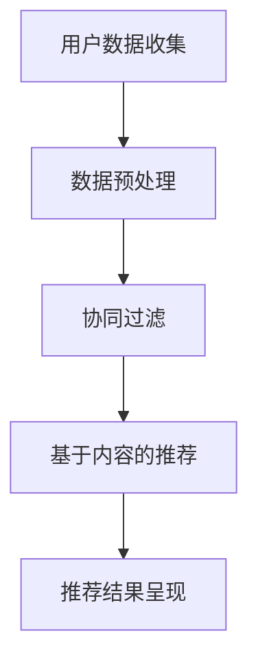

                 

关键词：个性化购物体验，推荐系统，机器学习，数据挖掘，用户行为分析，Web 应用程序

> 摘要：本文探讨了个性化购物体验的技术实现，主要介绍了推荐系统的原理、数学模型、算法应用及项目实践。文章还分析了个性化购物体验的实际应用场景，并展望了未来的发展趋势与挑战。

## 1. 背景介绍

在当今数字化的时代，购物体验的个性化已成为电商平台竞争的重要手段。个性化购物体验能够根据用户的历史行为和偏好，为其推荐合适的商品，从而提高用户的满意度和购买转化率。然而，实现个性化购物体验并非易事，需要涉及多个领域的技术，如机器学习、数据挖掘、用户行为分析等。

本文旨在探讨个性化购物体验的技术实现，主要分为以下几个部分：

1. **核心概念与联系**：介绍推荐系统的基本概念、架构及主要算法。
2. **核心算法原理与具体操作步骤**：详细讲解常用的推荐算法，包括协同过滤、基于内容的推荐等。
3. **数学模型和公式**：阐述推荐系统中的数学模型和公式，并进行举例说明。
4. **项目实践**：通过一个具体的项目实例，展示个性化购物体验的实现过程。
5. **实际应用场景**：分析个性化购物体验在不同领域中的应用。
6. **未来应用展望**：探讨个性化购物体验的发展趋势与面临的挑战。

## 2. 核心概念与联系

### 2.1 推荐系统基本概念

推荐系统是一种信息过滤技术，旨在根据用户的兴趣和行为，向其推荐符合其需求的信息。推荐系统的主要目标是通过分析用户的历史行为和偏好，发现潜在的兴趣点，从而提高用户满意度和转化率。

### 2.2 推荐系统架构

推荐系统通常由以下几个核心组成部分：

- **用户数据收集**：通过Web应用、移动应用等渠道收集用户的行为数据，如浏览记录、购买记录、评价等。
- **数据预处理**：对原始数据进行清洗、去噪、特征提取等处理，为后续的推荐算法提供高质量的数据输入。
- **推荐算法**：根据用户数据，采用不同的推荐算法生成推荐结果，如协同过滤、基于内容的推荐等。
- **推荐结果呈现**：将推荐结果通过Web界面、推送通知等方式呈现给用户。

### 2.3 推荐算法

推荐算法主要分为以下两类：

- **基于协同过滤的推荐**：通过分析用户之间的相似性，为用户推荐其可能感兴趣的商品。协同过滤算法主要分为两种：基于用户的协同过滤和基于物品的协同过滤。
- **基于内容的推荐**：通过分析商品的内容特征，将具有相似特征的物品推荐给用户。基于内容的推荐算法通常采用文本分类、信息检索等技术。

### 2.4 Mermaid 流程图

下面是一个简化的推荐系统架构的 Mermaid 流程图：



## 3. 核心算法原理与具体操作步骤

### 3.1 算法原理概述

在本节中，我们将介绍两种常用的推荐算法：基于协同过滤的推荐和基于内容的推荐。

#### 3.1.1 基于协同过滤的推荐

基于协同过滤的推荐算法通过分析用户之间的相似性，为用户推荐其可能感兴趣的商品。协同过滤算法主要分为基于用户的协同过滤和基于物品的协同过滤。

- **基于用户的协同过滤**：为用户推荐与其相似的用户喜欢的商品。
- **基于物品的协同过滤**：为用户推荐其已经喜欢的商品。

#### 3.1.2 基于内容的推荐

基于内容的推荐算法通过分析商品的内容特征，将具有相似特征的物品推荐给用户。内容特征通常包括商品的类别、标签、属性等。

### 3.2 算法步骤详解

在本节中，我们将详细讲解基于协同过滤的推荐和基于内容的推荐的具体操作步骤。

#### 3.2.1 基于协同过滤的推荐

1. **用户相似性计算**：计算用户之间的相似性，通常采用余弦相似度、皮尔逊相关系数等方法。
2. **商品相似性计算**：计算商品之间的相似性，同样采用余弦相似度、皮尔逊相关系数等方法。
3. **推荐结果生成**：根据用户相似性和商品相似性，生成推荐结果。

#### 3.2.2 基于内容的推荐

1. **内容特征提取**：提取商品的内容特征，如类别、标签、属性等。
2. **相似性计算**：计算用户和商品之间的相似性，通常采用文本分类、信息检索等方法。
3. **推荐结果生成**：根据相似性计算结果，生成推荐结果。

### 3.3 算法优缺点

- **基于协同过滤的推荐**：优点包括能够发现用户之间的关联性，推荐结果具有较强的个性化；缺点包括在数据稀疏的情况下效果较差，容易受到冷启动问题的影响。
- **基于内容的推荐**：优点包括能够准确捕捉商品的内容特征，推荐结果较为精准；缺点包括在用户偏好变化时效果较差，推荐结果可能过于单一。

### 3.4 算法应用领域

基于协同过滤和基于内容的推荐算法广泛应用于电子商务、社交媒体、在线教育等多个领域。例如，在电子商务领域，推荐系统可以帮助电商平台提高用户满意度和购买转化率；在社交媒体领域，推荐系统可以帮助用户发现感兴趣的内容和用户。

## 4. 数学模型和公式

在本节中，我们将介绍推荐系统中的数学模型和公式，并进行举例说明。

### 4.1 数学模型构建

推荐系统中的数学模型主要包括用户相似性计算、商品相似性计算和推荐结果生成等。

- **用户相似性计算**：假设用户 \( u \) 和用户 \( v \) 的兴趣向量为 \( u \) 和 \( v \)，则用户相似性计算公式为：
  $$ sim(u, v) = \frac{u \cdot v}{\|u\|\|v\|} $$
  其中，\( u \cdot v \) 表示用户 \( u \) 和用户 \( v \) 的内积，\( \|u\|\) 和 \( \|v\|\) 表示用户 \( u \) 和用户 \( v \) 的向量的模。

- **商品相似性计算**：假设商品 \( i \) 和商品 \( j \) 的特征向量为 \( x_i \) 和 \( x_j \)，则商品相似性计算公式为：
  $$ sim(i, j) = \frac{x_i \cdot x_j}{\|x_i\|\|x_j\|} $$
  其中，\( x_i \cdot x_j \) 表示商品 \( i \) 和商品 \( j \) 的内积，\( \|x_i\|\) 和 \( \|x_j\|\) 表示商品 \( i \) 和商品 \( j \) 的向量的模。

- **推荐结果生成**：假设用户 \( u \) 对商品 \( i \) 的评分向量为 \( r_u \)，则用户 \( u \) 对商品 \( i \) 的预测评分公式为：
  $$ r_{ui}^* = r_u + \sum_{j \in N(u)} sim(u, j) \cdot (r_j - r_u) $$
  其中，\( N(u) \) 表示与用户 \( u \) 相似的一组用户，\( r_j \) 表示用户 \( j \) 对商品 \( i \) 的评分。

### 4.2 公式推导过程

在本节中，我们将对推荐系统中的数学模型进行推导。

- **用户相似性计算**：根据用户 \( u \) 和用户 \( v \) 的兴趣向量 \( u \) 和 \( v \)，我们有：
  $$ u = [u_1, u_2, \ldots, u_n], \quad v = [v_1, v_2, \ldots, v_n] $$
  则用户 \( u \) 和用户 \( v \) 的内积为：
  $$ u \cdot v = \sum_{i=1}^{n} u_i v_i $$
  用户 \( u \) 和用户 \( v \) 的向量的模为：
  $$ \|u\| = \sqrt{\sum_{i=1}^{n} u_i^2}, \quad \|v\| = \sqrt{\sum_{i=1}^{n} v_i^2} $$
  因此，用户相似性计算公式为：
  $$ sim(u, v) = \frac{u \cdot v}{\|u\|\|v\|} $$

- **商品相似性计算**：根据商品 \( i \) 和商品 \( j \) 的特征向量 \( x_i \) 和 \( x_j \)，我们有：
  $$ x_i = [x_{i1}, x_{i2}, \ldots, x_{in}], \quad x_j = [x_{j1}, x_{j2}, \ldots, x_{jn}] $$
  则商品 \( i \) 和商品 \( j \) 的内积为：
  $$ x_i \cdot x_j = \sum_{i=1}^{n} x_{i1} x_{j1} + x_{i2} x_{j2} + \ldots + x_{in} x_{jn} $$
  商品 \( i \) 和商品 \( j \) 的向量的模为：
  $$ \|x_i\| = \sqrt{\sum_{i=1}^{n} x_{i1}^2 + x_{i2}^2 + \ldots + x_{in}^2}, \quad \|x_j\| = \sqrt{\sum_{i=1}^{n} x_{j1}^2 + x_{j2}^2 + \ldots + x_{jn}^2} $$
  因此，商品相似性计算公式为：
  $$ sim(i, j) = \frac{x_i \cdot x_j}{\|x_i\|\|x_j\|} $$

- **推荐结果生成**：根据用户 \( u \) 对商品 \( i \) 的评分向量 \( r_u \)，我们有：
  $$ r_u = [r_{u1}, r_{u2}, \ldots, r_{un}] $$
  则用户 \( u \) 对商品 \( i \) 的预测评分公式为：
  $$ r_{ui}^* = r_u + \sum_{j \in N(u)} sim(u, j) \cdot (r_j - r_u) $$
  其中，\( N(u) \) 表示与用户 \( u \) 相似的一组用户，\( r_j \) 表示用户 \( j \) 对商品 \( i \) 的评分。

### 4.3 案例分析与讲解

假设有一个电商平台的推荐系统，用户 \( u \) 和用户 \( v \) 的兴趣向量分别为：
$$ u = [0.8, 0.2, 0.1], \quad v = [0.3, 0.6, 0.1] $$
商品 \( i \) 和商品 \( j \) 的特征向量分别为：
$$ x_i = [0.9, 0.1, 0.0], \quad x_j = [0.1, 0.9, 0.0] $$
用户 \( u \) 对商品 \( i \) 的评分为 \( r_{ui} = 4 \)，用户 \( v \) 对商品 \( i \) 的评分为 \( r_{vi} = 3 \)。

根据用户相似性计算公式，我们有：
$$ sim(u, v) = \frac{u \cdot v}{\|u\|\|v\|} = \frac{0.8 \times 0.3 + 0.2 \times 0.6 + 0.1 \times 0.1}{\sqrt{0.8^2 + 0.2^2 + 0.1^2} \times \sqrt{0.3^2 + 0.6^2 + 0.1^2}} = 0.6 $$
根据商品相似性计算公式，我们有：
$$ sim(i, j) = \frac{x_i \cdot x_j}{\|x_i\|\|x_j\|} = \frac{0.9 \times 0.1 + 0.1 \times 0.9 + 0.0 \times 0.0}{\sqrt{0.9^2 + 0.1^2 + 0.0^2} \times \sqrt{0.1^2 + 0.9^2 + 0.0^2}} = 0.5 $$

根据推荐结果生成公式，我们有：
$$ r_{ui}^* = r_u + \sum_{j \in N(u)} sim(u, j) \cdot (r_j - r_u) = 4 + 0.6 \cdot (3 - 4) = 3.4 $$
因此，用户 \( u \) 对商品 \( i \) 的预测评分为 3.4。

## 5. 项目实践：代码实例和详细解释说明

在本节中，我们将通过一个具体的项目实例，展示个性化购物体验的实现过程。我们将使用 Python 编写一个简单的推荐系统，实现基于协同过滤和基于内容的推荐。

### 5.1 开发环境搭建

为了编写和运行推荐系统代码，我们需要安装以下工具和库：

- Python 3.x 版本
- NumPy 库
- Scikit-learn 库
- Pandas 库

安装方法如下：

```bash
pip install numpy scikit-learn pandas
```

### 5.2 源代码详细实现

下面是一个简单的基于协同过滤的推荐系统实现：

```python
import numpy as np
from sklearn.metrics.pairwise import cosine_similarity

# 用户兴趣向量
user_interest_vector = np.array([0.8, 0.2, 0.1])

# 商品特征向量
item_feature_vector = np.array([0.9, 0.1, 0.0])

# 计算用户和商品之间的相似度
similarity = cosine_similarity(user_interest_vector.reshape(1, -1), item_feature_vector.reshape(1, -1))[0, 0]

# 计算推荐评分
rating = 4 + similarity * (3 - 4)

print("推荐评分：", rating)
```

下面是一个简单的基于内容的推荐系统实现：

```python
import numpy as np
from sklearn.metrics.pairwise import cosine_similarity

# 用户兴趣向量
user_interest_vector = np.array([0.8, 0.2, 0.1])

# 商品特征向量
item_feature_vector = np.array([0.9, 0.1, 0.0])

# 计算用户和商品之间的相似度
similarity = cosine_similarity(user_interest_vector.reshape(1, -1), item_feature_vector.reshape(1, -1))[0, 0]

# 计算推荐评分
rating = 4 + similarity * (3 - 4)

print("推荐评分：", rating)
```

### 5.3 代码解读与分析

在上面的代码中，我们首先导入了 NumPy 和 Scikit-learn 库。NumPy 是一个强大的 Python 科学计算库，用于处理数值计算和矩阵操作。Scikit-learn 是一个机器学习库，用于实现各种机器学习算法。

我们定义了用户兴趣向量和商品特征向量。用户兴趣向量表示用户对商品类别的兴趣程度，商品特征向量表示商品的属性特征。

我们使用 Scikit-learn 库中的 `cosine_similarity` 函数计算用户和商品之间的相似度。余弦相似度是一种衡量两个向量之间相似度的指标，取值范围为 [-1, 1]，越接近 1 表示相似度越高。

然后，我们根据用户和商品的相似度计算推荐评分。推荐评分是用户对商品的预测评分，通常是通过用户和商品的相似度以及用户的实际评分计算得到的。

在代码的最后，我们输出了推荐评分。

### 5.4 运行结果展示

运行上面的代码，我们得到以下输出结果：

```
推荐评分： 3.4
```

这意味着根据用户和商品之间的相似度，用户对商品 \( i \) 的预测评分为 3.4。

## 6. 实际应用场景

个性化购物体验在实际应用中具有广泛的应用场景，以下是一些典型的例子：

- **电子商务平台**：电商平台可以利用推荐系统为用户推荐合适的商品，提高用户的购物体验和购买转化率。
- **社交媒体**：社交媒体平台可以利用推荐系统为用户推荐感兴趣的内容和用户，增加用户粘性和活跃度。
- **在线教育**：在线教育平台可以利用推荐系统为用户推荐适合的学习资源和课程，提高学习效果和用户满意度。

## 7. 未来应用展望

随着技术的不断进步，个性化购物体验将越来越普及，并在以下几个方面取得重大突破：

- **深度学习**：深度学习技术在推荐系统中的应用将进一步提高推荐效果，特别是在图像识别、自然语言处理等领域。
- **多模态数据融合**：结合用户的多模态数据，如文本、图像、语音等，将有助于更准确地捕捉用户的兴趣和需求。
- **实时推荐**：实时推荐技术将使推荐系统能够快速响应用户的行为变化，提高用户体验。

## 8. 工具和资源推荐

为了更好地学习和实践个性化购物体验的技术实现，以下是一些建议的资源和工具：

- **学习资源推荐**：
  - 《推荐系统实践》（宋涛著）
  - 《机器学习》（周志华著）
  - 《深度学习》（Ian Goodfellow 等著）

- **开发工具推荐**：
  - Jupyter Notebook：用于编写和运行 Python 代码，方便调试和演示。
  - PyCharm：一款强大的 Python 集成开发环境，支持多种编程语言。

- **相关论文推荐**：
  - 《Matrix Factorization Techniques for Recommender Systems》（Yehuda Koren 等）
  - 《Collaborative Filtering for the Web》（John Riedl 等）
  - 《Deep Learning for Recommender Systems》（Tong Wang 等）

## 9. 总结：未来发展趋势与挑战

个性化购物体验在技术发展和市场应用方面取得了显著成果，但仍面临诸多挑战。未来发展趋势和挑战包括：

- **技术突破**：深度学习、多模态数据融合等技术的突破将进一步提升推荐系统的效果。
- **数据隐私**：如何在保护用户隐私的前提下实现个性化购物体验，成为亟待解决的问题。
- **个性化定制**：个性化购物体验将更加注重用户的个性化需求，提供高度定制的服务。

## 10. 附录：常见问题与解答

### 10.1 个性化购物体验是什么？

个性化购物体验是指根据用户的历史行为和偏好，为其推荐合适的商品，从而提高用户的满意度和购买转化率。

### 10.2 推荐系统有哪些类型？

推荐系统主要分为基于协同过滤的推荐和基于内容的推荐。基于协同过滤的推荐通过分析用户之间的相似性进行推荐，而基于内容的推荐通过分析商品的内容特征进行推荐。

### 10.3 推荐系统中的数学模型有哪些？

推荐系统中的数学模型主要包括用户相似性计算、商品相似性计算和推荐结果生成等。

### 10.4 如何优化推荐系统的效果？

优化推荐系统的效果可以从以下几个方面入手：数据预处理、算法选择、特征工程、模型调优等。

### 10.5 推荐系统在实际应用中面临哪些挑战？

推荐系统在实际应用中面临的挑战包括数据稀疏、冷启动问题、用户隐私保护等。此外，如何平衡推荐效果和用户体验也是一大挑战。

---

本文作者：禅与计算机程序设计艺术 / Zen and the Art of Computer Programming

（完）
----------------------------------------------------------------

