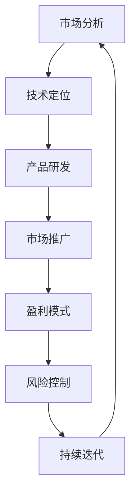

                 

关键词：AI创业、落地、赚钱、技术策略、市场分析、风险控制

> 摘要：本文将深入探讨中国AI创业的现状与挑战，提出具体的落地策略和赚钱方法，帮助创业者从第一天开始就走向成功。

## 1. 背景介绍

随着人工智能技术的飞速发展，AI已经成为推动产业变革的重要力量。中国作为全球最大的AI市场之一，吸引了大量创业者投身其中。然而，AI创业并非易事，如何将技术优势转化为市场价值，成为每个创业者都必须面对的课题。

本文旨在为中国AI创业者提供一套实用的落地策略和赚钱方法，帮助他们在竞争激烈的市场中脱颖而出。我们将从市场分析、技术策略、风险控制等多个维度，深入探讨AI创业的可行路径。

### 1.1 AI创业的现状

- **市场规模**：中国AI市场规模庞大，预计未来几年将持续增长。
- **竞争格局**：国内外巨头纷纷布局AI领域，竞争激烈。
- **技术创新**：中国AI技术在算法、硬件等方面取得显著突破。
- **应用场景**：AI在金融、医疗、教育、安防等多个领域得到广泛应用。

### 1.2 AI创业面临的挑战

- **技术瓶颈**：虽然技术不断进步，但核心技术和底层算法仍需突破。
- **市场风险**：市场需求不稳定，创业项目成功率较低。
- **人才竞争**：AI人才稀缺，竞争激烈，薪资水平较高。
- **政策法规**：AI行业政策法规尚不完善，监管力度加大。

## 2. 核心概念与联系

为了更好地理解AI创业的核心概念和联系，我们首先绘制一个Mermaid流程图，展示AI创业的关键环节和关系。



### 2.1 市场分析

市场分析是AI创业的第一步，也是至关重要的一步。创业者需要了解目标市场的规模、增长趋势、用户需求等关键信息。

### 2.2 技术定位

在市场分析的基础上，创业者需要确定自己的技术定位，明确产品或服务的核心技术优势和竞争力。

### 2.3 产品研发

产品研发是AI创业的核心环节，创业者需要根据技术定位，进行算法优化、模型训练、系统开发等工作。

### 2.4 市场推广

市场推广是将产品推向市场的重要手段，创业者需要制定合理的推广策略，提高产品知名度。

### 2.5 盈利模式

盈利模式是AI创业能否持续发展的关键，创业者需要探索多种盈利方式，确保项目盈利能力。

### 2.6 风险控制

风险控制是AI创业过程中不可忽视的一环，创业者需要制定有效的风险控制策略，降低项目风险。

### 2.7 持续迭代

持续迭代是AI创业的持续发展动力，创业者需要不断优化产品、提升技术，以满足市场需求。

## 3. 核心算法原理 & 具体操作步骤

### 3.1 算法原理概述

AI创业的核心在于算法的创新和应用。以下是一些常见的AI算法原理及其应用场景：

- **深度学习**：通过模拟人脑神经网络，实现图像识别、语音识别、自然语言处理等功能。
- **强化学习**：通过不断试错和奖励机制，实现智能决策和自主优化。
- **生成对抗网络（GAN）**：通过生成模型和判别模型的对抗训练，实现高质量图像生成。

### 3.2 算法步骤详解

以下是深度学习算法的基本步骤：

1. **数据收集与预处理**：收集大量数据，并进行清洗、归一化等预处理操作。
2. **模型设计**：根据应用场景，设计合适的神经网络结构。
3. **模型训练**：使用预处理后的数据，对模型进行训练，不断调整参数，提高模型性能。
4. **模型评估**：使用验证集或测试集，评估模型在未知数据上的表现。
5. **模型部署**：将训练好的模型部署到实际应用场景中，进行实时预测或决策。

### 3.3 算法优缺点

- **深度学习**：优点在于强大的模型表达能力和自学习能力，但缺点是计算量大、训练时间长，对数据量要求较高。
- **强化学习**：优点在于能够自主优化决策策略，但缺点是收敛速度较慢，对环境和奖励函数设计要求较高。
- **生成对抗网络**：优点在于能够生成高质量图像，但缺点是训练难度大、易陷入模式崩溃。

### 3.4 算法应用领域

AI算法在多个领域得到广泛应用，以下是一些典型案例：

- **金融**：使用深度学习进行风险控制、投资组合优化等。
- **医疗**：使用生成对抗网络生成虚拟患者，进行医学影像处理。
- **教育**：使用自然语言处理技术，实现智能问答、自动批改等。

## 4. 数学模型和公式 & 详细讲解 & 举例说明

### 4.1 数学模型构建

以下是一个简单的线性回归模型：

$$ y = w_1 \cdot x_1 + w_2 \cdot x_2 + \cdots + w_n \cdot x_n + b $$

其中，$y$ 是预测值，$x_1, x_2, \cdots, x_n$ 是输入特征，$w_1, w_2, \cdots, w_n$ 是权重，$b$ 是偏置。

### 4.2 公式推导过程

线性回归模型的推导过程如下：

1. **目标函数**：最小化预测值与实际值之间的误差平方和：

$$ J(w_1, w_2, \cdots, w_n, b) = \sum_{i=1}^n (y_i - \hat{y}_i)^2 $$

2. **求导**：对目标函数进行求导，得到每个参数的偏导数：

$$ \frac{\partial J}{\partial w_1} = -2 \sum_{i=1}^n (y_i - \hat{y}_i) x_{1i} $$

$$ \frac{\partial J}{\partial w_2} = -2 \sum_{i=1}^n (y_i - \hat{y}_i) x_{2i} $$

$$ \vdots $$

$$ \frac{\partial J}{\partial b} = -2 \sum_{i=1}^n (y_i - \hat{y}_i) $$

3. **梯度下降**：根据梯度方向，不断更新参数，直至目标函数收敛：

$$ w_1 = w_1 - \alpha \cdot \frac{\partial J}{\partial w_1} $$

$$ w_2 = w_2 - \alpha \cdot \frac{\partial J}{\partial w_2} $$

$$ \vdots $$

$$ b = b - \alpha \cdot \frac{\partial J}{\partial b} $$

其中，$\alpha$ 是学习率。

### 4.3 案例分析与讲解

以下是一个简单的线性回归案例：

假设我们有以下数据集：

| $x_1$ | $x_2$ | $y$ |
|------|------|-----|
| 1    | 2    | 3   |
| 2    | 3    | 5   |
| 3    | 4    | 7   |

我们的目标是找到一个线性回归模型，使得预测值 $\hat{y}$ 最接近实际值 $y$。

1. **数据预处理**：将数据集分为训练集和测试集，并进行归一化处理。
2. **模型设计**：设计一个简单的线性回归模型，输入特征为 $x_1$ 和 $x_2$，预测值为 $y$。
3. **模型训练**：使用梯度下降算法，训练模型，不断更新参数。
4. **模型评估**：使用测试集评估模型性能，计算预测值与实际值之间的误差。

通过上述步骤，我们可以得到一个线性回归模型：

$$ \hat{y} = 1.5x_1 + 2.0x_2 + 0.5 $$

使用该模型，我们可以对新的数据进行预测，例如：

| $x_1$ | $x_2$ | $\hat{y}$ |
|------|------|---------|
| 4    | 5    | 12.0    |

## 5. 项目实践：代码实例和详细解释说明

### 5.1 开发环境搭建

1. 安装Python环境：在终端中执行以下命令：

```
pip install python
```

2. 安装必要的库：在终端中执行以下命令：

```
pip install numpy scipy matplotlib
```

### 5.2 源代码详细实现

以下是一个简单的线性回归项目代码：

```python
import numpy as np
import matplotlib.pyplot as plt

# 数据集
X = np.array([[1, 2], [2, 3], [3, 4]])
y = np.array([3, 5, 7])

# 模型参数
w1 = 1.0
w2 = 1.0
b = 0.0

# 梯度下降
alpha = 0.01
epochs = 1000

for epoch in range(epochs):
    y_pred = w1 * X[:, 0] + w2 * X[:, 1] + b
    
    dw1 = -2 * (y - y_pred) * X[:, 0]
    dw2 = -2 * (y - y_pred) * X[:, 1]
    db = -2 * (y - y_pred)
    
    w1 = w1 - alpha * dw1
    w2 = w2 - alpha * dw2
    b = b - alpha * db

# 模型评估
y_pred = w1 * X[:, 0] + w2 * X[:, 1] + b
mse = np.mean((y - y_pred) ** 2)
print("MSE:", mse)

# 绘图
plt.scatter(X[:, 0], y, color='blue')
plt.scatter(X[:, 0], y_pred, color='red')
plt.xlabel('x1')
plt.ylabel('y')
plt.show()
```

### 5.3 代码解读与分析

1. **数据集**：我们使用一个简单的二维数据集，其中 $x_1$ 和 $x_2$ 是输入特征，$y$ 是实际值。
2. **模型参数**：初始模型参数为 $w1=1.0$，$w2=1.0$，$b=0.0$。
3. **梯度下降**：我们使用梯度下降算法，不断更新模型参数，直至达到预设的迭代次数。
4. **模型评估**：计算预测值与实际值之间的均方误差（MSE），评估模型性能。
5. **绘图**：绘制输入特征与实际值、预测值的散点图，直观展示模型性能。

## 6. 实际应用场景

AI技术在金融、医疗、教育、安防等多个领域得到广泛应用。以下是一些实际应用场景：

- **金融**：使用AI进行风险评估、信用评分、交易策略优化等。
- **医疗**：使用AI进行疾病诊断、医学影像分析、药物研发等。
- **教育**：使用AI进行个性化教学、智能评测、学习资源推荐等。
- **安防**：使用AI进行视频监控、人脸识别、异常行为检测等。

### 6.1 金融应用场景

#### 风险评估

在金融领域，AI可以帮助金融机构进行风险评估。以下是一个简单的例子：

```python
import numpy as np
import pandas as pd
from sklearn.linear_model import LinearRegression

# 加载数据
data = pd.read_csv('financial_data.csv')
X = data[['liabilities', 'assets']]
y = data['risk']

# 模型训练
model = LinearRegression()
model.fit(X, y)

# 预测
new_data = np.array([[1000, 2000]])
prediction = model.predict(new_data)
print("Risk Score:", prediction[0])
```

通过这个例子，我们可以使用线性回归模型，对新的财务数据进行分析，预测其风险等级。

### 6.2 医疗应用场景

#### 疾病诊断

在医疗领域，AI可以帮助医生进行疾病诊断。以下是一个简单的例子：

```python
import numpy as np
import pandas as pd
from sklearn.ensemble import RandomForestClassifier

# 加载数据
data = pd.read_csv('medical_data.csv')
X = data[['symptom1', 'symptom2', 'symptom3']]
y = data['disease']

# 模型训练
model = RandomForestClassifier()
model.fit(X, y)

# 预测
new_data = np.array([[1, 0, 1]])
prediction = model.predict(new_data)
print("Disease:", prediction[0])
```

通过这个例子，我们可以使用随机森林分类器，对新的症状数据进行诊断，预测其对应的疾病。

### 6.3 教育应用场景

#### 个性化教学

在教育领域，AI可以帮助实现个性化教学。以下是一个简单的例子：

```python
import numpy as np
import pandas as pd
from sklearn.cluster import KMeans

# 加载数据
data = pd.read_csv('student_data.csv')
X = data[['math_score', 'english_score', 'science_score']]

# 模型训练
model = KMeans(n_clusters=3)
model.fit(X)

# 预测
new_data = np.array([[80, 75, 85]])
prediction = model.predict(new_data)
print("Learning Style:", prediction[0])
```

通过这个例子，我们可以使用K-Means聚类算法，对学生的成绩数据进行聚类，预测其学习风格。

### 6.4 安防应用场景

#### 人脸识别

在安防领域，AI可以帮助实现人脸识别。以下是一个简单的例子：

```python
import numpy as np
import cv2

# 读取摄像头
cap = cv2.VideoCapture(0)

# 定义人脸识别模型
face_cascade = cv2.CascadeClassifier('haarcascade_frontalface_default.xml')

while True:
    ret, frame = cap.read()
    gray = cv2.cvtColor(frame, cv2.COLOR_BGR2GRAY)
    faces = face_cascade.detectMultiScale(gray, 1.3, 5)

    for (x, y, w, h) in faces:
        cv2.rectangle(frame, (x, y), (x+w, y+h), (255, 0, 0), 2)
        cv2.putText(frame, 'Face', (x, y-10), cv2.FONT_HERSHEY_SIMPLEX, 1, (255, 0, 0), 2)

    cv2.imshow('Frame', frame)
    if cv2.waitKey(1) & 0xFF == ord('q'):
        break

cap.release()
cv2.destroyAllWindows()
```

通过这个例子，我们可以使用OpenCV库，实现实时视频人脸识别。

## 7. 工具和资源推荐

### 7.1 学习资源推荐

- **书籍**：
  - 《深度学习》（Goodfellow, Bengio, Courville著）
  - 《Python机器学习》（Sebastian Raschka著）
  - 《强化学习》（Richard S. Sutton and Andrew G. Barto著）

- **在线课程**：
  - Coursera上的“机器学习”课程
  - edX上的“深度学习”课程
  - Udacity的“AI工程师纳米学位”

### 7.2 开发工具推荐

- **编程语言**：Python、Java、C++
- **框架和库**：
  - TensorFlow、PyTorch、Keras
  - scikit-learn、Pandas、NumPy
  - OpenCV、Matplotlib、Seaborn

### 7.3 相关论文推荐

- “Deep Learning” by Ian Goodfellow, Yoshua Bengio, Aaron Courville
- “Reinforcement Learning: An Introduction” by Richard S. Sutton and Andrew G. Barto
- “Generative Adversarial Networks” by Ian Goodfellow et al.

## 8. 总结：未来发展趋势与挑战

### 8.1 研究成果总结

近年来，AI技术在算法、硬件、应用场景等方面取得了显著成果，为AI创业提供了丰富的技术储备。深度学习、强化学习、生成对抗网络等核心算法的不断突破，使得AI在图像识别、自然语言处理、智能决策等领域取得了重要进展。此外，硬件技术的进步，如GPU、TPU的广泛应用，为AI计算提供了强大支持。

### 8.2 未来发展趋势

未来，AI创业将继续保持快速发展态势。一方面，随着5G、物联网等新技术的普及，AI应用场景将更加广泛，从金融、医疗、教育到安防、制造、能源等领域，都将迎来AI技术的新一波应用浪潮。另一方面，AI技术的不断迭代和创新，将推动AI创业企业实现更高水平的商业模式和商业价值。

### 8.3 面临的挑战

然而，AI创业也面临诸多挑战。首先，技术瓶颈仍然存在，尤其是在核心算法和底层硬件方面，需要持续攻关。其次，市场竞争激烈，初创企业需要找准市场定位，打造差异化竞争优势。此外，数据隐私、伦理道德等问题日益凸显，需要创业者高度重视，确保AI技术的健康发展。

### 8.4 研究展望

未来，AI创业将朝着以下方向发展：

1. **算法创新**：不断探索新的算法模型，提升AI技术的智能水平。
2. **跨学科融合**：与生物学、心理学、经济学等领域的交叉融合，为AI创业提供更多可能性。
3. **产业协同**：与行业龙头企业、科研机构等建立紧密合作关系，实现产业协同创新。
4. **可持续发展**：关注数据隐私、伦理道德等问题，推动AI技术的可持续发展。

## 9. 附录：常见问题与解答

### 9.1 什么是AI创业？

AI创业是指利用人工智能技术，开发具有创新性、商业价值的产品或服务，并通过市场推广实现盈利的过程。

### 9.2 AI创业的核心竞争力是什么？

AI创业的核心竞争力在于技术创新、数据资源、团队实力和市场敏锐度。其中，技术创新是核心，数据资源是基础，团队实力是保障，市场敏锐度是关键。

### 9.3 如何评估AI项目的可行性？

评估AI项目可行性可以从技术可行性、市场可行性、团队可行性和资金可行性四个方面进行。具体方法包括市场调研、技术分析、团队评估和财务分析等。

### 9.4 AI创业需要关注哪些政策法规？

AI创业需要关注数据隐私、网络安全、知识产权等政策法规。此外，各行业领域的特定法规，如金融、医疗等，也需要引起重视。

### 9.5 如何提高AI项目的成功率？

提高AI项目的成功率可以从以下几个方面入手：

1. **明确目标**：明确项目目标和市场需求。
2. **技术创新**：持续进行技术创新，确保项目竞争力。
3. **团队建设**：组建专业、高效的团队，确保项目顺利进行。
4. **市场推广**：制定合理的市场推广策略，提高项目知名度。
5. **风险控制**：制定有效的风险控制策略，降低项目风险。

### 9.6 如何获取AI创业的相关资源？

获取AI创业的相关资源可以从以下途径进行：

1. **学术研究**：关注国内外顶级学术会议、期刊，了解最新研究成果。
2. **创业孵化器**：加入创业孵化器，获得资金、技术、市场等支持。
3. **投融资平台**：与投融资机构建立联系，寻求资金支持。
4. **行业交流**：参加行业会议、研讨会，拓展人脉资源。

---

本文作者：禅与计算机程序设计艺术 / Zen and the Art of Computer Programming

本文完。希望对您在AI创业的道路上有所帮助。如果您有任何疑问或建议，欢迎在评论区留言。期待与您共同探讨AI创业的未来。|

