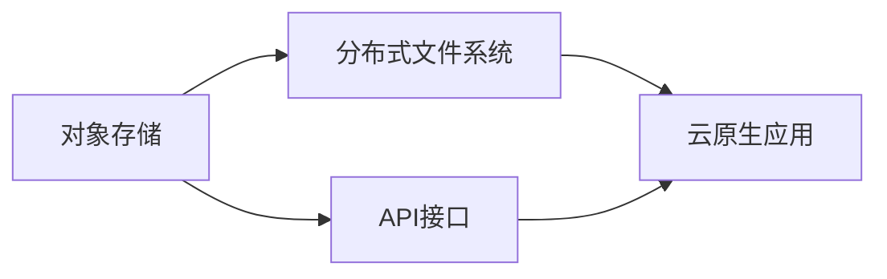

                 

关键词：云原生，存储解决方案，对象存储，分布式文件系统，容器化，微服务架构

> 摘要：本文将探讨云原生存储解决方案，从对象存储到分布式文件系统，介绍其核心概念、技术原理、应用场景及未来展望。通过对比分析不同存储技术的优缺点，为读者提供一份数据存储与管理的实用指南。

## 1. 背景介绍

随着云计算和大数据技术的快速发展，传统的单体应用架构已经无法满足现代企业对灵活性和可扩展性的需求。为了应对这一挑战，云原生技术逐渐崭露头角。云原生（Cloud Native）是指一种利用容器、服务网格、微服务、不可变基础设施和声明式API等创新技术，构建和运行应用程序的方法。

在云原生环境中，应用程序被设计为微服务，以容器作为其运行时环境。这种设计使得应用程序可以更加灵活、可靠、易于扩展。然而，微服务的分布式特性也带来了存储方面的挑战。传统的单体应用通常依赖于集中式的存储系统，如关系型数据库或文件系统。而在微服务架构中，这些集中式存储系统可能无法满足高可用性、高性能和可扩展性的要求。

因此，云原生存储解决方案应运而生。本文将详细介绍几种常见的云原生存储技术，包括对象存储和分布式文件系统，并探讨它们在云原生环境中的应用和优势。

## 2. 核心概念与联系

### 2.1. 对象存储

对象存储是一种基于对象的存储架构，其基本单位是对象。对象由数据（称为对象体）和元数据（如对象名称、类型、创建时间等）组成。对象存储系统通常提供API接口，如RESTful API，用于对象的创建、读取、更新和删除（CRUD）操作。

### 2.2. 分布式文件系统

分布式文件系统是一种基于分布式架构的文件存储系统，它将文件存储在多个节点上，并通过网络进行访问。分布式文件系统的主要优势是高可用性、高性能和可扩展性。常见的分布式文件系统包括Hadoop分布式文件系统（HDFS）和Google文件系统（GFS）。

### 2.3. 云原生与存储技术的联系

云原生技术依赖于容器化和微服务架构，这要求存储系统具备高可用性、高性能和可扩展性。对象存储和分布式文件系统都可以满足这些要求。对象存储通过其分布式架构和RESTful API接口，可以轻松集成到云原生环境中。分布式文件系统则通过其分布式存储和强一致性机制，为云原生应用提供可靠的数据存储和访问服务。

### 2.4. Mermaid 流程图

下面是一个简单的Mermaid流程图，展示了对象存储和分布式文件系统的基本架构。

## 3. 核心算法原理 & 具体操作步骤

### 3.1. 算法原理概述

云原生存储解决方案的核心在于如何高效地管理和访问分布式存储资源。这涉及到多个方面的算法原理，包括数据分片、负载均衡、容错机制和缓存策略等。

- **数据分片**：将大量数据分散存储在多个节点上，以实现并行访问和提高存储性能。
- **负载均衡**：将存储请求均匀地分配到多个节点上，避免单点瓶颈。
- **容错机制**：在存储节点发生故障时，能够自动切换到其他健康节点，确保数据可用性。
- **缓存策略**：在访问频繁的数据上设置缓存，减少数据访问延迟。

### 3.2. 算法步骤详解

1. **数据分片**：

   - 数据分片算法通常基于哈希函数，将数据按哈希值分布到不同节点上。

   - 步骤：

     a. 计算数据的哈希值。

     b. 根据哈希值确定数据所在的节点。

     c. 在目标节点上存储数据。

2. **负载均衡**：

   - 负载均衡算法有多种实现方式，如轮询、最小连接数、加权轮询等。

   - 步骤：

     a. 收集各节点的当前负载情况。

     b. 根据负载均衡策略选择下一个处理请求的节点。

     c. 将请求转发到选定的节点。

3. **容错机制**：

   - 容错机制通常包括副本机制和自动故障切换。

   - 步骤：

     a. 在多个节点上存储数据的副本。

     b. 监测节点状态，当节点故障时，自动切换到健康节点。

4. **缓存策略**：

   - 缓存策略可以基于LRU（最近最少使用）或LFU（最不频繁使用）等算法。

   - 步骤：

     a. 当访问数据时，首先检查缓存。

     b. 如果缓存中存在数据，直接从缓存读取。

     c. 如果缓存中不存在数据，从存储节点读取并更新缓存。

### 3.3. 算法优缺点

- **数据分片**：

  - 优点：提高存储性能，实现并行访问。

  - 缺点：管理复杂，数据一致性保证困难。

- **负载均衡**：

  - 优点：避免单点瓶颈，提高系统性能。

  - 缺点：实现复杂，需要实时监测节点状态。

- **容错机制**：

  - 优点：提高系统可用性，确保数据安全。

  - 缺点：增加存储空间和带宽消耗。

- **缓存策略**：

  - 优点：减少数据访问延迟，提高系统响应速度。

  - 缺点：缓存数据一致性保证困难，缓存失效可能导致性能下降。

### 3.4. 算法应用领域

- **数据存储与管理**：广泛应用于企业级应用、大数据处理和分布式计算等领域。

- **云原生应用**：为容器化和微服务架构提供高效、可靠的存储服务。

- **边缘计算**：为边缘设备提供本地存储，实现实时数据处理。

## 4. 数学模型和公式 & 详细讲解 & 举例说明

### 4.1. 数学模型构建

在云原生存储解决方案中，数学模型主要用于计算数据分片、负载均衡和缓存策略等。

- **数据分片模型**：

  假设数据集D={d1, d2, ..., dn}，节点集合N={n1, n2, ..., nm}。每个数据项di的哈希值为h(di)。分片函数为f(h(di))=ni，其中ni是数据di所在的节点。

- **负载均衡模型**：

  假设节点集合N={n1, n2, ..., nm}，每个节点的当前负载为L(ni)。负载均衡策略为p(ni)=L(ni)/∑L(ni)。选择下一个处理请求的节点为ni，其中p(ni)最大。

- **缓存策略模型**：

  假设缓存集合C={c1, c2, ..., cm}，每个缓存项c

