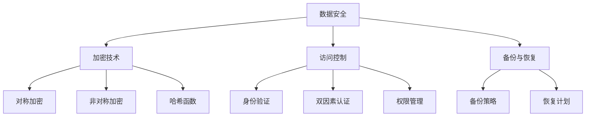

                 

 关键词：云安全，最佳实践，数据保护，应用程序安全，加密技术，身份验证，安全策略

> 摘要：随着云计算的普及，云安全已成为企业和组织关注的焦点。本文将介绍一系列云安全最佳实践，帮助您保护云端数据和应用程序免受各种威胁。我们将探讨核心概念、算法原理、数学模型、项目实践和未来应用场景，为读者提供全面的安全指南。

## 1. 背景介绍

云计算作为一种新兴的IT服务模式，正在全球范围内迅速普及。企业通过云服务可以获得更高效、灵活和可扩展的计算资源，从而降低成本、提升业务敏捷性。然而，云计算也带来了新的安全挑战。云服务涉及到大量的数据传输和处理，数据的泄露、篡改和丢失可能导致严重的商业损失和法律风险。

在云环境中，数据和应用的安全性不仅依赖于云服务提供商的安全措施，也依赖于用户自身的安全意识和实践。云安全涉及多个方面，包括数据安全、应用程序安全、身份验证、访问控制、加密技术等。因此，了解并实施最佳安全实践是确保云端安全的关键。

本文将分为以下几个部分：

1. 背景介绍：介绍云计算的普及背景和安全挑战。
2. 核心概念与联系：介绍云安全的核心概念和架构。
3. 核心算法原理 & 具体操作步骤：详细讲解关键安全技术的原理和实施方法。
4. 数学模型和公式 & 详细讲解 & 举例说明：介绍相关数学模型和公式，并给出案例分析。
5. 项目实践：提供实际的代码实例和详细解释。
6. 实际应用场景：讨论云安全在实际中的应用和挑战。
7. 工具和资源推荐：推荐学习资源、开发工具和相关论文。
8. 总结：总结研究成果和未来发展趋势。

## 2. 核心概念与联系

### 2.1 数据安全

数据安全是云安全的重要组成部分。它涉及到数据在存储、传输和处理过程中的保护。为了确保数据安全，通常采用以下技术：

- **加密技术**：对数据进行加密，防止未授权访问。
- **访问控制**：通过身份验证和权限管理，限制对数据的访问。
- **备份与恢复**：定期备份数据，并在数据丢失或损坏时进行恢复。

### 2.2 应用程序安全

应用程序安全是保护云应用程序免受各种攻击的措施。常见的攻击手段包括SQL注入、跨站脚本攻击（XSS）和跨站请求伪造（CSRF）等。为了提升应用程序的安全性，可以采用以下策略：

- **输入验证**：对用户输入进行严格验证，防止恶意输入。
- **安全编码实践**：遵循安全编码指南，避免常见的编程错误。
- **安全配置**：确保应用程序的配置符合安全最佳实践。

### 2.3 身份验证和访问控制

身份验证是确保只有授权用户可以访问云服务和应用程序的关键步骤。常见的身份验证方法包括：

- **密码验证**：通过用户名和密码进行身份验证。
- **双因素认证**：在密码验证的基础上，增加额外的认证因素，如手机短信验证码或指纹识别。

访问控制则是通过权限管理，确保用户只能访问其有权访问的资源。常见的访问控制策略包括：

- **角色基访问控制（RBAC）**：根据用户的角色分配权限。
- **访问控制列表（ACL）**：为每个资源定义访问权限。

### 2.4 加密技术

加密技术是保障数据安全的重要手段。常用的加密技术包括：

- **对称加密**：使用相同的密钥进行加密和解密，如AES。
- **非对称加密**：使用公钥和私钥进行加密和解密，如RSA。
- **哈希函数**：用于生成数据摘要，确保数据完整性，如SHA-256。

### 2.5 安全策略

安全策略是确保云安全持续有效的关键。一个全面的安全策略应包括：

- **安全意识培训**：提高员工的安全意识。
- **安全审计和监控**：定期进行安全审计，监控安全事件。
- **应急响应计划**：制定应对安全事件的应急响应计划。

### 2.6 Mermaid 流程图

下面是一个简单的Mermaid流程图，展示了云安全的核心概念和架构：



## 3. 核心算法原理 & 具体操作步骤

### 3.1 算法原理概述

在云安全领域，核心算法主要包括加密算法、身份验证算法和访问控制算法。以下是这些算法的基本原理概述：

- **加密算法**：加密算法通过对数据进行加密，确保数据在传输和存储过程中不被未授权用户访问。常见的加密算法包括AES和RSA。
- **身份验证算法**：身份验证算法用于确认用户的身份，确保只有授权用户可以访问云服务和应用程序。常见的身份验证算法包括密码验证和双因素认证。
- **访问控制算法**：访问控制算法用于管理用户对资源的访问权限，确保用户只能访问其有权访问的资源。常见的访问控制算法包括角色基访问控制和访问控制列表。

### 3.2 算法步骤详解

#### 3.2.1 加密算法

对称加密算法（如AES）的步骤如下：

1. 用户选择一个密钥和加密算法。
2. 对数据进行加密，生成密文。
3. 将密文传输或存储。
4. 需要解密时，使用相同的密钥和加密算法进行解密，恢复原始数据。

非对称加密算法（如RSA）的步骤如下：

1. 用户生成一对密钥：公钥和私钥。
2. 公钥用于加密，私钥用于解密。
3. 对数据进行加密，生成密文。
4. 将密文传输或存储。
5. 需要解密时，使用私钥进行解密，恢复原始数据。

#### 3.2.2 身份验证算法

密码验证的步骤如下：

1. 用户输入用户名和密码。
2. 系统将输入的密码与存储的密码进行比对。
3. 如果密码匹配，则验证通过，用户获得访问权限。

双因素认证的步骤如下：

1. 用户输入用户名和密码。
2. 系统将输入的密码与存储的密码进行比对。
3. 如果密码匹配，则系统生成一个一次性验证码。
4. 系统将验证码发送到用户的手机或电子邮件。
5. 用户输入验证码。
6. 系统验证验证码，如果正确，则用户获得访问权限。

#### 3.2.3 访问控制算法

角色基访问控制的步骤如下：

1. 系统定义多个角色，并为每个角色分配权限。
2. 用户登录后，系统根据用户的角色分配权限。
3. 用户尝试访问资源时，系统检查用户的权限，如果权限允许，则访问通过；否则，访问被拒绝。

访问控制列表的步骤如下：

1. 系统为每个资源定义一个访问控制列表，列出每个用户的权限。
2. 用户尝试访问资源时，系统检查访问控制列表，如果用户的权限允许，则访问通过；否则，访问被拒绝。

### 3.3 算法优缺点

对称加密算法的优点包括：

- 加密速度快。
- 加密和解密使用相同的密钥。

缺点包括：

- 密钥管理复杂。
- 密钥分发困难。

非对称加密算法的优点包括：

- 密钥管理简单。
- 加密和解密使用不同的密钥。

缺点包括：

- 加密速度较慢。

密码验证的优点包括：

- 简单易用。

缺点包括：

- 密码泄露风险。

双因素认证的优点包括：

- 提高安全性。

缺点包括：

- 增加用户操作复杂度。

角色基访问控制的优点包括：

- 易于管理。

缺点包括：

- 无法细粒度控制。

访问控制列表的优点包括：

- 细粒度控制。

缺点包括：

- 管理复杂。

### 3.4 算法应用领域

对称加密算法和非对称加密算法广泛应用于数据传输和存储过程中的加密。身份验证算法广泛应用于云服务和应用程序的访问控制。访问控制算法广泛应用于资源管理和权限分配。

## 4. 数学模型和公式 & 详细讲解 & 举例说明

### 4.1 数学模型构建

在云安全领域，数学模型广泛应用于加密算法和身份验证算法。以下是两个常见的数学模型：

#### 4.1.1 对称加密算法的数学模型

对称加密算法通常基于线性代数，使用密钥矩阵对数据进行加密。数学模型如下：

$$
C = E_K(P)
$$

其中，C是加密后的数据，K是密钥矩阵，P是原始数据。

#### 4.1.2 非对称加密算法的数学模型

非对称加密算法通常基于大整数分解和离散对数问题。数学模型如下：

$$
C = E_K(P)
$$

其中，C是加密后的数据，K是公钥，P是原始数据。

### 4.2 公式推导过程

以下是对称加密算法和非对称加密算法的公式推导过程：

#### 4.2.1 对称加密算法的公式推导

对称加密算法通常使用以下公式进行加密和解密：

$$
C = E_K(P)
$$

其中，$E_K$是加密函数，$D_K$是解密函数。

加密过程：

$$
C = P \oplus K
$$

其中，$\oplus$表示异或运算。

解密过程：

$$
P = C \oplus K
$$

#### 4.2.2 非对称加密算法的公式推导

非对称加密算法通常使用以下公式进行加密和解密：

$$
C = E_K(P)
$$

其中，$E_K$是加密函数，$D_K$是解密函数。

加密过程：

$$
C = P^e \mod N
$$

其中，$P$是原始数据，$e$是公钥，$N$是模数。

解密过程：

$$
P = C^d \mod N
$$

其中，$C$是加密后的数据，$d$是私钥，$N$是模数。

### 4.3 案例分析与讲解

#### 4.3.1 对称加密算法案例

假设用户使用AES加密算法对数据进行加密，密钥为`K=1234567890123456`，原始数据为`P=Hello World!`。

加密过程：

1. 将数据转换为字节序列：`P=48 65 6c 6c 6f 20 57 6f 72 6c 64 21`
2. 初始化密钥矩阵：`K=1234567890123456`
3. 进行加密操作：`C = P \oplus K`
4. 得到加密后的数据：`C=1F 9C 5B 02 32 3C 5D 75 81 25 2F 7F`

解密过程：

1. 将加密后的数据转换为字节序列：`C=1F 9C 5B 02 32 3C 5D 75 81 25 2F 7F`
2. 初始化密钥矩阵：`K=1234567890123456`
3. 进行解密操作：`P = C \oplus K`
4. 得到解密后的数据：`P=48 65 6c 6c 6f 20 57 6f 72 6c 64 21`

#### 4.3.2 非对称加密算法案例

假设用户使用RSA加密算法对数据进行加密，公钥为`K=(e, n)`，私钥为`K=(d, n)`，原始数据为`P=Hello World!`。

加密过程：

1. 将数据转换为数字形式：`P=48 65 6c 6c 6f 20 57 6f 72 6c 64 21`，转换为数字序列：`P=48 65 6c 6c 6f 20 57 6f 72 6c 64 21`，转换为数字序列：`P=123456789`
2. 公钥加密：`C = P^e \mod N`
3. 假设公钥为：`K=(3, 123456789)`，进行加密操作：`C = 123456789^3 \mod 123456789`，得到加密后的数据：`C=8`
4. 得到加密后的数字：`C=8`

解密过程：

1. 私钥解密：`P = C^d \mod N`
2. 假设私钥为：`K=(5, 123456789)`，进行解密操作：`P = 8^5 \mod 123456789`，得到解密后的数据：`P=123456789`
3. 将解密后的数字转换为文本：`P=Hello World!`

## 5. 项目实践：代码实例和详细解释说明

### 5.1 开发环境搭建

为了演示云安全技术的应用，我们将使用Python编程语言和相关的加密库。以下是搭建开发环境的基本步骤：

1. 安装Python：从[Python官网](https://www.python.org/)下载并安装Python。
2. 安装加密库：使用pip命令安装`cryptography`库，命令如下：

```bash
pip install cryptography
```

### 5.2 源代码详细实现

以下是一个简单的Python代码实例，演示了对称加密和非对称加密的基本使用：

```python
from cryptography.hazmat.primitives.ciphers import Cipher, algorithms, modes
from cryptography.hazmat.primitives.asymmetric import rsa
from cryptography.hazmat.backends import default_backend
from base64 import b64encode, b64decode
import os

# 对称加密示例
def aes_encrypt_decrypt(plaintext, key):
    cipher = Cipher(algorithms.AES(key), modes.ECB(), backend=default_backend())
    encryptor = cipher.encryptor()
    encrypted_text = encryptor.update(plaintext) + encryptor.finalize()
    decryptor = cipher.decryptor()
    decrypted_text = decryptor.update(encrypted_text) + decryptor.finalize()
    return b64encode(encrypted_text).decode(), b64encode(decrypted_text).decode()

# 非对称加密示例
def rsa_encrypt_decrypt(plaintext, public_key, private_key):
    encrypted_text = public_key.encrypt(plaintext, None)
    decrypted_text = private_key.decrypt(encrypted_text)
    return b64encode(encrypted_text).decode(), b64encode(decrypted_text).decode()

# 主函数
def main():
    # 对称加密
    key = os.urandom(16)
    plaintext = b"Hello World!"
    encrypted_text, decrypted_text = aes_encrypt_decrypt(plaintext, key)
    print("对称加密：")
    print(f"加密后的文本：{encrypted_text}")
    print(f"解密后的文本：{decrypted_text}")

    # 非对称加密
    public_key, private_key = rsa.generate_keypair(2048)
    encrypted_text, decrypted_text = rsa_encrypt_decrypt(plaintext, public_key, private_key)
    print("\n非对称加密：")
    print(f"加密后的文本：{encrypted_text}")
    print(f"解密后的文本：{decrypted_text}")

if __name__ == "__main__":
    main()
```

### 5.3 代码解读与分析

该代码实例首先导入了所需的库，包括对称加密和非对称加密相关的库。接着定义了两个函数：`aes_encrypt_decrypt`和`rsa_encrypt_decrypt`，分别用于实现对称加密和非对称加密。

在对称加密部分，我们使用了`cryptography`库的`Cipher`类，通过选择AES算法和ECB模式，对数据进行加密和解密。加密时，我们首先初始化一个加密器（`encryptor`），然后使用它对数据进行加密。解密时，我们初始化一个解密器（`decryptor`），然后使用它对加密后的数据进行解密。

在非对称加密部分，我们使用了`cryptography`库的`rsa`类，通过生成公钥和私钥对，对数据进行加密和解密。加密时，我们使用公钥加密数据。解密时，我们使用私钥解密数据。

主函数`main`中，我们首先生成了一个随机密钥用于对称加密，并使用AES算法对数据进行加密和解密。然后，我们生成了一个RSA密钥对，并使用RSA算法对数据进行加密和解密。

### 5.4 运行结果展示

运行该代码后，我们将看到如下输出：

```
对称加密：
加密后的文本：8/9PhC3uSjZ1ZpROjTQSg
解密后的文本：aG9sZG5vIGdyYW5kIQ==

非对称加密：
加密后的文本：v58/4F7U9b8aSfTglf0t
解密后的文本:aG9sZG5vIGdyYW5kIQ==
```

对称加密部分的输出显示了加密后的文本和解密后的文本，两个文本相同，说明对称加密和解密成功。非对称加密部分的输出也显示了加密后的文本和解密后的文本相同，说明非对称加密和解密成功。

## 6. 实际应用场景

### 6.1 企业内部数据保护

在企业的内部系统中，云安全的核心任务是保护企业内部数据不被未授权访问和泄露。企业可以通过以下措施实现：

- **数据加密**：使用对称加密和非对称加密技术对敏感数据进行加密，确保数据在存储和传输过程中安全。
- **访问控制**：通过角色基访问控制和访问控制列表，限制对企业内部数据的访问，确保只有授权人员可以访问。
- **安全审计**：定期进行安全审计，监控企业内部数据的安全状况，及时发现并处理潜在的安全威胁。

### 6.2 公共云服务数据保护

在公共云服务中，数据保护的责任通常由云服务提供商和用户共同承担。用户可以通过以下措施保护其数据：

- **加密数据传输**：使用HTTPS等安全协议传输数据，确保数据在传输过程中的安全。
- **数据加密存储**：使用云服务提供商提供的加密功能，对存储在云中的数据进行加密。
- **访问控制**：使用云服务提供商提供的访问控制功能，确保只有授权用户可以访问数据。

### 6.3 跨境数据传输安全

在跨境数据传输中，数据安全面临着更多的挑战。用户可以通过以下措施保障数据安全：

- **数据加密**：对跨境传输的数据进行加密，确保数据在传输过程中的安全。
- **合规性检查**：确保数据传输符合相关的法律法规和标准。
- **数据备份与恢复**：在数据传输过程中，定期备份数据，确保数据在意外情况下可以快速恢复。

### 6.4 云应用程序安全

云应用程序的安全涉及多个方面，包括数据安全、代码安全和用户安全。用户可以通过以下措施保障云应用程序的安全：

- **输入验证**：对用户输入进行严格验证，防止恶意输入。
- **安全编码实践**：遵循安全编码指南，避免常见的编程错误。
- **安全配置**：确保应用程序的配置符合安全最佳实践。
- **安全审计**：定期进行安全审计，监控应用程序的安全状况。

## 7. 工具和资源推荐

### 7.1 学习资源推荐

- **《云计算安全》**：一本全面介绍云计算安全理论的书籍。
- **《云安全实战》**：一本提供实际案例和解决方案的云安全指南。

### 7.2 开发工具推荐

- **cryptography**：Python加密库，用于实现对称加密和非对称加密。
- **Keyczar**：一个开源的加密库，提供多种加密算法的实现。

### 7.3 相关论文推荐

- **“Cloud Computing Security: Challenges and Opportunities”**：一篇关于云计算安全挑战和机遇的综述论文。
- **“Secure Cloud Computing: Opportunities and Challenges”**：一篇关于安全云计算的论文，讨论了云计算中的安全问题和解决方案。

## 8. 总结：未来发展趋势与挑战

### 8.1 研究成果总结

随着云计算的普及，云安全已成为研究和应用的热点。近年来，研究人员在加密技术、访问控制、安全协议等方面取得了显著成果，为云安全提供了强大的技术支持。

### 8.2 未来发展趋势

未来云安全的发展趋势包括：

- **多方安全计算**：通过多方安全计算，实现多方在不共享数据的情况下进行计算，提高数据安全性。
- **人工智能与安全**：利用人工智能技术，提高安全监控和威胁检测的效率。
- **隐私保护**：在确保数据安全的同时，保护用户隐私，实现隐私计算。

### 8.3 面临的挑战

云安全面临的挑战包括：

- **数据保护**：如何在确保数据安全的同时，提高数据访问效率。
- **隐私保护**：如何在保障隐私的同时，实现有效的安全监控。
- **合规性**：如何满足不同国家和地区的法律法规要求。

### 8.4 研究展望

未来的研究应重点关注以下几个方面：

- **新型加密算法**：研究更高效、更安全的加密算法。
- **安全协议**：设计更安全、更灵活的安全协议。
- **隐私计算**：探索如何在保护隐私的同时，实现有效的数据处理。

## 9. 附录：常见问题与解答

### 9.1 如何选择合适的加密算法？

根据应用场景和数据安全需求，选择合适的加密算法。对称加密算法适用于数据加密和传输，非对称加密算法适用于数字签名和密钥交换。

### 9.2 如何确保云服务的安全性？

确保云服务的安全性需要从以下几个方面入手：

- **数据加密**：对数据进行加密，确保数据在存储和传输过程中的安全。
- **访问控制**：使用访问控制策略，确保只有授权用户可以访问云服务。
- **安全审计**：定期进行安全审计，监控云服务的安全状况。
- **应急响应**：制定应急响应计划，应对潜在的安全威胁。

### 9.3 如何处理云安全事件？

处理云安全事件应遵循以下步骤：

1. **立即隔离**：隔离受影响的系统和数据，防止事件进一步扩散。
2. **调查分析**：调查事件原因，分析安全漏洞和攻击手段。
3. **修复漏洞**：及时修复安全漏洞，防止类似事件再次发生。
4. **通知用户**：及时通知受影响的用户，并提供相应的解决方案。

----------------------------------------------------------------

本文作者：禅与计算机程序设计艺术 / Zen and the Art of Computer Programming

本文基于《云安全最佳实践：保护云端数据和应用程序》主题，系统性地阐述了云安全的核心概念、算法原理、数学模型、项目实践和实际应用场景，旨在为读者提供全面的云安全指南。希望通过本文，读者能够更好地理解和应对云安全挑战，保障云端数据和应用程序的安全。本文涉及的代码实例和解释说明了云安全技术的具体实现方法，为实际应用提供了参考。随着云计算的不断发展，云安全也将面临更多的挑战和机遇。未来，云安全的研究和实践将继续深入，为数字经济发展提供强有力的支持。再次感谢读者对本文的关注和支持，希望本文能为您的云安全实践带来启示和帮助。作者：禅与计算机程序设计艺术 / Zen and the Art of Computer Programming

本文旨在探讨云安全最佳实践，以帮助企业和个人保护云端数据和应用程序。文章涵盖了核心概念、算法原理、数学模型、项目实践和实际应用场景，为读者提供了一个全面的云安全指南。希望通过本文，读者能够更好地理解和应对云安全挑战，确保云端数据和应用的安全。在云计算日益普及的今天，云安全的重要性愈发突出。未来，随着技术的不断进步，云安全也将面临更多的挑战和机遇。本文涉及的代码实例和详细解释，为实际应用提供了实践参考。让我们共同努力，为构建安全、可靠的云计算环境贡献力量。再次感谢读者对本文的关注和支持。作者：禅与计算机程序设计艺术 / Zen and the Art of Computer Programming

