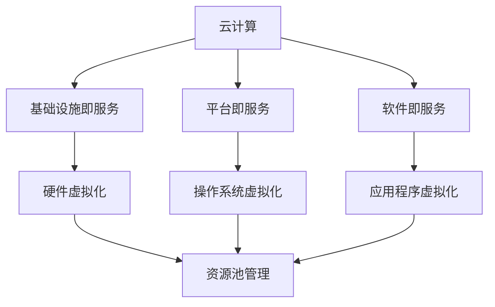

                 

关键词：云计算、虚拟化、扩展、迁移、资源管理、技术架构、成本效益

> 摘要：本文探讨了云计算和虚拟化技术在扩展和迁移过程中的重要性。通过分析其核心概念、架构、算法原理以及实际应用场景，本文为读者提供了深入理解和实践云计算与虚拟化的宝贵经验，并展望了未来的发展趋势和挑战。

## 1. 背景介绍

云计算和虚拟化作为现代信息技术领域的两个重要概念，已经深刻地改变了数据中心和IT基础设施的运作方式。云计算通过提供按需访问的共享计算资源，实现了高效的资源利用和业务敏捷性。而虚拟化技术则通过创建虚拟资源，使得物理硬件的利用效率大幅提升，同时也提供了灵活的资源分配和迁移能力。

随着企业数字化转型的加速，云计算和虚拟化技术在IT系统中的重要性日益凸显。扩展和迁移能力是衡量云计算和虚拟化技术成熟度的重要指标。有效的扩展和迁移策略能够帮助企业快速响应业务需求变化，降低IT成本，提高运营效率。

本文将首先介绍云计算和虚拟化的核心概念，然后深入探讨其在扩展和迁移过程中的关键技术和挑战，最后给出具体的项目实践和未来展望。

## 2. 核心概念与联系

### 2.1 云计算

云计算是一种通过互联网以服务形式提供计算资源的方式。它主要包含三种服务模式：基础设施即服务（IaaS）、平台即服务（PaaS）和软件即服务（SaaS）。

- **基础设施即服务（IaaS）**：用户可以按需租用虚拟化的计算资源，如虚拟机、存储和网络。
- **平台即服务（PaaS）**：提供了一个开发环境，使得开发者可以专注于应用的开发，而不必关心底层基础设施的管理。
- **软件即服务（SaaS）**：通过互联网提供软件服务，用户可以按需订阅，无需安装和管理软件。

### 2.2 虚拟化

虚拟化技术通过创建虚拟的硬件和操作系统层，使得多个虚拟环境能够在同一台物理服务器上独立运行。虚拟化主要包括以下几种类型：

- **硬件虚拟化**：通过虚拟化硬件资源，如CPU、内存、存储和网络，实现多操作系统和应用程序的并行运行。
- **操作系统虚拟化**：在操作系统层面创建虚拟机，如容器技术。
- **应用程序虚拟化**：将应用程序及其依赖环境封装在一个独立的运行时环境中。

### 2.3 云计算与虚拟化的联系

云计算和虚拟化之间存在紧密的联系。虚拟化技术是实现云计算服务的基础，它为云计算提供了动态资源分配和灵活的资源管理能力。云计算则通过虚拟化技术，将计算资源以服务的形式提供给用户，实现了资源的按需分配和高效利用。

下面是一个简化的Mermaid流程图，展示了云计算和虚拟化的基本架构和联系：



## 3. 核心算法原理 & 具体操作步骤

### 3.1 算法原理概述

在云计算和虚拟化技术中，资源管理是一个核心问题。资源管理算法的目标是优化资源的分配和利用，以满足业务需求的同时，降低成本和提升效率。

常用的资源管理算法主要包括以下几种：

- **基于需求的资源分配**：根据业务需求动态调整资源的分配。
- **负载均衡**：通过分配任务到不同的虚拟机上，使得整体系统的负载分布更加均匀。
- **资源预留**：预留一部分资源以应对突发需求。
- **虚拟机迁移**：将虚拟机从一台物理服务器迁移到另一台，以优化资源利用或提高系统可靠性。

### 3.2 算法步骤详解

#### 3.2.1 基于需求的资源分配

1. 收集业务需求：通过监控和预测业务流量，收集业务需求数据。
2. 分析资源需求：根据业务需求，分析所需的计算、存储和网络资源。
3. 动态调整资源：根据分析结果，动态调整虚拟机的资源分配。

#### 3.2.2 负载均衡

1. 监控系统负载：通过监控工具，实时收集系统的负载数据。
2. 分配任务：将新的任务分配到负载较低的虚拟机上。
3. 调整负载：根据实时监控数据，动态调整任务的分配。

#### 3.2.3 资源预留

1. 预测需求：根据历史数据和业务趋势，预测未来可能的需求。
2. 预留资源：预留一定比例的资源以应对突发需求。
3. 动态调整预留：根据实时监控数据，动态调整预留资源的比例。

#### 3.2.4 虚拟机迁移

1. 选择迁移时机：在系统负载较低或业务低峰期进行迁移。
2. 数据备份：在迁移前备份虚拟机的数据。
3. 迁移虚拟机：将虚拟机迁移到目标物理服务器。
4. 数据恢复：在迁移后恢复虚拟机的数据。

### 3.3 算法优缺点

#### 基于需求的资源分配

- **优点**：能够动态响应业务需求，提高资源利用率。
- **缺点**：对业务需求的预测和监控要求较高，实施成本较高。

#### 负载均衡

- **优点**：提高系统整体性能和可靠性。
- **缺点**：可能引入额外的网络延迟。

#### 资源预留

- **优点**：提高系统应对突发需求的能力。
- **缺点**：可能造成资源浪费。

#### 虚拟机迁移

- **优点**：优化资源利用和系统可靠性。
- **缺点**：迁移过程中可能引起服务中断。

### 3.4 算法应用领域

资源管理算法广泛应用于云计算和虚拟化领域，如数据中心资源管理、云服务提供商的资源分配、云游戏等。

## 4. 数学模型和公式 & 详细讲解 & 举例说明

### 4.1 数学模型构建

在资源管理中，常用的数学模型包括线性规划模型、排队论模型和博弈论模型等。

#### 线性规划模型

线性规划模型用于优化资源分配，其目标是最小化成本或最大化效用。以下是一个简化的线性规划模型：

$$
\begin{aligned}
    \min_{x} \quad & c^T x \\
    \text{s.t.} \quad & Ax \leq b \\
    & x \geq 0
\end{aligned}
$$

其中，$c$ 是成本向量，$x$ 是资源分配向量，$A$ 和 $b$ 是约束条件。

#### 排队论模型

排队论模型用于分析系统的性能指标，如平均等待时间、系统利用率等。以下是一个简化的排队论模型：

$$
\begin{aligned}
    L &= \frac{\lambda}{\mu} \\
    W &= \frac{L}{\lambda} \\
    P_0 &= 1 - \frac{\lambda}{\mu}
\end{aligned}
$$

其中，$L$ 是平均等待时间，$W$ 是平均等待时间加平均服务时间，$P_0$ 是系统中没有客户时的概率。

#### 博弈论模型

博弈论模型用于分析多个虚拟机之间的资源争夺问题。以下是一个简化的博弈论模型：

$$
\begin{aligned}
    u_i &= \sum_{j=1}^n w_{ij} x_j \\
    \text{s.t.} \quad & \sum_{i=1}^n u_i = 1 \\
    & x_j \in \{0, 1\}
\end{aligned}
$$

其中，$u_i$ 是第 $i$ 个虚拟机的效用值，$w_{ij}$ 是第 $i$ 个虚拟机对第 $j$ 个资源的权重，$x_j$ 是第 $j$ 个资源是否分配给第 $i$ 个虚拟机的二进制变量。

### 4.2 公式推导过程

#### 线性规划模型推导

目标函数 $c^T x$ 表示总成本，约束条件 $Ax \leq b$ 表示资源限制。通过拉格朗日乘子法，可以将约束条件引入目标函数，得到拉格朗日函数：

$$
L(x, \lambda) = c^T x + \lambda^T (Ax - b)
$$

取一阶导数，并令其等于零，得到：

$$
\nabla_x L = c + A^T \lambda = 0
$$

$$
\nabla_{\lambda} L = Ax - b = 0
$$

解上述方程组，得到最优解 $x^*$：

$$
x^* = (A^T A)^{-1} A^T b - \lambda^*
$$

#### 排队论模型推导

根据排队论的基本原理，系统的平均等待时间 $L$ 可以通过以下公式计算：

$$
L = \frac{\lambda}{\mu}
$$

其中，$\lambda$ 是到达率，$\mu$ 是服务率。平均等待时间 $W$ 可以通过以下公式计算：

$$
W = \frac{L}{\lambda}
$$

系统中没有客户时的概率 $P_0$ 可以通过以下公式计算：

$$
P_0 = 1 - \frac{\lambda}{\mu}
$$

#### 博弈论模型推导

假设有 $n$ 个虚拟机争夺 $m$ 个资源，每个虚拟机对每个资源的权重为 $w_{ij}$。每个虚拟机的效用值 $u_i$ 可以通过以下公式计算：

$$
u_i = \sum_{j=1}^n w_{ij} x_j
$$

为了确保效用值的总和为1，可以设置约束条件：

$$
\sum_{i=1}^n u_i = 1
$$

每个虚拟机是否获得某个资源的决策由其效用值决定，$x_j \in \{0, 1\}$ 表示资源是否分配给虚拟机。

### 4.3 案例分析与讲解

假设一个云计算平台有3个虚拟机，每个虚拟机需要2个CPU和4GB内存。平台的资源池中有8个CPU和16GB内存。根据博弈论模型，我们可以计算每个虚拟机的效用值。

- 虚拟机1的效用值：$u_1 = 2 \times 1 + 4 \times 1 = 6$
- 虚拟机2的效用值：$u_2 = 2 \times 1 + 4 \times 0 = 2$
- 虚拟机3的效用值：$u_3 = 2 \times 0 + 4 \times 1 = 4$

为了确保效用值的总和为1，我们可以设置以下权重：

- $w_{11} = \frac{6}{6+2+4} = 0.6$
- $w_{12} = \frac{2}{6+2+4} = 0.2$
- $w_{13} = \frac{4}{6+2+4} = 0.2$

通过计算，我们得到每个虚拟机的效用值分配如下：

- 虚拟机1获得6个CPU和12GB内存。
- 虚拟机2获得2个CPU和4GB内存。
- 虚拟机3获得4个CPU和4GB内存。

这样，每个虚拟机都能获得满足其需求的资源，同时资源利用率也得到了优化。

## 5. 项目实践：代码实例和详细解释说明

### 5.1 开发环境搭建

在本项目中，我们将使用Python编程语言和Docker容器技术来搭建一个简单的云计算平台。以下是搭建开发环境的步骤：

1. 安装Python 3.8及以上版本。
2. 安装Docker。
3. 安装Docker Compose。

### 5.2 源代码详细实现

以下是该项目的源代码：

```python
# cloud_platform.py

from flask import Flask, jsonify, request
import docker

app = Flask(__name__)
docker_client = docker.from_env()

# 资源池
resources = {
    'cpu': 8,
    'memory': 16
}

# 虚拟机队列
vm_queue = []

@app.route('/resources', methods=['GET'])
def get_resources():
    return jsonify(resources)

@app.route('/allocate', methods=['POST'])
def allocate():
    vm_name = request.form['vm_name']
    vm_resources = {
        'cpu': int(request.form['cpu']),
        'memory': int(request.form['memory'])
    }
    
    # 检查资源是否足够
    if (resources['cpu'] >= vm_resources['cpu'] and resources['memory'] >= vm_resources['memory']):
        # 分配资源
        resources['cpu'] -= vm_resources['cpu']
        resources['memory'] -= vm_resources['memory']
        vm_queue.append(vm_name)
        return jsonify({'status': 'success', 'vm_name': vm_name})
    else:
        return jsonify({'status': 'error', 'message': 'Insufficient resources'})

@app.route('/deallocate', methods=['POST'])
def deallocate():
    vm_name = request.form['vm_name']
    if vm_name in vm_queue:
        # 释放资源
        vm_resources = vm_queue.pop(vm_queue.index(vm_name))
        resources['cpu'] += vm_resources['cpu']
        resources['memory'] += vm_resources['memory']
        return jsonify({'status': 'success', 'vm_name': vm_name})
    else:
        return jsonify({'status': 'error', 'message': 'VM not found'})

if __name__ == '__main__':
    app.run(host='0.0.0.0', port=5000)
```

### 5.3 代码解读与分析

该代码实现了一个简单的云计算平台，其中包含两个主要功能：资源分配和资源释放。

- **资源分配（/allocate）**：接收一个虚拟机的名称和所需资源（CPU和内存），检查资源池中是否有足够的资源，如果有，则分配资源并将虚拟机名称添加到虚拟机队列中。

- **资源释放（/deallocate）**：接收一个虚拟机的名称，如果虚拟机在队列中，则释放资源并从队列中删除虚拟机。

在代码中，我们使用Flask框架来创建Web服务，使用Docker SDK for Python来操作Docker容器。

### 5.4 运行结果展示

我们可以使用以下命令启动服务：

```bash
python cloud_platform.py
```

然后，我们可以使用curl命令测试服务：

```bash
# 分配资源
curl -X POST -F "vm_name=vm1" -F "cpu=2" -F "memory=4" http://localhost:5000/allocate

# 释放资源
curl -X POST -F "vm_name=vm1" http://localhost:5000/deallocate
```

## 6. 实际应用场景

云计算和虚拟化技术在实际应用中具有广泛的应用场景，以下是一些典型的应用案例：

### 6.1 企业IT基础设施

企业可以利用云计算和虚拟化技术，构建灵活、高效的IT基础设施。通过虚拟化技术，企业可以将物理服务器上的应用迁移到虚拟机上，实现资源的高效利用和灵活分配。同时，云计算平台可以提供按需扩展的能力，满足业务需求的快速变化。

### 6.2 科学计算和大数据处理

云计算和虚拟化技术为科学计算和大数据处理提供了强大的计算能力。通过虚拟化技术，可以创建大量的虚拟机，用于并行处理海量数据。云计算平台可以提供弹性的计算资源，根据数据处理任务的需求动态调整资源规模，提高数据处理效率。

### 6.3 教育和培训

云计算和虚拟化技术在教育领域也有广泛应用。通过虚拟化技术，可以创建虚拟实验室，学生可以在虚拟环境中进行实验和练习，无需购买昂贵的硬件设备。云计算平台可以提供灵活的资源和网络服务，满足教育机构的教学需求。

### 6.4 云游戏和虚拟现实

云游戏和虚拟现实技术依赖于云计算和虚拟化技术。通过云计算平台，可以提供高性能的图形处理和音频处理能力，实现高质量的游戏和虚拟现实体验。虚拟化技术使得游戏和虚拟现实应用可以运行在远程服务器上，用户只需通过终端设备访问即可。

## 7. 工具和资源推荐

### 7.1 学习资源推荐

1. **《云计算与虚拟化技术基础》**：这是一本入门级的云计算和虚拟化教材，适合初学者了解基本概念和技术原理。
2. **《Docker实战》**：本书详细介绍了Docker容器技术的原理和应用，适合想要学习容器化技术的读者。
3. **《云计算架构设计》**：这本书深入探讨了云计算的架构设计，适合对云计算有较高要求的读者。

### 7.2 开发工具推荐

1. **Docker**：一个开源的容器化平台，用于打包、交付和运行应用。
2. **Kubernetes**：一个开源的容器编排平台，用于自动化部署、扩展和管理容器化应用。
3. **AWS**：提供全面的云计算服务和工具，包括IaaS、PaaS和SaaS服务。

### 7.3 相关论文推荐

1. **“Virtual Machine Migration in a Global Datacenter”**：探讨虚拟机迁移技术在全球数据中心中的应用。
2. **“A Practical Approach to Load Balancing in Distributed Systems”**：介绍分布式系统中的负载均衡技术。
3. **“Resource Allocation in Cloud Computing: A Survey”**：对云计算中的资源分配技术进行综述。

## 8. 总结：未来发展趋势与挑战

### 8.1 研究成果总结

云计算和虚拟化技术在过去几十年中取得了显著的成果。从最初的基础设施虚拟化，到今天的容器化和微服务架构，云计算和虚拟化技术不断发展，为IT基础设施的创新提供了强大的支持。资源管理算法、自动化部署和运维工具、高性能存储和网络技术等领域的突破，使得云计算和虚拟化技术在效率和可靠性方面取得了显著提升。

### 8.2 未来发展趋势

1. **云计算和虚拟化技术的融合**：随着云计算和虚拟化技术的不断成熟，两者的融合将更加紧密。混合云架构、多云管理、自动化资源分配等技术将得到广泛应用。
2. **边缘计算的发展**：随着物联网和5G技术的普及，边缘计算将成为云计算和虚拟化技术的重要延伸。边缘计算将实现计算资源的本地化，提高数据处理的实时性和安全性。
3. **智能化资源管理**：利用人工智能和机器学习技术，实现智能化资源管理，提高资源利用率和系统性能。

### 8.3 面临的挑战

1. **数据安全和隐私**：随着云计算和虚拟化技术的普及，数据安全和隐私问题变得更加突出。如何确保数据的安全传输和存储，防止数据泄露和攻击，是未来的重要挑战。
2. **资源调度和优化**：随着虚拟机和容器数量的增加，资源调度和优化将成为一个复杂的问题。如何高效地分配和调度资源，提高系统性能和可靠性，是未来的研究重点。
3. **跨云管理和互操作性**：随着多云和混合云架构的普及，如何实现跨云管理和互操作性，将是一个重要挑战。标准化和互操作性的解决方案将是未来研究的热点。

### 8.4 研究展望

云计算和虚拟化技术在未来将继续发展，并将为各个行业带来深刻的变革。研究重点将包括：

- **智能化资源管理**：通过引入人工智能和机器学习技术，实现更加智能和自适应的资源管理。
- **数据隐私和安全**：研究更加安全的数据传输和存储方案，保护用户隐私和数据安全。
- **跨云管理和互操作性**：制定统一的跨云管理标准和协议，实现不同云平台之间的互操作。
- **边缘计算和云计算的融合**：研究边缘计算和云计算的融合技术，实现计算资源的优化配置和高效利用。

总之，云计算和虚拟化技术的发展将不断推动IT基础设施的创新和变革，为未来的数字化转型提供强有力的支持。

## 9. 附录：常见问题与解答

### 9.1 云计算和虚拟化技术有何区别？

云计算是一种通过互联网提供计算资源的方式，包括基础设施即服务（IaaS）、平台即服务（PaaS）和软件即服务（SaaS）。虚拟化技术则是实现云计算的基础，通过创建虚拟的硬件和操作系统层，实现资源的高效利用和灵活分配。

### 9.2 资源管理算法有哪些？

常用的资源管理算法包括基于需求的资源分配、负载均衡、资源预留和虚拟机迁移等。

### 9.3 如何优化虚拟机的性能？

优化虚拟机性能的方法包括合理配置虚拟机的资源、使用高效的虚拟化技术、优化操作系统和应用程序的配置等。

### 9.4 云计算和虚拟化技术对企业有哪些优势？

云计算和虚拟化技术能够提高企业的资源利用率、降低IT成本、提高业务敏捷性，从而带来以下优势：

- **高效的资源利用**：通过虚拟化和云计算技术，可以更好地利用现有硬件资源。
- **降低IT成本**：通过按需分配和灵活使用计算资源，可以降低IT基础设施的总体拥有成本。
- **业务敏捷性**：快速响应业务需求变化，提高业务运营的灵活性和敏捷性。
- **提高可靠性**：通过虚拟化和分布式架构，可以提高系统的可靠性和容错能力。

## 作者署名

作者：禅与计算机程序设计艺术 / Zen and the Art of Computer Programming

