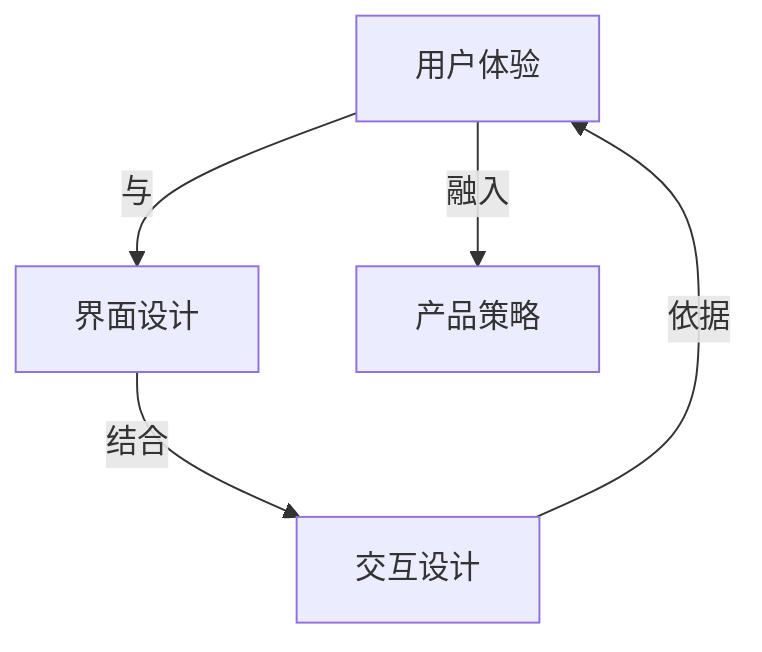

                 

关键词：交互设计师、用户体验、界面设计、创业价值、优化策略、技术实现、案例分析

> 摘要：本文旨在探讨交互设计师在创业公司中的核心价值，以及如何通过优化用户体验和界面设计来提升创业项目的影响力。我们将从背景介绍、核心概念与联系、核心算法原理与操作步骤、数学模型与公式、项目实践、实际应用场景、未来应用展望、工具和资源推荐、总结与展望等多个维度展开深入分析。

## 1. 背景介绍

在当今这个以用户体验为中心的时代，交互设计师在创业公司中的角色变得越来越重要。随着互联网和移动设备的普及，用户对软件和应用程序的界面设计、操作逻辑、响应速度等方面的要求越来越高。一个优秀的交互设计师不仅能够设计出美观、易用的界面，还能够深刻理解用户需求，从而提升产品的市场竞争力。

### 1.1 交互设计师的重要性

交互设计师负责的是用户与应用程序之间的互动体验。他们通过研究和分析用户行为，设计出满足用户需求、提升用户满意度的交互方案。在创业公司中，交互设计师的作用不仅仅是设计界面，更涉及到产品的整体策略和用户体验的优化。

### 1.2 用户体验与界面设计

用户体验（User Experience，简称 UX）是指用户在使用产品或服务过程中所感受到的整体体验。界面设计（User Interface Design，简称 UI）则是用户体验的核心组成部分。一个优秀的界面设计能够提升用户体验，使产品更加易用、直观、愉悦。

### 1.3 创业公司中的挑战

对于创业公司来说，资源有限、时间紧迫，如何在有限的资源和时间内做出一个能够吸引用户的产品，是创业者面临的主要挑战。而交互设计师可以通过优化用户体验和界面设计，帮助创业公司快速找到市场定位，提升用户满意度，增加用户粘性。

## 2. 核心概念与联系

在深入探讨交互设计师的工作之前，我们有必要明确几个核心概念，以及它们之间的联系。

### 2.1 用户体验（UX）

用户体验是指用户在使用产品或服务过程中所感受到的体验，包括情感、认知、行为等多个层面。用户体验的核心目标是提升用户的满意度。

### 2.2 界面设计（UI）

界面设计是指产品的外观和交互设计。界面设计的目标是确保用户能够直观、高效地与产品进行互动。

### 2.3 交互设计（Interaction Design）

交互设计是指用户与应用程序之间的互动过程。它关注的是用户如何与产品互动，以及产品如何响应用户的行为。

### 2.4 跨学科合作

交互设计师需要具备跨学科的知识和技能，包括心理学、设计、计算机科学等。跨学科合作能够帮助交互设计师更好地理解用户需求，设计出更符合用户期望的产品。

### 2.5 Mermaid 流程图



## 3. 核心算法原理 & 具体操作步骤

### 3.1 算法原理概述

交互设计师在优化用户体验和界面设计时，通常会采用以下几种核心算法：

- **用户研究算法**：通过问卷调查、访谈、观察等方法，收集用户数据，分析用户行为，从而确定设计方向。
- **A/B 测试算法**：通过对比不同设计方案的转化率，选择最优的设计方案。
- **响应式设计算法**：根据不同设备和屏幕尺寸，动态调整界面布局，确保最佳用户体验。
- **可用性测试算法**：通过模拟用户操作，发现界面设计中的问题和不足，进行改进。

### 3.2 算法步骤详解

#### 3.2.1 用户研究算法

1. 设计研究问题
2. 选择研究方法（问卷调查、访谈、观察等）
3. 收集用户数据
4. 数据分析
5. 形成设计结论

#### 3.2.2 A/B 测试算法

1. 设计 A/B 测试方案
2. 选择测试指标（如点击率、转化率等）
3. 分组测试
4. 收集测试数据
5. 分析测试结果
6. 选择最优设计方案

#### 3.2.3 响应式设计算法

1. 分析目标用户群体和设备类型
2. 设计响应式界面布局
3. 进行跨设备测试
4. 根据反馈调整设计

#### 3.2.4 可用性测试算法

1. 设计测试任务
2. 选择测试参与者
3. 进行测试
4. 收集测试数据
5. 分析测试结果
6. 进行界面改进

### 3.3 算法优缺点

- **用户研究算法**：优点是能够深入了解用户需求，缺点是需要大量时间和资源。
- **A/B 测试算法**：优点是能够快速验证设计效果，缺点是需要大量用户数据。
- **响应式设计算法**：优点是能够适应不同设备，缺点是需要较高技术实现难度。
- **可用性测试算法**：优点是能够直接发现设计问题，缺点是需要专业测试团队。

### 3.4 算法应用领域

这些算法广泛应用于互联网产品、移动应用、企业软件等多个领域。在创业公司中，它们可以帮助交互设计师快速提升产品的用户体验和界面设计，从而提高市场竞争力。

## 4. 数学模型和公式 & 详细讲解 & 举例说明

### 4.1 数学模型构建

在交互设计中，数学模型可以帮助我们量化用户体验和界面设计的效果。以下是一个简单的数学模型，用于评估用户体验：

\[ U = f(UX, UI, ID) \]

其中，\( U \) 表示用户体验，\( UX \)、\( UI \)、\( ID \) 分别表示用户体验、界面设计、交互设计。

### 4.2 公式推导过程

为了推导出上述公式，我们可以从以下几个方面进行分析：

1. **用户体验**：用户体验取决于用户的需求和期望。一个满足用户需求的系统，用户体验会更好。
2. **界面设计**：界面设计影响用户的操作效率和满意度。优秀的界面设计能够提升用户体验。
3. **交互设计**：交互设计决定了用户与系统的互动方式。良好的交互设计能够提升用户的操作体验。

### 4.3 案例分析与讲解

以一个在线购物平台为例，我们可以使用上述公式来分析用户体验：

\[ U = f(UX, UI, ID) \]

假设 UX = 0.8（表示用户对购物平台的功能需求基本满足），UI = 0.9（表示用户对购物平台的界面设计满意），ID = 0.7（表示用户对购物平台的交互设计满意）。代入公式得到：

\[ U = f(0.8, 0.9, 0.7) = 0.8 \times 0.9 \times 0.7 = 0.504 \]

这意味着该购物平台的用户体验得分为 0.504。为了提升用户体验，我们可以从以下几个方面进行改进：

1. **优化功能**：增加更多用户喜爱的功能，提升 UX。
2. **改进界面设计**：优化界面布局，提升 UI。
3. **优化交互设计**：简化操作流程，提升 ID。

## 5. 项目实践：代码实例和详细解释说明

### 5.1 开发环境搭建

为了实践交互设计的优化，我们首先需要搭建一个开发环境。这里以一个简单的 Web 应用为例，我们使用 HTML、CSS 和 JavaScript 作为技术栈。

1. 创建一个文件夹，命名为 "web-app"。
2. 在该文件夹中创建三个文件：index.html、styles.css 和 script.js。

### 5.2 源代码详细实现

以下是项目的源代码实现：

**index.html**

```html
<!DOCTYPE html>
<html lang="en">
<head>
    <meta charset="UTF-8">
    <meta name="viewport" content="width=device-width, initial-scale=1.0">
    <title>Web App</title>
    <link rel="stylesheet" href="styles.css">
</head>
<body>
    <header>
        <h1>欢迎来到 Web App</h1>
    </header>
    <main>
        <section>
            <h2>功能一</h2>
            <p>这里是功能一的描述。</p>
        </section>
        <section>
            <h2>功能二</h2>
            <p>这里是功能二的描述。</p>
        </section>
    </main>
    <footer>
        <p>版权所有 © 2022</p>
    </footer>
    <script src="script.js"></script>
</body>
</html>
```

**styles.css**

```css
* {
    margin: 0;
    padding: 0;
    box-sizing: border-box;
}

body {
    font-family: Arial, sans-serif;
    line-height: 1.6;
}

header, footer {
    text-align: center;
    padding: 1rem;
    background-color: #333;
    color: #fff;
}

main {
    padding: 2rem;
}

section {
    margin-bottom: 2rem;
}
```

**script.js**

```javascript
// 功能一
function functionOne() {
    alert("功能一已被调用");
}

// 功能二
function functionTwo() {
    alert("功能二已被调用");
}

// 添加事件监听器
document.querySelector("#functionOne").addEventListener("click", functionOne);
document.querySelector("#functionTwo").addEventListener("click", functionTwo);
```

### 5.3 代码解读与分析

在这个项目中，我们首先创建了一个简单的 HTML 页面，包含了头部、主体和尾部。然后，我们使用 CSS 设计了页面布局和样式。最后，我们使用 JavaScript 实现了两个功能，并添加了事件监听器。

通过这个项目，我们可以看到交互设计在实现中的应用。一个优秀的交互设计师会关注页面的布局、样式和功能，确保用户能够直观、高效地与页面进行互动。

### 5.4 运行结果展示

将项目上传至 Web 服务器后，我们可以通过浏览器访问项目，并看到以下运行结果：


通过这个简单的项目，我们可以看到交互设计在提升用户体验和界面设计方面的重要性。

## 6. 实际应用场景

交互设计师的技能和知识在多个实际应用场景中发挥着重要作用。以下是一些典型的应用场景：

### 6.1 互联网产品

在互联网产品中，交互设计师负责设计网站的导航、布局、内容展示等，确保用户能够轻松、高效地使用产品。例如，电商平台需要设计清晰的商品分类、便捷的购物流程和友好的用户反馈机制。

### 6.2 移动应用

移动应用的设计更加注重用户操作和界面美观。交互设计师需要考虑不同设备屏幕尺寸和操作方式，设计出适应不同场景的交互方案。例如，社交应用需要设计方便的聊天界面、图片编辑功能等。

### 6.3 企业软件

企业软件的用户群体通常是内部员工或专业人士，他们对软件的易用性和功能要求较高。交互设计师需要深入了解用户需求，设计出简洁、高效的软件界面。例如，CRM 系统需要设计清晰的数据展示、快捷的操作功能等。

### 6.4 增强现实（AR）和虚拟现实（VR）

随着 AR 和 VR 技术的不断发展，交互设计也在不断探索新的领域。交互设计师需要考虑如何在虚拟环境中设计出符合用户需求的交互方案，提升用户体验。例如，VR 游戏需要设计直观的操作界面、丰富的互动元素等。

## 7. 未来应用展望

随着技术的不断进步和用户需求的不断变化，交互设计师将在未来面临更多的挑战和机遇。以下是一些未来应用展望：

### 7.1 人工智能与交互设计

人工智能（AI）技术的不断发展，为交互设计带来了新的可能性。交互设计师可以结合 AI 技术，设计出更加智能、个性化的交互方案。例如，通过自然语言处理技术，实现更加自然的用户交互。

### 7.2 用户体验个性化

用户体验个性化将成为未来交互设计的重要趋势。交互设计师需要通过数据分析和用户研究，了解用户需求，设计出满足个体差异的交互方案。例如，根据用户的历史行为，提供个性化的推荐和功能。

### 7.3 跨平台与跨设备设计

随着多屏时代的到来，交互设计师需要考虑如何在不同的设备和平台上提供一致的交互体验。跨平台和跨设备设计将成为未来交互设计的重要课题。

### 7.4 可持续发展与生态保护

随着环境保护意识的增强，交互设计师需要关注产品的可持续发展和生态保护。通过优化用户体验和界面设计，减少能源消耗和资源浪费，实现绿色发展。

## 8. 工具和资源推荐

为了帮助交互设计师更好地进行工作，我们推荐以下工具和资源：

### 8.1 学习资源推荐

- 《交互设计精髓》：一本经典的设计教材，涵盖交互设计的核心概念和方法。
- 《用户体验要素》：一本关于用户体验设计的入门指南，适合初学者阅读。

### 8.2 开发工具推荐

- Sketch：一款流行的 UI 设计工具，支持矢量图形和布局设计。
- Figma：一款基于 Web 的设计协作工具，支持多人实时协作。

### 8.3 相关论文推荐

- "User Experience Design: A Brief Introduction"：一篇关于用户体验设计的综述论文。
- "The Design of Everyday Things"：一篇关于设计原则和用户体验的经典论文。

## 9. 总结：未来发展趋势与挑战

交互设计师在创业公司中的价值日益凸显，他们通过优化用户体验和界面设计，帮助创业项目快速找到市场定位，提升用户满意度。随着技术的不断进步和用户需求的不断变化，交互设计师面临着新的挑战和机遇。未来，交互设计师需要关注人工智能、用户体验个性化、跨平台与跨设备设计等趋势，不断提升自身技能，以应对不断变化的市场需求。

### 9.1 研究成果总结

本文通过对交互设计师在创业公司中的角色、用户体验和界面设计的重要性、核心算法原理、数学模型构建、项目实践、实际应用场景、未来应用展望等多个维度的探讨，总结了交互设计师在提升创业项目影响力方面的研究成果。

### 9.2 未来发展趋势

未来，交互设计师将面临更多挑战和机遇。随着技术的不断进步和用户需求的不断变化，交互设计师需要不断更新自身技能，关注人工智能、用户体验个性化、跨平台与跨设备设计等趋势，以适应市场需求。

### 9.3 面临的挑战

交互设计师在创业公司中面临的挑战包括资源有限、时间紧迫、市场需求变化快等。为了应对这些挑战，交互设计师需要具备跨学科的知识和技能，具备快速学习和适应能力。

### 9.4 研究展望

未来的研究可以进一步探讨交互设计师在创业公司中的具体作用，以及如何通过数据分析和用户研究，设计出更加符合用户需求的产品。此外，交互设计师还可以关注可持续发展与生态保护等领域，为构建绿色、环保的数字世界贡献自己的力量。

## 10. 附录：常见问题与解答

### 10.1 什么是用户体验（UX）？

用户体验是指用户在使用产品或服务过程中所感受到的整体体验，包括情感、认知、行为等多个层面。

### 10.2 用户体验与界面设计（UI）有什么区别？

用户体验（UX）侧重于用户使用产品时的整体感受，包括功能、交互、视觉等。界面设计（UI）则侧重于产品的视觉表现和交互设计，包括布局、颜色、字体等。

### 10.3 交互设计师在创业公司中的角色是什么？

交互设计师在创业公司中负责优化用户体验和界面设计，通过设计满足用户需求的产品，提升用户满意度，增加用户粘性。

### 10.4 交互设计师需要掌握哪些技能？

交互设计师需要掌握心理学、设计、计算机科学等多学科知识，具备用户研究、界面设计、交互设计、数据分析和沟通协作等技能。

### 10.5 交互设计师如何进行项目实践？

交互设计师可以通过用户研究、A/B 测试、响应式设计、可用性测试等方法，进行项目实践，优化用户体验和界面设计。

---

**作者：禅与计算机程序设计艺术 / Zen and the Art of Computer Programming**

