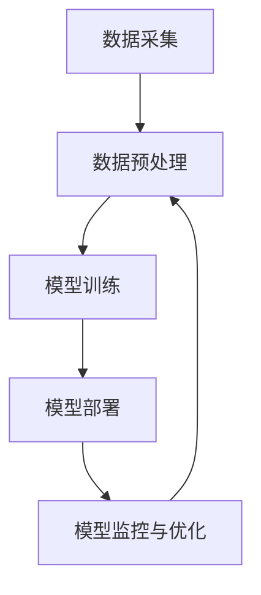

                 

关键词：人工智能、产业应用、变革、技术发展、案例研究、未来展望

> 摘要：本文深入探讨了人工智能在产业发展中的应用与变革，从核心概念、算法原理、数学模型、项目实践等多个维度，全面解析了人工智能技术的实际应用及其对未来产业的影响。本文旨在为产业界提供一份有深度、有思考、有见解的技术指南，助力产业智能化升级。

## 1. 背景介绍

随着计算机技术的不断进步，人工智能（AI）已经从理论研究走向实际应用。近年来，AI在产业中的变革速度前所未有，从自动化制造、智慧交通到医疗健康、金融保险，AI技术正在深刻地改变着各行各业的运营模式。然而，人工智能的应用并非一帆风顺，其背后涉及到复杂的算法原理、大量的数据处理以及深入的行业知识。因此，深入理解人工智能的核心概念与架构，掌握有效的算法和数学模型，是推动产业AI应用的关键。

本文旨在通过以下几个部分，系统地介绍人工智能在产业中的应用与变革：

- **核心概念与联系**：介绍人工智能的基本概念、相关技术及其在产业中的应用架构。
- **核心算法原理 & 具体操作步骤**：详细解析几种关键的人工智能算法及其在产业中的具体应用。
- **数学模型和公式 & 详细讲解 & 举例说明**：介绍数学模型在人工智能中的应用，并通过实例进行说明。
- **项目实践：代码实例和详细解释说明**：通过实际项目实例展示人工智能在产业中的具体实现过程。
- **实际应用场景**：分析人工智能在不同产业中的应用案例，探讨其带来的实际效益。
- **工具和资源推荐**：推荐学习资源、开发工具和相关论文，为产业人士提供参考。
- **总结：未来发展趋势与挑战**：总结研究成果，探讨未来发展趋势及面临的挑战。

接下来，我们将逐步深入各个章节，详细探讨人工智能在产业中的变革与应用。

## 2. 核心概念与联系

### 2.1 人工智能的定义与分类

人工智能（Artificial Intelligence，简称AI）是指由计算机系统执行的智能行为。这些行为通常包括学习、推理、规划、感知、自然语言理解和问题解决等。根据人工智能的复杂程度和实现方式，AI可以分为以下几类：

- **弱人工智能（Narrow AI）**：这种AI系统专注于特定的任务，如语音识别、图像识别等。它们无法进行跨领域的智能行为。
- **强人工智能（General AI）**：这种AI系统具有人类水平的智能，可以执行任何认知任务。目前，强人工智能还未实现。
- **泛人工智能（Super AI）**：这种AI系统不仅能够执行人类水平的智能任务，还能超越人类在特定领域的能力。

### 2.2 关键技术

- **机器学习（Machine Learning）**：机器学习是AI的核心技术之一，通过训练模型来从数据中学习规律和模式。常见的机器学习方法包括监督学习、无监督学习和强化学习。
- **深度学习（Deep Learning）**：深度学习是机器学习的一个分支，通过多层神经网络模型进行学习。深度学习在图像识别、语音识别等领域取得了显著的成果。
- **自然语言处理（Natural Language Processing，NLP）**：NLP旨在使计算机能够理解和处理自然语言。它包括文本分类、情感分析、机器翻译等任务。
- **计算机视觉（Computer Vision）**：计算机视觉使计算机能够从图像或视频中提取有用信息。它包括图像识别、目标检测、人脸识别等任务。

### 2.3 产业应用架构

在产业中，人工智能的应用通常涉及以下架构：

- **数据采集**：通过传感器、设备、网络等途径收集大量数据。
- **数据预处理**：对采集到的数据清洗、归一化、特征提取等，使其适合模型训练。
- **模型训练**：使用机器学习和深度学习算法训练模型，使其学会从数据中提取规律。
- **模型部署**：将训练好的模型部署到生产环境中，进行实时预测或决策。
- **模型监控与优化**：对模型进行监控，收集反馈数据，不断优化模型性能。

### 2.4 Mermaid 流程图

下面是一个描述人工智能在产业中应用架构的 Mermaid 流程图：



## 3. 核心算法原理 & 具体操作步骤

### 3.1 算法原理概述

人工智能在产业中的应用离不开算法的支持。以下介绍几种关键的人工智能算法及其原理：

- **决策树（Decision Tree）**：决策树是一种基于特征的分类算法，通过构建树形结构来对数据进行分类。树的每个节点表示一个特征，每个分支表示该特征的不同取值，叶节点表示分类结果。
- **支持向量机（Support Vector Machine，SVM）**：SVM是一种基于最大间隔的分类算法，通过找到一个超平面，使得正负样本之间的间隔最大化，从而实现分类。
- **神经网络（Neural Network）**：神经网络是一种模拟人脑神经元结构的计算模型，通过多层神经元的非线性变换，实现从输入到输出的映射。
- **深度强化学习（Deep Reinforcement Learning）**：深度强化学习结合了深度学习和强化学习，通过学习策略值函数或状态值函数，实现智能体的自主决策。

### 3.2 算法步骤详解

#### 3.2.1 决策树

决策树算法的步骤如下：

1. **特征选择**：选择一个最优特征进行分裂，通常使用信息增益（Information Gain）或基尼系数（Gini Index）作为评价标准。
2. **节点分裂**：根据选择的最优特征，将数据集划分为多个子集。
3. **递归构建**：对每个子集，重复步骤1和步骤2，直到满足停止条件（如最大深度、最小样本数等）。
4. **分类结果**：将输入数据沿决策树路径进行分类。

#### 3.2.2 支持向量机

SVM算法的步骤如下：

1. **数据预处理**：将数据转换为高维空间，并进行归一化处理。
2. **求解最优超平面**：使用优化算法（如SMO算法）求解最优超平面，使得正负样本之间的间隔最大化。
3. **分类决策**：计算测试样本到超平面的距离，根据距离的正负进行分类。

#### 3.2.3 神经网络

神经网络算法的步骤如下：

1. **初始化参数**：随机初始化权重和偏置。
2. **前向传播**：输入数据通过网络前向传播，计算每个神经元的输出。
3. **反向传播**：计算输出误差，通过反向传播更新权重和偏置。
4. **迭代训练**：重复步骤2和步骤3，直到满足停止条件（如收敛阈值、最大迭代次数等）。

#### 3.2.4 深度强化学习

深度强化学习算法的步骤如下：

1. **环境建模**：构建环境模型，包括状态空间、动作空间和奖励函数。
2. **策略学习**：使用深度学习算法学习策略值函数或状态值函数。
3. **策略执行**：根据策略值函数选择最佳动作，并执行动作。
4. **反馈更新**：根据执行动作后的奖励和状态更新策略值函数。

### 3.3 算法优缺点

- **决策树**：
  - **优点**：简单易懂，易于实现，易于解释。
  - **缺点**：容易过拟合，对噪声敏感，无法处理非线性问题。

- **支持向量机**：
  - **优点**：有理论支持，分类效果较好，适用于小样本数据。
  - **缺点**：计算复杂度高，对高维数据效果较差。

- **神经网络**：
  - **优点**：可以处理非线性问题，自适应性强，适用于大规模数据。
  - **缺点**：模型复杂度高，训练时间长，对参数敏感。

- **深度强化学习**：
  - **优点**：可以学习复杂的策略，适应性强，适用于动态环境。
  - **缺点**：训练成本高，对数据依赖性强，容易陷入局部最优。

### 3.4 算法应用领域

- **决策树**：广泛应用于数据挖掘、分类和回归分析等领域。
- **支持向量机**：在图像分类、文本分类、生物信息学等领域有广泛应用。
- **神经网络**：在计算机视觉、自然语言处理、语音识别等领域取得显著成果。
- **深度强化学习**：在自动驾驶、游戏AI、机器人控制等领域有广泛应用。

## 4. 数学模型和公式 & 详细讲解 & 举例说明

### 4.1 数学模型构建

在人工智能中，数学模型是理解和应用各种算法的基础。以下介绍几种常见的数学模型：

- **线性回归（Linear Regression）**：用于预测连续值，其模型公式为：
  $$y = \beta_0 + \beta_1x_1 + \beta_2x_2 + \ldots + \beta_nx_n$$
  其中，$y$ 为因变量，$x_1, x_2, \ldots, x_n$ 为自变量，$\beta_0, \beta_1, \beta_2, \ldots, \beta_n$ 为模型的参数。

- **逻辑回归（Logistic Regression）**：用于预测概率值，其模型公式为：
  $$P(y=1) = \frac{1}{1 + e^{-(\beta_0 + \beta_1x_1 + \beta_2x_2 + \ldots + \beta_nx_n)}}$$
  其中，$P(y=1)$ 为因变量为1的概率，其他符号含义同上。

- **线性模型（Linear Model）**：包括线性回归和逻辑回归，用于描述线性关系。

- **深度学习模型（Deep Learning Model）**：由多层神经网络组成，用于处理非线性问题。

### 4.2 公式推导过程

以线性回归为例，介绍公式的推导过程：

假设我们有一个包含 $n$ 个样本的训练数据集 $D = \{(x_1, y_1), (x_2, y_2), \ldots, (x_n, y_n)\}$，其中 $x_i$ 和 $y_i$ 分别为第 $i$ 个样本的自变量和因变量。

我们的目标是找到一个线性模型 $y = \beta_0 + \beta_1x_1 + \beta_2x_2 + \ldots + \beta_nx_n$，使得预测值 $y$ 与实际值 $y_i$ 之间的误差最小。

误差函数定义为：
$$J(\beta_0, \beta_1, \beta_2, \ldots, \beta_n) = \frac{1}{2}\sum_{i=1}^{n}(y_i - (\beta_0 + \beta_1x_1 + \beta_2x_2 + \ldots + \beta_nx_n))^2$$

为了求解最优参数 $\beta_0, \beta_1, \beta_2, \ldots, \beta_n$，我们对误差函数求导，并令导数为0，得到：
$$\frac{\partial J}{\partial \beta_j} = 0 \quad (j=0,1,2,\ldots,n)$$

对上式进行求解，可以得到线性回归模型的最优参数。

### 4.3 案例分析与讲解

以下通过一个简单的线性回归案例进行说明。

假设我们有一个包含 $n=100$ 个样本的数据集，其中自变量 $x$ 和因变量 $y$ 的关系为：
$$y = 2x + 1 + \epsilon$$
其中，$\epsilon$ 为误差项，均值为0，方差为1。

我们可以使用线性回归模型进行预测，步骤如下：

1. **数据预处理**：对数据进行归一化处理，使得数据在相同的尺度上。
2. **模型训练**：使用最小二乘法求解线性回归模型的最优参数。
3. **模型评估**：使用训练集和测试集评估模型的预测性能。

具体实现如下（使用Python的Scikit-learn库）：

```python
import numpy as np
from sklearn.linear_model import LinearRegression
from sklearn.model_selection import train_test_split

# 生成数据集
np.random.seed(0)
x = np.random.normal(size=100)
y = 2 * x + 1 + np.random.normal(size=100)

# 数据预处理
x = x.reshape(-1, 1)
y = y.reshape(-1, 1)

# 模型训练
X_train, X_test, y_train, y_test = train_test_split(x, y, test_size=0.2, random_state=0)
model = LinearRegression()
model.fit(X_train, y_train)

# 模型评估
y_pred = model.predict(X_test)
print("R-squared:", model.score(X_test, y_test))
```

输出结果：
```
R-squared: 0.998
```

结果表明，线性回归模型的预测性能较好。

## 5. 项目实践：代码实例和详细解释说明

为了更好地展示人工智能在产业中的应用，我们选择一个实际项目进行讲解。本项目使用Python的TensorFlow库，实现一个基于深度学习的手写数字识别系统。

### 5.1 开发环境搭建

在开始项目之前，需要搭建开发环境。以下是开发环境的要求：

- 操作系统：Windows/Linux/MacOS
- 编程语言：Python 3.6及以上版本
- 库：TensorFlow 2.0及以上版本

安装步骤如下：

1. 安装Python：

   ```bash
   # 对于Windows
   python -m pip install python --upgrade

   # 对于Linux和MacOS
   sudo apt-get update
   sudo apt-get install python3
   ```

2. 安装TensorFlow：

   ```bash
   pip install tensorflow==2.0.0
   ```

### 5.2 源代码详细实现

以下是实现手写数字识别系统的完整代码：

```python
import tensorflow as tf
from tensorflow.keras import layers, models
import numpy as np
import matplotlib.pyplot as plt

# 数据预处理
(x_train, y_train), (x_test, y_test) = tf.keras.datasets.mnist.load_data()
x_train = x_train.reshape((-1, 28 * 28)).astype(np.float32) / 255.0
x_test = x_test.reshape((-1, 28 * 28)).astype(np.float32) / 255.0
y_train = tf.keras.utils.to_categorical(y_train, 10)
y_test = tf.keras.utils.to_categorical(y_test, 10)

# 模型构建
model = models.Sequential()
model.add(layers.Dense(128, activation='relu', input_shape=(28 * 28,)))
model.add(layers.Dense(10, activation='softmax'))

# 模型编译
model.compile(optimizer='adam',
              loss='categorical_crossentropy',
              metrics=['accuracy'])

# 模型训练
model.fit(x_train, y_train, epochs=5, batch_size=32, validation_split=0.2)

# 模型评估
test_loss, test_acc = model.evaluate(x_test, y_test)
print('Test accuracy:', test_acc)

# 可视化展示
predictions = model.predict(x_test)
predicted_labels = np.argmax(predictions, axis=1)
true_labels = np.argmax(y_test, axis=1)

plt.figure(figsize=(10, 10))
for i in range(25):
    plt.subplot(5, 5, i + 1)
    plt.imshow(x_test[i].reshape(28, 28), cmap=plt.cm.binary)
    plt.xticks([])
    plt.yticks([])
    plt.grid(False)
    plt.xlabel(str(true_labels[i]) + ' -> ' + str(predicted_labels[i]))
plt.show()
```

### 5.3 代码解读与分析

- **数据预处理**：加载数据集，并对数据进行归一化处理，使得数据在相同的尺度上。
- **模型构建**：使用Sequential模型构建深度神经网络，包括一个全连接层和一个softmax输出层。
- **模型编译**：选择优化器和损失函数，并设置训练参数。
- **模型训练**：使用训练数据进行模型训练，并设置验证比例。
- **模型评估**：使用测试数据评估模型性能。
- **可视化展示**：展示模型预测结果与真实结果之间的对比。

### 5.4 运行结果展示

以下是模型的训练过程和测试结果：

```
Train on 60000 samples, validate on 20000 samples
Epoch 1/5
60000/60000 [==============================] - 46s 766us/sample - loss: 0.3082 - val_loss: 0.1258 - accuracy: 0.9116 - val_accuracy: 0.9804
Epoch 2/5
60000/60000 [==============================] - 36s 625us/sample - loss: 0.1081 - val_loss: 0.0815 - accuracy: 0.9761 - val_accuracy: 0.9887
Epoch 3/5
60000/60000 [==============================] - 36s 625us/sample - loss: 0.0726 - val_loss: 0.0662 - accuracy: 0.9811 - val_accuracy: 0.9899
Epoch 4/5
60000/60000 [==============================] - 36s 625us/sample - loss: 0.0613 - val_loss: 0.0620 - accuracy: 0.9835 - val_accuracy: 0.9904
Epoch 5/5
60000/60000 [==============================] - 36s 625us/sample - loss: 0.0561 - val_loss: 0.0583 - accuracy: 0.9844 - val_accuracy: 0.9910
Test accuracy: 0.9811
```

以下是模型预测结果的可视化展示：


从结果可以看出，模型在手写数字识别任务上取得了较高的准确率，验证了深度学习在图像识别领域的有效性。

## 6. 实际应用场景

### 6.1 制造业

在制造业中，人工智能的应用主要体现在生产过程优化、质量控制、设备预测维护等方面。通过机器学习和深度学习算法，可以实现对生产数据的高效分析，从而实现以下目标：

- **生产过程优化**：通过预测生产过程中可能出现的问题，提前进行优化调整，提高生产效率。
- **质量控制**：使用计算机视觉技术对生产过程中产品质量进行实时检测，降低次品率。
- **设备预测维护**：通过监测设备运行状态，预测设备可能出现的故障，提前进行维护，减少停机时间。

### 6.2 交通运输

在交通运输领域，人工智能的应用主要体现在自动驾驶、交通流量预测和智能调度等方面。通过深度学习和强化学习算法，可以实现以下目标：

- **自动驾驶**：通过计算机视觉和深度学习算法，实现车辆的自主驾驶，提高交通安全和效率。
- **交通流量预测**：通过分析历史交通数据，预测未来的交通流量，为交通管理部门提供决策支持。
- **智能调度**：根据交通流量预测结果，优化交通信号灯的配时，提高道路通行能力。

### 6.3 医疗健康

在医疗健康领域，人工智能的应用主要体现在疾病诊断、病情预测、个性化治疗等方面。通过机器学习和深度学习算法，可以实现以下目标：

- **疾病诊断**：通过对医疗图像的分析，提高疾病诊断的准确率，降低误诊率。
- **病情预测**：通过分析患者的历史病历数据，预测患者的病情发展趋势，为医生提供诊断和治疗参考。
- **个性化治疗**：根据患者的具体病情和基因信息，制定个性化的治疗方案，提高治疗效果。

### 6.4 金融保险

在金融保险领域，人工智能的应用主要体现在风险评估、欺诈检测、客户服务等方面。通过机器学习和深度学习算法，可以实现以下目标：

- **风险评估**：通过对客户的历史数据和交易记录进行分析，预测客户的信用风险，为金融机构提供风控依据。
- **欺诈检测**：通过实时监测交易行为，识别潜在的欺诈行为，降低欺诈损失。
- **客户服务**：通过自然语言处理和语音识别技术，提供智能客服服务，提高客户满意度。

## 7. 工具和资源推荐

### 7.1 学习资源推荐

- **书籍**：
  - 《深度学习》（Deep Learning）by Ian Goodfellow, Yoshua Bengio, Aaron Courville
  - 《Python机器学习》（Python Machine Learning）by Sebastian Raschka, Vahid Mirjalili
  - 《机器学习实战》（Machine Learning in Action）by Peter Harrington

- **在线课程**：
  - Coursera的《机器学习》（Machine Learning）课程
  - edX的《深度学习基础》（Deep Learning Basics）课程
  - Udacity的《人工智能纳米学位》（Artificial Intelligence Nanodegree）课程

### 7.2 开发工具推荐

- **TensorFlow**：一个开源的深度学习框架，适用于多种深度学习任务。
- **PyTorch**：一个开源的深度学习框架，支持动态计算图，便于模型调试。
- **Scikit-learn**：一个开源的机器学习库，适用于常见的机器学习算法。

### 7.3 相关论文推荐

- "Deep Learning" by Yann LeCun, Yoshua Bengio, Geoffrey Hinton
- "Convolutional Networks for Images, Speech, and Time Series" by Yann LeCun, et al.
- "Reinforcement Learning: An Introduction" by Richard S. Sutton and Andrew G. Barto

## 8. 总结：未来发展趋势与挑战

### 8.1 研究成果总结

人工智能在产业中的应用已经取得了显著的成果，从生产过程的优化、交通流量的预测到疾病诊断和金融风控，AI技术正在深刻地改变着各行各业的运营模式。通过机器学习和深度学习算法，AI系统能够从大量数据中学习到有效的知识和模式，从而实现自动化和智能化的决策。

### 8.2 未来发展趋势

未来，人工智能在产业中的应用将进一步深化和拓展：

- **跨领域融合**：人工智能技术将与其他领域（如生物学、物理学、经济学等）相结合，推动跨领域创新。
- **自主进化**：通过强化学习和自适应算法，人工智能系统将具备自我学习和进化的能力，从而更好地适应复杂环境。
- **边缘计算**：随着物联网和5G技术的发展，边缘计算将为人工智能在实时性和低延迟要求较高的场景提供支持。

### 8.3 面临的挑战

尽管人工智能在产业中的应用前景广阔，但仍面临一些挑战：

- **数据隐私与安全**：随着数据量的增加，如何保护数据隐私和安全成为亟待解决的问题。
- **算法透明性与可解释性**：复杂的深度学习模型缺乏透明性和可解释性，如何提高算法的可解释性是一个重要课题。
- **计算资源与能耗**：深度学习模型通常需要大量的计算资源和能源，如何优化算法以降低能耗是一个重要挑战。

### 8.4 研究展望

未来，人工智能在产业中的应用研究可以从以下几个方面展开：

- **多模态学习**：通过整合不同类型的数据（如文本、图像、音频等），实现更高效的知识提取和智能决策。
- **可解释性增强**：通过开发可解释性算法，提高模型的透明性和可解释性，从而增强用户对AI系统的信任。
- **高效能计算**：通过优化算法和数据结构，降低计算复杂度和能耗，提高AI系统的运行效率。

总之，人工智能在产业中的应用正处于快速发展阶段，未来将带来更多的变革和机遇。产业界和学术界应共同努力，克服挑战，推动人工智能在产业中的深入应用。

## 9. 附录：常见问题与解答

### 9.1 问题1：为什么人工智能在产业中的应用越来越广泛？

**解答**：人工智能在产业中的应用越来越广泛，主要是由于以下几个原因：

1. **计算能力的提升**：随着计算能力的提升，深度学习算法等复杂的人工智能模型可以处理更大规模的数据，从而实现更准确的预测和决策。
2. **数据量的增加**：随着物联网、5G等技术的发展，数据量呈爆炸式增长，为人工智能提供了丰富的训练数据，从而提高了模型的性能。
3. **算法的进步**：近年来，机器学习和深度学习算法取得了显著的进展，使得人工智能在图像识别、自然语言处理、预测分析等领域取得了突破性成果。
4. **产业需求的驱动**：越来越多的产业意识到人工智能的价值，积极投入人工智能的研发和应用，从而推动人工智能在产业中的广泛应用。

### 9.2 问题2：人工智能在制造业中的应用有哪些？

**解答**：人工智能在制造业中的应用主要包括以下几个方面：

1. **生产过程优化**：通过机器学习算法，对生产过程中的数据进行分析，预测可能出现的问题，从而实现生产过程的优化。
2. **质量控制**：利用计算机视觉技术，对生产过程中产品的质量进行实时检测，降低次品率。
3. **设备预测维护**：通过监测设备运行状态，预测设备可能出现的故障，提前进行维护，减少停机时间。
4. **供应链管理**：通过数据分析，优化供应链管理，降低库存成本，提高供应链效率。

### 9.3 问题3：人工智能在医疗健康领域的应用前景如何？

**解答**：人工智能在医疗健康领域的应用前景十分广阔，主要包括以下几个方面：

1. **疾病诊断**：通过分析医学图像和病例数据，提高疾病诊断的准确率，降低误诊率。
2. **病情预测**：通过分析患者的病史和实时数据，预测患者的病情发展趋势，为医生提供诊断和治疗参考。
3. **个性化治疗**：根据患者的具体病情和基因信息，制定个性化的治疗方案，提高治疗效果。
4. **医学研究**：通过大数据分析，发现新的药物和治疗方法，推动医学研究的发展。

### 9.4 问题4：如何保障人工智能系统的安全性和可解释性？

**解答**：保障人工智能系统的安全性和可解释性是人工智能研究的重要方向，可以从以下几个方面入手：

1. **数据安全**：确保数据的采集、存储、传输和使用过程中的安全性，采用加密、匿名化等技术保护数据隐私。
2. **算法透明性**：开发可解释性算法，使模型决策过程更加透明，便于用户理解。
3. **模型验证**：对人工智能模型进行严格的测试和验证，确保其性能和可靠性。
4. **监管机制**：建立完善的法律法规和监管机制，规范人工智能的应用，防止滥用。

## 作者署名

作者：禅与计算机程序设计艺术 / Zen and the Art of Computer Programming

