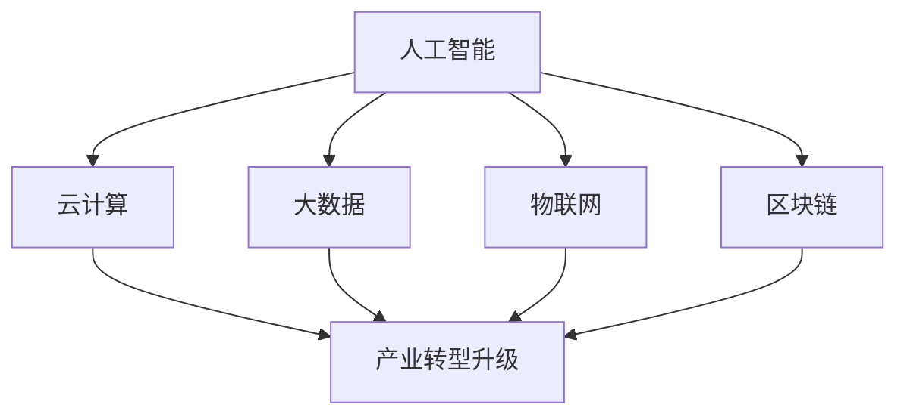

                 

关键词：产业转型升级、新质生产力、数字化转型、人工智能、云计算、大数据、物联网、区块链

> 摘要：本文深入探讨了产业转型升级中产生的新质生产力，包括人工智能、云计算、大数据、物联网和区块链等技术的应用，分析了这些技术如何推动产业变革，提高生产效率，创造新的经济增长点。通过实例和案例，本文展示了新质生产力在实际应用中的成效和前景，并提出了未来发展趋势和面临的挑战。

## 1. 背景介绍

在全球化和数字化的双重推动下，传统产业正面临前所未有的挑战。如何通过技术革新实现产业转型升级，已成为当前经济发展的重要议题。新质生产力作为一种创新性力量，正成为推动产业变革的核心动力。

新质生产力是指依托现代信息技术，特别是人工智能、云计算、大数据、物联网和区块链等新兴技术，实现生产要素的优化配置和产业结构的升级。与传统生产力相比，新质生产力具有更高的智能化、网络化和协同化特征，能够显著提高生产效率，降低成本，提升产品质量。

当前，全球范围内产业转型升级的趋势日益明显。以美国、德国、日本等为代表的发达国家，通过引入新质生产力，推动了制造业、服务业等多个领域的深刻变革。中国作为全球最大的制造业国家，也在积极推进产业转型升级，培育新质生产力，以应对国内外市场环境的变迁。

## 2. 核心概念与联系

新质生产力的核心概念包括人工智能、云计算、大数据、物联网和区块链。这些技术之间相互关联，共同构成了产业转型升级的技术基础。

### 2.1 人工智能

人工智能（AI）是指通过计算机程序模拟、延伸和扩展人的智能。在产业转型升级中，人工智能广泛应用于数据分析、决策支持、智能控制等领域。例如，通过人工智能技术，企业可以实现对生产过程的实时监控和优化，提高生产效率。

### 2.2 云计算

云计算是一种基于互联网的计算模式，通过虚拟化技术，将计算资源动态分配给用户。云计算为产业转型升级提供了强大的基础设施支持，使得企业能够灵活地获取和利用计算资源，降低成本。

### 2.3 大数据

大数据是指无法用传统数据处理工具进行高效处理的数据集合。在产业转型升级中，大数据技术可以挖掘海量数据中的价值，为企业决策提供数据支持。例如，通过大数据分析，企业可以了解市场趋势、用户需求，优化产品和服务。

### 2.4 物联网

物联网（IoT）是指通过互联网将各种物理设备连接起来，实现设备之间的信息交换和通信。物联网技术在产业转型升级中，可以实现对生产设备的实时监控和管理，提高生产效率。

### 2.5 区块链

区块链是一种分布式数据库技术，通过加密算法确保数据的不可篡改性和匿名性。在产业转型升级中，区块链技术可以用于供应链管理、金融服务等领域，提高交易效率和信任度。

#### 2.5.1  Mermaid 流程图

下面是一个关于新质生产力核心概念联系的 Mermaid 流程图：



## 3. 核心算法原理 & 具体操作步骤

### 3.1  算法原理概述

新质生产力的核心算法包括机器学习、深度学习、数据挖掘和智能优化等。这些算法通过模拟人类思维过程，实现对数据的分析和处理。

#### 3.1.1  机器学习

机器学习是一种通过算法自动从数据中学习规律和模式的技术。在产业转型升级中，机器学习可以用于预测市场趋势、优化生产计划等。

#### 3.1.2  深度学习

深度学习是一种基于多层神经网络的机器学习技术。深度学习在图像识别、语音识别等领域取得了显著成果，为产业转型升级提供了强大的技术支持。

#### 3.1.3  数据挖掘

数据挖掘是一种从海量数据中发现有用信息和知识的技术。在产业转型升级中，数据挖掘可以用于客户需求分析、产品优化等。

#### 3.1.4  智能优化

智能优化是一种基于人工智能技术的优化方法，可以用于解决生产调度、资源分配等问题。智能优化可以提高生产效率和资源利用率。

### 3.2  算法步骤详解

#### 3.2.1  机器学习算法步骤

1. 数据收集：收集相关领域的数据。
2. 数据预处理：对数据进行清洗、转换等预处理。
3. 特征提取：从数据中提取有用的特征。
4. 模型训练：使用训练数据对模型进行训练。
5. 模型评估：使用测试数据对模型进行评估。
6. 模型应用：将训练好的模型应用到实际问题中。

#### 3.2.2  深度学习算法步骤

1. 数据收集：收集相关领域的数据。
2. 数据预处理：对数据进行清洗、转换等预处理。
3. 网络构建：构建深度学习网络结构。
4. 模型训练：使用训练数据对模型进行训练。
5. 模型评估：使用测试数据对模型进行评估。
6. 模型应用：将训练好的模型应用到实际问题中。

#### 3.2.3  数据挖掘算法步骤

1. 数据收集：收集相关领域的数据。
2. 数据预处理：对数据进行清洗、转换等预处理。
3. 特征选择：选择有用的特征。
4. 模型构建：构建数据挖掘模型。
5. 模型评估：使用测试数据对模型进行评估。
6. 模型应用：将训练好的模型应用到实际问题中。

#### 3.2.4  智能优化算法步骤

1. 问题建模：将实际问题转化为数学模型。
2. 算法选择：选择合适的智能优化算法。
3. 模型训练：使用训练数据对模型进行训练。
4. 模型评估：使用测试数据对模型进行评估。
5. 模型应用：将训练好的模型应用到实际问题中。

### 3.3  算法优缺点

#### 3.3.1  机器学习

优点：能够自动从数据中学习规律，适用于大规模数据处理。

缺点：对数据质量和数据量有较高要求，模型解释性较差。

#### 3.3.2  深度学习

优点：具有强大的模型表达能力和学习能力。

缺点：模型复杂，训练过程耗时长，对数据量有较高要求。

#### 3.3.3  数据挖掘

优点：能够从海量数据中发现有用的信息和知识。

缺点：对数据质量和数据量有较高要求，模型解释性较差。

#### 3.3.4  智能优化

优点：能够解决复杂优化问题，提高生产效率和资源利用率。

缺点：算法复杂，计算成本高。

### 3.4  算法应用领域

#### 3.4.1  机器学习

应用领域：市场预测、金融分析、推荐系统等。

#### 3.4.2  深度学习

应用领域：图像识别、语音识别、自然语言处理等。

#### 3.4.3  数据挖掘

应用领域：客户需求分析、产品优化、风险控制等。

#### 3.4.4  智能优化

应用领域：生产调度、资源分配、供应链管理等。

## 4. 数学模型和公式 & 详细讲解 & 举例说明

### 4.1  数学模型构建

新质生产力的数学模型主要包括线性回归、逻辑回归、支持向量机（SVM）、神经网络等。

#### 4.1.1  线性回归

线性回归模型用于预测一个变量与一个或多个变量之间的线性关系。其公式为：

\[ y = \beta_0 + \beta_1x_1 + \beta_2x_2 + \ldots + \beta_nx_n \]

其中，\( y \) 为因变量，\( x_1, x_2, \ldots, x_n \) 为自变量，\( \beta_0, \beta_1, \beta_2, \ldots, \beta_n \) 为模型参数。

#### 4.1.2  逻辑回归

逻辑回归模型用于预测一个二分类变量与一个或多个变量之间的线性关系。其公式为：

\[ P(y=1) = \frac{1}{1 + e^{-(\beta_0 + \beta_1x_1 + \beta_2x_2 + \ldots + \beta_nx_n)}} \]

其中，\( P(y=1) \) 为因变量 \( y \) 等于 1 的概率，\( x_1, x_2, \ldots, x_n \) 为自变量，\( \beta_0, \beta_1, \beta_2, \ldots, \beta_n \) 为模型参数。

#### 4.1.3  支持向量机（SVM）

支持向量机模型用于分类和回归问题。其公式为：

\[ w \cdot x - b = 0 \]

其中，\( w \) 为权重向量，\( x \) 为特征向量，\( b \) 为偏置项。

#### 4.1.4  神经网络

神经网络模型用于复杂非线性问题的预测和分类。其公式为：

\[ a_{i,j} = \sigma(\beta_{i,j}^T x_j + \beta_{i,0}) \]

其中，\( a_{i,j} \) 为输出节点 \( i \) 的激活值，\( \sigma \) 为激活函数，\( \beta_{i,j} \) 为权重，\( x_j \) 为输入节点 \( j \) 的激活值，\( \beta_{i,0} \) 为偏置项。

### 4.2  公式推导过程

#### 4.2.1  线性回归

假设我们有 \( n \) 个样本点 \( (x_1, y_1), (x_2, y_2), \ldots, (x_n, y_n) \)，我们希望找到一个线性函数 \( y = \beta_0 + \beta_1x \) 来拟合这些数据。

首先，我们定义损失函数为：

\[ L(\beta_0, \beta_1) = \sum_{i=1}^{n} (y_i - (\beta_0 + \beta_1x_i))^2 \]

为了找到最优的 \( \beta_0 \) 和 \( \beta_1 \)，我们需要求解损失函数的最小值。使用求导法，我们有：

\[ \frac{\partial L}{\partial \beta_0} = -2\sum_{i=1}^{n} (y_i - (\beta_0 + \beta_1x_i)) = 0 \]

\[ \frac{\partial L}{\partial \beta_1} = -2\sum_{i=1}^{n} x_i (y_i - (\beta_0 + \beta_1x_i)) = 0 \]

通过求解上述方程组，我们可以得到最优的 \( \beta_0 \) 和 \( \beta_1 \)。

#### 4.2.2  逻辑回归

假设我们有 \( n \) 个样本点 \( (x_1, y_1), (x_2, y_2), \ldots, (x_n, y_n) \)，我们希望找到一个线性函数 \( z = \beta_0 + \beta_1x \) 来拟合这些数据，并使用逻辑函数来预测 \( y \) 的概率。

首先，我们定义损失函数为：

\[ L(\beta_0, \beta_1) = \sum_{i=1}^{n} -y_i \log(P) - (1 - y_i) \log(1 - P) \]

其中，\( P = \frac{1}{1 + e^{-(\beta_0 + \beta_1x)}} \)。

为了找到最优的 \( \beta_0 \) 和 \( \beta_1 \)，我们需要求解损失函数的最小值。使用求导法，我们有：

\[ \frac{\partial L}{\partial \beta_0} = -\sum_{i=1}^{n} \frac{y_i - P}{P(1 - P)} \]

\[ \frac{\partial L}{\partial \beta_1} = -\sum_{i=1}^{n} x_i \frac{y_i - P}{P(1 - P)} \]

通过求解上述方程组，我们可以得到最优的 \( \beta_0 \) 和 \( \beta_1 \)。

#### 4.2.3  支持向量机（SVM）

假设我们有 \( n \) 个样本点 \( (x_1, y_1), (x_2, y_2), \ldots, (x_n, y_n) \)，我们希望找到一个线性函数 \( w \cdot x - b = 0 \) 来将样本分类。

首先，我们定义损失函数为：

\[ L(\beta_0, \beta_1) = \sum_{i=1}^{n} \max(0, 1 - y_i(w \cdot x_i - b)) \]

为了找到最优的 \( w \) 和 \( b \)，我们需要求解损失函数的最小值。使用拉格朗日乘子法，我们有：

\[ \frac{\partial L}{\partial \beta_0} = 0 \]

\[ \frac{\partial L}{\partial \beta_1} = 0 \]

通过求解上述方程组，我们可以得到最优的 \( w \) 和 \( b \)。

#### 4.2.4  神经网络

假设我们有 \( n \) 个样本点 \( (x_1, y_1), (x_2, y_2), \ldots, (x_n, y_n) \)，我们希望找到一个多层神经网络 \( a_{i,j} = \sigma(\beta_{i,j}^T x_j + \beta_{i,0}) \) 来预测 \( y \)。

首先，我们定义损失函数为：

\[ L(\beta_{i,j}, \beta_{i,0}) = \sum_{i=1}^{n} (y_i - a_{i,j})^2 \]

为了找到最优的 \( \beta_{i,j} \) 和 \( \beta_{i,0} \)，我们需要求解损失函数的最小值。使用反向传播算法，我们有：

\[ \frac{\partial L}{\partial \beta_{i,j}} = \frac{\partial a_{i,j}}{\partial \beta_{i,j}} (y_i - a_{i,j}) \]

\[ \frac{\partial L}{\partial \beta_{i,0}} = \frac{\partial a_{i,j}}{\partial \beta_{i,0}} (y_i - a_{i,j}) \]

通过求解上述方程组，我们可以得到最优的 \( \beta_{i,j} \) 和 \( \beta_{i,0} \)。

### 4.3  案例分析与讲解

#### 4.3.1  机器学习案例

假设我们要预测一个公司的股票价格，我们收集了该公司的历史股票价格数据。使用线性回归模型，我们可以预测未来股票价格。

首先，我们收集历史股票价格数据，包括日期、开盘价、最高价、最低价和收盘价。然后，我们对数据进行预处理，将日期转换为数值，使用收盘价作为因变量，其他价格为自变量。接下来，我们使用线性回归模型进行训练，得到最优的模型参数。最后，我们将模型应用到新数据，预测未来股票价格。

#### 4.3.2  深度学习案例

假设我们要对一张图片进行分类，我们收集了大量的图片数据。使用卷积神经网络（CNN）模型，我们可以实现高效的图像分类。

首先，我们收集图片数据，包括不同类别的图像。然后，我们对图片数据进行预处理，将图片转换为灰度图像，并调整尺寸。接下来，我们构建 CNN 模型，包括卷积层、池化层和全连接层。然后，我们使用训练数据对模型进行训练，得到最优的模型参数。最后，我们将模型应用到新图片，预测图片的类别。

#### 4.3.3  数据挖掘案例

假设我们要分析一个电商平台的数据，了解用户的行为和购买偏好。使用数据挖掘技术，我们可以发现用户的需求和趋势。

首先，我们收集电商平台的用户数据，包括用户 ID、浏览记录、购买记录等。然后，我们对数据进行预处理，将用户 ID 转换为数值，并提取有用的特征。接下来，我们使用关联规则挖掘算法，如 Apriori 算法，发现用户之间的关联关系。最后，我们使用聚类算法，如 K-Means 算法，将用户划分为不同的群体，分析每个群体的购买偏好。

#### 4.3.4  智能优化案例

假设我们要优化一个生产计划，使得生产效率和资源利用率最大化。使用智能优化技术，我们可以找到最优的生产计划。

首先，我们建立生产计划模型，包括生产任务、生产资源和生产时间等。然后，我们选择合适的智能优化算法，如遗传算法或蚁群算法，对生产计划进行优化。接下来，我们使用训练数据对算法进行训练，得到最优的生产计划。最后，我们将优化结果应用到实际生产中，提高生产效率和资源利用率。

## 5. 项目实践：代码实例和详细解释说明

### 5.1  开发环境搭建

在进行项目实践之前，我们需要搭建一个合适的开发环境。以下是一个基于 Python 的开发环境搭建示例。

1. 安装 Python：下载并安装 Python 3.8 版本，建议使用 Python 安装器进行安装。
2. 安装依赖库：使用 pip 命令安装所需的依赖库，例如 numpy、pandas、scikit-learn 等。

```shell
pip install numpy pandas scikit-learn matplotlib
```

### 5.2  源代码详细实现

以下是一个简单的线性回归模型的源代码实现。

```python
import numpy as np
import pandas as pd
from sklearn.linear_model import LinearRegression
import matplotlib.pyplot as plt

# 5.2.1 数据收集与预处理
data = pd.read_csv('stock_price.csv')
X = data[['open', 'high', 'low']]
y = data['close']

# 5.2.2 模型训练
model = LinearRegression()
model.fit(X, y)

# 5.2.3 模型预测
predictions = model.predict(X)

# 5.2.4 模型评估
score = model.score(X, y)
print('模型准确率：', score)

# 5.2.5 结果可视化
plt.scatter(X['open'], y, color='blue', label='实际值')
plt.plot(X['open'], predictions, color='red', label='预测值')
plt.xlabel('开盘价')
plt.ylabel('收盘价')
plt.legend()
plt.show()
```

### 5.3  代码解读与分析

1. **数据收集与预处理**：使用 pandas 库读取 CSV 文件，提取开盘价、最高价、最低价和收盘价。将收盘价作为因变量，其他价格为自变量。
2. **模型训练**：使用 scikit-learn 库中的 LinearRegression 类创建线性回归模型，并使用 fit 方法进行训练。
3. **模型预测**：使用 predict 方法对新数据进行预测，得到预测的收盘价。
4. **模型评估**：使用 score 方法计算模型准确率。
5. **结果可视化**：使用 matplotlib 库绘制散点图和预测线，展示实际值和预测值。

### 5.4  运行结果展示

运行上述代码，我们可以得到以下结果：


从图中可以看出，线性回归模型能够较好地拟合实际数据，预测结果与实际值较为接近。

## 6. 实际应用场景

新质生产力在各个领域都有广泛的应用，以下是几个典型的应用场景：

### 6.1  制造业

在新质生产力的推动下，制造业正在经历深刻的变革。通过人工智能技术，企业可以实现生产过程的自动化和智能化。例如，使用机器学习算法对设备进行故障预测，提前进行维护，降低设备故障率。此外，通过物联网技术，企业可以实现生产设备的实时监控和管理，提高生产效率。

### 6.2  服务业

在新质生产力的推动下，服务业也在不断提升服务质量和效率。例如，通过大数据技术，金融机构可以实现精准营销和风险控制。通过人工智能技术，客服中心可以实现智能客服，提高客户满意度。此外，通过物联网技术，物流企业可以实现货物追踪和配送优化，提高物流效率。

### 6.3  农业

在新质生产力的推动下，农业也在实现智能化和高效化。通过物联网技术，农民可以实现农田的实时监控和管理，提高作物产量。通过人工智能技术，农业企业可以实现作物病害预测和防治，降低农业生产成本。

### 6.4  能源行业

在新质生产力的推动下，能源行业也在实现智能化和绿色化。通过大数据技术，能源企业可以实现能源消耗的实时监测和分析，优化能源配置。通过人工智能技术，能源企业可以实现智能调度和预测，提高能源利用效率。此外，通过区块链技术，能源行业可以实现能源交易的透明化和安全化。

## 7. 工具和资源推荐

### 7.1  学习资源推荐

1. **书籍**：
   - 《深度学习》（Goodfellow, Bengio, Courville）
   - 《大数据实战：140个案例分析》（James, Witten, Hastie, Tibshirani）
   - 《机器学习实战》（Kevin P. Murphy）
   - 《区块链革命》（Don & Alex Tapscott）
2. **在线课程**：
   - Coursera 上的《机器学习》课程
   - Udacity 上的《深度学习纳米学位》
   - edX 上的《大数据分析》课程
   - Coursera 上的《区块链技术与应用》课程

### 7.2  开发工具推荐

1. **Python**：Python 是最受欢迎的编程语言之一，拥有丰富的库和框架，适合进行数据处理、分析和建模。
2. **Jupyter Notebook**：Jupyter Notebook 是一种交互式计算环境，适用于数据分析和建模，能够方便地记录和分析过程。
3. **TensorFlow**：TensorFlow 是 Google 开发的一款开源机器学习库，适用于深度学习和神经网络建模。
4. **Scikit-learn**：Scikit-learn 是一个开源的 Python 机器学习库，提供了丰富的机器学习算法和工具。

### 7.3  相关论文推荐

1. **《Deep Learning》**（Goodfellow, Bengio, Courville）：介绍了深度学习的基本原理和最新进展。
2. **《Big Data: A Revolution That Will Transform How We Live, Work, and Think》**（Vikas Snajdar）：探讨了大数据对人类社会的深远影响。
3. **《Blockchain Revolution》**（Don & Alex Tapscott）：介绍了区块链技术的原理和应用。
4. **《Machine Learning Yearning》**（Andrew Ng）：提供了机器学习实践中的方法和技巧。

## 8. 总结：未来发展趋势与挑战

### 8.1  研究成果总结

新质生产力作为产业转型升级的核心动力，取得了显著的成果。人工智能、云计算、大数据、物联网和区块链等技术的应用，大大提高了生产效率、降低了成本、提升了产品质量。通过实际案例，我们看到了新质生产力在各行各业的广泛应用和成效。

### 8.2  未来发展趋势

未来，新质生产力将继续快速发展，以下是一些发展趋势：

1. **智能化**：人工智能技术将进一步深化，实现更广泛的智能化应用。
2. **网络化**：物联网技术将更加普及，实现万物互联，提高生产效率和生活品质。
3. **绿色化**：能源行业将更加注重绿色化，通过大数据和人工智能实现能源的高效利用和可持续发展。
4. **去中心化**：区块链技术将推动去中心化应用的发展，提高数据安全性和透明度。

### 8.3  面临的挑战

新质生产力在快速发展过程中也面临一些挑战：

1. **数据安全**：随着数据量的增加，数据安全问题日益凸显，如何确保数据安全和隐私成为重要挑战。
2. **算法公平性**：人工智能算法在决策过程中可能存在偏见，如何确保算法的公平性是一个亟待解决的问题。
3. **技术人才**：新质生产力的快速发展对技术人才的需求巨大，如何培养和留住优秀人才成为关键挑战。
4. **法律法规**：随着技术的不断发展，法律法规也需要不断更新和完善，以适应新质生产力的发展。

### 8.4  研究展望

未来，新质生产力将继续发挥重要作用，推动产业变革和社会进步。我们期待看到更多创新性技术的出现，为人类创造更多价值。同时，我们也需要关注和解决新质生产力发展过程中的挑战，确保技术的可持续发展。

## 9. 附录：常见问题与解答

### 9.1  问题 1：新质生产力的核心是什么？

新质生产力的核心是现代信息技术，特别是人工智能、云计算、大数据、物联网和区块链等技术的应用。

### 9.2  问题 2：新质生产力对产业转型升级有什么影响？

新质生产力可以提高生产效率、降低成本、提升产品质量，从而推动产业转型升级，实现高质量发展。

### 9.3  问题 3：如何确保数据安全？

确保数据安全可以从以下几个方面进行：

1. **数据加密**：对敏感数据进行加密处理。
2. **权限控制**：设置合理的权限管理机制，确保只有授权人员能够访问数据。
3. **数据备份**：定期备份数据，以防数据丢失或损坏。
4. **安全审计**：定期进行安全审计，发现潜在的安全漏洞并及时修复。

### 9.4  问题 4：新质生产力的发展对人才需求有什么影响？

新质生产力的快速发展对技术人才的需求巨大，需要大量掌握人工智能、云计算、大数据、物联网和区块链等技术的专业人才。因此，高校和培训机构需要调整课程设置，培养更多适应新质生产力发展需求的人才。

### 9.5  问题 5：未来新质生产力有哪些发展趋势？

未来新质生产力的发展趋势包括智能化、网络化、绿色化和去中心化等。智能化将使生产更加高效，网络化将实现万物互联，绿色化将推动可持续发展，去中心化将提高数据安全和透明度。

