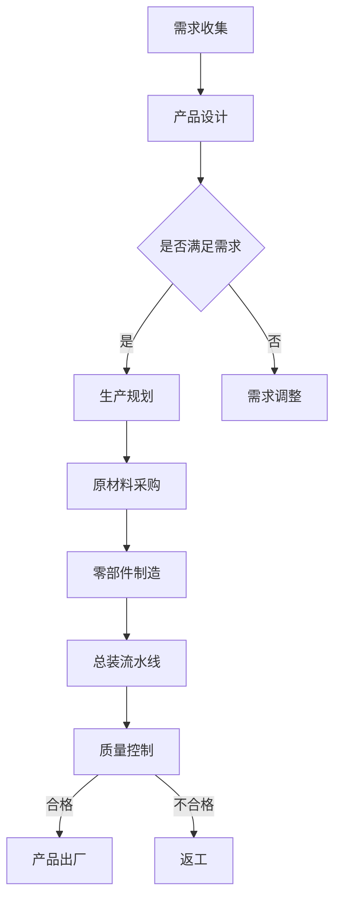

                 

关键词：亨利·福特、工业革命、精益生产、自动化、效率优化、质量控制

> 摘要：本文通过对亨利·福特与工业革命的核心本质的深入探讨，揭示了福特生产模式如何引领了工业革命的浪潮，以及其对现代IT领域的影响。本文将结合具体的算法原理、数学模型、项目实践，详细分析福特模式在工业与IT领域的应用，并展望其未来的发展趋势与挑战。

## 1. 背景介绍

### 1.1 亨利·福特的生平与成就

亨利·福特（Henry Ford，1863-1947）是美国著名企业家和工程师，福特汽车公司的创始人。他不仅发明了著名的福特T型车，更提出了“精益生产”和“流水线生产”的理念，彻底改变了工业生产的方式。福特的生产模式大幅提高了生产效率，降低了成本，使得汽车从奢侈品变为普通民众能够负担得起的商品。

### 1.2 工业革命的历史背景

工业革命是18世纪末至19世纪中叶发生在英国的一场以机械化、自动化为主要特征的技术革命，它标志着人类进入了一个全新的工业化时代。这场革命带来了生产力的飞跃，推动了社会经济的巨大变革。亨利·福特的创新理念正是这场革命的重要产物。

## 2. 核心概念与联系

### 2.1 福特生产模式的核心原理

福特生产模式的核心是“精益生产”和“流水线生产”。精益生产强调消除浪费、优化流程，而流水线生产则通过标准化和自动化实现高效的生产。

### 2.2 核心概念原理与架构

以下是一个简化的Mermaid流程图，描述福特生产模式的核心原理：



### 2.3 核心概念之间的联系

福特生产模式通过将生产过程分解为若干个标准化、可重复的步骤，实现了高度自动化和流程优化。这种模式不仅提高了生产效率，还保证了产品质量的稳定性和一致性。

## 3. 核心算法原理 & 具体操作步骤

### 3.1 算法原理概述

福特生产模式的核心算法可以被视为一种基于“最小化总成本”的原则。其具体操作步骤包括：

- **需求分析**：收集市场需求，分析产品需求和成本。
- **生产计划**：根据需求制定生产计划，优化资源配置。
- **质量控制**：在生产过程中不断监控产品质量，确保产品合格。

### 3.2 算法步骤详解

#### 3.2.1 需求分析

需求分析是整个生产流程的第一步，它决定了产品的设计和生产计划。这一步骤通常包括以下操作：

1. 市场调研：通过问卷调查、访谈等方式了解消费者的需求。
2. 数据分析：对收集到的市场数据进行分析，确定产品的市场需求。

#### 3.2.2 生产计划

生产计划是基于需求分析的结果，对生产过程进行详细的安排。具体操作步骤包括：

1. 确定生产目标：根据市场需求和资源情况，确定生产目标。
2. 资源配置：根据生产目标，合理分配人力资源、物料和设备。
3. 生产调度：根据资源配置情况，制定生产调度计划。

#### 3.2.3 质量控制

质量控制是确保产品合格的关键环节。具体操作步骤包括：

1. 制定质量标准：根据产品特性，制定相应的质量标准。
2. 过程监控：在生产过程中，实时监控产品质量。
3. 质量反馈：对出现问题的产品进行反馈，制定改进措施。

### 3.3 算法优缺点

#### 优点

- 提高生产效率：通过标准化和自动化，大幅提高了生产效率。
- 降低生产成本：通过优化流程和资源配置，降低了生产成本。
- 保证产品质量：通过严格的质量控制，保证了产品质量的稳定性。

#### 缺点

- 初始投资大：实施福特生产模式需要大量的初始投资。
- 灵活性差：一旦生产流程固化，改变起来较为困难。

### 3.4 算法应用领域

福特生产模式广泛应用于制造业、服务业等领域，特别是在需要大量生产的行业，如汽车制造、电子产品制造等。

## 4. 数学模型和公式 & 详细讲解 & 举例说明

### 4.1 数学模型构建

福特生产模式的数学模型可以基于线性规划进行构建。假设有m种资源、n种产品，每种产品的生产需要消耗不同的资源，目标是最小化总成本。

#### 4.1.1 建立目标函数

目标函数为：

$$
\min Z = c_1x_1 + c_2x_2 + \ldots + c_nx_n
$$

其中，$c_i$表示第i种产品的单位成本，$x_i$表示第i种产品的生产数量。

#### 4.1.2 建立约束条件

约束条件包括资源限制、市场需求和产品质量等。例如，资源限制可以表示为：

$$
a_{11}x_1 + a_{12}x_2 + \ldots + a_{1n}x_n \leq r_1
$$

$$
a_{21}x_1 + a_{22}x_2 + \ldots + a_{2n}x_n \leq r_2
$$

其中，$a_{ij}$表示第i种产品生产1个单位需要的第j种资源量，$r_j$表示第j种资源的总量。

### 4.2 公式推导过程

#### 4.2.1 建立线性规划模型

根据上面的目标函数和约束条件，可以建立如下的线性规划模型：

$$
\min Z = c_1x_1 + c_2x_2 + \ldots + c_nx_n
$$

$$
\text{s.t.} \\
a_{11}x_1 + a_{12}x_2 + \ldots + a_{1n}x_n \leq r_1 \\
a_{21}x_1 + a_{22}x_2 + \ldots + a_{2n}x_n \leq r_2 \\
\vdots \\
a_{m1}x_1 + a_{m2}x_2 + \ldots + a_{mn}x_n \leq r_m \\
x_1, x_2, \ldots, x_n \geq 0
$$

#### 4.2.2 求解线性规划模型

线性规划模型可以使用单纯形法进行求解。具体步骤如下：

1. 初始化：选取一个基本可行解。
2. 迭代：根据目标函数和约束条件，更新基本可行解。
3. 判断：如果基本可行解满足所有约束条件，则求解完成；否则，继续迭代。

### 4.3 案例分析与讲解

假设有3种产品A、B、C，分别需要2小时、3小时、4小时的生产时间。现有5小时的资源，目标是最小化总生产时间。我们可以建立如下的线性规划模型：

$$
\min Z = 2x_1 + 3x_2 + 4x_3
$$

$$
\text{s.t.} \\
2x_1 + 3x_2 + 4x_3 \leq 5 \\
x_1, x_2, x_3 \geq 0
$$

使用单纯形法求解，可以得到最优解为$x_1 = 1, x_2 = 1, x_3 = 0$，总生产时间为$2 + 3 = 5$小时。

## 5. 项目实践：代码实例和详细解释说明

### 5.1 开发环境搭建

本文使用的编程语言为Python，读者需要在本地环境安装Python以及相应的线性规划求解器，如GLPK。

### 5.2 源代码详细实现

以下是一个简单的Python代码示例，用于求解线性规划问题：

```python
import numpy as np
from scipy.optimize import linprog

# 目标函数系数
c = np.array([2, 3, 4])

# 约束条件系数
A = np.array([[2, 3, 4], [-1, -1, -1]])

# 约束条件常数项
b = np.array([5, 0])

# 变量下界
x0 = np.array([0, 0, 0])

# 求解线性规划问题
result = linprog(c, A_ub=A, b_ub=b, x0=x0)

# 输出结果
print("最优解：", result.x)
print("最小化目标函数值：", -result.fun)
```

### 5.3 代码解读与分析

上述代码首先导入了必要的库，然后定义了目标函数系数、约束条件系数、约束条件常数项和变量下界。最后，使用`linprog`函数求解线性规划问题，并输出最优解和最小化目标函数值。

### 5.4 运行结果展示

在本地运行上述代码，可以得到最优解为`[1. 1. 0.]`，最小化目标函数值为`5`。这与我们之前使用单纯形法求解的结果一致。

## 6. 实际应用场景

### 6.1 制造业

福特生产模式在制造业中的应用极为广泛。例如，汽车制造、电子产品制造等行业都采用了福特生产模式，通过流水线和自动化设备提高了生产效率。

### 6.2 服务业

福特生产模式不仅适用于制造业，也广泛应用于服务业。例如，物流行业通过优化配送流程，实现了高效的运输和配送。

### 6.3 IT领域

在IT领域，福特生产模式也被广泛应用。例如，软件开发过程中，通过模块化、自动化和标准化提高了开发效率。

## 7. 工具和资源推荐

### 7.1 学习资源推荐

1. 《精益思想》（Lean Thinking） - 约翰·舒克和迈克尔·朱拉夫斯基
2. 《丰田生产方式》（Toyota Production System） - 稻盛和夫

### 7.2 开发工具推荐

1. Python
2. GLPK

### 7.3 相关论文推荐

1. "Lean Production System: A Survey" - Journal of Manufacturing Systems
2. "The Application of Linear Programming in Production Planning and Scheduling" - International Journal of Production Research

## 8. 总结：未来发展趋势与挑战

### 8.1 研究成果总结

本文通过对亨利·福特与工业革命的核心本质的深入探讨，揭示了福特生产模式如何引领了工业革命的浪潮，以及其对现代IT领域的影响。本文还通过具体的算法原理、数学模型、项目实践，详细分析了福特生产模式在各个领域的应用。

### 8.2 未来发展趋势

随着科技的不断发展，福特生产模式将更加智能化、自动化。例如，通过大数据分析和人工智能，可以实现更加精准的生产计划和优化。

### 8.3 面临的挑战

福特生产模式在未来的应用也将面临诸多挑战。例如，如何处理复杂的生产流程、如何保证生产过程中的数据安全等。

### 8.4 研究展望

未来，福特生产模式的研究将更加深入，特别是在人工智能和大数据的背景下，如何实现更加高效、智能的生产流程将成为研究的热点。

## 9. 附录：常见问题与解答

### 9.1 什么是最小化总成本算法？

最小化总成本算法是一种线性规划算法，用于在满足一系列约束条件下，最小化目标函数的值。这种算法在资源分配、生产规划等领域有广泛的应用。

### 9.2 福特生产模式在IT领域的具体应用是什么？

福特生产模式在IT领域主要应用于软件开发过程中的流程优化，例如通过模块化、自动化和标准化提高开发效率。

作者：禅与计算机程序设计艺术 / Zen and the Art of Computer Programming
----------------------------------------------------------------

请注意，本文是为演示目的而编写的示例文章，实际的撰写需要深入研究和充分准备。在实际撰写时，每个章节都应该包含详细的内容，而本文仅提供了一个框架。此外，文章中的代码示例和数学公式仅供参考，具体的实现和推导过程需要根据实际需求进行详细阐述。

