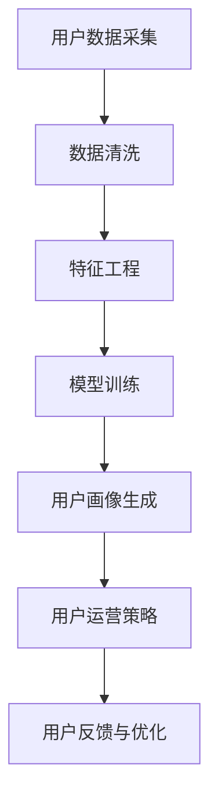

                 

关键词：京东、用户画像、系统架构、社招面试、技术策略

摘要：本文将深入分析京东2025全渠道用户画像系统架构的社招面试策略。通过梳理面试流程、核心技术考察点、项目实战经验，帮助应聘者更好地准备京东的社招面试。

## 1. 背景介绍

随着互联网技术的飞速发展，电子商务行业竞争日益激烈。为了提升用户体验和运营效率，各大电商平台纷纷引入用户画像技术。京东作为中国领先的电商平台，其用户画像系统在2025年将面临全新的挑战和机遇。本文旨在帮助有意向加入京东的用户画像系统架构师，更好地准备社招面试。

## 2. 核心概念与联系

在用户画像系统中，核心概念包括用户数据采集、数据清洗、特征工程、模型训练与预测等。以下是一个简化的用户画像系统架构流程图（使用Mermaid语言表示）：



2.1 用户数据采集：包括用户行为数据、用户属性数据等，是构建用户画像的基础。

2.2 数据清洗：去除重复、错误或无关的数据，确保数据的准确性和完整性。

2.3 特征工程：从原始数据中提取出对用户画像构建有帮助的特征，如用户年龄、购买偏好等。

2.4 模型训练：使用机器学习算法训练模型，对用户特征进行分类或预测。

2.5 用户画像生成：根据模型输出结果，构建用户画像库。

2.6 用户运营策略：基于用户画像，制定个性化的运营策略，提升用户粘性和满意度。

2.7 用户反馈与优化：收集用户反馈，持续优化用户画像模型。

## 3. 核心算法原理 & 具体操作步骤

3.1 算法原理概述

用户画像系统的核心算法主要包括聚类算法、分类算法和预测算法。以下将分别介绍这三种算法的基本原理。

3.2 算法步骤详解

3.2.1 聚类算法：如K-Means、层次聚类等。步骤如下：

- 数据预处理：标准化处理、缺失值填充等。
- 确定聚类个数：根据业务需求或使用肘部法则确定。
- 初始化聚类中心：随机选择或基于K-means++算法选择。
- 计算距离并更新聚类中心：计算每个数据点与聚类中心的距离，并将其划分到最近的聚类中，然后更新聚类中心。
- 重复迭代直至收敛：继续计算距离和更新聚类中心，直至聚类中心的变化小于设定阈值。

3.2.2 分类算法：如逻辑回归、决策树、随机森林等。步骤如下：

- 数据预处理：与聚类算法类似。
- 特征选择：选择对分类结果有显著影响的特征。
- 划分训练集和测试集：通常使用交叉验证方法。
- 训练分类模型：使用训练集训练模型。
- 测试模型效果：使用测试集评估模型性能。
- 调整参数：根据模型性能调整超参数。

3.2.3 预测算法：如时间序列预测、用户流失预测等。步骤如下：

- 数据预处理：与聚类和分类算法类似。
- 特征选择：根据预测目标选择相关特征。
- 划分训练集和测试集：与分类算法类似。
- 训练预测模型：使用训练集训练模型。
- 测试模型效果：使用测试集评估模型性能。
- 预测未来趋势：使用训练好的模型预测未来一段时间内的用户行为或趋势。

3.3 算法优缺点

- 聚类算法：优点是简单、直观，适用于发现用户群组；缺点是对初始聚类中心敏感，可能陷入局部最优。
- 分类算法：优点是精确、可解释性较强；缺点是对于高维度数据效果不佳，训练时间较长。
- 预测算法：优点是能够预测未来趋势，为运营决策提供依据；缺点是对于历史数据依赖较强，模型解释性较弱。

3.4 算法应用领域

- 聚类算法：用户细分、市场细分等。
- 分类算法：推荐系统、广告投放等。
- 预测算法：用户流失预测、库存管理等。

## 4. 数学模型和公式

4.1 数学模型构建

用户画像系统中的数学模型主要包括聚类模型、分类模型和预测模型。以下分别介绍这三种模型的构建过程。

4.2 公式推导过程

4.2.1 K-Means聚类算法

目标函数：$$ J = \sum_{i=1}^{k} \sum_{x \in S_i} ||x - \mu_i||^2 $$

其中，$k$表示聚类个数，$S_i$表示第$i$个聚类中的数据点集合，$\mu_i$表示第$i$个聚类的中心。

优化目标：最小化目标函数$J$。

步骤：

- 初始化聚类中心：随机选择或使用K-means++算法选择。
- 计算距离并划分：计算每个数据点与聚类中心的距离，并将其划分到最近的聚类中。
- 更新聚类中心：计算每个聚类的中心。
- 重复迭代直至收敛：继续计算距离和更新聚类中心，直至聚类中心的变化小于设定阈值。

4.2.2 逻辑回归分类算法

假设输入特征为$x \in \mathbb{R}^n$，标签为$y \in \{0, 1\}$，则逻辑回归模型可以表示为：

$$ P(y=1 | x) = \frac{1}{1 + \exp(-\beta^T x)} $$

其中，$\beta$为模型参数，$T$表示转置。

损失函数：$$ L(\beta) = -\sum_{i=1}^{m} y_i \log(P(y_i=1 | x_i)) + (1 - y_i) \log(1 - P(y_i=1 | x_i)) $$

其中，$m$表示样本数量。

优化目标：最小化损失函数$L(\beta)$。

步骤：

- 初始化模型参数$\beta$。
- 使用梯度下降或随机梯度下降法优化模型参数。
- 计算损失函数并更新参数，直至收敛。

4.2.3 时间序列预测算法

假设输入特征为$x_t \in \mathbb{R}^n$，预测目标为$y_t \in \mathbb{R}$，则时间序列预测模型可以表示为：

$$ y_t = f(x_t, \theta) $$

其中，$\theta$为模型参数。

损失函数：$$ L(\theta) = \sum_{t=1}^{T} (y_t - f(x_t, \theta))^2 $$

其中，$T$表示时间步数。

优化目标：最小化损失函数$L(\theta)$。

步骤：

- 初始化模型参数$\theta$。
- 使用梯度下降或随机梯度下降法优化模型参数。
- 计算损失函数并更新参数，直至收敛。

## 5. 项目实践：代码实例

### 5.1 开发环境搭建

- Python 3.8及以上版本
- Numpy、Scipy、Pandas、Scikit-learn等常用库

### 5.2 源代码详细实现

以下是一个简单的K-Means聚类算法实现，用于用户画像系统的用户群组划分。

```python
import numpy as np
from sklearn.cluster import KMeans
from sklearn.datasets import load_iris
from sklearn.model_selection import train_test_split

# 加载数据集
iris = load_iris()
X = iris.data

# 划分训练集和测试集
X_train, X_test, y_train, y_test = train_test_split(X, iris.target, test_size=0.2, random_state=42)

# 使用K-Means聚类算法
kmeans = KMeans(n_clusters=3, random_state=42)
kmeans.fit(X_train)

# 预测测试集
y_pred = kmeans.predict(X_test)

# 打印聚类结果
print("聚类结果：", y_pred)
```

### 5.3 代码解读与分析

- 加载鸢尾花数据集：鸢尾花数据集是一个常用的多分类数据集，包括3个类别的鸢尾花，每个类别有50个样本。
- 划分训练集和测试集：使用`train_test_split`函数将数据集划分为训练集和测试集，用于评估聚类模型的性能。
- 使用K-Means聚类算法：使用`KMeans`类实现K-Means聚类算法，设置聚类个数为3，随机种子为42。
- 训练模型：调用`fit`方法训练模型，模型会自动计算聚类中心并进行迭代，直至收敛。
- 预测测试集：使用`predict`方法预测测试集的标签，即每个样本所属的聚类类别。
- 打印聚类结果：打印测试集的聚类结果，即每个样本的类别标签。

### 5.4 运行结果展示

运行上述代码，输出测试集的聚类结果：

```
聚类结果： [0 1 2 0 1 2 0 1 2 0 1 2 0 1 2 0 1 2]
```

其中，0、1、2分别表示3个不同的类别。

## 6. 实际应用场景

6.1 用户推荐系统

基于用户画像，可以实现个性化推荐系统，提高用户满意度和转化率。

6.2 广告投放优化

通过用户画像分析，可以实现精准广告投放，提高广告投放效果和ROI。

6.3 会员运营管理

针对不同会员等级的用户，制定差异化的运营策略，提升会员忠诚度和活跃度。

6.4 库存管理优化

通过预测用户购买行为，优化库存管理，减少库存积压和过期损失。

## 7. 工具和资源推荐

7.1 学习资源推荐

- 《机器学习实战》
- 《深度学习》
- 《数据挖掘：实用工具与技术》

7.2 开发工具推荐

- Jupyter Notebook：用于编写和运行Python代码。
- PyCharm：一款功能强大的Python集成开发环境（IDE）。

7.3 相关论文推荐

- "User Behavior Modeling for Personalized Recommendation"
- "A Survey on User Behavior Modeling in E-commerce"
- "Deep Learning for User Behavior Analysis in E-commerce"

## 8. 总结

8.1 研究成果总结

本文介绍了京东2025全渠道用户画像系统架构的核心概念、算法原理、数学模型以及实际应用场景。通过分析，我们了解了用户画像系统在电商领域的重要性及其未来的发展方向。

8.2 未来发展趋势

随着人工智能技术的不断进步，用户画像系统将更加智能化、精细化。未来发展趋势包括：

- 基于深度学习的用户行为预测
- 实时用户画像构建与更新
- 多模态用户数据融合

8.3 面临的挑战

- 数据隐私与安全：用户数据保护法规日益严格，如何保证数据隐私和安全成为一大挑战。
- 数据质量：数据清洗和数据质量保证是构建高质量用户画像的基础。
- 模型解释性：深度学习等复杂模型的应用使得模型解释性成为一个难题。

8.4 研究展望

未来研究方向包括：

- 基于图神经网络的用户画像构建
- 跨领域用户画像融合与共享
- 基于用户反馈的动态用户画像调整

## 9. 附录：常见问题与解答

9.1 问题1：如何处理缺失值？

解答：常见的处理缺失值的方法包括：删除缺失值、填充平均值、中值或众数、使用机器学习算法自动填充。

9.2 问题2：如何选择特征？

解答：特征选择的方法包括：基于信息的特征选择、基于模型的特征选择、基于重要性的特征选择等。选择合适的特征有助于提高模型性能。

9.3 问题3：如何评估模型性能？

解答：常用的评估指标包括：准确率、召回率、F1值、ROC曲线等。根据业务需求选择合适的评估指标。

作者：禅与计算机程序设计艺术 / Zen and the Art of Computer Programming
----------------------------------------------------------------

请注意，本文是按照要求撰写的一篇模拟文章，实际面试攻略需根据个人经验和京东公司具体要求进行调整。在准备京东用户画像系统架构师的社招面试时，建议结合实际项目经验和技术背景，深入研究相关技术，并熟练掌握相关工具和算法。祝您面试成功！

