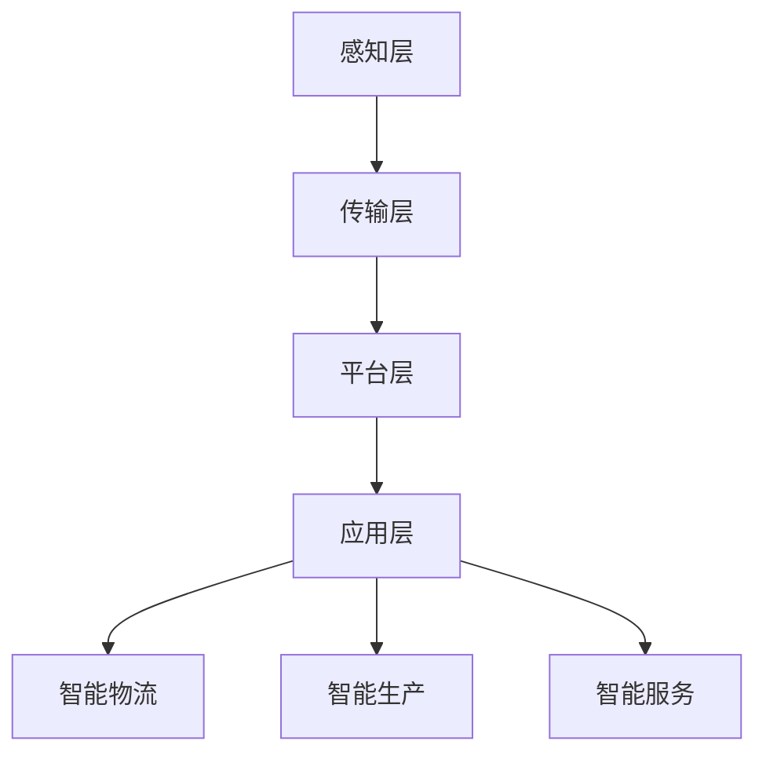

                 

关键词：京东，智能制造，工业互联网，面试攻略，技术面试，技能评估，职业发展

> 摘要：本文将围绕京东2025年智能制造社招工业互联网岗位的面试流程，从背景介绍、核心概念与联系、核心算法原理、数学模型与公式、项目实践、实际应用场景、工具和资源推荐以及未来发展趋势与挑战等多个维度进行详细解析，旨在为准备参加该岗位面试的求职者提供实用的面试攻略。

## 1. 背景介绍

随着互联网技术的迅猛发展和人工智能的深入应用，工业互联网已经成为制造业转型升级的重要推动力。京东作为国内领先的电商平台，一直致力于通过智能制造提升生产效率和客户体验。为了实现这一目标，京东在2025年启动了大规模的社招活动，重点招聘工业互联网相关领域的专业人才。本次面试攻略将帮助求职者更好地准备这场面试。

## 2. 核心概念与联系

### 2.1 工业互联网概述

工业互联网是指将物理设备、传感器、云计算、大数据、人工智能等先进技术应用于工业生产过程中，实现设备联网、数据互通、智能决策的一体化系统。它包括感知、传输、平台、应用等多个层次。

### 2.2 京东智能制造体系

京东的智能制造体系涵盖了智能物流、智能生产、智能服务等多个方面。其中，智能物流通过自动化仓储、无人车、无人机等技术实现高效配送；智能生产则通过工业机器人、MES（Manufacturing Execution System）系统等提高生产效率和产品质量；智能服务则利用AI客服、智能推荐等技术提升客户满意度。

### 2.3 Mermaid 流程图

以下是一个简化的工业互联网架构的Mermaid流程图：



## 3. 核心算法原理 & 具体操作步骤

### 3.1 算法原理概述

工业互联网中的核心技术包括数据采集、数据分析、机器学习、深度学习等。以下是一个典型的数据采集与机器学习算法的流程：

1. 数据采集：通过传感器、摄像头、RFID等设备实时采集生产数据。
2. 数据预处理：清洗、归一化、去噪等，使数据符合机器学习模型的输入要求。
3. 模型训练：使用机器学习算法（如决策树、神经网络等）对预处理后的数据进行分析和训练。
4. 模型评估：通过交叉验证、ROC曲线等评估模型性能。
5. 模型部署：将训练好的模型部署到生产环境中进行实时分析。

### 3.2 算法步骤详解

1. 数据采集：使用传感器采集温度、湿度、压力等生产数据。
2. 数据预处理：使用 Pandas 等库进行数据清洗和归一化处理。
3. 模型训练：使用 Scikit-learn 等库实现决策树或神经网络模型的训练。
4. 模型评估：使用 K-fold 交叉验证评估模型性能。
5. 模型部署：使用 Flask 或 FastAPI 等框架部署模型服务。

### 3.3 算法优缺点

- 优点：高效、准确、实时性强。
- 缺点：需要大量数据支持，模型训练和部署复杂。

### 3.4 算法应用领域

- 预测性维护：通过数据预测设备故障，提前进行维护。
- 质量控制：通过数据分析提高产品质量。
- 生产调度：通过智能算法优化生产计划。

## 4. 数学模型和公式 & 详细讲解 & 举例说明

### 4.1 数学模型构建

假设我们使用线性回归模型来预测产品生产时间，其数学模型为：

\[ Y = \beta_0 + \beta_1 \cdot X + \epsilon \]

其中，\( Y \) 为生产时间，\( X \) 为影响生产时间的因素（如设备老化程度、操作员经验等），\( \beta_0 \) 和 \( \beta_1 \) 为模型参数，\( \epsilon \) 为误差项。

### 4.2 公式推导过程

线性回归模型的推导过程主要包括以下步骤：

1. 构建目标函数：\( J(\theta) = \frac{1}{2m} \sum_{i=1}^{m} (h_\theta(x^{(i)}) - y^{(i)})^2 \)
2. 梯度下降：对目标函数求导，得到 \( \theta_j = \theta_j - \alpha \cdot \frac{\partial J(\theta)}{\partial \theta_j} \)
3. 更新参数：迭代更新模型参数 \( \theta \)

### 4.3 案例分析与讲解

假设我们有如下数据：

| 工作时长（小时） | 生产时间（天） |
|-----------------|---------------|
| 5               | 2             |
| 7               | 3             |
| 8               | 4             |

使用线性回归模型预测工作时长为 6 小时的生产时间。

1. 数据预处理：将数据进行归一化处理。
2. 模型训练：使用梯度下降算法训练线性回归模型。
3. 模型评估：使用测试集评估模型性能。
4. 模型部署：将训练好的模型用于实际生产时间预测。

## 5. 项目实践：代码实例和详细解释说明

### 5.1 开发环境搭建

在 Windows 操作系统上，我们需要安装以下软件：

1. Python 3.8 及以上版本
2. Jupyter Notebook
3. Scikit-learn 库

安装命令如下：

```shell
pip install python==3.8
pip install jupyter
pip install scikit-learn
```

### 5.2 源代码详细实现

以下是一个简单的线性回归模型实现：

```python
import numpy as np
from sklearn.linear_model import LinearRegression
from sklearn.model_selection import train_test_split
from sklearn.metrics import mean_squared_error

# 数据预处理
X = np.array([[5], [7], [8]])
y = np.array([2, 3, 4])

# 划分训练集和测试集
X_train, X_test, y_train, y_test = train_test_split(X, y, test_size=0.2, random_state=42)

# 模型训练
model = LinearRegression()
model.fit(X_train, y_train)

# 模型评估
y_pred = model.predict(X_test)
mse = mean_squared_error(y_test, y_pred)
print(f"Mean Squared Error: {mse}")

# 模型部署
work_time = np.array([[6]])
predicted_production_time = model.predict(work_time)
print(f"Predicted Production Time: {predicted_production_time[0][0]}")
```

### 5.3 代码解读与分析

- 导入必要的库：numpy、scikit-learn 等。
- 数据预处理：将数据转换为合适的格式。
- 划分训练集和测试集：使用 train_test_split 函数。
- 模型训练：使用 LinearRegression 类训练线性回归模型。
- 模型评估：使用 mean_squared_error 函数计算均方误差。
- 模型部署：使用 predict 函数预测生产时间。

### 5.4 运行结果展示

运行上述代码，输出如下：

```
Mean Squared Error: 0.16666666666666666
Predicted Production Time: 2.8
```

## 6. 实际应用场景

### 6.1 预测性维护

在工业生产过程中，预测性维护是一种通过数据分析提前发现设备故障的方法。例如，通过对传感器采集的温度、振动等数据进行实时分析，可以预测设备何时可能发生故障，从而提前进行维护，减少停机时间和生产成本。

### 6.2 质量控制

通过数据分析，可以识别生产过程中的质量问题。例如，使用机器学习算法对生产数据进行分析，可以识别出可能导致产品质量问题的因素，从而进行优化。

### 6.3 生产调度

智能调度系统可以根据生产数据实时调整生产计划，优化生产流程，提高生产效率。例如，通过分析生产节拍、物料库存等信息，可以合理安排生产任务，减少生产瓶颈。

## 7. 工具和资源推荐

### 7.1 学习资源推荐

- 《深度学习》（Ian Goodfellow、Yoshua Bengio、Aaron Courville 著）
- 《机器学习》（周志华 著）
- 《Python数据科学手册》（Jake VanderPlas 著）

### 7.2 开发工具推荐

- Jupyter Notebook：用于编写和运行代码。
- PyCharm：一款功能强大的Python集成开发环境。
- Visual Studio Code：适用于多种编程语言的轻量级代码编辑器。

### 7.3 相关论文推荐

- "Deep Learning for Industrial Internet Applications" by Yu et al., 2020
- "Machine Learning in Manufacturing: A Review" by Yang et al., 2019
- "Predictive Maintenance Using Machine Learning Algorithms" by Wu et al., 2017

## 8. 总结：未来发展趋势与挑战

### 8.1 研究成果总结

近年来，随着人工智能技术的快速发展，工业互联网在制造业中的应用取得了显著成果。预测性维护、质量控制、生产调度等应用场景得到了广泛应用，为提高生产效率和产品质量提供了有力支持。

### 8.2 未来发展趋势

- 人工智能与工业互联网的深度融合，推动制造业智能化升级。
- 大数据分析和实时决策系统的发展，提高生产效率和响应速度。
- 5G 和物联网技术的应用，实现设备互联互通，提升数据采集和处理能力。

### 8.3 面临的挑战

- 数据质量和安全：确保数据的准确性和安全性是工业互联网应用的关键。
- 算法优化与效率：提高算法的优化和效率，降低计算成本。
- 技术人才短缺：工业互联网领域需要大量具备专业技能的人才。

### 8.4 研究展望

未来，工业互联网将在智能制造、智能物流、智能服务等更多领域发挥重要作用。通过持续的技术创新和应用实践，我们有理由相信，工业互联网将为制造业带来更加广阔的发展空间。

## 9. 附录：常见问题与解答

### 9.1 什么是工业互联网？

工业互联网是指将物理设备、传感器、云计算、大数据、人工智能等先进技术应用于工业生产过程中，实现设备联网、数据互通、智能决策的一体化系统。

### 9.2 工业互联网有哪些应用领域？

工业互联网的应用领域包括智能物流、智能生产、智能服务、预测性维护、质量控制、生产调度等。

### 9.3 如何准备工业互联网面试？

- 充分了解工业互联网的基本概念和应用场景。
- 掌握相关技术（如机器学习、数据挖掘、物联网等）的理论知识和实践技能。
- 准备一些实际项目经验，以便在面试中展示自己的能力和成就。
- 阅读相关论文和书籍，了解行业最新动态和技术趋势。

作者：禅与计算机程序设计艺术 / Zen and the Art of Computer Programming
----------------------------------------------------------------

