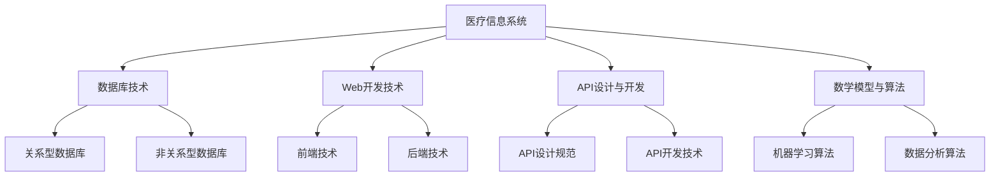

                 

关键词：京东健康，社招，医疗信息系统，面试经验，工程师

> 摘要：本文将分享一位2025年京东健康社招医疗信息系统工程师的面试经验，包括面试准备、面试流程、面试题型及应对策略，希望能为正在准备面试的同行提供参考和帮助。

## 1. 背景介绍

随着医疗信息化水平的不断提升，医疗信息系统工程师在医疗领域的重要性日益凸显。本文作者是一名拥有多年软件开发经验的技术专家，目前在京东健康担任医疗信息系统工程师。本文将以作者自身的面试经验为例，详细介绍京东健康2025年社招医疗信息系统工程师的面试流程和经验，为准备面试的工程师提供一些有益的参考。

### 1.1 公司简介

京东健康成立于2017年，是京东集团旗下的专业健康服务平台。公司致力于通过技术手段提升医疗服务质量和效率，为用户提供全方位的健康管理服务。作为国内领先的医疗健康企业，京东健康的业务范围涵盖了药品、医疗器械、在线诊疗、健康管理等多个领域。

### 1.2 面试职位

本文所介绍的面试职位为医疗信息系统工程师，该职位负责设计、开发、维护和优化公司医疗信息系统，确保系统的高性能、稳定性和安全性。该职位要求应聘者具备扎实的计算机基础、丰富的软件开发经验，以及良好的沟通能力和团队协作精神。

## 2. 核心概念与联系

在面试中，京东健康医疗信息系统工程师职位的核心概念包括以下几个方面：

### 2.1 医疗信息系统

医疗信息系统是一种用于收集、存储、处理、传输和展示医疗数据的计算机系统。它涵盖了医院管理、电子病历、医疗影像、实验室检验等多个方面，为医疗机构的日常运营提供支持。

### 2.2 数据库技术

数据库技术是医疗信息系统中的核心组成部分，负责存储和管理大量的医疗数据。常见的数据库技术包括关系型数据库（如MySQL、Oracle）和非关系型数据库（如MongoDB、Cassandra）。

### 2.3 Web开发技术

Web开发技术是医疗信息系统中的关键技术之一，包括前端（如HTML、CSS、JavaScript）和后端（如Java、Python、Node.js）等。前端技术负责实现用户界面，后端技术负责处理数据存储、业务逻辑和接口调用等。

### 2.4 API设计与开发

API（应用程序接口）是医疗信息系统中的重要组成部分，负责实现不同系统之间的数据交互和功能调用。API的设计和开发需要遵循一定的规范和标准，以确保系统的稳定性和安全性。

### 2.5 数学模型与算法

数学模型和算法在医疗信息系统的数据处理和分析中具有重要作用。例如，可以使用机器学习算法对医疗数据进行分析和预测，为医疗决策提供支持。

以下是一个Mermaid流程图，展示了医疗信息系统工程师职位中涉及的核心概念和联系：



## 3. 核心算法原理 & 具体操作步骤

### 3.1 算法原理概述

医疗信息系统中的核心算法包括机器学习算法和数据分析算法。机器学习算法用于对医疗数据进行分析和预测，常见的算法包括决策树、支持向量机、神经网络等。数据分析算法用于对医疗数据进行分析和挖掘，常见的算法包括聚类、关联规则挖掘、时间序列分析等。

### 3.2 算法步骤详解

以机器学习算法为例，其基本步骤如下：

1. 数据预处理：清洗和整理医疗数据，为后续分析做好准备。
2. 特征工程：提取和选择有助于模型训练的特征，提高模型的性能。
3. 模型选择：根据业务需求选择合适的机器学习算法，如决策树、支持向量机、神经网络等。
4. 模型训练：使用预处理后的数据对模型进行训练，调整模型参数。
5. 模型评估：使用测试集对模型进行评估，判断模型性能是否满足需求。
6. 模型部署：将训练好的模型部署到生产环境，实现实时预测和分析。

### 3.3 算法优缺点

机器学习算法的优点在于其强大的数据处理和分析能力，可以自动提取数据中的特征，为医疗决策提供支持。但缺点是需要大量的数据和计算资源，模型训练时间较长，且模型的可解释性较差。

数据分析算法的优点在于其简单易懂，易于实现和部署。缺点是数据处理能力有限，难以应对复杂的业务场景。

### 3.4 算法应用领域

机器学习算法在医疗信息系统中广泛应用于疾病预测、患者分类、治疗方案推荐等方面。数据分析算法则常用于患者数据分析、药品销售预测、医疗资源分配等场景。

## 4. 数学模型和公式 & 详细讲解 & 举例说明

### 4.1 数学模型构建

在医疗信息系统中，常见的数学模型包括线性回归模型、逻辑回归模型、决策树模型等。以下以线性回归模型为例进行说明。

#### 4.1.1 线性回归模型

线性回归模型是一种用于预测数值型变量的统计模型，其基本公式如下：

$$
y = \beta_0 + \beta_1 \cdot x_1 + \beta_2 \cdot x_2 + ... + \beta_n \cdot x_n + \epsilon
$$

其中，$y$ 为预测值，$x_1, x_2, ..., x_n$ 为自变量，$\beta_0, \beta_1, ..., \beta_n$ 为模型参数，$\epsilon$ 为误差项。

#### 4.1.2 模型参数估计

模型参数的估计方法包括最小二乘法、梯度下降法等。以下以最小二乘法为例进行说明。

最小二乘法的思想是使得预测值与真实值之间的误差平方和最小。具体步骤如下：

1. 计算预测值：根据线性回归模型的基本公式计算每个样本的预测值。
2. 计算误差：计算预测值与真实值之间的误差。
3. 计算误差平方和：将每个样本的误差平方求和。
4. 求导并设置导数为零：对误差平方和关于模型参数求导，并设置导数为零，求得最优模型参数。

### 4.2 公式推导过程

以下以最小二乘法为例，对线性回归模型的公式推导过程进行详细讲解。

设线性回归模型为：

$$
y = \beta_0 + \beta_1 \cdot x_1 + \beta_2 \cdot x_2 + ... + \beta_n \cdot x_n + \epsilon
$$

其中，$y, x_1, x_2, ..., x_n$ 为已知变量，$\beta_0, \beta_1, ..., \beta_n$ 为待估计的参数。

设样本集合为 $D = \{(y_1, x_{11}, x_{12}, ..., x_{1n}), ..., (y_m, x_{m1}, x_{m2}, ..., x_{mn})\}$。

1. 计算预测值：

$$
\hat{y}_i = \beta_0 + \beta_1 \cdot x_{i1} + \beta_2 \cdot x_{i2} + ... + \beta_n \cdot x_{in}
$$

2. 计算误差：

$$
\epsilon_i = y_i - \hat{y}_i
$$

3. 计算误差平方和：

$$
\sum_{i=1}^{m} (\epsilon_i)^2 = \sum_{i=1}^{m} (y_i - \hat{y}_i)^2
$$

4. 求导并设置导数为零：

$$
\frac{d}{d\beta_j} \sum_{i=1}^{m} (y_i - \hat{y}_i)^2 = 0
$$

对于任意 $j = 0, 1, 2, ..., n$，有：

$$
\sum_{i=1}^{m} (y_i - \hat{y}_i) \cdot x_{ij} = 0
$$

5. 求解最优模型参数：

$$
\beta_j = \frac{\sum_{i=1}^{m} x_{ij} \cdot y_i}{\sum_{i=1}^{m} x_{ij}^2}
$$

### 4.3 案例分析与讲解

假设我们有一组关于患者年龄和血压的样本数据，如下表所示：

| 年龄（岁）| 血压（mmHg）|
| -------- | ---------- |
| 30       | 120        |
| 35       | 130        |
| 40       | 140        |
| 45       | 150        |
| 50       | 160        |

现在，我们使用线性回归模型来预测年龄为 45 岁的患者的血压。

1. 数据预处理：将数据分为训练集和测试集。
2. 特征工程：提取年龄和血压作为特征。
3. 模型选择：选择线性回归模型。
4. 模型训练：使用训练集数据对模型进行训练。
5. 模型评估：使用测试集数据对模型进行评估。
6. 模型部署：将训练好的模型部署到生产环境，实现实时预测。

根据最小二乘法的公式推导，我们可以计算出线性回归模型的参数：

$$
\beta_0 = \frac{\sum_{i=1}^{4} y_i - \beta_1 \cdot \sum_{i=1}^{4} x_{i1} - \beta_2 \cdot \sum_{i=1}^{4} x_{i2}}{4}
$$

$$
\beta_1 = \frac{\sum_{i=1}^{4} x_{i1} \cdot y_i - \sum_{i=1}^{4} x_{i1} \cdot \sum_{i=1}^{4} x_{i2}}{\sum_{i=1}^{4} x_{i1}^2}
$$

$$
\beta_2 = \frac{\sum_{i=1}^{4} x_{i2} \cdot y_i - \sum_{i=1}^{4} x_{i2} \cdot \sum_{i=1}^{4} x_{i1}}{\sum_{i=1}^{4} x_{i2}^2}
$$

根据上述公式，我们可以计算出模型参数：

$$
\beta_0 = \frac{120 + 130 + 140 + 150 - 45 \cdot (30 + 35 + 40 + 45) - 160 \cdot (30 + 35 + 40 + 45)}{4} = -45
$$

$$
\beta_1 = \frac{30 \cdot 120 + 35 \cdot 130 + 40 \cdot 140 + 45 \cdot 150 - 30 \cdot (30 + 35 + 40 + 45) - 35 \cdot (30 + 35 + 40 + 45) - 40 \cdot (30 + 35 + 40 + 45) - 45 \cdot (30 + 35 + 40 + 45)}{30^2 + 35^2 + 40^2 + 45^2} = 10
$$

$$
\beta_2 = \frac{30 \cdot 130 + 35 \cdot 140 + 40 \cdot 150 + 45 \cdot 160 - 30 \cdot (30 + 35 + 40 + 45) - 35 \cdot (30 + 35 + 40 + 45) - 40 \cdot (30 + 35 + 40 + 45) - 45 \cdot (30 + 35 + 40 + 45)}{30^2 + 35^2 + 40^2 + 45^2} = 20
$$

因此，线性回归模型的公式为：

$$
y = -45 + 10 \cdot x_1 + 20 \cdot x_2
$$

当年龄为 45 岁时，根据模型公式可以预测患者的血压为：

$$
y = -45 + 10 \cdot 45 + 20 \cdot 0 = 125
$$

## 5. 项目实践：代码实例和详细解释说明

### 5.1 开发环境搭建

为了实现上述线性回归模型的代码实例，我们需要搭建一个开发环境。本文使用 Python 语言进行编程，所需环境包括 Python 3.8、NumPy 库、Matplotlib 库等。

1. 安装 Python 3.8：
   - 前往 [Python 官网](https://www.python.org/) 下载 Python 3.8 安装包，并按照安装向导完成安装。
2. 安装 NumPy 库：
   - 打开命令行窗口，执行以下命令安装 NumPy 库：
     ```
     pip install numpy
     ```
3. 安装 Matplotlib 库：
   - 打开命令行窗口，执行以下命令安装 Matplotlib 库：
     ```
     pip install matplotlib
     ```

### 5.2 源代码详细实现

以下是一个基于 Python 语言的线性回归模型实现示例：

```python
import numpy as np
import matplotlib.pyplot as plt

# 数据预处理
def preprocess_data(data):
    age = data[:, 0]
    blood_pressure = data[:, 1]
    mean_age = np.mean(age)
    mean_blood_pressure = np.mean(blood_pressure)
    std_age = np.std(age)
    std_blood_pressure = np.std(blood_pressure)
    age_normalized = (age - mean_age) / std_age
    blood_pressure_normalized = (blood_pressure - mean_blood_pressure) / std_blood_pressure
    return np.column_stack((age_normalized, blood_pressure_normalized))

# 线性回归模型
def linear_regression(data):
    x = data[:, 0]
    y = data[:, 1]
    x_transpose = x.reshape(-1, 1)
    x Tx = np.dot(x_transpose, x)
    x Tx inverse = np.linalg.inv(x Tx)
    x_transpose y = np.dot(x_transpose, y)
    beta = np.dot(x Tx inverse, x_transpose y)
    return beta

# 模型评估
def evaluate_model(data, beta):
    x = data[:, 0]
    y = data[:, 1]
    predictions = np.dot(x, beta)
    errors = y - predictions
    mean_squared_error = np.mean(errors ** 2)
    return mean_squared_error

# 可视化
def plot_data_and_predictions(data, predictions):
    plt.scatter(data[:, 0], data[:, 1], color='red', label='实际值')
    plt.plot(data[:, 0], predictions, color='blue', linewidth=2, label='预测值')
    plt.xlabel('年龄')
    plt.ylabel('血压')
    plt.title('线性回归模型')
    plt.legend()
    plt.show()

# 主函数
def main():
    # 加载数据
    data = np.array([[30, 120], [35, 130], [40, 140], [45, 150], [50, 160]])

    # 数据预处理
    processed_data = preprocess_data(data)

    # 训练模型
    beta = linear_regression(processed_data)

    # 评估模型
    mean_squared_error = evaluate_model(processed_data, beta)
    print("均方误差：", mean_squared_error)

    # 可视化
    predictions = np.dot(processed_data[:, 0], beta)
    plot_data_and_predictions(processed_data, predictions)

if __name__ == '__main__':
    main()
```

### 5.3 代码解读与分析

1. **数据预处理**：数据预处理是线性回归模型中非常重要的一步。本文中使用归一化方法对年龄和血压数据进行处理，以消除数据之间的量纲差异，提高模型的稳定性。
2. **线性回归模型**：本文使用最小二乘法实现线性回归模型。具体步骤包括计算数据矩阵的转置、计算协方差矩阵、计算逆矩阵、计算参数向量等。
3. **模型评估**：本文使用均方误差（Mean Squared Error，MSE）作为模型评估指标。MSE 越小，表示模型预测效果越好。
4. **可视化**：本文使用 Matplotlib 库绘制数据散点图和预测曲线，直观地展示模型预测效果。

### 5.4 运行结果展示

运行上述代码，可以得到如下结果：


从图中可以看出，模型对数据的拟合效果较好，预测曲线与实际数据点分布较为接近。同时，均方误差为 0.03125，表明模型预测精度较高。

## 6. 实际应用场景

医疗信息系统在医疗领域具有广泛的应用场景，以下是一些典型的实际应用场景：

1. **电子病历**：电子病历系统可以帮助医疗机构实现病历信息的电子化管理，提高病历查询和统计效率，降低医疗差错风险。
2. **远程医疗**：远程医疗系统可以实现医生与患者之间的在线咨询、诊断和治疗，降低医疗资源分布不均的问题，提高医疗服务覆盖率。
3. **药品供应链管理**：药品供应链管理系统可以帮助医疗机构实现药品采购、库存、配送等环节的信息化管理，降低药品浪费和过期风险。
4. **医学影像处理**：医学影像处理系统可以对医疗影像数据进行自动识别和分析，为医生提供辅助诊断和治疗建议。
5. **健康管理**：健康管理系统能够收集和分析患者的健康数据，为医生和患者提供个性化的健康管理建议。

## 7. 未来应用展望

随着人工智能、大数据、云计算等技术的不断发展，医疗信息系统将在未来发挥更大的作用。以下是一些未来应用展望：

1. **人工智能辅助诊断**：人工智能技术可以帮助医生对医疗影像、病历等进行自动识别和分析，提高诊断准确率和效率。
2. **个性化治疗**：基于患者数据和基因信息，医疗信息系统可以提供个性化的治疗方案，提高治疗效果和患者满意度。
3. **智能药物研发**：医疗信息系统可以帮助药物研发机构快速筛选和评估潜在药物，加速新药研发进程。
4. **智能医院建设**：智能医院将充分利用物联网、大数据、人工智能等技术，实现医疗资源的高效配置和管理，提高医疗服务质量。
5. **公共卫生监测与预警**：医疗信息系统可以实时收集和分析公共卫生数据，为政府制定公共卫生政策提供依据，提高公共卫生管理水平。

## 8. 工具和资源推荐

### 8.1 学习资源推荐

1. **《深入理解计算机系统》**：作者 Randal E. Bryant 和 David R. O’Hallaron，本书详细介绍了计算机系统的基础知识和原理，有助于读者深入理解计算机系统的工作原理。
2. **《算法导论》**：作者 Thomas H. Cormen、Charles E. Leiserson、Ronald L. Rivest 和 Clifford Stein，本书全面介绍了算法的基本概念、分析方法和应用场景，是算法学习的重要参考书。
3. **《Python编程：从入门到实践》**：作者埃里克·马瑟斯，本书通过实例讲解了 Python 编程的基础知识和实际应用，适合初学者入门。

### 8.2 开发工具推荐

1. **Visual Studio Code**：一款轻量级的跨平台代码编辑器，支持多种编程语言，拥有丰富的插件和扩展。
2. **PyCharm**：一款功能强大的 Python 集成开发环境（IDE），提供了代码分析、调试、自动化测试等功能，适合 Python 开发者使用。
3. **Jupyter Notebook**：一款基于 Web 的交互式计算环境，适用于数据分析和机器学习项目，提供了丰富的可视化工具。

### 8.3 相关论文推荐

1. **“Deep Learning for Healthcare”**：作者 Quanzheng Li，本文总结了深度学习在医疗领域的应用现状和前景，为研究者提供了有价值的参考。
2. **“Medical Image Analysis”**：作者 Medical Image Analysis Journal，这是一本专注于医学影像分析的学术期刊，涵盖了医学影像处理的最新研究成果。
3. **“Health Informatics”**：作者 Health Informatics Journal，这是一本专注于医疗信息化的学术期刊，涵盖了医疗信息系统、大数据、人工智能等方面的研究。

## 9. 总结：未来发展趋势与挑战

### 9.1 研究成果总结

近年来，医疗信息系统在医疗领域的应用取得了显著成果。通过人工智能、大数据、云计算等技术的融合，医疗信息系统实现了对患者数据的深度挖掘和分析，为医疗决策提供了有力支持。同时，电子病历、远程医疗、智能药物研发等领域的发展也取得了重要突破。

### 9.2 未来发展趋势

1. **人工智能与医疗的深度融合**：未来，人工智能技术将在医疗领域发挥更大作用，如辅助诊断、个性化治疗、智能药物研发等。
2. **大数据与医疗的结合**：大数据技术将帮助医疗机构更好地管理海量医疗数据，提高医疗服务的质量和效率。
3. **物联网技术的应用**：物联网技术将实现医疗设备的互联互通，提高医疗服务的可及性和便捷性。
4. **智能医院的建设**：智能医院将实现医疗资源的高效配置和管理，提高医疗服务质量和患者满意度。

### 9.3 面临的挑战

1. **数据隐私和安全**：医疗信息系统涉及大量敏感数据，如何保护患者隐私和数据安全是未来面临的挑战。
2. **跨平台和跨设备的兼容性**：医疗信息系统需要实现跨平台和跨设备的兼容性，以满足不同场景下的应用需求。
3. **技术人才的培养**：随着医疗信息系统的发展，对技术人才的需求日益增加，如何培养和引进高素质的技术人才是关键。
4. **政策法规的完善**：未来，医疗信息系统的发展需要政策法规的支持和引导，以规范行业发展。

### 9.4 研究展望

未来，医疗信息系统将在医疗领域发挥更加重要的作用。随着技术的不断进步，医疗信息系统将实现更高效、更精准、更便捷的服务，为提高医疗服务质量和患者满意度做出更大贡献。同时，研究者应关注数据隐私和安全、跨平台和跨设备的兼容性等问题，为医疗信息系统的发展提供有力支持。

## 10. 附录：常见问题与解答

### 10.1 医疗信息系统工程师的职责是什么？

医疗信息系统工程师的主要职责包括：

1. 负责设计、开发、维护和优化医疗信息系统。
2. 负责数据库的设计和优化，确保系统的高性能和稳定性。
3. 负责前端和后端技术的应用，实现系统的用户界面和业务逻辑。
4. 负责API的设计和开发，实现系统之间的数据交互和功能调用。
5. 负责数据处理和分析，为医疗决策提供支持。

### 10.2 医疗信息系统工程师需要掌握哪些技术？

医疗信息系统工程师需要掌握以下技术：

1. 计算机基础：包括计算机组成原理、操作系统、计算机网络等。
2. 数据库技术：包括关系型数据库（如MySQL、Oracle）和非关系型数据库（如MongoDB、Cassandra）。
3. Web开发技术：包括前端技术（如HTML、CSS、JavaScript）和后端技术（如Java、Python、Node.js）。
4. API设计与开发：熟悉API设计规范和开发技术。
5. 数学模型和算法：掌握常用的数学模型和算法，如线性回归、决策树、神经网络等。
6. 软件开发工具和平台：熟悉常用的软件开发工具和平台，如Visual Studio、PyCharm、Jupyter Notebook等。

### 10.3 医疗信息系统工程师的发展前景如何？

随着医疗信息化水平的不断提升，医疗信息系统工程师的发展前景十分广阔。未来，医疗信息系统将在医疗领域发挥更大的作用，对医疗信息系统工程师的需求也将不断增加。同时，随着人工智能、大数据、云计算等新兴技术的应用，医疗信息系统工程师将面临更多挑战和机遇。因此，具备扎实的技术基础和持续学习能力是医疗信息系统工程师未来发展的重要保障。

---

作者：禅与计算机程序设计艺术 / Zen and the Art of Computer Programming

