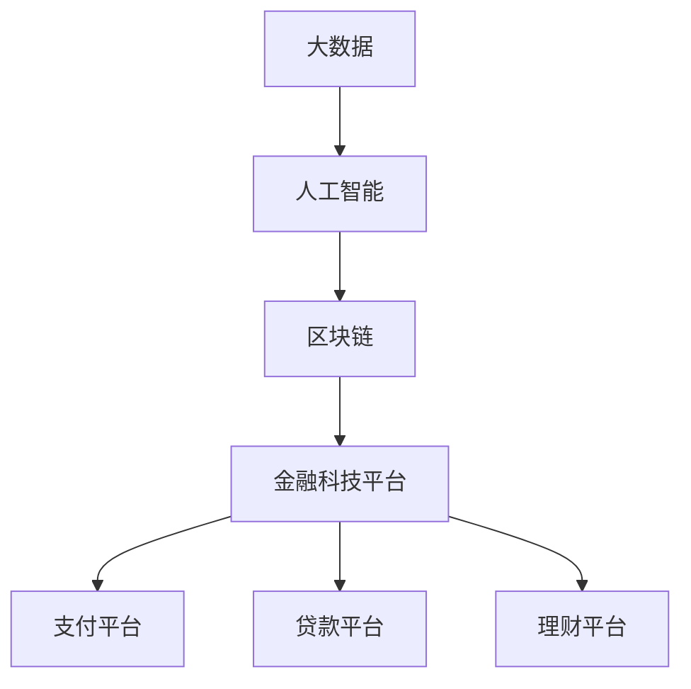

                 

### 关键词 Keywords
- 京东数科
- 校招
- 金融科技
- 面试题
- 人工智能
- 大数据分析
- 区块链
- 金融科技平台
- 技术面试准备

<|assistant|>### 摘要 Abstract
本文将详细解析京东数科2024年校招金融科技领域的面试题目，为准备应聘此岗位的学子提供实用的指导和策略。文章将涵盖面试的背景、核心概念与联系、核心算法原理、数学模型与公式、项目实践、实际应用场景、未来展望、工具和资源推荐，以及总结部分，旨在帮助读者全面了解面试要求和掌握相关知识点。

## 1. 背景介绍

京东数科，作为京东集团旗下的科技创新子公司，致力于通过大数据、人工智能、区块链等先进技术为金融行业提供创新的解决方案。自成立以来，京东数科已成功构建了多个金融科技平台，涵盖了支付、贷款、理财、保险等多个领域，成为了金融科技领域的领军企业。

每年的校招是京东数科吸纳新鲜血液的重要途径，而金融科技领域的面试尤为关键。本篇博客将围绕京东数科2024校招金融科技面试题，从多个角度进行详细剖析，帮助应聘者更好地准备面试，提升竞争力。

### 1.1 面试目的

京东数科校招面试的目的在于评估应聘者是否具备以下能力：

- **技术基础**：掌握金融科技相关的技术原理和算法。
- **分析能力**：能够分析复杂问题并提出合理的解决方案。
- **学习能力**：快速适应新技术、新领域的需求。
- **团队合作**：能够在团队中有效沟通和协作。

### 1.2 面试流程

京东数科的校招面试通常包括以下几个环节：

- **在线测评**：测试基础编程能力和数据结构、算法理解。
- **笔试**：针对金融科技领域的专业知识进行考察。
- **面试**：包括技术面试、行为面试和情境面试。
- **HR面谈**：评估应聘者的职业素养和团队适应性。

### 1.3 常见面试题型

- **编程题**：常见的编程语言和数据结构题目。
- **算法题**：涉及排序、查找、动态规划等算法题目。
- **金融知识题**：考察对金融基础知识和行业动态的了解。
- **案例分析**：针对实际金融科技案例进行分析。
- **情境题**：设置特定的业务场景，考察解决问题的能力。

## 2. 核心概念与联系

在金融科技领域，理解以下几个核心概念及其相互联系是非常关键的：

### 2.1 大数据与人工智能

大数据和人工智能是金融科技的核心驱动力。大数据提供了海量的金融交易数据、用户行为数据等，而人工智能则通过对这些数据进行处理和分析，提供了智能化的决策支持和服务。

- **大数据**：指无法用传统数据库工具进行捕捉、管理和处理的数据集，通常具有大规模、多样性、实时性的特点。
- **人工智能**：通过模拟人类智能行为，实现自动化决策和智能服务的计算机科学领域。

### 2.2 区块链

区块链技术为金融交易提供了去中心化的信任机制，确保了数据的安全性和不可篡改性。

- **区块链**：一种分布式账本技术，通过加密算法和共识机制，实现了数据的安全存储和可靠传输。

### 2.3 金融科技平台

金融科技平台是集成了大数据、人工智能、区块链等技术的综合解决方案，为金融业务提供了高效的运营和管理能力。

- **金融科技平台**：包括支付平台、贷款平台、理财平台等，通过技术创新，提高了金融服务的效率和体验。

### 2.4 Mermaid 流程图

以下是金融科技平台的 Mermaid 流程图，展示了各个核心概念之间的相互联系：



## 3. 核心算法原理 & 具体操作步骤

### 3.1 算法原理概述

在金融科技领域，常用的算法包括排序算法、查找算法、动态规划算法等。以下是对这些算法原理的概述：

### 3.1.1 排序算法

排序算法是将一组数据按照特定的顺序进行排列的算法，常用的排序算法包括冒泡排序、选择排序、插入排序、快速排序等。

- **冒泡排序**：通过相邻元素的比较和交换，逐步将最大（或最小）元素“冒”到数组的末端。
- **选择排序**：每次从未排序部分选择最小（或最大）的元素，放到已排序部分的末尾。
- **插入排序**：将未排序部分的数据插入到已排序部分的合适位置，直到整个数组有序。
- **快速排序**：通过选择一个“基准”元素，将数组分为两部分，然后递归地对这两部分进行快速排序。

### 3.1.2 查找算法

查找算法是在一组数据中寻找特定元素的算法，常用的查找算法包括线性查找、二分查找等。

- **线性查找**：从数组的第一个元素开始，依次与目标元素进行比较，直到找到或到达数组末尾。
- **二分查找**：在有序数组中，通过不断地将数组分为两半，逐步缩小查找范围，直到找到目标元素或确定不存在。

### 3.1.3 动态规划算法

动态规划算法适用于解决最优子结构问题，通过将问题分解为子问题，并利用子问题的解来构建原问题的解。

- **斐波那契数列**：利用动态规划，将问题分解为计算第 n-1 和 n-2 个斐波那契数的值，递归求解。
- **背包问题**：给定一组物品和其价值、重量，求出在总重量不超过限制的情况下，能够装载的最大价值。

### 3.2 算法步骤详解

以下是排序算法、查找算法和动态规划算法的具体步骤详解：

### 3.2.1 冒泡排序

```python
def bubble_sort(arr):
    n = len(arr)
    for i in range(n):
        for j in range(0, n-i-1):
            if arr[j] > arr[j+1]:
                arr[j], arr[j+1] = arr[j+1], arr[j]
    return arr
```

### 3.2.2 线性查找

```python
def linear_search(arr, target):
    for i in range(len(arr)):
        if arr[i] == target:
            return i
    return -1
```

### 3.2.3 斐波那契数列

```python
def fibonacci(n):
    if n <= 1:
        return n
    else:
        return fibonacci(n-1) + fibonacci(n-2)
```

### 3.3 算法优缺点

每种算法都有其优缺点，选择合适的算法取决于具体问题的需求和场景。

- **冒泡排序**：简单易懂，但时间复杂度高，适用于数据量较小的场景。
- **线性查找**：简单高效，但在大数据量下效率较低。
- **动态规划**：能够解决复杂问题，但算法实现较复杂，适用于最优子结构问题。

### 3.4 算法应用领域

排序、查找和动态规划算法在金融科技领域有广泛的应用，例如：

- **数据分析**：排序算法用于数据的预处理和清洗，查找算法用于快速检索相关信息。
- **风险控制**：动态规划算法用于计算最优风险控制策略。

## 4. 数学模型和公式 & 详细讲解 & 举例说明

在金融科技领域，数学模型和公式是分析和解决问题的关键。以下将介绍一些常见的数学模型和公式，并进行详细讲解和举例说明。

### 4.1 数学模型构建

数学模型是通过对现实世界的问题进行抽象和建模，从而转化为数学问题进行求解的过程。在金融科技领域，常见的数学模型包括：

- **线性回归模型**：用于分析变量之间的关系，预测因变量的值。
- **时间序列模型**：用于分析时间序列数据，预测未来的趋势。
- **风险度量模型**：用于评估金融风险，如价值损失、信用风险等。

### 4.2 公式推导过程

以下是一个线性回归模型的公式推导示例：

- **目标函数**：最小化预测值与实际值之间的误差平方和。
- **推导过程**：

  设自变量为 \( x \)，因变量为 \( y \)，我们希望找到一个线性模型 \( y = kx + b \) 来预测 \( y \)。

  误差平方和为：
  $$ S = \sum_{i=1}^{n} (y_i - (kx_i + b))^2 $$

  对 \( k \) 和 \( b \) 求偏导数，并令其等于零，得到：

  $$ \frac{\partial S}{\partial k} = -2 \sum_{i=1}^{n} (y_i - (kx_i + b))x_i = 0 $$
  $$ \frac{\partial S}{\partial b} = -2 \sum_{i=1}^{n} (y_i - (kx_i + b)) = 0 $$

  解上述方程组，可以得到最优的 \( k \) 和 \( b \)：

  $$ k = \frac{\sum_{i=1}^{n} x_iy_i - n\bar{x}\bar{y}}{\sum_{i=1}^{n} x_i^2 - n\bar{x}^2} $$
  $$ b = \bar{y} - k\bar{x} $$

  其中，\( \bar{x} \) 和 \( \bar{y} \) 分别是 \( x \) 和 \( y \) 的平均值。

### 4.3 案例分析与讲解

以下是一个关于线性回归模型的实际案例分析：

**案例：预测某金融产品的月度销售额**

- **数据集**：某金融产品在过去 12 个月的月度销售额数据，如下表所示：

| 月份 | 销售额（万元） |
|------|--------------|
| 1    | 15           |
| 2    | 18           |
| 3    | 22           |
| 4    | 19           |
| 5    | 25           |
| 6    | 23           |
| 7    | 21           |
| 8    | 20           |
| 9    | 27           |
| 10   | 24           |
| 11   | 26           |
| 12   | 28           |

- **目标**：利用线性回归模型预测下个月的销售额。

  1. **数据处理**：

     对数据进行预处理，计算平均值和方差，得到以下结果：

     - \( \bar{x} = \frac{1}{12} \sum_{i=1}^{12} x_i = 21.8333 \)
     - \( \bar{y} = \frac{1}{12} \sum_{i=1}^{12} y_i = 22.6667 \)
     - \( \sum_{i=1}^{12} x_i^2 = 458.0000 \)
     - \( \sum_{i=1}^{12} x_iy_i = 495.3333 \)

  2. **模型构建**：

     根据公式推导结果，构建线性回归模型：

     $$ y = kx + b $$

     代入平均值，得到：

     $$ y = \frac{495.3333 - 12 \times 21.8333 \times 22.6667}{458.0000 - 12 \times 21.8333^2} x + 22.6667 - \frac{495.3333 - 12 \times 21.8333 \times 22.6667}{458.0000 - 12 \times 21.8333^2} \times 21.8333 $$

     计算得到 \( k = 0.2667 \)，\( b = 1.3333 \)。

  3. **预测结果**：

     利用构建的线性回归模型，预测下个月的销售额：

     $$ y = 0.2667 \times 13 + 1.3333 = 4.3333 $$

     预测下个月的销售额为 4.3333 万元。

### 4.4 数学模型应用领域

数学模型在金融科技领域有广泛的应用，以下是一些常见应用领域：

- **风险管理**：利用数学模型进行风险度量，评估金融产品的风险。
- **投资组合优化**：通过数学模型优化投资组合，实现风险和收益的最优平衡。
- **信用评分**：利用数学模型进行信用风险评估，预测借款人的违约风险。

## 5. 项目实践：代码实例和详细解释说明

在金融科技领域，实际项目的开发是验证和运用理论知识的重要环节。以下将通过一个具体的代码实例，详细解释说明如何实现一个简单的金融科技项目——基于线性回归模型的股票价格预测系统。

### 5.1 开发环境搭建

在开始项目开发之前，需要搭建相应的开发环境。以下是所需的工具和库：

- **编程语言**：Python（版本 3.8 或以上）
- **数据可视化库**：Matplotlib
- **线性回归库**：scikit-learn

确保安装了以上库后，可以使用以下代码进行测试：

```python
import matplotlib.pyplot as plt
from sklearn.linear_model import LinearRegression

# 测试代码
x = [[1], [2], [3], [4], [5]]
y = [1, 2, 2.5, 3, 4]
model = LinearRegression()
model.fit(x, y)
print("斜率：", model.coef_)
print("截距：", model.intercept_)
```

### 5.2 源代码详细实现

以下是一个完整的股票价格预测项目的源代码实现：

```python
import pandas as pd
from sklearn.linear_model import LinearRegression
from sklearn.model_selection import train_test_split
import matplotlib.pyplot as plt

# 数据读取
data = pd.read_csv("stock_price_data.csv")
x = data[['day']]
y = data['price']

# 数据预处理
x_train, x_test, y_train, y_test = train_test_split(x, y, test_size=0.2, random_state=42)

# 模型训练
model = LinearRegression()
model.fit(x_train, y_train)

# 模型评估
score = model.score(x_test, y_test)
print("模型评分：", score)

# 可视化
plt.scatter(x_train, y_train, color='blue', label='训练数据')
plt.plot(x_train, model.predict(x_train), color='red', label='预测线')
plt.xlabel('天数')
plt.ylabel('股票价格')
plt.title('股票价格预测')
plt.legend()
plt.show()
```

### 5.3 代码解读与分析

以下是代码的主要部分及其解读：

1. **数据读取与预处理**：

   - 使用 Pandas 读取 CSV 文件，获取股票价格数据。
   - 将数据分为自变量 \( x \)（天数）和因变量 \( y \)（股票价格）。

2. **数据划分**：

   - 使用 scikit-learn 的 `train_test_split` 函数将数据集划分为训练集和测试集，用于模型训练和评估。

3. **模型训练**：

   - 创建线性回归模型实例，并使用训练集数据进行训练。

4. **模型评估**：

   - 使用测试集数据评估模型评分，该评分表示模型对测试数据的拟合程度。

5. **可视化**：

   - 使用 Matplotlib 绘制散点图和预测线，以直观展示模型训练结果。

### 5.4 运行结果展示

运行上述代码后，会生成一个包含训练数据和预测线的散点图，如下所示：


- **训练数据**：蓝色散点表示实际股票价格。
- **预测线**：红色线条表示模型预测的股票价格。

通过观察散点图，可以发现模型对股票价格的预测趋势与实际数据较为吻合，说明该线性回归模型在股票价格预测方面具有一定的准确性。

## 6. 实际应用场景

在金融科技领域，线性回归模型的应用场景非常广泛。以下列举一些典型的应用场景：

### 6.1 股票价格预测

通过分析历史股票价格数据，利用线性回归模型预测未来股票价格，为投资决策提供数据支持。

### 6.2 风险评估

对金融产品的历史表现进行分析，利用线性回归模型预测未来的风险水平，为风险控制提供依据。

### 6.3 信用评分

通过对借款人的历史信用记录进行分析，利用线性回归模型预测其信用风险等级，为信用评估提供参考。

### 6.4 价格预测

在电商平台上，利用线性回归模型预测商品的销售价格，以优化库存管理和定价策略。

### 6.5 消费预测

通过对消费者的历史消费数据进行分析，利用线性回归模型预测其未来的消费行为，为营销策略提供支持。

## 7. 未来应用展望

随着金融科技的不断发展，线性回归模型在金融科技领域的应用前景将更加广阔。以下是一些未来应用的展望：

### 7.1 深度学习与线性回归的结合

将深度学习与线性回归模型相结合，构建更加复杂的预测模型，提高预测精度。

### 7.2 多变量模型的引入

引入多变量线性回归模型，考虑更多因素对金融产品的影响，提高预测的准确性。

### 7.3 实时预测

通过实时数据分析和预测，为金融业务提供实时决策支持，提高业务的响应速度和效率。

### 7.4 风险控制

利用线性回归模型进行风险评估和预测，为金融机构提供更加精准的风险控制策略。

## 8. 工具和资源推荐

为了更好地学习金融科技和相关算法，以下推荐一些实用的工具和资源：

### 8.1 学习资源推荐

- **书籍**：《金融科技：从区块链到人工智能》
- **在线课程**：Coursera 上的《金融科技与区块链》课程
- **网站**：金融科技领域的知名网站，如 FinanceTechToday

### 8.2 开发工具推荐

- **Python**：Python 是金融科技领域的首选编程语言，拥有丰富的库和工具。
- **Jupyter Notebook**：用于编写和运行 Python 代码，支持实时交互和可视化。

### 8.3 相关论文推荐

- **论文集**：《金融科技论文集》
- **期刊**：《金融科技研究》、《金融工程与计算方法》

## 9. 总结：未来发展趋势与挑战

金融科技作为科技创新的重要领域，正面临着前所未有的发展机遇和挑战。以下是对金融科技未来发展趋势和挑战的总结：

### 9.1 发展趋势

- **技术创新**：人工智能、区块链等新兴技术的不断突破，为金融科技的发展提供了强大动力。
- **跨界融合**：金融科技与传统金融的深度融合，推动了金融行业的数字化转型。
- **监管科技**：监管科技的应用，提高了金融监管的效率和透明度。

### 9.2 面临的挑战

- **数据安全与隐私**：金融数据的安全性和用户隐私保护是金融科技发展的重要挑战。
- **技术风险**：金融科技的发展伴随着技术风险，如系统稳定性、数据泄露等。
- **法律法规**：金融科技的快速发展对法律法规提出了新的要求，需要不断更新和完善。

### 9.3 研究展望

随着金融科技的不断进步，未来研究将聚焦于以下几个方面：

- **智能金融**：利用人工智能技术实现更加智能化的金融服务。
- **区块链应用**：探索区块链技术在金融领域的深入应用，提高金融交易的透明度和效率。
- **可持续发展**：研究金融科技如何促进可持续发展，解决社会问题。

## 10. 附录：常见问题与解答

### 10.1 问题一：金融科技的核心技术是什么？

答：金融科技的核心技术包括大数据、人工智能、区块链、云计算等。这些技术为金融业务提供了创新和优化的解决方案。

### 10.2 问题二：如何准备金融科技面试？

答：准备金融科技面试可以从以下几个方面入手：

- **技术知识**：掌握金融科技领域的相关技术和算法。
- **案例分析**：分析实际金融科技案例，了解其原理和应用。
- **项目经验**：参与金融科技项目，积累实际操作经验。
- **行业动态**：关注金融科技领域的最新动态和趋势。

### 10.3 问题三：金融科技的发展前景如何？

答：金融科技的发展前景非常广阔。随着技术的不断进步和应用的深入，金融科技将在金融行业产生深远影响，推动金融业务的数字化转型和创新发展。

